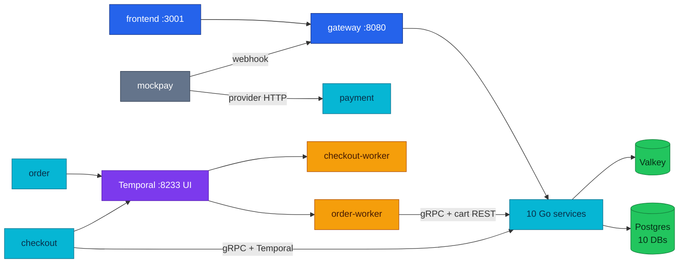

# Microservices Catalog

| Attribute | Value | RFC / ADR |
|-----------|-------|-----------|
| **Status** | Living reference — the **understanding-the-system** catalog | — |
| **Covers** | Per-service feature matrix (feature → API → technique → status) and data ownership | — |
| **Related** | [api.md](api.md) (shared conventions, topology, call graph) · [workflows.md](workflows.md) · [service contracts](README.md#service-contracts) | — |
| **Area hub** | [docs/api/README.md](README.md) | — |
| **Design record** | — | None |

This document is the **understanding-the-system** reference. It does **not**
restate every endpoint (see the [service contract index](api.md#service-contract-index));
it answers, per service: *what features exist, which API surface (if any) each
feature has, and which technique implements it* — plus data ownership.

---

## 1. Platform shape

10 Go backend services (Go 1.26, Gin, HTTP `:8080`) plus a React/Vite SPA,
fronted by **Kong pass-through** in both environments; each service follows the
3-layer `web → logic → core` model and the Variant A URL shape
`/{service}/v1/{audience}/{resource…}`. The topology diagram and shared
HTTP/gRPC rules are owned by
[api.md § Platform API Topology](api.md#platform-api-topology).

---

## 2. Deployment snapshot (local stack)

The local end-to-end stack ([`local-stack/compose.yaml`](../../local-stack/compose.yaml))
mirrors the **app plane** (10 HTTP services), **workflow plane** (Temporal +
`order-worker` + `checkout-worker`), **provider stub** (`mockpay`), and edge
(frontend + Kong). Shared infra (Postgres, Valkey) and the observability pipeline
(OTel collector, Victoria*, ClickHouse, Grafana, Pyroscope) are internal-only —
see [`local-stack/README.md`](../../local-stack/README.md) for host ports and
audit gates.

Postgres, Valkey, Temporal, app services, workers, mockpay, gateway, and
frontend are health-gated. Most observability containers start on
`service_started`; **ClickHouse** is health-gated and blocks the collector and
Grafana until ready.

| Component | HTTP | gRPC | Database (local) | Cache | Runtime deps / callers |
|-----------|------|------|------------------|-------|------------------------|
| auth | `:8080` | — | `auth` | — | none outbound (JWKS validated *by* everyone) |
| user | `:8080` | — | `user` | — | auth (JWKS); caller: Kong |
| product | `:8080` | `:9090` server | `product` | Valkey | review (gRPC); callers: Kong, checkout, order-worker |
| cart | `:8080` | `:9090` server | `cart` | — | auth (JWKS); callers: Kong, checkout (`GetCart`), order/order-worker (REST) |
| order | `:8080` | `:9090` server | `order` | — | auth (JWKS), Temporal, shipping/payment (gRPC), cart (REST); callers: Kong, checkout (`CreateOrder`) |
| review | `:8080` | `:9090` server | `review` | — | auth (JWKS); callers: Kong, product (gRPC) |
| shipping | `:8080` | `:9090` server | `shipping` | — | none outbound; callers: Kong, checkout, order, order-worker |
| notification | `:8080` | `:9090` server | `notification` | — | auth (JWKS); callers: Kong, order-worker (`SendEmail`) |
| payment | `:8080` | `:9090` server | `payment` | — | auth (JWKS), mockpay (HTTP); callers: Kong, order (GetPayment), order-worker (saga money) |
| checkout | `:8080` internal-only | client only | `checkout` | — | auth (JWKS), cart/product/shipping/order (gRPC), Temporal; caller: Kong only |
| order-worker | `:8080` health | client only | `order` | — | Temporal; product/shipping/notification/payment (gRPC), cart (REST clear) |
| checkout-worker | `:8080` health | — | `checkout` | — | Temporal (`AbandonedCheckoutWorkflow`; DB-only activities) |
| mockpay | `:8080` | — | — | — | called by payment; webhooks → gateway → payment public route |
| temporal | — (`7233` gRPC, `8233` UI) | — | — (in-memory dev) | — | callers: order, checkout, both workers |
| gateway (Kong 3.9) | `8000` → host `8080` | — | — | Valkey (rate-limit) | all 10 services + cache; callers: frontend, browser, mockpay webhooks |
| frontend | `80` → host `3001` | — | — | — | gateway only |

> **In-cluster differences (production):** `platform-db` (CloudNativePG behind **`platform-db-pooler-rw.platform.svc.cluster.local:5432`** — auth/user/notification/shipping/review; Temporal connects **direct** to `platform-db-rw.platform:5432`);
> `product-db` (CloudNativePG behind the **pgdog-product** pooler — `product`/`cart`/`order`/`checkout`/`payment`
> databases; payment connects **direct over TLS, bypassing PgDog**).
> Locally these collapse into one Postgres with 10 service databases. See [`../databases/`](../databases/).
> **Logging is unified** — all 10 services log via the shared `pkg/logger` zap wrapper
> (`zapx`), teed into the OTLP pipeline (RFC-0014 P4).

---

## 3. Service feature matrix

**How to read:** one row per *behavior* (not per endpoint). The **API** column
names the surface — the full canonical path `/{service}/v1/{audience}/{resource…}`
or the gRPC RPC — and `—` for background features; full route and payload contracts live in the [owning service file](README.md#service-contracts); shared rules live in [api.md](api.md). **Technique** uses the canonical names from
the [technique index](#4-technique-index-platform-wide) (§4) — the two must stay
in sync. **Status** ∈ `Implemented` / `Partial` / `Technical debt` / `No caller` / `Planned` / `None` (shared vocabulary — see [README.md § Service contracts](README.md#service-contracts)).

### auth — identity

> Owns `users` (credentials) and refresh-token families; DB `auth` on `platform-db`
> (CloudNativePG, via PgDog `platform-db-pooler-rw`). Public-only HTTP — no JWT middleware, no gRPC
> server (HTTP-only since RFC-0009 Phase 5; services verify JWTs locally).

| Feature | API | Technique | Depends on | Status | Ref |
|---|---|---|---|---|---|
| **Token mint** (login/register) | `POST /auth/v1/public/auth/login`, `POST /auth/v1/public/auth/register` | RS256 JWT (1 h TTL, `kid` header); bcrypt verification | — | Implemented | RFC-0009 |
| **JWKS publish** | `GET /auth/v1/public/auth/jwks` | single-key JWKS, `Cache-Control: max-age=300` | — | Implemented | RFC-0009 |
| **Refresh rotation** | `POST /auth/v1/public/auth/refresh`, `POST /auth/v1/public/auth/logout` | rotating refresh tokens: opaque 32-byte token, sha256 hash at rest, family-tracked, reuse detection revokes the family (30 d TTL) | — | Implemented | — |
| **Login hardening** | (part of `/auth/v1/public/auth/login`) | constant-time dummy-hash on user-not-found (no username enumeration); generic 401 for both bad-user and bad-password | — | Implemented | — |

### user — profiles

> Owns user profiles; DB `user` on `platform-db` (CloudNativePG, via `platform-db-pooler-rw`). Verifies JWTs
> locally via `pkg/authmw`.

| Feature | API | Technique | Depends on | Status | Ref |
|---|---|---|---|---|---|
| **Public profile view** | `GET /user/v1/public/users/:id` | minimal projection (`id` + `name`, no PII) from real persistence | — | Implemented | — |
| **Own profile read/update** | `GET/PUT /user/v1/private/users/profile` | JWT-subject scoping (ownership-scoped queries); partial update preserves unset fields (COALESCE) | auth JWKS | Implemented | — |
| **Internal profile create** | `POST /user/v1/internal/users` | requires an authoritative `user_id` from the caller (never synthesized) | — | **No caller** (auth registers into its own DB and does not call this) | [user.md](user.md) |

### product — catalog (+ cache, stock)

> Owns products, categories, stock (13 demo rows seeded locally); DB `product` on
> `product-db` (CloudNativePG, via PgDog). Valkey cache. Serves gRPC on `:9090`.

| Feature | API | Technique | Depends on | Status | Ref |
|---|---|---|---|---|---|
| **Catalog list/read** | `GET /product/v1/public/products`, `GET /product/v1/public/products/:id` | cache-aside (Valkey): SETNX stampede lock (5 s TTL, token compare-and-delete release), TTL jitter 0–10 %, SCAN-based list invalidation; whitelisted sort/filter (injection-safe) | Valkey | Implemented | [caching](./caching.md) |
| **Product-details aggregation** | `GET /product/v1/public/products/:id/details` | server-side aggregation: reviews via gRPC `ReviewService.GetProductReviews` (3 s deadline, soft-fail → `[]`) + stock + related | review | Implemented | [API call graph](api.md#current-east-west-call-graph) |
| **Stock reservation** (saga step) | internal gRPC `ProductService.ReserveStock` / `ReleaseStock` | ledger-backed reservation, idempotent by `reservation_id` (= order id); insufficient stock → `FailedPrecondition` | caller: order-worker | Implemented | [temporal saga](temporal-order-fulfillment.md) |
| **Checkout batch read** | internal gRPC `ProductService.GetProducts` | cache-bypassing price/stock batch (product = checkout price authority); int64 minor units; unknown ids omitted | caller: checkout | Implemented (RFC-0015 P1) | [ADR-020](../proposals/adr/ADR-020-checkout-revalidation-policy/) |
| **Product create** | `POST /product/v1/internal/products` | admin/seed path | — | Implemented | — |

> **Known defect:** the service still emits its own CORS headers on top of the
> gateway's (duplicate `Access-Control-Allow-Origin`) — see §6.

### checkout — session orchestrator (RFC-0015 P1-P5)

> Owns `checkout_sessions`, item snapshots, totals, promo attachment, and
> confirm idempotency. DB `checkout` on `product-db` (CloudNativePG, via PgDog).
> The service is client-only: Kong calls its HTTP API and it calls cart, product,
> shipping, and order over gRPC. **One binary, two deployments:** `checkout`
> (API) and `checkout-worker` (Temporal worker — `AbandonedCheckoutWorkflow`,
> task queue `checkout`). P1-P5 ship in local-stack and the cluster.

| Feature | API | Technique | Depends on | Status | Ref |
|---|---|---|---|---|---|
| **Session lifecycle** | `POST /checkout/v1/private/checkout/sessions`, `GET/DELETE /checkout/v1/private/checkout/sessions/:id`, `PUT /checkout/v1/private/checkout/sessions/:id/address` (process-named `checkout` segment — see checkout.md) | explicit FSM, one active session per user, ownership-scoped queries (anti-IDOR), DB-authoritative TTL | auth JWKS, cart, product | Implemented (P1) | [checkout](checkout.md) |
| **Price re-validation** | session create and confirm | cart owns quantities; product `GetProducts` owns current price and availability; changed lines are explicit | cart, product | Implemented (P1-P2) | ADR-020/021 |
| **Shipping and totals** | `PUT /checkout/v1/private/checkout/sessions/:id/shipping` | shipping `GetQuote`; SQL recomputes subtotal + fee + tax - discount in minor units | shipping | Implemented (P3) | [checkout](checkout.md#totals-p3-implemented--one-composition-rule-owned-by-sql) |
| **Payment selection** | `PUT /checkout/v1/private/checkout/sessions/:id/payment` | opaque `tok_` reference only; PAN-like input rejected before persistence | — | Implemented (P2) | [checkout](checkout.md) |
| **Promo preview and redemption** | `POST/DELETE /checkout/v1/private/checkout/sessions/:id/promo` | preview on apply; serialized, idempotent redemption inside confirm | Postgres | Implemented (P4) | ADR-022 |
| **Confirm and order handoff** | `POST /checkout/v1/private/checkout/sessions/:id/confirm` | required `Idempotency-Key`; confirm-time revalidation; gRPC `order.v1/CreateOrder` | product, order | Implemented (P2) | ADR-018 |
| **Abandonment** | background Temporal workflow | durable wake-up plus DB-authoritative `expires_at`; lazy expiry remains the correctness backstop | Temporal | Implemented (P2) | ADR-019 |
| **Cluster delivery** | — | ResourceSet input, CNPG triplet, gRPC caller NetworkPolicies | platform GitOps | **Implemented (P5)** | RFC-0015 |

### cart — shopping cart

> Owns `cart_items`; DB `cart` on `product-db` (CloudNativePG, via PgDog). Verifies JWTs
> locally via `pkg/authmw`.

| Feature | API | Technique | Depends on | Status | Ref |
|---|---|---|---|---|---|
| **Cart CRUD** | `GET/POST/DELETE /cart/v1/private/cart`, `GET /cart/v1/private/cart/count`, `PATCH/DELETE /cart/v1/private/cart/items/:itemId` | fail-closed JWT (`user_id` from token, never body — ownership-scoped queries); UPSERT `ON CONFLICT (user_id, product_id)`; server-side subtotal math (empty cart = 0 shipping) | auth JWKS | Implemented | — |
| **Saga cart-clear** | `DELETE /cart/v1/internal/cart/:userId` | tokenless in-cluster endpoint, NetworkPolicy-fenced; called best-effort by the saga's `ClearCart` step | caller: order-worker | Implemented | [temporal saga](temporal-order-fulfillment.md) |
| **gRPC read surface** | `cart.v1/GetCart` (`:9090`) | read-only snapshot for checkout (RFC-0015); prices → int64 minor units at this boundary; writes deliberately stay REST (ADR-021) | caller: checkout | Implemented (local-stack + cluster) | [ADR-021](../proposals/adr/ADR-021-cart-grpc-read-surface/) |

### order — orders & checkout fulfillment

> Owns `orders`, `order_items`; DB `order` on `product-db` (CloudNativePG, via PgDog).
> Verifies JWTs locally via `pkg/authmw`. **One binary, two deployments:**
> `order` (API) and `order-worker` (Temporal worker — the `worker` subcommand of
> the same binary). Serves idempotent `order.v1/CreateOrder` on gRPC `:9090` and also acts as a gRPC client.

| Feature | API | Technique | Depends on | Status | Ref |
|---|---|---|---|---|---|
| **Order reads** | `GET /order/v1/private/orders`, `GET /order/v1/private/orders/:id` | ownership-scoped queries (`WHERE id AND user_id` — anti-IDOR) | auth JWKS | Implemented | — |
| **Checkout → durable fulfillment** | `POST /order/v1/private/orders` (legacy direct create) and internal gRPC `order.v1/CreateOrder` (both return a `pending` order and start the same durable workflow) | **Temporal saga** `OrderFulfillmentWorkflow` (workflow id `order-fulfillment-<orderID>`): authorize payment → reserve stock → create shipment → capture → **confirm (pivot)** → notify + receipt → clear cart; compensations run in reverse (void pre-capture / refund post-pivot); server-side order-math validation; atomic order+items insert; saga start on a detached 5 s context (checkout never fails on Temporal outage — order stays `pending`) | Temporal; product, shipping, payment, notification (gRPC); cart (REST) | Implemented; legacy REST create is **Technical debt** (P6 removal, RFC-0015 — see [§6](#6-known-gaps--ongoing-work)) | [Temporal Saga and 2PC](temporal-order-fulfillment.md) |
| **Order-details aggregation** | `GET /order/v1/private/orders/:id/details` | gRPC fan-out with soft-fail enrichment: `GetShipmentByOrder` and `GetPayment` — the `shipment`/`payment` blocks are omitted (`omitempty`) when absent or unavailable | shipping, payment | Implemented | [API call graph](api.md#current-east-west-call-graph) |
| **Server-side pricing** | — (calls cart) | REST `GET /cart/v1/private/cart` with the user's forwarded `Authorization` — cart is the pricing authority at checkout | cart | **Technical debt** (P6 removal, RFC-0015 — see [§6](#6-known-gaps--ongoing-work)) | — |
| **Saga worker** | — (Temporal task queue `order-fulfillment`) | `worker` subcommand of the same image; registers workflow + activities; fail-fast if Temporal is unreachable | Temporal | Implemented | [temporal saga](temporal-order-fulfillment.md) |

### review — product reviews

> Owns `reviews` (rating 1–5, comment); DB `review` on `platform-db`
> (CloudNativePG, via `platform-db-pooler-rw`). Verifies JWTs locally via `pkg/authmw`. Serves gRPC on `:9090`.

| Feature | API | Technique | Depends on | Status | Ref |
|---|---|---|---|---|---|
| **Review list** | `GET /review/v1/public/reviews?product_id=…` | required `product_id` (missing → 400); paginated | — | Implemented | — |
| **Review create** | `POST /review/v1/private/reviews` | JWT (`user_id` from token — no impersonation); `UNIQUE (product_id, user_id)` + SQLSTATE `23505` → `409` (race-safe duplicate handling) | auth JWKS | Implemented | — |
| **Review feed for product details** | internal gRPC `ReviewService.GetProductReviews` | thin adapter over the same logic layer as the HTTP list | caller: product | Implemented | [API call graph](api.md#current-east-west-call-graph) |

### shipping — tracking, estimates & shipment lifecycle

> Owns `shipments`; DB `shipping` on `platform-db` (CloudNativePG, via `platform-db-pooler-rw`). No JWT
> middleware (public + internal surfaces only). Serves gRPC on `:9090`.

| Feature | API | Technique | Depends on | Status | Ref |
|---|---|---|---|---|---|
| **Tracking** | `GET /shipping/v1/public/shipments/track` | lookup by `tracking_number` (legacy `trackingId` fallback); NULL-safe carrier scan | — | Implemented | — |
| **Estimate** | `GET /shipping/v1/public/shipments/estimate` | weight validation rejects `≤0`/`NaN`/`±Inf` → 400 | — | Implemented | — |
| **Shipment lifecycle** (saga steps) | internal gRPC `ShippingService.CreateShipment` / `CancelShipment` | idempotent by `order_id` | caller: order-worker | Implemented | [temporal saga](temporal-order-fulfillment.md) |
| **Shipment read for order details** | internal gRPC `GetShipmentByOrder` (HTTP twin: `GET /shipping/v1/internal/shipments/orders/:orderId`) | missing shipment → empty response (caller soft-fails to `null`) | caller: order | Implemented (HTTP twin: **No caller**) | [API call graph](api.md#current-east-west-call-graph) |

### notification — user notifications

> Owns `notifications`; DB `notification` on `platform-db` (CloudNativePG, via `platform-db-pooler-rw`).
> Verifies JWTs locally via `pkg/authmw` on private routes. Serves gRPC on
> `:9090`. Deployed in-cluster (comms domain) **and** in the local stack — the
> frontend's notification badge resolves against it.

| Feature | API | Technique | Depends on | Status | Ref |
|---|---|---|---|---|---|
| **Notification inbox** | `GET /notification/v1/private/notifications`, `GET /notification/v1/private/notifications/count`, `GET/PATCH /notification/v1/private/notifications/:id`, `PATCH /notification/v1/private/notifications/read-all` | JWT; owner-scoped reads/mutations (`(id, user_id)` — anti-IDOR); paginated list | auth JWKS | Implemented | — |
| **Order emails** (saga side-effects) | internal gRPC `NotificationService.SendEmail` | called best-effort by the saga (order-created, receipt, refund notice) on a detached context | caller: order-worker | Implemented | [temporal saga](temporal-order-fulfillment.md) |
| **Internal notify twins + SMS** | `POST /notification/v1/internal/notifications/email`, `POST /notification/v1/internal/notifications/sms`; gRPC `SendSMS` | HTTP twins of the gRPC path; SMS path fully unused | — | **No caller** | [notification.md](notification.md) |

### payment — payments, outbox & reconciliation

> Owns `payments`, refunds, the transactional outbox, and reconciliation runs;
> DB `payment` on `product-db` — connects **direct over TLS, bypassing PgDog**.
> Serves gRPC on `:9090` (reflection off). **Single replica by design**
> (single-writer outbox + per-instance ticker). **mockpay** is a subcommand of
> the same binary, run as a second deployment (provider selected via
> `MOCKPAY_URL`; unset → in-process stub, reconciliation disabled).

| Feature | API | Technique | Depends on | Status | Ref |
|---|---|---|---|---|---|
| **Saga money steps** | internal gRPC `PaymentService.Authorize` / `Capture` / `Void` / `Refund` | recovery-point idempotency (keys `order:<id>`, `refund:order:<id>`; checkpointed provider calls survive crash takeover); a decline is a business response, not a gRPC error | mockpay; caller: order-worker | Implemented | [RFC-0010](../proposals/rfc/RFC-0010/), ADR-009/010 |
| **Payment reads (browser)** | `GET /payment/v1/private/payments`, `GET /payment/v1/private/payments/:id` | JWT; owner-scoped | auth JWKS | Implemented | [payments.md](payments.md) |
| **Payment create (browser)** | `POST /payment/v1/private/payments` | requires `Idempotency-Key`; token-only `payment_method` (`tok_…`, PAN-like digit runs rejected); shared validators across HTTP and gRPC | auth JWKS | Implemented | [payments.md](payments.md) |
| **Payment enrichment for order details** | internal gRPC `GetPayment` (by order id) | read snapshot; caller soft-fails | caller: order | Implemented | [payments.md](payments.md) |
| **Provider webhook** | `POST /payment/v1/public/payments/webhooks/mockpay` | **webhook HMAC**: `Mockpay-Signature: t=…,v1=…` — HMAC-SHA256 over the raw body, constant-time compare, ±5 min replay window, fail-closed on empty secret, 1 MiB body cap | mockpay | Implemented | RFC-0010 |
| **Outbox relay** | — (background loop) | **transactional outbox** — events enqueued in the same tx as the money movement, drained by a 10 s single-writer relay (at-least-once) | Postgres | Implemented | ADR-007 |
| **Reconciliation** | `POST /payment/v1/internal/payments/reconciliation/runs`, `GET /payment/v1/internal/payments/reconciliation/runs/:id` + 5-min ticker | detect-only ledger comparison; auto-heal flag-gated (`RECON_HEAL_ENABLED`, lost-capture-response class only); hourly retention reaper (30 d) | mockpay ledger | Implemented | ADR-011/012 |

### frontend — React SPA

Calls only the gateway at `/{service}/v1/{public,private}/…`; JWT stored in
`localStorage.authToken` and sent as `Authorization: Bearer`. Uses the
server-side aggregation endpoints (`/product/v1/public/products/:id/details`,
`/order/v1/private/orders/:id/details`) — no client-side orchestration. **gRPC
is never browser-facing.**

---

## 4. Technique index (platform-wide)

| Technique | What it solves | Where used | Deep-dive |
|---|---|---|---|
| **RS256 JWT + JWKS** | Stateless identity — no per-request auth hop | Mint: auth. Verify locally via `pkg/authmw`: user, cart, order, review, notification, payment, checkout | RFC-0009, [API auth model](api.md#authentication) |
| **Rotating refresh tokens** | Long-lived sessions without long-lived access tokens; reuse detection | auth (sha256 at rest, family revoke) | — |
| **Temporal saga** | All-or-nothing multi-service checkout with compensations | order (+ `order-worker`); participants: product, shipping, payment, notification, cart | [Temporal Saga and 2PC](temporal-order-fulfillment.md) |
| **Temporal abandonment timer** | Durable session expiry without polling the DB | checkout (+ `checkout-worker`); DB-authoritative `expires_at` (ADR-019) | [workflows.md](workflows.md#abandoned-checkout) |
| **Cache-aside (Valkey)** | Read-heavy hot paths | product (SETNX stampede lock, TTL jitter, SCAN invalidation) | [caching](./caching.md) |
| **Transactional outbox** | Reliable side-effects with the DB write (no dual-write gap) | payment (single-writer relay) | ADR-007 |
| **Reconciliation** | Detect provider/ledger drift | payment (ticker + internal trigger API, flag-gated auto-heal) | ADR-011/012 |
| **Webhook HMAC** | Authenticating an unauthenticated public caller | payment ← mockpay | RFC-0010 |
| **gRPC east-west (`:9090`)** | Typed internal transport | Servers: product, cart, order, review, shipping, notification, payment. Clients: product→review; order/order-worker→product, shipping, notification, payment; checkout→cart, product, shipping, order | [API call graph](api.md#current-east-west-call-graph) |
| **Idempotency** | Exactly-once effects under retries | HTTP `Idempotency-Key`: checkout confirm, order create, payment create/refund. Saga natural keys: `reservation_id`, shipment `order_id`, payment recovery points | ADR-010 |
| **Server-side aggregation** | No client-side orchestration | product `/details`, order `/details` (soft-fail enrichment) | — |
| **Ownership-scoped queries** | Anti-IDOR — rows fetched with `(id, user_id)` | checkout, order, notification, payment, cart, user (token-derived `user_id`) | — |
| **Embedded migrations** | Schema self-management per binary (golang-migrate) | all 10 services | [../databases/](../databases/) |

Rule: every value in a service table's **Technique** column appears here, and
every row here is used by at least one service table — that is this doc's
internal consistency check.

---

## 5. Inter-service communication map

The east-west call graph — every gRPC hop, the two documented cart REST
exceptions, transports, and failure modes — is owned by
[api.md § Current East-West Call Graph](api.md#current-east-west-call-graph);
transport details (addresses, dual-port, HTTP/2 load balancing) live in
[api.md § gRPC Runtime Model](api.md#grpc-runtime-model). The durable-workflow
hops behind `order-worker` and `checkout-worker` are indexed in
[workflows.md](workflows.md). Service-to-service target addresses are injected
as env vars — gRPC hops via `*_GRPC_ADDR`, the REST hops via
`CART_SERVICE_URL` — see `local-stack/compose.yaml` and the cluster ResourceSet
templates.

---

## 6. Known gaps & ongoing work

| Item | Service(s) | Status |
|------|------------|--------|
| Legacy `POST /order/v1/private/orders` (direct checkout bypass) | order | **Technical debt** — P6 removal planned (RFC-0015); checkout confirm is canonical |
| Legacy order→cart REST pricing on direct create | order | **Technical debt** — P6 removal planned; checkout/product own price authority |
| gRPC mTLS east-west | platform | **Planned** (RFC-0020); NetworkPolicy remains the fence until then |
| Duplicate CORS headers (service emits CORS + gateway) | product | Worked around at gateway; service-side removal still recommended (middleware present in code) |
| Internal `POST /users` has no in-cluster caller | user | Wired to real persistence; auth registers into its own DB |
| Internal HTTP notify twins + gRPC `SendSMS` unused | notification | No caller (saga emails go via gRPC `SendEmail`) |
| Internal HTTP `GET /shipping/v1/internal/shipments/orders/:orderId` redundant | shipping | No caller — order reads shipment over gRPC |
| Internal routes rely on NetworkPolicy, no in-app caller auth | product, user, cart, shipping, notification | NetworkPolicies authored (see [`../security/`](../security/)); enforced (kindnet on Kind 1.34+; policy CNI in prod) |
| Saga email recipient hardcoded (`noreply@orders.local`) | order, notification | Real customer-email lookup is a noted TODO |

---

*Run the whole platform locally for verification: `cd local-stack && docker compose up -d --build` → SPA at http://localhost:3001, Kong gateway at http://localhost:8080 (demo login `alice` / `password123`).*

_Last updated: 2026-07-22_
