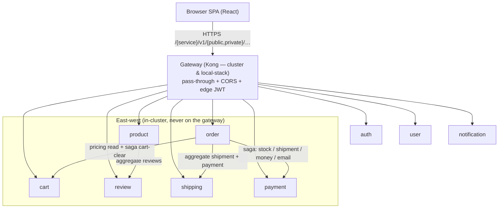
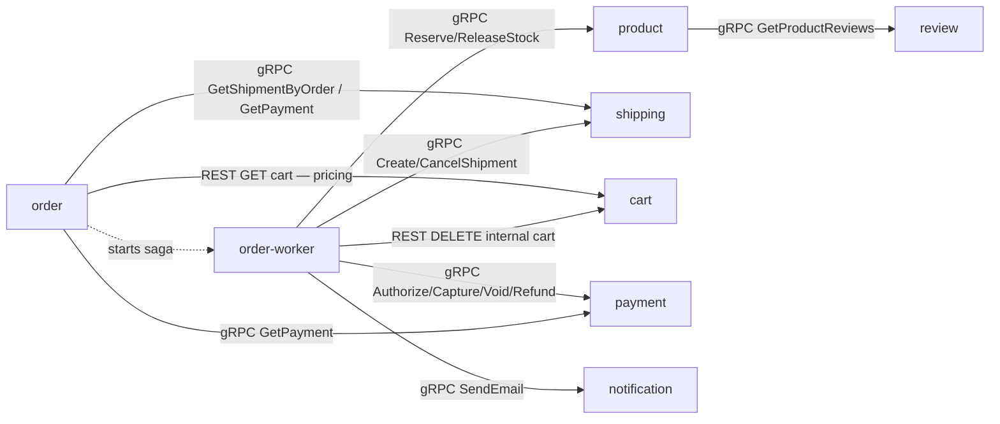

# Microservices Catalog

| | |
|---|---|
| **Status** | Living reference — the **understanding-the-system** catalog |
| **Covers** | Per-service feature matrix (feature → API → technique), data ownership, inter-service call graph |
| **Related** | [api.md](api.md) (payloads) · [naming convention](api-naming-convention.md) (routes) · [gRPC east-west](grpc-internal-comms.md) · [local-stack](../../local-stack/) |
| **Area hub** | [docs/api/README.md](README.md) |

This document is the **understanding-the-system** reference. It does **not**
restate every endpoint (see the [route inventory](api-naming-convention.md#complete-route-inventory));
it answers, per service: *what features exist, which API surface (if any) each
feature has, and which technique implements it* — plus data ownership and the
inter-service call graph.

---

## 1. Platform shape

- **9 Go backend services** (Go 1.26, Gin), each in its own repo + namespace, all listening on **`:8080`**, all exposing `GET /health` + `GET /ready`.
- **1 React/Vite frontend** (SPA, served by nginx).
- **3-layer architecture** per service: `web` (HTTP/validation/aggregation) → `logic` (business rules, no SQL) → `core` (domain + repository + DB). Frontend may only call the `web` layer.
- **URL shape (Variant A):** `/{service}/v1/{audience}/{resource…}` with `audience ∈ public | private | internal`. The gateway is **Kong in both environments** — in-cluster and in the local stack (Kong 3.9 DB-less, declarative `local-stack/gateway/kong.yml` mirroring the cluster plugins incl. the edge-JWT check on private routes). Routing is **pure pass-through** — no rewriting.

---

## 2. Deployment snapshot (local stack)

The local end-to-end stack (`local-stack/compose.yaml`) mirrors the platform with single shared infra. All containers are health-gated.

| Service | Port (internal) | Database (local) | Cache | Inter-service deps |
|---------|-----------------|------------------|-------|--------------------|
| auth | 8080 | `auth` | — | none (validated *by* everyone via JWKS) |
| user | 8080 | `user` | — | auth (JWKS) |
| product | 8080 | `product` | Valkey | auth (JWKS), review (gRPC) |
| cart | 8080 | `cart` | — | auth (JWKS); serves gRPC `GetCart` to checkout |
| order | 8080 | `order` | — | auth (JWKS), Temporal, shipping/notification/payment/product (gRPC), cart (REST) |
| review | 8080 | `review` | — | auth (JWKS) |
| shipping | 8080 | `shipping` | — | none |
| notification | 8080 | `notification` | — | auth (JWKS) |
| payment | 8080 | `payment` | — | mockpay (provider); called by order (saga + enrichment) |
| checkout | 8080 | `checkout` | — | auth (JWKS), cart + product (gRPC); reached only via Kong |
| frontend | 80 → host 3001 | — | — | gateway only |
| gateway (Kong 3.9) | 8000 → host 8080 | — | — | all 9 services |

> **In-cluster differences (production):** `auth-db` (CloudNativePG, via the **pgdog-auth** pooler);
> `product-db` (CloudNativePG behind the **pgdog-product** pooler — `product`/`cart`/`order`/`payment`
> databases; payment connects **direct over TLS, bypassing PgDog**);
> `shared-db` (CloudNativePG, via **pgdog-shared** — `user`/`review`/`shipping`/`notification`).
> Locally these collapse into one Postgres with 9 databases. See [`../databases/`](../databases/).
> **Logging is unified** — all 9 services log via the shared `pkg/logger` zap wrapper
> (`zapx`), teed into the OTLP pipeline (RFC-0014 P4).

---

## 3. Service feature matrix

**How to read:** one row per *behavior* (not per endpoint). The **API** column
names the surface — audience tag + path relative to `/{service}/v1/{audience}`,
or the gRPC RPC — and `—` for background features; full route contracts live in
the [route inventory](api-naming-convention.md#complete-route-inventory) and
payload specs in [api.md](api.md). **Technique** uses the canonical names from
the [technique index](#4-technique-index-platform-wide) (§4) — the two must stay
in sync. **Status** ∈ `Implemented` / `Partial` / `Planned` / `No caller`.

### auth — identity

> Owns `users` (credentials) and refresh-token families; DB `auth` on `auth-db`
> (CloudNativePG, via PgDog). Public-only HTTP — no JWT middleware, no gRPC
> server (HTTP-only since RFC-0009 Phase 5; services verify JWTs locally).

| Feature | API | Technique | Depends on | Status | Ref |
|---|---|---|---|---|---|
| **Token mint** (login/register) | public `POST /login`, `POST /register` | RS256 JWT (1 h TTL, `kid` header); bcrypt verification | — | Implemented | RFC-0009 |
| **JWKS publish** | public `GET /jwks` | single-key JWKS, `Cache-Control: max-age=300` | — | Implemented | RFC-0009 |
| **Refresh rotation** | public `POST /refresh`, `POST /logout` | rotating refresh tokens: opaque 32-byte token, sha256 hash at rest, family-tracked, reuse detection revokes the family (30 d TTL) | — | Implemented | — |
| **Login hardening** | (part of `/login`) | constant-time dummy-hash on user-not-found (no username enumeration); generic 401 for both bad-user and bad-password | — | Implemented | — |

### user — profiles

> Owns user profiles; DB `user` on `shared-db` (CloudNativePG). Verifies JWTs
> locally via `pkg/authmw`.

| Feature | API | Technique | Depends on | Status | Ref |
|---|---|---|---|---|---|
| **Public profile view** | public `GET /users/:id` | minimal projection (`id` + `name`, no PII) from real persistence | — | Implemented | — |
| **Own profile read/update** | private `GET/PUT /users/profile` | JWT-subject scoping; partial update preserves unset fields (COALESCE) | auth JWKS | Implemented | — |
| **Internal profile create** | internal `POST /users` | requires an authoritative `user_id` from the caller (never synthesized) | — | **No caller** (auth registers into its own DB and does not call this) | — |

### product — catalog (+ cache, stock)

> Owns products, categories, stock (~5k seeded rows locally); DB `product` on
> `product-db` (CloudNativePG, via PgDog). Valkey cache. Serves gRPC on `:9090`.

| Feature | API | Technique | Depends on | Status | Ref |
|---|---|---|---|---|---|
| **Catalog list/read** | public `GET /products`, `/products/:id` | cache-aside (Valkey): SETNX stampede lock (5 s TTL, token compare-and-delete release), TTL jitter 0–10 %, SCAN-based list invalidation; whitelisted sort/filter (injection-safe) | Valkey | Implemented | [caching](../caching/caching.md) |
| **Product-details aggregation** | public `GET /products/:id/details` | server-side aggregation: reviews via gRPC `ReviewService.GetProductReviews` (3 s deadline, soft-fail → `[]`) + stock + related | review | Implemented | [gRPC](grpc-internal-comms.md) |
| **Stock reservation** (saga step) | internal gRPC `ProductService.ReserveStock` / `ReleaseStock` | ledger-backed reservation, idempotent by `reservation_id` (= order id); insufficient stock → `FailedPrecondition` | caller: order-worker | Implemented | [temporal saga](temporal-order-fulfillment.md) |
| **Checkout batch read** | internal gRPC `ProductService.GetProducts` | cache-bypassing price/stock batch (product = checkout price authority); int64 minor units; unknown ids omitted | caller: checkout | Implemented (RFC-0015 P1) | [ADR-020](../proposals/adr/ADR-020-checkout-revalidation-policy/) |
| **Product create** | internal `POST /products` | admin/seed path | — | Implemented | — |

> **Known defect:** the service still emits its own CORS headers on top of the
> gateway's (duplicate `Access-Control-Allow-Origin`) — see §6.

### checkout — session orchestrator (RFC-0015 P1)

> Owns `checkout_sessions` + `checkout_session_items`; DB `checkout` (local-stack;
> cluster triplet at P5). Client-only — no gRPC server; nothing dials into it but Kong.

| Feature | API | Technique | Depends on | Status | Ref |
|---|---|---|---|---|---|
| **Session lifecycle** | private `POST /sessions` (201/200 idempotent), `GET /sessions/:id`, `PUT /sessions/:id/address`, `DELETE /sessions/:id` | explicit FSM transition table (payment-style); one active session per user (partial unique index); owner-scoped anti-IDOR (foreign = 404) | auth JWKS, cart + product (gRPC) | Implemented (P1) | [RFC-0015](../proposals/rfc/RFC-0015/) |
| **Price re-validation** | on `POST /sessions` | snapshot takes items from cart, prices from product (`GetProducts`, cache-bypassing); `price_changed` flag per line; product = price authority at checkout time | product (gRPC) | Implemented (P1; confirm gate at P2) | [ADR-020](../proposals/adr/ADR-020-checkout-revalidation-policy/) |
| **Lazy expiry** | every read/mutation | `now > expires_at` ⇒ `410 SESSION_EXPIRED` + best-effort `expired(lazy)` record; Temporal durable timer lands P2 — correctness never depends on the worker | — | Implemented (P1) | [RFC-0015](../proposals/rfc/RFC-0015/) |
| **Shipping/payment/promo/confirm** | — | P2–P4 phases | — | Planned | [RFC-0015](../proposals/rfc/RFC-0015/) |

### cart — shopping cart

> Owns `cart_items`; DB `cart` on `product-db` (CloudNativePG, via PgDog). Verifies JWTs
> locally via `pkg/authmw`.

| Feature | API | Technique | Depends on | Status | Ref |
|---|---|---|---|---|---|
| **Cart CRUD** | private `GET/POST/DELETE /cart`, `GET /cart/count`, `PATCH/DELETE /cart/items/:itemId` | fail-closed JWT (`user_id` from token, never body); UPSERT `ON CONFLICT (user_id, product_id)`; server-side subtotal math (empty cart = 0 shipping) | auth JWKS | Implemented | — |
| **Saga cart-clear** | internal `DELETE /cart/:userId` | tokenless in-cluster endpoint, NetworkPolicy-fenced; called best-effort by the saga's `ClearCart` step | caller: order-worker | Implemented | [temporal saga](temporal-order-fulfillment.md) |
| **gRPC read surface** | `cart.v1/GetCart` (`:9090`) | read-only snapshot for checkout (RFC-0015); prices → int64 minor units at this boundary; writes deliberately stay REST (ADR-021) | caller: checkout | Implemented (local-stack; cluster P5) | [ADR-021](../proposals/adr/ADR-021-cart-grpc-read-surface/) |

### order — orders & checkout fulfillment

> Owns `orders`, `order_items`; DB `order` on `product-db` (CloudNativePG, via PgDog).
> Verifies JWTs locally via `pkg/authmw`. **One binary, two deployments:**
> `order` (API) and `order-worker` (Temporal worker — the `worker` subcommand of
> the same binary). gRPC **client only** (no server).

| Feature | API | Technique | Depends on | Status | Ref |
|---|---|---|---|---|---|
| **Order reads** | private `GET /orders`, `/orders/:id` | ownership-scoped queries (`WHERE id AND user_id` — anti-IDOR) | auth JWKS | Implemented | — |
| **Checkout → durable fulfillment** | private `POST /orders` (returns `201` `pending`; honours an `Idempotency-Key` header — replay returns the existing order) | **Temporal saga** `OrderFulfillmentWorkflow` (workflow id `order-fulfillment-<orderID>`): authorize payment → reserve stock → create shipment → capture → **confirm (pivot)** → notify + receipt → clear cart; compensations run in reverse (void pre-capture / refund post-pivot); server-side order-math validation; atomic order+items insert; saga start on a detached 5 s context (checkout never fails on Temporal outage — order stays `pending`) | Temporal; product, shipping, payment, notification (gRPC); cart (REST) | Implemented | [temporal saga](temporal-order-fulfillment.md), [saga-vs-2pc](saga-vs-2pc.md) |
| **Order-details aggregation** | private `GET /orders/:id/details` | gRPC fan-out with soft-fail enrichment: `GetShipmentByOrder` → `null` shipment, `GetPayment` → payment block omitted | shipping, payment | Implemented | [gRPC](grpc-internal-comms.md) |
| **Server-side pricing** | — (calls cart) | REST `GET /cart/v1/private/cart` with the user's forwarded `Authorization` — cart is the pricing authority at checkout | cart | Implemented | — |
| **Saga worker** | — (Temporal task queue `order-fulfillment`) | `worker` subcommand of the same image; registers workflow + activities; fail-fast if Temporal is unreachable | Temporal | Implemented | [temporal saga](temporal-order-fulfillment.md) |

### review — product reviews

> Owns `reviews` (rating 1–5, comment); DB `review` on `shared-db`
> (CloudNativePG). Verifies JWTs locally via `pkg/authmw`. Serves gRPC on `:9090`.

| Feature | API | Technique | Depends on | Status | Ref |
|---|---|---|---|---|---|
| **Review list** | public `GET /reviews?product_id=…` | required `product_id` (missing → 400); paginated | — | Implemented | — |
| **Review create** | private `POST /reviews` | JWT (`user_id` from token — no impersonation); `UNIQUE (product_id, user_id)` + SQLSTATE `23505` → `409` (race-safe duplicate handling) | auth JWKS | Implemented | — |
| **Review feed for product details** | internal gRPC `ReviewService.GetProductReviews` | thin adapter over the same logic layer as the HTTP list | caller: product | Implemented | [gRPC](grpc-internal-comms.md) |

### shipping — tracking, estimates & shipment lifecycle

> Owns `shipments`; DB `shipping` on `shared-db` (CloudNativePG). No JWT
> middleware (public + internal surfaces only). Serves gRPC on `:9090`.

| Feature | API | Technique | Depends on | Status | Ref |
|---|---|---|---|---|---|
| **Tracking** | public `GET /track` | lookup by `tracking_number` (legacy `trackingId` fallback); NULL-safe carrier scan | — | Implemented | — |
| **Estimate** | public `GET /estimate` | weight validation rejects `≤0`/`NaN`/`±Inf` → 400 | — | Implemented | — |
| **Shipment lifecycle** (saga steps) | internal gRPC `ShippingService.CreateShipment` / `CancelShipment` | idempotent by `order_id` | caller: order-worker | Implemented | [temporal saga](temporal-order-fulfillment.md) |
| **Shipment read for order details** | internal gRPC `GetShipmentByOrder` (HTTP twin: internal `GET /orders/:orderId`) | missing shipment → empty response (caller soft-fails to `null`) | caller: order | Implemented (HTTP twin has **no caller**) | [gRPC](grpc-internal-comms.md) |

### notification — user notifications

> Owns `notifications`; DB `notification` on `shared-db` (CloudNativePG).
> Verifies JWTs locally via `pkg/authmw` on private routes. Serves gRPC on
> `:9090`. Deployed in-cluster (comms domain) **and** in the local stack — the
> frontend's notification badge resolves against it.

| Feature | API | Technique | Depends on | Status | Ref |
|---|---|---|---|---|---|
| **Notification inbox** | private `GET /notifications`, `GET /notifications/count`, `GET/PATCH /notifications/:id`, `PATCH /notifications/read-all` | JWT; owner-scoped reads/mutations (`(id, user_id)` — anti-IDOR); paginated list | auth JWKS | Implemented | — |
| **Order emails** (saga side-effects) | internal gRPC `NotificationService.SendEmail` | called best-effort by the saga (order-created, receipt, refund notice) on a detached context | caller: order-worker | Implemented | [temporal saga](temporal-order-fulfillment.md) |
| **Internal notify twins + SMS** | internal `POST /notifications/email`, `POST /notifications/sms`; gRPC `SendSMS` | HTTP twins of the gRPC path; SMS path fully unused | — | **No caller** | — |

### payment — payments, outbox & reconciliation

> Owns `payments`, refunds, the transactional outbox, and reconciliation runs;
> DB `payment` on `product-db` — connects **direct over TLS, bypassing PgDog**.
> Serves gRPC on `:9090` (reflection off). **Single replica by design**
> (single-writer outbox + per-instance ticker). **mockpay** is a subcommand of
> the same binary, run as a second deployment (provider selected via
> `MOCKPAY_URL`; unset → in-process stub, reconciliation disabled).

| Feature | API | Technique | Depends on | Status | Ref |
|---|---|---|---|---|---|
| **Saga money steps** | internal gRPC `PaymentService.Authorize` / `Capture` / `Void` / `Refund` | recovery-point idempotency (keys `order:<id>`, `refund:order:<id>`; checkpointed provider calls survive crash takeover); a decline is a business response, not a gRPC error | mockpay; caller: order-worker | Implemented | [RFC-0010](../proposals/rfc/RFC-0010/), ADR-009/010 |
| **Payment reads (browser)** | private `GET /payments`, `GET /payments/:id` | JWT; owner-scoped | auth JWKS | Implemented | [payments.md](payments.md) |
| **Payment create (browser)** | private `POST /payments` | requires `Idempotency-Key`; token-only `payment_method` (`tok_…`, PAN-like digit runs rejected); shared validators across HTTP and gRPC | auth JWKS | Implemented | [payments.md](payments.md) |
| **Payment enrichment for order details** | internal gRPC `GetPayment` (by order id) | read snapshot; caller soft-fails | caller: order | Implemented | [payments.md](payments.md) |
| **Provider webhook** | public `POST /webhooks/mockpay` | **webhook HMAC**: `Mockpay-Signature: t=…,v1=…` — HMAC-SHA256 over the raw body, constant-time compare, ±5 min replay window, fail-closed on empty secret, 1 MiB body cap | mockpay | Implemented | RFC-0010 |
| **Outbox relay** | — (background loop) | **transactional outbox** — events enqueued in the same tx as the money movement, drained by a 10 s single-writer relay (at-least-once) | Postgres | Implemented | ADR-007 |
| **Reconciliation** | internal `POST /reconciliation/runs`, `GET /reconciliation/runs/:id` + 5-min ticker | detect-only ledger comparison; auto-heal flag-gated (`RECON_HEAL_ENABLED`, lost-capture-response class only); hourly retention reaper (30 d) | mockpay ledger | Implemented | ADR-011/012 |

### frontend — React SPA

Calls only the gateway at `/{service}/v1/{public,private}/…`; JWT stored in
`localStorage.authToken` and sent as `Authorization: Bearer`. Uses the
server-side aggregation endpoints (`/products/:id/details`,
`/orders/:id/details`) — no client-side orchestration. **gRPC is never
browser-facing.**

---

## 4. Technique index (platform-wide)

| Technique | What it solves | Where used | Deep-dive |
|---|---|---|---|
| **RS256 JWT + JWKS** | Stateless identity — no per-request auth hop | Mint: auth. Verify locally via `pkg/authmw`: user, cart, order, review, notification, payment | RFC-0009, [naming convention](api-naming-convention.md) |
| **Rotating refresh tokens** | Long-lived sessions without long-lived access tokens; reuse detection | auth (sha256 at rest, family revoke) | — |
| **Temporal saga** | All-or-nothing multi-service checkout with compensations | order (+ `order-worker`); participants: product, shipping, payment, notification, cart | [temporal saga](temporal-order-fulfillment.md), [saga-vs-2pc](saga-vs-2pc.md) |
| **Cache-aside (Valkey)** | Read-heavy hot paths | product (SETNX stampede lock, TTL jitter, SCAN invalidation) | [caching](../caching/caching.md) |
| **Transactional outbox** | Reliable side-effects with the DB write (no dual-write gap) | payment (single-writer relay) | ADR-007 |
| **Reconciliation** | Detect provider/ledger drift | payment (ticker + internal trigger API, flag-gated auto-heal) | ADR-011/012 |
| **Webhook HMAC** | Authenticating an unauthenticated public caller | payment ← mockpay | RFC-0010 |
| **gRPC east-west (`:9090`)** | Typed internal transport | Servers: product, review, shipping, notification, payment. Clients: product→review; order/order-worker→product, shipping, notification, payment | [gRPC](grpc-internal-comms.md) |
| **Idempotency** | Exactly-once effects under retries | HTTP `Idempotency-Key`: order create, payment create/refund. Saga natural keys: `reservation_id`, shipment `order_id`, payment recovery points | ADR-010 |
| **Server-side aggregation** | No client-side orchestration | product `/details`, order `/details` (soft-fail enrichment) | — |
| **Ownership-scoped queries** | Anti-IDOR — rows fetched with `(id, user_id)` | order, notification, payment, cart (token-derived `user_id`) | — |
| **Embedded migrations** | Schema self-management per binary (golang-migrate) | all 9 services | [../databases/](../databases/) |

Rule: every value in a service table's **Technique** column appears here, and
every row here is used by at least one service table — that is this doc's
internal consistency check.

---

## 5. Inter-service communication map

Every service-to-service call below runs over **gRPC** (`:9090`, gRPC-only) via
the shared `pkg/grpcx` + `pkg/authmw` — transport details (addresses, dual-port,
HTTP/2 LB) live in [`grpc-internal-comms.md`](grpc-internal-comms.md). The
browser/Kong edge and the two order→cart hops stay HTTP/JSON.

| Caller | Callee | Call | Transport | Failure mode |
|--------|--------|------|-----------|--------------|
| product | review | `ReviewService.GetProductReviews` | **gRPC** | soft-fail → `[]` |
| order | shipping | `ShippingService.GetShipmentByOrder` | **gRPC** | soft-fail → `null` shipment |
| order | payment | `PaymentService.GetPayment` (order-details enrichment) | **gRPC** | soft-fail → no payment block |
| order-worker | product | `ProductService.ReserveStock` / `ReleaseStock` | **gRPC** | saga step / compensation |
| order-worker | shipping | `ShippingService.CreateShipment` / `CancelShipment` | **gRPC** | saga step / compensation |
| order-worker | payment | `PaymentService.Authorize` / `Capture` / `Void` / `Refund` | **gRPC** | saga step / compensation; decline → order `failed` |
| order-worker | notification | `NotificationService.SendEmail` (order-created, receipt, refund) | **gRPC** | best-effort |
| order | cart | `GET /cart/v1/private/cart` (server-side pricing, forwarded JWT) | REST | checkout fails without pricing |
| order-worker | cart | `DELETE /cart/v1/internal/cart/:userId` (saga clear) | REST | best-effort |

Service-to-service target addresses are injected as env vars — gRPC hops via
`*_GRPC_ADDR` (`REVIEW_`, `SHIPPING_`, `NOTIFICATION_`, `PAYMENT_`, `PRODUCT_`)
and the REST hops via `CART_SERVICE_URL` — see `local-stack/compose.yaml` and
the cluster ResourceSet templates.

---

## 6. Known gaps & ongoing work

| Item | Service(s) | Status |
|------|------------|--------|
| Duplicate CORS headers (service emits CORS + gateway) | product | Worked around at gateway; service-side removal still recommended (middleware present in code) |
| Internal `POST /users` has no in-cluster caller | user | Wired to real persistence; auth registers into its own DB |
| Internal HTTP notify twins + gRPC `SendSMS` unused | notification | No caller (saga emails go via gRPC `SendEmail`) |
| Internal HTTP `GET /orders/:orderId` redundant | shipping | No caller — order reads shipment over gRPC |
| Internal routes rely on NetworkPolicy, no in-app caller auth | product, user, cart, shipping, notification | NetworkPolicies authored (see [`../security/`](../security/)); enforced (kindnet on Kind 1.34+; policy CNI in prod) |
| Saga email recipient hardcoded (`noreply@orders.local`) | order, notification | Real customer-email lookup is a noted TODO |
| Review findings (auth fail-open, IDOR, seed-seq desync, hardcoded user_id) | notification | Fixed (parity with sibling services) |
| Seed sequence resets (PK collisions on first INSERT) | auth, cart, review, shipping | Fixed via `V*__fix_sequences.sql` migrations |

---

*Run the whole platform locally for verification: `cd local-stack && docker compose up -d --build` → SPA at http://localhost:3001, Kong gateway at http://localhost:8080 (demo login `alice` / `password123`).*

_Last updated: 2026-07-11 — Zalando→CNPG migration: per-service DB placements updated to the CloudNativePG clusters (`auth-db`, `product-db`, `shared-db`) fronted by PgDog (`pgdog-auth`/`pgdog-product`/`pgdog-shared`). Earlier: local gateway corrected to Kong 3.9 DB-less (the nginx stand-in was replaced); feature-matrix rebuild + DB footnote + call graph from the same day._
