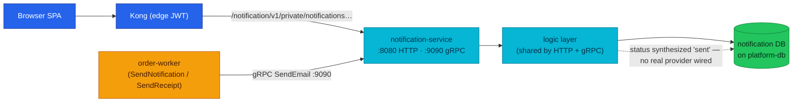

# Notification Service API

Notification turns machine events into a user-visible inbox: it records every
outbound email and SMS attempt as an owned, readable notification row — and it
does so best-effort, so a failed notice never rolls back the order that
triggered it.

| Dimension | Value |
|-----------|-------|
| **Local-stack** | Implemented |
| **Cluster** | Implemented |
| **HTTP** | private · `:8080` · Kong `/notification/v1/private/` (edge JWT) |
| **gRPC server** | `NotificationService/SendEmail`, `SendSMS` · `:9090` |
| **gRPC client** | None |
| **Worker** | None |
| **Temporal** | Participant (gRPC) · [workflows.md#order-fulfillment](./workflows.md#order-fulfillment) |
| **Technical debt** | None |

| | |
|---|---|
| **Repository** | [`duynhlab/notification-service`](https://github.com/duynhlab/notification-service) |
| **Owns** | Notification records (inbox) and their read state |
| **Database** | `notification` on `platform-db` (via `platform-db-pooler-rw.platform:5432`) |

## Temporal participation

| Field | Value |
|-------|-------|
| **Role** | Participant (gRPC) |
| **Workflow** | `OrderFulfillmentWorkflow` (owned by order) |
| **This service's steps** | `SendNotification`, `SendReceipt` — both call `SendEmail`; post-pivot, best-effort, **no compensation** |
| **Idempotency** | None — a retried activity inserts a fresh inbox row (accepted duplicate; see [Known gaps](#known-gaps)) |
| **Deep dive** | [workflows.md](./workflows.md#order-fulfillment) · [temporal-order-fulfillment.md](./temporal-order-fulfillment.md) |

## Why it exists

Order fulfillment needs to tell the customer what happened — "order
confirmed", "here is your receipt" — but that notice must never gate the money
path. If sending an email could fail a confirmed order, the least important
step in the saga would hold veto power over the most important one.

Notification solves this by being the platform's **post-pivot participant**:
the order saga calls it only *after* the order is confirmed and payment is
captured, with bounded retries and no compensation. The service itself stays
deliberately small — validate the recipient, persist the notification, expose
it as a private inbox the SPA can read and mark. There is no real email/SMS
provider wired today: `status` is synthesized as `"sent"` at the persistence
seam where a provider call would live, so the inbox, the metrics, and the saga
wiring are all real even though delivery is not.

## Architecture

One question: who writes into the inbox, and who reads it?



Both transports are thin adapters over the same logic layer, so gRPC and HTTP
return identical notification objects. `SendSMS` and the internal HTTP send
twins are wired but have **no live caller** (kept documented — see
[Known gaps](#known-gaps)).

## Data model

One table, owner-scoped by `user_id`:

| Column | Type | Notes |
|--------|------|-------|
| `id` | `SERIAL PRIMARY KEY` | Returned as a string on the wire |
| `user_id` | `INTEGER NOT NULL` | References `auth.users.id` logically — **no FK** (separate databases) |
| `title` | `VARCHAR(255) NOT NULL` | Email subject / `"SMS"` |
| `message` | `TEXT` | Email body / SMS text |
| `type` | `VARCHAR(50)` | `email` or `sms` from the send path; seed also uses domain types (`order_placed`, …) |
| `read` | `BOOLEAN DEFAULT FALSE` | The only mutable field |
| `created_at` | `TIMESTAMP DEFAULT CURRENT_TIMESTAMP` | RFC3339 on the wire |

Two quirks worth knowing:

- **No `status` column.** The API's `status` field is synthesized as `"sent"`
  by the repository on every read and write — the schema has no delivery
  state because no delivery provider exists yet.
- **Title/message fallback.** If one of title/message is empty, the other is
  substituted on both write and read, so neither field is ever blank in a
  response.

Seed data (local/dev only, `seed` subcommand — never `migrate`) loads 8 demo
notifications across 3 users with mixed read state.

## HTTP API

All private routes derive the owner from the JWT (Kong edge filter +
authoritative in-service verification — see
[api.md § Authentication](./api.md#authentication)).

| Method | Path | Audience | Purpose |
|--------|------|----------|---------|
| `GET` | `/notification/v1/private/notifications` | Private | Paginated inbox ([shared envelope](./api.md#list-pagination)) |
| `GET` | `/notification/v1/private/notifications/count` | Private | Unread count |
| `PATCH` | `/notification/v1/private/notifications/read-all` | Private | Mark every owned notification read |
| `GET` | `/notification/v1/private/notifications/:id` | Private | Get one owned notification |
| `PATCH` | `/notification/v1/private/notifications/:id` | Private | Mark one owned notification read |
| `POST` | `/notification/v1/internal/notifications/email` | Internal | HTTP twin of `SendEmail` — **No caller** |
| `POST` | `/notification/v1/internal/notifications/sms` | Internal | HTTP twin of `SendSMS` — **No caller** |

`/internal/` routes are never exposed at either edge (Kong local-stack and the
cluster ingress both route only `/notification/v1/private/`); the namespace
NetworkPolicy is the fence.

### Notification shape

```json
{
  "id": "91",
  "type": "email",
  "title": "Order confirmed",
  "message": "Order 42 was confirmed.",
  "status": "sent",
  "read": false,
  "created_at": "2026-07-13T09:00:00Z"
}
```

| Operation | Response |
|-----------|----------|
| List | [Shared pagination envelope](./api.md#list-pagination) with notification items |
| Count | `{ "count": n }` |
| Mark all | `{ "updated": n }` |
| Get or mark one | The (updated) notification object |
| Internal send twins | `200` with the persisted notification |

### Error matrix

Errors use the [shared envelope](./api.md#error-envelope).

| Status | Code | When |
|--------|------|------|
| `400` | `VALIDATION_ERROR` | Malformed body on the send twins; invalid recipient |
| `401` | `UNAUTHORIZED` | No authenticated user in context |
| `404` | `NOT_FOUND` | Unknown **or someone else's** notification id (anti-IDOR — indistinguishable) |
| `500` | `INTERNAL_ERROR` | Storage failure; delivery failure on the send twins |

Every private lookup includes both the notification id and the JWT-derived
user id in the query, so foreign ids behave exactly like missing ids.

## gRPC API

`NotificationService` on `:9090` — proto in `pkg/proto/notification/v1/`
(see [api.md § gRPC Runtime Model](./api.md#grpc-runtime-model)).

| RPC | Request → Response | Saga | Notes |
|-----|--------------------|------|-------|
| `SendEmail` | `{user_id, to, subject, body}` → `{notification}` | step (post-pivot, best-effort — **no compensation**) | Live caller: order-worker (`SendNotification` + `SendReceipt` activities) |
| `SendSMS` | `{user_id, to, message}` → `{notification}` | — | **No caller** — wired end-to-end, kept documented |

Validation lives in the **logic layer** so both transports share it: email
recipients must parse as an address (`InvalidArgument` otherwise), SMS
recipients must be non-blank. The HTTP twins additionally enforce
binding rules (`user_id`, `subject`, `body` required); the gRPC path does
**not** — subject/body arrive as-is and the repository's title/message
fallback fills any blank. Storage failures map to `Internal`.

## Business rules & techniques

### Delivery semantics — at-least-once, best-effort, post-pivot

The order saga calls `SendEmail` only after the pivot (`ConfirmOrder`), with
bounded retries and no compensation. Three consequences define the contract:

| Scenario | Order effect |
|----------|--------------|
| Confirmation email fails | Order remains confirmed; failure is logged and observable |
| Receipt email fails | Activity is best-effort post-pivot; bounded retries, then logged |
| Refund notice fails | Compensation result remains valid; the notice can be retried separately |

- **At-least-once, no dedupe.** `SendEmail` carries no idempotency key: if an
  activity persists the row but the response is lost, the Temporal retry
  inserts a second row. A duplicate "order confirmed" inbox entry is the
  accepted cost of never blocking or rolling back a confirmed order.
- **Best-effort ordering.** The workflow runs `SendNotification` then
  `SendReceipt` sequentially, but the inbox orders by `created_at` — retries
  can reorder entries relative to wall-clock expectations. No consumer relies
  on inbox order for correctness.
- **The provider seam.** `recordSendDuration` times validated input through
  persistence — exactly where a real provider call would slot in — so slow or
  failing sends already surface as latency today.

### Owner scoping (anti-IDOR)

Every read and mutation is scoped `WHERE id = $1 AND user_id = $2`; there is
no code path that fetches a notification without the owner. Enumeration
returns `404` uniformly.

### Bounded business metrics

`notification_read_total{mode=single|all}` distinguishes one-by-one reads
from bulk mark-all (a mark-all of 5 adds 5 under `mode=all`; idempotent
no-ops are not counted). `notification_send_duration_seconds{channel}` uses
the platform's SLO-tuned bucket boundaries as instrument advisories — the
obsx duration View only matches semconv HTTP/RPC instruments by name, and the
SDK's default buckets (sized for milliseconds) would collapse every sub-10s
send into the first bucket. Labels are bounded enumerable values (RFC-0017):
no ids, no recipient text.

## Callers & dependencies

| Direction | Peer | Transport | Purpose |
|-----------|------|-----------|---------|
| Inbound | Browser SPA via Kong | HTTP `/notification/v1/private/` | Inbox read + mark-read |
| Inbound | order-worker | gRPC `SendEmail` `:9090` | Saga notify + receipt steps |
| Outbound | `notification` DB on platform-db | SQL via pooler | Only dependency — no east-west client calls |

Cluster gRPC address: `dns:///notification.notification.svc.cluster.local:9090`
(local-stack: `dns:///notification:9090`).

## Known gaps

- **`SendSMS` has no caller** — RPC and HTTP twin are implemented and tested
  but nothing dials them. Kept documented per platform policy (No caller).
- **Internal HTTP send twins have no caller** — machine producers use gRPC;
  the twins remain as transport parity, fenced off the edge.
- **No real email/SMS provider** — `status` is hardcoded `"sent"`; delivery
  is persistence. The latency histogram already wraps the seam.
- **No send-side idempotency key** — duplicate inbox rows are possible on
  activity retry (accepted; see delivery semantics above).

## Operations

- **Ports & probes:** HTTP `:8080` (`/health`, `/ready`; readiness drains for
  `READINESS_DRAIN_DELAY`, default 5s); gRPC `:9090` — a second port on the
  same `notification` Service (the mop chart renders one multi-port Service;
  the old headless `notification-grpc` twin was removed). The gRPC port is
  unauthenticated by design and fenced by the namespace NetworkPolicy;
  east-west mTLS is **Planned** (see
  [DEPLOYMENT-STATUS.md](./DEPLOYMENT-STATUS.md)).
- **Key env:** `PORT` (8080), `GRPC_PORT` (9090), `DB_*` (`DB_PASSWORD_FILE`
  supported — this service is the platform's dynamic-DB-credentials pilot,
  ADR-025 pattern A), `AUTH_JWKS_URL`, `JWT_ISSUER`, `JWT_AUDIENCE`,
  `OTEL_COLLECTOR_ENDPOINT`, `PYROSCOPE_ENDPOINT`.
- **Observability:** obsx OTLP (RFC-0014) — traces, RED metrics, teed logs,
  plus the business metrics above. On-call signal: a rising
  `notification_send_duration_seconds` p99 with a healthy DB means the send
  path (future provider) is degrading, not the inbox.
- **Local-stack:** `notification` + `notification-migrate` + `notification-seed`
  (compose); Kong route `/notification/v1/private/` with the jwt plugin.
- **Smoke test via Kong:**

  ```bash
  TOKEN=$(curl -s -X POST http://localhost:8080/auth/v1/public/auth/login \
    -H 'Content-Type: application/json' \
    -d '{"username":"alice","password":"password123"}' | jq -r .access_token)
  curl -s http://localhost:8080/notification/v1/private/notifications/count \
    -H "Authorization: Bearer $TOKEN"
  ```

## Code map

| Layer | Repo path |
|-------|-----------|
| Entrypoint + route registration | `notification-service/cmd/main.go` |
| HTTP handlers | `notification-service/internal/web/v1/handler.go` |
| gRPC server | `notification-service/internal/grpc/v1/server.go` |
| Business logic (shared by both transports) | `notification-service/internal/logic/v1/service.go` |
| Business metrics | `notification-service/internal/logic/v1/metrics.go` |
| Repository | `notification-service/internal/core/repository/notification.go` |
| Domain model | `notification-service/internal/core/domain/notification.go` |
| Schema / seed | `notification-service/db/migrations/sql/` · `notification-service/db/seed/sql/` |
| Config (env contract) | `notification-service/config/config.go` |
| Proto | `pkg/proto/notification/v1/notification.proto` |

## References

- [api.md](./api.md) — shared auth, error envelope, pagination, gRPC runtime model
- [workflows.md](./workflows.md) — workflow registry
- [temporal-order-fulfillment.md](./temporal-order-fulfillment.md) — saga theory + as-built steps
- [order.md](./order.md) — the orchestrator's contract
- [DEPLOYMENT-STATUS.md](./DEPLOYMENT-STATUS.md) — platform rollup
- [microservices.md](./microservices.md) — feature matrix

_Last updated: 2026-07-21_
