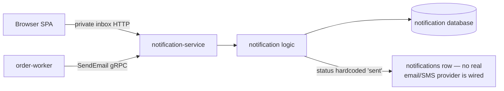

# Notification Service API

Notification owns the in-app inbox and records outbound email and SMS attempts.

| Attribute | Value |
|---|---|
| **Status** | Inbox and email paths implemented; SMS contract exists but has no live caller |
| **Repository** | [`duynhlab/notification-service`](https://github.com/duynhlab/notification-service) |
| **Owns** | Notification records and read state |
| **HTTP** | Private inbox plus internal send twins on `:8080` |
| **gRPC** | `NotificationService` on `:9090` |
| **Callers** | Browser and order-worker |

## Overview

The browser reads and updates its inbox over HTTP. Machine producers use gRPC
to send notifications; internal HTTP send routes remain transport twins but
have no live caller. Order-fulfillment email is post-pivot and best-effort, so a
mail failure never rolls back an already-confirmed order.



## HTTP API

| Method | Path | Audience | Purpose |
|---|---|---|---|
| `GET` | `/notification/v1/private/notifications` | Private | Paginated inbox |
| `GET` | `/notification/v1/private/notifications/count` | Private | Unread count |
| `PATCH` | `/notification/v1/private/notifications/read-all` | Private | Mark every owned notification read |
| `GET` | `/notification/v1/private/notifications/:id` | Private | Get one owned notification |
| `PATCH` | `/notification/v1/private/notifications/:id` | Private | Mark one owned notification read |
| `POST` | `/notification/v1/internal/notifications/email` | Internal | HTTP twin of `SendEmail`; no live caller |
| `POST` | `/notification/v1/internal/notifications/sms` | Internal | HTTP twin of `SendSMS`; no live caller |

### Notification shape

```json
{
  "id": "91",
  "type": "email",
  "title": "Order confirmed",
  "message": "Order 42 was confirmed.",
  "status": "sent",
  "read": false,
  "created_at": "2026-07-13T09:00:00Z"
}
```

| Operation | Response |
|---|---|
| List | Shared pagination envelope with notification items |
| Count | `{ "count": n }` |
| Mark all | `{ "updated": n }` |
| Get or mark one | The updated notification object |

Every private lookup includes both notification ID and JWT-derived user ID.
Foreign IDs therefore behave like missing IDs and return `404`.

## gRPC API

| RPC | Live caller | Required fields | Status |
|---|---|---|---|
| `SendEmail` | Order worker | valid `to` address (subject/body/user_id are accepted as-is — HTTP-binding validation is not enforced on the gRPC path) | Implemented and used |
| `SendSMS` | None | non-blank `to` | Implemented, no caller |

Both RPCs return the persisted notification snapshot. Domain validation maps bad
recipients to `InvalidArgument`; unexpected delivery or storage failures map to
`Internal`.

## Delivery semantics

| Scenario | Order effect |
|---|---|
| Confirmation email fails | Order remains confirmed; failure is logged and observable |
| Receipt email fails | Activity is best-effort post-pivot |
| Refund notice fails | Compensation result remains valid; notice can be retried separately |

## Operations

HTTP probes are on `:8080`; gRPC listens on `:9090` — a second port on the
same `notification` Service (the mop chart renders one multi-port Service; the
old headless `notification-grpc` twin was removed) — fenced by the namespace
NetworkPolicy. HTTP, gRPC, and
runtime metrics export over OTLP.

## References

- [Shared API and gRPC conventions](api.md)
- [Order service](order.md)
- [Order-fulfillment Saga](temporal-order-fulfillment.md)

_Last updated: 2026-07-13_
