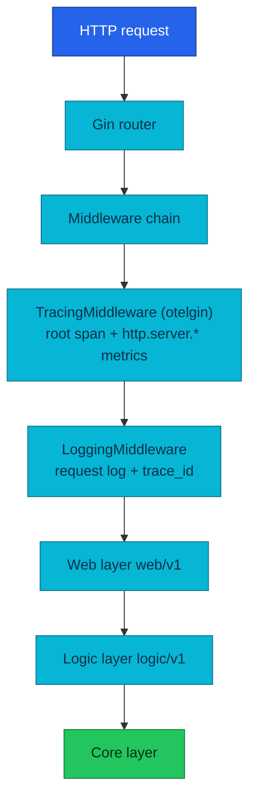
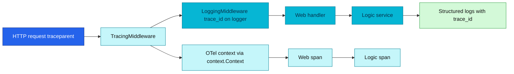

# Application Observability

Cross-cutting instrumentation contract for all ten Go microservices and both workers — `pkg/obsx`, middleware order, environment variables, three-layer spans, and correlation fields. Pillar deep-dives: [logs](./logs.md) · [metrics](./metrics.md) · [tracing](./tracing.md) · [profiling](./profiling.md).

| Attribute | Value | RFC / ADR |
|-----------|-------|-----------|
| **Wiring** | One call: `obsx.SetupObservability(ctx, obsx.ConfigFromEnv())` in `main()` | — |
| **Semconv** | **v1.41.0**, pinned in `pkg/obsx` — bumps only via deliberate pkg release | — |
| **Middleware** | **Tracing → logging** (two middleware); RED metrics via `otelgin` inside tracing | — |
| **Export** | OTLP/HTTP `:4318` → OpenTelemetry Collector | — |
| **Platform topology** | [OpenTelemetry (platform)](../observability/opentelemetry/README.md) · [Observability hub](../observability/README.md) | — |
| **Design record** | — | [RFC-0014](../proposals/rfc/RFC-0014/) · [ADR-016](../proposals/adr/ADR-016-otel-metrics-cutover/) |

---

## Overview

Every service and worker shares one instrumentation stack wired through **`pkg/obsx`**. Services never build OTel providers, exporters, or resources by hand. Platform backends (VictoriaMetrics, VictoriaLogs, Tempo, Pyroscope) and the Collector fan-out are documented under [`docs/observability/`](../observability/README.md).

---

## Platform instrumentation policy (RFC-0014 — normative)

These rules apply to every service PR. Rationale: [RFC-0014](../proposals/rfc/RFC-0014/README.md).

1. **One wiring point.** Services call `obsx.SetupObservability(ctx, cfg)` once in `main()` and defer its `Shutdown`. No hand-built OTel providers.

   ```go
   obs, err := obsx.SetupObservability(ctx, obsx.ConfigFromEnv())
   if err != nil { /* fail startup */ }
   defer obs.Shutdown(shutdownCtx)

   // logs (when OTEL_LOGS_ENABLED): tee next to the stdout core
   logger := zap.New(zapcore.NewTee(stdoutCore, obs.ZapCore(serviceName, zapcore.InfoLevel)))
   ```

2. **`client_golang` is retired.** No `prometheus.*`/`promauto` in app code — metrics use the OTel Meter API with semconv names. The `/metrics` scrape endpoint was removed at RFC-0014 P3.
3. **Semconv v1.41 is pinned** in `pkg/obsx`; SDK/contrib/semconv triple bumps only as a deliberate pkg release.
4. **Never set `OTEL_SEMCONV_STABILITY_OPT_IN`.** Any value containing `rpc` silently renames metrics and breaks consumers.
5. **The Views are law.** HTTP duration uses the platform 13-bucket set `{0.005, 0.01, 0.025, 0.05, 0.1, 0.2, 0.3, 0.5, 0.75, 1, 2, 5, 10}`; body-size histograms use byte buckets; `rpc.client.call.duration` drops `server.address`/`server.port`. Changing buckets is an RFC-level decision.
6. **Rollout flags ON fleet-wide.** `OTEL_METRICS_ENABLED` / `OTEL_LOGS_ENABLED` are enabled fleet-wide (P3/P4 cutovers). They remain per-service kill switches.
7. **Export interval is 15 s** (`OTEL_METRIC_EXPORT_INTERVAL_SECONDS`) — matches historical scrape interval for burn-rate math.
8. **No secrets/PII in labels or resource attributes.**
9. **Health and reflection RPCs are not telemetry.** `pkg/grpcx` filters them from spans and metrics.
10. **Cardinality backstop:** SDK 2000-attribute-set limit per instrument; `otel.metric.overflow` is an alert.

### API vs SDK vs contrib

| Layer | Who imports it here |
|---|---|
| **API** (`go.opentelemetry.io/otel`, …) | `pkg/obsx`, `pkg/grpcx`, middleware |
| **SDK** | **Only `pkg/obsx.SetupObservability`** |
| **Exporters** | `pkg/obsx` only |
| **Contrib** (`otelgin`, `otelgrpc`, `otelzap`, `runtime`) | Router middleware; rest via `pkg/obsx`/`pkg/grpcx` |

---

## Middleware and interceptors

The HTTP middleware chain is **tracing → logging** (two middleware only).

| Order | Middleware | Emits |
|-------|------------|-------|
| 1 | **Tracing** (`otelgin` via `TracingMiddleware`) | Root span + **`http.server.*` metrics** via global MeterProvider |
| 2 | **Logging** | Structured JSON + `trace_id` on stdout; otelzap tee when enabled |

There is **no separate metrics middleware**. RED HTTP metrics come from the same `otelgin` instrumentation that creates spans. gRPC RED + tracing come from `pkg/grpcx` `otelgrpc` interceptors.

Health and reflection paths (`/health`, `/ready`, gRPC health/reflection) are excluded from normal access telemetry.



Profiling (`obsx.SetupProfiling`) pushes out-of-band to Pyroscope — see [Application profiling](./profiling.md).

---

## Three-layer architecture

### Web layer (`web/v1/`)

- HTTP request/response handling, validation, status code mapping, error formatting
- Creates spans with `layer=web`; logs request/response as JSON with trace-id

```go
func Login(c *gin.Context) {
    ctx, span := middleware.StartSpan(c.Request.Context(), "http.request",
        trace.WithAttributes(attribute.String("layer", "web")))
    defer span.End()

    logger := middleware.GetLoggerFromContext(c, baseLogger)

    var req domain.LoginRequest
    if err := c.ShouldBindJSON(&req); err != nil {
        logger.Error("Invalid request", zap.Error(err))
        c.JSON(http.StatusBadRequest, gin.H{"error": err.Error()})
        return
    }

    result, err := authService.Login(ctx, req)
    // ... handle response
}
```

### Logic layer (`logic/v1/`)

- Business rules, validation, transformation, cache-aside
- Creates spans with `layer=logic`; business metrics via OTel Meter API

```go
func (s *AuthService) Login(ctx context.Context, req domain.LoginRequest) (*domain.AuthResponse, error) {
    ctx, span := middleware.StartSpan(ctx, "auth.login",
        trace.WithAttributes(attribute.String("layer", "logic")))
    defer span.End()

    if req.Username == "admin" && req.Password == "password" {
        span.SetAttributes(attribute.Bool("auth.success", true))
        return response, nil
    }

    span.SetAttributes(attribute.Bool("auth.success", false))
    return nil, errors.New("invalid credentials")
}
```

### Core layer (`core/`)

- Domain models, DB connection, cache client
- **No business logic** — thin infra adapters; DB/cache spans bubble up via instrumentation

Transport peers validate and delegate to logic; logic calls core only — see [Inside each service](./api.md#inside-each-service).

---

## Trace-ID propagation



W3C Trace Context (`traceparent`) at the edge; Kong forces injection. gRPC metadata carries the same context via `pkg/grpcx`.

---

## Environment variables

Read by `obsx.ConfigFromEnv` (injected by app ResourceSets, `kubernetes/apps/domains/*-rs.yaml`, workers):

| Env | Default / deployed | Meaning |
|-----|-------------------|---------|
| `OTEL_COLLECTOR_ENDPOINT` | Cluster DNS `:4318`; local `otel-collector:4318` | OTLP/HTTP target for all signals |
| `OTEL_SERVICE_NAME` / `SERVICE_NAME` | — | Authoritative `service.name` |
| `SERVICE_VERSION` | — | semconv `service.version` |
| `K8S_NAMESPACE_NAME`, `K8S_POD_NAME` | Downward API | k8s identity on Resource |
| `DEPLOYMENT_ENVIRONMENT` | — | semconv `deployment.environment.name` |
| `TRACING_ENABLED` | `true` | Traces kill switch |
| `OTEL_SAMPLE_RATE` | `0.1`; local `1.0` | Head-sampling ratio (`ParentBased(TraceIDRatioBased)`) |
| `OTEL_METRICS_ENABLED` | `true` | OTLP metrics + runtime instrumentation |
| `OTEL_LOGS_ENABLED` | `false` in pkg; manifests `true` | otelzap → OTLP logs |
| `OTEL_METRIC_EXPORT_INTERVAL_SECONDS` | `15` | PeriodicReader interval (pkg default) |
| `LOG_LEVEL` | `info` | zapx + otelzap level gate — see [logs.md](./logs.md) |
| `PROFILING_ENABLED` | `true` | Pyroscope push — see [profiling.md](./profiling.md) |
| `PYROSCOPE_ENDPOINT` | `http://pyroscope.monitoring.svc.cluster.local:4040` | Profiler target |

Note: `OTEL_COLLECTOR_ENDPOINT` and `OTEL_SAMPLE_RATE` are platform names read by `obsx`, not standard SDK vars (`OTEL_EXPORTER_OTLP_ENDPOINT`, `OTEL_TRACES_SAMPLER_ARG`).

Sampling details: [Application tracing](./tracing.md#sampling).

---

## Correlation fields

| Field | Signal | Join |
|-------|--------|------|
| `trace_id` | Logs, traces | Log → Tempo; Tempo → logs (`tracesToLogsV2`) |
| `span_id` | Logs | Span-scoped log lines |
| `pyroscope.profile.id` | Traces, profiles | Span → CPU flame graph — see [profiling.md](./profiling.md) |
| `service.name` / `app` | Metrics, traces, logs, profiles | Fleet identity via `OTEL_SERVICE_NAME` |

Exemplars are **not** available on this platform (VictoriaMetrics D-14). Correlation loop: metric → logs by label+time → `trace_id` → Tempo — see [metrics.md](./metrics.md#correlation-metrics--traces--logs).

---

## Pillar deep-dives

| Pillar | Contract doc | Platform ops |
|--------|--------------|----------------|
| Logs | [logs.md](./logs.md) | [logging/](../observability/logging/README.md) |
| Metrics | [metrics.md](./metrics.md) | [metrics/](../observability/metrics/README.md) |
| Traces | [tracing.md](./tracing.md) | [tracing/](../observability/tracing/README.md) |
| Profiles | [profiling.md](./profiling.md) | [profiling/](../observability/profiling/README.md) |

---

## References

- [API and service communication guide](./api.md)
- [RFC-0014 explainer](../observability/opentelemetry/rfc-0014-explainer.md)
- [RFC-0014](../proposals/rfc/RFC-0014/)
- [OpenTelemetry (platform)](../observability/opentelemetry/README.md)

_Last updated: 2026-07-22 — canonical cross-cutting observability contract._
