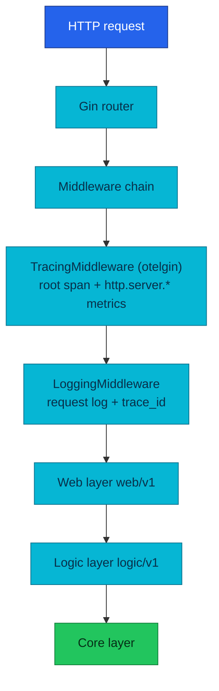
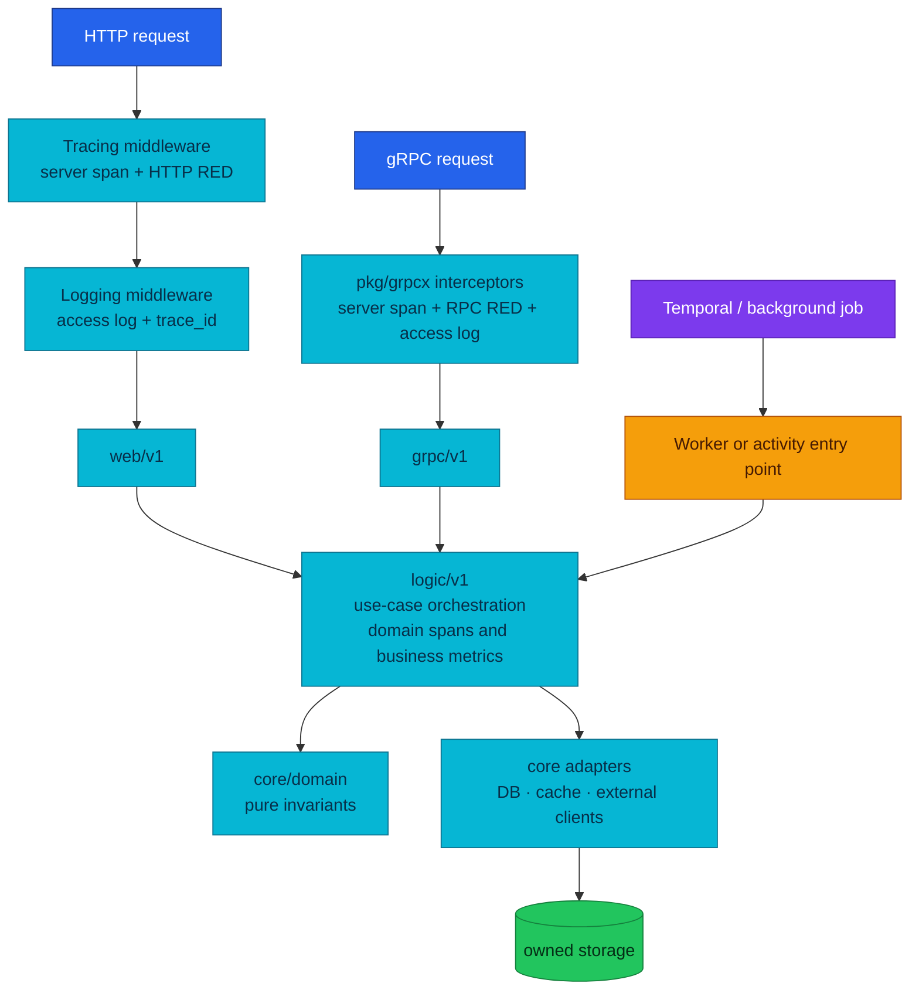
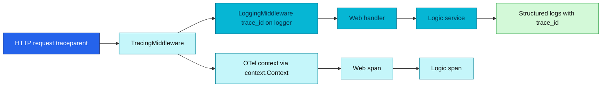

# Application Observability

Cross-cutting instrumentation contract for every Go service and worker in the platform service catalog — `pkg/obsx`, middleware order, environment variables, layer observability responsibilities, and correlation fields. Pillar deep-dives: [logs](./logs.md) · [metrics](./metrics.md) · [tracing](./tracing.md) · [profiling](./profiling.md).

| Attribute | Value | RFC / ADR |
|-----------|-------|-----------|
| **Wiring** | One call: `obsx.SetupObservability(ctx, obsx.ConfigFromEnv())` in `main()` | — |
| **Semconv** | **v1.41.0**, pinned in `pkg/obsx` — bumps only via deliberate pkg release | — |
| **Middleware** | **Tracing → logging** (two middleware); RED metrics via `otelgin` inside tracing | — |
| **Export** | OTLP/HTTP `:4318` → OpenTelemetry Collector | — |
| **Platform topology** | [OpenTelemetry (platform)](../observability/opentelemetry/README.md) · [Observability hub](../observability/README.md) | — |
| **Design record** | — | [RFC-0014](../proposals/rfc/RFC-0014/) · [ADR-016](../proposals/adr/ADR-016-otel-metrics-cutover/) |

---

## Overview

Every service and worker shares one instrumentation stack wired through **`pkg/obsx`**. Services never build OTel providers, exporters, or resources by hand. Platform backends (VictoriaMetrics, VictoriaLogs, Tempo, Pyroscope) and the Collector fan-out are documented under [`docs/observability/`](../observability/README.md).

## Document ownership

This document is the normative, application-side observability contract for
every Go service and worker in the platform service catalog. It owns shared
bootstrap, lifecycle, middleware and interceptor order, context propagation,
resource identity, cross-signal data safety, error ownership, and
observability responsibilities by layer.

| Document | Owns | Does not own |
|----------|------|--------------|
| [api.md](./api.md) | Transport contracts and the `web/grpc → logic → core` dependency direction | Signal-specific authoring rules |
| **observability.md** | Shared application instrumentation and PR compliance | Backend deployment and service-specific signals |
| [logs.md](./logs.md) | Structured-log schema, levels, fields, events, and redaction | Shared OTel bootstrap |
| [metrics.md](./metrics.md) | Metric names, types, units, labels, lifecycle, and cardinality | Collector and storage operations |
| [tracing.md](./tracing.md) | Propagation, sampling, spans, events, and error semantics | General service architecture |
| [profiling.md](./profiling.md) | Continuous-profiling setup, labels, overhead, and failure policy | Trace and metric authoring |
| [`docs/observability/`](../observability/README.md) | Collector, backends, dashboards, alerts, and runbooks | Application coding conventions |
| Service contracts | Service-specific business signals and operational interpretation | Shared instrumentation wiring |

Structural layer ownership remains defined in
[api.md § Inside Each Service](./api.md#inside-each-service).

### Reading map

| Need | Read |
|------|------|
| Add or modify service instrumentation | This document |
| Write a structured log | [logs.md](./logs.md) |
| Add a business metric | [metrics.md](./metrics.md) |
| Add a manual span or event | [tracing.md](./tracing.md) |
| Enable or troubleshoot profiling in application code | [profiling.md](./profiling.md) |
| Operate the Collector or a backend | [`docs/observability/`](../observability/README.md) |

## Normative language

**MUST** and **MUST NOT** are merge requirements. **SHOULD** is the default
unless a service contract records a justified exception. **MAY** is optional.
Current behavior and planned behavior must be labelled separately.

---

## Platform instrumentation policy (RFC-0014 — normative)

These rules apply to every service PR. Rationale: [RFC-0014](../proposals/rfc/RFC-0014/README.md).

1. **One wiring point.** Services call `obsx.SetupObservability(ctx, cfg)` once in `main()`. No hand-built OTel providers. Verified signatures (`duynhlab/pkg`, 2026-07-29): `obsx.ConfigFromEnv() Config`, `obsx.SetupObservability(ctx, Config) (*Observability, error)`, `(*Observability).Shutdown(ctx) error`, `(*Observability).ZapCore(scopeName, minLevel) zapcore.Core`.

   Canonical bootstrap (the contract shape every service `cmd/main.go`
   converges on). Setup failure is deliberately **non-fatal**: the service
   serves traffic without telemetry rather than crash-loop on a collector
   outage.

   ```go
   logger, err := zapx.New(cfg.Logging.Level) // validated config, not a raw env read
   if err != nil {
       panic("Failed to initialize logger: " + err.Error())
   }
   defer func() { _ = logger.Sync() }()

   otelCfg := obsx.ConfigFromEnv()
   middleware.SetServiceName(otelCfg.ServiceName)

   var tp interface{ Shutdown(context.Context) error }
   obs, err := obsx.SetupObservability(context.Background(), otelCfg)
   if err != nil {
       logger.Warn("Failed to initialize OpenTelemetry", zap.Error(err))
   } else {
       tp = obs
       minLevel, lvlErr := zapcore.ParseLevel(cfg.Logging.Level)
       if lvlErr != nil {
           minLevel = zapcore.InfoLevel
       }
       logger = logger.WithOptions(zap.WrapCore(func(c zapcore.Core) zapcore.Core {
           return zapcore.NewTee(c, obs.ZapCore(otelCfg.ServiceName, minLevel))
       }))
   }
   ```

   Shutdown is the **last step of the ordered graceful-shutdown sequence**
   (after the HTTP/gRPC servers stop), bounded by the shutdown context —
   `cfg.ShutdownTimeout` is an `int` of seconds behind
   `cfg.GetShutdownTimeoutDuration()`. Workers follow the same rule: every
   process flushes through a bounded `Shutdown` before exit.

   ```go
   shutdownCtx, cancel := context.WithTimeout(context.Background(), cfg.GetShutdownTimeoutDuration())
   defer cancel()
   // ...stop servers first...
   if tp != nil {
       if err := tp.Shutdown(shutdownCtx); err != nil {
           logger.Warn("OpenTelemetry shutdown error", zap.Error(err))
       }
   }
   ```

2. **`client_golang` is retired.** No `prometheus.*`/`promauto` in app code — metrics use the OTel Meter API with semconv names. The `/metrics` scrape endpoint was removed at RFC-0014 P3.
3. **Semconv v1.41 is pinned** in `pkg/obsx`; SDK/contrib/semconv triple bumps only as a deliberate pkg release.
4. **Never set `OTEL_SEMCONV_STABILITY_OPT_IN`.** Any value containing `rpc` silently renames metrics and breaks consumers.
5. **The Views are law.** HTTP duration uses the platform 13-bucket set `{0.005, 0.01, 0.025, 0.05, 0.1, 0.2, 0.3, 0.5, 0.75, 1, 2, 5, 10}`; body-size histograms use byte buckets; `rpc.client.call.duration` drops `server.address`/`server.port`. Changing buckets is an RFC-level decision.
6. **Rollout flags ON fleet-wide.** `OTEL_METRICS_ENABLED` / `OTEL_LOGS_ENABLED` are enabled fleet-wide (P3/P4 cutovers). They remain per-service kill switches.
7. **Export interval is 15 s** (`OTEL_METRIC_EXPORT_INTERVAL_SECONDS`) — matches historical scrape interval for burn-rate math.
8. **No secrets/PII in labels or resource attributes.**
9. **Health and reflection RPCs are not telemetry.** `pkg/grpcx` filters them from spans and metrics.
10. **Cardinality backstop:** SDK 2000-attribute-set limit per instrument; `otel.metric.overflow` is an alert.

### API vs SDK vs contrib

| Layer | Who imports it here |
|---|---|
| **API** (`go.opentelemetry.io/otel`, …) | `pkg/obsx`, `pkg/grpcx`, middleware |
| **SDK** | **Only `pkg/obsx.SetupObservability`** |
| **Exporters** | `pkg/obsx` only |
| **Contrib** (`otelgin`, `otelgrpc`, `otelzap`, `runtime`) | Router middleware; rest via `pkg/obsx`/`pkg/grpcx` |

---

## Middleware and interceptors

The HTTP middleware chain is **tracing → logging** (two middleware only).

| Order | Middleware | Emits |
|-------|------------|-------|
| 1 | **Tracing** (`otelgin` via `TracingMiddleware`) | Root span + **`http.server.*` metrics** via global MeterProvider |
| 2 | **Logging** | Structured JSON + `trace_id` on stdout; otelzap tee when enabled |

There is **no separate metrics middleware**. RED HTTP metrics come from the same `otelgin` instrumentation that creates spans. gRPC RED + tracing come from `pkg/grpcx` `otelgrpc` handlers.

Sharing status (as-built): providers (`pkg/obsx`), gRPC (`pkg/grpcx`), and DB (`pkg/dbx` + otelpgx) are shared libraries; the HTTP `TracingMiddleware`/`LoggingMiddleware` pair and the span helpers are **copied per service** under `<svc>-service/middleware/` (byte-identical tracing, minor logging variants). Promoting them into `pkg` is a target, not current reality.


```mermaid
graph TD
    A["HTTP request"] --> B["Gin router"]
    B --> C["Middleware chain"]
    C --> D["TracingMiddleware (otelgin)<br/>root span + http.server.* metrics"]
    D --> E["LoggingMiddleware<br/>request log + trace_id"]
    E --> H["Web layer web/v1"]
    H --> L["Logic layer logic/v1"]
    L --> O["Core layer"]
    classDef edge fill:#2563eb,color:#fff,stroke:#1e3a8a;
    classDef service fill:#06b6d4,color:#082f49,stroke:#0e7490;
    classDef data fill:#22c55e,color:#052e16,stroke:#15803d;
    class A edge;
    class B,C,D,E,H,L service;
    class O data;
```

Profiling (`obsx.SetupProfiling`) pushes out-of-band to Pyroscope — see [Application profiling](./profiling.md).

### Health, readiness, and reflection filtering

Routine probes are traffic about the platform, not the domain — they are
excluded from every request-scoped signal:

| Signal | Contract | Enforced by |
|--------|----------|-------------|
| HTTP spans + `http.server.*` RED | Exclude `/health`, `/healthz`, `/ready`, `/readyz`, `/livez`, `/metrics`, `/favicon.ico` (prefix match) | `TracingMiddleware` skips before `otelgin` runs — no span, no metric |
| gRPC spans + RPC RED | Exclude `grpc.health.v1.Health` and `grpc.reflection.*` | `pkg/grpcx` `otelgrpc.WithFilter` |
| gRPC access logs | Exclude the same health/reflection prefixes | `pkg/grpcx` access interceptor |
| HTTP access logs | Exclude routine successful probes; keep failed probes and readiness transitions | Skip list in the logging middleware (same list as `TracingMiddleware`) |
| Startup/shutdown logs | Always retained | — |

---

## Observability responsibilities by layer

The structural dependency direction is defined in
[api.md § Inside Each Service](./api.md#inside-each-service). This section
defines only what each layer emits, which context it propagates, and which
observability concerns it must not own.

| Boundary / layer | Automatic telemetry | Manual responsibility | Must not do |
|------------------|---------------------|-----------------------|-------------|
| **HTTP transport — `web/v1`** | HTTP server span and `http.server.*` RED metrics | Validate input, propagate `context.Context`, map errors, and use the context logger | Create a duplicate generic request span; hand-write RED metrics; log raw bodies |
| **gRPC transport — `grpc/v1`** | Server span, RPC RED metrics, and access log through `pkg/grpcx` | Validate protobuf input, propagate metadata/context, and map typed errors to gRPC status | Duplicate logic; hand-write RPC RED metrics |
| **Application logic — `logic/v1`** | Inherited context only | Enrich the current span with business attributes; create meaningful domain spans/events and emit business metrics at the authoritative decision point | Depend on Gin/gRPC types; create spans for trivial functions; use IDs as metric labels |
| **Core domain — `core/domain`** | None | Enforce pure aggregates, value objects, transitions, and invariants | Import OTel, zap, Gin, gRPC, DB clients, or environment configuration |
| **Core adapters / repositories** | DB/cache/client spans and metrics through shared adapters (`otelpgx`, `pkg/grpcx`) | Accept context, annotate meaningful failures, and return typed errors | Construct providers/exporters; hand-wrap driver calls in spans (the driver instrumentation already emits the CLIENT span); log the same error at every layer |
| **Worker / activity entry point** | Shared process and supported activity instrumentation | Propagate correlation, emit lifecycle logs, and call `logic/v1` directly | Call HTTP handlers; use workflow/order IDs as metric labels |
| **Temporal workflow code** | Temporal history and supported SDK instrumentation | Use deterministic workflow APIs and replay-safe logging | Perform arbitrary network I/O or telemetry export side effects directly |


```mermaid
flowchart TB
    HTTP["HTTP request"] --> HM["Tracing middleware<br/>server span + HTTP RED"]
    HM --> LM["Logging middleware<br/>access log + trace_id"]
    LM --> WEB["web/v1"]

    RPC["gRPC request"] --> GI["pkg/grpcx interceptors<br/>server span + RPC RED + access log"]
    GI --> GRPC["grpc/v1"]

    TEMP["Temporal / background job"] --> ACT["Worker or activity entry point"]

    WEB --> LOGIC["logic/v1<br/>use-case orchestration<br/>domain spans and business metrics"]
    GRPC --> LOGIC
    ACT --> LOGIC

    LOGIC --> DOMAIN["core/domain<br/>pure invariants"]
    LOGIC --> ADAPTER["core adapters<br/>DB · cache · external clients"]
    ADAPTER --> DB[("owned storage")]

    classDef edge fill:#2563eb,color:#fff,stroke:#1e3a8a;
    classDef service fill:#06b6d4,color:#082f49,stroke:#0e7490;
    classDef worker fill:#f59e0b,color:#451a03,stroke:#b45309;
    classDef data fill:#22c55e,color:#052e16,stroke:#15803d;
    classDef platform fill:#7c3aed,color:#fff,stroke:#5b21b6;

    class HTTP,RPC edge;
    class HM,LM,GI,WEB,GRPC,LOGIC,DOMAIN,ADAPTER service;
    class TEMP platform;
    class ACT worker;
    class DB data;
```

### Span kinds by layer

Span **kind** encodes which side of a boundary a span sits on — it is how
backends build the service graph and where the layer split becomes visible in
a trace:

| SpanKind | Layer that owns it | Created by |
|----------|--------------------|------------|
| `SERVER` | HTTP/gRPC transport in | `otelgin` / `pkg/grpcx` (automatic) |
| `INTERNAL` | `logic/v1` manual spans (the default kind) | `middleware.StartSpan` |
| `CLIENT` | Core adapters calling out — DB, cache, gRPC client, provider | `otelpgx` / `pkg/grpcx` (automatic) |
| `PRODUCER` / `CONSUMER` | Queue and worker boundaries (Temporal) | Supported SDK integration |

### Enrich before you create

When the automatic span is missing business context, the order of preference
is: **set attributes on the current span → add a span event → only then
create a child span**. A wrapper span around an already-instrumented call adds
cost and noise without adding a meaningful duration or error boundary.

```go
// logic/v1 — the otelgin/otelgrpc span is already active on ctx
middleware.AddSpanAttributes(ctx,
    attribute.String("checkout.outcome", outcome),
)
```

All span helpers are gated on `span.IsRecording()`, so attribute enrichment
on unsampled requests costs nothing — but keep expensive value computation
behind your own check when it isn't a ready value.

### Examples

HTTP handlers reuse the server span from `otelgin` — do not create a second
generic request span:

```go
func (h *Handler) CreateOrder(c *gin.Context) {
    ctx := c.Request.Context()
    logger := middleware.GetLoggerFromGinContext(c)

    var req CreateOrderRequest
    if err := c.ShouldBindJSON(&req); err != nil {
        logger.Warn(
            "request validation failed",
            zap.String("operation", "order.create"),
            zap.Error(err),
        )
        httpx.RespondError(c, http.StatusBadRequest, httpx.CodeValidation, err.Error())
        return
    }

    result, err := h.service.CreateOrder(ctx, req)
    if err != nil {
        h.writeError(c, err)
        return
    }

    c.JSON(http.StatusCreated, result)
}
```

Logger retrieval is the fleet-majority pattern: the logging middleware stores
the request logger with `c.Set("logger", …)` and handlers read it back with
`middleware.GetLoggerFromGinContext(c)`. auth-service instead injects it into
the request context (`zapx.WithContext`/`zapx.FromContext`) — same contract,
different carrier. Error responses go through `httpx.RespondError`
(`pkg/httpx`); there is no `httpx.ValidationError` helper.

Logic methods do not automatically receive one manual span each. Create a
manual span only for a meaningful operation, failure boundary, or multi-step
use case:

```go
func (s *CheckoutService) Confirm(ctx context.Context, sessionID string) (*Order, error) {
    ctx, span := tracer.Start(ctx, "checkout.confirm")
    defer span.End()

    order, err := s.confirmSession(ctx, sessionID)
    if err != nil {
        return nil, err
    }
    s.metrics.SessionsConfirmed.Add(ctx, 1)
    return order, nil
}
```

`core/domain` may contain pure aggregates, value objects, transitions, and
invariants. It must not depend on Gin, gRPC transport types, OTel SDK/exporters,
zap, environment configuration, or cross-service orchestration. Adapters under
`core/` accept context and return typed errors; DB/cache spans bubble up via
shared instrumentation.

---

## Trace-ID propagation


```mermaid
graph LR
    A["HTTP request traceparent"] --> B["TracingMiddleware"]
    B --> C["LoggingMiddleware trace_id on logger"]
    C --> D["Web handler"]
    D --> E["Logic service"]
    E --> F["Structured logs with trace_id"]
    B --> G["OTel context via context.Context"]
    G --> H["Web span"]
    H --> I["Logic span"]
    classDef edge fill:#2563eb,color:#fff,stroke:#1e3a8a;
    classDef service fill:#06b6d4,color:#082f49,stroke:#0e7490;
    classDef log fill:#d3f9d8,color:#111,stroke:#2f9e44;
    classDef trace fill:#c5f6fa,color:#111,stroke:#0c8599;
    class A edge;
    class C,D,E service;
    class F log;
    class B,G,H,I trace;
```

Services accept and propagate W3C Trace Context (`traceparent`). At the edge,
Kong's opentelemetry plugin **forces** a W3C `traceparent` onto every upstream
request (`propagation.inject: [w3c]`, extracting w3c/b3/jaeger/ot), so the
service span always joins the edge trace — verified in
`kubernetes/infra/configs/kong/plugins.yaml`. gRPC metadata carries the same
context via `pkg/grpcx`.

## Worker and Temporal instrumentation

Workers are process entry points that call `logic/v1` directly. They are not an
additional business layer and do not call HTTP or gRPC handlers.

- Initialize the shared observability stack exactly once in each worker
  process.
- Use the same `service.name`, namespace, environment, version, and exporter
  policy as the corresponding API process, while keeping a distinct service
  identity when the worker is deployed and operated separately.
- Emit lifecycle logs for startup, poller readiness, graceful shutdown, and
  terminal retry exhaustion.
- Activities may create spans, events, logs, and bounded business metrics
  through their activity context.
- Temporal workflow code must remain deterministic. It must not perform direct
  network I/O, arbitrary OTel export, or non-replay-safe logging side effects.
- Use Temporal-aware, replay-safe workflow logging.
- Workflow IDs, run IDs, order IDs, session IDs, and reservation IDs may be
  selected trace/log attributes when operationally justified; they must never
  be metric labels or profile labels.
- Activity retries must rely on idempotent business operations. Telemetry must
  state whether counters represent attempts or unique business outcomes.
- Post-pivot mandatory-forward failures and compensation failures require
  explicit operational signals.

## Cross-signal data and privacy policy

The same data classification applies across logs, metrics, traces, resources,
and profile labels. A value being technically accepted by an SDK does not make
it safe or operationally useful.

| Data class | Metrics and resource attributes | Traces | Logs | Profile labels |
|------------|--------------------------------|--------|------|----------------|
| Service, namespace, environment, version | Allowed | Allowed | Allowed | Allowed |
| Route template, RPC method, bounded status/reason | Allowed | Allowed | Allowed | Usually not applicable |
| Order, payment, cart, session, workflow, SKU, or user IDs | Forbidden | Allowed only when operationally justified | Allowed only when operationally justified | Forbidden |
| Email, phone, address, IP, full User-Agent | Forbidden | Avoid by default; approved use case required | Redact or omit by default | Forbidden |
| Passwords, hashes, access/refresh tokens, cookies, authorization headers, payment secrets, PAN-like data | Forbidden | Forbidden | Forbidden | Forbidden |
| Raw request/response bodies | Forbidden | Forbidden by default | Forbidden by default | Not applicable |
| Arbitrary user-provided strings | Forbidden | Avoid or normalize | Allowed only after safety review | Forbidden |

Rules:

1. Metric labels and resource attributes must be low-cardinality and bounded.
2. Business identifiers are high-cardinality even when they are UUIDs or
   numeric IDs.
3. Span names, metric names, log event names, and profile label keys are stable
   operation classes and never contain IDs.
4. User identifiers are pseudonymous data and follow the same retention and
   access controls as other user-linked telemetry.
5. Redaction happens before a value reaches the logger or telemetry API.
6. A new sensitive field requires an explicit owner, purpose, retention rule,
   and review.

## Error ownership

One failure should not create the same error log at every layer.

- Record an error on the span where the failure originates or becomes
  operationally meaningful.
- Log an error once at the boundary that decides the final action: return,
  retry, compensate, abandon, or escalate.
- Lower layers return typed errors instead of repeatedly logging them.
- HTTP/gRPC access instrumentation owns the final request/RPC summary.
- Expected business outcomes such as `NOT_FOUND`, `PRICE_CHANGED`,
  `STOCK_UNAVAILABLE`, `PAYMENT_DECLINED`, or `INVALID_TRANSITION` are not
  automatically infrastructure errors.
- A retry loop may log attempts at `debug` or `warn`; it logs the terminal
  failure at `error`.
- Compensation failure and unknown external-provider outcome are terminal
  operational conditions and must remain visible.
- Error messages and attributes must not contain secrets or raw payloads.

| Boundary | Typical responsibility |
|----------|------------------------|
| Repository/adapter | Return typed error; add a span error only when the adapter failure matters |
| Logic/use case | Decide domain outcome, retryability, or compensation |
| Transport | Map typed error to HTTP/gRPC contract |
| Access middleware/interceptor | Emit final request/RPC summary |
| Worker/activity | Decide retry, compensation, abandonment, or escalation |

---

## Environment variables

Read by `obsx.ConfigFromEnv` (injected by app ResourceSets, `kubernetes/apps/domains/*-rs.yaml`, workers):

| Env | Default / deployed | Meaning |
|-----|-------------------|---------|
| `OTEL_COLLECTOR_ENDPOINT` | Cluster DNS `:4318`; local `otel-collector:4318` | OTLP/HTTP target for all signals |
| `OTEL_SERVICE_NAME` / `SERVICE_NAME` | — | Authoritative `service.name` |
| `SERVICE_VERSION` | — | semconv `service.version` |
| `K8S_NAMESPACE_NAME`, `K8S_POD_NAME` | Downward API | k8s identity on Resource |
| `DEPLOYMENT_ENVIRONMENT` | — | semconv `deployment.environment.name` |
| `TRACING_ENABLED` | `true` | Traces kill switch |
| `OTEL_SAMPLE_RATE` | `0.1`; local `1.0` | Head-sampling ratio (`ParentBased(TraceIDRatioBased)`) |
| `OTEL_METRICS_ENABLED` | `true` | OTLP metrics + runtime instrumentation |
| `OTEL_LOGS_ENABLED` | `false` in pkg; manifests `true` | otelzap → OTLP logs |
| `OTEL_METRIC_EXPORT_INTERVAL_SECONDS` | `15` | PeriodicReader interval (pkg default) |
| `LOG_LEVEL` | `info` | zapx + otelzap level gate — see [logs.md](./logs.md) |
| `PROFILING_ENABLED` | `true` | Pyroscope push — see [profiling.md](./profiling.md) |
| `PYROSCOPE_ENDPOINT` | `http://pyroscope.monitoring.svc.cluster.local:4040` | Profiler target |

Note: `OTEL_COLLECTOR_ENDPOINT` and `OTEL_SAMPLE_RATE` are platform names read by `obsx`, not standard SDK vars (`OTEL_EXPORTER_OTLP_ENDPOINT`, `OTEL_TRACES_SAMPLER_ARG`).

Sampling details: [Application tracing](./tracing.md#sampling).

---

## Correlation fields

| Field | Signal | Join |
|-------|--------|------|
| `trace_id` | Logs, traces | Log → Tempo; Tempo → logs (`tracesToLogsV2`) |
| `span_id` | Logs | Span-scoped log lines |
| `pyroscope.profile.id` | Traces, profiles | Span → CPU flame graph — see [profiling.md](./profiling.md) |
| `service.name` / `app` | Metrics, traces, logs, profiles | Fleet identity via `OTEL_SERVICE_NAME` |

Exemplars are **not** available on this platform (VictoriaMetrics D-14). Correlation loop: metric → logs by label+time → `trace_id` → Tempo — see [metrics.md](./metrics.md#correlation-metrics--traces--logs).

---

## Pull-request compliance checklist

A service or worker PR is observability-compliant only when:

- [ ] `obsx.SetupObservability` is called exactly once per process.
- [ ] Shutdown uses a bounded context and flushes enabled providers.
- [ ] The service does not construct OTel SDK providers or exporters directly.
- [ ] The logger OTLP branch is gated on the same `LOG_LEVEL` as the stdout branch.
- [ ] Access logs follow the semconv field schema in [logs.md](./logs.md#access-log-policy).
- [ ] Exported log records carry the full [LogRecord mapping](./logs.md#otel-log-data-model) (trace context, resource, scope).
- [ ] HTTP middleware order is tracing, then logging.
- [ ] gRPC servers and clients use `pkg/grpcx`.
- [ ] Transport handlers propagate the incoming context into `logic/v1`.
- [ ] HTTP and gRPC handlers do not create duplicate generic request spans.
- [ ] Manual span names are stable and contain no resource IDs.
- [ ] Business metrics are emitted at the authoritative decision point.
- [ ] Metric labels are bounded enumerations; IDs and user-provided values are forbidden.
- [ ] Logs, spans, metrics, resources, and profile labels contain no secrets.
- [ ] Expected business rejections are distinguished from infrastructure failures.
- [ ] Errors are logged once at the boundary that decides return, retry, compensate, abandon, or escalate.
- [ ] Health, readiness, and reflection telemetry follow the shared filtering policy.
- [ ] Worker and Temporal code follows deterministic and replay-safe rules.
- [ ] Service-specific business signals are documented in the owning service contract.
- [ ] New metrics are registered in the metric catalog and have an operational interpretation.
- [ ] Local-stack smoke tests verify HTTP, gRPC, worker, and profiling startup paths that apply.

---

## Pillar deep-dives

| Pillar | Contract doc | Platform ops |
|--------|--------------|----------------|
| Logs | [logs.md](./logs.md) | [logging/](../observability/logging/README.md) |
| Metrics | [metrics.md](./metrics.md) | [metrics/](../observability/metrics/README.md) |
| Traces | [tracing.md](./tracing.md) | [tracing/](../observability/tracing/README.md) |
| Profiles | [profiling.md](./profiling.md) | [profiling/](../observability/profiling/README.md) |

---

## References

- [API and service communication guide](./api.md)
- [RFC-0014 explainer](../observability/opentelemetry/rfc-0014-explainer.md)
- [RFC-0014](../proposals/rfc/RFC-0014/)
- [OpenTelemetry (platform)](../observability/opentelemetry/README.md)

_Last updated: 2026-07-29 — canonical cross-cutting observability contract; as-built claims verified against `duynhlab/pkg` and the service repos._
