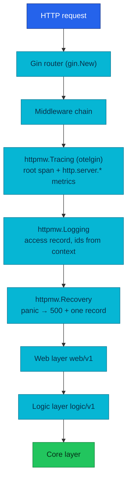
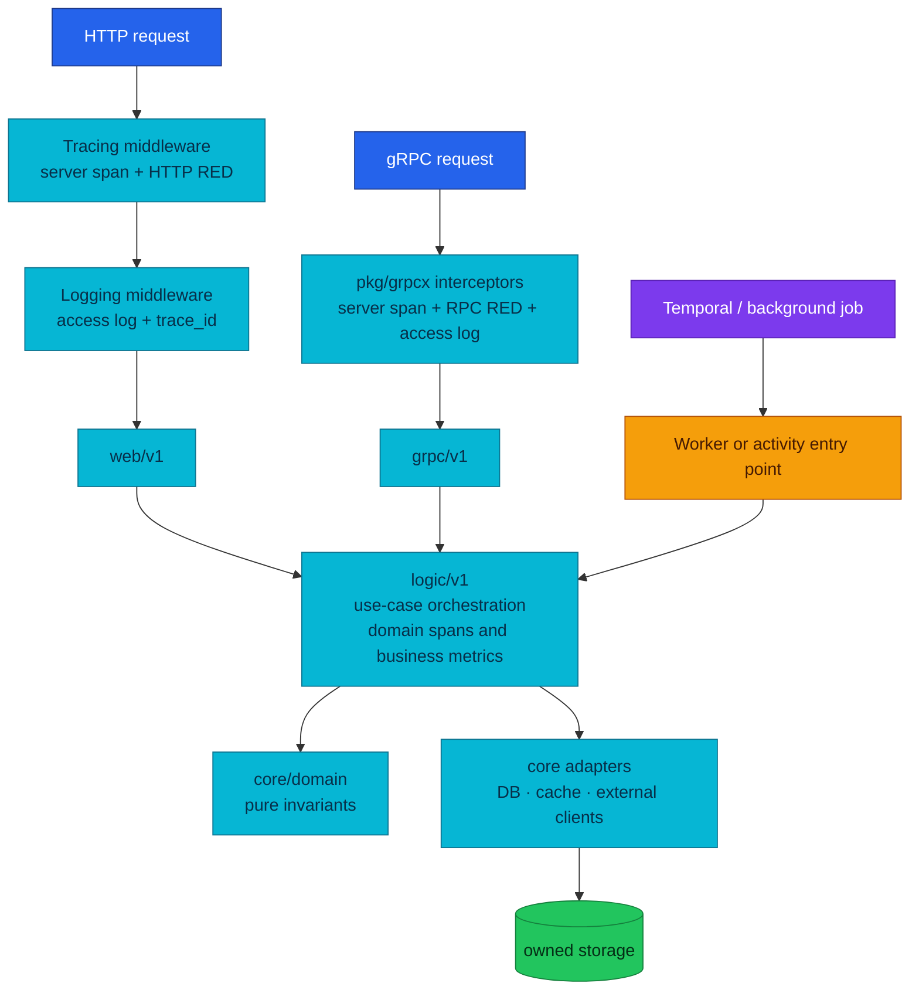
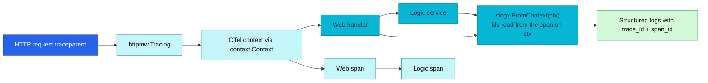

# Application Observability

Cross-cutting instrumentation contract for every Go service and worker in the platform service catalog — `pkg/obsx`, middleware order, environment variables, layer observability responsibilities, and correlation fields. Pillar deep-dives: [logs](./logs.md) · [metrics](./metrics.md) · [tracing](./tracing.md) · [profiling](./profiling.md).

| Attribute | Value | RFC / ADR |
|-----------|-------|-----------|
| **Wiring** | One call: `obsx.SetupObservability(ctx, obsx.ConfigFromEnv())` in `main()` | — |
| **Semconv** | **v1.41.0**, pinned in `pkg/obsx` — bumps only via a deliberate `obsx` release | — |
| **Middleware** | **Tracing → logging → recovery** from `pkg/httpmw` on `gin.New()`; RED metrics via `otelgin` inside tracing | — |
| **Logging** | `pkg/logger/slogx` facade (`logger/slogx` v0.2.0 fleet-wide) — one redacted record to stdout JSON and OTLP | — |
| **Export** | OTLP/HTTP `:4318` → OpenTelemetry Collector | — |
| **Platform topology** | [OpenTelemetry (platform)](../observability/opentelemetry/README.md) · [Observability hub](../observability/README.md) | — |
| **Design record** | — | [RFC-0014](../proposals/rfc/RFC-0014/) · [ADR-016](../proposals/adr/ADR-016-otel-metrics-cutover/) · **[RFC-0031](../proposals/rfc/RFC-0031/) (Accepted 2026-09-17; as-built 2026-09-24)** → [ADR-070](../proposals/adr/ADR-070-logging-facade-and-event-catalog/) (slog facade, event catalog) · [ADR-071](../proposals/adr/ADR-071-telemetry-event-data-contract/) (access/event schema, privacy) · [ADR-072](../proposals/adr/ADR-072-telemetry-clean-cutover/) (one-release cutover, version floor) · [ADR-073](../proposals/adr/ADR-073-application-metrics-contract/) (instruments, buckets, budget) · [ADR-074](../proposals/adr/ADR-074-continuous-profiling-contract/) (profile identity, labels) · [ADR-075](../proposals/adr/ADR-075-application-tracing-contract/) (sampling, spans, baggage) · [ADR-076](../proposals/adr/ADR-076-semantic-convention-registry/) (Weaver registry) |

---

## Overview

Every service and worker shares one instrumentation stack wired through **`pkg/obsx`**. Services never build OTel providers, exporters, or resources by hand. Platform backends and the Collector fan-out are documented under
[`docs/observability/`](../observability/README.md). The full set the collector writes to
today is **four**: VictoriaMetrics (metrics, including the `span_metrics` connector's
output), VictoriaLogs and ClickHouse (logs), and VictoriaTraces and ClickHouse
(traces). Pyroscope receives profiles directly from the SDK, not through the
collector. Tempo and Jaeger were retired by
[RFC-0027](../proposals/rfc/RFC-0027/README.md).

## Document ownership

This document is the normative, application-side observability contract for
every Go service and worker in the platform service catalog. It owns shared
bootstrap, lifecycle, middleware and interceptor order, context propagation,
resource identity, cross-signal data safety, error ownership, and
observability responsibilities by layer.

| Document | Owns | Does not own |
|----------|------|--------------|
| [api.md](./api.md) | Transport contracts and the `web/grpc → logic → core` dependency direction | Signal-specific authoring rules |
| **observability.md** | Shared application instrumentation and PR compliance | Backend deployment and service-specific signals |
| [logs.md](./logs.md) | Structured-log schema, levels, fields, events, and redaction | Shared OTel bootstrap |
| [metrics.md](./metrics.md) | Metric names, types, units, labels, lifecycle, and cardinality | Collector and storage operations |
| [tracing.md](./tracing.md) | Propagation, sampling, spans, events, and error semantics | General service architecture |
| [profiling.md](./profiling.md) | Continuous-profiling setup, labels, overhead, and failure policy | Trace and metric authoring |
| [`docs/observability/`](../observability/README.md) | Collector, backends, dashboards, alerts, and runbooks | Application coding conventions |
| Service contracts | Service-specific business signals and operational interpretation | Shared instrumentation wiring |

Structural layer ownership remains defined in
[api.md § Inside Each Service](./api.md#inside-each-service).

### Reading map

| Need | Read |
|------|------|
| Add or modify service instrumentation | This document |
| Write a structured log | [logs.md](./logs.md) |
| Add a business metric | [metrics.md](./metrics.md) |
| Add a manual span or event | [tracing.md](./tracing.md) |
| Enable or troubleshoot profiling in application code | [profiling.md](./profiling.md) |
| Operate the Collector or a backend | [`docs/observability/`](../observability/README.md) |

## Normative language

**MUST** and **MUST NOT** are merge requirements. **SHOULD** is the default
unless a service contract records a justified exception. **MAY** is optional.
Current behavior and planned behavior must be labelled separately.

---

## Platform instrumentation policy (RFC-0014 — normative)

These rules apply to every service PR. Rationale: [RFC-0014](../proposals/rfc/RFC-0014/README.md).

1. **One wiring point.** Services call `obsx.SetupObservability(ctx, cfg)` once in `main()`. No hand-built OTel providers. Verified signatures (`duynhlab/pkg` `obsx/v0.45.0`, 2026-09-24): `obsx.ConfigFromEnv() Config`, `obsx.SetupObservability(ctx, Config, ...SetupOption) (*Observability, error)`, `(*Observability).Enabled() Signals` (`{Traces, Metrics, Logs bool}` — the only supported "is it on" check), `(*Observability).TracerProvider() trace.TracerProvider` / `MeterProvider() metric.MeterProvider` / `LoggerProvider() log.LoggerProvider` (API types, true nils when off), `(*Observability).ForceFlush(ctx) error` (exports what every provider has buffered without stopping it — logs first), `(*Observability).Shutdown(ctx) error`. `ZapCore` and `TraceContext` were removed in `obsx` v0.45.0 together with the `otelzap` dependency: the logger reaches OTLP through the global `LoggerProvider` that `SetupObservability` installs, which the `slogx` facade reads. Temporal services (order, checkout) add `obsx.WithTracerProviderFactory(func(c obsx.TracerProviderConfig) obsx.ShutdownTracerProvider { return temporalx.NewReplaySafeTracerProvider(c.SDKOptions()...) })` — no `sdk/trace` import in `main()`.

   Canonical bootstrap — the shape every service `cmd/main.go` runs since the
   2026-09-24 release train (cart-service shown; the level comes from validated
   config or `LOG_LEVEL`). Setup failure is deliberately **non-fatal**: the
   service serves traffic without telemetry rather than crash-loop on a
   collector outage.

   ```go
   logger := slogx.New(slogx.Config{Level: cfg.Logging.Level})
   slogx.SetDefault(logger) // what slogx.FromContext falls back to

   otelCfg := obsx.ConfigFromEnv()

   var tp interface{ Shutdown(context.Context) error }
   obs, err := obsx.SetupObservability(context.Background(), otelCfg)
   if err != nil {
       logger.Warn(ctx, "Failed to initialize OpenTelemetry", slogx.Err(err))
   } else {
       tp = obs
       // The facade already reaches OTLP through the global logger provider
       // obsx installed; rebuilding it only wires Flush, so a Fatal record is
       // exported before the process exits.
       logger = slogx.New(slogx.Config{Level: cfg.Logging.Level, Flush: obs.ForceFlush})
       slogx.SetDefault(logger)
   }
   ```

   The transport layer takes the facade's `*slog.Logger` view:
   `gin.New()` (never `gin.Default()`, whose own logger and recovery print the
   raw path and client address past the facade) with
   `httpmw.Tracing(serviceName)`, `httpmw.Logging(logger.Slog())` and
   `httpmw.Recovery(logger.Slog())`; `grpcx.NewServer(logger.Slog())`; and,
   in the Temporal services, `temporalx.Dial(..., temporalx.WithLogger(logger.Slog()))`.
   Business code logs through `slogx.FromContext(ctx)` (or an injected
   `*slogx.Logger`) and always passes the context — correlation comes from the
   span on the context, not from bound fields.

   Shutdown is the **last step of the ordered
   [graceful-shutdown sequence](./graceful-shutdown.md)**
   (after the HTTP/gRPC servers stop), bounded by the shutdown context —
   `cfg.ShutdownTimeout` is an `int` of seconds behind
   `cfg.GetShutdownTimeoutDuration()`. Workers follow the same rule: every
   process flushes through a bounded `Shutdown` before exit. The lifecycle
   records bracket the process: `logger.ProcessStarted(ctx, component)` before
   the signal wait, and `logger.ProcessStopped(ctx, component, outcome)`
   **before** the OTel shutdown, because a record emitted after it is dropped.
   Records written after the signal use a context that is not the cancelled
   signal context.

   ```go
   shutdownCtx, cancel := context.WithTimeout(context.Background(), cfg.GetShutdownTimeoutDuration())
   defer cancel()
   // ...stop servers first...
   logger.ProcessStopped(ctx, slogx.ComponentAPI, outcome)
   if tp != nil {
       if err := tp.Shutdown(shutdownCtx); err != nil {
           logger.Error(ctx, "OpenTelemetry shutdown error", slogx.Err(err))
       }
   }
   ```

2. **`client_golang` is retired.** No `prometheus.*`/`promauto` in app code — metrics use the OTel Meter API with semconv names. The `/metrics` scrape endpoint was removed at RFC-0014 P3.
3. **Semconv v1.41 is pinned** in `pkg/obsx`; SDK/contrib/semconv triple bumps only as a deliberate `obsx` release ([pkg.md](./pkg.md)).
4. **Never set `OTEL_SEMCONV_STABILITY_OPT_IN`.** Any value containing `rpc` silently renames metrics and breaks consumers.
5. **The Views are law.** HTTP duration uses the platform 13-bucket set `{0.005, 0.01, 0.025, 0.05, 0.1, 0.2, 0.3, 0.5, 0.75, 1, 2, 5, 10}`; body-size histograms use byte buckets; `rpc.client.call.duration` drops `server.address`/`server.port`. Changing buckets is an RFC-level decision.
6. **Rollout flags ON fleet-wide.** `OTEL_METRICS_ENABLED` / `OTEL_LOGS_ENABLED` are enabled fleet-wide (P3/P4 cutovers). They remain per-service kill switches.
7. **Export interval is 15 s** (`OTEL_METRIC_EXPORT_INTERVAL_SECONDS`) — matches historical scrape interval for burn-rate math.
8. **No secrets/PII in labels or resource attributes.**
9. **Health and reflection RPCs are not telemetry.** `pkg/grpcx` filters them from spans and metrics.
10. **Cardinality backstop:** SDK 2000-attribute-set limit per instrument; `otel.metric.overflow` is an alert.

### API vs SDK vs contrib

| Layer | Who imports it here |
|---|---|
| **API** (`go.opentelemetry.io/otel`, …) | `pkg/obsx`, `pkg/grpcx`, `pkg/httpmw`, `pkg/logger/slogx` (`otel/log`) |
| **SDK** | **Only `pkg/obsx.SetupObservability`** |
| **Exporters** | `pkg/obsx` only |
| **Contrib** (`otelgin`, `otelgrpc`, `runtime`, `bridges/otelslog`) | `otelgin` in `pkg/httpmw` only; the slog bridge in `pkg/logger/slogx` only; rest via `pkg/obsx`/`pkg/grpcx` |

---

## Cross-signal telemetry standard (RFC-0031 — normative)

> **Status: `Accepted` 2026-09-17; as-built 2026-09-24.** [RFC-0031](../proposals/rfc/RFC-0031/) and its seven
> resulting records are the platform's telemetry standard, and every service PR is
> reviewed against the rules below **in addition to** the RFC-0014 policy above. The
> fleet cut over in one release train on 2026-09-24 (all ten services on
> `logger/slogx` v0.2.0 and `obsx` v0.45.0). Two parts are still **planned**: the
> Weaver semantic-convention registry (RFC-0031 Task 4.5) and a *blocking* fleet lint
> policy — see Enforcement below. Rationale and alternatives live in the ADRs, not here.

**The shared-package rule** ([ADR-072](../proposals/adr/ADR-072-telemetry-clean-cutover/) (one-release cutover, version floor)). A service does not choose its own telemetry
libraries. It imports the shared package and the OpenTelemetry **API**; the SDK, every
exporter, every bridge and every backend client are linked in exactly one place,
`pkg/obsx`. A change to how the fleet emits telemetry is a shared-package release
followed by a version bump, never an edit in a service. The table extends the RFC-0014
[API vs SDK vs contrib](#api-vs-sdk-vs-contrib) boundary to logging and profiling:

| Signal | A service may import | A service must not import | Owned by |
|---|---|---|---|
| Logs | `pkg/logger/slogx` ([ADR-070](../proposals/adr/ADR-070-logging-facade-and-event-catalog/) (slog facade, event catalog)); `log/slog` only for the `slog.Attr` constructors the facade takes and the `*slog.Logger` it hands to `httpmw`/`grpcx`/`temporalx` through `logger.Slog()` | `go.uber.org/zap`, `zapcore`, `slog` handlers or `slog.New` of its own, `github.com/rs/zerolog`, `go.opentelemetry.io/contrib/bridges/*`, `go.opentelemetry.io/otel/log` | `slogx` (API + bridge), `obsx` (export) |
| Metrics | `go.opentelemetry.io/otel/metric`, `otel/attribute`; instruments via `obsx` helpers | `go.opentelemetry.io/otel/sdk/metric`, `otel/exporters/*`, `github.com/prometheus/client_golang` | `obsx` |
| Traces | `go.opentelemetry.io/otel/trace`, `otel/attribute`, `otel/codes`; spans via `obsx.StartSpan` | `go.opentelemetry.io/otel/sdk/trace`, `otel/exporters/*`, `otel/propagation` setup | `obsx`, `httpmw`, `grpcx` |
| Profiles | nothing — `obsx.SetupProfiling` only | `github.com/grafana/pyroscope-go`, `runtime.SetMutexProfileFraction`, `runtime.SetBlockProfileRate` | `obsx` |
| Transport | `pkg/httpmw`, `pkg/grpcx` | `contrib/instrumentation/*` directly | `httpmw`, `grpcx` |

Tests are exempt. **Since the 2026-09-24 release train the fleet is compliant on all four
signals.** No service `cmd/main.go` imports `go.opentelemetry.io/otel/sdk/*`: `obsx`
exports no SDK type — `obs.Enabled()` replaces the old nil-checks on SDK provider fields,
and the Temporal services forward `obsx.TracerProviderConfig.SDKOptions()` into
`temporalx.NewReplaySafeTracerProvider` without naming an SDK type. No service requires
`logger/zapx` any more, and no release binary links `go.uber.org/zap`, `otelzap`,
`zerolog` or `clog` (checked with `go version -m` on all ten release images). The
`logger/zapx`, `logger/zerolog` and `logger/clog` modules were removed from `pkg` the
same day; their last tags still resolve for history only ([pkg.md](./pkg.md)).

**Enforcement (channel in place; no service opted in — planned).** `.github/lint/golangci-policy.yml`
in the shared-workflows repository (merged 2026-09-18) carries the table above as
`depguard` rules — SDK, exporters and bridges only in `obsx`; contrib instrumentation
only through `httpmw`/`grpcx`; no `client_golang`, no `pyroscope-go` — plus `forbidigo`
for the process-global profiler sampling calls. `go-check.yml` runs it as a second,
additive pass when a caller sets `policy-lint: true`, checking the file out at the
workflow's own pinned SHA; `policy-lint-blocking` (default `false`) decides whether a
finding fails the job. Each service opts in through its `check.yml`; as of 2026-09-24 no
service's `check.yml` sets `policy-lint`, so the import rule is held by review and by the
release-image check above, not by CI. The seconds-histogram-without-buckets check is **withdrawn**, not
pending: a regex cannot tell a bucketed declaration from an unbucketed one, and it
would never see an instrument a library builds. Task 1.3 closed the gap at its source
instead — `obsx` v0.42.0 gives the fleet boundaries to every histogram whose unit is
`s` ([metrics.md](./metrics.md), ADR-073 amended 2026-09-23). Known finding at rollout: `payment-service` wraps its provider client and
webhook handler with `otelhttp` directly (no shared HTTP-client helper exists yet).

**Version floor** ([ADR-072](../proposals/adr/ADR-072-telemetry-clean-cutover/) (one-release cutover, version floor)). A service runs at most one minor version behind the shared
package's current release. Since 2026-09-24 the fleet is on one floor — every service pins
`obsx` v0.45.0, `logger/slogx` v0.2.0, `httpmw` v0.2.0 and the current tag of each other
module it uses ([pkg.md § Adoption](./pkg.md#adoption)) — and no new divergence is
accepted in review.

**What each pillar changes** — the rule, its record, its state on 2026-09-24 and the
file that owns the detail:

| Pillar | Rule | Record | State 2026-09-24 | Owner |
|---|---|---|---|---|
| Logs | One `slogx` facade, one redaction boundary before stdout and OTLP, a five-class event catalog; the access record uses semconv keys and no raw path or peer fields | [ADR-070](../proposals/adr/ADR-070-logging-facade-and-event-catalog/) (slog facade, event catalog) · [ADR-071](../proposals/adr/ADR-071-telemetry-event-data-contract/) (access/event schema, privacy) | As-built fleet-wide; catalog events observed live on Kind | [logs.md](./logs.md) |
| Metrics | Seven-instrument selection rule; every seconds histogram declares the fleet bucket set; identifier denylist becomes a test; per-service series budget; replay never increments | [ADR-073](../proposals/adr/ADR-073-application-metrics-contract/) (instruments, buckets, budget) | Seconds-bucket View in `obsx` (v0.42.0) and the business histograms are deployed; see the owner file for the rest | [metrics.md](./metrics.md) |
| Traces | Edge-root sampling stated per environment; one span kind per layer, package-path scope; Error only on unexpected failure; application baggage default-deny | [ADR-075](../proposals/adr/ADR-075-application-tracing-contract/) (sampling, spans, baggage) | As-built in `obsx` (`RecordError` / `RecordOutcome`, propagator always installed); no service sets application baggage | [tracing.md](./tracing.md) |
| Profiles | Closed four-label identity derived from the shared resource; `goroutine_leak` excluded; central overhead budget; `mockpay` onboarded | [ADR-074](../proposals/adr/ADR-074-continuous-profiling-contract/) (profile identity, labels) | As-built: all 13 identities (10 services, two workers, `mockpay`) carry the four labels on Kind | [profiling.md](./profiling.md) |
| Names | Every platform-owned attribute, metric and event declared in a Weaver registry; bare namespaces (`order.*`, `payment.*`, …) kept as registered exceptions, new ones denied; catalog sections of this directory generated from it | [ADR-076](../proposals/adr/ADR-076-semantic-convention-registry/) (Weaver registry) | **Planned** — RFC-0031 Task 4.5, not built | this file, [pkg.md](./pkg.md) |

**Privacy boundary** ([ADR-071](../proposals/adr/ADR-071-telemetry-event-data-contract/) (access/event schema, privacy)) applies to all four signals: no authorization, cookie, password, token, secret, API key, private key,
request/response body, client IP, peer address, full User-Agent, connection string,
payment secret or PAN-shaped value in any log, span, span event, metric label, profile
label or baggage key. Workflow, run, order, reservation and session identifiers may be
span or log attributes when justified and are never labels, resource attributes, event
names, profile labels or baggage. This restates and tightens
[§ Cross-signal data and privacy policy](#cross-signal-data-and-privacy-policy); where
the two differ, the stricter reading wins. On the application side it is enforced in
code: `slogx` applies one redaction policy before both sinks, and the HTTP/gRPC access
records carry no raw path, query, client address, User-Agent or peer. Verified
2026-09-24 on the Kind cluster (310 application records in ClickHouse `otel_logs`, none
carrying `client_ip`, `user_agent`, `path`, `peer`, `user_id`, `email`, `phone`, `amount`,
`duration` or `idempotency_key`) and on the compose release gate. The edge access log
(Envoy Gateway) still records User-Agent and duration; it is outside the application
contract and stored in ClickHouse only (ADR-061).

Delivery order and acceptance criteria: [RFC-0031 delivery plan](../proposals/rfc/RFC-0031/delivery-plan.md).

---

## Middleware and interceptors

The HTTP middleware chain is **tracing → logging → recovery**, mounted on
`gin.New()`.

| Order | Middleware | Emits |
|-------|------------|-------|
| 1 | **Tracing** (`otelgin` via `httpmw.Tracing`) | Root span + **`http.server.*` metrics** via global MeterProvider |
| 2 | **Logging** (`httpmw.Logging(logger.Slog())`) | One access record per request (`"HTTP request"`), written with the request context so the facade stamps `trace_id`/`span_id` on stdout and OTLP |
| 3 | **Recovery** (`httpmw.Recovery(logger.Slog())`) | A panic becomes a 500 plus one structured `"HTTP handler panicked"` record; the access record then carries `error.type=panic` |

There is **no separate metrics middleware**. RED HTTP metrics come from the same `otelgin` instrumentation that creates spans. gRPC RED + tracing come from `pkg/grpcx` `otelgrpc` handlers, and its access interceptor writes the `"gRPC request"` record.

The access record carries only `http.request.method` (the nine standard methods,
anything else `_OTHER`), `http.route` (omitted when no route matched — never the
raw path), `http.response.status_code` and, for a server failure, `error.type`
(the status code as a string, or `panic`); its level follows the status class.
The gRPC record carries `rpc.system.name`, `rpc.method`,
`rpc.response.status_code` and `error.type`. Neither carries a raw path, query,
client address, User-Agent, peer or duration — the span and the RED histogram
already measure duration. Field-level detail: [logs.md § Access-log policy](./logs.md#access-log-policy).

Sharing status (as-built): providers (`pkg/obsx`), gRPC (`pkg/grpcx`), DB
(`pkg/dbx` + otelpgx), the logging facade (`pkg/logger/slogx`) and the HTTP
middleware (`pkg/httpmw` v0.2.0) are shared libraries, with the `logic/v1` span
helpers in **`pkg/obsx`**. `httpmw` is a module of its own because `gin` and
`otelgin` are imported there and nowhere else in `pkg`: a gRPC-only caller takes
the span helpers without pulling in a web framework, which is what the
`logic/v1` rule below ("must not depend on Gin/gRPC types") requires. The
service name is a **parameter** of `httpmw.Tracing`, not package state written by
a startup setter as the old per-service copies had it.

The per-service `middleware/` copies are gone. The nine services with an HTTP
API mount all three `httpmw` middleware. inventory-service, whose only HTTP
surface is the probe routes and the protected Backoffice group, mounts
`httpmw.Logging` and `httpmw.Recovery` but not `httpmw.Tracing`, so its
Backoffice HTTP requests produce an access record but no HTTP server span.


```mermaid
graph TD
    A["HTTP request"] --> B["Gin router (gin.New)"]
    B --> C["Middleware chain"]
    C --> D["httpmw.Tracing (otelgin)<br/>root span + http.server.* metrics"]
    D --> E["httpmw.Logging<br/>access record, ids from context"]
    E --> R["httpmw.Recovery<br/>panic → 500 + one record"]
    R --> H["Web layer web/v1"]
    H --> L["Logic layer logic/v1"]
    L --> O["Core layer"]
    classDef edge fill:#2563eb,color:#fff,stroke:#1e3a8a;
    classDef service fill:#06b6d4,color:#082f49,stroke:#0e7490;
    classDef data fill:#22c55e,color:#052e16,stroke:#15803d;
    class A edge;
    class B,C,D,E,R,H,L service;
    class O data;
```

Profiling (`obsx.SetupProfiling`) pushes out-of-band to Pyroscope — see [Application profiling](./profiling.md).

### Health, readiness, and reflection filtering

Routine probes are traffic about the platform, not the domain — they are
excluded from every request-scoped signal:

| Signal | Contract | Enforced by |
|--------|----------|-------------|
| HTTP spans + `http.server.*` RED | Exclude `/health`, `/healthz`, `/ready`, `/readyz`, `/livez`, `/metrics`, `/favicon.ico` — **exact match on the Gin route pattern** (`c.FullPath()`), not the raw request path | `httpmw.DefaultSkipRoutes` fed to `otelgin.WithGinFilter`; the filter runs before `otelgin` records — no span, no metric |
| gRPC spans + RPC RED | Exclude `grpc.health.v1.Health` and `grpc.reflection.*` | `pkg/grpcx` `otelgrpc.WithFilter` |
| gRPC access logs | Exclude the same health/reflection prefixes | `pkg/grpcx` access interceptor |
| HTTP access logs | Exclude routine successful probes; keep failed probes and readiness transitions | `httpmw.Logging` reads the same `httpmw.DefaultSkipRoutes` map, so the two skip lists cannot drift apart |
| Startup/shutdown logs | Always retained | — |

Because the HTTP match is on the route pattern, a request that matches **no**
route has an empty `FullPath` and is therefore traced. Services register only
`/health` and `/ready`, so a probe aimed at a path a service never registered —
`/metrics`, `/healthz`, `/readyz`, `/livez`, `/favicon.ico` — now appears as a
traced 404 instead of vanishing. That is intended: a misconfigured probe should
be visible. The prefix match this replaced also swallowed anything that merely
started with a listed value, which made a route such as `/healthy-users`
untraceable. "No span, no metric" for genuinely skipped routes is preserved and
pinned by a unit test in `pkg/httpmw`. A service adds its own exclusions by
passing extra route patterns to both `httpmw.Tracing` and `httpmw.Logging`.

---

## Observability responsibilities by layer

The structural dependency direction is defined in
[api.md § Inside Each Service](./api.md#inside-each-service). This section
defines only what each layer emits, which context it propagates, and which
observability concerns it must not own.

| Boundary / layer | Automatic telemetry | Manual responsibility | Must not do |
|------------------|---------------------|-----------------------|-------------|
| **HTTP transport — `web/v1`** | HTTP server span and `http.server.*` RED metrics | Validate input, propagate `context.Context`, map errors, and use the context logger | Create a duplicate generic request span; hand-write RED metrics; log raw bodies |
| **gRPC transport — `grpc/v1`** | Server span, RPC RED metrics, and access log through `pkg/grpcx` | Validate protobuf input, propagate metadata/context, and map typed errors to gRPC status | Duplicate logic; hand-write RPC RED metrics |
| **Application logic — `logic/v1`** | Inherited context only | Enrich the current span with business attributes; create meaningful domain spans/events and emit business metrics at the authoritative decision point | Depend on Gin/gRPC types; create spans for trivial functions; use IDs as metric labels |
| **Core domain — `core/domain`** | None | Enforce pure aggregates, value objects, transitions, and invariants | Import OTel, zap, Gin, gRPC, DB clients, or environment configuration |
| **Core adapters / repositories** | DB/cache/client spans and metrics through shared adapters (`otelpgx`, `pkg/grpcx`) | Accept context, annotate meaningful failures, and return typed errors | Construct providers/exporters; hand-wrap driver calls in spans (the driver instrumentation already emits the CLIENT span); log the same error at every layer |
| **Worker / activity entry point** | Shared process and supported activity instrumentation | Propagate correlation, emit lifecycle logs, and call `logic/v1` directly | Call HTTP handlers; use workflow/order IDs as metric labels |
| **Temporal workflow code** | Temporal history and supported SDK instrumentation | Use deterministic workflow APIs and replay-safe logging | Perform arbitrary network I/O or telemetry export side effects directly |


```mermaid
flowchart TB
    HTTP["HTTP request"] --> HM["Tracing middleware<br/>server span + HTTP RED"]
    HM --> LM["Logging middleware<br/>access log + trace_id"]
    LM --> WEB["web/v1"]

    RPC["gRPC request"] --> GI["pkg/grpcx interceptors<br/>server span + RPC RED + access log"]
    GI --> GRPC["grpc/v1"]

    TEMP["Temporal / background job"] --> ACT["Worker or activity entry point"]

    WEB --> LOGIC["logic/v1<br/>use-case orchestration<br/>domain spans and business metrics"]
    GRPC --> LOGIC
    ACT --> LOGIC

    LOGIC --> DOMAIN["core/domain<br/>pure invariants"]
    LOGIC --> ADAPTER["core adapters<br/>DB · cache · external clients"]
    ADAPTER --> DB[("owned storage")]

    classDef edge fill:#2563eb,color:#fff,stroke:#1e3a8a;
    classDef service fill:#06b6d4,color:#082f49,stroke:#0e7490;
    classDef worker fill:#f59e0b,color:#451a03,stroke:#b45309;
    classDef data fill:#22c55e,color:#052e16,stroke:#15803d;
    classDef platform fill:#7c3aed,color:#fff,stroke:#5b21b6;

    class HTTP,RPC edge;
    class HM,LM,GI,WEB,GRPC,LOGIC,DOMAIN,ADAPTER service;
    class TEMP platform;
    class ACT worker;
    class DB data;
```

### Span kinds by layer

Span **kind** encodes which side of a boundary a span sits on — it is how
backends build the service graph and where the layer split becomes visible in
a trace:

| SpanKind | Layer that owns it | Created by |
|----------|--------------------|------------|
| `SERVER` | HTTP/gRPC transport in | `otelgin` / `pkg/grpcx` (automatic) |
| `INTERNAL` | `logic/v1` manual spans (the default kind) | `obsx.StartSpan` |
| `CLIENT` | Core adapters calling out — DB, cache, gRPC client, provider | `otelpgx` / `pkg/grpcx` (automatic) |
| `PRODUCER` / `CONSUMER` | Queue and worker boundaries (Temporal) | Supported SDK integration |

### Enrich before you create

When the automatic span is missing business context, the order of preference
is: **set attributes on the current span → add a span event → only then
create a child span**. A wrapper span around an already-instrumented call adds
cost and noise without adding a meaningful duration or error boundary.

```go
// logic/v1 — the otelgin/otelgrpc span is already active on ctx
obsx.AddSpanAttributes(ctx,
    attribute.String("checkout.outcome", outcome),
)
```

The enrichment helpers — `obsx.AddSpanAttributes`, `obsx.AddSpanEvent`,
`obsx.RecordError`, `obsx.SetSpanStatus` — are all gated on
`span.IsRecording()`, so attribute enrichment on unsampled requests costs
nothing; keep expensive value computation behind your own check when it isn't a
ready value. `obsx.RecordError` also sets the span status, so a recorded error
never leaves the span green.

### Examples

HTTP handlers reuse the server span from `otelgin` — do not create a second
generic request span:

```go
func (h *Handler) CreateOrder(c *gin.Context) {
    ctx := c.Request.Context()

    var req CreateOrderRequest
    if err := c.ShouldBindJSON(&req); err != nil {
        slogx.FromContext(ctx).Warn(ctx, "request validation failed", slogx.Err(err))
        httpx.RespondError(c, http.StatusBadRequest, httpx.CodeValidation, err.Error())
        return
    }

    result, err := h.service.CreateOrder(ctx, req)
    if err != nil {
        h.writeError(c, err)
        return
    }

    c.JSON(http.StatusCreated, result)
}
```

Logger retrieval is the fleet pattern: handlers and logic call
`slogx.FromContext(ctx)`, which returns a logger attached with
`slogx.WithContext` or, failing that, the process default `main()` installed with
`slogx.SetDefault` — so a lost logger keeps the configured level. Every call
passes `ctx`, and the facade reads `trace_id`/`span_id` from the span on it, so
no logger is ever bound to a trace id by hand. `httpmw.LoggerFrom(c)` still
exists (a `*slog.Logger` bound to the request span, silent when `Logging` was
not mounted) but no service uses it; `httpmw.TraceID(c)` returns the correlation
id `Logging` echoes in the `X-Trace-ID` response header. Errors go on a record
through `slogx.Err(err)`. Error responses go through `httpx.RespondError`
(`pkg/httpx`); there is no `httpx.ValidationError` helper.

Logic methods do not automatically receive one manual span each. Create a
manual span only for a meaningful operation, failure boundary, or multi-step
use case:

```go
const tracerScope = "github.com/duynhlab/checkout-service/internal/logic/v1"

func (s *CheckoutService) Confirm(ctx context.Context, sessionID string) (*Order, error) {
    ctx, span := obsx.StartSpan(ctx, tracerScope, "checkout.confirm")
    defer span.End()

    order, err := s.confirmSession(ctx, sessionID)
    if err != nil {
        return nil, err
    }
    s.metrics.SessionsConfirmed.Add(ctx, 1)
    return order, nil
}
```

The `scope` argument to `obsx.Tracer`/`obsx.StartSpan` is the OpenTelemetry
instrumentation scope and **MUST** be the package path of the code creating the
span (`github.com/duynhlab/checkout-service/internal/logic/v1`), never the
service name: deployment identity already travels as `service.name` on the
Resource, and naming the scope after the service loses the one thing a scope is
for — telling two instrumented packages inside one service apart. This is
distinct from the `serviceName` argument to `httpmw.Tracing`, which `otelgin`
uses as the (virtual) server handling the request — it feeds server attributes
on spans and `ServerName` on `http.server.*` metrics, while `otelgin` fixes its
own scope to its own package path.

`core/domain` may contain pure aggregates, value objects, transitions, and
invariants. It must not depend on Gin, gRPC transport types, OTel SDK/exporters,
zap, environment configuration, or cross-service orchestration. Adapters under
`core/` accept context and return typed errors; DB/cache spans bubble up via
shared instrumentation.

---

## Trace-ID propagation


```mermaid
graph LR
    A["HTTP request traceparent"] --> B["httpmw.Tracing"]
    B --> G["OTel context via context.Context"]
    G --> D["Web handler"]
    D --> E["Logic service"]
    G --> H["Web span"]
    H --> I["Logic span"]
    D --> C["slogx.FromContext(ctx)<br/>ids read from the span on ctx"]
    E --> C
    C --> F["Structured logs with trace_id + span_id"]
    classDef edge fill:#2563eb,color:#fff,stroke:#1e3a8a;
    classDef service fill:#06b6d4,color:#082f49,stroke:#0e7490;
    classDef log fill:#d3f9d8,color:#111,stroke:#2f9e44;
    classDef trace fill:#c5f6fa,color:#111,stroke:#0c8599;
    class A edge;
    class C,D,E service;
    class F log;
    class B,G,H,I trace;
```

Services accept and propagate W3C Trace Context (`traceparent`). The edge speaks
W3C natively: Envoy starts a span for every accepted request and sends
`traceparent` upstream, so the service span always joins the edge trace — the
edge is the root sampling authority, and its ParentBased sampler honours any
inbound decision. Configured in the `EnvoyProxy` resource
(`telemetry.tracing`); the platform's only propagation format is W3C. gRPC
metadata carries the same context via `pkg/grpcx`.

**Propagation does not depend on `TRACING_ENABLED`.** `obsx.SetupObservability`
installs the W3C `TraceContext` + `Baggage` propagator unconditionally (since
`obsx` v0.41.0), so a service with tracing switched off still extracts
`traceparent` and forwards it on every instrumented outbound call; it simply
exports no spans of its own. Verified on the Kind cluster on 2026-09-24 with
product-service at `TRACING_ENABLED=false`: a sampled request to
`/products/3/details` produced a trace holding the edge spans plus the inventory
and review server spans, parented on the edge egress span, with no product span —
and product's own log records carried the same trace id and the egress span id.

## Worker and Temporal instrumentation

Workers are process entry points that call `logic/v1` directly. They are not an
additional business layer and do not call HTTP or gRPC handlers.

- Initialize the shared observability stack exactly once in each worker
  process.
- Use the same `service.name`, namespace, environment, version, and exporter
  policy as the corresponding API process, while keeping a distinct service
  identity when the worker is deployed and operated separately.
- Emit lifecycle logs for startup, poller readiness, graceful shutdown, and
  terminal retry exhaustion.
- Activities may create spans, events, logs, and bounded business metrics
  through their activity context.
- Temporal workflow code must remain deterministic. It must not perform direct
  network I/O, arbitrary OTel export, or non-replay-safe logging side effects.
- Use Temporal-aware, replay-safe workflow logging. As built, workers pass
  the facade to the SDK with `temporalx.Dial(..., temporalx.WithLogger(logger.Slog()))`,
  which also installs the interceptor that emits `temporal.workflow.started`;
  a catalog event decided inside workflow code goes through
  `temporalx.WorkflowEvent`, which is replay-safe. Event rules:
  [logs.md § Event catalog](./logs.md#event-catalog).
- Workflow IDs, run IDs, order IDs, session IDs, and reservation IDs may be
  selected trace/log attributes when operationally justified; they must never
  be metric labels or profile labels.
- Activity retries must rely on idempotent business operations. Telemetry must
  state whether counters represent attempts or unique business outcomes.
- Post-pivot mandatory-forward failures and compensation failures require
  explicit operational signals.

## Cross-signal data and privacy policy

The same data classification applies across logs, metrics, traces, resources,
and profile labels. A value being technically accepted by an SDK does not make
it safe or operationally useful.

| Data class | Metrics and resource attributes | Traces | Logs | Profile labels |
|------------|--------------------------------|--------|------|----------------|
| Service, namespace, environment, version | Allowed | Allowed | Allowed | Allowed |
| Route template, RPC method, bounded status/reason | Allowed | Allowed | Allowed | Usually not applicable |
| Order, payment, cart, session, workflow, SKU, or user IDs | Forbidden | Allowed only when operationally justified | Allowed only when operationally justified | Forbidden |
| Email, phone, address, IP, full User-Agent | Forbidden | Avoid by default; approved use case required | Redact or omit by default | Forbidden |
| Passwords, hashes, access/refresh tokens, cookies, authorization headers, payment secrets, PAN-like data | Forbidden | Forbidden | Forbidden | Forbidden |
| Raw request/response bodies | Forbidden | Forbidden by default | Forbidden by default | Not applicable |
| Arbitrary user-provided strings | Forbidden | Avoid or normalize | Allowed only after safety review | Forbidden |

Rules:

1. Metric labels and resource attributes must be low-cardinality and bounded.
2. Business identifiers are high-cardinality even when they are UUIDs or
   numeric IDs.
3. Span names, metric names, log event names, and profile label keys are stable
   operation classes and never contain IDs.
4. User identifiers are pseudonymous data and follow the same retention and
   access controls as other user-linked telemetry.
5. Redaction happens before a value reaches the logger or telemetry API.
6. A new sensitive field requires an explicit owner, purpose, retention rule,
   and review.

As built (2026-09-24), the application log path no longer records an IP,
User-Agent or raw request path at all: the shared access records dropped them,
and `slogx` applies the ADR-071 redaction policy to every record before stdout
and OTLP. The privacy check behind that statement is in
[§ Cross-signal telemetry standard](#cross-signal-telemetry-standard-rfc-0031--normative).

## Error ownership

One failure should not create the same error log at every layer.

- Record an error on the span where the failure originates or becomes
  operationally meaningful.
- Log an error once at the boundary that decides the final action: return,
  retry, compensate, abandon, or escalate.
- Lower layers return typed errors instead of repeatedly logging them.
- HTTP/gRPC access instrumentation owns the final request/RPC summary.
- Expected business outcomes such as `NOT_FOUND`, `PRICE_CHANGED`,
  `STOCK_UNAVAILABLE`, `PAYMENT_DECLINED`, or `INVALID_TRANSITION` are not
  automatically infrastructure errors.
- A retry loop may log attempts at `debug` or `warn`; it logs the terminal
  failure at `error`.
- Compensation failure and unknown external-provider outcome are terminal
  operational conditions and must remain visible.
- Error messages and attributes must not contain secrets or raw payloads.

| Boundary | Typical responsibility |
|----------|------------------------|
| Repository/adapter | Return typed error; add a span error only when the adapter failure matters |
| Logic/use case | Decide domain outcome, retryability, or compensation |
| Transport | Map typed error to HTTP/gRPC contract |
| Access middleware/interceptor | Emit final request/RPC summary |
| Worker/activity | Decide retry, compensation, abandonment, or escalation |

---

## Environment variables

Read by `obsx.ConfigFromEnv` (injected by app ResourceSets, `kubernetes/apps/domains/*-rs.yaml`, workers):

| Env | Default / deployed | Meaning |
|-----|-------------------|---------|
| `OTEL_COLLECTOR_ENDPOINT` | Cluster DNS `:4318`; local `otel-collector:4318` | OTLP/HTTP target for all signals |
| `OTEL_SERVICE_NAME` / `SERVICE_NAME` | — | Authoritative `service.name` |
| `SERVICE_VERSION` | Unset fleet-wide; `service.version` rides in `OTEL_RESOURCE_ATTRIBUTES` instead (RFC-0031 Task 1.2, 2026-09-18): domain services take it from the same `image_tag` input that pins their container, the versioned workers from the controller's `temporal.io/build-id` pod label (ADR-030 → ADR-054), and `mockpay` from a hand-pinned value bumped with its image tag | semconv `service.version` |
| `K8S_NAMESPACE_NAME`, `K8S_POD_NAME` | Downward API | k8s identity on Resource |
| `DEPLOYMENT_ENVIRONMENT` | — | semconv `deployment.environment.name` |
| `TRACING_ENABLED` | `true` | Traces kill switch |
| `OTEL_SAMPLE_RATE` | `0.1`; local `1.0` | Head-sampling ratio (`ParentBased(TraceIDRatioBased)`) |
| `OTEL_METRICS_ENABLED` | `true` | OTLP metrics + runtime instrumentation |
| `OTEL_LOGS_ENABLED` | `false` in pkg; manifests `true` | Builds the OTLP `LoggerProvider` the `slogx` facade exports through |
| `OTEL_METRIC_EXPORT_INTERVAL_SECONDS` | `15` | PeriodicReader interval (pkg default) |
| `LOG_LEVEL` | `info` | `slogx` level gate — one gate for both the stdout and the OTLP sink; see [logs.md](./logs.md) |
| `PROFILING_ENABLED` | `true` | Pyroscope push — see [profiling.md](./profiling.md) |
| `PYROSCOPE_ENDPOINT` | `http://pyroscope.monitoring.svc.cluster.local:4040` | Profiler target |

Note: `OTEL_COLLECTOR_ENDPOINT` and `OTEL_SAMPLE_RATE` are platform names read by `obsx`, not standard SDK vars (`OTEL_EXPORTER_OTLP_ENDPOINT`, `OTEL_TRACES_SAMPLER_ARG`).

Sampling details: [Application tracing](./tracing.md#sampling).

### Collector-side enrichment

The SDK resource carries only what the environment above states (service
identity, `k8s.namespace.name`, `k8s.pod.name`, `deployment.environment.name`,
plus `service.namespace`, `service.instance.id`, `service.version` and
`k8s.container.name` from `OTEL_RESOURCE_ATTRIBUTES`; the container name is
declared because every service pod also runs a `migrate` init container). Since
RFC-0031 Task 4.4 the collector adds the rest **on the two log pipelines only**
(`logs` → VictoriaLogs and `logs/clickhouse`): the `k8sattributes` processor fills
`k8s.pod.uid`, `k8s.deployment.name` and `k8s.node.name` (pods matched by the
SDK's `k8s.pod.name` + `k8s.namespace.name`, then by connection IP; its
ClusterRole is `get`/`list`/`watch` on pods only), and `resource/cluster` inserts
`k8s.cluster.name=homelab` without overriding a sender's value. Traces and
metrics are not enriched by the collector, so the `span_metrics` connector gains
no labels from it. The collector runs five pipelines: `traces`, `logs`,
`logs/clickhouse`, `metrics` and `metrics/spanmetrics`. Operations detail:
[OpenTelemetry (platform)](../observability/opentelemetry/README.md).

---

## Correlation fields

| Field | Signal | Join |
|-------|--------|------|
| `trace_id` | Logs, traces | VictoriaTraces links back to logs (`tracesToLogsV2` → `victorialogs`); the reverse direction is not wired. ClickHouse joins `otel_logs` ↔ `otel_traces` on this field in one query |
| `span_id` | Logs | Span-scoped log lines |
| `pyroscope.profile.id` | Traces, profiles | Set on the root server span for span-scoped CPU in 8 services — not order, order-worker, checkout or checkout-worker, where the replay-safe tracer provider is left unwrapped. No one-click span → profile link: **manual pivot**, see [profiling (platform) § Trace correlation](../observability/profiling/README.md#trace-correlation-platform) |
| `service.name` / `app` | Metrics, traces, logs, profiles | Fleet identity via `OTEL_SERVICE_NAME` |

Exemplars are **not** available on this platform (VictoriaMetrics D-14). Correlation loop:
metric → logs by label+time → `trace_id` → **VictoriaTraces**, or a single SQL join
in ClickHouse when the question spans more than 7 days — see
[metrics.md](./metrics.md#correlation-metrics--traces--logs).

---

## Pull-request compliance checklist

A service or worker PR is observability-compliant only when:

- [ ] `obsx.SetupObservability` is called exactly once per process.
- [ ] Shutdown uses a bounded context and flushes enabled providers.
- [ ] The service does not construct OTel SDK providers or exporters directly.
- [ ] The logger OTLP branch is gated on the same `LOG_LEVEL` as the stdout branch.
- [ ] Access logs follow the semconv field schema in [logs.md](./logs.md#access-log-policy).
- [ ] Exported log records carry the full [LogRecord mapping](./logs.md#otel-log-data-model) (trace context, resource, scope).
- [ ] HTTP middleware order is tracing, logging, recovery from `pkg/httpmw` on `gin.New()` — never `gin.Default()` or a per-service copy.
- [ ] Manual span helpers come from `pkg/obsx`, with a package-path instrumentation scope.
- [ ] gRPC servers and clients use `pkg/grpcx`.
- [ ] Transport handlers propagate the incoming context into `logic/v1`.
- [ ] HTTP and gRPC handlers do not create duplicate generic request spans.
- [ ] Manual span names are stable and contain no resource IDs.
- [ ] Business metrics are emitted at the authoritative decision point.
- [ ] Metric labels are bounded enumerations; IDs and user-provided values are forbidden.
- [ ] Logs, spans, metrics, resources, and profile labels contain no secrets.
- [ ] Expected business rejections are distinguished from infrastructure failures.
- [ ] Errors are logged once at the boundary that decides return, retry, compensate, abandon, or escalate.
- [ ] Health, readiness, and reflection telemetry follow the shared filtering policy.
- [ ] Worker and Temporal code follows deterministic and replay-safe rules.
- [ ] Service-specific business signals are documented in the owning service contract.
- [ ] New metrics are registered in the metric catalog and have an operational interpretation.
- [ ] Local-stack smoke tests verify HTTP, gRPC, worker, and profiling startup paths that apply.

---

## Pillar deep-dives

| Pillar | Contract doc | Platform ops |
|--------|--------------|----------------|
| Logs | [logs.md](./logs.md) | [logging/](../observability/logging/README.md) |
| Metrics | [metrics.md](./metrics.md) | [metrics/](../observability/metrics/README.md) |
| Traces | [tracing.md](./tracing.md) | [tracing/](../observability/tracing/README.md) |
| Profiles | [profiling.md](./profiling.md) | [profiling/](../observability/profiling/README.md) |

---

## References

- [API and service communication guide](./api.md)
- [OTel fundamentals](../observability/opentelemetry/fundamentals.md) — concepts + the RFC-0014 migration story
- [RFC-0014](../proposals/rfc/RFC-0014/)
- [OpenTelemetry (platform)](../observability/opentelemetry/README.md)

_Last updated: 2026-09-24 — RFC-0031 as-built (Task 4.3): the bootstrap sample and verified signatures move to `slogx` + `obsx` v0.45.0 (`ForceFlush`; `ZapCore`/`TraceContext` gone), the middleware chain gains `httpmw.Recovery` on `gin.New()` with the semconv-only access record, § Cross-signal telemetry standard becomes as-built (Weaver registry and a blocking lint policy stay planned), propagation with tracing off, the privacy verification and the collector's log-pipeline enrichment are recorded, and the profile-id correlation row names the eight services with span-scoped CPU. Previously 2026-09-23 — obsx v0.39.2 (RFC-0031 Task 1.1c-A): the verified bootstrap signatures list `Enabled()` and the API-typed accessors, § Cross-signal telemetry standard records that no service imports `otel/sdk` any more and that the fleet lint policy channel is merged with service opt-in rolling out. Previously 2026-09-18 — RFC-0031 Task 1.2 manifests: `service.version` now set on every domain service (from `image_tag`) and on `mockpay`, which also gains the full telemetry environment it lacked. Previously 2026-09-18 — RFC-0031 accepted: Design record links ADR-070 through ADR-076 and a new **Cross-signal telemetry standard (RFC-0031 — normative, planned)** section states the shared-package import rule, the not-yet-installed enforcement, the version floor, the per-pillar target rules and the privacy boundary — all labelled planned; the as-built bootstrap and RFC-0014 policy are unchanged. Previously 2026-09-17 — the trace sink count is corrected to **two** (VictoriaTraces + ClickHouse); the span-metrics connector on the `traces` pipeline is a metrics source, not a trace store. Previously 2026-08-23 — logs go to **two** stores (VictoriaLogs + ClickHouse). Previously 2026-08-22 — RFC-0026/ADR-054: the Temporal Worker Controller owns the versioned-worker lifecycle._
