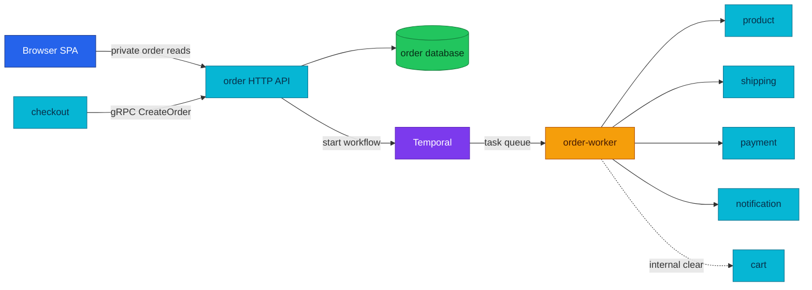

# Order Service API

Order is the only writer of orders and the entry point to durable fulfillment.

| Attribute | Value |
|---|---|
| **Status** | Implemented; HTTP, gRPC, and Temporal worker run in local-stack; cluster order worker is deployed |
| **Repository** | [`duynhlab/order-service`](https://github.com/duynhlab/order-service) |
| **Owns** | Orders, order items, totals, idempotency records, and fulfillment status |
| **HTTP** | Private browser API on `:8080` |
| **gRPC** | `OrderService/CreateOrder` server on `:9090` for Checkout |
| **Worker** | Same image, `worker` subcommand, Temporal task queue `order-fulfillment` |

## Overview

Order persists a pending order and starts the fulfillment Saga. Checkout does
not write order tables directly. Two creation paths currently coexist: the
session-based Checkout handoff and a legacy browser REST endpoint retained until
RFC-0015 P6.



## HTTP API

| Method | Path | Purpose | Notes |
|---|---|---|---|
| `GET` | `/order/v1/private/orders` | List the authenticated user's orders | Paginated |
| `GET` | `/order/v1/private/orders/:id` | Get one owned order | Foreign IDs return `404` |
| `GET` | `/order/v1/private/orders/:id/details` | Aggregate order, shipment, and payment | Enrichments soft-fail |
| `POST` | `/order/v1/private/orders` | Legacy direct create from the live cart | Optional `Idempotency-Key`; removed at RFC-0015 P6 |

### Order response

```json
{
  "id": "42",
  "user_id": "1",
  "status": "pending",
  "items": [
    {
      "product_id": "1",
      "product_name": "Mechanical Keyboard",
      "quantity": 1,
      "price": 89.99,
      "subtotal": 89.99
    }
  ],
  "subtotal": 89.99,
  "shipping": 5,
  "total": 94.99,
  "created_at": "2026-07-13T09:00:00Z"
}
```

Money is stored as `int64` minor units and converted to decimal major units in
the HTTP response adapter.

### Order details

```json
{
  "order": { "id": "42", "status": "confirmed", "total": 94.99 },
  "shipment": {
    "tracking_number": "MOP0000000042",
    "status": "pending"
  },
  "payment": {
    "status": "captured",
    "amount": 94.99,
    "currency": "USD"
  }
}
```

| Dependency | RPC | Failure policy |
|---|---|---|
| Shipping | `GetShipmentByOrder` | Omit `shipment` when absent or unavailable |
| Payment | `GetPayment` | Omit `payment` when absent or unavailable |

The base order remains available during a downstream outage. This is deliberate
soft-fail behavior for a read-only detail screen.

## gRPC API

The canonical protobuf contract is `pkg/proto/order/v1/order.proto`.

| RPC | Caller | Key contract |
|---|---|---|
| `order.v1.OrderService/CreateOrder` | Checkout | Validated item snapshot, payment token, totals components, and required idempotency key |

`CreateOrder` is idempotent by `(user_id, idempotency_key)`. A replay returns the
existing order and does not start a second workflow. Checkout supplies prices
from Product and carries shipping fee, tax, and discount so the amount displayed
before confirm equals the amount charged by the Saga.

## Fulfillment handoff

| Stage | Owner | Result |
|---|---|---|
| Persist order | Order API/gRPC server | Atomic order and item insert with `pending` status |
| Start workflow | Order | Workflow ID `order-fulfillment-<orderID>` prevents duplicate starts |
| Execute activities | Order worker | Payment, stock, shipment, notifications, and cart clear |
| Final status | Order | `confirmed` at the pivot, or `failed` after compensated failure |

The complete retry, compensation, and pivot explanation lives in the
[Order-fulfillment Saga](temporal-order-fulfillment.md) so it is not duplicated
in every participating service document.

## Operations

| Component | Endpoint or queue |
|---|---|
| HTTP process | `/health` and `/ready` on `:8080` |
| gRPC server | `order-grpc:9090` in-cluster Service (rendered from `grpc_server: true`, shipped with RFC-0015 P5); plain `order:9090` in local-stack |
| Temporal worker | Task queue `order-fulfillment` |
| Observability | HTTP/gRPC RED exported over OTLP, workflow traces, structured logs with shared trace IDs |

## References

- [Shared API and gRPC conventions](api.md)
- [Checkout service](checkout.md)
- [Payment service](payments.md)
- [Order-fulfillment Saga](temporal-order-fulfillment.md)
- [ADR-018: Checkout to Order boundary](../proposals/adr/ADR-018-checkout-order-boundary/)

_Last updated: 2026-07-14_
