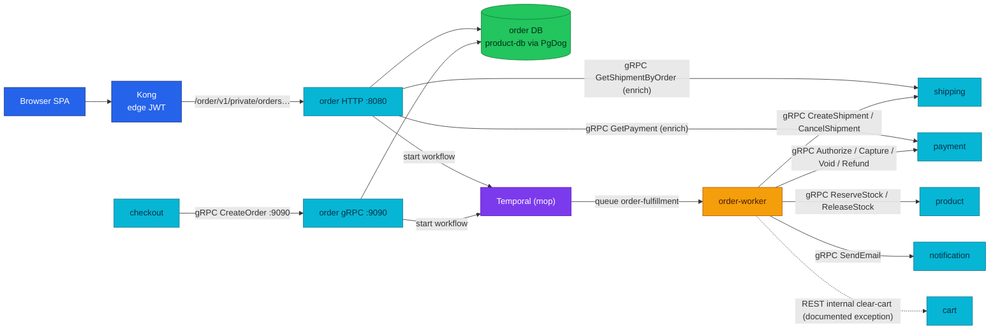
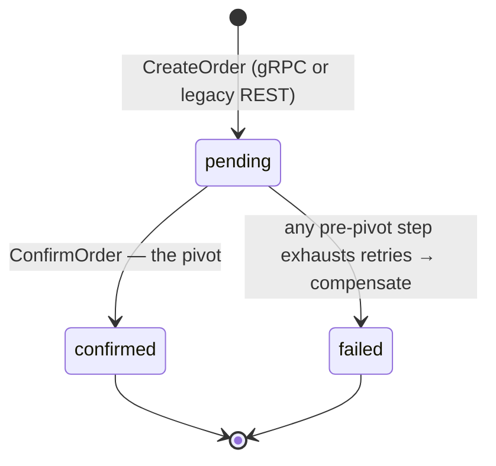

# Order Service API

Order turns a validated basket into a durable, money-safe fulfillment: it is the
only writer of orders and the only place the fulfillment saga starts.

| Dimension | Value |
|-----------|-------|
| **Local-stack** | Implemented |
| **Cluster** | Implemented |
| **HTTP** | private · `:8080` · Kong `/order/v1/private/` (local-stack: bare `/order/` prefix) · edge JWT |
| **gRPC server** | `OrderService/CreateOrder` · `:9090` |
| **gRPC client** | shipping (`GetShipmentByOrder`), payment (`GetPayment`) — enrichment reads |
| **Worker** | `order-worker` · queue `order-fulfillment` |
| **Temporal** | Orchestrator · `OrderFulfillmentWorkflow` · [workflows.md](./workflows.md#order-fulfillment) |
| **Technical debt** | Legacy `POST /order/v1/private/orders` · P6 removal · [Known gaps](#known-gaps) |

| | |
|---|---|
| **Repository** | [`duynhlab/order-service`](https://github.com/duynhlab/order-service) |
| **Owns** | Orders, order items, totals components, idempotency records, fulfillment status |
| **Database** | `order` on `product-db` (CNPG) via PgDog `pgdog-product.product:6432` |
| **Design record** | [ADR-018](../proposals/adr/ADR-018-checkout-order-boundary/) · [RFC-0015](../proposals/rfc/RFC-0015/) (P6 legacy removal) |

## Temporal participation

| Field | Value |
|-------|-------|
| **Role** | Orchestrator — owns the workflow, the worker, and every activity |
| **Workflow** | `OrderFulfillmentWorkflow` (`internal/saga/workflow.go`) |
| **Worker** | `order-worker` — same image, `worker` subcommand, local-stack + cluster |
| **Task queue** | `order-fulfillment` (Temporal namespace `mop`) |
| **Workflow ID** | `order-fulfillment-<orderID>` — dedup key against duplicate starts |
| **Start semantics** | Detached-context start after the order row commits (see [Saga handoff](#the-saga-handoff-start-after-commit)) |
| **Deep dive** | [workflows.md](./workflows.md#order-fulfillment) · [temporal-order-fulfillment.md](./temporal-order-fulfillment.md) |

## Why it exists

Every other service can afford to lose a request; order cannot. A purchase
touches five authorities — payment, stock, shipment, notification, cart — and a
crash between any two of them either charges a customer without shipping or
ships without charging. Order solves this by splitting the problem in two:

1. **A small, atomic write.** `CreateOrder` (gRPC from checkout, or the legacy
   REST path) does exactly one durable thing: insert the order + items with
   status `pending` in a single transaction, idempotently.
2. **A durable saga for everything else.** Fulfillment runs as a Temporal
   workflow on the `order-worker`, with per-step compensation, so partial
   failure converges to `confirmed` or fully-compensated `failed` — never to a
   half-charged limbo.

Checkout ([checkout.md](./checkout.md)) validates prices and owns the funnel;
order keeps the *"insert pending + start workflow in one place"* invariant
(ADR-018). Checkout never writes order tables.

## Architecture

One question: **who talks to order, and what does the saga fan out to?**



gRPC mTLS is **planned** (not deployed); today the east-west fence is
NetworkPolicy — only checkout may dial order `:9090`. In-cluster gRPC
addressing is `dns:///order.order.svc.cluster.local:9090` (single multi-port
Service).

## Data model

Two tables (`db/migrations/sql/`), money as `int64` **minor units** since
migration 000006 — exact arithmetic, and the unit the payment path speaks:

| Table | Key columns | Constraints |
|-------|-------------|-------------|
| `orders` | `id`, `user_id`, `subtotal`, `shipping`, `tax`, `discount`, `total`, `status`, `idempotency_key`, `created_at` | `CHECK (total = subtotal + shipping + tax - discount)`; partial unique index on `(user_id, idempotency_key)` where key not null |
| `order_items` | `order_id` (FK cascade), `product_id`, `product_name`, `quantity`, `price`, `subtotal` | `CHECK (subtotal = quantity * price)` |

`user_id` and `product_id` are cross-service references without FKs (each
service owns its own DB). `product_name` is denormalized on purpose: an order
must render historically even after the catalog changes.

## HTTP API

Shared rules (auth, error envelope, pagination) live in [api.md](./api.md).
All routes are `private`: Kong edge JWT is the coarse filter, in-service
`pkg/authmw` is authoritative, and every query is owner-scoped by the JWT
`user_id`.

| Method | Path | Purpose | Notes |
|--------|------|---------|-------|
| `GET` | `/order/v1/private/orders` | List the authenticated user's orders | Paginated |
| `GET` | `/order/v1/private/orders/:id` | Get one owned order | Foreign IDs return `404` (anti-IDOR — indistinguishable from missing) |
| `GET` | `/order/v1/private/orders/:id/details` | Aggregate order + shipment + payment | Enrichments soft-fail (below) |
| `POST` | `/order/v1/private/orders` | Legacy direct create from the live cart | **Technical debt** — optional `Idempotency-Key`; P6 removal ([Known gaps](#known-gaps)) |

### Order response

```json
{
  "id": "42",
  "user_id": "1",
  "status": "pending",
  "items": [
    {
      "product_id": "1",
      "product_name": "Mechanical Keyboard",
      "quantity": 1,
      "price": 89.99,
      "subtotal": 89.99
    }
  ],
  "subtotal": 89.99,
  "shipping": 5,
  "total": 94.99,
  "created_at": "2026-07-13T09:00:00Z"
}
```

Money is stored as `int64` minor units and converted to decimal major units in
the HTTP response adapter (`internal/web/v1/response.go`).

### Order details (soft-fail aggregation)

```json
{
  "order": { "id": "42", "status": "confirmed", "total": 94.99 },
  "shipment": { "tracking_number": "MOP0000000042", "status": "pending" },
  "payment": { "status": "captured", "amount": 94.99, "currency": "USD" }
}
```

| Dependency | RPC | Failure policy |
|------------|-----|----------------|
| shipping | `GetShipmentByOrder` | Omit `shipment` when absent or unavailable |
| payment | `GetPayment` | Omit `payment` when absent or unavailable |

The base order stays available during a downstream outage — deliberate
soft-fail for a read-only detail screen. Contrast with the saga, where a failed
step compensates.

## gRPC API

Canonical contract: `pkg/proto/order/v1/order.proto`. Server on `:9090`
(`internal/grpc/v1/server.go`).

| RPC | Request → Response | Saga | Notes |
|-----|--------------------|------|-------|
| `order.v1.OrderService/CreateOrder` | validated item snapshot + `payment_method` token + totals components + **required** `idempotency_key` → `{order_id, status}` | — | Called by checkout confirm; idempotent handoff (below) |

East-west trust model: no per-request user auth — `user_id` and prices are
trusted from checkout (which re-validated against product), and NetworkPolicy
is the fence. Every caller-controlled field is still bounded server-side:
key ≤200 chars in a token alphabet, ≤200 items, quantity ≤10 000, prices capped
so subtotal arithmetic cannot overflow `int64`, and `payment_method` must be an
opaque `tok_` reference — PAN-shaped input (even in `product_name`) is rejected
with a generic message that never echoes the value.

## Business rules & techniques

### Order status FSM

The order row is the saga's ledger. Transitions are written only by the two
create paths (`pending`) and the saga activities (`ConfirmOrder` / `FailOrder`):



- `pending` — row committed, saga in flight (or not yet started after a crash).
- `confirmed` — the pivot (`ConfirmOrder`) succeeded; payment was already
  captured. Post-pivot steps (notification, receipt, cart clear) are
  best-effort and never roll the order back.
- `failed` — a pre-pivot step failed after bounded retries; compensations ran
  in reverse (void/refund payment, release stock, cancel shipment). Terminal.

Step order, retry policy, and the pivot rationale live in
[temporal-order-fulfillment.md](./temporal-order-fulfillment.md) — not
duplicated here.

### CreateOrder idempotency

Idempotency is anchored in the schema, not in memory: a partial unique index on
`(user_id, idempotency_key)` (migration 000005 — per-user key namespace) makes
the insert race-safe. The flow on the gRPC path:

1. **Pre-check** — `GetByIdempotencyKey(user, key)`; a lookup error is
   `Internal`, never treated as a miss (that would widen the conflict window).
2. **Fingerprint** (Stripe semantics) — a replay must be the *same request*:
   item count, items subtotal, and composed total are compared against the
   stored order. A reused key with a different basket answers
   `FailedPrecondition` — a caller bug, not a replay.
3. **Insert or replay** — a fresh insert that still hits the unique index
   (two racing requests) re-reads and returns the winner's order.
4. **Status-gated kickoff** — the saga start is attempted on fresh *and*
   replayed orders, but **only while status is `pending`**: a key replayed
   after the 7-day Temporal retention must never re-run the saga on a
   confirmed order — that would re-charge and re-ship.

On the legacy REST path the `Idempotency-Key` header is **optional** — the
double-submit gap that motivated checkout's mandatory key (RFC-0015).

### The saga handoff (start after commit)

Both transports delegate the kickoff to one package
(`internal/fulfillment/fulfillment.go`) so the semantics cannot drift:

| Mechanism | What it guarantees |
|-----------|--------------------|
| Start **after** the order transaction commits | No workflow for a row that never existed; worst crash outcome is a `pending` order with no workflow — healed by an idempotent retry |
| Detached context (`context.WithoutCancel` + 5 s budget) | A client disconnect after commit cannot cancel the workflow start |
| Workflow ID `order-fulfillment-<orderID>` | Duplicate starts collapse to one execution |
| Reuse policy: gRPC passes `REJECT_DUPLICATE` | "Already started" (open, or closed within retention) is treated as success — the saga already happened; the web path keeps the server default (`AllowDuplicate`), its belt is the status gate |
| Start failure answers `Unavailable` (gRPC) | The machine caller retries with the same key; the replay path heals the zombie `pending` order. Answering success would strand it — callers do not retry successes |
| Lazy Temporal client (`internal/fulfillment/lazy.go`) | An order pod that races Temporal at bring-up keeps re-dialing in the background instead of running dead with a nil client |

## Callers & dependencies

| Direction | Peer | Transport | Purpose |
|-----------|------|-----------|---------|
| Inbound | Browser SPA via Kong | HTTP private | List/read orders, order details, legacy create |
| Inbound | checkout | gRPC `CreateOrder` | Confirm handoff (ADR-018) — only NetworkPolicy-admitted caller of `:9090` |
| Outbound (API) | shipping, payment | gRPC | Enrichment reads for `/details` (soft-fail) |
| Outbound (worker) | product, shipping, payment, notification | gRPC | Saga activities: reserve/release, create/cancel shipment, authorize/capture/void/refund, send email |
| Outbound (worker) | cart | REST `DELETE /cart/v1/internal/cart/:user_id` | Best-effort clear-cart — the platform's documented REST exception, NetworkPolicy-fenced, tokenless (no bearer token in workflow history) |

## Known gaps

| Gap | Status | Plan |
|-----|--------|------|
| `POST /order/v1/private/orders` — direct create from the live cart, prices read from cart (stale-price risk), optional idempotency key | **Technical debt** | Removal at RFC-0015 **P6**, once the checkout funnel is the only create path |
| Legacy order→cart REST pricing hop (only inside the legacy path above) | **Technical debt** | Dies with the P6 removal |
| gRPC mTLS on `:9090` | **Planned** | RFC-0020 research; NetworkPolicy remains the fence until then |

## Operations

| Component | Endpoint / value |
|-----------|------------------|
| HTTP probes | `/health`, `/ready` on `:8080` |
| gRPC server | `:9090` — cluster `dns:///order.order.svc.cluster.local:9090`; local-stack `order:9090` |
| Worker | `<binary> worker` — Temporal queue `order-fulfillment`, namespace `mop` |
| Key env | `DB_*`, `AUTH_JWKS_URL`, `SHIPPING_GRPC_ADDR`, `PAYMENT_GRPC_ADDR`, `PRODUCT_GRPC_ADDR`, `NOTIFICATION_GRPC_ADDR`, `CART_SERVICE_URL`, `TEMPORAL_HOSTPORT`, `TEMPORAL_NAMESPACE`, `TASK_QUEUE`, `GRPC_PORT` |
| Business metrics | `order.saga.outcome.total` (confirmed / failed / compensated), `order.saga.compensation.total` (per step × result), `order.payment.activity.total`, `order.stock_reservation.total`, `order.value.minor` |
| Signals to watch | Rising `compensation.total{step="void_payment",result="error"}` or `{step="refund_payment"}` failures mean money may be held or unreturned — reconcile against payment's ledger ([payments.md](./payments.md)) |
| Telemetry | HTTP/gRPC RED over OTLP, workflow traces, structured logs with shared trace IDs (obsx, RFC-0014) |

Example read through Kong (local-stack — bare `/order/` prefix, same service path):

```bash
curl -s http://localhost:8080/order/v1/private/orders \
  -H "Authorization: Bearer $JWT"
```

## Code map

Paths verified against `duynhlab/order-service`:

| Layer | Repo path |
|-------|-----------|
| Route registration + worker entrypoint | `order-service/cmd/main.go` |
| HTTP handlers + enrichment clients | `order-service/internal/web/v1/` |
| CreateOrder logic + idempotent replay | `order-service/internal/logic/v1/service.go` |
| gRPC server (CreateOrder) | `order-service/internal/grpc/v1/server.go` |
| Saga workflow + activities + metrics | `order-service/internal/saga/` |
| Workflow kickoff (detached start, lazy client) | `order-service/internal/fulfillment/` |
| Domain + repository | `order-service/internal/core/domain/`, `internal/core/repository/` |
| Schema migrations | `order-service/db/migrations/sql/` |
| Proto | `pkg/proto/order/v1/order.proto` |

## References

- [api.md](./api.md) — shared HTTP/gRPC rules, error envelope, pagination
- [workflows.md](./workflows.md) — workflow registry · [DEPLOYMENT-STATUS.md](./DEPLOYMENT-STATUS.md) — platform rollup
- [temporal-order-fulfillment.md](./temporal-order-fulfillment.md) — saga theory + as-built + runbook
- [checkout.md](./checkout.md) · [payments.md](./payments.md) · [shipping.md](./shipping.md) — adjacent contracts
- [ADR-018](../proposals/adr/ADR-018-checkout-order-boundary/) — checkout→order boundary

_Last updated: 2026-07-21_
