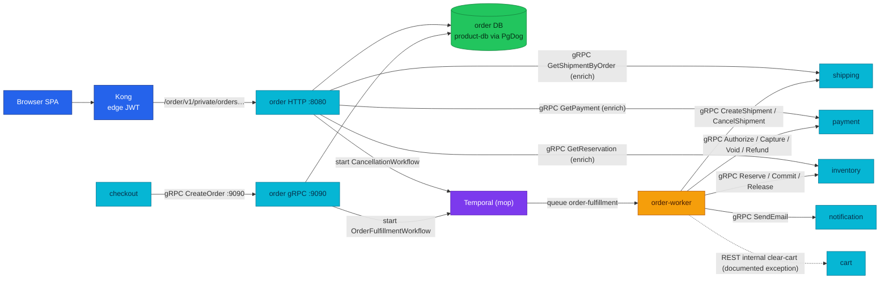
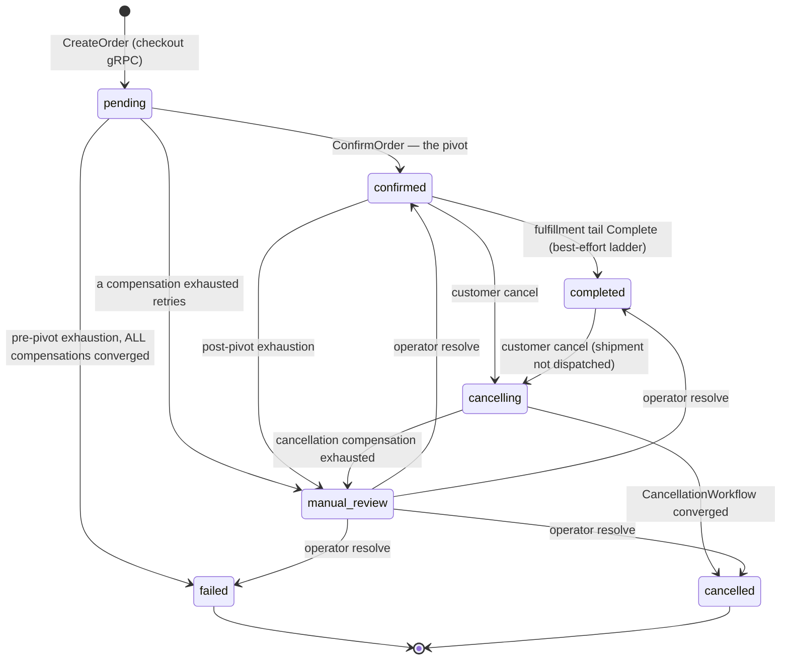

# Order Service API

Order turns a validated basket into a durable, money-safe fulfillment: it is the
only writer of orders and the only place the fulfillment saga starts.

| Dimension | Value | Status |
|-----------|-------|--------|
| **Deployment** | local-stack + cluster | Implemented |
| **HTTP** | private · `:8080` · Kong `/order/v1/private/` (local-stack: bare `/order/` prefix) · edge JWT | Partial |
| **gRPC server** | `OrderService/CreateOrder` · `:9090` | Implemented |
| **gRPC client** | shipping (`GetShipmentByOrder`), payment (`GetPayment`) — enrichment reads | Implemented |
| **Worker** | `order-worker` · queue `order-fulfillment` | Implemented |
| **Temporal** | Orchestrator · `OrderFulfillmentWorkflow` + `CancellationWorkflow` · [workflows.md](./workflows.md#order-fulfillment) | Implemented |

| Attribute | Value | RFC / ADR |
|-----------|-------|-----------|
| **Repository** | [`duynhlab/order-service`](https://github.com/duynhlab/order-service) | — |
| **Owns** | Orders, order items, totals components, idempotency records, status history, processing projection, cancellation requests | — |
| **Database** | `order` on `product-db` (CNPG) via PgDog `pgdog-product.product:6432` | — |
| **Design record** | — | [ADR-018](../proposals/adr/ADR-018-checkout-order-boundary/) · [ADR-031](../proposals/adr/ADR-031-fulfillment-start-outbox/) · [ADR-033](../proposals/adr/ADR-033-order-status-cancellation/) · [RFC-0015](../proposals/rfc/RFC-0015/) · [RFC-0021](../proposals/rfc/RFC-0021/) (P5) |

## Temporal participation

| Field | Value |
|-------|-------|
| **Role** | Orchestrator — owns the workflow, the worker, and every activity |
| **Workflow** | `OrderFulfillmentWorkflow` + `CancellationWorkflow` (`internal/saga/`) |
| **Worker** | `order-worker-1-13-2` (Current) — same image, `worker` subcommand; **versioned** (Worker Deployment `order-fulfillment`, one manifest per build, ADR-030), workflows run `Pinned`. Earlier builds keep polling until their pinned histories drain |
| **Task queue** | `order-fulfillment` (Temporal namespace `mop`) |
| **Workflow ID** | `order-fulfillment-<orderID>`; cancellation episodes use `order-cancellation-<orderID>-v<epoch>` (epoch = observed `orders.version`, so a legally repeated episode gets a fresh id) |
| **Start semantics** | Detached-context start after the order row commits (see [Saga handoff](#the-saga-handoff-start-after-commit)) |
| **Deep dive** | [workflows.md](./workflows.md#order-fulfillment) · [temporal.md](./temporal.md) |

## Why it exists

Every other service can afford to lose a request; order cannot. A purchase
touches five authorities — payment, stock, shipment, notification, cart — and a
crash between any two of them either charges a customer without shipping or
ships without charging. Order solves this by splitting the problem in two:

1. **A small, atomic write.** `CreateOrder` (gRPC from checkout, or the legacy
   REST path) inserts the order + items with status `pending` in a single
   transaction, idempotently — together with one row recording that this order
   still needs its saga started. Both in the same transaction, deliberately:
   Temporal cannot join it, so a crash between the commit and the workflow start
   would otherwise strand the order `pending` forever
   ([ADR-031](../proposals/adr/ADR-031-fulfillment-start-outbox/), and
   [temporal.md](./temporal.md#how-the-saga-gets-started)
   for the mechanism).
2. **A durable saga for everything else.** Fulfillment runs as a Temporal
   workflow on the `order-worker`, with per-step compensation, so partial
   failure converges to `confirmed` or fully-compensated `failed` — never to a
   half-charged limbo.

Checkout ([checkout.md](./checkout.md)) validates prices and owns the funnel;
order keeps the *"insert pending + start workflow in one place"* invariant
(ADR-018) — and since RFC-0021 P3 that invariant is durable rather than
best-effort: the start is retried from the outbox if it does not take.
Checkout never writes order tables.

## Architecture

One question: **who talks to order, and what does the saga fan out to?**


```mermaid
flowchart LR
    SPA["Browser SPA"] --> Kong["Kong<br/>edge JWT"]
    Kong -->|"/order/v1/private/orders…"| Order["order HTTP :8080"]
    CK["checkout"] -->|"gRPC CreateOrder :9090"| OrderG["order gRPC :9090"]
    Order --> DB[("order DB<br/>product-db via PgDog")]
    OrderG --> DB
    Order -->|"gRPC GetShipmentByOrder (enrich)"| SHIP[shipping]
    Order -->|"gRPC GetPayment (enrich)"| PAY[payment]
    Order -->|"gRPC GetReservation (enrich)"| INV
    Order -->|"start CancellationWorkflow"| TMP["Temporal (mop)"]
    OrderG -->|"start OrderFulfillmentWorkflow"| TMP
    TMP -->|"queue order-fulfillment"| W["order-worker"]
    W -->|"gRPC Reserve / Commit / Release"| INV[inventory]
    W -->|"gRPC CreateShipment / CancelShipment"| SHIP
    W -->|"gRPC Authorize / Capture / Void / Refund"| PAY
    W -->|"gRPC SendEmail"| NOTIF[notification]
    W -.->|"REST internal clear-cart (documented exception)"| CART[cart]

    classDef edge fill:#2563eb,color:#fff,stroke:#1e3a8a;
    classDef service fill:#06b6d4,color:#082f49,stroke:#0e7490;
    classDef worker fill:#f59e0b,color:#451a03,stroke:#b45309;
    classDef platform fill:#7c3aed,color:#fff,stroke:#5b21b6;
    classDef data fill:#22c55e,color:#052e16,stroke:#15803d;
    class SPA,Kong edge;
    class Order,OrderG,CK,INV,SHIP,PAY,NOTIF,CART service;
    class W worker;
    class TMP platform;
    class DB data;
```

gRPC mTLS is **planned** (not deployed); today the east-west fence is
NetworkPolicy — only checkout may dial order `:9090`. In-cluster gRPC
addressing is `dns:///order.order.svc.cluster.local:9090` (single multi-port
Service).

## Data model

Two tables (`db/migrations/sql/`), money as `int64` **minor units** since
migration 000006 — exact arithmetic, and the unit the payment path speaks:

| Table | Key columns | Constraints |
|-------|-------------|-------------|
| `orders` | `id`, `user_id`, money columns, `status`, `version`, `idempotency_key`, reason columns (`failure_code`, `cancellation_reason`, `manual_review_reason`), workflow identity, per-state timestamps | `CHECK (total = subtotal + shipping + tax - discount)`; `CHECK (status IN …)` — the seven FSM states (000014); partial unique index on `(user_id, idempotency_key)` where key not null |

**Bounded failure reasons** (`orders.failure_code` + `order_status_history.reason`,
validated by the domain's `knownReasons` set): `PAYMENT_DECLINED`,
`PAYMENT_OUTCOME_UNKNOWN`, `INVENTORY_UNAVAILABLE`, `INSUFFICIENT_STOCK`,
**`UNKNOWN_SKU`** (since 1.13.2 — inventory has no balance row for a line, a data
gap the saga must not file as customer demand; same terminal flow as a shortage,
payment voided, and like a shortage it skips the ambiguous release because
`SKU_NOT_FOUND` definitively took nothing), `SHIPMENT_UNAVAILABLE`,
`CONFIRMATION_FAILED`, `COMPENSATION_INCOMPLETE`, `WORKFLOW_START_FAILED`,
`CUSTOMER_REQUEST`, `OPERATOR_RESOLVED`. The column is `VARCHAR(64)` with no
CHECK, so a new reason needs no migration — the domain set is the authority.

| `order_items` | `order_id` (FK cascade), `product_id`, `product_name`, `quantity`, `price`, `subtotal` | `CHECK (subtotal = quantity * price)` |
| `order_status_history` | `order_id`, `from_status`, `to_status`, `actor_type`, `actor_id`, `command_id`, `reason` | `UNIQUE (order_id, command_id)` — the replay anchor; `CHECK` on actor type. Append-only; begins at the v1.10.0 cutover (no backfill) |
| `order_processing_projection` | `order_id` PK, `stage` (12-stage `CHECK`), `last_successful_step`, `last_error_code` | UX-only projection; best-effort writes, never a correctness gate |
| `cancellation_requests` | `order_id` PK, `status`, `epoch`, attempt/lease columns | The cancellation start outbox (lean sibling of ADR-031 — no payment token); re-armed per episode by epoch |

`user_id` and `product_id` are cross-service references without FKs (each
service owns its own DB). `product_name` is denormalized on purpose: an order
must render historically even after the catalog changes.

## HTTP API

Shared rules (auth, error envelope, pagination) live in [api.md](./api.md).
All routes are `private`: Kong edge JWT is the coarse filter, in-service
`pkg/authmw` is authoritative, and every query is owner-scoped by the JWT
`user_id`.

| Method | Path | Purpose | Notes |
|--------|------|---------|-------|
| `GET` | `/order/v1/private/orders` | List the authenticated user's orders | Paginated |
| `GET` | `/order/v1/private/orders/:id` | Get one owned order | Foreign IDs return `404` (anti-IDOR — indistinguishable from missing) |
| `GET` | `/order/v1/private/orders/:id/details` | Aggregate order + shipment + payment + processing + inventory | Enrichments soft-fail (below) |
| `POST` | `/order/v1/private/orders/:id/cancel` | Request cancellation (empty body; reason fixed `CUSTOMER_REQUEST`) | `202` episode opened / `200` idempotent replay (already cancelling or cancelled) / `409 ORDER_NOT_CANCELLABLE` \| `SHIPMENT_ALREADY_DISPATCHED` / `404` foreign or missing |

Order **creation** is checkout's gRPC call (ADR-018); the legacy REST create
was removed in RFC-0021 P5 (order-service v1.11.0).

### Order response

```json
{
  "id": "42",
  "user_id": "1",
  "status": "pending",
  "items": [
    {
      "product_id": "1",
      "product_name": "Mechanical Keyboard",
      "quantity": 1,
      "price": 89.99,
      "subtotal": 89.99
    }
  ],
  "subtotal": 89.99,
  "shipping": 5,
  "total": 94.99,
  "created_at": "2026-07-13T09:00:00Z"
}
```

Money is stored as `int64` minor units and converted to decimal major units in
the HTTP response adapter (`internal/web/v1/response.go`).

### Order details (soft-fail aggregation)

```json
{
  "order": { "id": "42", "status": "confirmed", "total": 94.99 },
  "shipment": { "tracking_number": "MOP0000000042", "status": "pending" },
  "payment": { "status": "captured", "amount": 94.99, "currency": "USD" },
  "processing": { "stage": "DONE", "updated_at": "2026-08-01T04:35:00Z" },
  "inventory": { "status": "COMMITTED" },
  "degraded": ["payment"]
}
```

| Dependency | Source | Failure policy |
|------------|--------|----------------|
| shipping | gRPC `GetShipmentByOrder` | Absent → omit `shipment`; fetch failure → omit **and** add `"shipping"` to `degraded[]` |
| payment | gRPC `GetPayment` | Same pattern, token `"payment"` |
| inventory | gRPC `GetReservation` | Same pattern, token `"inventory"`; an order predating RFC-0021 P3 legitimately has no reservation (absent, not degraded) |
| processing | `order_processing_projection` read | Absent for pre-projection orders; fetch failure → `degraded[]` token `"processing"` |

`degraded[]` distinguishes *could not fetch* from *does not exist* — the SPA
renders a warning badge for the former and simply omits the block for the
latter.

The base order stays available during a downstream outage — deliberate
soft-fail for a read-only detail screen. Contrast with the saga, where a failed
step compensates.

## gRPC API

Canonical contract: `pkg/proto/order/v1/order.proto`. Server on `:9090`
(`internal/grpc/v1/server.go`).

| RPC | Request → Response | Saga | Notes |
|-----|--------------------|------|-------|
| `order.v1.OrderService/CreateOrder` | validated item snapshot + `payment_method` token + totals components + **required** `idempotency_key` → `{order_id, status}` | — | Called by checkout confirm; idempotent handoff (below) |

East-west trust model: no per-request user auth — `user_id` and prices are
trusted from checkout (which re-validated against product), and NetworkPolicy
is the fence. Every caller-controlled field is still bounded server-side:
key ≤200 chars in a token alphabet, ≤200 items, quantity ≤10 000, prices capped
so subtotal arithmetic cannot overflow `int64`, and `payment_method` must be an
opaque `tok_` reference — PAN-shaped input (even in `product_name`) is rejected
with a generic message that never echoes the value.

## Business rules & techniques

### Order status FSM

The order row is the saga's ledger. Since v1.10.0 (RFC-0021 P5,
[ADR-033](../proposals/adr/ADR-033-order-status-cancellation/)) every
transition goes through **one** writer — `ApplyStatusCommand`: a single
transaction under `SELECT … FOR UPDATE` that validates the FSM edge **and**
the actor, replays idempotently by `(order_id, command_id)`, appends to
`order_status_history`, and applies a version-guarded UPDATE. There is no
generic status setter.


```mermaid
stateDiagram-v2
    [*] --> pending : CreateOrder (checkout gRPC)
    pending --> confirmed : ConfirmOrder — the pivot
    pending --> failed : pre-pivot exhaustion, ALL compensations converged
    pending --> manual_review : a compensation exhausted retries
    confirmed --> completed : fulfillment tail Complete (best-effort ladder)
    confirmed --> cancelling : customer cancel
    completed --> cancelling : customer cancel (shipment not dispatched)
    confirmed --> manual_review : post-pivot exhaustion
    cancelling --> cancelled : CancellationWorkflow converged
    cancelling --> manual_review : cancellation compensation exhausted
    manual_review --> confirmed : operator resolve
    manual_review --> failed : operator resolve
    manual_review --> cancelled : operator resolve
    manual_review --> completed : operator resolve
    failed --> [*]
    cancelled --> [*]
```

Actor discipline (enforced under the row lock): **USER** only reaches
`cancelling`; only an **OPERATOR** command leaves `manual_review` (SQL
discipline in the [OrderManualReviewBacklog runbook](../observability/runbooks/microservices/OrderManualReviewBacklog.md));
**WORKFLOW** drives the saga edges; **SYSTEM** only `pending → failed`.

- `failed` means *all* compensations converged — money and stock are back
  where they started. Any exhaustion parks in `manual_review`
  (`COMPENSATION_INCOMPLETE`) instead: a human is owed work, and the
  `order_manual_review_backlog` gauge + alert say so.
- `completed` is bookkeeping (the fulfillment tail finished); the reconciler
  treats `confirmed` and `completed` identically, so a lost `Complete` write
  is counted (`order_saga_complete_failures_total`) but never blocks anything.
- `cancelling` is customer-facing "money mid-unwind": the CancellationWorkflow
  unwinds by current server-side state and always converges to `cancelled` or
  `manual_review` (watched by `order_cancelling_backlog` / `OrderStuckCancelling`).

Step order, retry policy, the pivot rationale, and the cancellation
workflow's disposition rules live in
[temporal.md](./temporal.md) — not
duplicated here.

### CreateOrder idempotency

Idempotency is anchored in the schema, not in memory: a partial unique index on
`(user_id, idempotency_key)` (migration 000005 — per-user key namespace) makes
the insert race-safe. The flow on the gRPC path:

1. **Pre-check** — `GetByIdempotencyKey(user, key)`; a lookup error is
   `Internal`, never treated as a miss (that would widen the conflict window).
2. **Fingerprint** (Stripe semantics) — a replay must be the *same request*:
   item count, items subtotal, and composed total are compared against the
   stored order. A reused key with a different basket answers
   `FailedPrecondition` — a caller bug, not a replay.
3. **Insert or replay** — a fresh insert that still hits the unique index
   (two racing requests) re-reads and returns the winner's order.
4. **Status-gated kickoff** — the saga start is attempted on fresh *and*
   replayed orders, but **only while status is `pending`**: a key replayed
   after the 7-day Temporal retention must never re-run the saga on a
   confirmed order — that would re-charge and re-ship.


### The saga handoff (start after commit)

Both transports delegate the kickoff to one package
(`internal/fulfillment/fulfillment.go`) so the semantics cannot drift:

| Mechanism | What it guarantees |
|-----------|--------------------|
| Start **after** the order transaction commits | No workflow for a row that never existed; worst crash outcome is a `pending` order with no workflow — healed by an idempotent retry |
| Detached context (`context.WithoutCancel` + 5 s budget) | A client disconnect after commit cannot cancel the workflow start |
| Workflow ID `order-fulfillment-<orderID>` | Duplicate starts collapse to one execution |
| Reuse policy: `REJECT_DUPLICATE` | "Already started" (open, or closed within retention) is treated as success — the saga already happened. The gRPC create is the only fulfillment starter; the web layer starts only cancellation episodes |
| Start failure answers `Unavailable` (gRPC) | The machine caller retries with the same key; the replay path heals the zombie `pending` order. Answering success would strand it — callers do not retry successes |
| Lazy Temporal client (`internal/fulfillment/lazy.go`) | An order pod that races Temporal at bring-up keeps re-dialing in the background instead of running dead with a nil client |
| Stock participant resolved **from the order's outbox row** (`fulfillment.ParticipantFor`) | A replayed order runs the branch its row recorded. Absent still ⇒ `product`, because pre-P3 orders really did hold stock there — but since RFC-0021 P4 (order 1.13.0) only `inventory` can be SERVED, so anything else is REFUSED rather than re-routed: no saga is created and the order's outbox row goes terminal with `PARTICIPANT_UNSERVABLE`. Counted as `order_fulfillment_start_participant_total{participant,source,result}` |
| An unservable participant on a REPLAY answers the existing order, not an error | The call is idempotent, so an error would say "not placed" about an order that was — and checkout treats anything but `InvalidArgument` as transient, retrying forever and eventually minting a second order (a second authorize and capture) |
| The refusal also lives inside `fulfillment.Start` | It is the single place a saga is created, so a future start path inherits it. The workflow-level panic is the last backstop, not the guard: it fails only the workflow TASK, while the call still answers success and the row closes |

## Callers & dependencies

| Direction | Peer | Transport | Purpose |
|-----------|------|-----------|---------|
| Inbound | Browser SPA via Kong | HTTP private | List/read orders, order details, cancel |
| Inbound | checkout | gRPC `CreateOrder` | Confirm handoff (ADR-018) — only NetworkPolicy-admitted caller of `:9090` |
| Outbound (API) | shipping, payment, inventory | gRPC | Enrichment reads for `/details` (soft-fail) |
| Outbound (API) | Temporal | SDK | Inline `CancellationWorkflow` start after the cancel CAS commits (outbox sweeps the misses) |
| Outbound (worker) | shipping, payment, notification | gRPC | Saga activities: create/cancel shipment, authorize/capture/void/refund, send email |
| Outbound (worker) | inventory | gRPC | The saga's only stock authority since RFC-0021 P4: reserve/commit/release, plus the cancellation disposition (`GetReservation`/`Release`) and the reconciler's repairs |
| Outbound (worker) | cart | REST `DELETE /cart/v1/internal/cart/:user_id` | Best-effort clear-cart — the platform's documented REST exception, NetworkPolicy-fenced, tokenless (no bearer token in workflow history) |

## Known gaps

| Gap | Status | Plan |
|-----|--------|------|
| Committed stock is not restocked on cancellation (`RESTOCK_SKIPPED` — inventory.v1 has no `Return` RPC) | **Accepted shrinkage** | [ADR-033](../proposals/adr/ADR-033-order-status-cancellation/) revisit trigger: flip one branch of `resolveInventoryDisposition` when the RPC exists |
| Reconciler does not settle `cancelled` (terminal set is `{confirmed, failed, completed}`) | **Accepted** | The CancellationWorkflow settles its own stock; `OrderStuckCancelling` is the backstop |
| An order refused for an unservable stock participant stays `pending` forever | **Accepted, alerted** | Its outbox row goes terminal, which fires `FulfillmentStartOutboxFailed` (critical); the remedy is per-code in that runbook. Nothing writes `WORKFLOW_START_FAILED` to the order — the dispatcher has no order writer, and that is true of every give-up path, not just this one |
| gRPC mTLS on `:9090` | **Planned** | RFC-0020 research; NetworkPolicy remains the fence until then |

## Operations

| Component | Endpoint / value |
|-----------|------------------|
| HTTP probes | `/health`, `/ready` on `:8080` |
| gRPC server | `:9090` — cluster `dns:///order.order.svc.cluster.local:9090`; local-stack `order:9090` |
| Worker | `<binary> worker` — Temporal queue `order-fulfillment`, namespace `mop` |
| Key env | `DB_*`, `AUTH_JWKS_URL`, `SHIPPING_GRPC_ADDR`, `PAYMENT_GRPC_ADDR`, `INVENTORY_GRPC_ADDR`, `NOTIFICATION_GRPC_ADDR`, `CART_SERVICE_URL`, `TEMPORAL_HOSTPORT`, `TEMPORAL_NAMESPACE`, `TASK_QUEUE`, `GRPC_PORT`, `ORDER_RECONCILER_ENABLED`, `ORDER_START_DISPATCHERS_ENABLED` |
| Business metrics | `order.saga.outcome.total` (confirmed / failed / manual_review / compensated), `order.saga.compensation.total` (per step × result), `order.payment.activity.total`, `order.stock_reservation.total`, `order.value.minor` (label-free since v1.11.0), `order.cancellations.total{result}`, `order_cancellation_outcomes_total{outcome}`, backlog gauges `order_cancelling_backlog` / `order_manual_review_backlog` |
| Signals to watch | Rising `compensation.total{step="void_payment",result="error"}` or `{step="refund_payment"}` failures mean money may be held or unreturned — reconcile against payment's ledger ([payments.md](./payments.md)) |
| Telemetry | HTTP/gRPC RED over OTLP, workflow traces, structured logs with shared trace IDs (obsx, RFC-0014) |

Example read through Kong (local-stack — bare `/order/` prefix, same service path):

```bash
curl -s http://localhost:8080/order/v1/private/orders \
  -H "Authorization: Bearer $JWT"
```

## Code map

Paths in [`duynhlab/order-service`](https://github.com/duynhlab/order-service). Transport peers call `logic/v1`; logic calls `core` only ([api.md § Inside Each Service](./api.md#inside-each-service)).

| Layer | Path | Notes |
|-------|------|-------|
| **Transport** | `internal/web/v1/` | HTTP handlers (list/get/details/cancel) + enrichment clients |
| | `internal/grpc/v1/server.go` | gRPC server (CreateOrder) |
| **logic** | `internal/logic/v1/service.go` | CreateOrder logic + idempotent replay |
| **core** | `internal/core/domain/` | Domain types |
| | `internal/core/repository/` | Persistence |
| **Platform** | `cmd/main.go` | Route registration + worker entrypoint |
| | `internal/saga/` | Saga workflow + activities + metrics |
| | `internal/fulfillment/` | Fulfillment kickoff (detached start, lazy client) |
| | `internal/cancellation/` | Cancellation kickoff + outbox dispatcher |
| | `db/migrations/sql/` | Schema migrations |
| | `pkg/proto/order/v1/order.proto` | Proto |

## References

- [api.md](./api.md) — shared HTTP/gRPC rules, error envelope, pagination
- [workflows.md](./workflows.md) — workflow registry · [Service contracts](./README.md#service-contracts)
- [temporal.md](./temporal.md) — saga theory + as-built + runbook
- [checkout.md](./checkout.md) · [payments.md](./payments.md) · [shipping.md](./shipping.md) — adjacent contracts
- [ADR-018](../proposals/adr/ADR-018-checkout-order-boundary/) — checkout→order boundary

_Last updated: 2026-08-01 — RFC-0021 P5 as-built: seven-state FSM, cancel API, expanded `/details`, legacy REST create removed (v1.11.0)._
