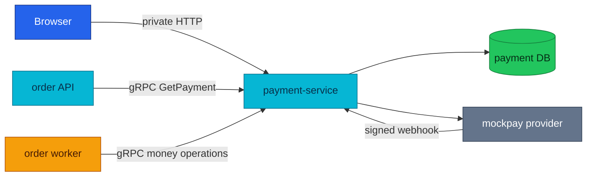
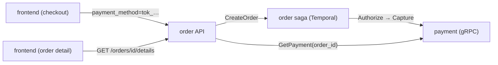
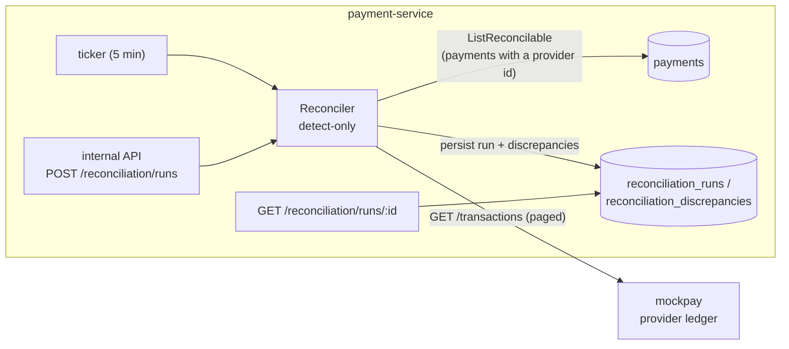

# Payment Service API

The payment subsystem: a Stripe-style payment service (auth/capture state
machine, idempotency, double-entry ledger, mock provider) wired into the order
fulfillment saga. The *design* lives in the RFC/ADRs below; this doc covers the
operational surface — its HTTP and gRPC contracts, the checkout read path, and
reconciliation.

| Attribute | Value |
|-----------|-------|
| **Status** | Running in local-stack; cluster manifests landed |
| **HTTP base** | `/payment/v1/{public,private,internal}/payments` |
| **gRPC** | `payment.v1.PaymentService` on `:9090` |
| **Primary callers** | Order worker for writes; order API for details enrichment |
| **Data authority** | Payment state, refunds, ledger entries, and reconciliation reports |
| **Repository** | [duynhlab/payment-service](https://github.com/duynhlab/payment-service) |

## Overview

Payment owns the money lifecycle. Other services may request an operation,
but only payment-service changes payment state or writes the double-entry
ledger. The browser normally reaches payment information through order
details; direct private payment routes remain available for owner-scoped
queries and payment-intent creation.



## HTTP API

| Method | Path | Audience | Purpose |
|--------|------|----------|---------|
| `POST` | `/payment/v1/private/payments` | Signed-in user | Create and authorize a payment intent; requires `Idempotency-Key` |
| `GET` | `/payment/v1/private/payments` | Signed-in user | List the caller's payments with pagination |
| `GET` | `/payment/v1/private/payments/:id` | Signed-in user | Read one owner-scoped payment |
| `POST` | `/payment/v1/public/payments/webhooks/mockpay` | Provider | Apply an HMAC-verified provider event |
| `POST` | `/payment/v1/internal/payments/:id/refunds` | In-cluster operator | Create an idempotent partial or full refund |
| `POST` | `/payment/v1/internal/payments/reconciliation/runs` | In-cluster operator | Run reconciliation |
| `GET` | `/payment/v1/internal/payments/reconciliation/runs/:id` | In-cluster operator | Read a reconciliation report |

Private responses are owner-scoped using the JWT `user_id`. Internal routes
are not published through Kong; NetworkPolicy is the cluster boundary. The
public webhook is not anonymous in practice: its HMAC signature is the
credential.

## gRPC API

| Method | Caller | Effect |
|--------|--------|--------|
| `Authorize` | Order worker | Create or replay an authorization for an order |
| `Capture` | Order worker | Capture an authorized payment after earlier saga steps succeed |
| `Void` | Order worker compensation | Release an authorization that has not been captured |
| `Refund` | Order worker compensation | Return captured funds when a later failure must be compensated |
| `GetPayment` | Order API | Read the payment snapshot by `order_id` for details enrichment |

The protobuf contract lives in `duynhlab/pkg`. State-changing methods are
idempotent because Temporal activities can be retried after timeouts or lost
responses.

## Design record

- [RFC-0010: Payment service](../proposals/rfc/RFC-0010/) — the full design
- [ADR-007](../proposals/adr/ADR-007-double-entry-payment-ledger/) — append-only double-entry ledger
- [ADR-008](../proposals/adr/ADR-008-mockpay-standalone-provider/) — mockpay as a standalone process
- [ADR-009](../proposals/adr/ADR-009-saga-authorize-early-capture-late/) — authorize-early / capture-late in the order saga
- [ADR-010](../proposals/adr/ADR-010-shared-idempotency-library/) — shared `pkg/idempotency`
- [ADR-011](../proposals/adr/ADR-011-detect-only-reconciliation/) — detect-only reconciliation
- [ADR-012](../proposals/adr/ADR-012-reconciliation-auto-heal/) — flag-gated auto-heal of the lost-capture-response window

## The checkout read path (RFC-0010 P6)

How a payment gets from the checkout form to the order-detail screen. The
browser never talks to payment directly — it reads through order, which reads
payment over gRPC.

| | |
|---|---|
| **Status** | Deployed (local-stack, real-browser e2e-verified) · cluster manifests landed |
| **Write** | Checkout sends `payment_method` (a `tok_` test token) on order create → the saga's `Authorize`/`Capture` |
| **Read** | `payment.v1 GetPayment(order_id)` — internal gRPC, keyed by order id |
| **Surfaced** | Order-details endpoint enriches with a `payment` object (soft-fail) |



**Token flow (write).** The checkout picker offers opaque test tokens
(`tok_visa`, `tok_mastercard`); the token is a *reference*, never card data.
The order API validates its shape (`tok_` prefix, length, no PAN-like digit
runs) and rejects a bad one with **400 before persisting anything** — the
create request becomes durable Temporal history, so an invalid instrument must
never enter it. An empty `payment_method` falls back to a demo token
(byte-identical to the pre-P6 flow). mockpay decides the outcome from the
**amount**, not the token: `amount_minor % 100` → `02` generic decline, `95`
insufficient funds, `19` transient (retry succeeds).

**Enrichment (read).** `GET /order/v1/private/orders/{id}/details` calls
`GetPayment` after the owner-scoped order lookup, with a 2s timeout. It is
**soft-fail** — if payment is unreachable the details still return, just without
the `payment` object (mirrors the shipping enrichment). The order API needs
`PAYMENT_GRPC_ADDR` for this, not just the worker. The `payment` object carries `status`, `amount`, `refunded`,
`currency`, `decline_code`; a partial refund is **derived** as
`partially_refunded` (stored status stays `captured` while
`0 < refunded < amount`).

## Payment ↔ Provider Reconciliation

Two money systems always drift eventually — reconciliation is how the platform
*detects* that drift instead of learning about it from a customer complaint.

| | |
|---|---|
| **Status** | Deployed (local-stack, e2e-verified) · cluster manifests landed (RFC-0010 P5) — first bring-up verification pending · detect-only by default ([ADR-011](../proposals/adr/ADR-011-detect-only-reconciliation/)); one class flag-gated auto-heal via `RECON_HEAL_ENABLED` ([ADR-012](../proposals/adr/ADR-012-reconciliation-auto-heal/)) |
| **Where** | payment-service: background ticker (5 min) + internal API |
| **Compares** | `payments` table ↔ mockpay `GET /transactions`, matched by `provider_payment_id` |
| **Classes** | `missing_internal` · `missing_provider` · `amount_mismatch` · `status_mismatch` |
| **Heals?** | **Detect-only by default.** With `RECON_HEAL_ENABLED` (default off) it heals exactly one class — the lost-capture-response window (internal `authorized` vs provider `captured`) via an idempotent re-capture ([ADR-012](../proposals/adr/ADR-012-reconciliation-auto-heal/)); all other classes stay detect-only |
| **Report** | `reconciliation_runs` / `reconciliation_discrepancies` + internal API |

### Why reconciliation exists

A payment platform holds the same fact in two places: its own database (the
`payments` row and the double-entry ledger, [ADR-007](../proposals/adr/ADR-007-double-entry-payment-ledger/))
and the provider's records. Those two systems are updated by different
processes over an unreliable network, so they *will* disagree eventually:

- a **crash between the local commit and the provider confirm** — the exact
  window ADR-007 documents as internally-invisible (the ledger balances against
  itself, so no local check can see it);
- a **lost webhook** — the provider moved money and told us, but the delivery
  never landed;
- a **lost response** — the provider committed a capture, the response
  disappeared, and every retry after it failed.

Production payment systems treat reconciliation as a first-class subsystem for
exactly this reason: the ledger proves the *books are internally consistent*,
and reconciliation proves the books *match reality*. One without the other is
false confidence.

### Architecture



One pass: load every payment that has a `provider_payment_id` (a payment that
never reached the provider has nothing to reconcile), page the provider's
transaction ledger to exhaustion, and classify each pairing:

| Class | Meaning | Typical cause |
|---|---|---|
| `missing_internal` | provider has a charge we have no payment for | should be impossible (we create the payment before charging) → bug signal |
| `missing_provider` | we have a payment the provider never recorded | in-flight authorize, or a genuinely lost charge |
| `amount_mismatch` | both sides disagree on the amount | data corruption / provider adjustment |
| `status_mismatch` | both sides disagree on the state | the ADR-007 crash window; a lost webhook |

When both amount and status differ, **amount wins** (one discrepancy per
charge — fix the amount first; the next run catches residual status drift).

#### Expected pairings are not drift

Raw status equality would flood the report with benign mismatches, so the
classifier knows the two vocabularies differ:

- **`expired` (internal) ↔ `authorized`/`voided` (provider)** — a hold that
  lapses on our TTL is *not* voided at the provider; the provider still shows
  it authorized. Normal lifecycle, suppressed.
- **`captured` with a recorded partial refund ↔ `refunded` (provider)** — the
  provider flips to `refunded` on any refund; we keep `captured` until fully
  refunded. Benign **only when we recorded a refund** — a `captured` payment
  with *no* internal refund that the provider shows `refunded` is real drift
  and is flagged.

#### The detector defends itself

The provider's data is untrusted input:

- **Paging never trusts the provider's `Total`** — an under-stated total would
  silently drop pages (and mis-flag their payments `missing_provider`), so the
  sweep terminates on a short page, with a hard 1M-transaction cap against a
  runaway/hostile provider.
- A run's discrepancies commit **atomically** — a failed pass never leaves a
  partial, misleading report.
- A run is **always closed** (`completed`/`failed`): the closing write runs on
  a context detached from the caller's, so an aborted trigger request or a
  shutdown mid-pass can't strand a row in `running`.

### Operations

#### Reading the report

The internal API (internal audience — never routed through the gateway; on the
cluster the payment NetworkPolicy is the fence — Kong reaches :8080 only, the
order namespace alone reaches :9090 — and in local-stack Kong simply omits the
route):

```bash
# trigger one pass (single-flighted: a concurrent trigger answers 409;
# disabled — stub provider — answers 503)
curl -X POST http://payment:8080/payment/v1/internal/payments/reconciliation/runs

# fetch a run's report
curl http://payment:8080/payment/v1/internal/payments/reconciliation/runs/2
```

```json
{
  "run": {"id": 2, "status": "completed", "transactions_scanned": 2, "discrepancies_found": 1},
  "discrepancies": [{
    "provider_payment_id": "mp_1",
    "class": "amount_mismatch",
    "internal_amount_minor": 1920,
    "provider_amount_minor": 1919,
    "internal_status": "captured",
    "provider_status": "captured",
    "detail": "amount differs: internal 1920 vs provider 1919 minor units"
  }]
}
```

Amounts are **minor units** (cents) with the unit in the field name. Treat
`detail`/`provider_status` as untrusted text if a UI ever renders them — they
carry provider-controlled strings.

#### What to do with a discrepancy (v1 = a human decides)

v1 does **not** self-correct by default ([ADR-011](../proposals/adr/ADR-011-detect-only-reconciliation/));
the sole exception is the flag-gated heal in [ADR-012](../proposals/adr/ADR-012-reconciliation-auto-heal/)
(the lost-capture-response window). Every other class is human-corrected.
The runbook is: read the discrepancy, pull both sides (payment row + ledger
entries vs the provider record), decide which side is right, and correct via
the normal APIs (refund endpoint, state transitions) — never by editing rows.
Every correction then leaves its own audit trail.

#### Verified end-to-end (fault-injection e2e, 2026-07-04)

Run against the full local-stack with the payment saga enabled, using mockpay's
deterministic magic amounts (`amount % 100`: `02` decline, `95`
insufficient_funds, `19` transient-then-succeed):

| Fault injected | Saga outcome | Payment row |
|---|---|---|
| decline (total 2002) | order **failed**, no stock reserved | `failed`, `generic_decline` |
| insufficient funds (2095) | order **failed** | `failed`, `insufficient_funds` |
| transient 503 (1919) | retry → order **confirmed** | `captured` |
| zero-stock product (2500) | authorize ok → reserve fails → compensate | **`voided`** |
| clean reconciliation run | — | `completed`, 0 discrepancies (voided/captured pairs match) |
| injected drift (`UPDATE … amount_minor+1`) | — | run detects `amount_mismatch` 1920 vs 1919 |

#### Known v1 limits (deliberate, tracked)

- **Refund amounts aren't reconciled** — the provider ledger reports a
  refunded *flag*, not amounts, so net-refund drift is out of scope until the
  provider exposes it. Don't read a clean run as "refunds reconcile".
- **Currency isn't carried on the report** (single-currency platform today).
- **Full scan + full provider sweep per pass** — must be windowed
  (rolling recent window + slow full sweep) before production-scale volume.
- ~~No retention reaper yet~~ — **shipped**: an hourly reaper prunes
  `reconciliation_runs` (and cascading `_discrepancies`) older than **30 days**.
- **No metric or alert on `discrepancies_found > 0` yet** — detection surfaces
  as a ticker log line and via the report API, so today someone must go
  looking. (The heal slice has since shipped —
  [ADR-012](../proposals/adr/ADR-012-reconciliation-auto-heal/) — but the
  `discrepancies_found` metric/alert is still not wired.)

## References

- [api.md](./api.md) — shared HTTP and gRPC conventions
- [order.md](./order.md) — order API and fulfillment handoff
- [temporal-order-fulfillment.md](./temporal-order-fulfillment.md) — Saga execution and compensation
- [RFC-0010](../proposals/rfc/RFC-0010/) — payment-service design

_Last updated: 2026-07-14_
