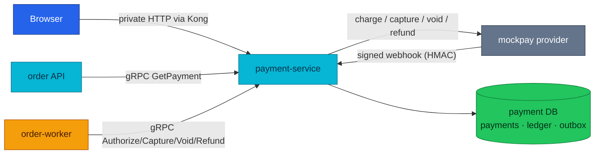
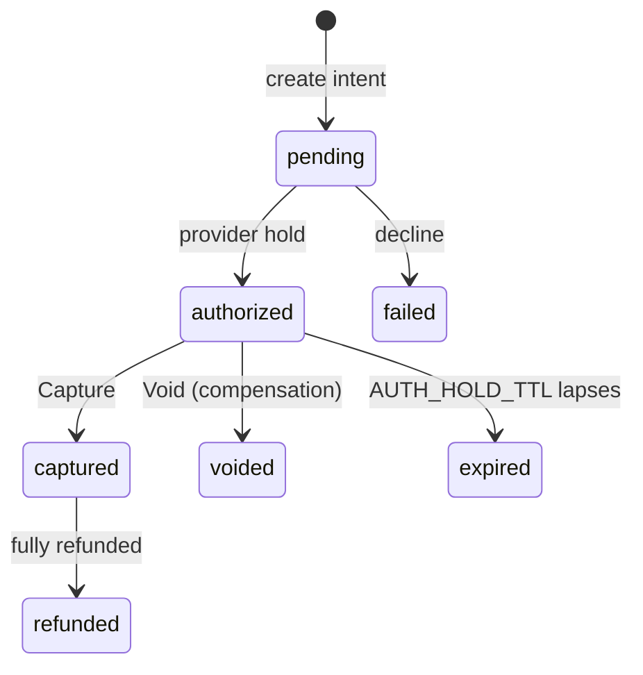
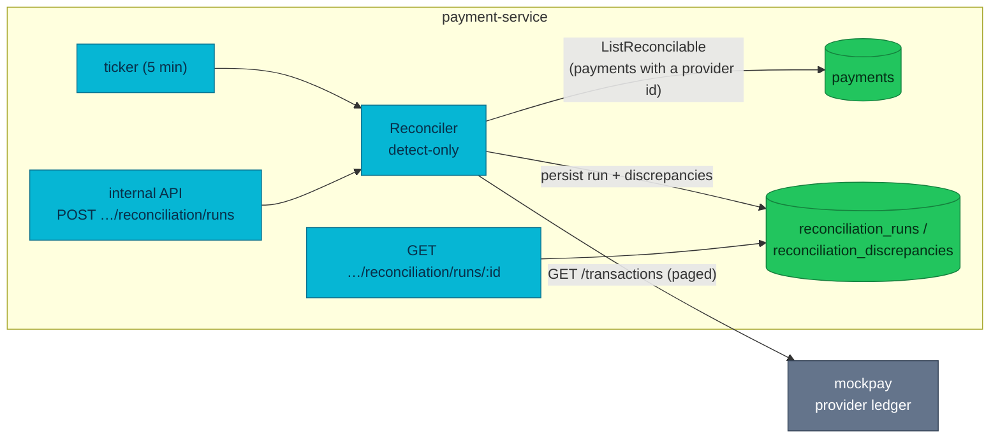

# Payment Service API

Payment turns an order's opaque `tok_` token into settled money — a
Stripe-style auth/capture state machine, a double-entry ledger, and a
reconciliation loop that proves the books match the provider.

| Dimension | Value |
|-----------|-------|
| **Local-stack** | Implemented |
| **Cluster** | Implemented |
| **HTTP** | private + public webhooks · `:8080` · Kong `/payment/v1/private/` (JWT) + `/payment/v1/public/payments/webhooks/` (HMAC, anonymous) + deprecated alias `/payment/v1/public/webhooks/` (ADR-017) |
| **gRPC server** | `PaymentService/GetPayment, Authorize, Capture, Void, Refund` · `:9090` |
| **gRPC client** | None |
| **Worker** | None |
| **Temporal** | Participant (gRPC) · [workflows.md#order-fulfillment](./workflows.md#order-fulfillment) |
| **Technical debt** | Deprecated webhook alias (ADR-017) · [Known gaps](#known-gaps) |

| | |
|---|---|
| **Repository** | [`duynhlab/payment-service`](https://github.com/duynhlab/payment-service) |
| **Owns** | Payment state, refunds, the double-entry ledger, webhook records, reconciliation reports |
| **Database** | `payment` on `product-db` — **direct** `product-db-rw.product:5432`, `sslmode=require` (bypasses PgDog: no pooler TLS yet) |
| **Design record** | [RFC-0010](../proposals/rfc/RFC-0010/) |

## Temporal participation

| Field | Value |
|-------|-------|
| **Role** | Participant (gRPC) |
| **Workflow** | `OrderFulfillmentWorkflow` (owned by order) |
| **This service's steps** | `Authorize`, `Capture` (steps); `Void`, `Refund` (compensations) |
| **Idempotency** | Order-keyed: `order:<id>` (Authorize), `refund:order:<id>` (Refund); Capture/Void replay by state |
| **Deep dive** | [workflows.md](./workflows.md#order-fulfillment) · [temporal-order-fulfillment.md](./temporal-order-fulfillment.md) |

## Why it exists

Payment owns the money lifecycle: only payment-service changes payment state
or writes the ledger. A double-clicked charge, a retried Temporal activity,
or a crash between the local commit and the provider confirm must never move
money twice — and when the platform's and the provider's books drift anyway,
someone must notice before a customer does.

The service answers with four mechanisms: an explicit **payment FSM**
(auth-early / capture-late, [ADR-009](../proposals/adr/ADR-009-saga-authorize-early-capture-late/)),
**idempotency everywhere** (`pkg/idempotency`, [ADR-010](../proposals/adr/ADR-010-shared-idempotency-library/)),
an **append-only double-entry ledger** ([ADR-007](../proposals/adr/ADR-007-double-entry-payment-ledger/)),
and **detect-only reconciliation** ([ADR-011](../proposals/adr/ADR-011-detect-only-reconciliation/)/[ADR-012](../proposals/adr/ADR-012-reconciliation-auto-heal/)).
The provider is **mockpay** ([ADR-008](../proposals/adr/ADR-008-mockpay-standalone-provider/)),
a standalone process (the `mockpay` subcommand of the same binary) so webhooks,
latency, and reconciliation stay honest against a process that can fail independently.

## Architecture



The browser normally reaches payment *through order* (details enrichment);
direct private routes remain for owner-scoped queries and intent creation.
gRPC addressing is `dns:///payment.payment.svc.cluster.local:9090` (single
multi-port Service); gRPC mTLS is **planned**, not deployed — NetworkPolicy
is the east-west fence ([api.md](./api.md#security)).

## Data model

All amounts are `int64` **minor units** (2000 = $20.00). `payment_method` is
an opaque `tok_` test token — PAN-like data is never accepted, stored, or logged.

| Table | Purpose | Key facts |
|-------|---------|-----------|
| `payments` | The PaymentIntent | Stored `status` (FSM below); `partially_refunded` is **derived** (`0 < refunded < amount` while `captured`), never stored |
| `refunds` | First-class refund rows | `pending → succeeded/failed`; never a mutation of the payment row |
| `ledger_accounts` | Fixed chart of accounts | `customer_funds` (asset), `merchant_revenue` (revenue) |
| `ledger_transactions` / `ledger_entries` | Double-entry postings | `kind ∈ capture/refund/reversal`; every transaction balances (Σdebits = Σcredits); append-only triggers block UPDATE/DELETE **and TRUNCATE** — corrections are reversing transactions |
| `outbox_events` | Transactional outbox | `payment.captured`, `payment.refunded`, `payment.capture_reversed` — written in the same tx as the ledger posting |
| `webhook_events` | Webhook dedup + correlation | Idempotent by `event_id`; status `processed`/`orphaned` |
| `reconciliation_runs` / `reconciliation_discrepancies` | Drift reports | Hourly reaper prunes runs older than 30 days |

## HTTP API

| Method | Path | Audience | Purpose |
|--------|------|----------|---------|
| `POST` | `/payment/v1/private/payments` | Signed-in user | Create and authorize a payment intent; requires `Idempotency-Key` |
| `GET` | `/payment/v1/private/payments` | Signed-in user | List the caller's payments with pagination |
| `GET` | `/payment/v1/private/payments/:id` | Signed-in user | Read one owner-scoped payment |
| `POST` | `/payment/v1/public/payments/webhooks/mockpay` | Provider | Apply an HMAC-verified provider event |
| `POST` | `/payment/v1/internal/payments/:id/refunds` | In-cluster operator | Create an idempotent partial or full refund |
| `POST` | `/payment/v1/internal/payments/reconciliation/runs` | In-cluster operator | Run reconciliation |
| `GET` | `/payment/v1/internal/payments/reconciliation/runs/:id` | In-cluster operator | Read a reconciliation report |

Private responses are owner-scoped by the JWT `user_id`. Internal routes are
never published through Kong; NetworkPolicy is the cluster boundary. The
public webhook is not anonymous in practice: its HMAC signature is the
credential (Kong's rate/size limits still apply). The deprecated pre-v3 alias
`/payment/v1/public/webhooks/mockpay` stays mounted during the ADR-017 window
([Known gaps](#known-gaps)); shared conventions live in [api.md](./api.md).

## gRPC API

`payment.v1.PaymentService` on `:9090`; proto in `duynhlab/pkg`.
State-changing RPCs are idempotent (Temporal retries activities after
timeouts or lost responses); a provider decline is a **normal response**
(`status: "failed"` + `decline_code`), not a gRPC error.

| RPC | Request → Response | Saga | Notes |
|-----|--------------------|------|-------|
| `Authorize` | `order_id, user_id, amount_minor, currency, payment_method` → `Payment` | step | Place (or replay) the hold; idempotent by key `order:<id>`; manual capture mode |
| `Capture` | `order_id` → `Payment` | step | Capture the hold after earlier saga steps succeed; already-captured replays unchanged |
| `Void` | `order_id` → `Payment` | compensation | Release an uncaptured hold |
| `Refund` | `order_id, amount_minor, reason` → `Refund` | compensation | Return captured funds; idempotent by key `refund:order:<id>` |
| `GetPayment` | `order_id` → `Payment` | — | Read snapshot for order-details enrichment; owner-scoping is the caller's job (order authorizes first; NetworkPolicy is the fence) |

## Business rules & techniques

### The money FSM

Stored statuses only — `partially_refunded` is derived, so it can never drift
from the refund sums. Transitions live in one whitelist (`internal/core/domain/payment.go`);
the DB compare-and-swap (`UPDATE … WHERE status = $expected`) is the concurrency
net, the map the business rule and the good error (`409 INVALID_TRANSITION`).



`failed`, `voided`, `expired`, `refunded` are terminal.

### Ledger + outbox: settle once, tell everyone at-least-once

Every settled money movement posts a balanced ledger transaction **and** its
outbox event in the same DB transaction — the books and the announcement can
never disagree. The relay drains with `FOR UPDATE SKIP LOCKED` (multi-replica
safe), delivers, then marks published in one tx: a crash between deliver and
mark **redelivers rather than drops** (at-least-once — consumers dedupe on the
event id). Today's sink is a log publisher; a real broker swaps in behind the
`Publisher` interface.

### mockpay + webhook HMAC

mockpay decides outcomes from the **amount**, not the token: `amount_minor % 100`
→ `02` generic decline, `95` insufficient funds, `19` transient (retry succeeds).
Its webhooks are signed Stripe-style — `Mockpay-Signature: t=<unix>,v1=<hex HMAC-SHA256(secret, "<t>.<body>")>`
— the timestamp is inside the signed material, so a captured request cannot be
replayed outside the tolerance window. Verification is constant-time and
**fail-closed** (an empty secret is rejected — HMAC with a zero key is publicly
computable). Verified events are recorded idempotently by `event_id`, correlated
to a payment (`processed`) or parked (`orphaned`); state changes are driven by
the API/saga, not by webhooks.

### The checkout read path (RFC-0010 P6)

The browser never talks to payment directly — it reads through order.

**Write.** The checkout picker offers opaque test tokens (`tok_visa`,
`tok_mastercard`) — a *reference*, never card data. The order API validates
the shape (`tok_` prefix, length, no PAN-like digit runs) and rejects a bad
one with **400 before persisting anything** (the create request becomes
durable Temporal history); an empty `payment_method` falls back to a demo token.

**Read.** `GET /order/v1/private/orders/{id}/details` calls `GetPayment`
after the owner-scoped order lookup — 2s timeout, **soft-fail**: if payment
is unreachable the details still return without the `payment` object (mirrors
the shipping enrichment; the order API needs `PAYMENT_GRPC_ADDR`, not just
the worker). The object carries `status`, `amount`, `refunded`, `currency`,
`decline_code`; a partial refund surfaces as the derived `partially_refunded`.

### Payment ↔ provider reconciliation

Two money systems always drift eventually — reconciliation *detects* that drift
instead of learning about it from a customer complaint. The ledger proves the
books are *internally consistent*; reconciliation proves they *match reality*.
Drift sources: a **crash between the local commit and the provider confirm**
(the ADR-007 internally-invisible window — the ledger balances against itself,
so no local check can see it), a **lost webhook**, and a **lost capture
response** (the provider committed, the response vanished, every retry failed).



One pass: load every payment with a `provider_payment_id` (one that never
reached the provider has nothing to reconcile), page the provider's
transaction ledger to exhaustion, and classify each pairing:

| Class | Meaning | Typical cause |
|---|---|---|
| `missing_internal` | Provider has a charge we have no payment for | Should be impossible (payment row precedes the charge) → bug signal |
| `missing_provider` | We have a payment the provider never recorded | In-flight authorize, or a genuinely lost charge |
| `amount_mismatch` | Both sides disagree on the amount | Data corruption / provider adjustment |
| `status_mismatch` | Both sides disagree on the state | The ADR-007 crash window; a lost webhook |

When both amount and status differ, **amount wins** (one discrepancy per
charge — fix the amount first; the next run catches residual status drift).

**Expected pairings are not drift.** The vocabularies differ: `expired`
(internal) ↔ `authorized`/`voided` (provider) is a normal lapsed hold,
suppressed; `captured` with a recorded partial refund ↔ `refunded` (provider)
is benign **only when we recorded a refund** — a `captured` payment with *no*
internal refund that the provider shows `refunded` is real drift and is flagged.

**The detector defends itself** — the provider's data is untrusted input:
paging never trusts the provider's `Total` (an under-stated total would silently
drop pages and mis-flag `missing_provider`) — the sweep terminates on a short
page with a hard 1M-transaction cap; a run's discrepancies commit **atomically**
(a failed pass never leaves a partial report); a run is **always closed**
(`completed`/`failed`) on a detached context, so an aborted trigger or shutdown
can't strand a row in `running`.

**Heals?** Detect-only by default ([ADR-011](../proposals/adr/ADR-011-detect-only-reconciliation/)).
With `RECON_HEAL_ENABLED` (default off) it heals exactly one class — the
lost-capture-response window (internal `authorized` vs provider `captured`)
via an idempotent re-capture ([ADR-012](../proposals/adr/ADR-012-reconciliation-auto-heal/));
all other classes stay human-corrected: pull both sides (payment row + ledger
entries vs the provider record), decide which is right, and correct via the
normal APIs (refund endpoint, state transitions) — never by editing rows, so every correction leaves its own audit trail.

## Callers & dependencies

| Direction | Peer | Contract |
|-----------|------|----------|
| Inbound | order-worker (saga activities) | gRPC `Authorize`/`Capture`/`Void`/`Refund` |
| Inbound | order API (details enrichment) | gRPC `GetPayment(order_id)`, soft-fail |
| Inbound | mockpay | Signed webhook → `/payment/v1/public/payments/webhooks/mockpay` |
| Inbound | Browser via Kong | `/payment/v1/private/payments…` (edge JWT + `pkg/authmw`) |
| Outbound | mockpay | Provider HTTP port (charge/capture/void/refund, `GET /transactions`) — payment is not a gRPC client of any service |

## Known gaps

- **Deprecated webhook alias** `/payment/v1/public/webhooks/mockpay` — pre-v3
  path kept at both edges during the ADR-017 window so in-flight mockpay
  retries keep landing; remove at contract end. A matching deprecated internal
  alias `/payment/v1/internal/reconciliation/runs` remains mounted in-service.
- **No pooler for payment DB** — direct CNPG connection with `sslmode=require`
  because PgDog does not terminate TLS yet (RFC-0020 research).
- **Reconciliation v1 limits (deliberate, tracked):** refund *amounts* aren't
  reconciled (the provider reports a refunded flag only — don't read a clean
  run as "refunds reconcile"); currency isn't carried on the report
  (single-currency platform); full scan + full provider sweep per pass must
  be windowed before production-scale volume; **no metric or alert on
  `discrepancies_found > 0`** — detection surfaces as a ticker log line and
  the report API, so today someone must go looking.
- **Outbox sink is a log publisher** — a real broker requires revisiting the
  claim-transaction-across-network-I/O caveat in `outbox_relay.go`.

## Operations

- **Key env:** `DB_*` (`DB_SSLMODE=require` on cluster), `AUTH_JWKS_URL`,
  `JWT_ISSUER`/`JWT_AUDIENCE`, `GRPC_PORT`, `MOCKPAY_URL`, `MOCKPAY_WEBHOOK_SECRET`,
  `MOCKPAY_WEBHOOK_URL`, `AUTH_HOLD_TTL`, `IDEMPOTENCY_KEY_TTL`,
  `IDEMPOTENCY_LOCK_TAKEOVER`, `RECON_HEAL_ENABLED`.
- **Reconciliation API** (internal audience — never routed through the
  gateway: on the cluster the payment NetworkPolicy is the fence — Kong
  reaches `:8080` only, the order namespace alone reaches `:9090` — and in
  local-stack Kong simply omits the route). The ticker also runs a pass
  every 5 minutes:

```bash
# trigger one pass (single-flighted: concurrent trigger → 409; disabled/stub provider → 503)
curl -X POST http://payment:8080/payment/v1/internal/payments/reconciliation/runs

# fetch a run's report
curl http://payment:8080/payment/v1/internal/payments/reconciliation/runs/2
```

```json
{
  "run": {"id": 2, "status": "completed", "transactions_scanned": 2, "discrepancies_found": 1},
  "discrepancies": [{
    "provider_payment_id": "mp_1", "class": "amount_mismatch",
    "internal_amount_minor": 1920, "provider_amount_minor": 1919,
    "internal_status": "captured", "provider_status": "captured",
    "detail": "amount differs: internal 1920 vs provider 1919 minor units"
  }]
}
```

  Treat `detail`/`provider_status` as untrusted text if a UI ever renders
  them — they carry provider-controlled strings.
- **Verified end-to-end** (fault-injection e2e, 2026-07-04) against the full
  local-stack with mockpay's deterministic magic amounts:

| Fault injected | Saga outcome | Payment row |
|---|---|---|
| decline (total 2002) | order **failed**, no stock reserved | `failed`, `generic_decline` |
| insufficient funds (2095) | order **failed** | `failed`, `insufficient_funds` |
| transient 503 (1919) | retry → order **confirmed** | `captured` |
| zero-stock product (2500) | authorize ok → reserve fails → compensate | **`voided`** |
| clean reconciliation run | — | `completed`, 0 discrepancies |
| injected drift (`UPDATE … amount_minor+1`) | — | run detects `amount_mismatch` 1920 vs 1919 |

## Code map

| Layer | Repo path |
|-------|-----------|
| HTTP handlers + webhook + recon API | `payment-service/internal/web/v1/` |
| gRPC server (saga RPCs) | `payment-service/internal/grpc/v1/server.go` |
| Payment logic, outbox relay, reconciliation, heal | `payment-service/internal/logic/v1/` |
| FSM + domain types | `payment-service/internal/core/domain/payment.go` |
| Repositories (payments, ledger, outbox, webhook, recon) | `payment-service/internal/core/repository/` |
| Provider port + HTTP client | `payment-service/internal/core/provider/` |
| mockpay provider (subcommand) | `payment-service/internal/mockpay/` |
| Webhook HMAC (shared signer/verifier) | `payment-service/internal/webhooksig/sign.go` |
| Migrations (ledger triggers, outbox) | `payment-service/db/migrations/sql/` |
| Proto | `pkg/proto/payment/v1/` |

## References

- [api.md](./api.md) — shared HTTP/gRPC conventions (auth, error envelope, pagination, gRPC runtime)
- [order.md](./order.md) · [temporal-order-fulfillment.md](./temporal-order-fulfillment.md) — saga handoff and compensation
- [workflows.md](./workflows.md) · [DEPLOYMENT-STATUS.md](./DEPLOYMENT-STATUS.md)
- [RFC-0010](../proposals/rfc/RFC-0010/) — full design; ADRs [007](../proposals/adr/ADR-007-double-entry-payment-ledger/) ledger · [008](../proposals/adr/ADR-008-mockpay-standalone-provider/) mockpay · [009](../proposals/adr/ADR-009-saga-authorize-early-capture-late/) auth-early/capture-late · [010](../proposals/adr/ADR-010-shared-idempotency-library/) idempotency · [011](../proposals/adr/ADR-011-detect-only-reconciliation/) detect-only · [012](../proposals/adr/ADR-012-reconciliation-auto-heal/) auto-heal

_Last updated: 2026-07-21_
