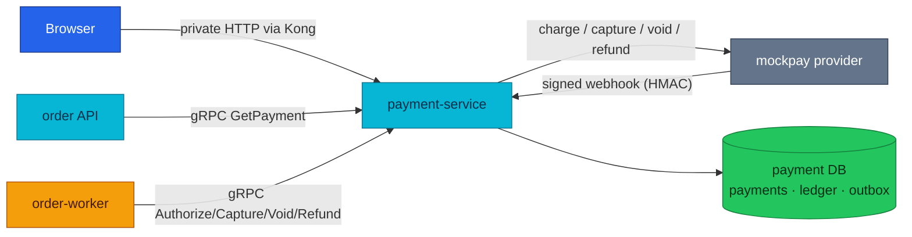
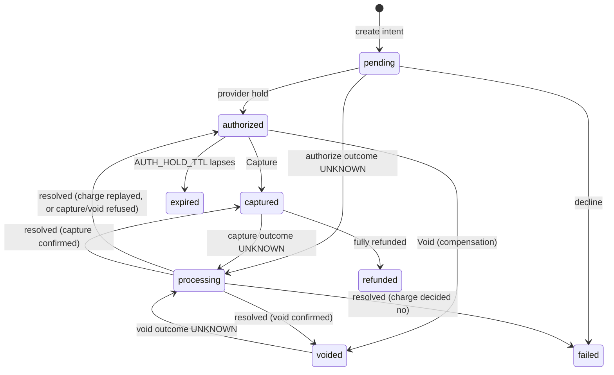
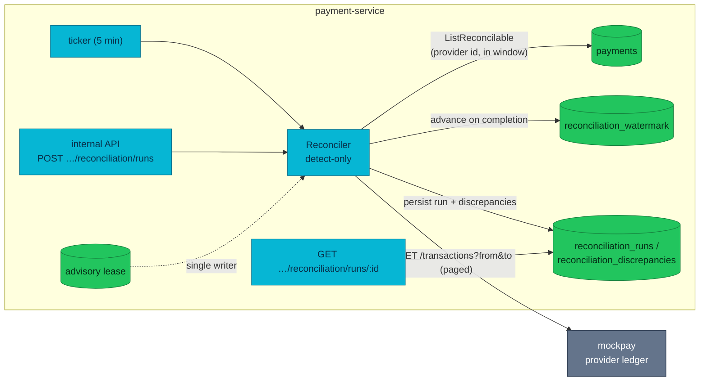

# Payment Service API

Payment turns an order's opaque `tok_` token into settled money — a
Stripe-style auth/capture state machine, a double-entry ledger, and a
reconciliation loop that proves the books match the provider.

| Dimension | Value | Status |
|-----------|-------|--------|
| **Deployment** | local-stack + cluster | Implemented |
| **HTTP** | private + public webhooks · `:8080` · Kong `/payment/v1/private/` (JWT) + `/payment/v1/public/payments/webhooks/` (HMAC, anonymous) + deprecated alias `/payment/v1/public/webhooks/` (ADR-017) | Implemented |
| **gRPC server** | `PaymentService/GetPayment, Authorize, Capture, Void, Refund` · `:9090` | Implemented |
| **gRPC client** | None | None |
| **Worker** | None | None |
| **Temporal** | Participant (gRPC) · [workflows.md#order-fulfillment](./workflows.md#order-fulfillment) | Implemented |
| **Technical debt** | Deprecated webhook alias (ADR-017) · [Known gaps](#known-gaps) | Technical debt |

| Attribute | Value | RFC / ADR |
|-----------|-------|-----------|
| **Repository** | [`duynhlab/payment-service`](https://github.com/duynhlab/payment-service) | — |
| **Owns** | Payment state, refunds, the double-entry ledger, webhook records, reconciliation reports | — |
| **Database** | `payment` on `product-db` — **direct** `product-db-rw.product:5432`, `sslmode=require` (bypasses PgDog: no pooler TLS yet) | — |
| **Design record** | — | [RFC-0010](../proposals/rfc/RFC-0010/) · [RFC-0021](../proposals/rfc/RFC-0021/) P6 · [ADR-034](../proposals/adr/ADR-034-provider-outcome-ambiguity/) · [ADR-035](../proposals/adr/ADR-035-windowed-reconciliation/) · [ADR-036](../proposals/adr/ADR-036-single-writer-lease/) · [ADR-037](../proposals/adr/ADR-037-per-request-refund-identity/) |

## Temporal participation

| Field | Value |
|-------|-------|
| **Role** | Participant (gRPC) |
| **Workflow** | `OrderFulfillmentWorkflow` (owned by order) |
| **This service's steps** | `Authorize`, `Capture` (steps); `Void`, `Refund` (compensations) |
| **Idempotency** | Order-keyed: `order:<id>` (Authorize), `refund:order:<id>` (Refund); Capture/Void replay by state |
| **Deep dive** | [workflows.md](./workflows.md#order-fulfillment) · [temporal.md](./temporal.md) |

## Why it exists

Payment owns the money lifecycle: only payment-service changes payment state
or writes the ledger. A double-clicked charge, a retried Temporal activity,
or a crash between the local commit and the provider confirm must never move
money twice — and when the platform's and the provider's books drift anyway,
someone must notice before a customer does.

The service answers with four mechanisms: an explicit **payment FSM**
(auth-early / capture-late, [ADR-009](../proposals/adr/ADR-009-saga-authorize-early-capture-late/)),
**idempotency everywhere** (`pkg/idempotency`, [ADR-010](../proposals/adr/ADR-010-shared-idempotency-library/)),
an **append-only double-entry ledger** ([ADR-007](../proposals/adr/ADR-007-double-entry-payment-ledger/)),
and **detect-only reconciliation** ([ADR-011](../proposals/adr/ADR-011-detect-only-reconciliation/)/[ADR-012](../proposals/adr/ADR-012-reconciliation-auto-heal/)).
The provider is **mockpay** ([ADR-008](../proposals/adr/ADR-008-mockpay-standalone-provider/)),
a standalone process (the `mockpay` subcommand of the same binary) so webhooks,
latency, and reconciliation stay honest against a process that can fail independently.

## Architecture


```mermaid
flowchart LR
    Browser -->|"private HTTP via Kong"| Payment["payment-service"]
    Provider["mockpay provider"] -->|"signed webhook (HMAC)"| Payment
    OrderAPI["order API"] -->|"gRPC GetPayment"| Payment
    Worker["order-worker"] -->|"gRPC Authorize/Capture/Void/Refund"| Payment
    Payment -->|"charge / capture / void / refund"| Provider
    Payment --> DB[("payment DB<br/>payments · ledger · outbox")]

    classDef edge fill:#2563eb,color:#fff,stroke:#1e3a8a;
    classDef service fill:#06b6d4,color:#082f49,stroke:#0e7490;
    classDef worker fill:#f59e0b,color:#451a03,stroke:#b45309;
    classDef data fill:#22c55e,color:#052e16,stroke:#15803d;
    classDef external fill:#64748b,color:#fff,stroke:#334155;
    class Browser edge;
    class Payment,OrderAPI service;
    class Worker worker;
    class DB data;
    class Provider external;
```

The browser normally reaches payment *through order* (details enrichment);
direct private routes remain for owner-scoped queries and intent creation.
gRPC addressing is `dns:///payment.payment.svc.cluster.local:9090` (single
multi-port Service); gRPC mTLS is **planned**, not deployed — NetworkPolicy
is the east-west fence ([api.md](./api.md#security)).

## Data model

All amounts are `int64` **minor units** (2000 = $20.00). `payment_method` is
an opaque `tok_` test token — PAN-like data is never accepted, stored, or logged.

| Table | Purpose | Key facts |
|-------|---------|-----------|
| `payments` | The PaymentIntent | Stored `status` (FSM below); `partially_refunded` is **derived** (`0 < refunded < amount` while `captured`), never stored |
| `refunds` | First-class refund rows | `pending → processing → succeeded/failed`; never a mutation of the payment row. A `processing` refund still **reserves** its amount against the capture |
| `payment_attempts` | One row per provider round-trip | `outcome_class ∈ SUCCESS/BUSINESS_DECLINE/RETRYABLE_FAILURE/UNKNOWN`, the provider's answer, and **the idempotency key it was sent under**. An UNKNOWN row with no `resolved_at` is the open-doubt worklist ([ADR-034](../proposals/adr/ADR-034-provider-outcome-ambiguity/)) |
| `ledger_accounts` | Fixed chart of accounts | `customer_funds` (asset), `merchant_revenue` (revenue) |
| `ledger_transactions` / `ledger_entries` | Double-entry postings | `kind ∈ capture/refund/reversal`; every transaction balances (Σdebits = Σcredits); append-only triggers block UPDATE/DELETE **and TRUNCATE** — corrections are reversing transactions |
| `outbox_events` | Transactional outbox | `payment.captured`, `payment.refunded`, `payment.capture_reversed` — written in the same tx as the ledger posting |
| `webhook_events` | Webhook dedup + correlation | Idempotent by `event_id`; status `processed`/`orphaned` |
| `reconciliation_runs` / `reconciliation_discrepancies` | Drift reports | Hourly reaper prunes runs older than 30 days |
| `reconciliation_watermark` | Where the last **completed** pass finished | Single row by construction (boolean PK CHECKed true); advances only on completion and only forwards ([ADR-035](../proposals/adr/ADR-035-windowed-reconciliation/)) |

## HTTP API

| Method | Path | Audience | Purpose |
|--------|------|----------|---------|
| `POST` | `/payment/v1/private/payments` | Signed-in user | Create and authorize a payment intent; requires `Idempotency-Key` |
| `GET` | `/payment/v1/private/payments` | Signed-in user | List the caller's payments with pagination |
| `GET` | `/payment/v1/private/payments/:id` | Signed-in user | Read one owner-scoped payment |
| `POST` | `/payment/v1/public/payments/webhooks/mockpay` | Provider | Apply an HMAC-verified provider event |
| `POST` | `/payment/v1/internal/payments/:id/refunds` | In-cluster operator | Create an idempotent partial or full refund |
| `POST` | `/payment/v1/internal/payments/reconciliation/runs` | In-cluster operator | Run reconciliation |
| `GET` | `/payment/v1/internal/payments/reconciliation/runs/:id` | In-cluster operator | Read a reconciliation report |

Private responses are owner-scoped by the JWT `user_id`. Internal routes are
never published through Kong; NetworkPolicy is the cluster boundary. The
public webhook is not anonymous in practice: its HMAC signature is the
credential (Kong's rate/size limits still apply). The deprecated pre-v3 alias
`/payment/v1/public/webhooks/mockpay` stays mounted during the ADR-017 window
([Known gaps](#known-gaps)); shared conventions live in [api.md](./api.md).

## gRPC API

`payment.v1.PaymentService` on `:9090`; proto in `duynhlab/pkg`.
State-changing RPCs are idempotent (Temporal retries activities after
timeouts or lost responses); a provider decline is a **normal response**
(`status: "failed"` + `decline_code`), not a gRPC error.

An **undecided** outcome is neither: it answers `Unavailable` (HTTP 503) and asks
for a retry with the same key, while a decided rejection answers
`FailedPrecondition`. The saga treats a rejection as permanent and compensates on
it, so the two must never share a code — that conflation is the bug RFC-0021 phase 6
removed.

| RPC | Request → Response | Saga | Notes |
|-----|--------------------|------|-------|
| `Authorize` | `order_id, user_id, amount_minor, currency, payment_method` → `Payment` | step | Place (or replay) the hold; idempotent by key `order:<id>`; manual capture mode |
| `Capture` | `order_id` → `Payment` | step | Capture the hold after earlier saga steps succeed; already-captured replays unchanged |
| `Void` | `order_id` → `Payment` | compensation | Release an uncaptured hold |
| `Refund` | `order_id, amount_minor, reason, refund_request_id` → `Refund` | compensation | Return captured funds; idempotent by key `refund:order:<id>:<refund_request_id>`. The **caller** names the refund, because only the caller knows whether two refunds are the same intent — order sends `compensation` and `cancellation`. An empty id keeps the historical `refund:order:<id>` key ([ADR-037](../proposals/adr/ADR-037-per-request-refund-identity/)) |
| `GetPayment` | `order_id` → `Payment` | — | Read snapshot for order-details enrichment; owner-scoping is the caller's job (order authorizes first; NetworkPolicy is the fence) |

## Business rules & techniques

### The money FSM

Stored statuses only — `partially_refunded` is derived, so it can never drift
from the refund sums. Transitions live in one whitelist (`internal/core/domain/payment.go`);
the DB compare-and-swap (`UPDATE … WHERE status = $expected`) is the concurrency
net, the map the business rule and the good error (`409 INVALID_TRANSITION`).


```mermaid
stateDiagram-v2
    [*] --> pending : create intent
    pending --> authorized : provider hold
    pending --> failed : decline
    pending --> processing : authorize outcome UNKNOWN
    authorized --> captured : Capture
    authorized --> voided : Void (compensation)
    authorized --> expired : AUTH_HOLD_TTL lapses
    captured --> processing : capture outcome UNKNOWN
    voided --> processing : void outcome UNKNOWN
    processing --> authorized : resolved (charge replayed, or capture/void refused)
    processing --> captured : resolved (capture confirmed)
    processing --> voided : resolved (void confirmed)
    processing --> failed : resolved (charge decided no)
    captured --> refunded : fully refunded
```

`failed`, `voided`, `expired`, `refunded` are terminal. **`processing` is not a
verdict** — it means an operation was attempted and the provider's answer never
arrived, so nothing has been undone. See [Unknown provider outcomes](#unknown-provider-outcomes).

### Ledger + outbox: settle once, tell everyone at-least-once

Every settled money movement posts a balanced ledger transaction **and** its
outbox event in the same DB transaction — the books and the announcement can
never disagree. The relay drains with `FOR UPDATE SKIP LOCKED` (multi-replica
safe), delivers, then marks published in one tx: a crash between deliver and
mark **redelivers rather than drops** (at-least-once — consumers dedupe on the
event id). Today's sink is a log publisher; a real broker swaps in behind the
`Publisher` interface.

### mockpay + webhook HMAC

mockpay decides outcomes from the **amount**, not the token: `amount_minor % 100`
→ `02` generic decline, `95` insufficient funds, `19` transient (retry succeeds).
Its webhooks are signed Stripe-style — `Mockpay-Signature: t=<unix>,v1=<hex HMAC-SHA256(secret, "<t>.<body>")>`
— the timestamp is inside the signed material, so a captured request cannot be
replayed outside the tolerance window. Verification is constant-time and
**fail-closed** (an empty secret is rejected — HMAC with a zero key is publicly
computable). Verified events are recorded idempotently by `event_id`, correlated
to a payment (`processed`) or parked (`orphaned`); state changes are driven by
the API/saga, not by webhooks.

### The checkout read path (RFC-0010 P6)

The browser never talks to payment directly — it reads through order.

**Write.** The checkout picker offers opaque test tokens (`tok_visa`,
`tok_mastercard`) — a *reference*, never card data. The order API validates
the shape (`tok_` prefix, length, no PAN-like digit runs) and rejects a bad
one with **400 before persisting anything** (the create request becomes
durable Temporal history); an empty `payment_method` falls back to a demo token.

**Read.** `GET /order/v1/private/orders/{id}/details` calls `GetPayment`
after the owner-scoped order lookup — 2s timeout, **soft-fail**: if payment
is unreachable the details still return without the `payment` object (mirrors
the shipping enrichment; the order API needs `PAYMENT_GRPC_ADDR`, not just
the worker). The object carries `status`, `amount`, `refunded`, `currency`,
`decline_code`; a partial refund surfaces as the derived `partially_refunded`.

### Unknown provider outcomes

Every provider call has three possible answers, not two: yes, no, and **silence**.
Silence used to be resolved by assumption, always in the direction "it did not
happen" — so a capture whose response was lost was reversed while the provider
kept the money, a lost void was rolled back to a hold the provider had already
released, and a lost refund answer was sealed into the idempotency cache as a
success carrying `status:"failed"`, which every retry then replayed forever.

The rule now: **an UNKNOWN outcome never triggers the semantic opposite
operation** ([ADR-034](../proposals/adr/ADR-034-provider-outcome-ambiguity/)). The
intent moves to `processing`, the round-trip is recorded in `payment_attempts`
together with the key it was sent under, and nothing is undone.

| Class | What it means | What happens |
|---|---|---|
| `SUCCESS` | The provider did it and said so | Definite state |
| `BUSINESS_DECLINE` | A decided no — a card decline, or any other final answer (malformed request, unknown charge) | Definite state; the intent ends |
| `RETRYABLE_FAILURE` | The provider refused the request and did nothing with it (**429**) | Nothing happened; the caller retries from a clean slate |
| `UNKNOWN` | No answer at all (**5xx**, timeout, transport failure) — the work may have happened | Park in `processing` |

**429 and 503 mean different things**, and conflating them is what let a lost
capture response trigger a reversal. A 429 is a decided refusal; a 503 says
nothing about whether the work happened.

**Resolution asks the same question under the same key.** A provider that already
did the work replays its answer; one that never received the request performs it
now. Either way the truth is learned without doing the work twice — and re-driving
under a *different* key is not a resolution, it is a second charge. Two things
resolve doubt:

- **the request path** — any operation touching a parked payment resolves it
  first, so a caller retrying is what un-parks it. No operator needed in the
  common case.
- **a one-minute sweep** — for the doubt nobody retries: an abandoned checkout, a
  saga that gave up, a refund the customer is not watching. Bounded to 50 entries
  per tick, because each entry is a provider round-trip.

Two invariants are load-bearing and easy to lose:

- **evidence lands before the state.** A `processing` row that no attempt row
  explains cannot be resolved by a retry or by the sweep — only by manual SQL — so
  if the attempt log refuses the write, the park does not happen and the pre-park
  state stands (visible to reconciliation, and counted by
  `payment_attempt_write_failures_total`).
- **a re-drive closes the question it re-asked.** Leaving both rows open makes the
  next pass ask twice, then four times: a provider outage would become a flood
  against that provider.

Callers see doubt as `Unavailable` / HTTP 503 and a decided rejection as
`FailedPrecondition`. order-service **fails closed** on a `processing` payment:
cancelling one parks the order in `manual_review` rather than settling it while the
money is unaccounted for ([ADR-033](../proposals/adr/ADR-033-order-status-cancellation/)).

Operability: `payment_doubt_open` counts open questions and
`payment_doubt_oldest_age_seconds` is the escalation signal — one fresh unknown is
routine, an hour-old one means money is sitting somewhere nobody has looked
([PaymentDoubtStale](../observability/runbooks/microservices/PaymentDoubtStale.md)).

### Payment ↔ provider reconciliation

Two money systems always drift eventually — reconciliation *detects* that drift
instead of learning about it from a customer complaint. The ledger proves the
books are *internally consistent*; reconciliation proves they *match reality*.
Drift sources: a **crash between the local commit and the provider confirm**
(the ADR-007 internally-invisible window — the ledger balances against itself,
so no local check can see it), a **lost webhook**, and a **lost capture
response** (the provider committed, the response vanished, every retry failed).


```mermaid
flowchart LR
    subgraph payment-service
        TICK["ticker (5 min)"] --> R["Reconciler<br/>detect-only"]
        API["internal API<br/>POST …/reconciliation/runs"] --> R
        LEASE[("advisory lease")] -.->|"single writer"| R
        R -->|"ListReconcilable<br/>(provider id, in window)"| DB[(payments)]
        R -->|"advance on completion"| WM[(reconciliation_watermark)]
        R -->|"persist run + discrepancies"| RDB[(reconciliation_runs /<br/>reconciliation_discrepancies)]
        API2["GET …/reconciliation/runs/:id"] --> RDB
    end
    R -->|"GET /transactions?from&to (paged)"| MP["mockpay<br/>provider ledger"]

    classDef service fill:#06b6d4,color:#082f49,stroke:#0e7490;
    classDef data fill:#22c55e,color:#052e16,stroke:#15803d;
    classDef external fill:#64748b,color:#fff,stroke:#334155;
    class TICK,R,API,API2 service; class DB,RDB,WM,LEASE data; class MP external;
```

One pass is **bounded to a time window** on charge creation, and **both sides are
asked for the same bounds** ([ADR-035](../proposals/adr/ADR-035-windowed-reconciliation/)).
That symmetry is the correctness argument: compare a narrow internal set against
the provider's whole history and every older charge reads as missing on our side —
a discrepancy that is an artefact of the question, not a fact about the money.

The automatic window runs from the last completed pass's frontier **less a 1h
lookback**, up to **5m short of now**. The lookback re-judges recent ground,
because a `missing_provider` may have been nothing worse than an authorize in
flight; the settlement lag keeps a payment created seconds ago from being called
missing, because a report that cries wolf is a report nobody reads. The frontier
(`reconciliation_watermark`) advances **only on a completed pass** and **only
forwards** — a failed pass leaves it, so the next one re-covers the same ground
rather than stepping over a stretch nobody checked.

`POST …/reconciliation/runs?from=&through=` runs an explicit window for a
backfill. A malformed bound is **refused**, never dropped: dropping one would
widen the pass to everything and turn a typo into a report full of discrepancies
that do not exist.

**Payments in `processing` are excluded.** Their disagreement is not drift — it is
a question the attempt log owns, with its own resolution path — and leaving them in
re-reported the same mismatch on every run.

Only **one pass runs at a time, across processes**: a session-level advisory lease
is taken before anything is written ([ADR-036](../proposals/adr/ADR-036-single-writer-lease/)).
A runner that cannot take it stands down (409 on the API, a silent tick),
because for a single-writer role "somebody else is doing it" is the correct
outcome rather than a failure. Two concurrent passes would both page the ledger,
both write discrepancy rows for the same charges, and both try to heal them.

Each pairing inside the window is classified:

| Class | Meaning | Typical cause |
|---|---|---|
| `missing_internal` | Provider has a charge we have no payment for | Should be impossible (payment row precedes the charge) → bug signal |
| `missing_provider` | We have a payment the provider never recorded | In-flight authorize, or a genuinely lost charge |
| `amount_mismatch` | Both sides disagree on the amount | Data corruption / provider adjustment |
| `status_mismatch` | Both sides disagree on the state | The ADR-007 crash window; a lost webhook |

When both amount and status differ, **amount wins** (one discrepancy per
charge — fix the amount first; the next run catches residual status drift).

**Expected pairings are not drift.** The vocabularies differ: `expired`
(internal) ↔ `authorized`/`voided` (provider) is a normal lapsed hold,
suppressed; `captured` with a recorded partial refund ↔ `refunded` (provider)
is benign **only when we recorded a refund** — a `captured` payment with *no*
internal refund that the provider shows `refunded` is real drift and is flagged.

**The detector defends itself** — the provider's data is untrusted input:
paging never trusts the provider's `Total` (an under-stated total would silently
drop pages and mis-flag `missing_provider`) — the sweep terminates on a short
page with a hard 1M-transaction cap; a run's discrepancies commit **atomically**
(a failed pass never leaves a partial report); a run is **always closed**
(`completed`/`failed`) on a detached context, so an aborted trigger or shutdown
can't strand a row in `running`.

**Heals?** Detect-only by default ([ADR-011](../proposals/adr/ADR-011-detect-only-reconciliation/)).
With `RECON_HEAL_ENABLED` (default off) it heals exactly one class — the
lost-capture-response window (internal `authorized` vs provider `captured`)
via an idempotent re-capture ([ADR-012](../proposals/adr/ADR-012-reconciliation-auto-heal/));
all other classes stay human-corrected: pull both sides (payment row + ledger
entries vs the provider record), decide which is right, and correct via the
normal APIs (refund endpoint, state transitions) — never by editing rows, so every correction leaves its own audit trail.

**Is it running?** A reconciler that has stopped emits no runs at all, so a
discrepancy count of zero cannot tell "healthy" from "stopped".
`payment_reconciliation_watermark_age_seconds` can: it grows without bound when
the frontier stops moving. Run outcome, run duration, and heal failures per class
are series alongside it — a heal that never worked used to be only a log line
([PaymentReconciliationDiscrepancy](../observability/runbooks/microservices/PaymentReconciliationDiscrepancy.md)).


**The provider's answer is verified, not trusted** (since 1.5.2). Each returned
transaction is checked against the half-open `[from, through)` window the pass
asked for. A row outside it is **excluded from classification** — it cannot
manufacture a phantom `missing_internal` — counted in
`payment_reconciliation_window_violations_total`, and the pass then **holds the
watermark** so the next run re-covers the same window.
`PaymentReconciliationWindowViolation` (warning) makes that refusal visible,
because a silently held frontier looks exactly like a reconciler that stopped.
This exists because the first GameDay's critical discrepancy was a false
positive of precisely this shape: a provider build that discarded its
`from`/`to` bounds made a bounded internal set face the whole ledger, and every
older charge read as missing on our side.

## Callers & dependencies

| Direction | Peer | Contract |
|-----------|------|----------|
| Inbound | order-worker (saga activities) | gRPC `Authorize`/`Capture`/`Void`/`Refund` |
| Inbound | order API (details enrichment) | gRPC `GetPayment(order_id)`, soft-fail |
| Inbound | mockpay | Signed webhook → `/payment/v1/public/payments/webhooks/mockpay` |
| Inbound | Browser via Kong | `/payment/v1/private/payments…` (edge JWT + `pkg/authmw`) |
| Outbound | mockpay | Provider HTTP port (charge/capture/void/refund, `GET /transactions`) — payment is not a gRPC client of any service |

## Known gaps

- **Deprecated webhook alias** `/payment/v1/public/webhooks/mockpay` — pre-v3
  path kept at both edges during the ADR-017 window so in-flight mockpay
  retries keep landing; remove at contract end. A matching deprecated internal
  alias `/payment/v1/internal/reconciliation/runs` remains mounted in-service.
- **No pooler for payment DB** — direct CNPG connection with `sslmode=require`
  because PgDog does not terminate TLS yet (RFC-0020 research).
- **Reconciliation limits (deliberate, tracked):** refund *amounts* aren't
  reconciled (the provider reports a refunded flag only — don't read a clean run
  as "refunds reconcile"); currency isn't carried on the report (single-currency
  platform). The unbounded scan and the missing discrepancy alert were **closed**
  in RFC-0021 P6 ([ADR-035](../proposals/adr/ADR-035-windowed-reconciliation/),
  homelab #646).
- **Window constants are guesses at this scale** — a 1h lookback and a 5m
  settlement lag are honest defaults, not measurements. Real provider latency
  should re-derive both.
- **A parked authorize with no recorded key cannot be resolved automatically.**
  The charge key comes from the caller's `Idempotency-Key`, so only rows written
  before migration 000011 have this shape: finite, alerted, and an operator's job
  ([PaymentDoubtSweepFailing](../observability/runbooks/microservices/PaymentDoubtSweepFailing.md)).
- **`replicaCount` stays 1.** The reconciler's lease is now cross-process, but
  migration 000007 (`idempotency_keys.payment_id` → `subject_id`) is not
  rolling-safe, so the lease is not a licence to scale
  ([ADR-036](../proposals/adr/ADR-036-single-writer-lease/)).
- **Outbox sink is a log publisher** — a real broker requires revisiting the
  claim-transaction-across-network-I/O caveat in `outbox_relay.go`.

## Operations

- **Key env:** `DB_*` (`DB_SSLMODE=require` on cluster), `AUTH_JWKS_URL`,
  `JWT_ISSUER`/`JWT_AUDIENCE`, `GRPC_PORT`, `MOCKPAY_URL`, `MOCKPAY_WEBHOOK_SECRET`,
  `MOCKPAY_WEBHOOK_URL`, `AUTH_HOLD_TTL`, `IDEMPOTENCY_KEY_TTL`,
  `IDEMPOTENCY_LOCK_TAKEOVER`, `RECON_HEAL_ENABLED`.
- **Reconciliation API** (internal audience — never routed through the
  gateway: on the cluster the payment NetworkPolicy is the fence — Kong
  reaches `:8080` only, the order namespace alone reaches `:9090` — and in
  local-stack Kong simply omits the route). The ticker also runs a pass
  every 5 minutes:

```bash
# trigger one pass over the AUTOMATIC window
# (lease held elsewhere → 409; disabled/stub provider → 503)
curl -X POST http://payment:8080/payment/v1/internal/payments/reconciliation/runs

# backfill an explicit window (RFC 3339; a malformed or inverted bound → 400)
curl -X POST "http://payment:8080/payment/v1/internal/payments/reconciliation/runs?from=2026-08-01T00:00:00Z&through=2026-08-02T00:00:00Z"

# fetch a run's report
curl http://payment:8080/payment/v1/internal/payments/reconciliation/runs/2
```

```json
{
  "run": {"id": 2, "status": "completed", "transactions_scanned": 2, "discrepancies_found": 1},
  "discrepancies": [{
    "provider_payment_id": "mp_1", "class": "amount_mismatch",
    "internal_amount_minor": 1920, "provider_amount_minor": 1919,
    "internal_status": "captured", "provider_status": "captured",
    "detail": "amount differs: internal 1920 vs provider 1919 minor units"
  }]
}
```

  Treat `detail`/`provider_status` as untrusted text if a UI ever renders
  them — they carry provider-controlled strings.
- **Verified end-to-end** (fault-injection e2e, 2026-07-04) against the full
  local-stack with mockpay's deterministic magic amounts:

| Fault injected | Saga outcome | Payment row |
|---|---|---|
| decline (total 2002) | order **failed**, no stock reserved | `failed`, `generic_decline` |
| insufficient funds (2095) | order **failed** | `failed`, `insufficient_funds` |
| transient (1919 — now **429**) | retry → order **confirmed** | `captured` |
| zero-stock product (2500) | authorize ok → reserve fails → compensate | **`voided`** |
| clean reconciliation run | — | `completed`, 0 discrepancies |
| injected drift (`UPDATE … amount_minor+1`) | — | run detects `amount_mismatch` 1920 vs 1919 |

  RFC-0021 P6 added two triggers for the ambiguity paths: **`…13` no answer**
  (mockpay creates the charge and withholds the response, so "the provider did it
  and we do not know" is reproducible without killing a container) and
  **`…07` refund declined** (refund-only, so a charge can succeed and its refund
  still be refused). Verified on local-stack: a paused provider parked the refund
  and left the key unsealed, unpausing re-drove **the same key** to `succeeded`,
  and a lost charge answered a definite 404 → refund `failed` → order parked.

## Code map

Paths in [`duynhlab/payment-service`](https://github.com/duynhlab/payment-service). Transport peers call `logic/v1`; logic calls `core` only ([api.md § Inside Each Service](./api.md#inside-each-service)).

| Layer | Path | Notes |
|-------|------|-------|
| **Transport** | `internal/web/v1/` | HTTP handlers + webhook + recon API |
| | `internal/grpc/v1/server.go` | gRPC server (saga RPCs) |
| **logic** | `internal/logic/v1/` | Payment logic, outbox relay, reconciliation, heal |
| **core** | `internal/core/domain/payment.go` | FSM + domain types |
| | `internal/core/repository/` | Repositories (payments, ledger, outbox, webhook, recon) |
| | `internal/core/provider/` | Provider port + HTTP client |
| **Platform** | `internal/mockpay/` | mockpay provider (subcommand) |
| | `internal/webhooksig/sign.go` | Webhook HMAC (shared signer/verifier) |
| | `db/migrations/sql/` | Migrations (ledger triggers, outbox) |
| | `pkg/proto/payment/v1/` | Proto |

## References

- [api.md](./api.md) — shared HTTP/gRPC conventions (auth, error envelope, pagination, gRPC runtime)
- [order.md](./order.md) · [temporal.md](./temporal.md) — saga handoff and compensation
- [workflows.md](./workflows.md) · [Service contracts](./README.md#service-contracts)
- [RFC-0010](../proposals/rfc/RFC-0010/) — full design; ADRs [007](../proposals/adr/ADR-007-double-entry-payment-ledger/) ledger · [008](../proposals/adr/ADR-008-mockpay-standalone-provider/) mockpay · [009](../proposals/adr/ADR-009-saga-authorize-early-capture-late/) auth-early/capture-late · [010](../proposals/adr/ADR-010-shared-idempotency-library/) idempotency · [011](../proposals/adr/ADR-011-detect-only-reconciliation/) detect-only · [012](../proposals/adr/ADR-012-reconciliation-auto-heal/) auto-heal

_Last updated: 2026-08-04_
