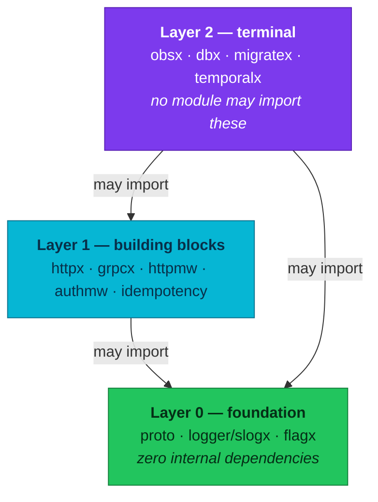

# Shared Go Library (`pkg`)

Twelve independently tagged Go modules carrying the platform's logging facade,
middleware, observability wiring, database helpers, and the versioned east-west
protobuf contracts. A service pins only the modules it imports, and each moves on
its own release line.

| Attribute | Value | RFC / ADR |
|-----------|-------|-----------|
| **Repository** | [`duynhlab/pkg`](https://github.com/duynhlab/pkg) | — |
| **Modules** | **12**, one per package — `github.com/duynhlab/pkg/<module>` (counted with `find . -name go.mod`). There is **no root `go.mod`**, and one must never be re-created. `logger/zapx`, `logger/zerolog` and `logger/clog` left the tree on 2026-09-24 (pkg #108); their tags still resolve — see [§ Which logger each tag line belongs to](#which-logger-each-tag-line-belongs-to) | — |
| **Newest tags** (2026-09-24) | `v0.45.0` for `obsx` (RFC-0031 Task 1.1c-B: zap bridge removed, `ForceFlush` added; `v0.39.1` is a mis-tag identical to `v0.39.0`, never pin it) · `v0.43.0` for `temporalx` (slog `WithLogger`, lifecycle and workflow events, SDK error shape) · `v0.37.2` for `authmw idempotency proto` · `v0.37.1` for `httpx` · `v0.37.0` for `grpcx` (slog access interceptor) · `v0.36.3` for `dbx` · `v0.36.2` for `migratex` · `v0.36.1` for `flagx` · `v0.2.0` for `logger/slogx` and `httpmw`, which each run their own line from `v0.1.0` | — |
| **Single-module line** | Frozen at `v0.35.0` (2026-08-06). **No plain `v0.36.x` tag exists** | — |
| **Consumers** | 10 Go services (the frontend SPA does not use it; `auth-service` is archived) | — |
| **Bump mechanics** | Per module: `go get github.com/duynhlab/pkg/<module>@vX.Y.Z` | — |
| **Design records** | — | [RFC-0014](../proposals/rfc/RFC-0014/) (obsx) · [RFC-0017](../proposals/rfc/RFC-0017/) (dbx, TraceContext) · [RFC-0021](../proposals/rfc/RFC-0021/) (flagx, inventory/product contracts) · [ADR-038](../proposals/adr/ADR-038-shared-http-middleware/) (layering, `httpmw`) · **[RFC-0031](../proposals/rfc/RFC-0031/) (Accepted 2026-09-17; as-built 2026-09-24)** → [ADR-070](../proposals/adr/ADR-070-logging-facade-and-event-catalog/) (slog facade, event catalog) · [ADR-071](../proposals/adr/ADR-071-telemetry-event-data-contract/) (privacy boundary) · [ADR-072](../proposals/adr/ADR-072-telemetry-clean-cutover/) (one-release cutover, version floor) · [ADR-073](../proposals/adr/ADR-073-application-metrics-contract/) (metrics) · [ADR-074](../proposals/adr/ADR-074-continuous-profiling-contract/) (profiling) · [ADR-075](../proposals/adr/ADR-075-application-tracing-contract/) (tracing) · [ADR-076](../proposals/adr/ADR-076-semantic-convention-registry/) (Weaver registry) |

## Overview

`pkg` exists so ten services do not each carry their own copy of JWT
verification, OTel wiring, gRPC hardening, or idempotency semantics. Two rules
shape it:

1. **Contracts live here, generated stubs are committed.** A service imports
   `proto/<svc>/v1` at the version it pins — no protoc at build time, and a
   contract change is visible as an ordinary version bump.
2. **One module per package, one tag per module.** A service pins only what it
   imports, so a change to `temporalx` cannot force a release on the eight services
   that never touch Temporal.

> **RFC-0031 — as-built 2026-09-24.** What shipped in this module set:
> (1) **`logger/slogx`** is the Layer-0 logging facade — own `go.mod`, OTel **API** and
> the OTel slog bridge only, never `obsx` — and **all ten services log through it**
> since the Phase 3 release train ([§ Adoption](#adoption),
> [ADR-070](../proposals/adr/ADR-070-logging-facade-and-event-catalog/)); `v0.2.0` added
> `ProcessStarted`/`ProcessStopped` for the catalog's `process.started`/`process.stopped`
> ([logs.md § Event catalog](./logs.md#event-catalog)). (2) **`obsx` v0.45.0** is the
> breaking release: `ZapCore`, `TraceContext` and the `otelzap` dependency are gone and
> `ForceFlush` is new, so the facade's FATAL path exports its record before the process
> exits; the SDK-typed fields had already left in `v0.39.x`, leaving
> `TracerProviderConfig.SDKOptions` as the one allowlisted SDK seam
> ([ADR-072](../proposals/adr/ADR-072-telemetry-clean-cutover/)). (3) The transport and
> worker adapters take a `*slog.Logger` — `httpmw` v0.2.0, `grpcx` v0.37.0, `temporalx`
> v0.40.0 onward. (4) **`logger/zapx`, `logger/zerolog` and `logger/clog` are retired**
> (pkg #108, 2026-09-24): removed from the tree, no new releases, published tags still
> resolve. No service binary links `go.uber.org/zap`, `otelzap`, zerolog or clog
> (checked with `go version -m` on all ten release images).
>
> Still **planned**: (a) **machine enforcement of the version floor** — the ADR-072 rule
> that a service runs at most one minor behind any module it imports is enforced in
> review. The fleet lint policy exists in the shared workflows
> (`.github/lint/golangci-policy.yml`, a second `go-check` pass behind the
> `policy-lint` input, non-blocking unless `policy-lint-blocking` is set), but it checks
> import boundaries (SDK, exporters, bridges, contrib instrumentation, second telemetry
> clients) rather than versions, and no service's CI turns it on as of 2026-09-24.
> (b) The **Weaver registry** ([ADR-076](../proposals/adr/ADR-076-semantic-convention-registry/),
> RFC-0031 Task 4.5, not started): attribute keys and metric names in the shared
> modules and the catalog sections of `docs/api/` are still maintained by hand.

### Why the split, concretely

The security round released as `v0.36.1` bumped gRPC and `golang.org/x`. Under
the old single module, that would have moved every consumer of every package.
Per module, it touched **nine** of thirteen: `flagx`, `logger/zapx`, `logger/zerolog`
and `logger/clog` (the three loggers since retired) carry no such dependency, so they
legitimately stayed at `v0.36.0`. Different newest tags across modules is the normal state, not drift.

### Layering

Modules sit in strict layers, and **a module may only import a lower layer**.
Same-layer imports are forbidden even when they would not create a cycle, because
they create hidden tag-ordering constraints.

Enforcement is `depguard` in the repo's `.golangci.yml`, which also confines the
OTel **SDK** to `obsx`. Today no module imports another at all — the layers state
what is *allowed*, so the constraint is cheap to keep and expensive to recover
once broken.

The rule that bites: **`obsx` is Layer 2, so no shared module can call it.** A
shared HTTP middleware that wants trace context must build the field from the
OpenTelemetry **API**, which Layer 1 may import. [ADR-038](../proposals/adr/ADR-038-shared-http-middleware/)
works that through, and the Layer 1 and Layer 2 adapters live the consequence:
`grpcx` inlined its trace-id helper at the split, and since `httpmw` v0.2.0,
`grpcx` v0.37.0 and `temporalx` v0.40.0 they import `log/slog` only — never the
`logger/slogx` facade — and write each record with the call's context, so the
facade's handler stamps `trace_id`/`span_id` from the active span without a
cross-module edge. The 2026-08-07 telemetry audit measured the failure class this
prevents:
per-repo middleware copies got trace binding wrong in 9 of 10 HTTP services
(details preserved in [ADR-038](../proposals/adr/ADR-038-shared-http-middleware/) § References).

Authoritative per-package detail lives in the repo's own
[`README`](https://github.com/duynhlab/pkg#modules) and `AGENTS.md`; this page is
the platform-side summary and the release ledger.

## Packages

| Module | Layer | Purpose |
|---------|:---:|---------|
| `authmw` | 1 | Fail-closed Gin middleware verifying RS256 JWT bearer tokens locally against a cached JWKS (issuer/audience pinned). JWT-only since RFC-0009 P5. **v0.37.0 (RFC-0024 P3):** verifies the Keycloak realm via an explicit `Config` — `OIDC_ISSUER` (default `https://id.duynh.me/realms/duynhlab`), `OIDC_AUDIENCE` (default `duynhlab-platform`), optional `OIDC_JWKS_URL` (empty derives `<issuer>/protocol/openid-connect/certs`); normalizes `realm_access.roles`; `user_id` is the `sub` string. The pre-P3 `AUTH_JWKS_URL`/`JWT_ISSUER`/`JWT_AUDIENCE` env names are gone. |
| `dbx` | 2 | pgx pools pre-wired with OTel (otelpgx tracing + pool-stat metrics), transaction-pooler-safe defaults, password-file credential hot-reload. |
| `flagx` | 0 | Startup-validated env flags for migration modes (RFC-0021): enum flags + bounded percent flag; values safe as metric labels. |
| `grpcx` | 1 | East-west gRPC server/client helpers: OTel, panic recovery, health, reflection, keepalive, round-robin over headless Services, machine-readable error reasons, access-log interceptor (level follows the status class). **v0.37.0 (RFC-0031 Phase 2):** `NewServer(*slog.Logger, ...)`; the access record carries only the canonical keys the pinned otelgrpc puts on the server span — `rpc.system.name`, `rpc.method` (`package.Service/Method`), `rpc.response.status_code` (spec spelling, e.g. `NOT_FOUND`), and `error.type` only for the codes that span marks as Error — so a record joins its span; no peer address or duration. A recovered panic is one structured record with a stack bounded to 4 KiB instead of free text on stderr. |
| `httpmw` | 1 | The shared Gin middleware every service mounts on `gin.New()`: `Tracing(serviceName, extraSkipRoutes...)` (otelgin server span + `http.server.*` metrics), `Logging(logger, extraSkipRoutes...)` (access record) and `Recovery(logger)` — `inventory` mounts `Logging` and `Recovery` without `Tracing` — plus `LoggerFrom` and `TraceID`. One `DefaultSkipRoutes` map feeds `Tracing` and `Logging`, so the trace and log skip lists cannot drift apart; matching is exact on the Gin route pattern (`c.FullPath()`), so a probe on a path nobody registered is traced as a 404 instead of vanishing; successful probes are skipped, failing ones kept. gin and otelgin are imported here and nowhere else in `pkg` (ADR-038). **v0.2.0 (RFC-0031 Phase 2):** takes a `*slog.Logger` and no longer links zap; the access record (`HTTP request`) carries `http.request.method` (non-standard methods as `_OTHER`), `http.route` (omitted when nothing matched, never replaced by the raw path), `http.response.status_code` and `error.type` for a 5xx — no raw path, query, client address, User-Agent or duration; correlation comes from the request context, so `LoggerWithTraceID` and the otelzap carrier field are gone. `Recovery` is new: one structured panic record and a 500, replacing gin's text output that printed the raw path and client address. |
| `httpx` | 1 | Shared HTTP envelope: additive error shape (`error` + stable `code`) and list pagination. |
| `idempotency` | 1 | Postgres-backed idempotency store, Stripe-style: claim → first response replays verbatim → mismatch is a conflict; in-flight locks with stale-lock takeover. Caller owns the table. **v0.37.0:** `UserID` is `string` (Keycloak `sub`, ADR-042 — was `int64`). |
| `logger/slogx` | 0 | **The logging facade (RFC-0031 / ADR-070) — every service logs through it since the 2026-09-24 release train** (`v0.1.0` 2026-09-23; `v0.2.0` 2026-09-24 adds `ProcessStarted(ctx, component)` / `ProcessStopped(ctx, component, outcome)` for the catalog's `process.started` / `process.stopped`, component and outcome bounded to the catalog's sets, an error shutdown written at Error). A service builds it with `slogx.New(slogx.Config{Level: ..., Flush: obs.ForceFlush})` after `obsx.SetupObservability`, so FATAL exports its record before exit, and hands `Slog()` to the adapters. A context-first API over `log/slog`: every emission takes a `context.Context`, so `trace_id`/`span_id` come from the active span instead of a field the caller remembers to add. One record is redacted once and rendered twice — the unchanged platform JSON envelope on stdout, and OTLP through the OTel slog bridge reading the provider `obsx` installs in the global (the module links the OTel **API** and the bridge, never the SDK, and an `api_surface_test.go` fails the build if an exported signature names one). Six levels on the RFC severity table (`trace` 1 … `fatal` 21), `Event` for catalog records with a validated name, `Err` for the `error.type` + `error.message` shape, and a redaction boundary that cannot be switched off: the platform deny list matched on normalised keys wherever they appear (struct field, map key, `LogValuer` output) plus value scanners for Bearer/Basic, JWTs, denied `key=value` pairs, URL userinfo and Luhn-valid card numbers, bounded at 64 attributes / depth 4 / 4 KiB. Migration record: [`docs/MIGRATION-slogx.md`](https://github.com/duynhlab/pkg/blob/main/docs/MIGRATION-slogx.md). |
| ~~`logger/zapx` · `logger/zerolog` · `logger/clog`~~ | — | **Retired** (pkg #108, 2026-09-24): removed from the tree once every service moved to `logger/slogx`; no new releases. Last tags `logger/zapx/v0.36.1`, `logger/zerolog/v0.36.2`, `logger/clog/v0.36.2` — they still resolve through the module proxy, so an old pin builds. No per-module tag of `zerolog` or `clog` ever had a consumer (in the single-module era cart used `clog` and auth `zerolog`). |
| `migratex` | 2 | Embedded golang-migrate runner (`Run(fsys, dir, dsn)`) — always against the DIRECT DB host, never a transaction pooler (DDL is unsafe through PgBouncer/PgDog). |
| `obsx` | 2 | The single OTel SDK wiring point (RFC-0014 P0): traces/metrics/logs over OTLP, one `Shutdown`, the logger provider installed as the OTel global (where `logger/slogx` reads it), Pyroscope profiling. **v0.45.0 (RFC-0031 Task 1.1c-B, breaking):** `ZapCore`, `TraceContext` and the `otelzap` dependency are removed — a service that bumps `obsx` without moving to the facade stops compiling instead of quietly losing its OTLP logs; `ForceFlush(ctx)` exports every built provider's buffer without stopping it, logs first (reverse construction order, like `Shutdown`), and must run before `Shutdown` — it is what `slogx.Config.Flush` wires to. `v0.44.x` stays the patch line for a service still on the zap bridge (`v0.44.1`, 2026-09-23, is the last). **v0.44.0 (RFC-0031 Phase 1, Tasks 1.2–1.5):** the W3C propagator is installed whether or not tracing is enabled; one `resourceAttributes` function is the single identity source for traces, metrics, logs *and* the Pyroscope labels (so `deployment_environment` and `service_version` stop being empty); one dispatching View gives the fleet bucket boundaries to every histogram whose unit is `s`, the Temporal SDK's and gRPC's included; `RecordError` sets `error.type` from the cause's concrete type with one bounded exception event and no stacktrace, and `RecordOutcome` records a business rejection under `outcome` with the span status left unset. **v0.39.2 (Task 1.1c-A):** the exported surface speaks OTel **API** types only — `Enabled() Signals` replaces nil-checks on the (now unexported) SDK providers, `TracerProvider()/MeterProvider()/LoggerProvider()` return API interfaces, `WithTracerProviderFactory` takes `func(TracerProviderConfig) ShutdownTracerProvider` whose `SDKOptions()` is the single allowlisted SDK type (forwarded variadically, so the caller imports no SDK package); `obsx/api_surface_test.go` fails the module if any other exported signature names `sdktrace`/`sdkmetric`/`sdklog`/`resource`/`zap`/`zapcore`. `ZapCore` and `TraceContext` stayed until the slogx facade (Task 1.1c-B, `v0.45.0` above). **v0.37.1:** also owns the span helpers services used to copy — `Tracer`, `StartSpan`, `AddSpanAttributes`, `AddSpanEvent`, `RecordError`, `SetSpanStatus`; the instrumentation `scope` they take is a package path (`github.com/duynhlab/user-service/internal/logic/v1`), never the service name, which already rides as `service.name` on the Resource. |
| `temporalx` | 2 | Temporal client/worker bootstrap mirroring grpcx/obsx: OTel **v2 plugin** (replay-safe tracing + monotonic SDK RED metrics — ADR-063; `NewReplaySafeTracerProvider`/`Tracer` re-exported so services never import the experimental contrib module), SDK logs through the service slog logger (`WithLogger(*slog.Logger)` since v0.40.0 — the service passes the facade's `Slog()`; v0.39.x took a `*zap.Logger`), Worker Deployment Versioning. **v0.40.0–v0.43.0 (RFC-0031 Phase 2 and the event catalog):** v0.40.0 wires the SDK's structured logger straight to slog, replay safety staying the SDK's (a test replays a recorded history and sees the workflow's line written zero times); v0.41.0 — `WithLogger` also installs a client interceptor that writes `temporal.workflow.started` for an unambiguous `ExecuteWorkflow` (not for `USE_EXISTING` conflict policy, where the server answers success for a run already going), and `WorkflowFailed` writes `temporal.workflow.failed` for a run a caller observed ending failed, terminated or timed out; v0.42.0 — `WorkflowEvent(ctx workflow.Context, ...)` writes catalog events decided in workflow code through the SDK's replay-aware logger, so a replayed history writes nothing; v0.43.0 — the SDK's own poll and activity errors, logged under a raw `Error` key, are rewritten to `error.type` (the application-error type when there is one, else the Go type) + `error.message`, the shape `slogx.Err` writes. **v0.37.0:** reads Temporal's own `TEMPORAL_DEPLOYMENT_NAME` (the platform's invented `TEMPORAL_WORKER_DEPLOYMENT_NAME` is gone), so an identity injected by the Temporal Worker Controller needs no manifest help; `Versioning`/`MustVersioning`/`WithDefaultVersioningBehavior` removed — `VersioningFromEnv`/`MustVersioningFromEnv` are the only entry points, half a config still exits 1, and an unset behaviour still resolves to `Pinned`. |
| `proto/<svc>/v1` | 0 | Versioned contracts + committed stubs for `cart`, `inventory`, `notification`, `order`, `payment`, `product`, `review`, `shipping`. **v0.37.0:** `user_id` is `string` everywhere — notification (was `int32`) and payment (was `int64`) joined the already-string contracts (ADR-042). |

## Consumer matrix

Which modules each service imports — derived from the imports on each service's
`main` (2026-09-24), which is also what each `go.mod` requires (verified: no
service requires a module it does not import, or imports one it does not
require, and no `pkg` module is `// indirect`).

| Service | n | authmw | dbx | flagx | grpcx | httpmw | httpx | idempotency | logger/slogx | migratex | obsx | temporalx | proto |
|---------|:-:|:---:|:---:|:---:|:---:|:---:|:---:|:---:|:---:|:---:|:---:|:---:|-------|
| user | 7 | ✓ | ✓ | — | — | ✓ | ✓ | — | ✓ | ✓ | ✓ | — | — |
| inventory | 9 | ✓ | ✓ | — | ✓ | ✓ | ✓ | — | ✓ | ✓ | ✓ | — | inventory |
| product | 9 | ✓ | ✓ | — | ✓ | ✓ | ✓ | — | ✓ | ✓ | ✓ | — | inventory, product, review |
| shipping | 9 | ✓ | ✓ | — | ✓ | ✓ | ✓ | — | ✓ | ✓ | ✓ | — | shipping |
| cart | 9 | ✓ | ✓ | — | ✓ | ✓ | ✓ | — | ✓ | ✓ | ✓ | — | cart |
| review | 9 | ✓ | ✓ | — | ✓ | ✓ | ✓ | — | ✓ | ✓ | ✓ | — | review |
| notification | 9 | ✓ | ✓ | — | ✓ | ✓ | ✓ | — | ✓ | ✓ | ✓ | — | notification |
| payment | 10 | ✓ | ✓ | — | ✓ | ✓ | ✓ | ✓ | ✓ | ✓ | ✓ | — | payment |
| order | 11 | ✓ | ✓ | ✓ | ✓ | ✓ | ✓ | — | ✓ | ✓ | ✓ | ✓ | inventory, notification, order, payment, shipping |
| checkout | 11 | ✓ | ✓ | — | ✓ | ✓ | ✓ | ✓ | ✓ | ✓ | ✓ | ✓ | cart, inventory, order, product, shipping |

Seven modules are now common to **every** service — `authmw dbx httpmw httpx
logger/slogx migratex obsx`. `inventory` was the counter-example to a shared
floor (no `httpx`, no `authmw`) until its protected Backoffice HTTP layer; it now
imports `authmw`, `httpmw` and `httpx` like the rest, and differs only in
mounting `httpmw` without `Tracing`. `user` is the only service with no `grpcx`
and no `proto`.

## Adoption

All ten active services are migrated off the frozen root module (`auth` is archived and no longer counted). `inventory` was last
(2026-08-08), which is also why it is absent from the migration runbook in the pkg
repo.

**Fleet pins — 2026-09-24 (RFC-0031 Phase 3 release train).** Every service moved
to `logger/slogx`, `obsx` v0.45.0 and the slog adapters in one train, per the
ADR-072 one-release cutover: `user v2.3.0` · `product v1.14.0` · `inventory v0.7.0` ·
`cart v2.2.0` · `order v2.8.0` (API + order-worker) · `review v2.2.0` ·
`shipping v1.7.0` · `notification v2.2.0` · `payment v2.4.0` (API + mockpay;
`v2.4.1` later the same day starts mockpay's profiler) · `checkout v0.11.0` (API +
checkout-worker). The cluster points at them since homelab #1088.

| Modules | Pinned at |
|---------|-----------|
| `obsx` | `v0.45.0` — all ten |
| `logger/slogx` | `v0.2.0` — all ten |
| `httpmw` | `v0.2.0` — all ten (`inventory` mounts `Logging` + `Recovery` only) |
| `authmw` | `v0.37.2` — all ten |
| `httpx` | `v0.37.1` — all ten |
| `dbx` | `v0.36.3` — all ten |
| `migratex` | `v0.36.2` — all ten |
| `grpcx` | `v0.37.0` — every service except `user` |
| `proto` | `v0.37.1` — every service except `user` (newest `v0.37.2` is an advisory-only dependency bump; the consumers already require the fixed gRPC directly) |
| `temporalx` | `v0.43.0` — order, checkout. The ADR-063 rule: both Temporal services pin the SAME version (a future split must record its reason here, and re-buys the dual-metric-name problem #921 measured) |
| `idempotency` | `v0.37.1` — payment, checkout (newest `v0.37.2` moves a test-only dependency) |
| `flagx` | `v0.36.1` — order |
| `logger/zapx` | none — no service requires it, and no release image links `go.uber.org/zap`, `otelzap`, zerolog or clog |

A service's own `go.mod` is the authority for which versions it pins; this table
records the fleet-wide state, not a per-service guarantee.

### History

**Fleet floor — 2026-09-18 (RFC-0031 Phase 1, ADR-072 prerequisite; historical,
superseded by the 2026-09-24 pins above).** Every module
a service imports is pinned at its current tag, in every service, since the ten
`chore/pkg-floor-2026-09` pull requests merged and shipped as patch releases
(`user v2.2.2`, `product v1.13.2`, `inventory v0.6.1`, `cart v2.1.2`, `order v2.7.1`,
`review v2.1.2`, `shipping v1.6.2`, `notification v2.1.2`, `payment v2.3.2`,
`checkout v0.10.1`). The ADR-072 rule from here on: a service may run at most **one
minor version behind** the current release of any module it imports; it is still
enforced in review (machine enforcement is planned — see the RFC-0031 note above).

At the floor, `obsx` sat at `v0.39.2` everywhere (set at `v0.38.0` that morning and
moved the same day by the Task 1.1c-A wave; before the floor it sat at three
versions, `v0.36.1`/`v0.37.x`/`v0.38.0`), `temporalx` at `v0.39.0` in order and
checkout, `httpmw` at `v0.1.1` on nine services (not `inventory`), and
`flagx logger/zapx` at `v0.36.1`.

The same floor moved every service to `go 1.26.7` (the version the pkg modules
declare) and the eight services still building on `golang:1.26.6-alpine` to
`golang:1.26.7-alpine`, matching order and checkout. The Task 1.1c-A wave that followed
(`user v2.2.3` · `product v1.13.3` · `inventory v0.6.2` · `cart v2.1.3` · `order v2.7.2` ·
`review v2.1.3` · `shipping v1.6.3` · `notification v2.1.3` · `payment v2.3.3` ·
`checkout v0.10.2`) moved `obsx` to `v0.39.2` and removed the last
`go.opentelemetry.io/otel/sdk/*` import from every `cmd/main.go`.

## Operations

- **Bumping:** `go get github.com/duynhlab/pkg/<module>@vX.Y.Z && go mod tidy`,
  build + tests, PR touching `go.mod` + `go.sum` only. Dependabot groups all
  `github.com/duynhlab/pkg/*` into one PR per service, so a fleet round is ten
  PRs, not ten times twelve.
- **A stale root require must be deleted, never version-edited.** Editing
  `require github.com/duynhlab/pkg v0.35.0` to a `v0.36.x` points at a tag that
  does not exist; mixing the root require with a per-module one fails immediately
  with `ambiguous import`.
- **Releasing:** `make release-<module> VER=x.y.z` — **no `v` prefix** in `VER`;
  it tags `<module>/vx.y.z`. Nested modules encode `/` as `:`, so `logger/slogx` is
  `make release-logger:slogx`. The target refuses a dirty tree or a HEAD that is
  not an ancestor of `origin/main`.
- **A pushed tag is immutable.** The module proxy caches it, so a mistake is
  superseded by a new patch, never corrected in place.
- **Order matters when modules depend on each other:** tag the dependency first,
  then the dependents. No module imports another today, so this is currently
  theoretical — it stops being theoretical the first time it is not.
- **Contract compatibility:** removals are staged like RFC-0021 P4 did — callers
  migrate off first (evidence, not assumption), then the RPC leaves the contract
  in a minor release.

## Release history

Two sequences, not one. The single-module line ended when the repository split;
per-module numbering continues from it, which is why the first per-module tag is
`v0.36.0` rather than `v0.1.0`.

### Which logger each tag line belongs to

The logging cutover split several modules into a zap-era and a slog-era tag line.
Every tag below still resolves through the module proxy, so an old service pin
keeps building — but only against modules of the same era: a zap-era adapter
needs a `*zap.Logger`, and the zap bridge it relies on (`obsx.ZapCore`,
`obsx.TraceContext`) exists only up to `obsx` v0.44.x.

| Module | Zap era — pairs with `logger/zapx` | Slog era — pairs with `logger/slogx` |
|--------|------------------------------------|--------------------------------------|
| `obsx` | up to `v0.44.1` (`ZapCore`, `TraceContext(ctx) zap.Field`, `otelzap`) | `v0.45.0` onward (`ForceFlush`, no zap) |
| `httpmw` | `v0.1.0`–`v0.1.2` (`Logging(*zap.Logger, ...)`) | `v0.2.0` onward |
| `grpcx` | up to `v0.36.3` (`NewServer(*zap.Logger, ...)`) | `v0.37.0` onward |
| `temporalx` | `v0.39.0`–`v0.39.2` (`WithLogger(*zap.Logger)`; earlier tags have no `WithLogger`) | `v0.40.0` onward |
| `logger/zapx` | `v0.36.0`–`v0.36.1` (retired) | — |
| `logger/zerolog` · `logger/clog` | `v0.36.0`–`v0.36.2` (retired; no per-module tag ever had a consumer) | — |
| `logger/slogx` | — | `v0.1.0` onward |

Before the split, the zap logger lived in the single module (`zapx` since
`v0.5.0`); those `github.com/duynhlab/pkg` tags resolve too.

### Per-module tags

| Tag line | Modules | Date | What it carried |
|-----|---------|------|-----------------|
| — (no tag) | `logger/zapx logger/zerolog logger/clog` | 2026-09-24 | **Retired** (pkg #108): the three logger modules leave the tree once every service logs through `logger/slogx`; the repository drops from 15 to 12 modules. Their published tags (`zapx` `v0.36.1`, `zerolog` and `clog` `v0.36.2` last) still resolve; nothing new is released from them. |
| `v0.43.0` | `temporalx` | 2026-09-24 | The SDK's own poll and activity errors, logged under a raw `Error` key the facade does not know, are rewritten to `error.type` + `error.message` (the `slogx.Err` shape); panic-free on a typed nil or a panicking `Error()`. |
| `v0.42.0` | `temporalx` | 2026-09-24 | `WorkflowEvent`: catalog events decided in workflow code go through the SDK's replay-aware logger, so a replayed history writes nothing; invalid names bounded the way the facade bounds them. |
| `v0.2.0` + `v0.41.0` | `logger/slogx` `temporalx` | 2026-09-24 | The lifecycle events `pkg` owns: `slogx` `ProcessStarted`/`ProcessStopped` (`process.started`/`process.stopped`); `temporalx` `WithLogger` installs a client interceptor writing `temporal.workflow.started` for an unambiguous start (none for `USE_EXISTING`), and `WorkflowFailed` writes `temporal.workflow.failed`. |
| `v0.45.0` | `obsx` | 2026-09-23 | RFC-0031 Task 1.1c-B, **breaking**: `ZapCore`, `TraceContext` and `otelzap` removed; `ForceFlush` added (logs first, before `Shutdown`), closing the gap where a FATAL record died in the batch processor. `v0.44.x` stays the patch line for unmigrated services. |
| `v0.2.0` + `v0.37.0` + `v0.40.0` | `httpmw` `grpcx` `temporalx` | 2026-09-23 | RFC-0031 Phase 2 (Tasks 2.1–2.2): the adapters take a `*slog.Logger` and no longer link zap; access records carry only the canonical semantic-convention keys (no raw path, query, client address, User-Agent, peer or duration); correlation moves from a bound `trace_id` field to the context; `httpmw.Recovery` added; a recovered gRPC panic is one structured record; `temporalx` wires the SDK logger straight to slog. |
| `v0.37.2` / `v0.44.1` / `v0.39.2` | `proto idempotency` / `obsx` / `temporalx` | 2026-09-23 | Advisory-only dependency bumps: gRPC to v1.83.2 (proto direct, obsx/temporalx indirect), OTel SDK v1.46.0 in idempotency's test dependency, protobuf aligned with grpcx. No module code moves. |
| `v0.1.0` | `logger/slogx` | 2026-09-23 | RFC-0031 Task 1.1: the facade published — context-first API, redaction boundary, `Event`, `Err` (flat `error.type` + `error.message`), API-surface and no-SDK-import tests, the migration guide. |
| `v0.41.0`–`v0.44.0` | `obsx` | 2026-09-18 | RFC-0031 Tasks 1.2–1.5, one tag each: `v0.41.0` propagator installed whether or not tracing is on + one resource-identity function; `v0.42.0` the fleet seconds-histogram View for every histogram in `s`; `v0.43.0` `RecordError`/`RecordOutcome` follow the tracing contract (bounded exception event, no stacktrace); `v0.44.0` profile labels derived from the shared resource. |
| `v0.40.0` · `v0.36.3` · `v0.1.2` · `v0.39.1` · `v0.36.2` | `obsx` · `dbx grpcx` · `httpmw` · `temporalx` · `logger/zerolog logger/clog` | 2026-09-18 | RFC-0031 Phase 1 slice 0: every module that imports OpenTelemetry moves together to OTel v1.46.0 / log v0.22.0 (contrib v0.71.0); semconv pin unchanged. |
| `v0.37.1` | `obsx` | 2026-08-16 | The tracer scope is the package path of the code creating the span, not the service name. |
| `v0.1.0` + `v0.37.0` | `httpmw` `obsx` | 2026-08-16 | `httpmw` itself (ADR-038): the shared Gin `Tracing` + `Logging` pair lifted out of the per-service `middleware/` copies — one skip list behind both, exact matching on the Gin route pattern. `obsx` took the span helpers in the same release. Its `v0.37.0` is this wave, not the 2026-08-12 line below that carries the same number for other modules. |
| `v0.37.0` | `authmw idempotency proto` | 2026-08-12 | RFC-0024 P3 identity cutover (ADR-041/042): authmw verifies the Keycloak realm via `Config` + `OIDC_ISSUER`/`OIDC_AUDIENCE`/`OIDC_JWKS_URL` (old `AUTH_JWKS_URL`/`JWT_*` names removed) and normalizes `realm_access.roles`; idempotency `UserID` → `string`; notification/payment protos `user_id` → `string`. |
| `v0.39.2` | `obsx` | 2026-09-18 | Drops the `Deprecated:` marker `v0.39.0` had put on `ZapCore` — every service still tees through it and staticcheck SA1019 failed their Lint on the first `chore/obsx-v0.39` branch. **`v0.39.1` is a mis-tag** pointing at the `v0.39.0` commit (a failed fast-forward slipped past `make release`); it is proxy-cached and must not be pinned. |
| `v0.39.0` | `obsx` | 2026-09-18 | RFC-0031 Task 1.1c-A (ADR-072). Breaking: `Observability.TracerProvider/MeterProvider/LoggerProvider/Resource/GlobalTracerProvider` fields removed in favour of `Enabled() Signals` and API-typed `TracerProvider()/MeterProvider()/LoggerProvider()`; `WithTracerProviderFactory` takes `func(TracerProviderConfig) ShutdownTracerProvider` (`SDKOptions()` forwards the assembled options); `setupOption` → `SetupOption`. Behaviour unchanged; `api_surface_test.go` pins the rule. Fleet moved the same day (ten patch releases after a full local-stack audit): no service `cmd/main.go` imports `otel/sdk/*`. |
| `v0.39.0` | `temporalx` | 2026-08-27 | Phase-4 conformance wave. Additive `DialOption` variadic on `Dial` with one option, `WithLogger(*zap.Logger)`: the SDK's own log lines (poller lifecycle, task failures, worker shutdown) leave the default plain-text stderr logger and ride zap core → `zapslog` → `slog` → `log.NewStructuredLogger`, same JSON shape + OTLP path as every other line. `WithLogger(nil)` fails Dial with an actionable error. New deps: `go.uber.org/zap` + `zap/exp` (zapslog). |
| `v0.38.0` | `obsx` `temporalx` | 2026-08-27 | ADR-063. `temporalx`: Dial swaps the v1 interceptor + metrics handler for the `contrib/opentelemetry-v2` plugin (corrected span parenting, `UseMonotonicCounters`, replay-safe in-workflow spans via the new `Tracer` re-export); Dial now REQUIRES the global tracer provider to be `ReplaySafeTracerProvider` and returns an actionable error otherwise. `obsx`: additive `WithTracerProviderFactory` seam + `GlobalTracerProvider` field; the otelpyroscope wrapper is skipped under a factory (recorded trade-off). Measured effect: SDK counters renamed with `_total` on the OTLP→Prometheus path. |
| `v0.37.2` · `v0.36.2` · `v0.36.1` · `v0.1.1` · `v0.37.1` · `v0.37.2` | `authmw` · `dbx grpcx migratex` · `flagx logger/zapx logger/zerolog logger/clog` · `httpmw` · `httpx idempotency proto` · `obsx` | 2026-08-25 | Dependabot CVE round (indirect dependencies only: `golang.org/x/crypto`, `moby/go-archive`, `quic-go`) and the go directive `1.26.0` → `1.26.7` in every module; temporalx has its own row below. |
| `v0.37.1` | `temporalx` | 2026-08-25 | Go directive `1.26.0` → `1.26.7` only — the CVE fixes in this wave touched other modules; temporalx has none of those deps. |
| `v0.37.0` | `temporalx` | 2026-08-21 | **Breaking — the first per-module tag to remove exported API.** Reads Temporal's own `TEMPORAL_DEPLOYMENT_NAME`; the invented `TEMPORAL_WORKER_DEPLOYMENT_NAME` is retired, so a worker still given the old name exits 1 rather than polling unversioned. `Versioning`, `MustVersioning` and `WithDefaultVersioningBehavior` deleted — a fleet-wide grep found no caller. Landed with homelab RFC-0026 / ADR-054. |
| `v0.36.2` | `temporalx` | 2026-08-21 | Temporal SDK `v1.44.1` → `v1.48.0` (this row said 1.45.0 until 2026-08-27 — the `v0.36.1` tag's go.mod pins 1.44.1). Additive across v1.45–v1.48; nothing touching `DeploymentOptions` or `VersioningBehavior`. |
| `v0.37.0` | `httpx` | 2026-08-19 | `ITEM_NOT_ORDERABLE` error code (ADR-053): a basket SKU with no inventory balance row answers 409, not a retryable 503. |
| `v0.37.1` | `authmw` | 2026-08-12 | Reads the standard `preferred_username` claim before the legacy `username`, so the handle is no longer empty after the Keycloak cutover. |
| `v0.36.1` | `authmw dbx grpcx httpx idempotency migratex obsx proto temporalx` | 2026-08-08 | gRPC and `golang.org/x` security bumps; test-coverage gaps closed. The four modules without those dependencies stayed at `v0.36.0`. |
| `v0.36.0` | all 13 | 2026-08-07 | The split itself: one module per package, Go 1.26, per-module release tooling. `grpcx` inlined its trace-id helper to drop the `obsx` call the new layering forbids. |

### Single-module line (`github.com/duynhlab/pkg`, frozen at `v0.35.0`)

Every release of the original module. Note: `v0.12.1` was never published (the
sequence jumps `v0.12.0` → `v0.12.2`).

| Tag | Date | What it carried |
|-----|------|-----------------|
| `v0.35.0` | 2026-08-06 | `CheckAvailability` reports unknown SKUs (`unknown_sku_ids`) |
| `v0.34.0` | 2026-08-05 | product.v1 becomes a price-only contract |
| `v0.33.0` | 2026-08-05 | product.v1 loses its stock write RPCs |
| `v0.32.0` | 2026-08-01 | `refund_request_id` on payment.v1 `RefundRequest` |
| `v0.31.0` | 2026-07-30 | grpcx access-log level follows the status code's class |
| `v0.30.0` | 2026-07-28 | temporalx Worker Deployment Versioning options |
| `v0.29.0` | 2026-07-23 | product `BatchGetCurrentPrices` price-only RPC |
| `v0.28.0` | 2026-07-23 | inventory.v1 east-west contract |
| `v0.27.0` | 2026-07-23 | grpcx machine-readable error-reason convention |
| `v0.26.0` | 2026-07-23 | `delivery_key` on notification `SendEmailRequest` |
| `v0.25.0` | 2026-07-20 | dbx password-file credential hot-reload |
| `v0.24.0` | 2026-07-16 | DB-scale bucket View for `db.client.operation.duration` |
| `v0.23.0` | 2026-07-15 | dbx pool helper + obsx `TraceContext` (RFC-0017 W0) |
| `v0.22.0` | 2026-07-13 | promo discount carried through `CreateOrder` |
| `v0.21.0` | 2026-07-13 | shipping.v1 `GetQuote` for checkout totals |
| `v0.20.0` | 2026-07-12 | order.v1 `CreateOrder` contract (RFC-0015 P2) |
| `v0.19.0` | 2026-07-12 | cart.v1 `GetCart`, product `GetProducts`, checkout httpx codes (RFC-0015 P1) |
| `v0.18.1` | 2026-07-09 | gRPC interceptor order fixed so panics are logged |
| `v0.18.0` | 2026-07-09 | gRPC access-log interceptor in `NewServer` |
| `v0.17.0` | 2026-07-09 | Prometheus bridge removed; OTel metrics default on |
| `v0.16.1` | 2026-07-09 | obsx setup hardened from canary review findings |
| `v0.16.0` | 2026-07-08 | obsx `SetupObservability` — the OTel SDK wiring seam |
| `v0.15.1` | 2026-07-05 | `refunded_minor` on the payment snapshot |
| `v0.15.0` | 2026-07-05 | payment.v1 `GetPayment` read RPC |
| `v0.14.0` | 2026-07-04 | payment.v1 contract + shared idempotency package |
| `v0.13.0` | 2026-07-03 | httpx payment error codes (RFC-0010) |
| `v0.12.2` | 2026-07-02 | version-note docs follow-up |
| `v0.12.0` | 2026-07-02 | authmw goes JWT-only |
| `v0.11.1` | 2026-07-01 | unknown-kid/bad-alg JWTs classified 401, not 503 |
| `v0.11.0` | 2026-07-01 | authmw local RS256 JWT verification |
| `v0.10.0` | 2026-06-26 | Temporal SDK workflow/activity metrics in temporalx |
| `v0.9.0` | 2026-06-25 | `SetupProfiling` hardened; README refactor |
| `v0.8.0` | 2026-06-25 | obsx `SetupProfiling` — shared Pyroscope profiling |
| `v0.7.0` | 2026-06-15 | temporalx + product/shipping saga gRPC contracts |
| `v0.6.0` | 2026-06-14 | grpcx hardening |
| `v0.5.0` | 2026-06-13 | httpx + zapx |
| `v0.4.0` | 2026-06-09 | migratex — embedded golang-migrate runner |
| `v0.3.0` | 2026-06-02 | obsx — gRPC OTel metrics bridged to Prometheus (bridge later removed in `v0.17.0`) |
| `v0.2.0` | 2026-05-31 | module renamed to `github.com/duynhlab/pkg` |
| `v0.1.3` | 2026-05-31 | shared fail-closed authmw gRPC middleware |
| `v0.1.2` | 2026-05-31 | auth/review/notification protos + gRPC auth/deadline helpers |
| `v0.1.1` | 2026-03-16 | Go 1.25.8 vulnerability fixes |
| `v0.1.0` | 2026-02-05 | initial library (logger) |

## References

- [`duynhlab/pkg`](https://github.com/duynhlab/pkg) — README (packages), `AGENTS.md` (layering), `docs/MIGRATION.md` (per-service runbook)
- [ADR-038](../proposals/adr/ADR-038-shared-http-middleware/) — why a shared middleware module must build trace context from the OTel API, not `obsx`
- [tracing.md § Request filtering](./tracing.md#request-filtering-automatic) — the skip-list contract `httpmw` enforces
- [api.md § gRPC Runtime Model](./api.md#grpc-runtime-model) — how services use grpcx at runtime
- [observability.md](./observability.md) — the obsx contract every service follows
- Per-service contracts: [Service contracts](./README.md#service-contracts)

_Last updated: 2026-09-24 — RFC-0031 as-built (Task 4.3) and the Task 1.1b historical-tag record: 12 modules and the newest tag of each; the Target-state callout replaced by what shipped (`logger/slogx` adopted by all ten services, `obsx` v0.45.0 without the zap bridge and with `ForceFlush`, slog adapters, the three logger modules retired in pkg #108), with the version-floor enforcement and the Weaver registry kept as planned; Layer 0 is `proto · logger/slogx · flagx`; package rows for `slogx`, `obsx`, `temporalx` v0.40–v0.43, `httpmw` v0.2.0 and `grpcx` v0.37.0; consumer matrix regenerated from the services' `go.mod` (`logger/slogx` and `httpmw` columns); the 2026-09-24 fleet pins and release train, with the 2026-09-18 floor kept as history; a table of which logger each tag line belongs to; per-module ledger rows from 2026-08-12 to 2026-09-24. Previously 2026-09-23 — RFC-0031 Phase 1 as-built in the shared package: `logger/slogx` v0.1.0 joins the module table as the logging facade (published, adopted by no service), and `obsx` v0.44.0 records Tasks 1.2 through 1.5. Previously 2026-09-18 — obsx v0.39.0/v0.39.2 (RFC-0031 Task 1.1c-A) in Newest tags, the `obsx` package row, the floor table and Release history; `v0.39.1` recorded as a mis-tag; the 1.1c-A service releases listed under § Adoption. Previously 2026-09-18 — § Adoption records the 2026-09-18 fleet floor (every module at its current tag in every service, `obsx v0.38.0` fleet-wide, `httpmw v0.1.1` on all nine HTTP services) and the ADR-072 one-minor rule; the stale 'httpmw not adopted' row is gone. Previously 2026-09-18 — RFC-0031 accepted: Design records link ADR-070/072/076 and a labelled **Target state** callout names the planned `logger/slogx` module, the breaking `obsx` type-leak release, the version floor and the Weaver registry; the consumer count is ten (`auth-service` archived). Previously 2026-09-17 — the archived `auth` service is removed from the consumer table and the fleet count is ten, matching `docs/api/README.md`. Previously 2026-08-27 — `temporalx v0.39.0` (`WithLogger` → zap via zapslog, Phase-4 conformance) added. Earlier same day: `obsx`/`temporalx` `v0.38.0` (ADR-063 OTel v2) added; the temporalx fleet pin is one version again and the split-pin note retired; the `v0.36.2` ledger row's wrong starting SDK corrected (1.45.0 → 1.44.1). 2026-08-21: `v0.36.2` + `v0.37.0` temporalx rows; ADR-038 middleware wave before that._
