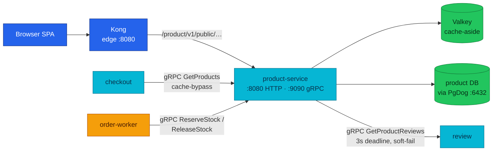

# Product Service API

Product turns a raw catalog table into the platform's price and inventory
authority: browsing reads come from a Valkey cache-aside layer, checkout money
reads bypass that cache for the real row, and the order saga reserves stock
through an idempotent ledger.

| Dimension | Value | Status |
|-----------|-------|--------|
| **Deployment** | local-stack + cluster | Implemented |
| **HTTP** | public (+ one internal route, never at the edge) · `:8080` · Kong `/product/v1/public/` (local-stack: bare `/product/` — [divergence](#http-api)) | Partial |
| **gRPC server** | `GetProducts`, `ReserveStock`, `ReleaseStock` · `:9090` | Implemented |
| **gRPC client** | review (`ReviewService/GetProductReviews`) | Implemented |
| **Worker** | None | None |
| **Temporal** | Participant (gRPC) · [workflows.md#order-fulfillment](./workflows.md#order-fulfillment) | Implemented |
| **Technical debt** | None | None |

| Attribute | Value | RFC / ADR |
|-----------|-------|-----------|
| **Repository** | [`duynhlab/product-service`](https://github.com/duynhlab/product-service) | — |
| **Owns** | Products, categories, current prices, stock quantities, stock-reservation ledger | — |
| **Database** | `product` on `product-db` (CNPG) via PgDog `pgdog-product.product:6432` | — |
| **Design record** | — | [RFC-0003](../proposals/rfc/RFC-0003/) — inventory ownership and stock semantics |

## Temporal participation

| Field | Value |
|-------|-------|
| **Role** | Participant (gRPC) |
| **Workflow** | `OrderFulfillmentWorkflow` (owned by order) |
| **This service's steps** | `ReserveStock`, `ReleaseStock` (compensation) |
| **Idempotency** | `reservation_id` = order id |
| **Deep dive** | [workflows.md](./workflows.md#order-fulfillment) · [temporal-order-fulfillment.md](./temporal-order-fulfillment.md) |

## Why it exists

Three different consumers need three different answers from the same catalog
row, and product exists to give each the right one:

1. **Browsers need fast, tolerant reads.** The catalog list and product page
   are the hottest paths on the platform; they can tolerate minutes of
   staleness but not a thundering herd on the database. Cache-aside with
   Valkey serves them.
2. **Checkout needs the truth at the money moment.** Cart stores the price at
   *add-to-cart* time; checkout re-validates against product before an order
   is accepted (ADR-020). That read must never come from a cache, so the gRPC
   `GetProducts` path deliberately skips Valkey.
3. **The order saga needs inventory that survives retries.** Temporal
   activities retry; a naive `UPDATE stock = stock - n` would double-decrement.
   The reservation ledger makes `ReserveStock`/`ReleaseStock` idempotent per
   `reservation_id` (RFC-0003).

Product is therefore the single source of truth for "what does it cost right
now" and "how many are left" — cart and checkout only hold snapshots.

## Architecture



Nothing dials product's HTTP surface east-west; all in-network consumers
(checkout, order-worker) use gRPC on `:9090`, fenced by NetworkPolicy
(the gRPC surface is unauthenticated by design — see
[api.md § Security](./api.md#security)).

## Data model

| Table | Purpose | Key constraints |
|-------|---------|-----------------|
| `products` | Catalog rows | `name` unique; `price DECIMAL(10,2) CHECK (price >= 0)`; `stock_quantity INTEGER CHECK (stock_quantity >= 0)` |
| `categories` | Category names | `name` unique |
| `stock_reservations` | Saga reservation ledger | PK `(reservation_id, product_id)`; `quantity > 0`; `status IN ('reserved','released')` |

Money units differ by transport on purpose:

- **HTTP catalog** — decimal major units (`89.99`), a pre-existing browser
  contract.
- **gRPC `GetProducts`** — `int64` minor units (`price_minor: 8999`).
  Conversion happens exactly once, at the gRPC transport boundary
  (`math.Round(price * 100)`), so no downstream service ever re-derives cents
  from a float.

The `stock_quantity >= 0` CHECK is the database-level backstop: even a bug in
the guarded decrement cannot oversell below zero.

## HTTP API

| Method | Path | Audience | Purpose |
|--------|------|----------|---------|
| `GET` | `/product/v1/public/products` | Public | Paginated catalog with category, search, sort, order filters |
| `GET` | `/product/v1/public/products/:id` | Public | Get one product |
| `GET` | `/product/v1/public/products/:id/details` | Public | Aggregate product + stock + reviews + summary + related products |
| `POST` | `/product/v1/internal/products` | Internal | Create a product (admin/seed) — **never exposed at either edge**; NetworkPolicy is the fence |

Edge routing divergence (known, documented in
[api.md § Edge exposure](./api.md#edge-exposure)): the
cluster ingress exposes exactly `/product/v1/public/`, while local-stack Kong
routes the bare prefix `/product/`. Service paths are identical — Variant A
pass-through, `strip_path: false`.

### Product shape

```json
{
  "id": "1",
  "name": "Mechanical Keyboard",
  "price": 89.99,
  "description": "Hot-swappable keyboard",
  "category": "electronics",
  "stock_quantity": 25
}
```

The list endpoint uses the shared pagination envelope
([api.md § List pagination](./api.md#list-pagination)) with one local
divergence: the request parameter is `limit` (not `page_size`); the envelope
echoes the effective value back as `page_size`. Sort fields are allowlisted
before SQL construction — an unknown `sort` falls back to `created_at`, so no
user input ever reaches the `ORDER BY` clause raw.

### Product-details aggregation

```json
{
  "product": { "id": "1", "name": "Mechanical Keyboard", "price": 89.99 },
  "stock": { "available": true, "quantity": 25 },
  "reviews": [],
  "reviews_summary": { "total": 0, "average_rating": 0 },
  "related_products": []
}
```

Reviews and related products are soft-fail enrichments. A review-service
outage does not turn a valid product page into a `5xx`; product returns an
empty list and a zero summary (see
[api.md § Aggregation rules](./api.md#aggregation-rules)).

## gRPC API

Canonical contract: `pkg/proto/product/v1/product.proto`. Server on `:9090`
(single multi-port Service; clients dial
`dns:///product.product.svc.cluster.local:9090` — see
[api.md § gRPC runtime model](./api.md#grpc-runtime-model)).

| RPC | Request → Response | Saga | Notes |
|-----|--------------------|------|-------|
| `GetProducts` | `product_ids[]` → products with `price_minor` (int64) + `available_qty` | — | Checkout re-validation read. **Cache-bypass by design.** Unknown ids are omitted, not errored; batch capped at 200 ids (`InvalidArgument` above) |
| `ReserveStock` | `reservation_id` + items → ok | step | Atomically reserves all order lines or none. Idempotent by `reservation_id`; insufficient stock → `FailedPrecondition` |
| `ReleaseStock` | `reservation_id` → ok | compensation | Restores stock only for a `reserved` ledger entry; unknown or already-released id is an idempotent no-op |

Product is also a gRPC client:

| Dependency | RPC | Failure policy |
|------------|-----|----------------|
| review | `ReviewService/GetProductReviews` | 3-second deadline; soft-fail to `[]` + zero summary |

## Business rules & techniques

### Stock reservation semantics (the saga contract)

`ReserveStock` must be safe under Temporal activity retries and concurrent
orders. Four mechanisms, all in **one transaction**:

1. **Idempotency fast-path.** If any ledger row already exists for the
   `reservation_id`, the call commits immediately as a no-op — a retried
   activity can never double-decrement.
2. **Guarded decrement.** Each line runs
   `UPDATE products SET stock_quantity = stock_quantity - $1 WHERE id = $2 AND stock_quantity >= $1`.
   Zero rows affected means missing product or insufficient stock →
   `FailedPrecondition`, and the transaction rolls back — **all lines reserve
   or none do**.
3. **Ledger in the same transaction.** Every decrement inserts a
   `stock_reservations` row keyed `(reservation_id, product_id)`; the PK also
   settles a racing duplicate call.
4. **Compensation reads the ledger, not the request.** `ReleaseStock` selects
   the `reserved` rows `FOR UPDATE`, restores exactly the recorded quantities,
   and flips them to `released` — a retried compensation cannot
   double-restore, and releasing an unknown reservation is a clean no-op.

The window between checkout's availability *check* (`GetProducts`) and the
saga's *reserve* is a named, accepted TOCTOU tradeoff (RFC-0015): the reserve
step is the gate, and a `FailedPrecondition` there fails the saga into
compensation rather than overselling.

### Cache-aside with Valkey (the read path)

Pattern theory and full sequence diagrams live in
[Application caching](./caching.md); the product-specific policy:

| Read | Cached | Default TTL | Invalidation |
|------|--------|-------------|--------------|
| Product list (`product:list:*`) | Yes | 5 min (`CACHE_TTL_PRODUCT_LIST`) | All list keys busted on product create; stock changes left to TTL expiry (deliberate — no churn on every reservation) |
| Single product (`product:{id}`) | Yes | 10 min (`CACHE_TTL_PRODUCT_DETAIL`) | **No hook today** — stale up to TTL if another service mutates product rows (e.g. stock via saga); [RFC-0004](../proposals/rfc/RFC-0004/) targets cache-bust on reserve/release |
| `/details` aggregation | Product row only | — | Reviews and related products are fetched fresh each call; only the underlying `product:{id}` entry is cached |
| gRPC `GetProducts` | **Never** | — | The money path reads the real DB row (ADR-020) |

Three hardening details worth stealing:

- **TTL jitter.** Every `SET` adds a random 0–10% to the TTL so keys written
  together do not expire together (no synchronized-expiry stampede).
- **Stampede lock.** A single-product miss takes a `SETNX` lock
  (`lock:product:{id}`, 5s TTL) tagged with a random token; only the lock
  winner hits Postgres, and release is compare-and-delete so a fetch that
  overran its lock TTL cannot delete a successor's lock.
- **Fail-open.** Cache errors count as misses (`product_cache_gets_total{result="error"}`)
  and fall through to Postgres; `CACHE_ENABLED=false` disables the layer
  entirely with no code path change.

### Aggregation without coupling

`/details` composes four sources (product, related products, reviews,
summary) but only the product row can fail the request. Related products and
reviews are best-effort; the review call is bounded by an explicit 3s
context deadline on top of the `pkg/grpcx` default.

## Callers & dependencies

| Direction | Peer | Transport | Purpose |
|-----------|------|-----------|---------|
| Inbound | Browser SPA via Kong | HTTP | Catalog browsing, product page |
| Inbound | checkout | gRPC `GetProducts` | Price/availability re-validation at session create + confirm ([checkout.md](./checkout.md)) |
| Inbound | order-worker | gRPC `ReserveStock` / `ReleaseStock` | Saga stock step + compensation ([temporal-order-fulfillment.md](./temporal-order-fulfillment.md)) |
| Outbound | review | gRPC `GetProductReviews` | Product-details enrichment ([review.md](./review.md)) |
| Outbound | product DB via PgDog | Postgres | All persistence |
| Outbound | Valkey | RESP | Cache-aside layer |

Platform-wide call graph: [api.md § Current east-west call graph](./api.md#current-east-west-call-graph).

## Known gaps

- **None** classed as technical debt — no legacy routes, no planned removals.
- gRPC east-west mTLS is **Planned** platform-wide (RFC-0020 research);
  today the `:9090` surface is fenced by NetworkPolicy only.
- The check-then-reserve TOCTOU window (checkout `GetProducts` vs saga
  `ReserveStock`) is an accepted design tradeoff, not a gap to fix.

## Operations

- **Ports:** HTTP + probes on `:8080` (`PORT`), gRPC on `:9090` (`GRPC_PORT`).
- **Key env:** `DB_*` (PgDog `pgdog-product.product:6432` in-cluster;
  migrations run against `product-db-rw` directly), `CACHE_ENABLED`,
  `CACHE_HOST`/`CACHE_PORT`/`CACHE_PASSWORD`/`CACHE_DB`,
  `CACHE_TTL_PRODUCT_LIST` (5m), `CACHE_TTL_PRODUCT_DETAIL` (10m),
  `REVIEW_GRPC_ADDR` (`dns:///review.review.svc.cluster.local:9090`).
- **Cluster:** RSIP [`kubernetes/apps/services/product.yaml`](../../kubernetes/apps/services/product.yaml)
  (domain `catalog`); NetworkPolicy admits Kong→`:8080` and
  checkout + order-worker→`:9090`.
- **Signals:** `product_stock_reservations_total{result}`
  (`reserved` / `insufficient_stock` / `error`) — the saga stock-step health
  in one counter — and `product_cache_gets_total{result}`
  (`hit` / `miss` / `error`) — is the cache earning its keep? Traces, RED
  metrics, and logs ride the standard obsx OTLP pipeline (RFC-0017).
- **Smoke tests:**

```bash
# Catalog via Kong (local-stack)
curl -s http://localhost:8080/product/v1/public/products?limit=5 | jq .items[0]
curl -s http://localhost:8080/product/v1/public/products/1/details | jq .reviews_summary

# gRPC from inside the network (no edge exposure)
grpcurl -plaintext -d '{"product_ids":["1","2"]}' \
  product.product.svc.cluster.local:9090 product.v1.ProductService/GetProducts
```

## Code map

Paths in [`duynhlab/product-service`](https://github.com/duynhlab/product-service). Transport peers call `logic/v1`; logic calls `core` only ([api.md § Inside Each Service](./api.md#inside-each-service)).

| Layer | Path | Notes |
|-------|------|-------|
| **Transport** | `internal/web/v1/handler.go` | HTTP handlers |
| | `internal/web/v1/review_client.go` | Review gRPC client (3s deadline) |
| | `internal/grpc/v1/server.go` | gRPC server (status-code mapping) |
| **logic** | `internal/logic/v1/service.go` | Catalog + inventory logic, cache invalidation |
| | `internal/logic/v1/details.go` | Details aggregation |
| | `internal/logic/v1/metrics.go` | Business metrics |
| **core** | `internal/core/cache/product_cache.go` | Cache-aside, jitter, stampede lock |
| | `internal/core/repository/postgres_product_repository.go` | Repository (guarded decrement, ledger) |
| **Platform** | `config/config.go` | Config (TTLs, addresses) |
| | `db/migrations/sql/000004_stock_reservations.up.sql` | Reservation ledger migration |
| | `pkg/proto/product/v1/product.proto` | Proto contract |

## References

- [api.md](./api.md) — shared HTTP/gRPC rules, error envelope, pagination, gRPC runtime model
- [workflows.md](./workflows.md) — Temporal workflow registry
- [Service contracts](./README.md#service-contracts)
- [temporal-order-fulfillment.md](./temporal-order-fulfillment.md) — saga deep dive
- [checkout.md](./checkout.md) · [review.md](./review.md) — dependency contracts
- [Application caching](./caching.md) — cache-aside pattern theory
- [Caching (platform)](../caching/README.md) — Valkey deployment and ops
- [RFC-0003](../proposals/rfc/RFC-0003/) — inventory ownership and stock semantics

_Last updated: 2026-07-21_
