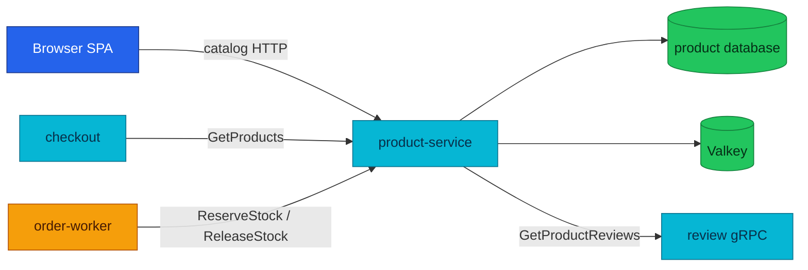

# Product Service API

Product owns the catalog, current price, availability, and inventory reservations.

| Attribute | Value |
|---|---|
| **Status** | Implemented; runs in local-stack and the cluster |
| **Repository** | [`duynhlab/product-service`](https://github.com/duynhlab/product-service) |
| **Owns** | Products, current prices, stock, and reservation ledger |
| **Cache** | Valkey cache-aside for read-heavy HTTP paths |
| **HTTP** | Public catalog plus an internal create route on `:8080` |
| **gRPC** | Product server on `:9090`; Review client for product-details aggregation |

## Overview

Product is the price authority at checkout time. Cart may retain a denormalized
display price, but checkout asks Product for a fresh batch before accepting an
order. The same service also owns stock reservations used by the fulfillment
Saga.



## HTTP API

| Method | Path | Audience | Purpose |
|---|---|---|---|
| `GET` | `/product/v1/public/products` | Public | Paginated catalog with filters and sorting |
| `GET` | `/product/v1/public/products/:id` | Public | Get one product |
| `GET` | `/product/v1/public/products/:id/details` | Public | Aggregate product, stock, reviews, summary, and related products |
| `POST` | `/product/v1/internal/products` | Internal | Create a product for admin or seed workflows |

### Product shape

```json
{
  "id": "1",
  "name": "Mechanical Keyboard",
  "price": 89.99,
  "description": "Hot-swappable keyboard",
  "category": "electronics",
  "stock_quantity": 25
}
```

The list endpoint uses the shared pagination envelope. It accepts `page` and
`limit` (the envelope echoes the limit back as `pageSize`), plus
service-defined category, search, sort, and order filters. Sort fields are allowlisted before SQL construction.

### Product-details aggregation

```json
{
  "product": { "id": "1", "name": "Mechanical Keyboard", "price": 89.99 },
  "stock": { "available": true, "quantity": 25 },
  "reviews": [],
  "reviews_summary": { "total": 0, "average_rating": 0 },
  "related_products": []
}
```

Reviews and related products are soft-fail enrichments. A Review outage does
not turn a valid product page into a `5xx`; Product returns an empty list and a
zero summary.

## gRPC API

The canonical protobuf contract lives in `pkg/proto/product/v1/product.proto`.

| RPC | Caller | Purpose | Retry behavior |
|---|---|---|---|
| `GetProducts` | Checkout | Batch read current price and available quantity | Read-only; unknown IDs are omitted |
| `ReserveStock` | Order worker | Atomically reserve all order lines | Idempotent by `reservation_id`; insufficient stock is `FailedPrecondition` |
| `ReleaseStock` | Order worker | Compensate a reservation | Idempotent when unknown or already released |

`GetProducts` returns money as `int64` minor units even though the HTTP catalog
uses decimal major units. Conversion happens once at the transport boundary.

Product is also a gRPC client:

| Dependency | RPC | Failure policy |
|---|---|---|
| Review | `ReviewService/GetProductReviews` | Three-second deadline; soft-fail to `[]` |

## Cache behavior

| Read | Default TTL | Notes |
|---|---|---|
| Product list | 5 minutes | List keys are invalidated after product creation |
| Single product/details | 10 minutes | Stampede protection uses a short SETNX lock |
| Checkout `GetProducts` | No cache | Deliberately bypasses Valkey for authoritative re-validation |

## Operations

HTTP probes stay on `:8080`; the internal gRPC server listens on `:9090`.
HTTP, gRPC, and runtime metrics export over OTLP. The cluster renders a headless `product-grpc` Service so clients can
use `dns:///` with client-side round-robin.

## References

- [Shared API and gRPC conventions](api.md)
- [Review service](review.md)
- [Checkout service](checkout.md)
- [Order-fulfillment Saga](temporal-order-fulfillment.md)
- [Caching](../caching/caching.md)

_Last updated: 2026-07-14_
