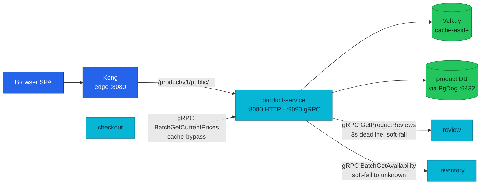

# Product Service API

Product turns a raw catalog table into the platform's price authority: browsing
reads come from a Valkey cache-aside layer and checkout money reads bypass that
cache for the real row. **Stock is no longer its business** — RFC-0021 moved the
authority to inventory-service, and phase 4 finished the job: the stock RPCs, the
read-contract fields, and the schema itself are all gone. The product page shows
availability, but it *asks inventory* for it.

| Dimension | Value | Status |
|-----------|-------|--------|
| **Deployment** | local-stack + cluster | Implemented |
| **HTTP** | public (+ one internal route, never at the edge) · `:8080` · Kong `/product/v1/public/` (local-stack: bare `/product/` — [divergence](#http-api)) | Partial |
| **gRPC server** | `BatchGetCurrentPrices` · `:9090` — the only RPC. `GetProducts`, `ReserveStock`, `ReleaseStock` were **removed** in RFC-0021 P4 | Implemented |
| **gRPC client** | review (`ReviewService/GetProductReviews`), inventory (`InventoryService/BatchGetAvailability`) | Implemented |
| **Worker** | None | None |
| **Temporal** | Participant (gRPC) · [workflows.md#order-fulfillment](./workflows.md#order-fulfillment) | Implemented |
| **Technical debt** | None | None |

| Attribute | Value | RFC / ADR |
|-----------|-------|-----------|
| **Repository** | [`duynhlab/product-service`](https://github.com/duynhlab/product-service) | — |
| **Owns** | Products, categories, current prices | — |
| **No longer owns** | Stock — **removed, not just unused**. `products.stock_quantity` and `stock_reservations` were dropped by migration `000006` (product 1.10.0) after being frozen at the RFC-0021 W7 write cutover (2026-07-30). Inventory-service is the authority ([inventory.md](./inventory.md)) | Removed |
| **Database** | `product` on `product-db` (CNPG) via PgDog `pgdog-product.product:6432` | — |
| **Design record** | — | [RFC-0003](../proposals/rfc/RFC-0003/) (superseded) → [RFC-0021](../proposals/rfc/RFC-0021/) — inventory extraction program |

## Temporal participation

| Field | Value |
|-------|-------|
| **Role** | **Former** participant (gRPC) — RFC-0021 P4 removed the saga branch that called it |
| **Workflow** | `OrderFulfillmentWorkflow` (owned by order) |
| **This service's steps** | None. Historically `ReserveStock` + `ReleaseStock`; the saga now reserves at inventory-service |
| **Idempotency** | `reservation_id` = order id (historical) |
| **Deep dive** | [workflows.md](./workflows.md#order-fulfillment) · [temporal.md](./temporal.md) |

## Why it exists

Three different consumers need three different answers from the same catalog
row, and product exists to give each the right one:

1. **Browsers need fast, tolerant reads.** The catalog list and product page
   are the hottest paths on the platform; they can tolerate minutes of
   staleness but not a thundering herd on the database. Cache-aside with
   Valkey serves them.
2. **Checkout needs the truth at the money moment.** Cart stores the price at
   *add-to-cart* time; checkout re-validates against product before an order
   is accepted (ADR-020). That read must never come from a cache, so the gRPC
   `BatchGetCurrentPrices` path deliberately skips Valkey.

Product is therefore the single source of truth for **"what does it cost right
now"** — cart and checkout only hold snapshots. It is *not* the source of truth
for "how many are left": that was RFC-0003's model and RFC-0021 moved it to
inventory-service, ledger and all.

## Architecture


```mermaid
flowchart LR
    SPA["Browser SPA"] --> Kong["Kong<br/>edge :8080"]
    Kong -->|"/product/v1/public/…"| Product["product-service<br/>:8080 HTTP · :9090 gRPC"]
    Product --> Cache[("Valkey<br/>cache-aside")]
    Product --> DB[("product DB<br/>via PgDog :6432")]
    Product -->|"gRPC GetProductReviews<br/>3s deadline, soft-fail"| Review[review]
    Product -->|"gRPC BatchGetAvailability<br/>soft-fail to unknown"| Inventory[inventory]
    Checkout[checkout] -->|"gRPC BatchGetCurrentPrices<br/>cache-bypass"| Product

    classDef edge fill:#2563eb,color:#fff,stroke:#1e3a8a;
    classDef service fill:#06b6d4,color:#082f49,stroke:#0e7490;
    classDef data fill:#22c55e,color:#052e16,stroke:#15803d;
    class SPA,Kong edge;
    class Product,Review,Checkout,Inventory service;
    class DB,Cache data;
```

Nothing dials product's HTTP surface east-west; the one in-network consumer
(checkout) uses gRPC on `:9090`, fenced by NetworkPolicy
(the gRPC surface is unauthenticated by design — see
[api.md § Security](./api.md#security)).

## Data model

| Table | Purpose | Key constraints |
|-------|---------|-----------------|
| `products` | Catalog rows | `name` unique; `price DECIMAL(10,2) CHECK (price >= 0)` |
| `categories` | Category names | `name` unique |

There is no stock table and no stock column. `stock_quantity` and the
`stock_reservations` ledger were dropped by migration `000006`; the paired
down-migration restores their **shape** for a code rollback, never their values
(the pre-migration backup is the data rollback). Historical model:
[inventory.md](./inventory.md).

Money units differ by transport on purpose:

- **HTTP catalog** — decimal major units (`89.99`), a pre-existing browser
  contract.
- **gRPC `BatchGetCurrentPrices`** — `int64` minor units (`price_minor: 8999`).
  Conversion happens exactly once, at the gRPC transport boundary
  (`math.Round(price * 100)`), so no downstream service ever re-derives cents
  from a float.

## HTTP API

| Method | Path | Audience | Purpose |
|--------|------|----------|---------|
| `GET` | `/product/v1/public/products` | Public | Paginated catalog with category, search, sort, order filters |
| `GET` | `/product/v1/public/products/:id` | Public | Get one product |
| `GET` | `/product/v1/public/products/:id/details` | Public | Aggregate product + inventory-sourced availability + reviews + summary + related products |
| `POST` | `/product/v1/internal/products` | Internal | Create a product (admin/seed) — **never exposed at either edge**; NetworkPolicy is the fence |

Edge routing divergence (known, documented in
[api.md § Edge exposure](./api.md#edge-exposure)): the
cluster ingress exposes exactly `/product/v1/public/`, while local-stack Kong
routes the bare prefix `/product/`. Service paths are identical — Variant A
pass-through, `strip_path: false`.

### Product shape

```json
{
  "id": "1",
  "name": "Mechanical Keyboard",
  "price": 89.99,
  "description": "Hot-swappable keyboard",
  "category": "electronics"
}
```

The list endpoint uses the shared pagination envelope
([api.md § List pagination](./api.md#list-pagination)) with one local
divergence: the request parameter is `limit` (not `page_size`); the envelope
echoes the effective value back as `page_size`. Sort fields are allowlisted
before SQL construction — an unknown `sort` falls back to `created_at`, so no
user input ever reaches the `ORDER BY` clause raw.

### Product-details aggregation

```json
{
  "product": { "id": "1", "name": "Mechanical Keyboard", "price": 89.99 },
  "availability": { "status": "in_stock", "available_to_promise": 49 },
  "reviews": [],
  "reviews_summary": { "total": 0, "average_rating": 0 },
  "related_products": []
}
```

`availability` is **inventory-service's answer**, fetched over gRPC
(`inventory.v1/BatchGetAvailability`) and surfaced as an enrichment, not owned
here. `status` is one of `in_stock | low_stock | out_of_stock | unknown`, and
`available_to_promise` is **omitted** rather than zeroed on an `unknown` answer —
so a missing figure can never be misread as a real zero.

Reviews, related products, and availability are all soft-fail enrichments. A
review-service outage does not turn a valid product page into a `5xx`; product
returns an empty list and a zero summary. An unreachable inventory degrades to
`{"status":"unknown"}` and the page still renders (see
[api.md § Aggregation rules](./api.md#aggregation-rules)). The SPA treats
`unknown` as **purchasable**: adding to a cart is not a reservation, and checkout
is where availability is enforced — fail-closed, with a retryable 503.

## gRPC API

Canonical contract: `pkg/proto/product/v1/product.proto`. Server on `:9090`
(single multi-port Service; clients dial
`dns:///product.product.svc.cluster.local:9090` — see
[api.md § gRPC runtime model](./api.md#grpc-runtime-model)).

| RPC | Request → Response | Saga | Notes |
|-----|--------------------|------|-------|
| `BatchGetCurrentPrices` | `sku_ids[]` → `CurrentPrice{sku_id, name, price_minor (int64), currency, sellable}` | — | Checkout re-validation read, and the **only** RPC product serves. **Cache-bypass by design** — the money path reads the DB row. Unknown SKUs are omitted, not errored; batch capped at 200 ids (`InvalidArgument` above). Carries **no availability**: that is `inventory.v1`'s answer |

`ReserveStock`, `ReleaseStock`, and `GetProducts` are **gone** from the contract
(pkg v0.33.0 / v0.34.0, product 1.7.0 / 1.8.0) — not deprecated, removed. The
saga's stock steps are `inventory.v1` RPCs
([temporal.md](./temporal.md)).

Product is also a gRPC client:

| Dependency | RPC | Failure policy |
|------------|-----|----------------|
| review | `ReviewService/GetProductReviews` | 3-second deadline; soft-fail to `[]` + zero summary |

## Business rules & techniques

### Where the stock rules went

The reservation semantics product used to implement — idempotency by
`reservation_id`, the guarded `stock_quantity` decrement, the ledger written in
the same transaction, compensation reading the ledger rather than the request —
are **not** documented here any more, because product implements none of them.
They live at inventory-service, and the equivalents are stronger there (an
append-only movement ledger with `on_hand == SUM(on_hand_delta)` as an
invariant): [inventory.md](./inventory.md).

The check-then-reserve TOCTOU window survives the move as a named, accepted
tradeoff: availability checks are advisory, and `inventory.v1/Reserve` is the
correctness gate. Nothing about that changed when the authority moved — see
[Known gaps](#known-gaps).

### Cache-aside with Valkey (the read path)

Pattern theory and full sequence diagrams live in
[Application caching](./caching.md); the product-specific policy:

| Read | Cached | Default TTL | Invalidation |
|------|--------|-------------|--------------|
| Product list (`product:list:*`) | Yes | 5 min (`CACHE_TTL_PRODUCT_LIST`) | All list keys busted on product create; price edits left to TTL expiry |
| Single product (`product:{id}`) | Yes | 10 min (`CACHE_TTL_PRODUCT_DETAIL`) | **No hook today** — stale up to TTL after a catalog edit. No longer a stock concern: availability is fetched live from inventory on every `/details` call and is never cached |
| `/details` aggregation | Product row only | — | Reviews and related products are fetched fresh each call; only the underlying `product:{id}` entry is cached |
| gRPC `BatchGetCurrentPrices` | **Never** | — | The money path reads the real DB row (ADR-020) |

Three hardening details worth stealing:

- **TTL jitter.** Every `SET` adds a random 0–10% to the TTL so keys written
  together do not expire together (no synchronized-expiry stampede).
- **Stampede lock.** A single-product miss takes a `SETNX` lock
  (`lock:product:{id}`, 5s TTL) tagged with a random token; only the lock
  winner hits Postgres, and release is compare-and-delete so a fetch that
  overran its lock TTL cannot delete a successor's lock.
- **Fail-open.** Cache errors count as misses (`product_cache_gets_total{result="error"}`)
  and fall through to Postgres; `CACHE_ENABLED=false` disables the layer
  entirely with no code path change.

### Aggregation without coupling

`/details` composes five sources (product, related products, reviews, summary,
inventory availability) but only the product row can fail the request. Everything
else is best-effort; the review call is bounded by an explicit 3s context
deadline on top of the `pkg/grpcx` default, and an inventory failure resolves to
`status: unknown`.

## Callers & dependencies

| Direction | Peer | Transport | Purpose |
|-----------|------|-----------|---------|
| Inbound | Browser SPA via Kong | HTTP | Catalog browsing, product page |
| Inbound | checkout | gRPC `BatchGetCurrentPrices` | **Price** re-validation at session create + confirm; availability comes from inventory ([checkout.md](./checkout.md)) |
| ~~Inbound~~ | ~~order-worker~~ | ~~gRPC `ReserveStock` / `ReleaseStock`~~ | **Gone.** RFC-0021 P4 deleted the saga branch *and* the RPCs; order no longer dials product at all, and the NetworkPolicy allow **was withdrawn** on 2026-08-06 once the pre-P4 worker builds were shown to hold no pinned histories ([temporal.md](./temporal.md)) |
| Outbound | inventory | gRPC `BatchGetAvailability` | `/details` availability enrichment; soft-fail to `status: unknown` ([inventory.md](./inventory.md)) |
| Outbound | review | gRPC `GetProductReviews` | Product-details enrichment ([review.md](./review.md)) |
| Outbound | product DB via PgDog | Postgres | All persistence |
| Outbound | Valkey | RESP | Cache-aside layer |

Platform-wide call graph: [api.md § Current east-west call graph](./api.md#current-east-west-call-graph).

## Known gaps

- **Stock has fully left this service** —
  [RFC-0021](../proposals/rfc/RFC-0021/README.md) (supersedes RFC-0003) made
  inventory-service the sole authority via expand → migrate → contract, and
  phase 4 finished the contract step. There are no leftovers to warn about:
  the saga branch (order 1.13.0), the RPCs (pkg v0.33.0/v0.34.0, product
  1.7.0/1.8.0), the read-contract fields (1.8.0), and the schema plus the
  cross-service grant (migration `000006`, 1.10.0) are all gone. What remains
  is bookkeeping tracked in the RFC, not in this contract: retiring the
  migration-era alert rules and deleting the drained pre-P4 worker manifests.
- gRPC east-west mTLS is **Planned** platform-wide (RFC-0020 research);
  today the `:9090` surface is fenced by NetworkPolicy only.
- The check-then-reserve TOCTOU window was an accepted tradeoff under RFC-0003
  and the stance is unchanged now that the authority has moved: availability
  checks stay advisory, and `inventory.v1/Reserve` is the correctness gate.

## Operations

- **Ports:** HTTP + probes on `:8080` (`PORT`), gRPC on `:9090` (`GRPC_PORT`).
- **Key env:** `DB_*` (PgDog `pgdog-product.product:6432` in-cluster;
  migrations run against `product-db-rw` directly), `CACHE_ENABLED`,
  `CACHE_HOST`/`CACHE_PORT`/`CACHE_PASSWORD`/`CACHE_DB`,
  `CACHE_TTL_PRODUCT_LIST` (5m), `CACHE_TTL_PRODUCT_DETAIL` (10m),
  `REVIEW_GRPC_ADDR` (`dns:///review.review.svc.cluster.local:9090`),
  `INVENTORY_GRPC_ADDR` (`dns:///inventory.inventory.svc.cluster.local:9090` —
  set explicitly; the code default names a Service this cluster does not have).
- **Cluster:** RSIP [`kubernetes/apps/services/product.yaml`](../../kubernetes/apps/services/product.yaml)
  (domain `catalog`); NetworkPolicy admits Kong→`:8080` and checkout→`:9090`.
  The order-worker allow on `:9090` is withdrawn once the pre-P4 worker builds
  drain — order has no product client left to use it.
- **Signals:** `product_cache_gets_total{result}` (`hit` / `miss` / `error`) —
  is the cache earning its keep? `product_stock_reservations_total` is **gone**
  (removed with the RPCs in 1.7.0); a flatline on the RFC-0021 baseline
  dashboard panel is expected, not an outage. Traces, RED metrics, and logs
  ride the standard obsx OTLP pipeline (RFC-0017).
- **Smoke tests:**

```bash
# Catalog via Kong (local-stack)
curl -s http://localhost:8080/product/v1/public/products?limit=5 | jq .items[0]
curl -s http://localhost:8080/product/v1/public/products/1/details | jq .reviews_summary

# gRPC from inside the network (no edge exposure)
grpcurl -plaintext -d '{"sku_ids":["1","2"]}' \
  product.product.svc.cluster.local:9090 \
  product.v1.ProductService/BatchGetCurrentPrices
```

## Code map

Paths in [`duynhlab/product-service`](https://github.com/duynhlab/product-service). Transport peers call `logic/v1`; logic calls `core` only ([api.md § Inside Each Service](./api.md#inside-each-service)).

| Layer | Path | Notes |
|-------|------|-------|
| **Transport** | `internal/web/v1/handler.go` | HTTP handlers |
| | `internal/web/v1/review_client.go` | Review gRPC client (3s deadline) |
| | `internal/grpc/v1/server.go` | gRPC server (status-code mapping) |
| **logic** | `internal/logic/v1/service.go` | Catalog logic, cache invalidation |
| | `internal/logic/v1/details.go` | Details aggregation + availability enrichment |
| **core** | `internal/core/cache/product_cache.go` | Cache-aside, jitter, stampede lock |
| | `internal/core/repository/postgres_product_repository.go` | Repository (catalog reads, price lookups) |
| **Platform** | `config/config.go` | Config (TTLs, addresses) |
| | `db/migrations/sql/000006_drop_stock.{up,down}.sql` | Stock-schema removal; the down restores shape only |
| | `pkg/proto/product/v1/product.proto` | Proto contract |

## References

- [api.md](./api.md) — shared HTTP/gRPC rules, error envelope, pagination, gRPC runtime model
- [workflows.md](./workflows.md) — Temporal workflow registry
- [Service contracts](./README.md#service-contracts)
- [temporal.md](./temporal.md) — saga deep dive
- [checkout.md](./checkout.md) · [review.md](./review.md) — dependency contracts
- [Application caching](./caching.md) — cache-aside pattern theory
- [Caching (platform)](../caching/README.md) — Valkey deployment and ops
- [RFC-0003](../proposals/rfc/RFC-0003/) — inventory ownership and stock semantics

_Last updated: 2026-08-05_
