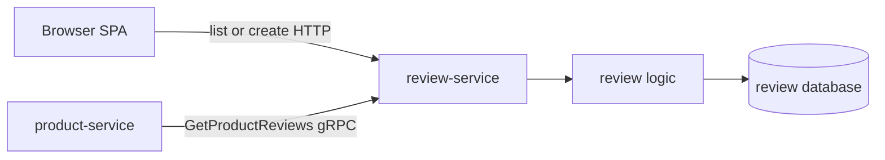

# Review Service API

Review stores one product review per user and supplies review data to Product.

| Attribute | Value |
|---|---|
| **Status** | Implemented; runs in local-stack and the cluster |
| **Repository** | [`duynhlab/review-service`](https://github.com/duynhlab/review-service) |
| **Owns** | Reviews and ratings |
| **HTTP** | Public list and private create on `:8080` |
| **gRPC** | `ReviewService/GetProductReviews` on `:9090` |
| **Callers** | Browser and Product |

## Overview

Browser clients can list and create reviews over HTTP. Product uses the gRPC
twin to build one product-details response without asking the SPA to orchestrate
multiple services.



## HTTP API

| Method | Path | Audience | Purpose |
|---|---|---|---|
| `GET` | `/review/v1/public/reviews?product_id=:id` | Public | Paginated reviews for one product |
| `POST` | `/review/v1/private/reviews` | Private | Create the authenticated user's review |

### List reviews

`product_id` is required. Pagination uses `page` and `page_size` from the shared
API convention.

```json
{
  "items": [
    {
      "id": "12",
      "product_id": "1",
      "user_id": "7",
      "rating": 5,
      "title": "Solid keyboard",
      "comment": "Good switches and build quality.",
      "created_at": "2026-07-13T09:00:00Z"
    }
  ],
  "page": 1,
  "page_size": 20,
  "total_items": 1,
  "total_pages": 1
}
```

### Create review

```json
{
  "product_id": "1",
  "rating": 5,
  "title": "Solid keyboard",
  "comment": "Good switches and build quality."
}
```

| Rule | Behavior |
|---|---|
| Identity | `user_id` in request JSON is ignored; JWT subject wins |
| Rating | Integer from 1 through 5 |
| Comment | Required |
| Duplicate | Database uniqueness on `(product_id, user_id)` maps to `409 CONFLICT` |

## gRPC API

| RPC | Caller | Request | Response behavior |
|---|---|---|---|
| `review.v1.ReviewService/GetProductReviews` | Product | `product_id` | Up to 10,000 reviews in one page (larger sets truncate with a server-side warning); no matches return an empty list |

The HTTP and gRPC adapters call the same logic layer. Product applies a
three-second deadline and soft-fails the enrichment to an empty list.

## Operations

HTTP probes remain on `:8080`; gRPC listens on the headless
`review-grpc:9090` Service. Both transports push trace-correlated RED metrics
over OTLP.

## References

- [Shared API and gRPC conventions](api.md)
- [Product service](product.md)
- [Microservices catalog](microservices.md)

_Last updated: 2026-07-13_
