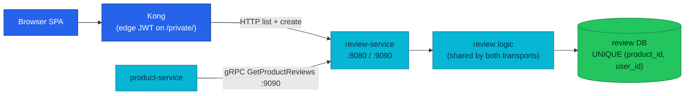

# Review Service API

Review turns a shopper's opinion into exactly one durable rating per user per
product, and serves that data to both the browser and product-service's
details aggregation.

| Dimension | Value |
|-----------|-------|
| **Local-stack** | Implemented |
| **Cluster** | Implemented |
| **HTTP** | public + private · `:8080` · Kong `/review/v1/public/` and `/review/v1/private/` (edge JWT on private) |
| **gRPC server** | `ReviewService/GetProductReviews` · `:9090` |
| **gRPC client** | None |
| **Worker** | None |
| **Temporal** | None · [workflows.md](./workflows.md) |
| **Technical debt** | None |

| | |
|---|---|
| **Repository** | [`duynhlab/review-service`](https://github.com/duynhlab/review-service) |
| **Owns** | Product reviews and star ratings (the only writer of the `reviews` table) |
| **Database** | `review` on `platform-db` (via `platform-db-pooler-rw.platform:5432`) |

## Temporal participation

None — this service does not start or participate in Temporal workflows.
See [workflows.md](./workflows.md).

## Why it exists

Product pages need social proof, and the catalog needs it without turning the
SPA into an orchestrator. Two consumers, two transports, one logic layer:

- **Browser** lists reviews for a product (public) and submits the
  authenticated user's own review (private) over HTTP through Kong.
- **product-service** builds one product-details response server-side; it
  fetches reviews over the gRPC twin instead of asking the SPA to fan out to
  multiple services ([aggregation rules](./api.md#aggregation-rules)).

The service also owns one business invariant end to end: **one review per
user per product**, enforced at the database (unique constraint) rather than
only in application code — see [Business rules](#business-rules--techniques).

## Architecture

The diagram answers one question: who reaches review, over which transport,
and where the duplicate gate lives.



The HTTP and gRPC adapters are thin transports over the same
`internal/logic/v1` service, so both paths return identical data and share
one validation surface. Nothing except Kong and product may dial review —
the namespace NetworkPolicy admits only those two callers on `8080`/`9090`.

## Data model

One table; migrations are embedded and applied by the `migrate` subcommand
(init container in the cluster).

| Column | Type | Constraint |
|--------|------|-----------|
| `id` | `SERIAL` | primary key |
| `product_id` | `INTEGER NOT NULL` | references product catalog by id — cross-service, **no FK** |
| `user_id` | `INTEGER NOT NULL` | references auth users by id — cross-service, **no FK** |
| `rating` | `INTEGER` | `CHECK (rating >= 1 AND rating <= 5)` |
| `title` | `VARCHAR(255)` | optional |
| `comment` | `TEXT` | required by the API contract (DB allows NULL) |
| `created_at`, `updated_at` | `TIMESTAMP` | default `CURRENT_TIMESTAMP` |

- **Uniqueness:** `UNIQUE (product_id, user_id)` (`uq_reviews_product_user`,
  migration `000003`) — the database-level authority for "one review per user
  per product".
- **Indexes:** `product_id` (the list path), `user_id`, `rating`.
- Cross-service ids are stored without foreign keys because product and auth
  own their tables in different databases; referential trust is by contract.
- Demo reviews are seeded only by the explicit `seed` subcommand (dev-only;
  refused when `ENV` is production).

## HTTP API

Full canonical paths; shared conventions ([error envelope](./api.md#error-envelope),
[pagination](./api.md#list-pagination), [auth](./api.md#authentication)) apply.

| Method | Path | Audience | Purpose |
|--------|------|----------|---------|
| `GET` | `/review/v1/public/reviews?product_id=:id` | Public | Paginated reviews for one product, newest first |
| `POST` | `/review/v1/private/reviews` | Private | Create the authenticated user's review (edge JWT + local `pkg/authmw` verify) |

### List reviews

`GET /review/v1/public/reviews?product_id=1&page=1&page_size=20` —
`product_id` is required; `page`/`page_size` follow the
[shared pagination rules](./api.md#list-pagination) (defaults 1/20, max 100,
invalid values fall back to defaults).

```json
{
  "items": [
    {
      "id": "12",
      "product_id": "1",
      "user_id": "7",
      "rating": 5,
      "title": "Solid keyboard",
      "comment": "Good switches and build quality.",
      "created_at": "2026-07-13T09:00:00Z"
    }
  ],
  "page": 1,
  "page_size": 20,
  "total_items": 1,
  "total_pages": 1
}
```

### Create review

`POST /review/v1/private/reviews` — returns **201** with the created review.

```json
{
  "product_id": "1",
  "rating": 5,
  "title": "Solid keyboard",
  "comment": "Good switches and build quality."
}
```

| Rule | Behavior |
|------|----------|
| Identity | `user_id` in the request JSON is ignored; the JWT subject wins (`req.UserID = c.GetString("user_id")` after `pkg/authmw`) |
| Rating | Integer 1–5, checked three times: gin binding, logic layer, DB `CHECK` |
| Comment | Required (binding); `title` optional |
| Duplicate | One review per `(product_id, user_id)` → `409 CONFLICT` (see below) |

### Error matrix

| HTTP | Code | Trigger |
|------|------|---------|
| `400` | `VALIDATION_ERROR` | Missing `product_id` query param; invalid JSON body; rating outside 1–5; non-numeric `product_id`/`user_id` |
| `401` | `UNAUTHORIZED` | Missing/invalid JWT — rejected at the Kong edge or by in-service `pkg/authmw` |
| `409` | `CONFLICT` | The user already reviewed this product |
| `500` | `INTERNAL_ERROR` | Database or unexpected failure, no leaked internals |

## gRPC API

Proto: `pkg/proto/review/v1/review.proto`.

| RPC | Request → Response | Saga | Notes |
|-----|--------------------|------|-------|
| `review.v1.ReviewService/GetProductReviews` | `product_id` → all reviews for the product | — | Called by product-service's details aggregation. `InvalidArgument` on a non-numeric id; empty list on no matches |

Behavioral details worth knowing:

- **No pagination in the proto.** The server asks the shared logic for one
  large page (cap **10,000**, offset 0). A response that fills the cap is
  logged as a truncation warning and counted in
  `grpc_reviews_truncated_total` — a full page is indistinguishable from a
  truncated one, so the counter deliberately over-counts by that edge case.
- **The caller soft-fails.** product-service bounds the call with a
  3-second deadline and, on any error, continues with an empty review list
  (`reviews.fetch_failed` span attribute) — review being down degrades
  product details, it never breaks them.
- Server bootstrap is the shared `pkg/grpcx` (OTel interceptors, health,
  reflection); runtime model in [api.md](./api.md#grpc-runtime-model).
  Addressing: `dns:///review.review.svc.cluster.local:9090` — single
  multi-port Service (the old `review-grpc` headless twin was removed).
  gRPC mTLS is **Planned** (not deployed); NetworkPolicy is the current fence.

## Business rules & techniques

### One review per user per product — 23505 → 409

The invariant is enforced twice, and the second layer is the one that
actually holds under concurrency:

1. **Pre-check (fast path):** `CreateReview` first runs
   `GetReviewByProductAndUser`; an existing row answers `409` without
   touching the insert path. This covers the common double-submit and gives
   a cheap, race-free-in-practice rejection.
2. **Unique constraint (the authority):** two racing creates can both pass
   the pre-check. The loser's `INSERT` then trips `uq_reviews_product_user`;
   the repository detects PostgreSQL SQLSTATE **`23505`**
   (`unique_violation` via `pgconn.PgError`) and maps it to
   `domain.ErrDuplicateReview` instead of a generic 500.

Both paths converge on the same sentinel (`logicv1.ErrDuplicateReview`),
the same HTTP answer (`409 CONFLICT`, "Review already exists"), and the same
metric (`reviews_duplicate_rejected_total`). The lesson this service is the
platform's example of: a uniqueness invariant belongs in the database;
application pre-checks are UX, not correctness.

### Identity from the token, never the body

`CreateReviewRequest` has a `user_id` field for internal plumbing, but the
handler overwrites it with the verified JWT subject before any logic runs.
A client cannot review on behalf of another user.

### One logic layer, two transports

`ListReviews` serves both `GET /review/v1/public/reviews` and
`GetProductReviews` — same validation (`strconv.Atoi` on ids → invalid-input
sentinel), same repository, same ordering (`created_at DESC`). Transport
adapters only translate errors: sentinel → HTTP status on one side, sentinel
→ gRPC status code on the other.

## Callers & dependencies

| Direction | Peer | Transport | Notes |
|-----------|------|-----------|-------|
| Inbound | Browser SPA via Kong | HTTP `:8080` | Public list; private create behind edge JWT |
| Inbound | product-service | gRPC `:9090` | `GetProductReviews` for details aggregation; 3s deadline, soft-fail to `[]` |
| Outbound | `review` DB on `platform-db` | PostgreSQL | Via `platform-db-pooler-rw.platform:5432` |
| Outbound | auth JWKS | HTTP | `AUTH_JWKS_URL` — local RS256 verification (`pkg/authmw`); no runtime call to auth per request |

NetworkPolicy (`kubernetes/infra/configs/network-policies/review.yaml`):
default deny-all ingress; only the `kong` and `product` namespaces are
admitted, on ports `8080` and `9090`.

## Known gaps

None. Two accepted design limits, documented rather than scheduled for
removal: the gRPC response caps at 10,000 reviews per product (observable via
`grpc_reviews_truncated_total`), and reviews are write-once — no update or
delete route exists yet (the `ErrReviewNotFound`/`ErrUnauthorized` sentinels
are reserved for that future surface).

## Operations

- **Ports & probes:** HTTP `:8080` with `/health` (liveness) and `/ready`
  (readiness; flips false during graceful shutdown, then drains
  `READINESS_DRAIN_DELAY` seconds before the listener stops). gRPC `:9090`
  serves the standard health service via `pkg/grpcx`.
- **Key env:** `PORT` (8080), `GRPC_PORT` (9090), `DB_*`, `AUTH_JWKS_URL`,
  `JWT_ISSUER`, `JWT_AUDIENCE`, `LOG_LEVEL`, `TRACING_ENABLED`,
  `OTEL_COLLECTOR_ENDPOINT`, `SHUTDOWN_TIMEOUT`.
- **Lifecycle subcommands:** `migrate` (schema, every environment) and
  `seed` (demo data, dev-only — hard-refused in production).
- **Business metrics** (OTLP, RFC-0014 pipeline; RED metrics come from the
  shared middleware):

| Metric | Type | Answers |
|--------|------|---------|
| `reviews_rating` | histogram (buckets 1–5) | Star-rating distribution of new reviews |
| `reviews_duplicate_rejected_total` | counter | How often duplicates are rejected (pre-check + 23505 race combined) |
| `grpc_reviews_truncated_total` | counter | Are gRPC reads silently hitting the 10k page cap? |

- **Smoke test via Kong** (local-stack `:8080`; demo login `alice` /
  `password123` by username):

```bash
# Public list
curl 'http://localhost:8080/review/v1/public/reviews?product_id=1&page=1&page_size=5'

# Private create (JWT required)
curl -X POST http://localhost:8080/review/v1/private/reviews \
  -H "Authorization: Bearer $TOKEN" -H 'Content-Type: application/json' \
  -d '{"product_id":"1","rating":5,"title":"Great","comment":"Works well."}'

# gRPC (inside the cluster network; reflection is on)
grpcurl -plaintext -d '{"product_id":"1"}' \
  review.review.svc.cluster.local:9090 review.v1.ReviewService/GetProductReviews
```

## Code map

Verified against `duynhlab/review-service`:

| Layer | Repo path |
|-------|-----------|
| Entrypoint, routes, gRPC bootstrap, subcommands | `review-service/cmd/main.go` |
| HTTP handlers | `review-service/internal/web/v1/handler.go` |
| Business logic + sentinels + metrics | `review-service/internal/logic/v1/{service.go,errors.go,metrics.go}` |
| gRPC server (10k cap, truncation log) | `review-service/internal/grpc/v1/server.go` |
| Domain model + repository interface | `review-service/internal/core/domain/{review.go,repository.go}` |
| Repository (23505 mapping) | `review-service/internal/core/repository/review_repo.go` |
| Migrations (schema + unique constraint) | `review-service/db/migrations/sql/` |
| Dev-only seed | `review-service/db/seed/sql/` |
| Config (env parsing) | `review-service/config/config.go` |
| Proto | `pkg/proto/review/v1/review.proto` |

## References

- [api.md](./api.md) — shared URL model, auth, error envelope, pagination, gRPC runtime model
- [workflows.md](./workflows.md) — Temporal registry (review: None)
- [DEPLOYMENT-STATUS.md](./DEPLOYMENT-STATUS.md) — platform deployment rollup
- [product.md](./product.md) — the details aggregation that calls `GetProductReviews`
- [microservices.md](./microservices.md) — feature matrix

_Last updated: 2026-07-21_
