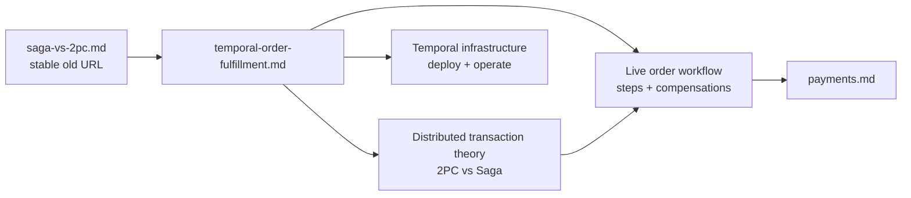

# Saga vs Two-Phase Commit (Compatibility Page)

The complete learning guide is now part of the live Temporal fulfillment document.

| Attribute | Value |
|-----------|-------|
| **Status** | Compatibility page |
| **Canonical guide** | [temporal-order-fulfillment.md](./temporal-order-fulfillment.md) |
| **Content preserved** | 2PC mechanics, blocking failure, Saga compensation, pivot, idempotency, tradeoffs, and decision aid |
| **Why merged** | Theory and the running implementation are easier to learn when kept together |
| **Removal policy** | Keep while ADRs, RFCs, and sibling repositories link here |

## Navigation Diagram

## Learning Path

| Question | Read |
|----------|------|
| Why can one SQL transaction not cover checkout? | [The Distributed Transaction Problem](./temporal-order-fulfillment.md#the-distributed-transaction-problem) |
| How do prepare and commit work in 2PC? | [How Two-Phase Commit Works](./temporal-order-fulfillment.md#how-two-phase-commit-works) |
| Why is 2PC rejected here? | [Why 2PC Does Not Fit This Platform](./temporal-order-fulfillment.md#why-2pc-does-not-fit-this-platform) |
| What is a compensating transaction? | [The Saga Pattern](./temporal-order-fulfillment.md#the-saga-pattern) |
| What do idempotency and pivot mean? | [Saga Properties](./temporal-order-fulfillment.md#saga-properties-compensation-idempotency-and-pivot) |
| What steps and compensations actually run? | [Current Order-Fulfillment Saga](./temporal-order-fulfillment.md#current-order-fulfillment-saga) |
| How do Saga and 2PC compare? | [2PC vs Saga Tradeoffs](./temporal-order-fulfillment.md#2pc-vs-saga-tradeoffs) |
| When is 2PC appropriate? | [When 2PC Is the Better Choice](./temporal-order-fulfillment.md#when-2pc-is-the-better-choice) |
| How is Temporal deployed and operated? | [Temporal Infrastructure](./temporal-order-fulfillment.md#temporal-infrastructure) |

## Short Summary

2PC coordinates an atomic decision across XA-capable participants, but it holds
resources while waiting and cannot enlist the external payment provider. The
platform therefore uses an orchestrated Saga: each service commits locally,
Temporal records progress, and completed pre-pivot steps are semantically
compensated in reverse if a later step fails.

The theory was not discarded. It was moved beside the production workflow so a
reader can connect each concept directly to `AuthorizePayment`,
`ReserveStock`, `CreateShipment`, `CapturePayment`, and `ConfirmOrder`.

## References

- [Temporal order-fulfillment Saga](./temporal-order-fulfillment.md)
- [Payments](./payments.md)
- [ADR-001](../proposals/adr/ADR-001-adopt-temporal-for-order-fulfillment/)
- [ADR-009](../proposals/adr/ADR-009-saga-authorize-early-capture-late/)

_Last updated: 2026-07-13_
