# Saga vs Two-Phase Commit

How this platform keeps a multi-service business action (checkout) consistent
*without* a distributed transaction — why two-phase commit is the textbook answer
that doesn't fit microservices, and why a **saga** (local transactions +
compensations, orchestrated by Temporal) is what we run instead.

| | |
|---|---|
| **Status** | Reference / learning (concept doc) |
| **Scope** | Platform-wide — order, product, shipping, payment |
| **Applies to** | The order-fulfillment saga (RFC-0010 P3) |
| **Decisions** | [ADR-001](../proposals/adr/ADR-001-adopt-temporal-for-order-fulfillment/) (saga over alternatives) · [ADR-009](../proposals/adr/ADR-009-saga-authorize-early-capture-late/) (authorize-early/capture-late) · [ADR-010](../proposals/adr/ADR-010-shared-idempotency-library/) (shared idempotency) |
| **See also** | [temporal-order-fulfillment.md](./temporal-order-fulfillment.md) (the live saga), [payments.md](./payments.md), [RFC-0010](../proposals/rfc/RFC-0010/) |

## TL;DR

One checkout touches **four independent service databases** (order, product/stock,
shipping, payment) plus an **external card provider**. There is no shared
database, so you cannot wrap the whole thing in one ACID transaction. The classic
way to make writes across several resources atomic is **two-phase commit (2PC)** —
but it needs a blocking coordinator and XA-capable resources, neither of which
holds across microservices or a third-party payment API. So we use a **saga**: a
sequence of *local* transactions where each step has a *compensating* step that
semantically undoes it if a later step fails. The saga trades **immediate
consistency for availability** and accepts **eventual consistency** — the industry-
standard tradeoff for distributed business transactions.

## 1. The problem — no shared transaction

A single ACID transaction gives you all-or-nothing across everything it touches,
but only *within one database*. Our checkout spans separate databases owned by
separate services (deliberate — each service owns its data):

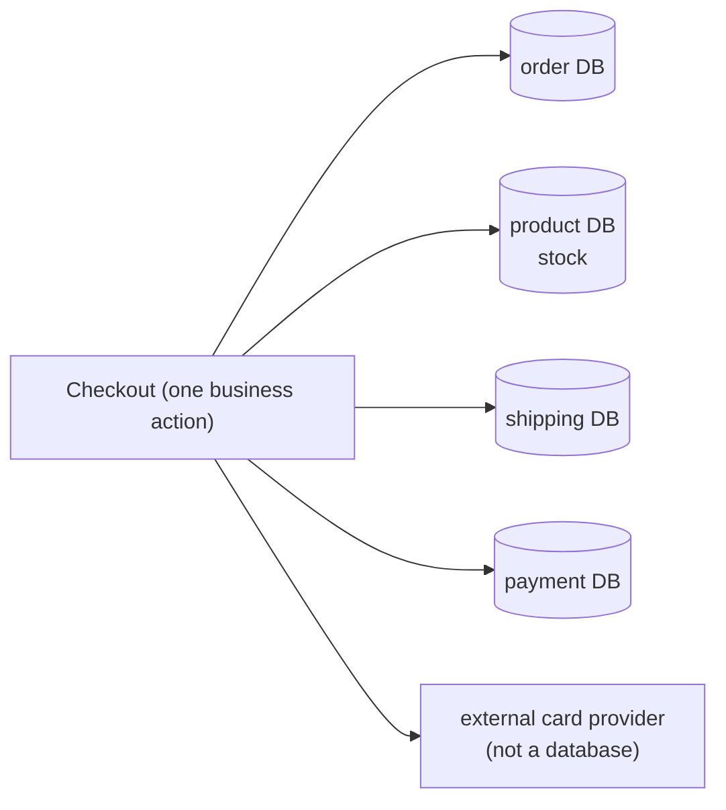

`BEGIN … COMMIT` in the order database can't roll back a stock reservation in the
product database or a charge at the card provider. We need atomicity *across*
resources — which is exactly what 2PC was designed for.

## 2. Two-phase commit (2PC / XA)

2PC makes a write atomic across multiple resources using a **coordinator** and two
rounds. Round 1 (**prepare**): the coordinator asks every participant "can you
commit?"; each does the work, locks the rows, writes to its log, and votes
yes/no — but does **not** commit yet. Round 2 (**commit**): if *all* voted yes, the
coordinator tells everyone to commit; if *any* voted no (or timed out), it tells
everyone to abort.

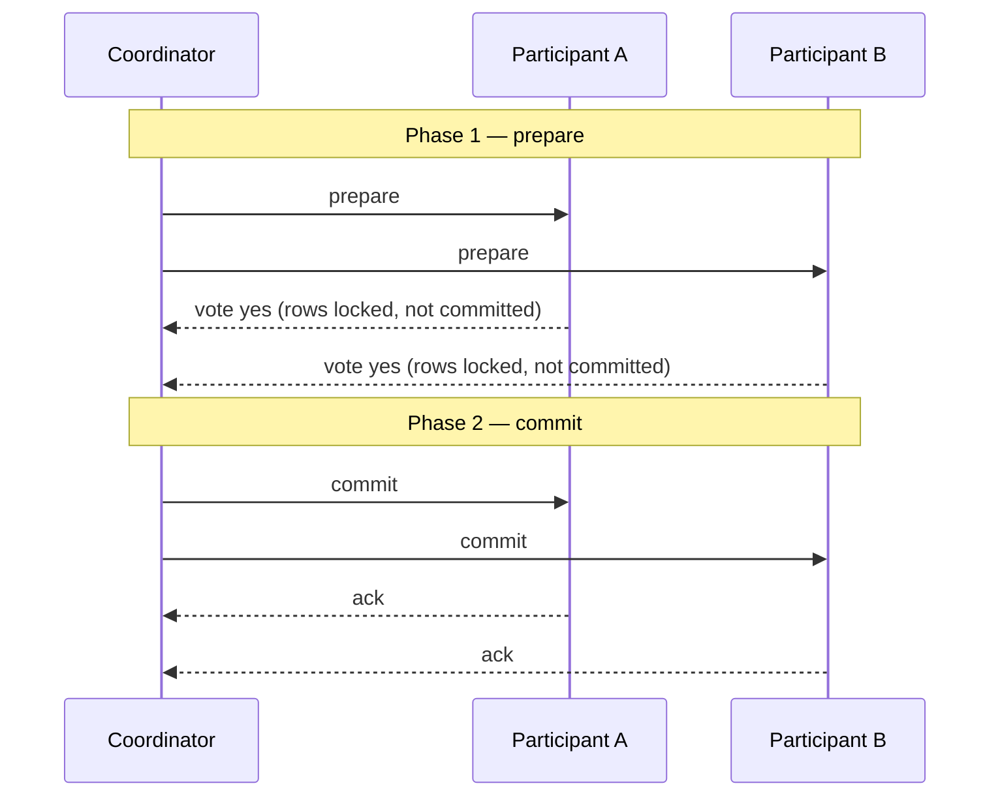

Guarantee: **atomic + immediately consistent** across all participants. This is
real and useful — inside one DB engine, or across XA resources in a single trust
domain (some RDBMS + message brokers).

## 3. Why 2PC doesn't fit here

- **No XA across independent service databases.** 2PC needs every participant to
  speak a distributed-transaction protocol under one coordinator. Our services
  expose HTTP/gRPC APIs, not XA resource managers — there is nothing to enlist.
- **Blocking coordinator = availability hit.** Between prepare and commit, every
  participant holds locks. If the coordinator or *one* participant stalls, the
  others stay locked, waiting. This is the CAP tradeoff in the flesh: 2PC chooses
  consistency over availability, and a checkout path that locks stock + payment
  rows until a slow participant answers is exactly the stall we can't afford.
- **The card provider isn't a transactional resource.** An external payment API
  can't "prepare" a charge and hold it in a coordinator's transaction — it has its
  own auth/capture model. No amount of 2PC reaches across that boundary.
- **Tight temporal coupling.** 2PC assumes all participants are up *together* for
  the whole exchange. Microservices deploy and restart independently; a saga
  survives a participant being briefly down (the step just retries later).

The blocking problem, drawn out — one slow participant freezes everyone:

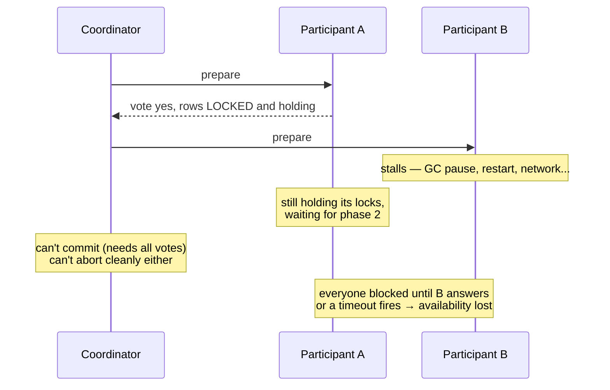

Compare that to a saga: if payment is briefly down, the `AuthorizePayment` step
just **retries later** — nothing else is holding a lock in the meantime.

So the atomic-distributed-transaction route is closed. We give up "all writes
commit together, instantly" and design for **eventual consistency** instead.

## 4. The saga pattern

A **saga** is a sequence of *local* transactions. Each step commits in its own
service's database immediately. If a later step fails, the saga runs a
**compensating** transaction for each completed step, in reverse — a *semantic*
undo, not a rollback (the original commit already happened and may be visible).

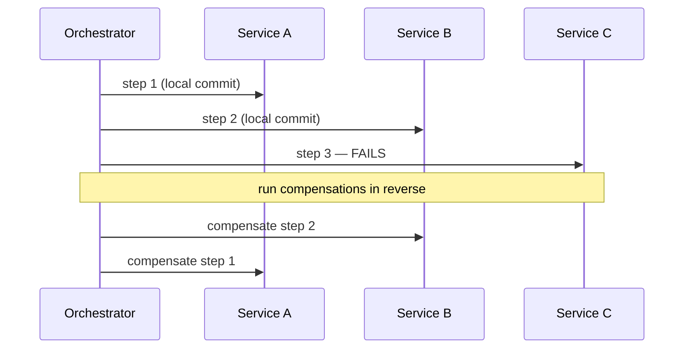

**Orchestration vs choreography.** A saga can be *choreographed* (each service
reacts to the previous one's events — no central brain) or *orchestrated* (one
component drives the steps and compensations explicitly). This platform chose
**orchestration via Temporal** — durable execution makes the orchestrator itself
crash-proof, and the flow is readable in one place. See
[ADR-001](../proposals/adr/ADR-001-adopt-temporal-for-order-fulfillment/) for why
orchestration beat choreography and a hand-rolled outbox here.

## 5. Saga's defining properties

- **Eventual consistency.** Between steps the system is *temporarily inconsistent*
  (stock reserved but order not yet confirmed). It converges — either the saga
  completes forward, or compensations return it to a consistent state.
- **Compensation ≠ rollback.** You can't `ROLLBACK` a committed local transaction
  from another service. You issue a *new* transaction that undoes its effect
  semantically. Money makes this vivid: undoing an authorized-but-uncaptured hold
  is a **void**; undoing a *captured* charge is a **refund** — different
  operations, because the money already moved.
- **Idempotency is mandatory.** Steps and compensations *will* be retried (network
  timeout, worker crash, orchestrator replay). Each must be safe to run more than
  once, or a retry double-charges / double-reserves. This is enforced by storage
  design, not hope (see §7).
- **The pivot (point of no return).** One step flips the saga from
  "still-compensatable" to "must-complete-forward". Before the pivot, failures
  compensate backward; after it, failures retry forward until they succeed.

The two halves of a saga, split by the pivot:

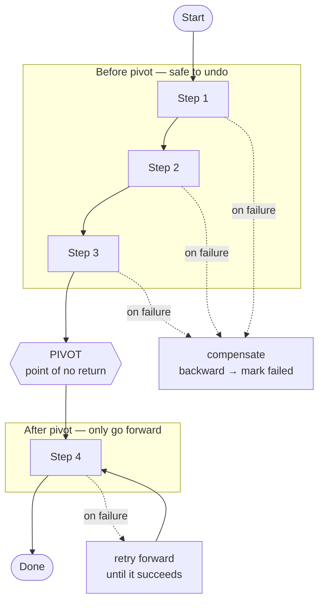

Why a pivot exists: some step commits the business outcome (here, confirming the
order after money is captured). Past that point, undoing would be worse than
finishing — so the saga *guarantees forward progress* instead, retrying the
remaining steps (notify, clear cart) until they succeed.

## 6. How this platform does it (RFC-0010 P3)

The order-fulfillment saga (`order-service/internal/saga/workflow.go`), driven by a
Temporal worker — payment is an unconditional part of every run
(the `PAYMENT_ENABLED` rollout flag was removed in P3.exit):

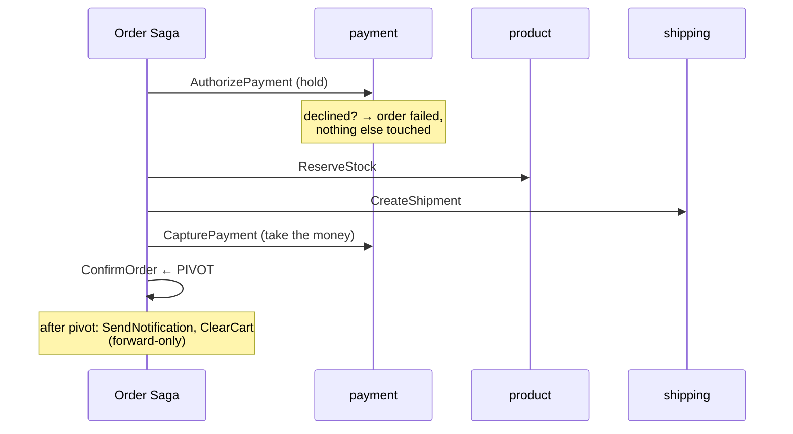

**Authorize-early / capture-late** ([ADR-009](../proposals/adr/ADR-009-saga-authorize-early-capture-late/)):
authorize first so a declined card fails fast before we reserve stock or create a
shipment; capture only immediately before the pivot, once fulfillment is secured.
Compensations are **state-dependent**:

| Failure point | Compensations (reverse order) |
|---|---|
| AuthorizePayment fails | mark order failed (nothing else done yet) |
| ReserveStock fails | fail order |
| CreateShipment fails | ReleaseStock → fail order |
| CapturePayment fails | CancelShipment → ReleaseStock → fail order (hold auto-expires; **void** if needed) |
| ConfirmOrder (pivot) fails | **RefundPayment** (money already captured) → CancelShipment → ReleaseStock |

The captured-but-confirm-failed window is the reason a **refund** compensation
exists at all — capture happens one step before the pivot, so there is a small
window where money moved but the order didn't confirm.

**Compensation in action** — a concrete failure walkthrough. Say stock is
reserved and shipment created, then `CapturePayment` fails. The saga undoes the
completed steps in reverse and lands the order in `failed`:

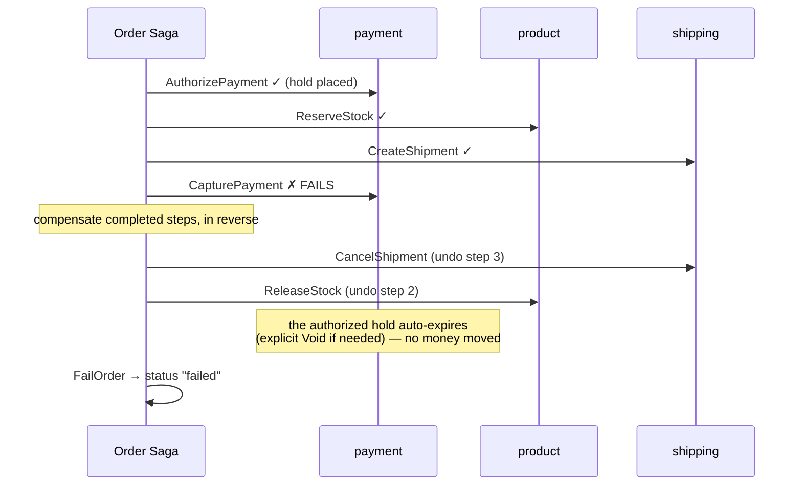

Read it top-to-bottom: three steps succeeded, the fourth failed, and each success
got a matching undo in the opposite order. Because capture never completed, **no
money moved** — the hold just lapses, so this is a *void* situation, not a refund.

**Payment state machine** — why "undo" means different things at different points.
The stored payment status decides whether a compensation is a void or a refund:

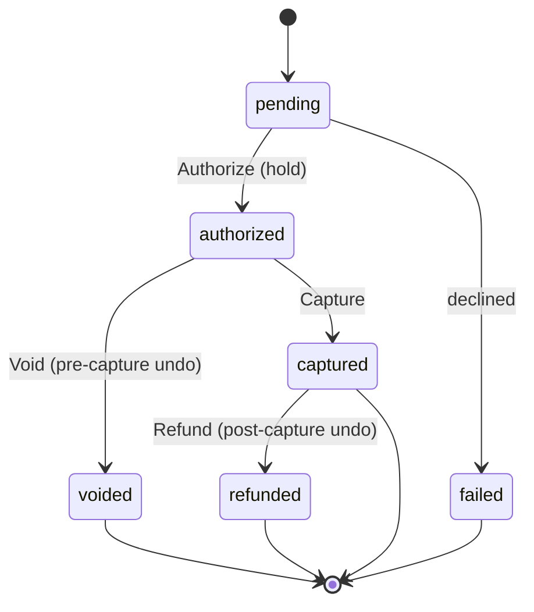

Undoing an `authorized` payment = **void** (release the hold). Undoing a
`captured` payment = **refund** (money already left the account, issue it back).
Same intent ("undo the payment"), two different operations — that's what
"compensation is a *semantic* undo, not a rollback" means in practice.

**Idempotency as a contract.** Every `payment.v1` RPC is idempotent by the
**natural business key** `order_id` (`refund:{order_id}` for refunds) — the saga
doesn't invent a client key; a retry of the same order returns the same result
instead of charging twice. Under the hood, `pkg/idempotency`
([ADR-010](../proposals/adr/ADR-010-shared-idempotency-library/)) implements a
Claim → Checkpoint → Finish state machine with a 90-second **stale-lock takeover**
so a crashed attempt can be safely re-driven against the same subject rather than
duplicated.

The idempotency claim lifecycle (`pkg/idempotency`) — how a retry is caught:

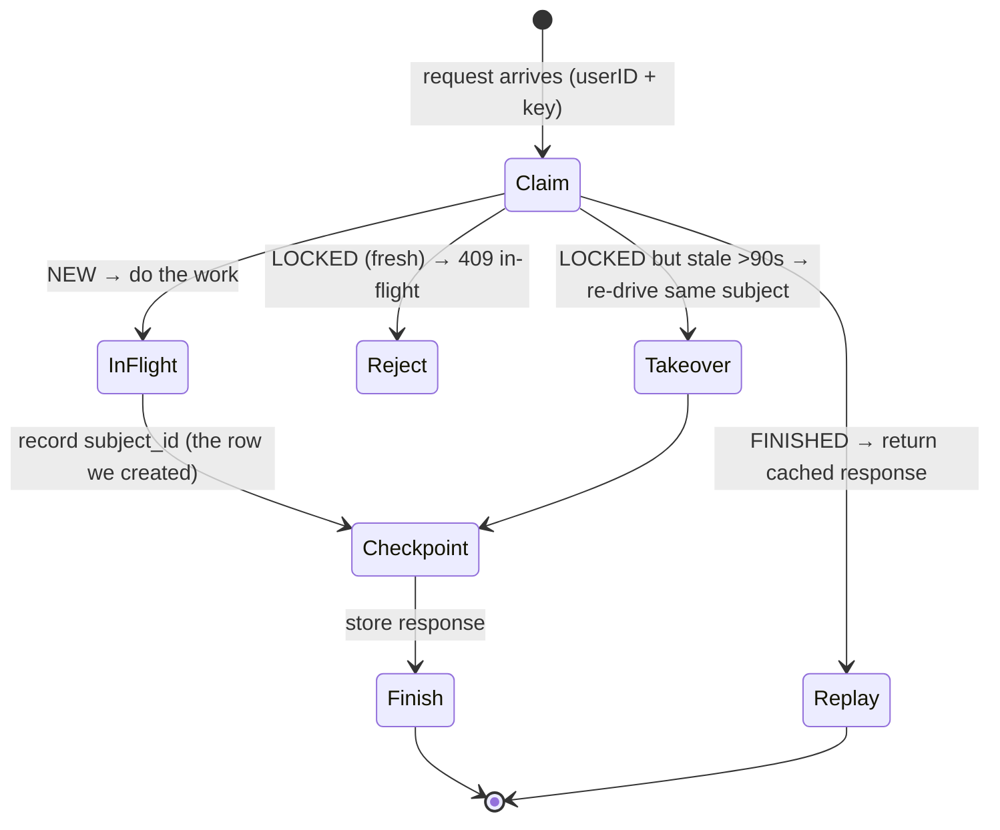

Walkthrough: the **first** call claims `(userID, key)` as NEW and does the work; a
**duplicate while it's running** hits LOCKED → 409 (don't run twice); a
**duplicate after it finished** replays the cached response (no re-charge); and if
the first worker **crashed** mid-flight, after 90s the lock is stale so a retry
*takes over* and re-drives against the same `subject_id` (the payment row already
created) instead of making a second one.

**Contract shape** (`pkg/proto/payment/v1/payment.proto`): `Authorize`, `Capture`,
`Void`, `Refund`, `GetPayment`, all keyed by `order_id`, money in `amount_minor`
(int64 cents). A provider **decline is a normal response** (`status="failed"` +
`decline_code`), *not* a gRPC error — the saga distinguishes a business rejection
(don't retry) from an infra error (retry). On the HTTP surface the money errors map
to stable codes: `PAYMENT_DECLINED` (422), `PAYMENT_EXISTS` (409),
`INVALID_TRANSITION` (409), `REFUND_EXCEEDS_CAPTURE` (409), `IDEMPOTENCY_CONFLICT`
(409). Durability of "exactly-once effect" also leans on the transactional
**outbox** + append-only **double-entry ledger** (see [RFC-0010](../proposals/rfc/RFC-0010/)).

**The deployed payment system.** Putting the pieces together — this is what
actually runs (order namespace ↔ payment namespace, fenced by NetworkPolicy):

```mermaid
flowchart TB
    subgraph order_ns["order namespace"]
        OW["order-worker<br/>Temporal saga"]
    end
    subgraph payment_ns["payment namespace"]
        PGRPC["payment :9090 gRPC<br/>Authorize · Capture · Void · Refund · GetPayment"]
        PHTTP["payment :8080 HTTP<br/>webhook receiver · internal recon API"]
        PLOGIC["logic/v1<br/>state machine · idempotency · ledger posting"]
        PDB[("payment DB<br/>payments · refunds<br/>ledger (double-entry)<br/>outbox · webhook_events<br/>reconciliation_runs/discrepancies")]
        MP["mockpay<br/>(provider, subcommand)"]
        RELAY["outbox relay<br/>(publish events)"]
        RECON["reconciliation<br/>ticker 5 min"]
        PGRPC --> PLOGIC
        PHTTP --> PLOGIC
        PLOGIC --> PDB
        PLOGIC -->|"POST /charges · capture · void · refunds"| MP
        MP -->|"signed webhook (HMAC-SHA256)"| PHTTP
        RELAY --> PDB
        RECON -->|"GET /transactions"| MP
        RECON --> PDB
    end
    OW -->|"gRPC :9090 (saga money ops)"| PGRPC
    KONG["Kong gateway"] -->|"/payment/v1/public/webhooks/mockpay"| PHTTP

    classDef db fill:#1a1a1a,stroke:#3b82f6;
    class PDB db;
```

How to read it against the theory above:

1. **The saga talks gRPC**, not HTTP — `order-worker` calls `payment:9090`
   Authorize/Capture/Void/Refund. This is the east-west transport; only the order
   namespace is allowed onto `:9090` (NetworkPolicy — [payments.md](./payments.md)).
2. **HTTP + gRPC share one logic layer** — the state machine, idempotency, and
   ledger posting live in `logic/v1`, so both transports enforce the same money
   invariants (they can't drift).
3. **The provider is asynchronous** — `payment` calls `mockpay` to charge, and
   `mockpay` answers *later* via a signed (HMAC) **webhook** back to the public
   receiver. That async confirmation is exactly why the saga holds (authorize) and
   captures separately rather than expecting an instant answer.
4. **Two safety nets for eventual consistency** — the **outbox relay** publishes
   domain events durably (at-least-once), and the **reconciliation** ticker
   compares the ledger against the provider's `GET /transactions` every 5 minutes
   to *detect* drift the happy path missed (detect-only v1 — [payments.md](./payments.md)).
   These are how a saga stays trustworthy without a coordinator guaranteeing
   atomicity.

## 7. 2PC vs saga — the tradeoff

| Dimension | Two-phase commit | Saga (ours) |
|---|---|---|
| Consistency | Immediate, atomic across all | **Eventual** (converges via compensations) |
| Availability | Low — blocking coordinator holds locks | High — steps are independent, retryable |
| Coupling | Tight — all participants up together | Loose — survives a participant being down |
| Failure model | Abort → everyone rolls back | Compensate completed steps in reverse |
| External services | Can't enlist a non-XA card API | First-class — a step is just an API call |
| Complexity cost | Coordinator + XA plumbing | Compensations + idempotency + orchestration |
| Visibility | Opaque coordinator state | Every step/compensation is a durable event |

## 8. When you *would* pick 2PC

Sagas aren't universally "better" — they're the right tool when data is spread
across independent services. Reach for a single ACID transaction or 2PC when:

- All the data lives in **one database** — just use a normal transaction (no saga
  needed, no eventual consistency to reason about).
- You have genuinely **XA-capable resources in one trust domain** (e.g. an RDBMS +
  an XA message broker) and need strict immediate consistency.
- The cost of temporary inconsistency is unacceptable *and* the availability hit of
  blocking is acceptable — rare in user-facing paths, sometimes true in back-office
  batch systems.

A quick decision aid:

```mermaid
flowchart TD
    Q1{"All data in<br/>ONE database?"}
    Q1 -->|yes| T["Single ACID transaction<br/>(no saga, no 2PC)"]
    Q1 -->|no| Q2{"All participants<br/>XA-capable in one<br/>trust domain?"}
    Q2 -->|"yes + need strict<br/>immediate consistency"| TPC["Two-phase commit<br/>(accept the blocking cost)"]
    Q2 -->|"no — separate services<br/>or an external API"| SAGA["Saga<br/>local txns + compensations"]

    classDef pick fill:#052e1a,stroke:#22c55e;
    class SAGA pick;
```

If you're crossing service boundaries or touching a third-party API, the saga is
almost always the answer (the green path) — which is why it's the shape of every
cross-service business action on this platform.

## References

- [ADR-001](../proposals/adr/ADR-001-adopt-temporal-for-order-fulfillment/) — adopt Temporal; saga chosen over outbox/choreography/hand-rolled orchestration
- [ADR-009](../proposals/adr/ADR-009-saga-authorize-early-capture-late/) — authorize-early / capture-late, void-vs-refund compensations
- [ADR-010](../proposals/adr/ADR-010-shared-idempotency-library/) — shared `pkg/idempotency` (claim/checkpoint/finish, stale-lock takeover)
- [RFC-0010](../proposals/rfc/RFC-0010/) — full payment design (state machine, idempotency, outbox, ledger, reconciliation)
- [temporal-order-fulfillment.md](./temporal-order-fulfillment.md) — the live saga: steps, retries, contracts, infra, ops
- [payments.md](./payments.md) — payment operational surface (checkout read path, reconciliation)

_Last updated: 2026-07-06_
