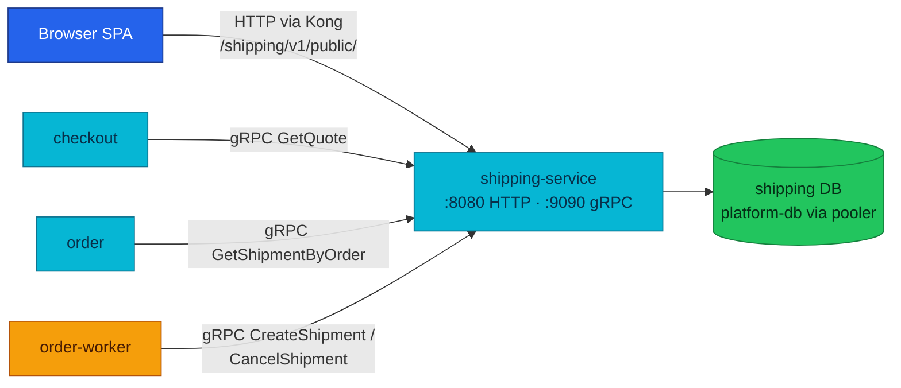

# Shipping Service API

Shipping turns "an order that must move" into a tracked shipment — and turns "where is my package / what will it cost" into two public reads. It is the platform's quote authority (checkout prices delivery through it) and the order-fulfillment saga's shipment step.

| Dimension | Value | Status |
|-----------|-------|--------|
| **Deployment** | local-stack + cluster | Implemented |
| **HTTP** | public only · `:8080` · Kong `/shipping/v1/public/` (no JWT) | Implemented |
| **gRPC server** | `ShippingService/GetQuote, GetShipmentByOrder, CreateShipment, CancelShipment` · `:9090` | Implemented |
| **gRPC client** | None | None |
| **Worker** | None | None |
| **Temporal** | Participant (gRPC) · [workflows.md](./workflows.md#order-fulfillment) | Implemented |
| **Technical debt** | Pre-v3 aliases (ADR-017) · [Known gaps](#known-gaps) | Technical debt |

| Attribute | Value | RFC / ADR |
|-----------|-------|-----------|
| **Repository** | [`duynhlab/shipping-service`](https://github.com/duynhlab/shipping-service) | — |
| **Owns** | Shipments, tracking numbers, shipment status, and the quote rate table (static, in-code) | — |
| **Database** | `shipping` on `platform-db` via `platform-db-pooler-rw.platform:5432` | — |
| **Design record** | — | [RFC-0003](../proposals/rfc/RFC-0003/) (saga participant) · [RFC-0015](../proposals/rfc/RFC-0015/) (quote authority, P3) |

## Temporal participation

| Field | Value |
|-------|-------|
| **Role** | Participant (gRPC) |
| **Workflow** | `OrderFulfillmentWorkflow` (owned by order) |
| **This service's steps** | `CreateShipment`, `CancelShipment` (compensation) |
| **Idempotency** | order id — `UNIQUE (order_id)` + `ON CONFLICT` makes replays return the existing shipment |
| **Deep dive** | [workflows.md](./workflows.md#order-fulfillment) · [temporal-order-fulfillment.md](./temporal-order-fulfillment.md) |

## Why it exists

Delivery cost and delivery state are two facts no other service should improvise:

1. **The fee needs one authority.** Before RFC-0015 P3 the platform carried a
   hardcoded $5 shipping fee from the first cart demo. Checkout's totals rule
   (`total = subtotal + fee + tax − discount`) needs a real answer per shipping
   method and destination region — shipping owns that rate table, so the fee the
   SPA displays is the fee the saga charges.
2. **The saga needs an idempotent shipment step.** A Temporal activity may be
   retried at any point; "create a shipment" must therefore converge to exactly
   one shipment per order, and its compensation must succeed even when there is
   nothing to cancel.
3. **Customers need public reads without an account.** Tracking by tracking
   number and cost estimation are anonymous flows — the only two routes exposed
   at the edge, deliberately JWT-free.

The result is a deliberately small service: two public reads, four RPCs, one
table, no outbound calls.

## Architecture

One question: **who calls shipping, and over which transport?**



Shipping is a **leaf service**: it dials nothing east-west (gRPC client: None).
Every caller reaches it either through Kong (public HTTP) or directly on `:9090`
inside the cluster, fenced by NetworkPolicy (see
[Callers & dependencies](#callers--dependencies)).

## Data model

One table — `shipments` (`db/migrations/sql/`):

| Column | Type | Notes |
|--------|------|-------|
| `id` | `SERIAL PK` | |
| `order_id` | `INTEGER NOT NULL UNIQUE` | References `order.orders.id` — cross-service, **no FK**; `UNIQUE` (migration `000004`) is the saga idempotency invariant |
| `tracking_number` | `VARCHAR(100) NOT NULL UNIQUE` | Saga-created shipments use `MOP%010d` of the order id (e.g. `MOP0000000042`) |
| `carrier` | `VARCHAR(50)` | `MOP Express` for saga-created rows; seed rows use USPS/FedEx/UPS |
| `status` | `VARCHAR(50)` | `pending` (default) → `in_transit` → `delivered`; `cancelled` via compensation |
| `estimated_delivery` | `TIMESTAMP` | Set to now + 5 days at creation |
| `created_at`, `updated_at` | `TIMESTAMP` | |

Two rate surfaces are **not** in the database:

- **Quote rates** (`internal/logic/v1/quote.go`) — a static in-code method × region
  table (RFC-0015 P3): `standard`/`express` × domestic (`VN`) vs rest-of-world,
  int64 **minor units** (e.g. standard domestic = 300 = $3.00). Real carrier
  tables can replace it without changing the gRPC contract.
- **Estimate formula** (`internal/logic/v1/service.go`) — deterministic demo math
  for the public estimate: base $5 + $1.5/kg + $10 if origin ≠ destination;
  3–5 days, +2 for > 10 kg. Dollars on the wire (`estimated_cost`), unlike the
  quote path.

## HTTP API

Public routes only — Kong exposes `/shipping/v1/public/` with **no JWT** (anonymous
tracking is a feature). The `internal` route is never on the gateway. Shared
conventions (error envelope, snake_case, data types): [api.md](./api.md#common-http-contracts).

| Method | Path | Audience | Status | Purpose |
|--------|------|----------|--------|---------|
| `GET` | `/shipping/v1/public/shipments/track` | Public | Implemented | Look up a shipment by tracking number |
| `GET` | `/shipping/v1/public/shipments/estimate` | Public | Implemented | Estimate cost and days from origin, destination, weight |
| `GET` | `/shipping/v1/internal/shipments/orders/:orderId` | Internal | No caller | HTTP twin of the gRPC order lookup — order calls gRPC instead |

### Track shipment — `GET /shipping/v1/public/shipments/track`

Query: `tracking_number` (preferred). The legacy `trackingId` query remains
accepted for compatibility.

```json
{
  "id": 9,
  "order_id": 42,
  "tracking_number": "MOP0000000042",
  "carrier": "MOP Express",
  "status": "pending",
  "estimated_delivery": "2026-07-18T00:00:00Z",
  "created_at": "2026-07-13T09:00:00Z"
}
```

### Estimate shipping — `GET /shipping/v1/public/shipments/estimate`

| Query | Required | Validation |
|-------|----------|------------|
| `origin` | Yes | Non-empty |
| `destination` | Yes | Non-empty |
| `weight` | Yes | Positive finite number; NaN and infinity are rejected |

```json
{
  "origin": "HCM",
  "destination": "HN",
  "weight": 1.5,
  "estimated_cost": 17.25,
  "estimated_days": 5,
  "currency": "USD",
  "carrier": "Standard Shipping"
}
```

### Error matrix

| Route | Status | Code | When |
|-------|--------|------|------|
| track | `400` | `VALIDATION_ERROR` | Missing `tracking_number` |
| track | `404` | `NOT_FOUND` | Unknown tracking number |
| track | `503` | `INTERNAL_ERROR` | Carrier unavailable (mapped from `ErrCarrierUnavailable`) |
| estimate | `400` | `VALIDATION_ERROR` | Missing params, or weight not a positive finite number |
| both | `500` | `INTERNAL_ERROR` | Repository/infrastructure failure |

The deprecated pre-v3 paths `/shipping/v1/public/{track,estimate}` remain
temporary aliases during the ADR-017 expand phase (see [Known gaps](#known-gaps)).

## gRPC API

`ShippingService` on `:9090` (proto: `pkg/proto/shipping/v1/shipping.proto`).
Runtime model — addressing, dual-port, load balancing:
[api.md § gRPC Runtime Model](./api.md#grpc-runtime-model).

| RPC | Request → Response | Saga | Notes |
|-----|--------------------|------|-------|
| `GetQuote` | `{method, region}` → `{fee_minor, eta_days}` | — | Pure read; checkout's fee authority. Unknown method or empty region → `InvalidArgument` (checkout answers `400`) |
| `GetShipmentByOrder` | `{order_id}` → `{shipment?}` | — | Order-details enrichment. A missing shipment returns an **unset shipment**, not an error — "no shipment yet" is a normal order state |
| `CreateShipment` | `{order_id, address?}` → `{shipment}` | step | Saga step: idempotent by `order_id`; a replay returns the existing shipment. `address` accepted but not persisted yet (forward-compat) |
| `CancelShipment` | `{order_id}` → `{}` | compensation | Compensates `CreateShipment`; unknown or already-cancelled shipment still succeeds |

Checkout treats shipping as the fee authority: the quote crosses to order during
confirm so the saga charges exactly the total the SPA displayed
([checkout.md § Totals](./checkout.md#totals-p3-implemented--one-composition-rule-owned-by-sql)).

## Business rules & techniques

### Quote vs shipment: two lifecycles, one service

The **quote** is stateless and pre-purchase: `GetQuote(method, region)` reads the
in-code rate table and answers in minor units — nothing is written, nothing
reserved. The **shipment** is stateful and post-purchase: it exists only once the
saga's `CreateShipment` step runs, and moves `pending` → `in_transit` →
`delivered`, or to `cancelled` under compensation. The public **estimate** is a
third, softer read: a demo formula in dollars for anonymous browsing — it shares
no code path with the quote and is not an authority for anything.

### Idempotency lives in the database, not the handler

`CreateShipment` is `INSERT … ON CONFLICT (order_id) DO UPDATE SET order_id =
EXCLUDED.order_id … RETURNING *` — the no-op touch makes the statement always
return the row, so a concurrent duplicate call gets the existing shipment with no
extra round-trip and no race window. `CancelShipment` is a conditional
`UPDATE … WHERE order_id = $1 AND status <> 'cancelled'` where zero rows affected
is still success. Both properties are exactly what a retried Temporal activity
needs: the layer above never has to distinguish first-run from replay (the
`shipment_created_total{outcome="ok"}` metric deliberately doesn't either).

### Transport adapters share one logic layer

`internal/grpc/v1` and `internal/web/v1` are both thin adapters over
`internal/logic/v1` — the gRPC `GetShipmentByOrder` and the internal HTTP twin
return identical data, and error mapping is per-transport (`InvalidArgument` vs
`400 VALIDATION_ERROR`).

## Callers & dependencies

| Caller | Transport | Calls | Why |
|--------|-----------|-------|-----|
| Browser SPA | HTTP via Kong (no JWT) | track, estimate | Anonymous tracking + cost preview |
| checkout | gRPC | `GetQuote` | Fee authority for session totals (RFC-0015 P3) |
| order | gRPC | `GetShipmentByOrder` | Enrich order details with shipment state |
| order-worker | gRPC | `CreateShipment`, `CancelShipment` | Saga step + compensation |

Dependencies: the `shipping` database only — shipping dials no other service.

**NetworkPolicy fence** ([network-policies/shipping.yaml](../../kubernetes/infra/configs/network-policies/shipping.yaml)):
default deny-all ingress; `kong` and `order` namespaces may reach `:8080` + `:9090`;
`checkout` may reach `:9090` **only** (it prices quotes, never the HTTP API). The
east-west gRPC surface is unauthenticated by design — the policy is the fence.

## Known gaps

- **Internal HTTP twin — No caller.** `GET /shipping/v1/internal/shipments/orders/:orderId`
  mirrors the gRPC lookup; order migrated to gRPC, so the route is kept documented
  but has no live consumer.
- **Pre-v3 aliases.** `/shipping/v1/public/track` and `/shipping/v1/public/estimate`
  are deprecated ADR-017 expand-phase aliases; removal lands with the contract phase.
- **`CreateShipmentRequest.address` not persisted.** Accepted for forward
  compatibility; the shipment row stores no destination yet.
- **Estimate is demo math.** The public estimate is a deterministic formula, not a
  carrier integration; the quote rate table is likewise static in code.
- **gRPC mTLS — Planned** (RFC-0020 research; see [Service contracts](./README.md#service-contracts)).

## Operations

- **Ports & probes:** HTTP `:8080` (`/health` liveness, `/ready` readiness — drains
  on shutdown, pings the DB pool with a 1 s timeout); gRPC `:9090`.
- **Addressing:** clients dial `dns:///shipping.shipping.svc.cluster.local:9090`
  (single multi-port Service; see [api.md § gRPC Runtime Model](./api.md#grpc-runtime-model)).
- **Key env:** `PORT` (8080), `GRPC_PORT` (9090), `DB_HOST`/`DB_PORT`/`DB_SSLMODE`/`DB_POOL_MAX_CONNECTIONS`,
  `TRACING_ENABLED`, `OTEL_SAMPLE_RATE`, `LOG_LEVEL`, `SHUTDOWN_TIMEOUT`, `READINESS_DRAIN_DELAY`.
- **Database:** app connects through `platform-db-pooler-rw.platform:5432`
  (pool max 30); migrations run against `platform-db-rw` directly
  ([shipping.yaml](../../kubernetes/apps/services/shipping.yaml)).
- **Business metrics** (RFC-0017 W2, OTLP → VictoriaMetrics): `shipment_created_total{outcome}`
  (is `CreateShipment` failing the saga?), `shipment_cancelled_total{outcome}`
  (is the compensation failing?), `shipment_lookup_total{kind, found}` (track vs
  by-order hit rate). Outcomes are bounded: `ok` / `invalid_order_id` / `error`.
- **Smoke test via Kong:**

```bash
curl "http://localhost:8080/shipping/v1/public/shipments/estimate?origin=HCM&destination=HN&weight=1.5"
grpcurl -plaintext -d '{"method":"standard","region":"VN"}' \
  shipping.shipping.svc.cluster.local:9090 shipping.v1.ShippingService/GetQuote
```

## Code map

Paths in [`duynhlab/shipping-service`](https://github.com/duynhlab/shipping-service). Transport peers call `logic/v1`; logic calls `core` only ([api.md § Inside Each Service](./api.md#inside-each-service)).

| Layer | Path | Notes |
|-------|------|-------|
| **Transport** | `internal/web/v1/handler.go` | HTTP handlers |
| | `internal/grpc/v1/server.go` | gRPC server |
| **logic** | `internal/logic/v1/service.go` | Shipment logic |
| | `internal/logic/v1/quote.go` | Quote rate table |
| | `internal/logic/v1/metrics.go` | Business metrics |
| **core** | `internal/core/repository/postgres/shipping.go` | Repository |
| **Platform** | `cmd/main.go` | Routes + servers |
| | `db/migrations/sql/` | Schema + idempotency constraint |
| | `pkg/proto/shipping/v1/shipping.proto` | Proto |

## References

- [api.md](./api.md) — shared HTTP/gRPC rules (auth, error envelope, runtime model)
- [workflows.md](./workflows.md) — Temporal workflow registry
- [temporal-order-fulfillment.md](./temporal-order-fulfillment.md) — saga deep dive
- [checkout.md](./checkout.md) · [order.md](./order.md) — quote and enrichment callers
- [Service contracts](./README.md#service-contracts)

_Last updated: 2026-07-21_
