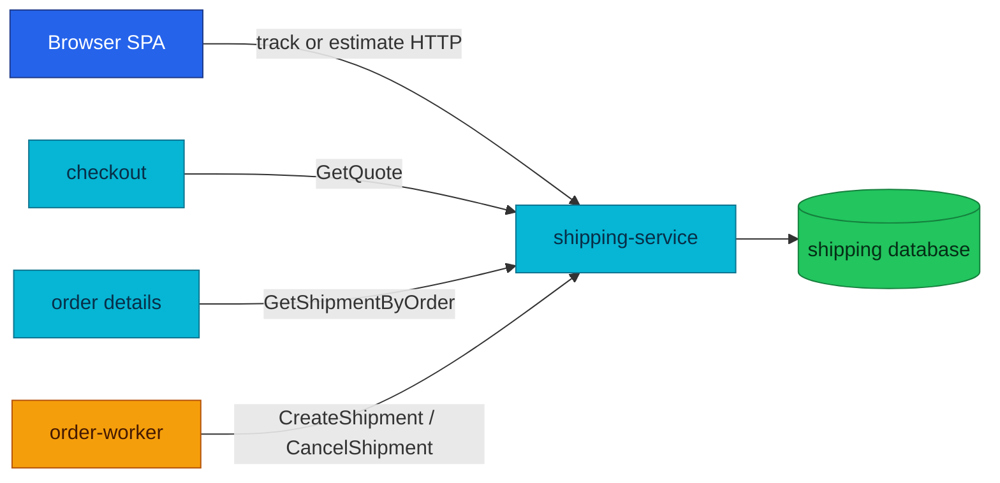

# Shipping Service API

Shipping owns shipment records, public tracking, estimates, and checkout quote authority.

| Attribute | Value |
|---|---|
| **Status** | Implemented; quote RPC is used by Checkout in local-stack |
| **Repository** | [`duynhlab/shipping-service`](https://github.com/duynhlab/shipping-service) |
| **Owns** | Shipments, tracking numbers, shipment status, and quote rate table |
| **HTTP** | Public tracking/estimate and internal lookup on `:8080` |
| **gRPC** | `ShippingService` on `:9090` |
| **Callers** | Browser, Checkout, Order, and order-worker |

## Overview

Shipping serves two different reads: a public estimate based on origin,
destination, and weight, and a checkout quote based on shipping method and
destination region. The fulfillment Saga also creates or compensates shipment
records through idempotent gRPC operations.



## HTTP API

| Method | Path | Audience | Purpose |
|---|---|---|---|
| `GET` | `/shipping/v1/public/shipments/track` | Public | Look up a shipment by tracking number |
| `GET` | `/shipping/v1/public/shipments/estimate` | Public | Estimate cost and days from origin, destination, and weight |
| `GET` | `/shipping/v1/internal/shipments/orders/:orderId` | Internal | HTTP twin of the gRPC order lookup; no live HTTP caller |

### Track shipment

Preferred query: `tracking_number`. The legacy `trackingId` query remains
accepted for compatibility.

```json
{
  "id": 9,
  "order_id": 42,
  "tracking_number": "MOP0000000042",
  "carrier": "MOP Express",
  "status": "pending",
  "estimated_delivery": "2026-07-18T00:00:00Z",
  "created_at": "2026-07-13T09:00:00Z"
}
```

### Estimate shipping

| Query | Required | Validation |
|---|---|---|
| `origin` | Yes | Non-empty |
| `destination` | Yes | Non-empty |
| `weight` | Yes | Positive finite number; NaN and infinity are rejected |

```json
{
  "origin": "HCM",
  "destination": "HN",
  "weight": 1.5,
  "estimated_cost": 17.25,
  "estimated_days": 5,
  "currency": "USD",
  "carrier": "Standard Shipping"
}
```

The deprecated pre-v3 paths `/shipping/v1/public/{track,estimate}` remain
temporary aliases during the ADR-017 expand phase.

## gRPC API

| RPC | Caller | Purpose | Idempotency or absence behavior |
|---|---|---|---|
| `GetQuote` | Checkout | Price method and region in minor units | Read-only; unknown pair is `InvalidArgument` |
| `GetShipmentByOrder` | Order | Enrich order details | Missing shipment returns an unset shipment, not a hard failure |
| `CreateShipment` | Order worker | Create the order shipment | Replays return the existing shipment by `order_id` |
| `CancelShipment` | Order worker | Compensate creation | Unknown or already-cancelled shipment succeeds |

Checkout treats Shipping as the fee authority. The quote crosses to Order during
confirm so the Saga charges exactly the total displayed by Checkout.

## Operations

HTTP probes use `:8080`; gRPC clients resolve the headless
`shipping-grpc:9090` Service. HTTP, gRPC, and runtime metrics export over OTLP. NetworkPolicy admits only the expected caller
namespaces to the gRPC port.

## References

- [Shared API and gRPC conventions](api.md)
- [Checkout service](checkout.md)
- [Order service](order.md)
- [Order-fulfillment Saga](temporal-order-fulfillment.md)

_Last updated: 2026-07-14_
