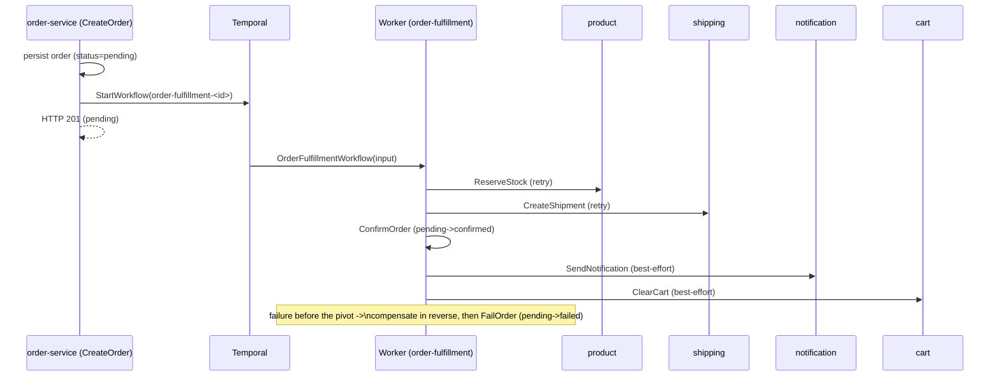
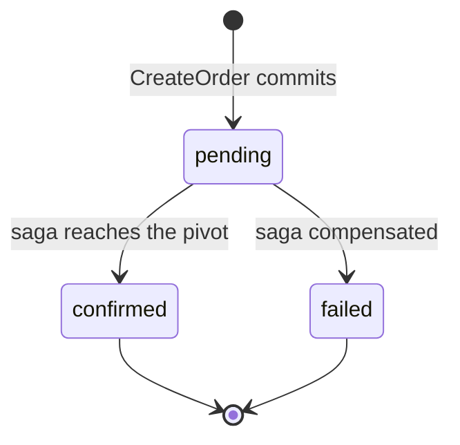
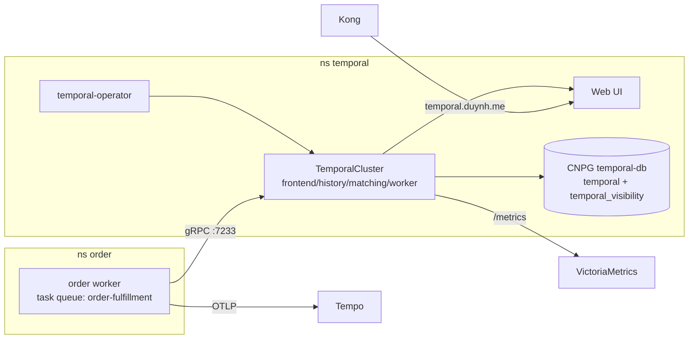

# Temporal Order-Fulfillment Saga

| Attribute | Value |
|-----------|-------|
| **Version** | **v1.0.0** |
| **Status** | **Implemented** ✅ — shipped and verified end-to-end on `local-stack` (a checkout drives the full saga; an over-quantity checkout fails fast and rolls back). |
| **Scope** | Durable orchestration of cross-service workflows. The flagship (and currently only) workflow is order fulfillment; this doc is also the platform reference for **why/when** to use Temporal and **how** it is wired. |
| **Relation** | Decisions: [ADR-001 Adopt Temporal](../proposals/adr/ADR-001-adopt-temporal-for-order-fulfillment/), [ADR-002 Deploy via the operator](../proposals/adr/ADR-002-deploy-temporal-via-operator/). East-west transport: [`grpc-internal-comms.md`](grpc-internal-comms.md). Service map: [`microservices.md`](microservices.md). |
| **Last updated** | 2026-07-02 |

> **TL;DR** — Checkout used to be synchronous + fire-and-forget, so partial failures silently lost
> work (no inventory decrement, no shipment, lost notifications, no rollback). We replaced the
> post-commit side-effects with a **Temporal saga**: a durable workflow that reserves stock →
> creates a shipment → confirms the order → notifies → clears the cart, retries each step, and
> **compensates in reverse** on failure. The HTTP request returns `201 pending` immediately; the
> workflow drives the order to `confirmed`/`failed`.

---

## 1. Why Temporal?

Before this change, `order-service` committed the `orders` row and then, on **detached contexts**,
made best-effort calls to notification (gRPC) and cart-clear (REST). The consequences:

- **No durability / no retry.** If a downstream call failed (or the pod restarted mid-flight), the
  side-effect was simply **lost** — logged and forgotten. There was no record that it still needed
  doing.
- **Inventory was a TODO.** Stock was never actually decremented at checkout.
- **No shipment** was created proactively.
- **No compensation.** A partial failure (say, stock taken but shipment failed) left the system in
  an inconsistent state with no automatic rollback.

These are the textbook problems a **workflow engine** solves. Temporal gives us **durable
execution**: workflow + activity state is persisted at every step, so a crash resumes exactly where
it left off; activities retry under a policy; and the saga pattern (append a compensation as each
step succeeds, run them in reverse on failure) is expressed as ordinary, testable Go. The full
rationale and the alternatives we rejected (transactional outbox, message-queue choreography,
hand-rolled orchestration) are in **[ADR-001](../proposals/adr/ADR-001-adopt-temporal-for-order-fulfillment/)**.

## 2. When to use Temporal (and when not)

Temporal is powerful but not free — it adds an operational dependency and a programming model.
Reach for it deliberately.

| Reach for Temporal when… | Don't — use a plain call/handler when… |
|---|---|
| A unit of work spans **multiple services/steps** and must be **all-or-nothing** with compensation (the order saga). | It's a single-service CRUD or read — a normal HTTP/gRPC handler is simpler. |
| Steps must **survive process restarts** and be **retried** until they succeed (or are compensated). | The operation is naturally idempotent and a client retry is acceptable. |
| The flow is **long-running** (waits, timers, human-in-the-loop, polling an external system). | It's a synchronous, **low-latency hot path** where the caller needs the result now. |
| You need **visibility** into in-flight/stuck executions and their history. | Fire-and-forget with at-most-once semantics is genuinely acceptable. |
| You want **exactly-once effects** via idempotency keys + durable de-dup. | A message queue + idempotent consumer already covers it and you don't need orchestration. |

Rule of thumb: **orchestration of stateful, multi-step, must-not-be-lost work → Temporal;
stateless request/response → don't.**

## 3. What it buys us (realized)

The order saga turns the gaps above into guarantees:

- **Inventory is actually reserved** (atomic, DB-enforced, idempotent) — the long-standing TODO is closed.
- **Every checkout reaches a terminal state**: fully fulfilled (`confirmed`) **or** cleanly rolled back (`failed`, stock released, shipment cancelled). No more silent partial failures.
- **Durable + self-healing**: a worker/pod restart resumes in-flight workflows; transient downstream failures retry automatically.
- **Observable**: every execution (and its full history) is visible in the Temporal Web UI; spans flow into Tempo.

## 4. The order-fulfillment saga

`OrderFulfillmentWorkflow(input)` is started from `CreateOrder` right after the order row commits.
Workflow ID `order-fulfillment-<orderID>` (dedups a retried start). Task queue `order-fulfillment`.
Each activity has a `RetryPolicy`; compensations run **in reverse** on failure.

| # | Step → service | Compensation | Notes |
|---|----------------|--------------|-------|
| 1 | `ReserveStock` → product (gRPC) | `ReleaseStock` | atomic decrement + `stock_reservations` ledger; insufficient stock is **non-retryable** |
| 2 | `CreateShipment` → shipping (gRPC) | `CancelShipment` | idempotent by `order_id` |
| 3 | **`ConfirmOrder`** → order core | `FailOrder` | status `pending → confirmed` — **the pivot** |
| 4 | `SendNotification` → notification (gRPC) | — | best-effort (post-pivot) |
| 5 | `ClearCart` → cart (REST) | — | best-effort (post-pivot) |

**The pivot.** Steps 1–2 are the "transaction": if anything through `ConfirmOrder` fails, the
workflow runs the registered compensations in reverse (`CancelShipment`, `ReleaseStock`) and marks
the order `failed`. Once `ConfirmOrder` succeeds the order is `confirmed` and **steps 4–5 are
best-effort** — a failed notification or cart-clear is logged but never rolls a confirmed order
back.

**Payment (authorize-early / capture-late).** Payment is an unconditional part of
every saga run: `AuthorizePayment` runs before step 1 (a hold — a decline fails the order
before any stock/shipment work), and `CapturePayment` runs after step 2, just before the
`ConfirmOrder` pivot. Compensation is capture-state-dependent — a pre-capture failure runs
`VoidPayment` (release the hold), a pivot failure runs `RefundPayment` (return the money) —
composed reverse-order with `CancelShipment` / `ReleaseStock`. All payment calls are idempotent by
the natural key `order:<id>`, so Temporal retries are safe. Rationale and tradeoffs:
[ADR-009](../proposals/adr/ADR-009-saga-authorize-early-capture-late/). (The `PAYMENT_ENABLED`
rollout flag was removed once payment became permanent — P3.exit.)

**Retry & timeouts.** Activities use `StartToCloseTimeout` + `RetryPolicy{InitialInterval: 1s,
Backoff: 2.0, MaxInterval: 30s, MaxAttempts: 5}`. Business rejections (insufficient stock →
`codes.FailedPrecondition`) are wrapped as **non-retryable** application errors so the saga
compensates immediately instead of hammering a downstream that will keep saying no.

## 5. Contracts & the checkout flow

New east-west contracts in [`duynhlab/pkg`](https://github.com/duynhlab/pkg) (`pkg/proto`, `buf`,
tagged `v0.7.0`), all **idempotent** so activity retries are safe:

- **product** — `ReserveStock(reservation_id, items)` · `ReleaseStock(reservation_id, items)`.
- **shipping** — `CreateShipment(order_id, address)` · `CancelShipment(order_id)`.
- **`pkg/temporalx`** — shared Temporal client + worker bootstrap (mirrors `grpcx`/`obsx`) with the
  OpenTelemetry tracing interceptor, so workflow/activity spans join the originating request's trace.

**Checkout is async.** `CreateOrder` commits the order and returns **`201 pending`** immediately;
the SPA shows "Processing…" and polls `GET /order/v1/private/orders/:id` for `confirmed`/`failed`.
The request does **not** block on the saga — retries can take seconds–minutes, blocking would couple
user latency to downstream health, and an API-pod restart would lose the response while the durable
workflow keeps running. *(Future nicety: Temporal **Update-With-Start** could return an early
"stock reserved" ack in the initial call.)*

## 6. Infrastructure

Deployed via the **`alexandrevilain/temporal-operator`** (see **[ADR-002](../proposals/adr/ADR-002-deploy-temporal-via-operator/)** for why the operator over the official Helm chart, and the server-version constraint):

- **Operator** — `controllers/temporal/`: `HelmRepository` + `HelmRelease` (chart `0.6.0`); installs the `TemporalCluster`/`TemporalNamespace` CRDs; webhook certs via cert-manager.
- **`TemporalCluster` + `mop` `TemporalNamespace`** (retention 168h) — `configs/temporal/`: server **`1.24.2`** (target 1.27.x — ADR-002), `numHistoryShards: 512`, persistence → `temporal-db` (default + `temporal_visibility`) via the **CNPG-generated `temporal-db-app`** secret, `ui.enabled`, `admintools.enabled`, `metrics.prometheus.serviceMonitor.enabled`, resources set on every operator-created pod for Kyverno.
- **`temporal-db`** — `configs/databases/clusters/temporal-db/`: a CloudNativePG cluster with the two SQL stores. Single instance for now (Temporal HA is at the service layer); scaling + Barman backups are a follow-up.
- **Edge & alerts** — Kong ingress `temporal.duynh.me`; `TemporalServerDown` + service/persistence error-rate `PrometheusRule`s (`configs/temporal/prometheusrule.yaml`).
- **Flux order** — `controllers → temporal-operator` (the operator HelmRelease `dependsOn` cert-manager, since its chart renders a cert-manager `Certificate`/`Issuer` for the admission webhook); `databases → temporal-db`; a `temporal` Kustomization (`dependsOn` controllers, cert-manager, databases, monitoring) before `apps`; the order worker `dependsOn` temporal.

## 7. Deploy & run it

- **Worker mode.** Each owning service ships a **`worker` subcommand** (mirrors `migrate`); it dials
  Temporal + the downstreams, registers the workflow/activities, and polls the task queue. It also
  serves `/health`, `/ready`, `/metrics` (the process has no app HTTP, but needs probes + a scrape
  target).
- **In-cluster.** The worker is a **second release of the same `mop` chart** (`duynhlab/helm-charts`,
  ≥`0.12.0`): same image, `args: ["worker"]`, `service.enabled: false`. In homelab it's the
  `order-worker` HelmRelease (`kubernetes/apps/order-worker.yaml`, namespace `order`) carrying the
  order DB + downstream addresses + `TEMPORAL_HOSTPORT` / `TEMPORAL_NAMESPACE` / `TASK_QUEUE` /
  `PRODUCT_GRPC_ADDR`. `apps-local` `dependsOn` `temporal-local` so it deploys after the cluster is
  Ready. (Earlier drafts used a `worker.enabled` chart toggle; the chart was reworked to the
  separate-release model.)
- **Locally.** `local-stack/compose.yaml` runs a `temporalio/temporal` dev server (frontend `:7233`,
  Web UI `:8233`) + an `order-worker` container; `docker compose up -d --build` then a checkout
  exercises the live saga.

## 8. Operations & observability

- **Temporal Web UI** — `temporal.duynh.me` (cluster) / `localhost:8233` (local-stack): every
  execution, its inputs, history, retries, and failures.
- **Metrics** — the operator scrapes Temporal **server** metrics via a `ServiceMonitor`; alerts:
  `TemporalServerDown`, `TemporalServiceErrorRateHigh`, `TemporalPersistenceErrorRateHigh`
  (`configs/temporal/prometheusrule.yaml`). The worker exposes gRPC RED + Go-runtime metrics on
  `/metrics`.
- **Failure handling** — insufficient stock fails fast (non-retryable) and compensates; transient
  downstream errors retry per policy; a stuck workflow is visible (and terminable) in the UI.

## 9. As-built notes & roadmap

Deliberate deviations from the original design:

- **Pivot = ConfirmOrder** (see §4); post-pivot steps are best-effort.
- **Workflow start lives in the web handler** (where the old fire-and-forget calls were), so the
  logic layer stays Temporal-free. If Temporal is unavailable the order is still created (`pending`)
  and the start is logged — checkout never fails on Temporal.
- **`ClearCart` carries the caller's bearer token** in the workflow input (cart's private REST
  validates it; the saga runs within seconds). Homelab simplification — see the roadmap.
- **Idempotency is DB-enforced** — product `stock_reservations` (PK `reservation_id,product_id`),
  shipping `UNIQUE(order_id)`.

**Roadmap / planned (⏳):** tracked as **Future work in [RFC-0001](../proposals/rfc/RFC-0001/)** —
server bump 1.27.x, cache-bust on reserve, workflow/activity RED metrics, Grafana
dashboard, internal cart-clear, temporal-db HA + Barman backups, and GameDay drills.
