# Temporal Order-Fulfillment Saga

Temporal makes the platform's multi-service order transaction durable, retryable, observable, and compensatable.

| Attribute | Value |
|-----------|-------|
| **Status** | Implemented and verified end-to-end in local-stack; Temporal and the order worker are deployed in the cluster |
| **Scope** | Saga and 2PC learning guide plus the live order-fulfillment workflow |
| **Workflow owner** | Order service and the `order-worker` process |
| **Task queue** | `order-fulfillment` |
| **Order result** | `pending` becomes `confirmed` or `failed` |
| **Decisions** | [ADR-001](../proposals/adr/ADR-001-adopt-temporal-for-order-fulfillment/) · [ADR-002](../proposals/adr/ADR-002-deploy-temporal-via-operator/) · [ADR-009](../proposals/adr/ADR-009-saga-authorize-early-capture-late/) |

## Overview

One order touches independent order, product, shipping, and payment databases,
plus an external payment provider. A normal database transaction cannot cover
all of them. The platform therefore uses an orchestrated Saga: each service
commits locally, Temporal records durable progress, and failures before the
pivot trigger compensating actions in reverse.

| Before Temporal | With the current Saga |
|-----------------|-----------------------|
| Post-commit side effects could be lost after a pod restart | Workflow history resumes from durable state |
| Stock reservation was incomplete | Product reserves and releases stock idempotently |
| Partial work had no automatic undo | Shipping, stock, and payment have compensations |
| A caller could not inspect in-flight work | Temporal UI, traces, logs, and metrics expose execution |
| Request latency could depend on every downstream | CreateOrder returns `201 pending`; fulfillment continues asynchronously |

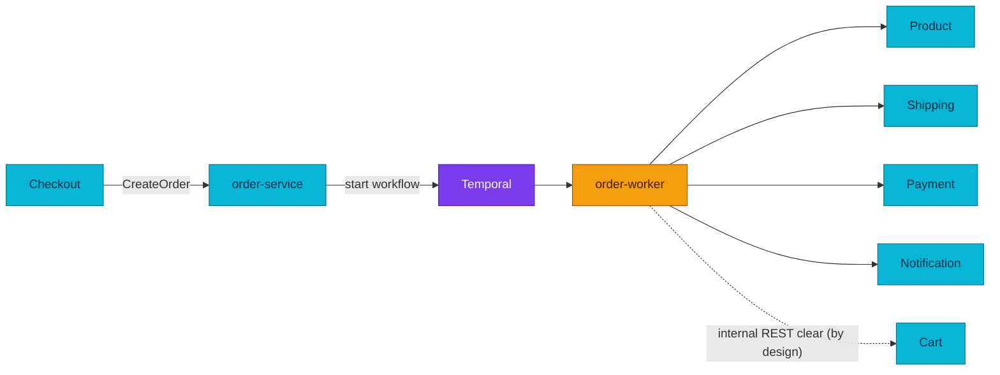

## Why Temporal?

Before this change, `order-service` committed the `orders` row and then, on **detached contexts**,
made best-effort calls to notification (gRPC) and cart-clear (REST). The consequences:

- **No durability / no retry.** If a downstream call failed (or the pod restarted mid-flight), the
  side-effect was simply **lost** — logged and forgotten. There was no record that it still needed
  doing.
- **Inventory was a TODO.** Stock was never actually decremented at checkout.
- **No shipment** was created proactively.
- **No compensation.** A partial failure (say, stock taken but shipment failed) left the system in
  an inconsistent state with no automatic rollback.

These are the textbook problems a **workflow engine** solves. Temporal gives us **durable
execution**: workflow + activity state is persisted at every step, so a crash resumes exactly where
it left off; activities retry under a policy; and the saga pattern (append a compensation as each
step succeeds, run them in reverse on failure) is expressed as ordinary, testable Go. The full
rationale and the alternatives we rejected (transactional outbox, message-queue choreography,
hand-rolled orchestration) are in **[ADR-001](../proposals/adr/ADR-001-adopt-temporal-for-order-fulfillment/)**.

## When to Use Temporal

Temporal is powerful but not free — it adds an operational dependency and a programming model.
Reach for it deliberately.

| Reach for Temporal when… | Don't — use a plain call/handler when… |
|---|---|
| A unit of work spans **multiple services/steps** and must be **all-or-nothing** with compensation (the order saga). | It's a single-service CRUD or read — a normal HTTP/gRPC handler is simpler. |
| Steps must **survive process restarts** and be **retried** until they succeed (or are compensated). | The operation is naturally idempotent and a client retry is acceptable. |
| The flow is **long-running** (waits, timers, human-in-the-loop, polling an external system). | It's a synchronous, **low-latency hot path** where the caller needs the result now. |
| You need **visibility** into in-flight/stuck executions and their history. | Fire-and-forget with at-most-once semantics is genuinely acceptable. |
| You want **exactly-once effects** via idempotency keys + durable de-dup. | A message queue + idempotent consumer already covers it and you don't need orchestration. |

Rule of thumb: **orchestration of stateful, multi-step, must-not-be-lost work → Temporal;
stateless request/response → don't.**

## The Distributed Transaction Problem

A single ACID transaction gives you all-or-nothing across everything it touches,
but only *within one database*. Our checkout spans separate databases owned by
separate services (deliberate — each service owns its data):

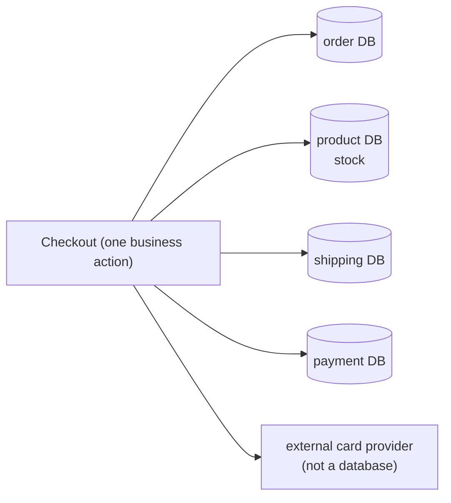

`BEGIN … COMMIT` in the order database can't roll back a stock reservation in the
product database or a charge at the card provider. We need atomicity *across*
resources — which is exactly what 2PC was designed for.

## How Two-Phase Commit Works

2PC makes a write atomic across multiple resources using a **coordinator** and two
rounds. Round 1 (**prepare**): the coordinator asks every participant "can you
commit?"; each does the work, locks the rows, writes to its log, and votes
yes/no — but does **not** commit yet. Round 2 (**commit**): if *all* voted yes, the
coordinator tells everyone to commit; if *any* voted no (or timed out), it tells
everyone to abort.

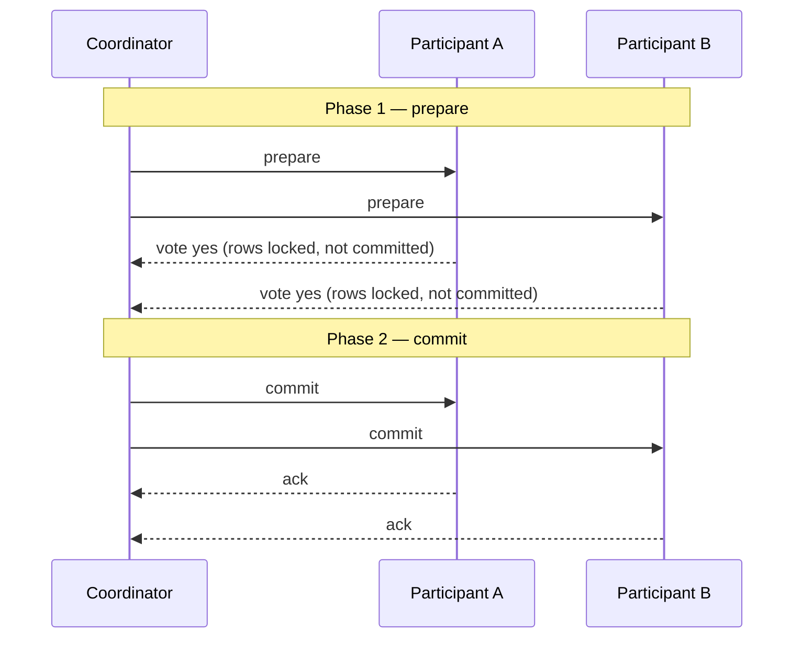

Guarantee: **atomic + immediately consistent** across all participants. This is
real and useful — inside one DB engine, or across XA resources in a single trust
domain (some RDBMS + message brokers).

## Why 2PC Does Not Fit This Platform

- **No XA across independent service databases.** 2PC needs every participant to
  speak a distributed-transaction protocol under one coordinator. Our services
  expose HTTP/gRPC APIs, not XA resource managers — there is nothing to enlist.
- **Blocking coordinator = availability hit.** Between prepare and commit, every
  participant holds locks. If the coordinator or *one* participant stalls, the
  others stay locked, waiting. This is the CAP tradeoff in the flesh: 2PC chooses
  consistency over availability, and a checkout path that locks stock + payment
  rows until a slow participant answers is exactly the stall we can't afford.
- **The card provider isn't a transactional resource.** An external payment API
  can't "prepare" a charge and hold it in a coordinator's transaction — it has its
  own auth/capture model. No amount of 2PC reaches across that boundary.
- **Tight temporal coupling.** 2PC assumes all participants are up *together* for
  the whole exchange. Microservices deploy and restart independently; a saga
  survives a participant being briefly down (the step just retries later).

The blocking problem, drawn out — one slow participant freezes everyone:

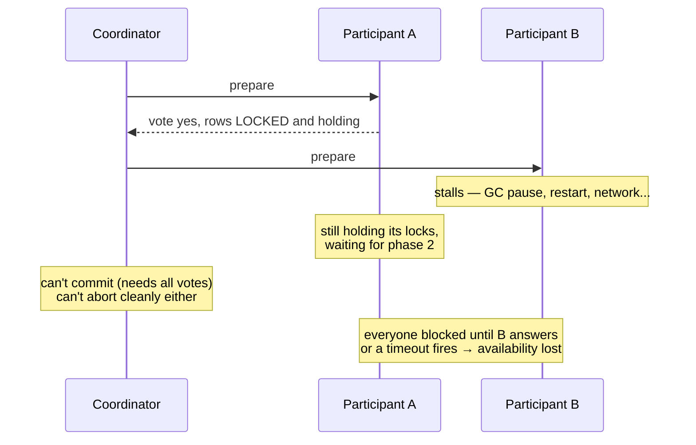

Compare that to a saga: if payment is briefly down, the `AuthorizePayment` step
just **retries later** — nothing else is holding a lock in the meantime.

So the atomic-distributed-transaction route is closed. We give up "all writes
commit together, instantly" and design for **eventual consistency** instead.

## The Saga Pattern

A **saga** is a sequence of *local* transactions. Each step commits in its own
service's database immediately. If a later step fails, the saga runs a
**compensating** transaction for each completed step, in reverse — a *semantic*
undo, not a rollback (the original commit already happened and may be visible).

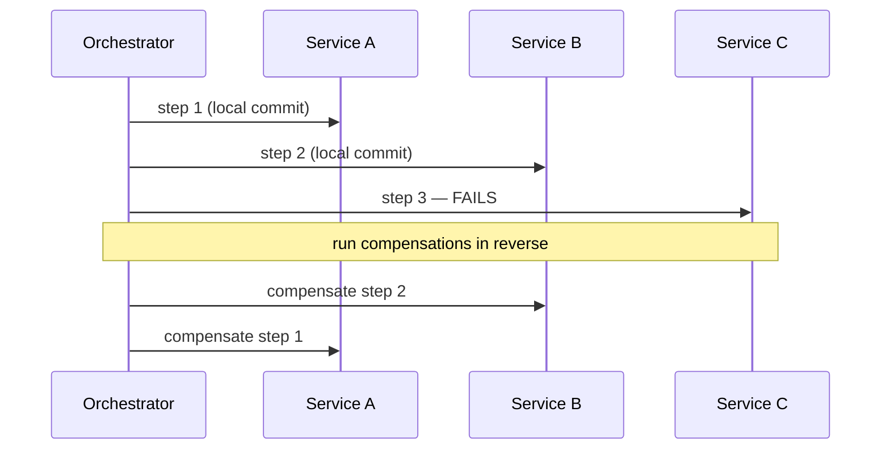

**Orchestration vs choreography.** A saga can be *choreographed* (each service
reacts to the previous one's events — no central brain) or *orchestrated* (one
component drives the steps and compensations explicitly). This platform chose
**orchestration via Temporal** — durable execution makes the orchestrator itself
crash-proof, and the flow is readable in one place. See
[ADR-001](../proposals/adr/ADR-001-adopt-temporal-for-order-fulfillment/) for why
orchestration beat choreography and a hand-rolled outbox here.

## Saga Properties: Compensation, Idempotency, and Pivot

- **Eventual consistency.** Between steps the system is *temporarily inconsistent*
  (stock reserved but order not yet confirmed). It converges — either the saga
  completes forward, or compensations return it to a consistent state.
- **Compensation ≠ rollback.** You can't `ROLLBACK` a committed local transaction
  from another service. You issue a *new* transaction that undoes its effect
  semantically. Money makes this vivid: undoing an authorized-but-uncaptured hold
  is a **void**; undoing a *captured* charge is a **refund** — different
  operations, because the money already moved.
- **Idempotency is mandatory.** Steps and compensations *will* be retried (network
  timeout, worker crash, orchestrator replay). Each must be safe to run more than
  once, or a retry double-charges / double-reserves. This is enforced by storage
  design, not hope (see the implementation section below).
- **The pivot (point of no return).** One step flips the saga from
  "still-compensatable" to "must-complete-forward". Before the pivot, failures
  compensate backward; after it, the business outcome is not rolled back; remaining work proceeds forward according to its retry policy.

The two halves of a saga, split by the pivot:

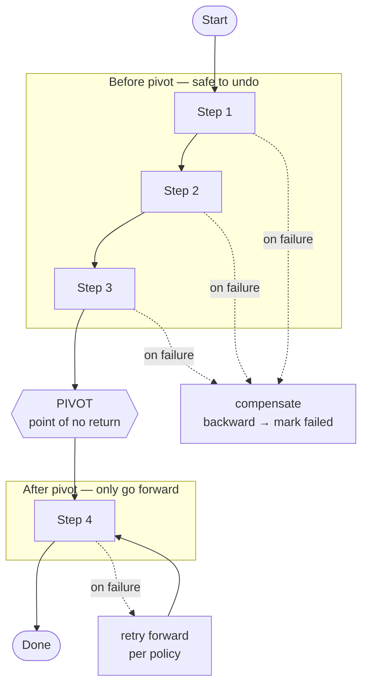

Why a pivot exists: some step commits the business outcome (here, confirming the
order after money is captured). Past that point, undoing would be worse than
finishing. The current workflow therefore never rolls back a confirmed order;
notification, receipt, and cart clearing use bounded retries and are logged if
they still fail.

## Current Order-Fulfillment Saga

### Workflow at a Glance

| # | Forward step | Service | Compensation if a later pre-pivot step fails |
|---|--------------|---------|-----------------------------------------------|
| 0 | `AuthorizePayment` | Payment | `VoidPayment` after authorization succeeds |
| 1 | `ReserveStock` | Product | `ReleaseStock` |
| 2 | `CreateShipment` | Shipping | `CancelShipment` |
| 3 | `CapturePayment` | Payment | `RefundPayment` if the following pivot fails |
| 4 | `ConfirmOrder` | Order | **Pivot**: failure compensates; success commits the business outcome |
| 5 | `SendNotification` | Notification | None; post-pivot best-effort |
| 6 | `SendReceipt` | Notification | None; post-pivot best-effort |
| 7 | `ClearCart` | Cart | None; post-pivot best-effort REST exception |

The actual execution order is important: authorize early, capture late, then
confirm the order. This fails a declined payment before reserving inventory and
keeps captured money as close as possible to the pivot.

The order-fulfillment saga (`order-service/internal/saga/workflow.go`), driven by a
Temporal worker — payment is an unconditional part of every run
(the `PAYMENT_ENABLED` rollout flag was removed in P3.exit):

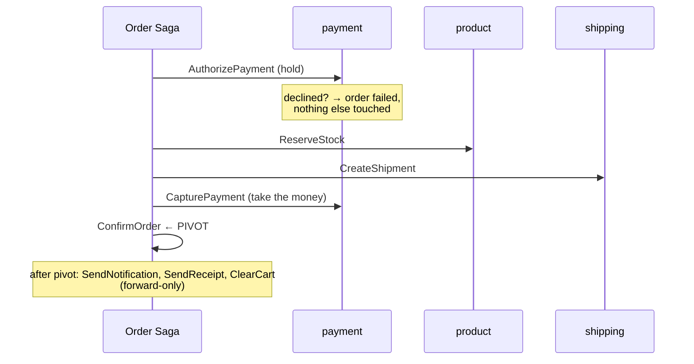

**Authorize-early / capture-late** ([ADR-009](../proposals/adr/ADR-009-saga-authorize-early-capture-late/)):
authorize first so a declined card fails fast before we reserve stock or create a
shipment; capture only immediately before the pivot, once fulfillment is secured.
Compensations are **state-dependent**:

| Failure point | Compensations (reverse order) |
|---|---|
| AuthorizePayment fails | mark order failed (nothing else done yet) |
| ReserveStock fails | VoidPayment → FailOrder |
| CreateShipment fails | ReleaseStock → VoidPayment → FailOrder |
| CapturePayment fails | CancelShipment → ReleaseStock → VoidPayment → FailOrder |
| ConfirmOrder (pivot) fails | **RefundPayment** → CancelShipment → ReleaseStock → FailOrder |

The captured-but-confirm-failed window is the reason a **refund** compensation
exists at all — capture happens one step before the pivot, so there is a small
window where money moved but the order didn't confirm.

**Compensation in action** — a concrete failure walkthrough. Say stock is
reserved and shipment created, then `CapturePayment` fails. The saga undoes the
completed steps in reverse and lands the order in `failed`:

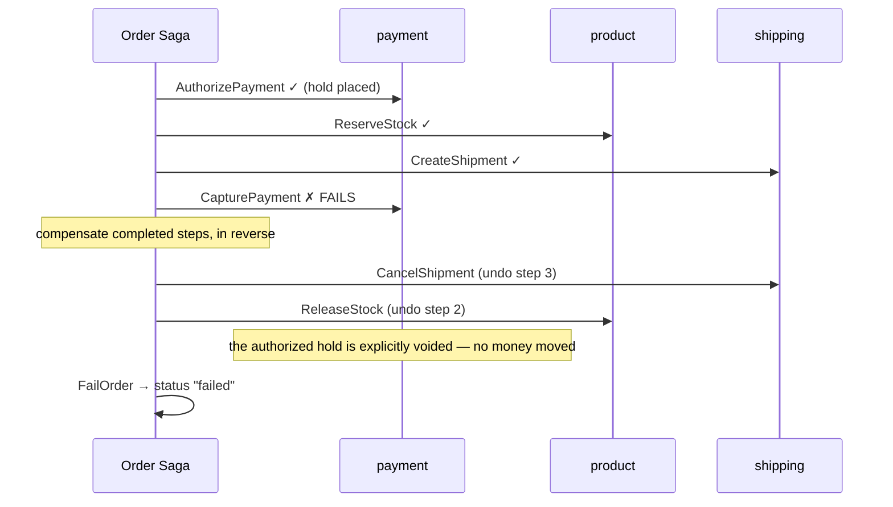

Read it top-to-bottom: three steps succeeded, the fourth failed, and each success
got a matching undo in the opposite order. Because capture never completed, **no
money moved** — the workflow explicitly voids the hold, so this is a *void* situation, not a refund.

**Payment state machine** — why "undo" means different things at different points.
The stored payment status decides whether a compensation is a void or a refund:

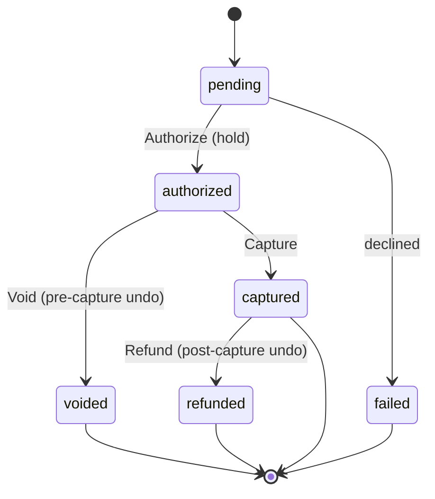

Undoing an `authorized` payment = **void** (release the hold). Undoing a
`captured` payment = **refund** (money already left the account, issue it back).
Same intent ("undo the payment"), two different operations — that's what
"compensation is a *semantic* undo, not a rollback" means in practice.

**Idempotency as a contract.** Every `payment.v1` RPC is idempotent by the
**natural business key** `order_id` (`refund:{order_id}` for refunds) — the saga
doesn't invent a client key; a retry of the same order returns the same result
instead of charging twice. Under the hood, `pkg/idempotency`
([ADR-010](../proposals/adr/ADR-010-shared-idempotency-library/)) implements a
Claim → Checkpoint → Finish state machine with a 90-second **stale-lock takeover**
so a crashed attempt can be safely re-driven against the same subject rather than
duplicated.

The idempotency claim lifecycle (`pkg/idempotency`) — how a retry is caught:

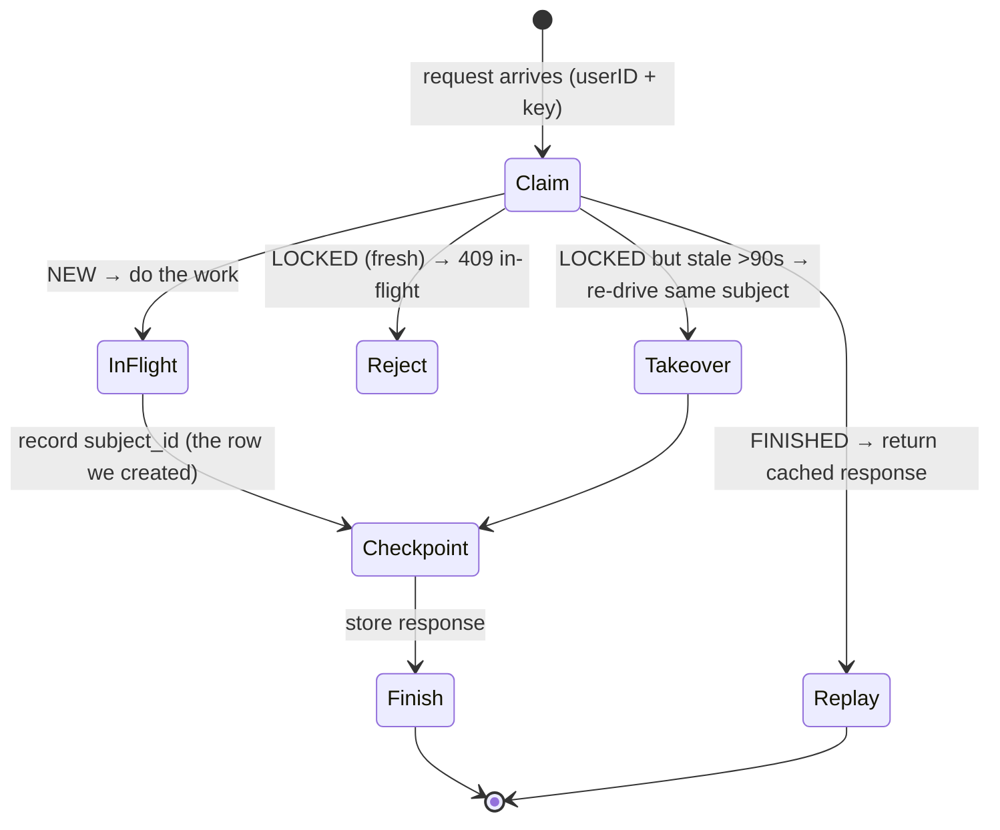

Walkthrough: the **first** call claims `(userID, key)` as NEW and does the work; a
**duplicate while it's running** hits LOCKED → 409 (don't run twice); a
**duplicate after it finished** replays the cached response (no re-charge); and if
the first worker **crashed** mid-flight, after 90s the lock is stale so a retry
*takes over* and re-drives against the same `subject_id` (the payment row already
created) instead of making a second one.

**Contract shape** (`pkg/proto/payment/v1/payment.proto`): `Authorize`, `Capture`,
`Void`, `Refund`, `GetPayment`, all keyed by `order_id`, money in `amount_minor`
(int64 cents). A provider **decline is a normal response** (`status="failed"` +
`decline_code`), *not* a gRPC error — the saga distinguishes a business rejection
(don't retry) from an infra error (retry). On the HTTP surface the money errors map
to stable codes: `PAYMENT_DECLINED` (422), `PAYMENT_EXISTS` (409),
`INVALID_TRANSITION` (409), `REFUND_EXCEEDS_CAPTURE` (409), `IDEMPOTENCY_CONFLICT`
(409). Durability of "exactly-once effect" also leans on the transactional
**outbox** + append-only **double-entry ledger** (see [RFC-0010](../proposals/rfc/RFC-0010/)).

**The deployed payment system.** Putting the pieces together — this is what
actually runs (order namespace ↔ payment namespace, fenced by NetworkPolicy):

```mermaid
flowchart TB
    subgraph order_ns["order namespace"]
        OW["order-worker<br/>Temporal saga"]
    end
    subgraph payment_ns["payment namespace"]
        PGRPC["payment :9090 gRPC<br/>Authorize · Capture · Void · Refund · GetPayment"]
        PHTTP["payment :8080 HTTP<br/>webhook receiver · internal recon API"]
        PLOGIC["logic/v1<br/>state machine · idempotency · ledger posting"]
        PDB[("payment DB<br/>payments · refunds<br/>ledger (double-entry)<br/>outbox · webhook_events<br/>reconciliation_runs/discrepancies")]
        MP["mockpay<br/>(provider, subcommand)"]
        RELAY["outbox relay<br/>(publish events)"]
        RECON["reconciliation<br/>ticker 5 min"]
        PGRPC --> PLOGIC
        PHTTP --> PLOGIC
        PLOGIC --> PDB
        PLOGIC -->|"POST /charges · capture · void · refunds"| MP
        MP -->|"signed webhook (HMAC-SHA256)"| PHTTP
        RELAY --> PDB
        RECON -->|"GET /transactions"| MP
        RECON --> PDB
    end
    OW -->|"gRPC :9090 (saga money ops)"| PGRPC
    KONG["Kong gateway"] -->|"/payment/v1/public/payments/webhooks/mockpay"| PHTTP

    classDef db fill:#1a1a1a,stroke:#3b82f6;
    class PDB db;
```

How to read it against the theory above:

1. **The saga talks gRPC**, not HTTP — `order-worker` calls `payment:9090`
   Authorize/Capture/Void/Refund. This is the east-west transport; only the order
   namespace is allowed onto `:9090` (NetworkPolicy — [payments.md](./payments.md)).
2. **HTTP + gRPC share one logic layer** — the state machine, idempotency, and
   ledger posting live in `logic/v1`, so both transports enforce the same money
   invariants (they can't drift).
3. **The provider is asynchronous** — `payment` calls `mockpay` to charge, and
   `mockpay` answers *later* via a signed (HMAC) **webhook** back to the public
   receiver. That async confirmation is exactly why the saga holds (authorize) and
   captures separately rather than expecting an instant answer.
4. **Two safety nets for eventual consistency** — the **outbox relay** publishes
   domain events durably (at-least-once), and the **reconciliation** ticker
   compares the ledger against the provider's `GET /transactions` every 5 minutes
   to *detect* drift the happy path missed (detect-only v1 — [payments.md](./payments.md)).
   These are how a saga stays trustworthy without a coordinator guaranteeing
   atomicity.

### Retry and Timeout Policy

| Setting | Value | Purpose |
|---------|-------|---------|
| Activity timeout | `StartToCloseTimeout: 30s` | Bound one execution attempt |
| Initial retry interval | `1s` | Recover quickly from short transient failures |
| Backoff coefficient | `2.0` | Reduce pressure on an unhealthy dependency |
| Maximum interval | `30s` | Cap the delay between attempts |
| Maximum attempts | `5` | Prevent endless activity retry loops |
| Business rejection | Non-retryable Temporal application error | Compensate immediately for conditions such as insufficient stock |

Transport retries and Temporal activity retries do not replace idempotency.
Every activity may have committed even when its response was lost.

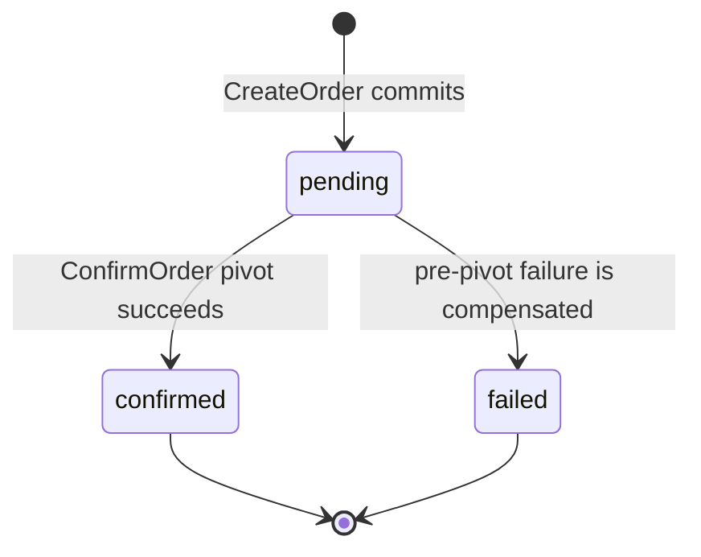

## 2PC vs Saga Tradeoffs

| Dimension | Two-phase commit | Saga (ours) |
|---|---|---|
| Consistency | Immediate, atomic across all | **Eventual** (converges via compensations) |
| Availability | Low — blocking coordinator holds locks | High — steps are independent, retryable |
| Coupling | Tight — all participants up together | Loose — survives a participant being down |
| Failure model | Abort → everyone rolls back | Compensate completed steps in reverse |
| External services | Can't enlist a non-XA card API | First-class — a step is just an API call |
| Complexity cost | Coordinator + XA plumbing | Compensations + idempotency + orchestration |
| Visibility | Opaque coordinator state | Every step/compensation is a durable event |

## When 2PC Is the Better Choice

Sagas aren't universally "better" — they're the right tool when data is spread
across independent services. Reach for a single ACID transaction or 2PC when:

- All the data lives in **one database** — just use a normal transaction (no saga
  needed, no eventual consistency to reason about).
- You have genuinely **XA-capable resources in one trust domain** (e.g. an RDBMS +
  an XA message broker) and need strict immediate consistency.
- The cost of temporary inconsistency is unacceptable *and* the availability hit of
  blocking is acceptable — rare in user-facing paths, sometimes true in back-office
  batch systems.

A quick decision aid:

```mermaid
flowchart TD
    Q1{"All data in<br/>ONE database?"}
    Q1 -->|yes| T["Single ACID transaction<br/>(no saga, no 2PC)"]
    Q1 -->|no| Q2{"All participants<br/>XA-capable in one<br/>trust domain?"}
    Q2 -->|"yes + need strict<br/>immediate consistency"| TPC["Two-phase commit<br/>(accept the blocking cost)"]
    Q2 -->|"no — separate services<br/>or an external API"| SAGA["Saga<br/>local txns + compensations"]

    classDef pick fill:#052e1a,stroke:#22c55e;
    class SAGA pick;
```

If you're crossing service boundaries or touching a third-party API, the saga is
almost always the answer (the green path) — which is why it's the shape of every
cross-service business action on this platform.

## Contracts and the Checkout Flow

New east-west contracts in [`duynhlab/pkg`](https://github.com/duynhlab/pkg) (`pkg/proto`, `buf`,
tagged `v0.7.0`), all **idempotent** so activity retries are safe:

- **product** — `ReserveStock(reservation_id, items)` · `ReleaseStock(reservation_id, items)`.
- **shipping** — `CreateShipment(order_id, address)` · `CancelShipment(order_id)`.
- **`pkg/temporalx`** — shared Temporal client + worker bootstrap (mirrors `grpcx`/`obsx`) with the
  OpenTelemetry tracing interceptor, so workflow/activity spans join the originating request's trace.

**Checkout is async.** `CreateOrder` commits the order and returns **`201 pending`** immediately;
the SPA shows "Processing…" and polls `GET /order/v1/private/orders/:id` for `confirmed`/`failed`.
The request does **not** block on the saga — retries can take seconds–minutes, blocking would couple
user latency to downstream health, and an API-pod restart would lose the response while the durable
workflow keeps running. *(Future nicety: Temporal **Update-With-Start** could return an early
"stock reserved" ack in the initial call.)*

## Temporal Infrastructure

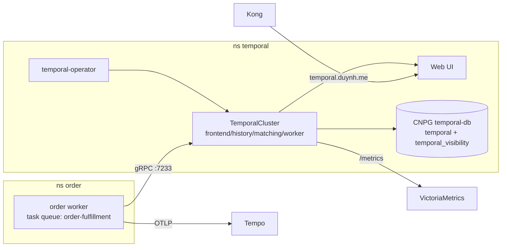

Deployed via the **`alexandrevilain/temporal-operator`** (see **[ADR-002](../proposals/adr/ADR-002-deploy-temporal-via-operator/)** for why the operator over the official Helm chart, and the server-version constraint):

- **Operator** — `controllers/temporal/` holds the `HelmRelease` (chart `0.6.0`; its `HelmRepository` source lives in `clusters/local/sources/helm/`); installs the `TemporalCluster`/`TemporalNamespace` CRDs; webhook certs via cert-manager.
- **`TemporalCluster` + `mop` `TemporalNamespace`** (retention 168h) — `configs/temporal/`: server **`1.24.2`** (target 1.27.x — ADR-002), `numHistoryShards: 512`, persistence → `temporal-db` (default + `temporal_visibility`) via the **CNPG-generated `temporal-db-app`** secret, `ui.enabled`, `admintools.enabled`, `metrics.prometheus.scrapeConfig.serviceMonitor.enabled`, resources set on every operator-created pod for Kyverno.
- **`temporal-db`** — `configs/databases/clusters/temporal-db/`: a CloudNativePG cluster with the two SQL stores. Single instance for now (Temporal HA is at the service layer); scaling + Barman backups are a follow-up.
- **Edge & alerts** — Kong ingress `temporal.duynh.me`; `TemporalServerDown` + service/persistence error-rate `PrometheusRule`s (`configs/temporal/prometheusrule.yaml`).
- **Flux order** — `controllers → temporal-operator` (the operator HelmRelease `dependsOn` cert-manager, since its chart renders a cert-manager `Certificate`/`Issuer` for the admission webhook); `databases → temporal-db`; a `temporal` Kustomization (`dependsOn` controllers, cert-manager, databases, monitoring) before `apps`; the order worker `dependsOn` temporal.

## Deploy and Run It

- **Worker mode.** Each owning service ships a **`worker` subcommand** (mirrors `migrate`); it dials
  Temporal + the downstreams, registers the workflow/activities, and polls the task queue. It also
  serves `/health` and `/ready` (the process has no application HTTP API, but
  still needs liveness and readiness probes). Worker metrics export over OTLP.
- **In-cluster.** The worker is a **second release of the same `mop` chart** (`duynhlab/helm-charts`,
  ≥`0.12.0`): same image, `args: ["worker"]`, `service.enabled: false`. In homelab it's the
  `order-worker` HelmRelease (`kubernetes/apps/order-worker.yaml`, namespace `order`) carrying the
  order DB + downstream addresses + `TEMPORAL_HOSTPORT` / `TEMPORAL_NAMESPACE` / `TASK_QUEUE` /
  `PRODUCT_GRPC_ADDR`. `apps-local` `dependsOn` `temporal-local` so it deploys after the cluster is
  Ready. (Earlier drafts used a `worker.enabled` chart toggle; the chart was reworked to the
  separate-release model.)
- **Locally.** `local-stack/compose.yaml` runs a `temporalio/temporal` dev server (frontend `:7233`,
  Web UI `:8233`) + an `order-worker` container; `docker compose up -d --build` then a checkout
  exercises the live saga.

## Operations and Observability

- **Temporal Web UI** — `temporal.duynh.me` (cluster) / `localhost:8233` (local-stack): every
  execution, its inputs, history, retries, and failures.
- **Metrics** — the operator scrapes Temporal **server** metrics via a `ServiceMonitor`; alerts:
  `TemporalServerDown`, `TemporalServiceErrorRateHigh`, `TemporalPersistenceErrorRateHigh`
  (`configs/temporal/prometheusrule.yaml`). The worker pushes activity, gRPC
  RED, and Go-runtime metrics over OTLP; it has no application `/metrics` scrape endpoint.
- **Failure handling** — insufficient stock fails fast (non-retryable) and compensates; transient
  downstream errors retry per policy; a stuck workflow is visible (and terminable) in the UI.

## As-Built Notes and Roadmap

Deliberate deviations from the original design:

- **Pivot = ConfirmOrder** (see §4); post-pivot steps are best-effort.
- **Workflow start is centralized in `internal/fulfillment`** (RFC-0015 P2, ADR-018): both the web
  handler and the gRPC `CreateOrder` server delegate to the same starter, so the logic layer stays
  Temporal-free. If Temporal is unavailable the order is still created (`pending`) and the start is
  logged — order creation never fails on Temporal.
- **`ClearCart` uses cart's tokenless internal route** (`DELETE /cart/v1/internal/cart/:userId`,
  NetworkPolicy-fenced) — the workflow input carries no bearer token, so a saga that outlives the
  user's access token still clears the cart.
- **Idempotency is DB-enforced** — product `stock_reservations` (PK `reservation_id,product_id`),
  shipping `UNIQUE(order_id)`.

**Roadmap / planned (⏳):** tracked as **Future work in [RFC-0001](../proposals/rfc/RFC-0001/)** —
server bump 1.27.x, Grafana dashboard, temporal-db HA + Barman backups, and
GameDay drills. Already shipped from that list: cache-bust on reserve
(ReserveStock/ReleaseStock invalidate `product:{id}`), workflow/activity RED
metrics (`pkg/temporalx` MetricsHandler), and the internal cart-clear (as-built
notes above).

## References

- [api.md](./api.md) — shared HTTP and gRPC behavior
- [order.md](./order.md) — order contract and workflow handoff
- [product.md](./product.md) · [shipping.md](./shipping.md) · [notification.md](./notification.md) — participating service contracts
- [payments.md](./payments.md) — payment state, ledger, and reconciliation
- [ADR-001](../proposals/adr/ADR-001-adopt-temporal-for-order-fulfillment/) — adopt Temporal
- [ADR-009](../proposals/adr/ADR-009-saga-authorize-early-capture-late/) — authorize early and capture late
- [ADR-010](../proposals/adr/ADR-010-shared-idempotency-library/) — shared idempotency state machine
- [RFC-0010](../proposals/rfc/RFC-0010/) — payment and fulfillment design

_Last updated: 2026-07-14_
