# Temporal Workflows

Three Temporal workflows make the platform's cross-service transactions durable,
retryable, observable and compensatable — and one of them exists purely to notice
when a shopper stopped.

| Attribute | Value | RFC / ADR |
|-----------|-------|-----------|
| **Status** | Implemented — all three verified end-to-end in local-stack; Temporal and both workers are deployed in the cluster | — |
| **Scope** | Saga and 2PC concepts, then each of the three workflows as built, then the machinery they share | — |
| **Workflows** | `OrderFulfillmentWorkflow` · `CancellationWorkflow` (order-service) · `AbandonedCheckoutWorkflow` (checkout-service) | — |
| **Task queues** | `order-fulfillment` (both order workflows) · `checkout` | — |
| **Namespace** | `mop` | — |
| **Registry** | [workflows.md](./workflows.md) — the one-line index of every workflow | — |
| **Design record** | — | [RFC-0021](../proposals/rfc/RFC-0021/) (stock participant, worker versioning, start outbox) · [ADR-001](../proposals/adr/ADR-001-adopt-temporal-for-order-fulfillment/) · [ADR-002](../proposals/adr/ADR-002-deploy-temporal-via-operator/) · [ADR-009](../proposals/adr/ADR-009-saga-authorize-early-capture-late/) · [ADR-030](../proposals/adr/ADR-030-temporal-workflow-versioning/) · [ADR-031](../proposals/adr/ADR-031-fulfillment-start-outbox/) · [ADR-039](../proposals/adr/ADR-039-local-stack-temporal-server-postgres/) (local topology on Postgres) · [RFC-0026](../proposals/rfc/RFC-0026/) · [ADR-054](../proposals/adr/ADR-054-temporal-worker-controller/) (worker lifecycle) |

## Overview

One order touches independent order, product, shipping, and payment databases,
plus an external payment provider. A normal database transaction cannot cover
all of them. The platform therefore uses an orchestrated Saga: each service
commits locally, Temporal records durable progress, and failures before the
pivot trigger compensating actions in reverse.

That saga is the biggest of the three workflows here, but not the only one. This
page is the deep dive for all three: the order fulfilment saga, the cancellation
unwind that gives back what it took, and the checkout timer that expires an
abandoned session. The one-line index of them lives in
[workflows.md](./workflows.md).

| Before Temporal | With the current Saga |
|-----------------|-----------------------|
| Post-commit side effects could be lost after a pod restart | Workflow history resumes from durable state |
| Stock reservation was incomplete | Product reserves and releases stock idempotently |
| Partial work had no automatic undo | Shipping, stock, and payment have compensations |
| A caller could not inspect in-flight work | Temporal UI, traces, logs, and metrics expose execution |
| Request latency could depend on every downstream | Checkout confirm returns **201**; order row is **`pending`**; fulfillment continues asynchronously |
| A crash between committing the order and starting the workflow stranded it `pending` forever | The order and the intent to start commit **together**; a dispatcher retries what the inline start could not do ([ADR-031](../proposals/adr/ADR-031-fulfillment-start-outbox/)) |

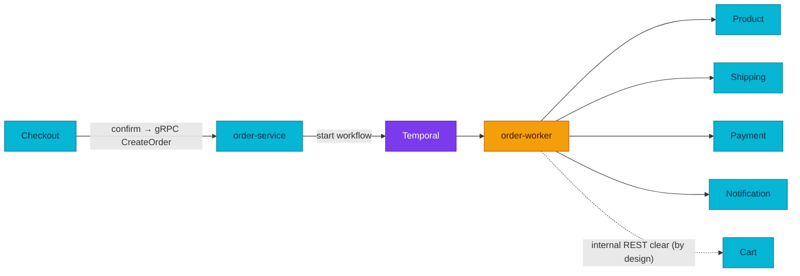
```mermaid
flowchart LR
    Checkout -->|"confirm → gRPC CreateOrder"| Order["order-service"]
    Order -->|"start workflow"| Temporal
    Temporal --> Worker["order-worker"]
    Worker --> Product
    Worker --> Shipping
    Worker --> Payment
    Worker --> Notification
    Worker -.->|"internal REST clear (by design)"| Cart

    classDef service fill:#06b6d4,color:#082f49,stroke:#0e7490;
    classDef worker fill:#f59e0b,color:#451a03,stroke:#b45309;
    classDef platform fill:#7c3aed,color:#fff,stroke:#5b21b6;
    class Checkout,Order,Product,Shipping,Payment,Notification,Cart service;
    class Worker worker;
    class Temporal platform;
```

## Contents

**[Part 1 — Learn](#part-1--learn)** — why an order needs a saga at all: the
distributed-transaction problem, how 2PC works and why it does not fit here, and
the saga properties this platform leans on. Read once; it does not change.

**[Part 2 — As-built](#part-2--as-built)** — the three workflows that actually
run, one section each, then the machinery they share.

| Workflow | Owner | What it is for |
|----------|-------|----------------|
| [`OrderFulfillmentWorkflow`](#orderfulfillmentworkflow) | order | Turn a committed order into money taken, stock committed and a shipment created — or undo all of it |
| [`CancellationWorkflow`](#cancellationworkflow) | order | Give back what a cancelled order took, and never settle silently when it cannot |
| [`AbandonedCheckoutWorkflow`](#abandonedcheckoutworkflow) | checkout | Expire a checkout session that the shopper walked away from |

Shared machinery: [how the saga gets started](#how-the-saga-gets-started) ·
[the stock participant](#the-stock-participant-rfc-0021-p3-narrowed-by-p4) ·
[the inventory reconciler](#the-inventory-reconciler) ·
[contracts](#contracts-and-the-checkout-flow) ·
[infrastructure](#temporal-infrastructure) ·
[worker versioning](#worker-deployment-versioning-as-built) ·
[notes and roadmap](#as-built-notes-and-roadmap)

**[Part 3 — Operations](#part-3--operations)** — running the workers, and where
the alerts and runbooks live.

## Part 1 — Learn

Theory first: why a workflow engine at all, why not a distributed transaction,
and what a saga actually guarantees. Everything here is general — the
platform-specific implementation follows in [Part 2](#part-2--as-built).

### Why Temporal?

Before this change, `order-service` committed the `orders` row and then, on **detached contexts**,
made best-effort calls to notification (gRPC) and cart-clear (REST). The consequences:

- **No durability / no retry.** If a downstream call failed (or the pod restarted mid-flight), the
  side-effect was simply **lost** — logged and forgotten. There was no record that it still needed
  doing.
- **Inventory was a TODO.** Stock was never actually decremented at checkout.
- **No shipment** was created proactively.
- **No compensation.** A partial failure (say, stock taken but shipment failed) left the system in
  an inconsistent state with no automatic rollback.

These are the textbook problems a **workflow engine** solves. Temporal gives us **durable
execution**: workflow + activity state is persisted at every step, so a crash resumes exactly where
it left off; activities retry under a policy; and the saga pattern (append a compensation as each
step succeeds, run them in reverse on failure) is expressed as ordinary, testable Go. The full
rationale and the alternatives we rejected (transactional outbox, message-queue choreography,
hand-rolled orchestration) are in **[ADR-001](../proposals/adr/ADR-001-adopt-temporal-for-order-fulfillment/)**.

### When to Use Temporal

Temporal is powerful but not free — it adds an operational dependency and a programming model.
Reach for it deliberately.

| Reach for Temporal when… | Don't — use a plain call/handler when… |
|---|---|
| A unit of work spans **multiple services/steps** and must be **all-or-nothing** with compensation (the order saga). | It's a single-service CRUD or read — a normal HTTP/gRPC handler is simpler. |
| Steps must **survive process restarts** and be **retried** until they succeed (or are compensated). | The operation is naturally idempotent and a client retry is acceptable. |
| The flow is **long-running** (waits, timers, human-in-the-loop, polling an external system). | It's a synchronous, **low-latency hot path** where the caller needs the result now. |
| You need **visibility** into in-flight/stuck executions and their history. | Fire-and-forget with at-most-once semantics is genuinely acceptable. |
| You want **exactly-once effects** via idempotency keys + durable de-dup. | A message queue + idempotent consumer already covers it and you don't need orchestration. |

Rule of thumb: **orchestration of stateful, multi-step, must-not-be-lost work → Temporal;
stateless request/response → don't.**

### The Distributed Transaction Problem

A single ACID transaction gives you all-or-nothing across everything it touches,
but only *within one database*. Our checkout spans separate databases owned by
separate services (deliberate — each service owns its data):

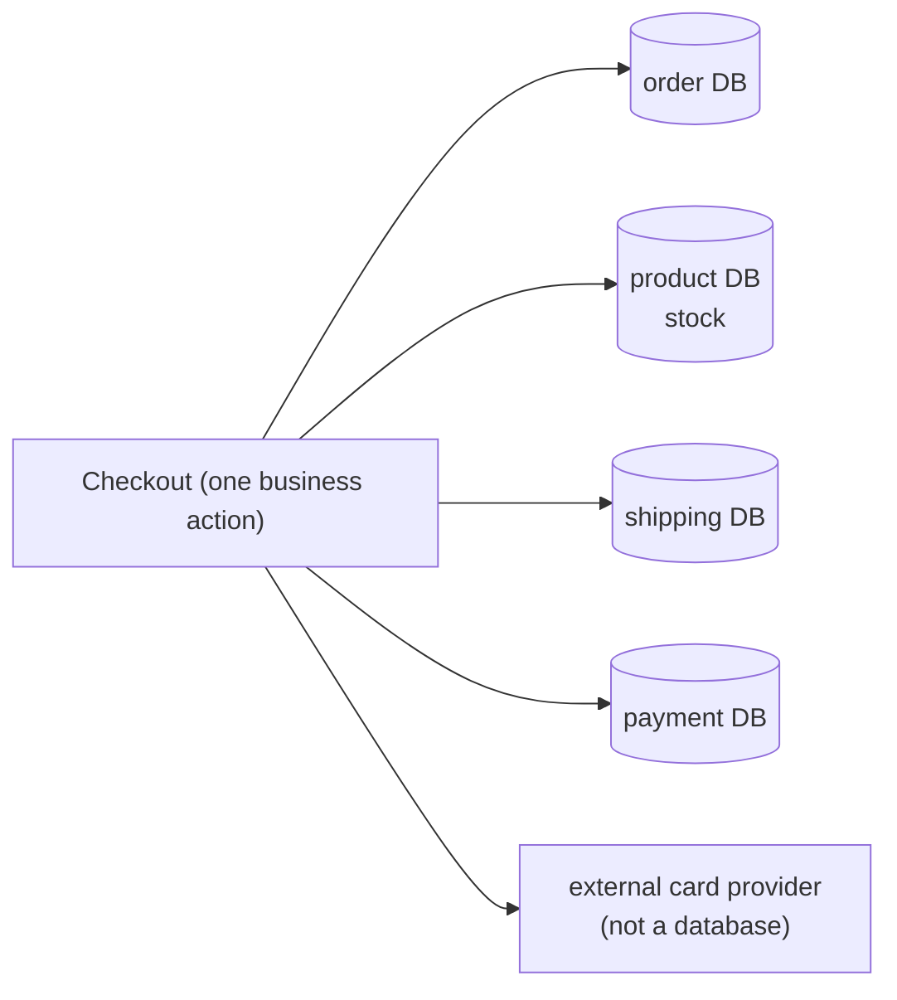
```mermaid
flowchart LR
    Checkout["Checkout (one business action)"]
    Checkout --> O[("order DB")]
    Checkout --> P[("product DB<br/>stock")]
    Checkout --> S[("shipping DB")]
    Checkout --> Pay[("payment DB")]
    Checkout --> Prov["external card provider<br/>(not a database)"]
```

`BEGIN … COMMIT` in the order database can't roll back a stock reservation in the
product database or a charge at the card provider. We need atomicity *across*
resources — which is exactly what 2PC was designed for.

### How Two-Phase Commit Works

2PC makes a write atomic across multiple resources using a **coordinator** and two
rounds. Round 1 (**prepare**): the coordinator asks every participant "can you
commit?"; each does the work, locks the rows, writes to its log, and votes
yes/no — but does **not** commit yet. Round 2 (**commit**): if *all* voted yes, the
coordinator tells everyone to commit; if *any* voted no (or timed out), it tells
everyone to abort.

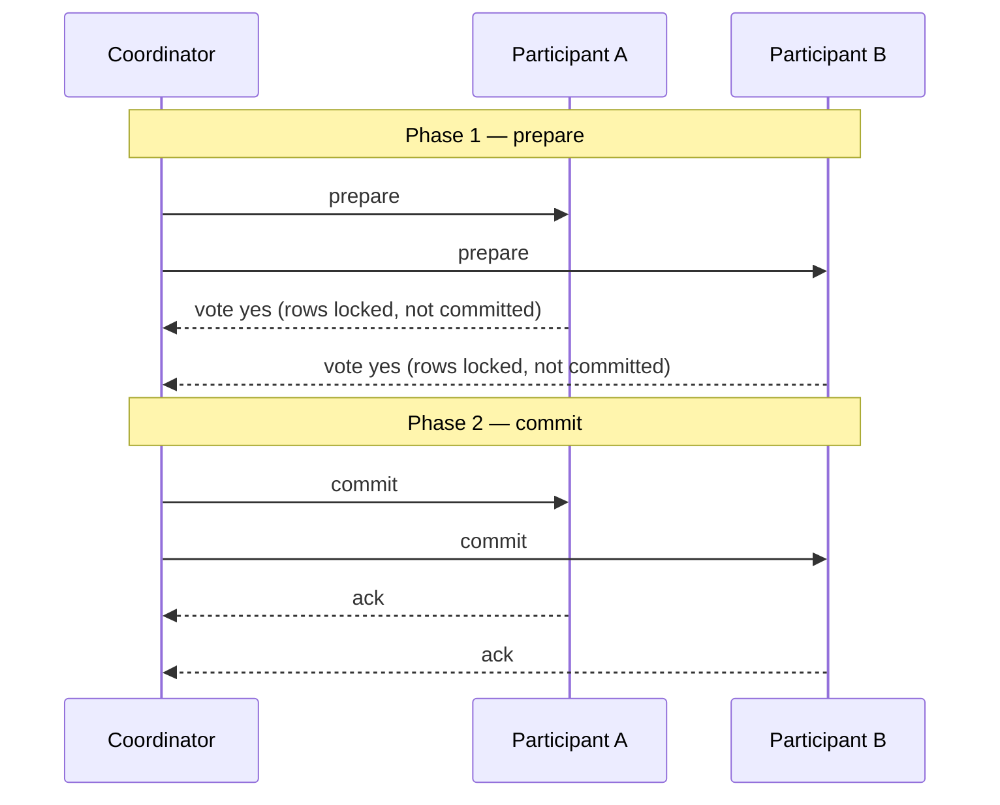
```mermaid
sequenceDiagram
    participant C as Coordinator
    participant A as Participant A
    participant B as Participant B
    Note over C,B: Phase 1 — prepare
    C->>A: prepare
    C->>B: prepare
    A-->>C: vote yes (rows locked, not committed)
    B-->>C: vote yes (rows locked, not committed)
    Note over C,B: Phase 2 — commit
    C->>A: commit
    C->>B: commit
    A-->>C: ack
    B-->>C: ack
```

Guarantee: **atomic + immediately consistent** across all participants. This is
real and useful — inside one DB engine, or across XA resources in a single trust
domain (some RDBMS + message brokers).

### Why 2PC Does Not Fit This Platform

- **No XA across independent service databases.** 2PC needs every participant to
  speak a distributed-transaction protocol under one coordinator. Our services
  expose HTTP/gRPC APIs, not XA resource managers — there is nothing to enlist.
- **Blocking coordinator = availability hit.** Between prepare and commit, every
  participant holds locks. If the coordinator or *one* participant stalls, the
  others stay locked, waiting. This is the CAP tradeoff in the flesh: 2PC chooses
  consistency over availability, and a checkout path that locks stock + payment
  rows until a slow participant answers is exactly the stall we can't afford.
- **The card provider isn't a transactional resource.** An external payment API
  can't "prepare" a charge and hold it in a coordinator's transaction — it has its
  own auth/capture model. No amount of 2PC reaches across that boundary.
- **Tight temporal coupling.** 2PC assumes all participants are up *together* for
  the whole exchange. Microservices deploy and restart independently; a saga
  survives a participant being briefly down (the step just retries later).

The blocking problem, drawn out — one slow participant freezes everyone:

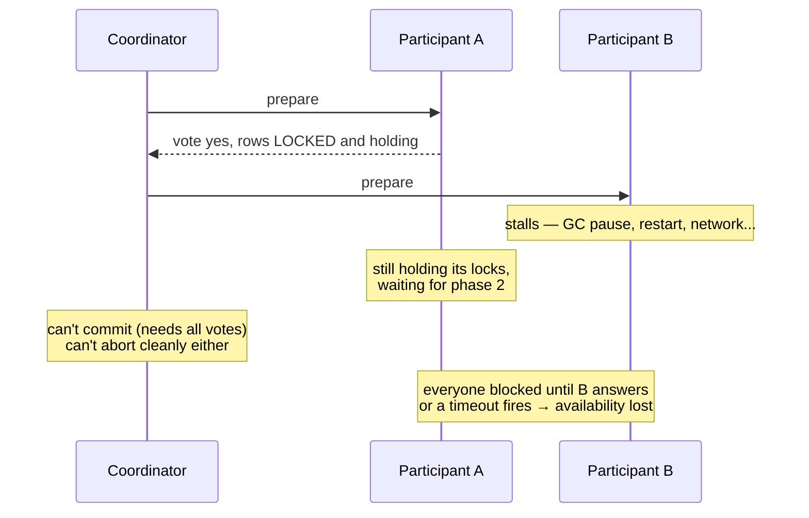
```mermaid
sequenceDiagram
    participant C as Coordinator
    participant A as Participant A
    participant B as Participant B
    C->>A: prepare
    A-->>C: vote yes, rows LOCKED and holding
    C->>B: prepare
    Note over B: stalls — GC pause, restart, network...
    Note over A: still holding its locks,<br/>waiting for phase 2
    Note over C: can't commit (needs all votes)<br/>can't abort cleanly either
    Note over A,B: everyone blocked until B answers<br/>or a timeout fires → availability lost
```

Compare that to a saga: if payment is briefly down, the `AuthorizePayment` step
just **retries later** — nothing else is holding a lock in the meantime.

So the atomic-distributed-transaction route is closed. We give up "all writes
commit together, instantly" and design for **eventual consistency** instead.

### The Saga Pattern

A **saga** is a sequence of *local* transactions. Each step commits in its own
service's database immediately. If a later step fails, the saga runs a
**compensating** transaction for each completed step, in reverse — a *semantic*
undo, not a rollback (the original commit already happened and may be visible).

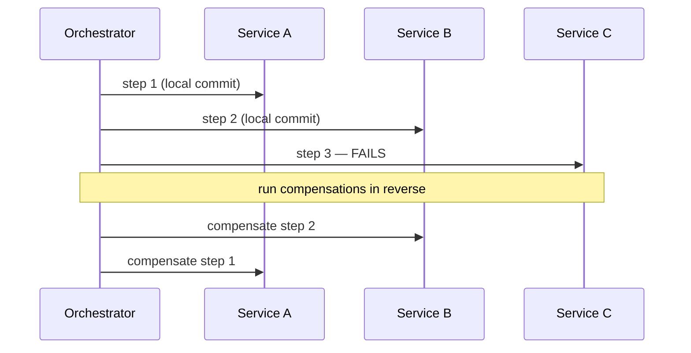
```mermaid
sequenceDiagram
    participant Orch as Orchestrator
    participant S1 as Service A
    participant S2 as Service B
    participant S3 as Service C
    Orch->>S1: step 1 (local commit)
    Orch->>S2: step 2 (local commit)
    Orch->>S3: step 3 — FAILS
    Note over Orch,S3: run compensations in reverse
    Orch->>S2: compensate step 2
    Orch->>S1: compensate step 1
```

**Orchestration vs choreography.** A saga can be *choreographed* (each service
reacts to the previous one's events — no central brain) or *orchestrated* (one
component drives the steps and compensations explicitly). This platform chose
**orchestration via Temporal** — durable execution makes the orchestrator itself
crash-proof, and the flow is readable in one place. See
[ADR-001](../proposals/adr/ADR-001-adopt-temporal-for-order-fulfillment/) for why
orchestration beat choreography and a hand-rolled outbox here.

### Saga Properties: Compensation, Idempotency, and Pivot

- **Eventual consistency.** Between steps the system is *temporarily inconsistent*
  (stock reserved but order not yet confirmed). It converges — either the saga
  completes forward, or compensations return it to a consistent state.
- **Compensation ≠ rollback.** You can't `ROLLBACK` a committed local transaction
  from another service. You issue a *new* transaction that undoes its effect
  semantically. Money makes this vivid: undoing an authorized-but-uncaptured hold
  is a **void**; undoing a *captured* charge is a **refund** — different
  operations, because the money already moved.
- **Idempotency is mandatory.** Steps and compensations *will* be retried (network
  timeout, worker crash, orchestrator replay). Each must be safe to run more than
  once, or a retry double-charges / double-reserves. This is enforced by storage
  design, not hope (see [Part 2](#part-2--as-built)).
- **The pivot (point of no return).** One step flips the saga from
  "still-compensatable" to "must-complete-forward". Before the pivot, failures
  compensate backward; after it, the business outcome is not rolled back; remaining work proceeds forward according to its retry policy.

The two halves of a saga, split by the pivot:

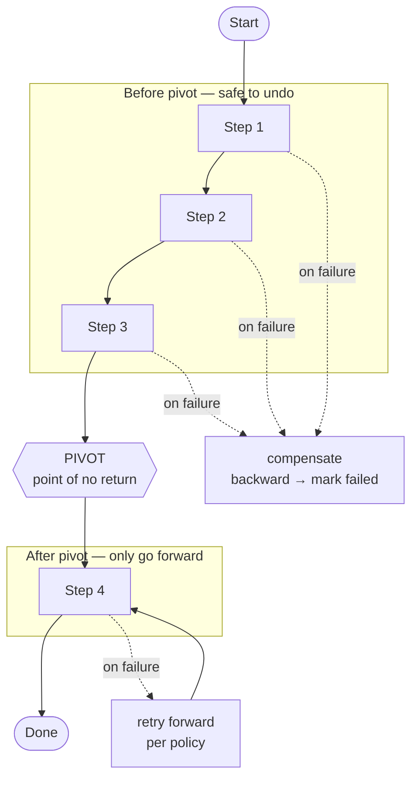
```mermaid
flowchart TD
    Start([Start]) --> S1[Step 1]
    S1 --> S2[Step 2]
    S2 --> S3[Step 3]
    S3 --> Pivot{{"PIVOT<br/>point of no return"}}
    Pivot --> S4[Step 4]
    S4 --> Done([Done])
    S1 -. on failure .-> Comp["compensate<br/>backward → mark failed"]
    S2 -. on failure .-> Comp
    S3 -. on failure .-> Comp
    S4 -. on failure .-> Retry["retry forward<br/>per policy"]
    Retry --> S4
    subgraph before ["Before pivot — safe to undo"]
        S1
        S2
        S3
    end
    subgraph after ["After pivot — only go forward"]
        S4
    end
```

Why a pivot exists: some step commits the business outcome (here, confirming the
order after money is captured). Past that point, undoing would be worse than
finishing. The current workflow therefore never rolls back a confirmed order;
notification, receipt, and cart clearing use bounded retries and are logged if
they still fail.

### 2PC vs Saga Tradeoffs

| Dimension | Two-phase commit | Saga (ours) |
|---|---|---|
| Consistency | Immediate, atomic across all | **Eventual** (converges via compensations) |
| Availability | Low — blocking coordinator holds locks | High — steps are independent, retryable |
| Coupling | Tight — all participants up together | Loose — survives a participant being down |
| Failure model | Abort → everyone rolls back | Compensate completed steps in reverse |
| External services | Can't enlist a non-XA card API | First-class — a step is just an API call |
| Complexity cost | Coordinator + XA plumbing | Compensations + idempotency + orchestration |
| Visibility | Opaque coordinator state | Every step/compensation is a durable event |

### When 2PC Is the Better Choice

Sagas aren't universally "better" — they're the right tool when data is spread
across independent services. Reach for a single ACID transaction or 2PC when:

- All the data lives in **one database** — just use a normal transaction (no saga
  needed, no eventual consistency to reason about).
- You have genuinely **XA-capable resources in one trust domain** (e.g. an RDBMS +
  an XA message broker) and need strict immediate consistency.
- The cost of temporary inconsistency is unacceptable *and* the availability hit of
  blocking is acceptable — rare in user-facing paths, sometimes true in back-office
  batch systems.

A quick decision aid:

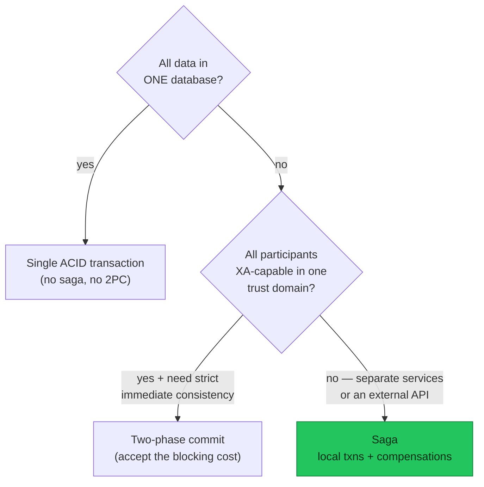
```mermaid
flowchart TD
    Q1{"All data in<br/>ONE database?"}
    Q1 -->|yes| T["Single ACID transaction<br/>(no saga, no 2PC)"]
    Q1 -->|no| Q2{"All participants<br/>XA-capable in one<br/>trust domain?"}
    Q2 -->|"yes + need strict<br/>immediate consistency"| TPC["Two-phase commit<br/>(accept the blocking cost)"]
    Q2 -->|"no — separate services<br/>or an external API"| SAGA["Saga<br/>local txns + compensations"]

    classDef pick fill:#22c55e,color:#052e16,stroke:#15803d;
    class SAGA pick;
```

If you're crossing service boundaries or touching a third-party API, the saga is
almost always the answer (the green path) — which is why it's the shape of every
cross-service business action on this platform.

## Part 2 — As-built

Three workflows run on this platform. Two belong to order-service and share a
task queue; one belongs to checkout-service and shares nothing. Each gets its own
section below with the same shape — what it is for, what starts it, what it
guarantees, what it does step by step, and how it ends — followed by the
machinery they have in common.

### The three workflows

| | `OrderFulfillmentWorkflow` | `CancellationWorkflow` | `AbandonedCheckoutWorkflow` |
|---|---|---|---|
| **Owner** | order-service | order-service | checkout-service |
| **Task queue** | `order-fulfillment` | `order-fulfillment` (same worker) | `checkout` |
| **Started by** | the order row committing | a cancel request being accepted | every session mutation, via Signal-With-Start |
| **Workflow ID** | `order-fulfillment-<orderID>` | `order-cancellation-<orderID>-v<epoch>` | `checkout-abandon-<sessionID>` |
| **Shape** | ten forward steps around a pivot, compensating in reverse | a one-shot unwind that only moves forward | a timer and two signals in a loop |
| **Talks to** | payment, inventory, shipping, notification, cart | payment, inventory, shipping, notification | nothing — one table in its own database |
| **Ends as** | `confirmed` · `failed` · `compensated` · `manual_review` | `cancelled` · `manual_review` | `expired` · `gone` · finalized |
| **Versioned** | **Pinned** (ADR-030) | **Pinned** (ADR-030) | **not versioned** |

The contrast in that last row is worth understanding before reading further.
The two order workflows hold money and stock while they run, so they are pinned
to the worker build that started them: a rolling replacement would hand a
half-finished saga to code that may disagree about what it already did. The
checkout timer holds nothing — its only authority is a timestamp in a database
row — which is why it COULD run unversioned for a year. Since
[ADR-064](../proposals/adr/ADR-064-all-workers-under-controller/) it is Pinned
under the controller anyway: not because a rolling deploy became unsafe, but
because "safe" had to be re-argued by hand in the manifest on every tag move,
and Pinned routing plus the replay corpus replaced those essays with machinery.

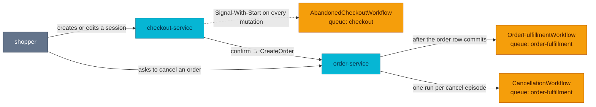
```mermaid
flowchart LR
    Shopper["shopper"] -->|"creates or edits a session"| CO["checkout-service"]
    CO -.->|"Signal-With-Start on every mutation"| ACW["AbandonedCheckoutWorkflow<br/>queue: checkout"]
    CO -->|"confirm → CreateOrder"| ORD["order-service"]
    ORD -->|"after the order row commits"| OFW["OrderFulfillmentWorkflow<br/>queue: order-fulfillment"]
    Shopper -->|"asks to cancel an order"| ORD
    ORD -->|"one run per cancel episode"| CW["CancellationWorkflow<br/>queue: order-fulfillment"]

    classDef service fill:#06b6d4,color:#082f49,stroke:#0e7490;
    classDef worker fill:#f59e0b,color:#451a03,stroke:#b45309;
    classDef external fill:#64748b,color:#fff,stroke:#334155;
    class CO,ORD service;
    class ACW,OFW,CW worker;
    class Shopper external;
```

The dotted edge is the only one that is not a direct call: the session workflow is
signalled, and started if it is not already running, by the same request that
mutated the session.

### OrderFulfillmentWorkflow

**What it is for.** An order row exists and the shopper has been told "we are
processing it". This workflow is what makes that true: it takes the money, holds
the stock, creates the shipment, and confirms the order — or, if any of that
fails before the point of no return, undoes everything it did and leaves the
order `failed` with no money moved.

**What starts it.** The order row committing. The start is deliberately *not*
inside that transaction — Temporal cannot join a PostgreSQL transaction — so the
commit also writes an outbox row and a dispatcher guarantees the workflow
eventually starts even if the process dies in between. See
[how the saga gets started](#how-the-saga-gets-started).

**What it guarantees.** Exactly one saga per order, enforced by the workflow ID.
Before the pivot, either everything succeeds or every completed step is
compensated. After the pivot, nothing is rolled back — the order is confirmed and
the remaining steps are best-effort. When a compensation itself cannot converge,
the order parks in `manual_review` rather than being reported as cleanly failed.

#### Steps and compensation

| # | Forward step | Service | Compensation if a later pre-pivot step fails |
|---|--------------|---------|-----------------------------------------------|
| 0 | `AuthorizePayment` | Payment | `VoidPayment` after authorization succeeds |
| 1 | `ReserveInventory` | Inventory | `ReleaseInventory` |
| 2 | `CreateShipment` | Shipping | `CancelShipment` |
| 3 | `CapturePayment` | Payment | `RefundPayment` if the following pivot fails |
| 4 | `ConfirmOrder` | Order | **Pivot**: failure compensates; success commits the business outcome |
| 5 | `SendNotification` | Notification | None; post-pivot best-effort |
| 6 | `SendReceipt` | Notification | None; post-pivot best-effort |
| 7 | `ClearCart` | Cart | None; post-pivot best-effort REST exception |
| 8 | `CommitInventory` | Inventory | None; **mandatory forward** — a confirmed order retries it until it converges, and a reservation left uncommitted is the reconciler's job |
| 9 | `Complete` | Order | None; best-effort `confirmed → completed` ladder write (RFC-0021 P5) — failure is counted, never compensated |

`CommitInventory` runs *after* the customer-visible tail, and the order matters.
Putting it first would mean that during an inventory degradation the shopper gets
no confirmation email and keeps a full cart, re-checks out, and receives a second
order id that workflow-ID deduplication cannot catch — charged twice for one
purchase.

Stage boundaries also write the `order_processing_projection` row
(best-effort, ~7 s budget) so `/details` can render progress; a lost write
self-heals at the next boundary.

The actual execution order is important: authorize early, capture late, then
confirm the order. This fails a declined payment before reserving inventory and
keeps captured money as close as possible to the pivot.

The order-fulfillment saga (`order-service/internal/saga/workflow.go`), driven by a
Temporal worker — payment is an unconditional part of every run
(the `PAYMENT_ENABLED` rollout flag was removed in P3.exit):

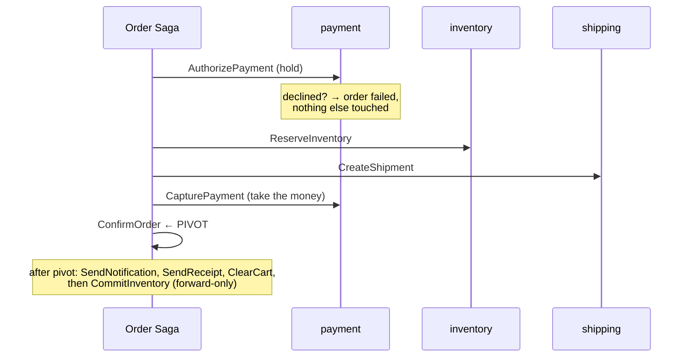
```mermaid
sequenceDiagram
    participant W as Order Saga
    participant Pay as payment
    participant Inv as inventory
    participant Ship as shipping
    W->>Pay: AuthorizePayment (hold)
    Note over Pay: declined? → order failed,<br/>nothing else touched
    W->>Inv: ReserveInventory
    W->>Ship: CreateShipment
    W->>Pay: CapturePayment (take the money)
    W->>W: ConfirmOrder  ← PIVOT
    Note over W: after pivot: SendNotification, SendReceipt, ClearCart,<br/>then CommitInventory (forward-only)
```

**Authorize-early / capture-late** ([ADR-009](../proposals/adr/ADR-009-saga-authorize-early-capture-late/)):
authorize first so a declined card fails fast before we reserve stock or create a
shipment; capture only immediately before the pivot, once fulfillment is secured.
Compensations are **state-dependent**:

| Failure point | Compensations (reverse order) |
|---|---|
| AuthorizePayment fails | mark order failed (nothing else done yet) |
| ReserveInventory fails | VoidPayment → FailOrder. An `INSUFFICIENT_STOCK` reserve took nothing, so no release is attempted; any other failure is ambiguous and releases first |
| CreateShipment fails | ReleaseInventory → VoidPayment → FailOrder |
| CapturePayment fails | CancelShipment → ReleaseInventory → VoidPayment → FailOrder |
| ConfirmOrder (pivot) fails | **RefundPayment** → CancelShipment → ReleaseInventory → FailOrder |

The captured-but-confirm-failed window is the reason a **refund** compensation
exists at all — capture happens one step before the pivot, so there is a small
window where money moved but the order didn't confirm.

**Compensation in action** — a concrete failure walkthrough. Say stock is
reserved and shipment created, then `CapturePayment` fails. The saga undoes the
completed steps in reverse and lands the order in `failed`:

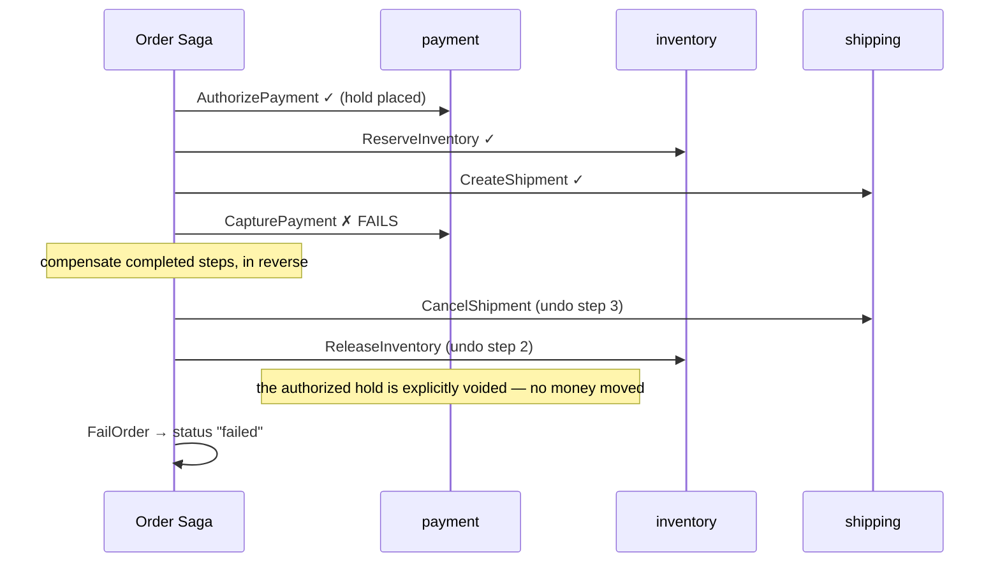
```mermaid
sequenceDiagram
    participant W as Order Saga
    participant Pay as payment
    participant Inv as inventory
    participant Ship as shipping
    W->>Pay: AuthorizePayment ✓ (hold placed)
    W->>Inv: ReserveInventory ✓
    W->>Ship: CreateShipment ✓
    W->>Pay: CapturePayment ✗ FAILS
    Note over W: compensate completed steps, in reverse
    W->>Ship: CancelShipment (undo step 3)
    W->>Inv: ReleaseInventory (undo step 2)
    Note over Pay: the authorized hold is explicitly voided — no money moved
    W->>W: FailOrder → status "failed"
```

Read it top-to-bottom: three steps succeeded, the fourth failed, and each success
got a matching undo in the opposite order. Because capture never completed, **no
money moved** — the workflow explicitly voids the hold, so this is a *void* situation, not a refund.

#### Retry and timeout policy

Four policies, not one. Which activity gets which is the difference between a
saga that gives up safely and one that leaves money in limbo.

| Policy | Applies to | Settings | Why these numbers |
|--------|-----------|----------|-------------------|
| Forward | every pre-pivot step and the best-effort tail | `StartToClose` 30s · 1s initial, ×2, max 30s · **5 attempts** | Business rejections come back as non-retryable application errors, so a declined card or a genuine shortage fails immediately rather than burning five attempts |
| Commit | `CommitInventory` only | `StartToClose` 30s · **`ScheduleToClose` 30 min** · **unlimited attempts** · max interval 1 min | Past the pivot the reservation *must* converge, so attempts are unbounded. The **elapsed** bound is the load-bearing half: a panicking inventory handler surfaces as a retryable `Internal`, so without it a deterministic bug would retry forever, the workflow would park permanently, and the breach metric and log would never be reached |
| Compensation | `VoidPayment`, `RefundPayment`, `ReleaseInventory`, `CancelShipment`, `FailOrder`, `MarkManualReview` | `StartToClose` 30s · max interval 1 min · **10 attempts** | A forward step that gives up merely fails the saga; a compensation that gives up leaves money held or stock reserved with nothing left to drive it |
| Projection | `RecordProcessingStage` | `StartToClose` **3s** · max interval 2s · **2 attempts** (~7s worst case) | The tightest budget in the saga, because it runs synchronously *ahead of* money-bearing compensations — a slow projection must never delay a refund |

Transport retries and Temporal activity retries do not replace idempotency.
Every activity may have committed even when its response was lost.

The workflow's terminal writes map onto the order FSM
([order.md § Order status FSM](./order.md#order-status-fsm) owns the full
seven-state diagram): pre-pivot exhaustion with **all** compensations
converged → `failed`; any compensation exhaustion → `manual_review`
(`COMPENSATION_INCOMPLETE`) — the alert-backed parked state; a successful
fulfillment tail records `confirmed → completed` best-effort. If even the
manual-review park cannot land, the workflow fails and the order stays
`pending`, deliberately keeping the starts-without-outcomes alert firing.

> **Canonical owner:** payment behaviour — the money FSM, the idempotency claim
> lifecycle, the provider contract and reconciliation — is owned by
> [payments.md](./payments.md). It is repeated here because the compensation logic
> above is unreadable without it. If the two ever disagree, payments.md wins.

**Payment state machine** — why "undo" means different things at different points.
The stored payment status decides whether a compensation is a void or a refund:

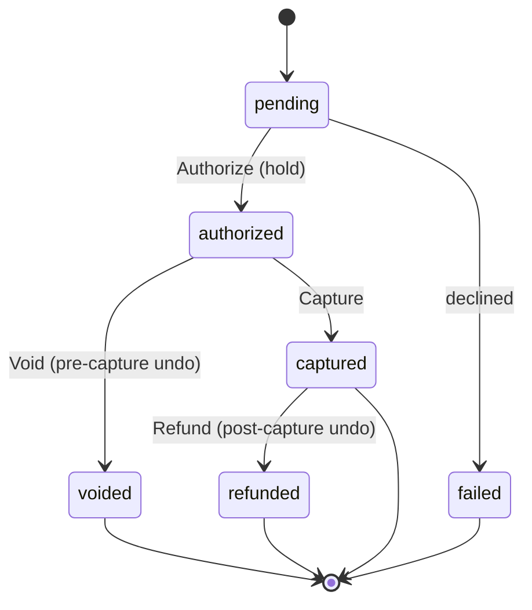
```mermaid
stateDiagram-v2
    [*] --> pending
    pending --> authorized: Authorize (hold)
    pending --> failed: declined
    authorized --> captured: Capture
    authorized --> voided: Void (pre-capture undo)
    captured --> refunded: Refund (post-capture undo)
    voided --> [*]
    refunded --> [*]
    captured --> [*]
    failed --> [*]
```

Undoing an `authorized` payment = **void** (release the hold). Undoing a
`captured` payment = **refund** (money already left the account, issue it back).
Same intent ("undo the payment"), two different operations — that's what
"compensation is a *semantic* undo, not a rollback" means in practice.

**Idempotency as a contract.** Every `payment.v1` RPC is idempotent by the
**natural business key** `order_id` (`refund:{order_id}` for refunds) — the saga
doesn't invent a client key; a retry of the same order returns the same result
instead of charging twice. Under the hood, `pkg/idempotency`
([ADR-010](../proposals/adr/ADR-010-shared-idempotency-library/)) implements a
Claim → Checkpoint → Finish state machine with a 90-second **stale-lock takeover**
so a crashed attempt can be safely re-driven against the same subject rather than
duplicated.

The idempotency claim lifecycle (`pkg/idempotency`) — how a retry is caught:

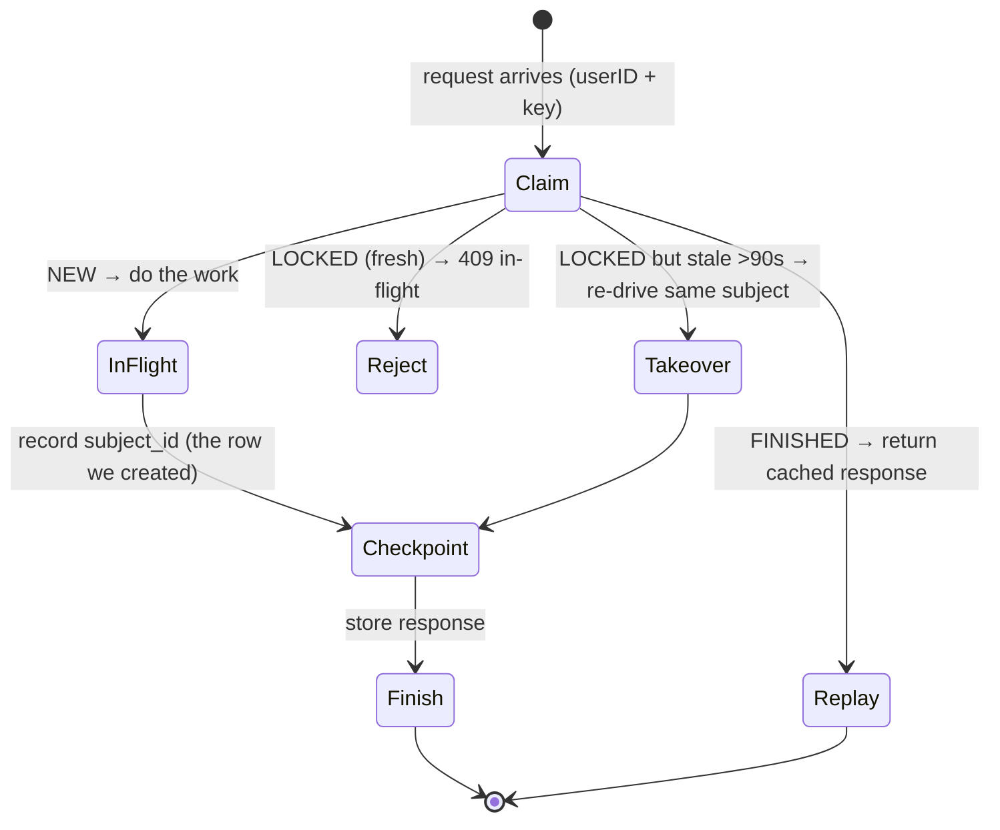
```mermaid
stateDiagram-v2
    [*] --> Claim: request arrives (userID + key)
    Claim --> InFlight: NEW → do the work
    Claim --> Replay: FINISHED → return cached response
    Claim --> Reject: LOCKED (fresh) → 409 in-flight
    Claim --> Takeover: LOCKED but stale >90s → re-drive same subject
    InFlight --> Checkpoint: record subject_id (the row we created)
    Checkpoint --> Finish: store response
    Takeover --> Checkpoint
    Finish --> [*]
    Replay --> [*]
```

Walkthrough: the **first** call claims `(userID, key)` as NEW and does the work; a
**duplicate while it's running** hits LOCKED → 409 (don't run twice); a
**duplicate after it finished** replays the cached response (no re-charge); and if
the first worker **crashed** mid-flight, after 90s the lock is stale so a retry
*takes over* and re-drives against the same `subject_id` (the payment row already
created) instead of making a second one.

**Contract shape** (`pkg/proto/payment/v1/payment.proto`): `Authorize`, `Capture`,
`Void`, `Refund`, `GetPayment`, all keyed by `order_id`, money in `amount_minor`
(int64 cents). A provider **decline is a normal response** (`status="failed"` +
`decline_code`), *not* a gRPC error — the saga distinguishes a business rejection
(don't retry) from an infra error (retry). On the HTTP surface the money errors map
to stable codes: `PAYMENT_DECLINED` (422), `PAYMENT_EXISTS` (409),
`INVALID_TRANSITION` (409), `REFUND_EXCEEDS_CAPTURE` (409), `IDEMPOTENCY_CONFLICT`
(409). Durability of "exactly-once effect" also leans on the transactional
**outbox** + append-only **double-entry ledger** (see [RFC-0010](../proposals/rfc/RFC-0010/)).

**The deployed payment system.** Putting the pieces together — this is what
actually runs (order namespace ↔ payment namespace, fenced by NetworkPolicy):

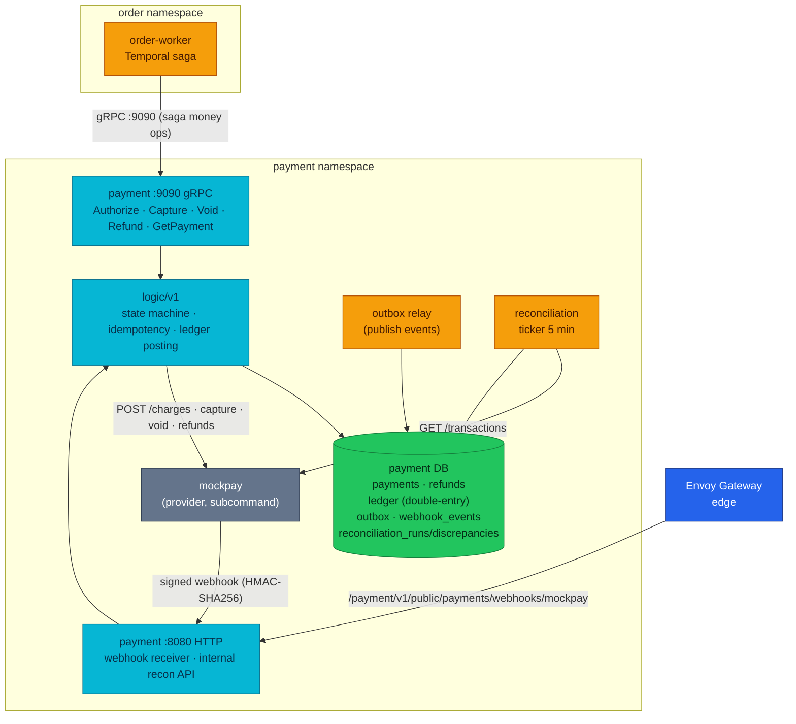
```mermaid
flowchart TB
    subgraph order_ns["order namespace"]
        OW["order-worker<br/>Temporal saga"]
    end
    subgraph payment_ns["payment namespace"]
        PGRPC["payment :9090 gRPC<br/>Authorize · Capture · Void · Refund · GetPayment"]
        PHTTP["payment :8080 HTTP<br/>webhook receiver · internal recon API"]
        PLOGIC["logic/v1<br/>state machine · idempotency · ledger posting"]
        PDB[("payment DB<br/>payments · refunds<br/>ledger (double-entry)<br/>outbox · webhook_events<br/>reconciliation_runs/discrepancies")]
        MP["mockpay<br/>(provider, subcommand)"]
        RELAY["outbox relay<br/>(publish events)"]
        RECON["reconciliation<br/>ticker 5 min"]
        PGRPC --> PLOGIC
        PHTTP --> PLOGIC
        PLOGIC --> PDB
        PLOGIC -->|"POST /charges · capture · void · refunds"| MP
        MP -->|"signed webhook (HMAC-SHA256)"| PHTTP
        RELAY --> PDB
        RECON -->|"GET /transactions"| MP
        RECON --> PDB
    end
    OW -->|"gRPC :9090 (saga money ops)"| PGRPC
    EDGE["Envoy Gateway<br/>edge"] -->|"/payment/v1/public/payments/webhooks/mockpay"| PHTTP

    classDef edge fill:#2563eb,color:#fff,stroke:#1e3a8a;
    classDef service fill:#06b6d4,color:#082f49,stroke:#0e7490;
    classDef worker fill:#f59e0b,color:#451a03,stroke:#b45309;
    classDef data fill:#22c55e,color:#052e16,stroke:#15803d;
    classDef external fill:#64748b,color:#fff,stroke:#334155;
    class EDGE edge;
    class PGRPC,PHTTP,PLOGIC service;
    class OW,RELAY,RECON worker;
    class PDB data;
    class MP external;
```

How to read it against the theory above:

1. **The saga talks gRPC**, not HTTP — `order-worker` calls `payment:9090`
   Authorize/Capture/Void/Refund. This is the east-west transport; only the order
   namespace is allowed onto `:9090` (NetworkPolicy — [payments.md](./payments.md)).
2. **HTTP + gRPC share one logic layer** — the state machine, idempotency, and
   ledger posting live in `logic/v1`, so both transports enforce the same money
   invariants (they can't drift).
3. **The provider is asynchronous** — `payment` calls `mockpay` to charge, and
   `mockpay` answers *later* via a signed (HMAC) **webhook** back to the public
   receiver. That async confirmation is exactly why the saga holds (authorize) and
   captures separately rather than expecting an instant answer.
4. **Two safety nets for eventual consistency** — the **outbox relay** publishes
   domain events durably (at-least-once), and the **reconciliation** ticker
   compares the ledger against the provider's `GET /transactions` every 5 minutes
   to *detect* drift the happy path missed (detect-only v1 — [payments.md](./payments.md)).
   These are how a saga stays trustworthy without a coordinator guaranteeing
   atomicity.

### CancellationWorkflow

**What it is for.** An order that already took money, stock and a shipment is
being cancelled. This workflow gives each of those back — and when it cannot, it
says so loudly instead of marking the order cancelled anyway.

**What starts it.** An accepted cancel request. The API flips the order to
`cancelling` under a compare-and-swap and writes a row to the cancellation
outbox in the same transaction; a dispatcher starts one workflow run per episode.

**What it guarantees.** The run always *completes* — the order's state carries
the outcome, not the workflow's. Money is returned according to what the payment
service actually says it did, never according to what this workflow assumed.
Stock is released only when a reservation is genuinely still held. Anything that
does not converge parks the order in `manual_review` with a reason code chosen to
answer the operator's first question, and nothing is ever settled silently.

It is a separate workflow type rather than a signal into the fulfilment saga
because by the time a shopper may cancel, that saga is long finished.

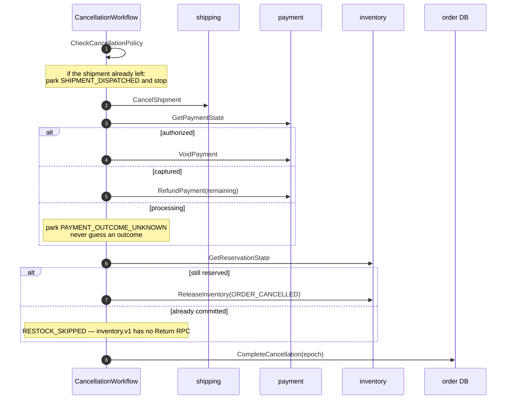
```mermaid
sequenceDiagram
    autonumber
    participant W as CancellationWorkflow
    participant S as shipping
    participant P as payment
    participant I as inventory
    participant O as order DB
    W->>W: CheckCancellationPolicy
    Note over W: if the shipment already left:<br/>park SHIPMENT_DISPATCHED and stop
    W->>S: CancelShipment
    W->>P: GetPaymentState
    alt authorized
        W->>P: VoidPayment
    else captured
        W->>P: RefundPayment(remaining)
    else processing
        Note over W: park PAYMENT_OUTCOME_UNKNOWN<br/>never guess an outcome
    end
    W->>I: GetReservationState
    alt still reserved
        W->>I: ReleaseInventory(ORDER_CANCELLED)
    else already committed
        Note over W: RESTOCK_SKIPPED — inventory.v1 has no Return RPC
    end
    W->>O: CompleteCancellation(epoch)
```

Every step reads the true state before acting, which is why there are three
`Get…` calls in that sequence. The workflow never trusts the amount it was
started with, and it never releases stock it cannot prove is held.

Customer cancellation is a **separate workflow type** on the same task queue
(`CancellationWorkflow`, id `order-cancellation-<orderID>-v<epoch>`,
`REJECT_DUPLICATE`, Pinned per ADR-030) — not a signal into the fulfillment
saga. A completed saga cannot be signalled, and the accepted
`completed → cancelling` edge means cancellation must outlive fulfillment
history anyway ([ADR-033](../proposals/adr/ADR-033-order-status-cancellation/)).

The cancel API CASes the order to `cancelling` **and** arms a
`cancellation_requests` outbox row in one transaction (the lean sibling of
the ADR-031 outbox — no payment token, no row-age money hazard), then tries
an inline start; the worker-side dispatcher sweeps whatever the inline path
missed. The epoch — the `orders.version` observed at request time — namespaces
both the workflow id and the episode's command ids, so a legally repeated
episode (`manual_review → confirmed → cancel again`) re-arms the same row.

Every step reads **current server-side state** rather than trusting inputs:

| Step | Reads | Action |
|------|-------|--------|
| `CheckCancellationPolicy` | shipment | Pass when the shipment is pending, cancelled, or absent; a dispatched shipment parks the episode |
| `CancelShipment` | — | Reused saga compensation (idempotent) |
| Payment unwind | current payment state | Void an authorization; refund the **remainder** (`amount − refunded`) of a capture |
| Inventory disposition | current reservation | `RESERVED` → `Release(ORDER_CANCELLED)`; `COMMITTED` → `RESTOCK_SKIPPED` (accepted shrinkage — inventory.v1 has no Return RPC); race → re-read |
| `CompleteCancellation` | — | CAS `cancelling → cancelled` |

The workflow **always completes**; the order state carries the outcome. Any
step exhausting its compensation-grade retry budget parks the order in
`manual_review` instead of failing the workflow. Backstops:
`OrderStuckCancelling` (critical) and `OrderCancellationOutboxStalled`
([runbooks](../observability/runbooks/microservices/OrderStuckCancelling.md)).

### AbandonedCheckoutWorkflow

**What it is for.** A checkout session is a thirty-minute quote. This workflow is
the thing that notices when a shopper walked away and marks the session expired,
so an abandoned basket does not sit forever holding a promo redemption and a
price snapshot.

**What starts it.** Every successful session mutation, through **Signal-With-Start**
— one call that signals the workflow if it is running and starts it if it is not.
There is no separate "start the timer" step to forget, and no reuse policy is
needed: the workflow ID is the session ID.

**What it guarantees.** The database is the only clock. The workflow's timer is a
wake-up call, never a verdict: when it fires, an activity re-reads
`checkout_sessions.expires_at` and expires the row *only* if the deadline has
genuinely passed and the session is still in a state that can expire. Losing a
signal can therefore **delay** an expiry, never cause a wrong one. If Temporal is
unreachable entirely, session mutations still succeed — the signal is logged and
dropped — and correctness falls back to the lazy check every read and write
already performs.

That last property is why this workflow is not versioned. It holds no money and
no stock, its single write is conditional and idempotent, and its authority lives
in a database column rather than in workflow history.

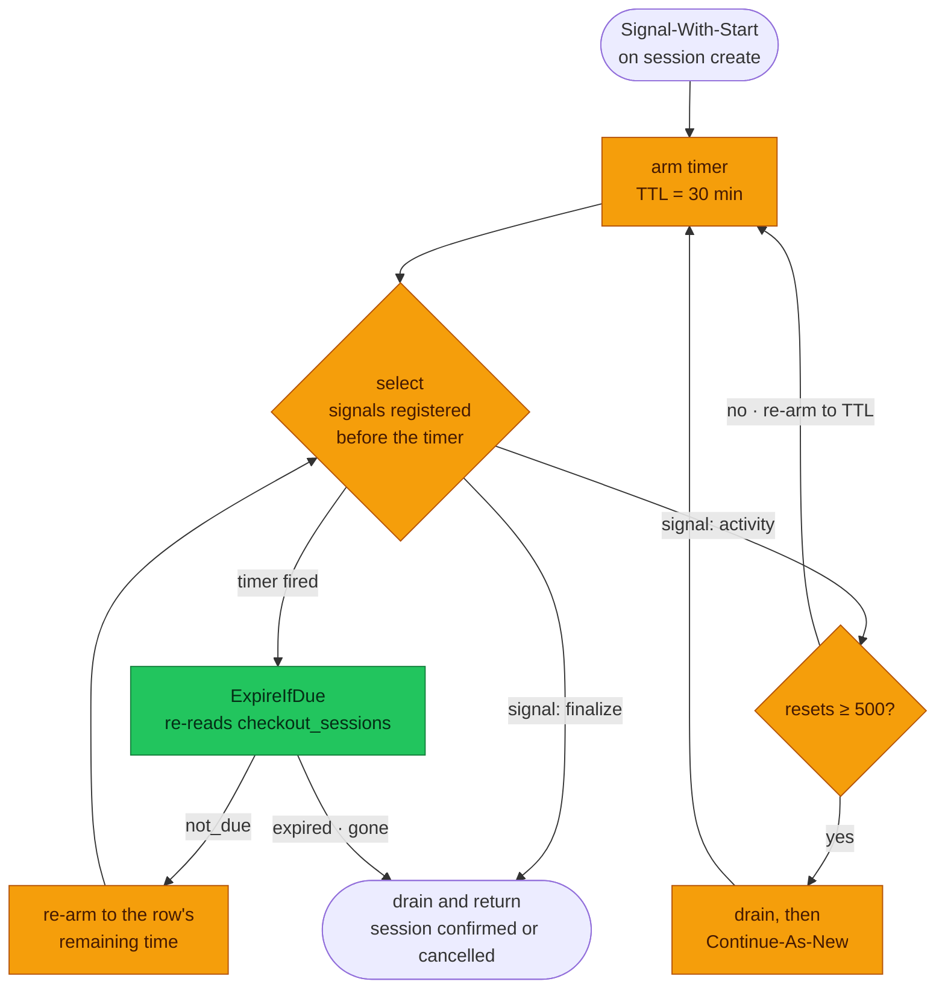
```mermaid
flowchart TD
    Start(["Signal-With-Start<br/>on session create"]) --> Arm["arm timer<br/>TTL = 30 min"]
    Arm --> Sel{"select<br/>signals registered<br/>before the timer"}
    Sel -->|"signal: activity"| Reset{"resets ≥ 500?"}
    Reset -->|"no · re-arm to TTL"| Arm
    Reset -->|"yes"| CAN["drain, then<br/>Continue-As-New"]
    CAN --> Arm
    Sel -->|"timer fired"| Act["ExpireIfDue<br/>re-reads checkout_sessions"]
    Act -->|"not_due"| ReArm["re-arm to the row's<br/>remaining time"]
    ReArm --> Sel
    Sel -->|"signal: finalize"| Done(["drain and return<br/>session confirmed or cancelled"])
    Act -->|"expired · gone"| Done

    classDef worker fill:#f59e0b,color:#451a03,stroke:#b45309;
    classDef data fill:#22c55e,color:#052e16,stroke:#15803d;
    class Arm,Sel,Reset,CAN,ReArm worker;
    class Act data;
```

Three details in that loop are load-bearing:

- **The signals are registered on the selector before the timer.** After a worker
  outage there can be buffered signals *and* an already-elapsed timer. Adding the
  signals first means user activity wins the tie, so a session someone is still
  editing is not expired by a timer that fired while nobody was listening.
- **Signals are drained on every return path**, and the drain result is checked
  *before* Continue-As-New. A buffered `finalize` arriving as the run rolls over
  must not be dropped, or the workflow would keep watching a session that is
  already finished.
- **The TTL is fixed for the life of a run**, for determinism. Changing the
  configured session lifetime does not reach sessions already being watched;
  those follow the deadline stored on their row, which is the only clock anyway.

The activity's retry policy has **no attempt limit** — a database outage should
delay an expiry, not abandon the watch — which is safe precisely because the lazy
check is doing the real work meanwhile.

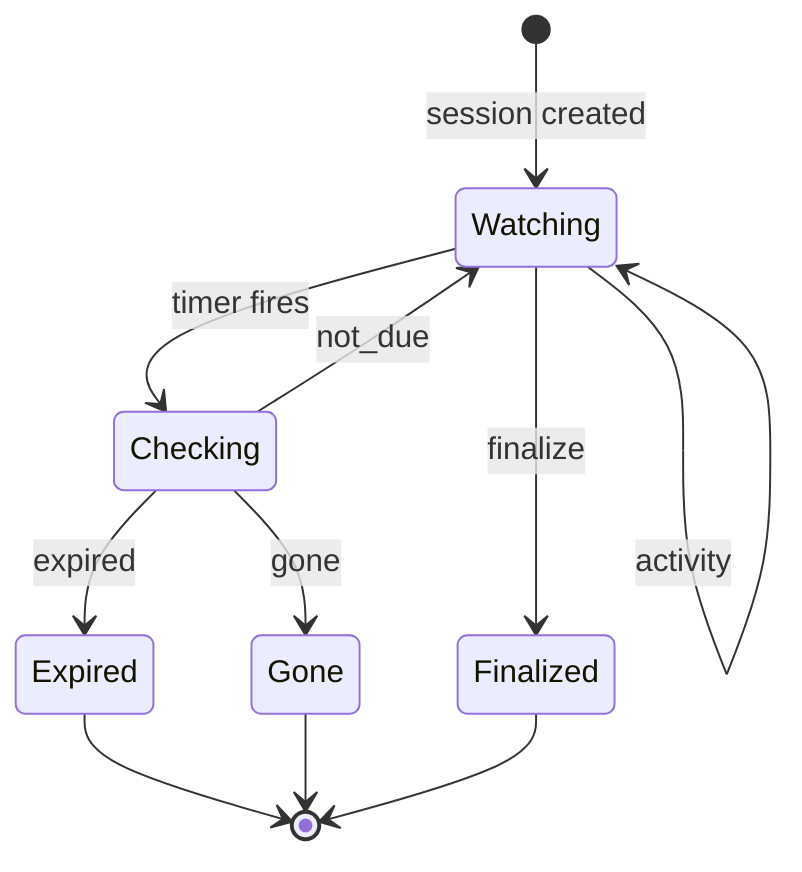
```mermaid
stateDiagram-v2
    [*] --> Watching: session created
    Watching --> Watching: activity
    Watching --> Checking: timer fires
    Watching --> Finalized: finalize
    Checking --> Watching: not_due
    Checking --> Expired: expired
    Checking --> Gone: gone
    Expired --> [*]
    Gone --> [*]
    Finalized --> [*]
```

`gone` is the interesting outcome: the session is out of this workflow's
jurisdiction — already terminal, or parked mid-confirm where an idempotency claim
owns it. The watch simply ends. If such a session later returns to an expirable
state, the next mutation's Signal-With-Start begins watching it again.

The full session contract — the funnel states, the routes, and what expiry means
to a caller — is owned by [checkout.md](./checkout.md).

### Shared mechanics

The two order workflows share a worker, a task queue, and the machinery below.

#### How the Saga Gets Started

Temporal cannot join the PostgreSQL transaction, so committing the order and
starting its workflow can never be atomic with each other. Until RFC-0021 P3 the
order committed first and the start followed, which meant anything interrupting
that gap — a pod restart, a Temporal outage, an OOM kill — left an order `pending`
forever with nothing that remembered to start it.

A **transactional outbox** closes it: the order row and a row saying *this order
needs a saga* commit together, which turns "two systems must commit together" into
"one database must commit two rows", something it already guarantees.

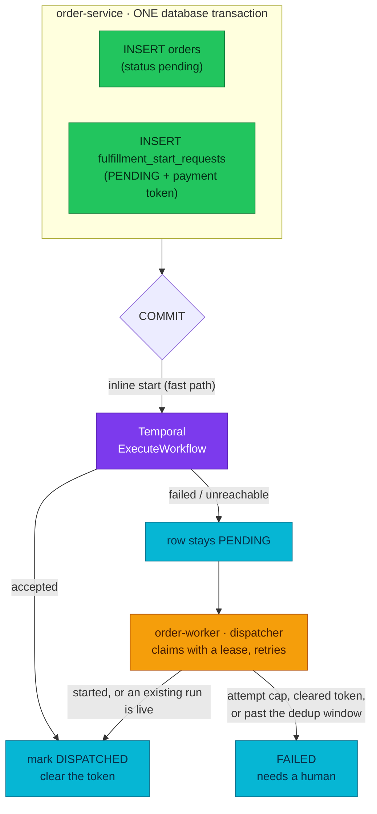
```mermaid
flowchart TD
    subgraph tx["order-service · ONE database transaction"]
        O["INSERT orders<br/>(status pending)"]
        R["INSERT fulfillment_start_requests<br/>(PENDING + payment token)"]
    end
    tx --> C{"COMMIT"}
    C -->|"inline start (fast path)"| T["Temporal<br/>ExecuteWorkflow"]
    T -->|"accepted"| D["mark DISPATCHED<br/>clear the token"]
    T -->|"failed / unreachable"| P["row stays PENDING"]
    P --> W["order-worker · dispatcher<br/>claims with a lease, retries"]
    W -->|"started, or an existing run is live"| D
    W -->|"attempt cap, cleared token,<br/>or past the dedup window"| F["FAILED<br/>needs a human"]

    classDef service fill:#06b6d4,color:#082f49,stroke:#0e7490;
    classDef worker fill:#f59e0b,color:#451a03,stroke:#b45309;
    classDef platform fill:#7c3aed,color:#fff,stroke:#5b21b6;
    classDef data fill:#22c55e,color:#052e16,stroke:#15803d;
    class O,R data
    class T platform
    class W worker
    class D,P,F service
```

The common path never touches the dispatcher: the inline start keeps the latency
and closes the row, so `PENDING` rows are normally absent rather than transient.

**Exactly once, not at least once** — the saga authorizes and captures money, so a
duplicate start is a duplicate charge. Three layers enforce it, and no single one
is sufficient:

| Layer | What it stops |
|---|---|
| `REJECT_DUPLICATE` is the **default** in the start seam | Two starters for one workflow id; omission has to be the safe choice |
| `WorkflowExecutionErrorWhenAlreadyStarted: true` | The SDK otherwise **swallows** the rejection and returns a nil error, so a refused start looks like a successful one |
| The dispatcher **describes** the existing run | A collision says a run exists, not that it did its job; a terminated or timed-out run leaves nothing driving the order |

**What the dispatcher refuses rather than retries:** a row whose payment token was
cleared (starting it would charge the demo token), and a row older than the
workflow-id dedup window (past namespace retention there is nothing left to
reject, so it could duplicate a saga that already ran).

| Signal | Answers |
|---|---|
| `order_fulfillment_start_outbox_pending` | Is any committed order missing its saga? |
| `order_fulfillment_start_outbox_oldest_age_seconds` | How long has the oldest one waited? **This is the alert-worthy one** — one order pending for twenty minutes is an incident, twenty pending for two seconds during a Temporal restart is the system working |
| `order_fulfillment_start_outbox_failed` | Is anything stuck needing a human? |
| `order_fulfillment_start_dispatch_total{result}` | What is the dispatcher doing — `dispatched` / `already_started` / `retry` / `failed` / `skipped` |

The three gauges read the table on every collection cycle rather than being
incremented, so they cannot drift across restarts, and they are registered in the
API **and** the worker — the worker exits when Temporal is unreachable, which is
exactly when a backlog builds. Alerting on them is owed, and needs `absent()`
handling: a database failure blanks all three together, so a naive threshold would
*resolve* during the incident. Full rationale and the accepted trade-offs are in
[ADR-031](../proposals/adr/ADR-031-fulfillment-start-outbox/).

#### The stock participant (RFC-0021 P3, narrowed by P4)

Stock lives at inventory-service, and only there. P3 routed the stock steps
through a per-workflow participant so the write could move without a flag day;
**P4 (order 1.13.0) removed the product-service branch it moved away from**:

| Participant | Forward | Compensation | Post-pivot |
|---|---|---|---|
| `inventory` | `ReserveInventory` | `ReleaseInventory` | `CommitInventory`, **mandatory forward** — a confirmed order retries it to completion |
| `product`, or absent (every order created before P3) | — | — | **REFUSED.** Not re-routed |

The refusal is the load-bearing part. Re-routing a product order to inventory
would release stock inventory never reserved and orphan the real hold at
product-service — the invisible-hold split the pinning exists to prevent. So the
token keeps its historical meaning and simply cannot be served: no saga is
created, and the order's outbox row goes terminal with `PARTICIPANT_UNSERVABLE`
(runbook `FulfillmentStartOutboxFailed`).

Where that refusal lives matters, and a workflow panic alone is **not** enough:
it fails the workflow TASK, so the gRPC call still answers success, the
dispatcher sees a RUNNING execution and closes its outbox row, and the
reconciler only scans terminal orders. So `fulfillment.Start` refuses (the one
place a saga is created), the gRPC replay answers the existing order without a
kickoff, and the dispatcher asks Temporal before condemning a row — a live saga
is honoured, a confirmed absence goes terminal. The workflow guard is the last
backstop, for a history force-migrated by hand.

Which value gets stamped is resolved from the **order's own record**, never from
the process answering (order-service #155): `CreateOrder` writes the participant
into the order's outbox row in the same transaction, and every start path
resolves through one shared `fulfillment.ParticipantFor`. The column is
CHECK-constrained (migration `000010`). Every resolution is counted:
`order_fulfillment_start_participant_total{participant, source, result}` —
`source` distinguishes `recorded` / `absent` / `unrecognised`, `result`
distinguishes `started` / `refused`, and `unrecognised` is alerted on
(`OrderStartParticipantUnrecognised`).

**Rollout requirement, not a property of the code:** the removal ships as a new
Worker Deployment Version, so pinned versioning must be ON and the previous
build must keep polling until pre-P4 sagas drain — since ADR-054 that waiting is `sunset`'s job, keyed off `status.deprecatedVersions[].drainedSince`, not an operator's. A pinned saga left with no
poller stalls with its stock held and its payment authorized.

#### The Inventory Reconciler

The outbox above covers a saga that never **started**; the reconciler covers a
saga that started and left its **stock** disagreeing with its outcome — a
confirmed order whose `CommitInventory` gave up, a run terminated between the
pivot and the commit, a compensation that exhausted its retries, and the
orphaned-hold seam inventory-service delegates here. A ticker in the worker
scans unsettled terminal orders (5-minute settle delay, 24 h window), asks
Temporal whether anyone still owns the workflow, probes
`inventory.GetReservation`, and repairs: **commit** a `RESERVED` hold for a
confirmed order, **release** it for a failed one. Unrepairable disagreements
persist a bounded `reconcile_breach_code` on the row and stay in the backlog.

Two properties are load-bearing (order-service #154/#156):

- **Once per order, not once per pass** — a permanently stuck order must not be
  indistinguishable from a stream of fresh failures (1,440 increments/day
  otherwise).
- **A reservation the row does not account for is repaired but never silently**
  (`order_reconciler_participant_disagreements_total{row_participant}` + one
  error line) — it is the fingerprint of a saga start that chose its branch from
  a flag, and this loop is the only thing left that sees the evidence.

Exactly **one** worker runs the judge (its scan has no `SKIP LOCKED` claim); the
kill switch is `ORDER_RECONCILER_ENABLED=false`, for when its judgement is
suspect — not for dependency outages, which it defers on by itself.

| Signal | Answers |
|---|---|
| `order_reconciler_backlog` | Terminal orders whose stock is not yet proven consistent. Publishes **nothing** on a failed read (never a false 0), so `absent()` is alerted on |
| `order_reconciler_repairs_total{action}` | `committed` / `released` / `breach` / `failed` / `deferred` / `unreadable` |
| `order_reconciler_participant_disagreements_total{row_participant}` | Should read flat zero; any increase is a distinct order |
| `order_reconciler_passes_truncated_total` | The 200-row batch cap was hit; the backlog is a floor, not a count |

#### Contracts and the Checkout Flow

East-west contracts in [`duynhlab/pkg`](https://github.com/duynhlab/pkg) (`pkg/proto`, `buf`;
introduced in `v0.7.0`), all **idempotent** so activity retries are safe:

- **inventory** — `Reserve(reservation_id, lines)` · `Release(reservation_id)` · `Commit(reservation_id)`, plus `GetReservation` for the cancellation disposition. The saga's only stock authority since RFC-0021 P4; product's `ReserveStock`/`ReleaseStock` are no longer called by anything.
- **shipping** — `CreateShipment(order_id, address)` · `CancelShipment(order_id)`.
- **`pkg/temporalx`** — shared Temporal client + worker bootstrap (mirrors `grpcx`/`obsx`). Since
  v0.38.0 (ADR-063) telemetry rides the SDK's **OpenTelemetry v2 plugin**: workflow/activity spans
  join the originating request's trace with corrected parenting, SDK counters export as monotonic
  sums (`_total` names), and workflow code may create replay-safe spans via `temporalx.Tracer`.
  Precondition wired in each service main: the global tracer provider is
  `temporalx.NewReplaySafeTracerProvider`, installed through `obsx.WithTracerProviderFactory`.

**Checkout is async.** After [checkout confirm](./checkout.md), checkout calls
`order.v1/CreateOrder` over gRPC; order-service persists the row as **`pending`**
and starts the workflow on a detached context. Checkout confirm returns **201**
with `order_id`; the SPA shows "Processing…" and polls
`GET /order/v1/private/orders/:id` for `confirmed`/`failed`. The HTTP request
does **not** block on the saga — activity retries can take seconds–minutes,
blocking would couple user latency to downstream health, and an API-pod restart
would lose the response while the durable workflow keeps running. The gRPC
`CreateOrder` is the only starter — the legacy `POST /order/v1/private/orders`
create was removed in RFC-0021 P5, and `order-service` now registers only the
four read/cancel routes ([order.md](./order.md)). *(Future nicety: Temporal
**Update-With-Start** could return an early "stock reserved" ack in the initial
call.)*

### Temporal Infrastructure

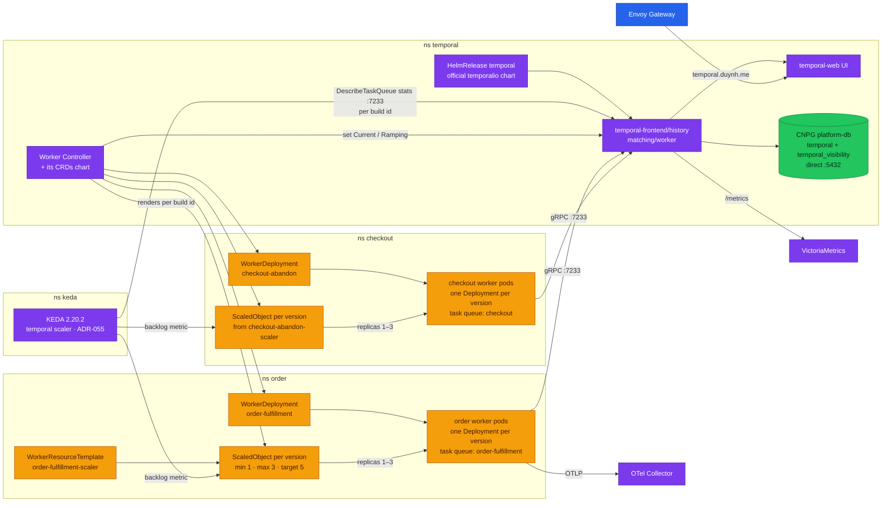
```mermaid
flowchart LR
    subgraph ns_temporal[ns temporal]
        HR[HelmRelease temporal<br/>official temporalio chart]
        TC[temporal-frontend/history<br/>matching/worker]
        UI[temporal-web UI]
        TDB[(CNPG platform-db<br/>temporal + temporal_visibility<br/>direct :5432)]
        WC[Worker Controller<br/>+ its CRDs chart]
        HR --> TC
        TC --> TDB
        TC --> UI
    end
    subgraph ns_order[ns order]
        WD[WorkerDeployment<br/>order-fulfillment]
        WRT[WorkerResourceTemplate<br/>order-fulfillment-scaler]
        SO[ScaledObject per version<br/>min 1 · max 3 · target 5]
        OW[order worker pods<br/>one Deployment per version<br/>task queue: order-fulfillment]
    end
    subgraph ns_checkout[ns checkout]
        WDC[WorkerDeployment<br/>checkout-abandon]
        SOC[ScaledObject per version<br/>from checkout-abandon-scaler]
        CW[checkout worker pods<br/>one Deployment per version<br/>task queue: checkout]
    end
    subgraph ns_keda[ns keda]
        KEDA[KEDA 2.20.2<br/>temporal scaler · ADR-055]
    end
    WC --> WD
    WD --> OW
    WC -- "renders per build id" --> SO
    WRT --> SO
    SO -- "replicas 1–3" --> OW
    WC --> WDC
    WDC --> CW
    WC --> SOC
    SOC -- "replicas 1–3" --> CW
    KEDA -- "DescribeTaskQueue stats :7233<br/>per build id" --> TC
    KEDA -- "backlog metric" --> SO
    KEDA -- "backlog metric" --> SOC
    WC -- "set Current / Ramping" --> TC
    OW -- gRPC :7233 --> TC
    CW -- gRPC :7233 --> TC
    Edge[Envoy Gateway] -- temporal.duynh.me --> UI
    TC -- /metrics --> VM[VictoriaMetrics]
    OW -- OTLP --> OTC[OTel Collector]

    classDef edge fill:#2563eb,color:#fff,stroke:#1e3a8a;
    classDef worker fill:#f59e0b,color:#451a03,stroke:#b45309;
    classDef platform fill:#7c3aed,color:#fff,stroke:#5b21b6;
    classDef data fill:#22c55e,color:#052e16,stroke:#15803d;
    class Edge edge;
    class OW worker;
    class HR,TC,UI,VM,OTC,WC,KEDA platform;
    class WD,WRT,SO,WDC,SOC,CW worker;
    class TDB data;
```

Deployed via the **official `temporalio/helm-charts`** release (see **[ADR-030](../proposals/adr/ADR-030-temporal-workflow-versioning/)** for the re-platform and the Worker Versioning requirement that forced it; **[ADR-002](../proposals/adr/ADR-002-deploy-temporal-via-operator/)** records the retired operator choice it superseded):

- **`HelmRelease temporal`** — `controllers/temporal/helmrelease.yaml`: chart `1.6.0` (server **`1.31.2`** — Worker Versioning needs ≥ 1.29.1, which the retired operator could not run), `numHistoryShards: 512`, persistence → `platform-db-rw.platform:5432` (`temporal` + `temporal_visibility`, `createDatabase: false` — the role has no CREATEDB) via **`platform-db-temporal-secret`**, `mop` namespace (retention 168h) created by the chart's namespace Job, `web.enabled`, `admintools.enabled`, `server.metrics.serviceMonitor.enabled`, `schema.useHelmHooks: false` (Flux does not reconcile Helm hooks), resources set on every component. The frontend Service keeps the name **`temporal-frontend`**, so `TEMPORAL_HOSTPORT` is unchanged across the re-platform; the UI Service is **`temporal-web`** (was `temporal-ui`).
- **`HelmRelease temporal-worker-controller-crds` → `temporal-worker-controller`** — `controllers/temporal/worker-controller-{crds-,}helmrelease.yaml` (ADR-054): charts `0.28.0` (appVersion `1.9.0`) from `docker.io/temporalio`, pinned as OCIRepositories in `clusters/local/sources/oci/`. CRDs chart first via `dependsOn`; the manager runs **one** replica — it is a single-writer controller with no HA requirement locally, not because of node count (the cluster has 4), `metrics.disableAuth: true` (nothing scrapes it, so the kube-rbac-proxy sidecar would guard a port with no reader), and the optional `WorkerDeployment` webhook stays off — the CRD's own CEL rules already reject the mistakes that matter, and `make validate` never sees an admission webhook. The always-on `WorkerResourceTemplate` webhook is why cert-manager is required; the chart issues that cert from its own namespaced self-signed `Issuer`, not from the `homelab-ca` root. Since 2026-09-05 `workerResourceTemplate.allowedResources` also lists `ScaledObject` (`keda.sh`), which is both the webhook allow-list and the controller's RBAC.
- **`HelmRelease keda`** — `controllers/keda/helmrelease.yaml` ([ADR-055](../proposals/adr/ADR-055-keda-worker-autoscaling/)): chart `2.20.2` in namespace `keda`, its own Flux wave `keda-local` (after `controllers-local` + `monitoring-local`; `temporal-local` and `apps-local` depend on it). One `WorkerResourceTemplate` per worker — `apps/order-fulfillment-scaler.yaml`, `apps/checkout-abandon-scaler.yaml` — embeds a `ScaledObject` (`minReplicaCount 1`, `maxReplicaCount 3`, `targetQueueSize 5`, `pollingInterval 15`, `cooldownPeriod 120`) with a `temporal` trigger against `temporal-frontend:7233`; the controller renders one copy per running build id and injects `workerDeploymentName`, `workerDeploymentBuildId` and `namespace` wherever the template carries the `""` sentinel. KEDA polls `DescribeTaskQueue(stats=true)` for that version's backlog, so this is the per-version signal the upstream HPA + prometheus-adapter recipe cannot provide on a self-hosted server. Kind verification pending (Ubuntu audit).
- **Retired operator** — its HelmRelease, both CRs and its HelmRepository are kept as `*.yaml.bak` beside their replacements: readable, and inert because no kustomization lists them (ADR-030). The `TemporalCluster`/`TemporalNamespace` CRDs and the cert-manager admission webhook are gone with the operator.
- **`platform-db`** — `configs/databases/clusters/platform-db/`: consolidated CloudNativePG cluster (RFC-0018) hosting `temporal` + `temporal_visibility` alongside auth and supporting databases. 3-node HA; Barman backups at `s3://pg-backups-cnpg/platform-db/`.
- **Edge & alerts** — the edge `HTTPRoute temporal-ui` (`configs/envoy-gateway/routes/temporal.yaml`, hostname `temporal.duynh.me`, **planned** — not yet exercised on Kind) plus `TemporalServerDown` and service/persistence error-rate `PrometheusRule`s in `configs/temporal/` (applied by `temporal-config-local`, after the chart).
- **Flux order** — `controllers` (namespace only — no operator, and the cert-manager dependency retired with the webhook); `databases → platform-db`; a `temporal` Kustomization (`dependsOn` controllers, databases, monitoring) before `apps`, health-checked on the `HelmRelease` + `temporal-frontend` Deployment (helm-controller waits for release resources, so Ready also means the `mop` namespace Job completed — the ordering guarantee `apps-local` needs); the order worker `dependsOn` temporal. Since ADR-054 that ordering is load-bearing in a second way: the worker **CRDs and manager ride inside `temporal-local`** precisely so `apps-local`'s existing `dependsOn` covers them before it applies any `WorkerDeployment`. Note the `healthChecks` list still names only `temporal` + `temporal-frontend`, so a Ready `temporal-local` does not by itself prove the controller is up — `wait: true` is what covers it.

### Worker Deployment Versioning (as-built)

ADR-030's second half, **live since 2026-07-30**: the saga is versioned with
Worker Deployment Versions. Since **RFC-0026 / ADR-054** the *mechanism* is a
Kubernetes controller rather than a manifest per build. The routing model below is
unchanged — the server still stamps an execution and offers its tasks only to a
matching build — but every step that used to be a human is now the controller's.

The build id is not a label for humans — it is the address the server routes on.
It gets stamped into an execution's history when the workflow starts, and from
then on that execution's tasks are only ever offered to a worker declaring the
same build. Under the controller the build id is **derived** from the pod template and
written down nowhere in git, so the diagram names the two participants by role rather
than by number — read the live values from
`kubectl -n order get wd order-fulfillment`.

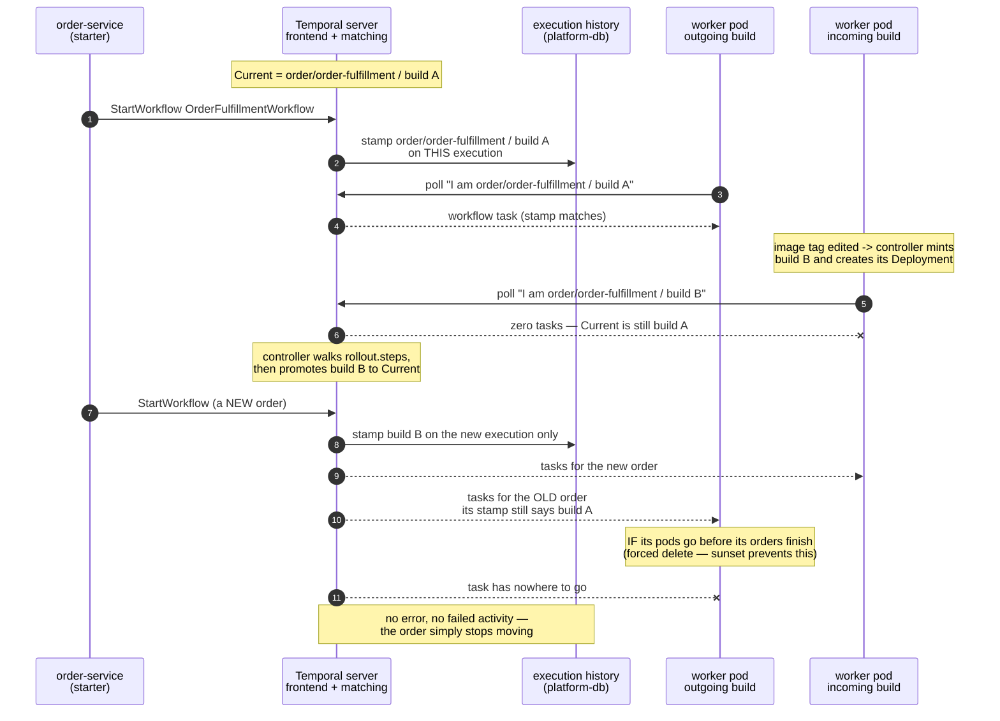
```mermaid
sequenceDiagram
    autonumber
    participant API as order-service<br/>(starter)
    participant TS as Temporal server<br/>frontend + matching
    participant H as execution history<br/>(platform-db)
    participant WOld as worker pod<br/>outgoing build
    participant WNew as worker pod<br/>incoming build

    Note over TS: Current = order/order-fulfillment / build A
    API->>TS: StartWorkflow OrderFulfillmentWorkflow
    TS->>H: stamp order/order-fulfillment / build A<br/>on THIS execution
    WOld->>TS: poll "I am order/order-fulfillment / build A"
    TS-->>WOld: workflow task (stamp matches)

    Note over WNew: image tag edited -> controller mints<br/>build B and creates its Deployment
    WNew->>TS: poll "I am order/order-fulfillment / build B"
    TS--xWNew: zero tasks — Current is still build A

    Note over TS: controller walks rollout.steps,<br/>then promotes build B to Current
    API->>TS: StartWorkflow (a NEW order)
    TS->>H: stamp build B on the new execution only
    TS-->>WNew: tasks for the new order
    TS-->>WOld: tasks for the OLD order<br/>its stamp still says build A

    Note over WOld: IF its pods go before its orders finish<br/>(forced delete — sunset prevents this)
    TS--xWOld: task has nowhere to go
    Note over TS,H: no error, no failed activity —<br/>the order simply stops moving
```

Read the last three lines as the failure mode the design exists to make
unreachable, not as something that happens. A stamped execution whose build has
no poller does not fail — it goes quiet, which is why `OrderSagaNotCompleting` is
the backstop. Under ADR-030 a human kept that from happening by reading
`describe-version` before deleting a file. Under ADR-054 `sunset` keeps it from
happening on its own: a version is scaled to zero only an hour after the server
reports it `drained`, and deleted a day after that. It is still reachable by
force — deleting the `WorkerDeployment`, or scaling a draining version to zero by
hand — which is why the shape is worth knowing rather than forgetting.

- The worker registers as deployment **`order/order-fulfillment`** — the
  controller composes the server-side name as `<k8s-namespace>/<resource-name>`,
  so it is no longer the bare `order-fulfillment` ADR-030 used. The **build id is
  derived** by the controller from the image reference plus a hash of the pod
  template, so it is not written down anywhere in git; read the live value from
  `kubectl -n order get wd order-fulfillment`, whose printer columns are Current,
  Target and Ramp %. The identity reaches the pod as `TEMPORAL_DEPLOYMENT_NAME` +
  `TEMPORAL_WORKER_BUILD_ID`, **injected by the controller** and read by
  `pkg/temporalx` (both-or-neither; half-set refuses to start). The workflow
  registers **`VersioningBehaviorPinned`** in order-service — a saga holding money
  and stock is never moved onto a new build mid-flight.
- A new build is **one line**: the image tag in
  [`kubernetes/apps/order-worker.yaml`](../../kubernetes/apps/order-worker.yaml),
  a single `WorkerDeployment` that is never copied. The controller creates the new
  versioned Deployment, registers the version, ramps `10% → 50%` with 30-second
  pauses, and promotes it to Current — no CronJob, no `kubectl create job`, and
  nothing to run on a freshly built cluster. `make validate` checks what is still
  checkable: one `WorkerDeployment` wired to a `Connection` in the same file, no
  leftover per-build manifests, and no hand-set version identity.
- Retirement is declarative: `sunset.scaledownDelay 1h` then `deleteDelay 24h`,
  keyed off the server's own `status.deprecatedVersions[].drainedSince` — the
  machine-checkable gate ADR-030 recorded as follow-up 2 and nothing checked.
- **How to release a new build** — one line, and the procedure is
  [`application-delivery.md` § Releasing the order worker](../platform/application-delivery.md#releasing-the-order-worker).
  Read that rather than this section if the task is "a new tag exists, now what".
- Design record: [RFC-0026](../proposals/rfc/RFC-0026/) ·
  [ADR-054](../proposals/adr/ADR-054-temporal-worker-controller/). The pre-ADR-054
  hand-run procedure survives as **history only** —
  [cutover-rollback.md § Worker version activation](../proposals/rfc/RFC-0021/cutover-rollback.md#worker-version-activation-phase-3-before-the-write-cutover)
  describes a per-build manifest and an activation Job that no longer exist. Do
  not follow it.

The sequence above answers *how a task finds its build*. This one answers *who moves
a version through its life* — the same mechanics [RFC-0026's
research](../proposals/rfc/RFC-0026/research.md#core-mechanism) walks through, kept
here because the as-built contract is where an on-call reader looks first. Colours are
the house palette — purple is what GitOps and the controller compute, orange is the
version's own state, green is a fact or a timer the Temporal server owns.

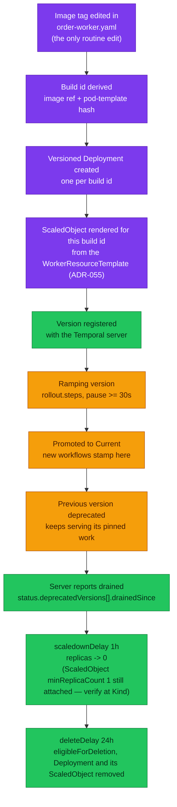
```mermaid
flowchart TD
  tag["Image tag edited in<br/>order-worker.yaml<br/>(the only routine edit)"] --> bid["Build id derived<br/>image ref + pod-template hash"]
  bid --> dep["Versioned Deployment created<br/>one per build id"]
  dep --> so["ScaledObject rendered for this build id<br/>from the WorkerResourceTemplate (ADR-055)"]
  so --> reg["Version registered<br/>with the Temporal server"]
  reg --> ramp["Ramping version<br/>rollout.steps, pause >= 30s"]
  ramp --> cur["Promoted to Current<br/>new workflows stamp here"]
  cur --> dpr["Previous version deprecated<br/>keeps serving its pinned work"]
  dpr --> drn["Server reports drained<br/>status.deprecatedVersions[].drainedSince"]
  drn --> sd["scaledownDelay 1h<br/>replicas -> 0<br/>(ScaledObject minReplicaCount 1 still attached — verify at Kind)"]
  sd --> del["deleteDelay 24h<br/>eligibleForDeletion, Deployment and its ScaledObject removed"]

  classDef platform fill:#7c3aed,color:#fff,stroke:#5b21b6;
  classDef worker fill:#f59e0b,color:#451a03,stroke:#b45309;
  classDef data fill:#22c55e,color:#052e16,stroke:#15803d;
  class tag,bid,dep,so platform
  class ramp,cur,dpr worker
  class reg,drn,sd,del data
```

> **In plain terms:** exactly three of these boxes used to be a person, and they are
> not the ones a colour picks out. **Promoted to Current** was
> `kubectl create job --from=cronjob/…`, run on every release *and* every fresh
> cluster. **Server reports drained** was a human reading `describe-version` and
> judging it. **Resources removed** was that same human deleting a file. The first is
> now a policy in the manifest, the second is a field, and the third is a timer.
>
> The two delays are the margin for the second answer being wrong: an hour with the
> pods at zero before anything is deleted, and a day before the resources go — so a
> version that was called drained too early can still be scaled back up.

### As-Built Notes and Roadmap

Deliberate deviations from the original design:

- **Pivot = ConfirmOrder** (step 4 in [Steps and compensation](#steps-and-compensation)); post-pivot steps are best-effort.
- **Workflow start is centralized in `internal/fulfillment`** (RFC-0015 P2, ADR-018): both the web
  handler and the gRPC `CreateOrder` server delegate to the same starter, so the logic layer stays
  Temporal-free. If Temporal is unavailable the order is still created (`pending`) and the start is
  logged — order creation never fails on Temporal.
- **`ClearCart` uses cart's tokenless internal route** (`DELETE /cart/v1/internal/cart/:userId`,
  NetworkPolicy-fenced) — the workflow input carries no bearer token, so a saga that outlives the
  user's access token still clears the cart.
- **Idempotency is DB-enforced** — inventory's reservation model (one reservation per
  saga id, movements append-only so a retried activity cannot double-apply) and
  shipping `UNIQUE(order_id)`. It used to be product's `stock_reservations` ledger
  (PK `reservation_id,product_id`); that table was dropped in RFC-0021 phase 4
  (product migration `000006`) with the RPCs that wrote it.

**Roadmap:** tracked as **Future work in [RFC-0001](../proposals/rfc/RFC-0001/)** —
the platform-db DR replica cluster (**Planned**) remains — the Grafana
dashboard shipped (`temporal-workflows`, in the observability dashboards
kustomization); the server bump shipped past the 1.27.x target (1.31.2,
ADR-030 re-platform) and the first GameDay drill ran 2026-08-06
([RFC-0021 gameday](../proposals/rfc/RFC-0021/gameday.md), G2).
Already shipped from that list: cache-bust on reserve (product's
`ReserveStock`/`ReleaseStock` invalidated `product:{id}` — historical, the saga
no longer calls them since RFC-0021 P4), workflow/activity RED
metrics (`pkg/temporalx` MetricsHandler), and the internal cart-clear (as-built
notes above).

## Part 3 — Operations

How to deploy the worker, run the saga locally, and watch it in production.

### Deploy and Run It

- **Worker mode.** Each owning service ships a **`worker` subcommand** (mirrors `migrate`); it dials
  Temporal + the downstreams, registers the workflow/activities, and polls the task queue. It also
  serves `/health` and `/ready` (the process has no application HTTP API, but
  still needs liveness and readiness probes). Worker metrics export over OTLP.
- **In-cluster.** Since [ADR-054](../proposals/adr/ADR-054-temporal-worker-controller/)
  the worker is **not chart-rendered at all**: it is a `WorkerDeployment` + `Connection`
  in [`kubernetes/apps/order-worker.yaml`](../../kubernetes/apps/order-worker.yaml)
  (namespace `order`), whose `spec.template` is a raw pod spec. The `mop` chart is
  deliberately out of the path — the accepted cost is that nothing keeps that template
  in step with the chart's future defaults. The Temporal Worker Controller creates one
  Deployment per version and deletes a drained one on `sunset` timers, so there is no
  per-version file and no human deletion step (see
  [Worker Deployment Versioning](#worker-deployment-versioning-as-built)). The template
  carries the
  order DB address, `TEMPORAL_HOSTPORT` / `TEMPORAL_NAMESPACE` / `TASK_QUEUE`, and the downstream
  `*_GRPC_ADDR` targets (inventory, shipping, notification, payment — each
  `dns:///<service>.<ns>.svc.cluster.local:9090`, the single multi-port Service).
  **No product target since 1.13.0**: the saga's product stock branch is gone, so the
  order namespace stops needing product's `:9090` at all — the NetworkPolicy allow is
  withdrawn once the pre-phase-4 builds finish draining.
  `apps-local` `dependsOn` `temporal-local` so it deploys after the cluster is
  Ready. (Historical: earlier drafts used a `worker.enabled` chart toggle, then the
  separate-release model. Since ADR-054 the order worker is not a chart release at all; `checkout-worker` still is.)
- **Locally.** `local-stack/compose.yaml` runs `temporalio/server` **1.31.2** — the same server
  version the cluster chart deploys — with all four roles in one container, backed by the shared
  PostgreSQL through the `postgres12` plugin (databases `temporal` and `temporal_visibility`).
  A run-once `temporal-schema` container applies the schema, a run-once `temporal-bootstrap`
  registers `mop` with the cluster's `168h` retention, `temporal-admintools` is the CLI target,
  and `temporal-ui` serves `:8233`. `docker compose up -d --build` then a checkout exercises the
  live saga.

  Because state lives in PostgreSQL, workflow history, timers, and Worker Deployment Versioning
  state survive `docker compose restart temporal` — so a drain rehearsal can span a restart
  locally. Two deliberate divergences from the cluster: `numHistoryShards` is **4** against 512
  (shard count partitions throughput, not behaviour), and `docker compose down` still wipes
  everything, because the `postgres` service holds no data volume.

### Finding and Reading Executions

Three UI/CLI affordances ride every execution (Phase-4 conformance wave of
ADR-063/064; SDK ≥ 1.47):

- **Custom Search Attributes** — namespace `mop` registers two `Keyword`
  attributes, and services stamp them in `StartWorkflowOptions` (start options
  only — no mid-workflow upsert, so recorded histories replay unchanged):

  | Attribute | Stamped by | On | List filter |
  |---|---|---|---|
  | `OrderId` | order-service | `OrderFulfillmentWorkflow` | `OrderId = '8'` |
  | `SessionId` | checkout-service | `AbandonedCheckoutWorkflow` | `SessionId = '<uuid>'` |

  Registration is part of the namespace contract — a start referencing an
  unregistered attribute is **rejected** — and is owned by
  `temporal-bootstrap` (local-stack) and the `temporal-search-attributes` Job
  in `configs/temporal` (cluster; `apps-local` dependsOn
  `temporal-config-local` so apps never race it).
- **StaticSummary** — a fixed one-liner on the execution-list row: the saga
  shows order id, item count, total, and stock participant; the abandon watch
  shows session id and TTL.
- **Current details** — the saga mirrors every `recordStage` boundary into
  `workflow.SetCurrentDetails` (stage, plus failure reason while
  compensating), so the UI answers "where is this saga?" without opening
  event history. Served from the workflow-metadata query; not a history
  event.

### Operations and Observability

- **Temporal Web UI** — `temporal.duynh.me` (cluster) / `localhost:8233` (local-stack): every
  execution, its inputs, history, retries, and failures.
- **Metrics** — the operator scrapes Temporal **server** metrics via a `ServiceMonitor`; alerts:
  `TemporalServerDown`, `TemporalServiceErrorRateHigh`, `TemporalPersistenceErrorRateHigh`
  (`configs/temporal/prometheusrule.yaml`). The worker pushes activity, gRPC
  RED, and Go-runtime metrics over OTLP; it has no application `/metrics` scrape endpoint.
- **Write-migration alerts** — twelve RFC-0021 alerts cover what RED cannot see
  (`rfc0021-write-migration.yaml` + one runbook each): saga liveness
  (`OrderSagaNotCompleting`), the reconciler family (backlog not draining /
  unreadable / breach / truncated), participant skew
  (`OrderParticipantDisagreement`, `OrderStartParticipantUnrecognised`), outbox
  age and terminal rows, commit lag, and compensation failures.
- **Failure handling** — insufficient stock fails fast (non-retryable) and compensates; transient
  downstream errors retry per policy; a stuck workflow is visible (and terminable) in the UI.

## References

- [workflows.md](./workflows.md) — platform workflow registry
- [api.md](./api.md) — shared HTTP and gRPC behavior; [end-to-end user journeys](./api.md#end-to-end-user-journeys) (checkout funnel before the saga)
- [checkout.md](./checkout.md) — confirm handoff and idempotency into `CreateOrder`
- [order.md](./order.md) — order contract and workflow handoff
- [cart.md](./cart.md) — saga `ClearCart` internal REST exception
- [product.md](./product.md) · [inventory.md](./inventory.md) · [shipping.md](./shipping.md) · [notification.md](./notification.md) — participating service contracts
- [payments.md](./payments.md) — payment state, ledger, and reconciliation
- [ADR-001](../proposals/adr/ADR-001-adopt-temporal-for-order-fulfillment/) — adopt Temporal
- [ADR-009](../proposals/adr/ADR-009-saga-authorize-early-capture-late/) — authorize early and capture late
- [ADR-010](../proposals/adr/ADR-010-shared-idempotency-library/) — shared idempotency state machine
- [RFC-0010](../proposals/rfc/RFC-0010/) — payment and fulfillment design

_Last updated: 2026-08-27 — Phase-4 conformance wave: § Finding and Reading Executions added (Search Attributes OrderId/SessionId + StaticSummary + SetCurrentDetails), CommitInventory heartbeat, SDK logs through zap. Previous: 2026-08-27 — ADR-063: `pkg/temporalx` bullet rewritten for the OTel v2 plugin (monotonic `_total` counters, replay-safe workflow spans); ADR-064 puts checkout-worker under the controller (see workflows.md). 2026-08-21: ADR-054 lifecycle move._
