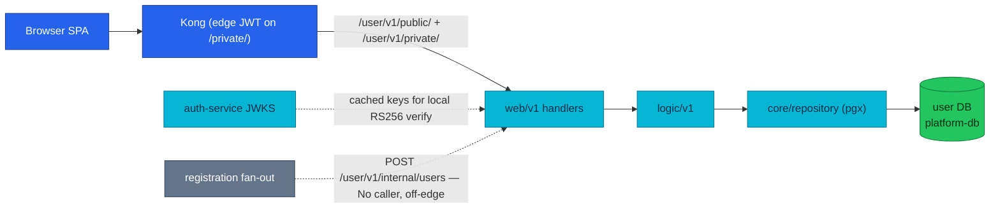

# User Service API

User turns an authenticated identity into a displayable profile: it stores names,
phone, and address fields while auth remains the sole owner of credentials and
identity claims.

| Dimension | Value | Status |
|-----------|-------|--------|
| **Deployment** | local-stack + cluster | Implemented |
| **HTTP** | public + private · `:8080` · Kong `/user/v1/public/` and `/user/v1/private/` (edge JWT on private) | Implemented |
| **gRPC server** | None | None |
| **gRPC client** | None | None |
| **Worker** | None | None |
| **Temporal** | None · [workflows.md](./workflows.md) | None |
| **Technical debt** | None | None |

| Attribute | Value | RFC / ADR |
|-----------|-------|-----------|
| **Repository** | [`duynhlab/user-service`](https://github.com/duynhlab/user-service) | — |
| **Owns** | `user_profiles` data: first/last name, phone, address — **not** passwords, username uniqueness, email identity, or JWT issuance (auth's boundary) | — |
| **Database** | `user` on `platform-db` (via `platform-db-pooler-rw.platform:5432`) | — |
| **Design record** | — | None |

## Temporal participation

None — this service does not start or participate in Temporal workflows.
See [workflows.md](./workflows.md).

## Why it exists

Auth and user split one "user" concept along a hard ownership line. Auth owns
*who you are* — credentials, password hashes, username/email uniqueness, JWT
signing. User owns *how you present* — display name, phone, address. The split
keeps the credential store small and auditable, and lets profile reads and
writes scale without ever touching authentication data.

The boundary is physical, not just logical: the `user_profiles.user_id` column
references auth's `users.id` **without a foreign key** because the two tables
live in different databases owned by different services. User never
cross-queries auth's database. Where a response needs identity fields
(`username`, `email`), user reads them from the already-verified JWT claims —
a claim-join instead of a database join.

Two projections fall out of that design:

- **Public** — `GET /user/v1/public/users/:id` returns only `id` and a display
  `name`. Email, username, phone, and address never leave through the public
  surface.
- **Private** — `GET /user/v1/private/users/profile` combines JWT claims
  (`id`, `username`, `email`) with the caller's own profile row (`name`,
  `phone`). There is no private `/users/:id` route: the JWT subject selects
  the profile, so one user can never address another user's private data.

## Architecture

The diagram answers one question: who reaches user-service, and where does
profile data live?



Nothing dials user-service east-west today: no gRPC server, no gRPC client, no
service-to-service HTTP caller. The only live traffic is the SPA through Kong.

## Data model

One table, one migration (`000001_init_schema.up.sql`):

| Column | Type | Constraints / notes |
|--------|------|---------------------|
| `id` | `SERIAL` | Primary key |
| `user_id` | `INTEGER` | `NOT NULL UNIQUE` — references auth's `users.id` across the service boundary, **no FK** |
| `first_name` | `VARCHAR(100)` | Nullable; display name is `first_name + " " + last_name` |
| `last_name` | `VARCHAR(100)` | Nullable |
| `phone` | `VARCHAR(20)` | Nullable |
| `address` | `TEXT` | Nullable; stored and seeded but **not exposed by any v1 route** (see [Known gaps](#known-gaps)) |
| `created_at` | `TIMESTAMP` | Default `CURRENT_TIMESTAMP` |
| `updated_at` | `TIMESTAMP` | Default `CURRENT_TIMESTAMP`; not advanced on update (see [Known gaps](#known-gaps)) |

Demo data (5 profiles matching auth's seeded users 1–5) is applied only by the
explicit `seed` subcommand, which refuses to run when `ENV=production`.

## HTTP API

Shared rules — error envelope, `snake_case`, auth model — live in
[api.md](./api.md); this table is the user-specific contract. All paths are
full canonical Variant A paths.

| Method | Path | Audience | Purpose | Status |
|--------|------|----------|---------|--------|
| `GET` | `/user/v1/public/users/:id` | Public | Public-safe projection: `id` + display `name` | Implemented |
| `GET` | `/user/v1/private/users/profile` | Private | Current user's profile (claims + profile row) | Implemented |
| `PUT` | `/user/v1/private/users/profile` | Private | Partial update of name and phone (upsert) | Implemented |
| `POST` | `/user/v1/internal/users` | Internal | Create a profile from an authoritative `user_id` | **No caller** |

### Public user — `GET /user/v1/public/users/:id`

The response deliberately excludes username, email, phone, and address:

```json
{ "id": "1", "name": "Alice Johnson" }
```

The name resolves from the profile row (`first_name last_name`), falling back
to `User <id>` when both parts are empty. A user without a profile row returns
`404 NOT_FOUND` — the service does not consult auth's database to distinguish
"no such user" from "no profile yet".

### Current profile — `GET /user/v1/private/users/profile`

```json
{
  "id": "1",
  "username": "alice",
  "email": "alice@example.com",
  "name": "Alice Johnson",
  "phone": "+1-555-0101"
}
```

| Field | Source |
|-------|--------|
| `id`, `username`, `email` | Verified JWT claims (`pkg/authmw` context) |
| `name`, `phone` | `user_profiles` row for the JWT subject |
| Fallback | No profile row → `200` with claims + `"name": "User <id>"` (never a 404 on the private read) |

### Update profile — `PUT /user/v1/private/users/profile`

Request accepts `name` and `phone`; both optional:

```json
{ "name": "Alice Nguyen", "phone": "+84123456789" }
```

`name` is split on whitespace — first token becomes `first_name`, the rest
`last_name`. Empty values preserve existing database fields through
`COALESCE(NULLIF($n, ''), current_value)` semantics, so a phone-only update
never blanks the name. A first-time update inserts the row (upsert). The
response echoes `{ "id", "name" }`.

### Internal profile creation — `POST /user/v1/internal/users` (No caller)

```json
{
  "user_id": 1,
  "username": "alice",
  "email": "alice@example.com",
  "name": "Alice Nguyen"
}
```

The caller must provide an authoritative positive `user_id`; the service never
generates an identity ID (`400 VALIDATION_ERROR` otherwise). A duplicate
profile answers `409 CONFLICT`. Despite a source comment saying auth calls
this route during registration, auth currently writes only its own credentials
database and has no user-service client — the route is **implemented but
unused**. It stays mounted and documented because it is the designed hook for
a future registration fan-out. It is never exposed by Kong at either edge;
NetworkPolicy is the fence ([api.md § Audience segments](./api.md#audience-segments)).

### Error matrix

| HTTP | Code | Returned by |
|------|------|-------------|
| `400` | `VALIDATION_ERROR` | Malformed JSON, missing required internal fields, invalid email, non-positive `user_id`. Raw binder errors are sanitized — internal validation structure never reaches the client |
| `401` | `UNAUTHORIZED` | Private route without a verified JWT (Kong edge filter first, `pkg/authmw` authoritative) |
| `403` | `FORBIDDEN` | Identity resolved but rejected by the logic layer (e.g. non-numeric subject) |
| `404` | `NOT_FOUND` | Public lookup for a user with no profile row |
| `409` | `CONFLICT` | Internal create for a `user_id` that already has a profile |
| `500` | `INTERNAL_ERROR` | Database or unexpected failure; no internals leaked |

## gRPC API

None — HTTP only. User has no gRPC server, no gRPC client, and no planned
east-west surface; nothing in the saga or checkout call graph touches it.

## Business rules & techniques

| Rule | Mechanism |
|------|-----------|
| Identity never comes from the body | Private handlers read `user_id`/`username`/`email` only from the `pkg/authmw`-verified context; request JSON cannot impersonate |
| Owner scoping by construction | No private `/:id` route exists — the JWT subject is the only selector, so cross-user reads are unrepresentable, not merely forbidden |
| Claim-join instead of DB join | `username`/`email` come from JWT claims; the profile row supplies only what user owns. No cross-database query, no auth coupling |
| Public projection is minimal | The `PublicUser` struct has exactly `id` and `name`; adding a field is a deliberate contract change, not an accidental leak |
| Partial update semantics | `COALESCE(NULLIF($n, ''), col)` in one UPDATE — empty inputs preserve, non-empty inputs replace |
| Authoritative ID only | Internal create requires the caller's `user_id > 0`; user-service never mints identity IDs |
| Sanitized validation errors | Binder/validator messages are pattern-filtered before responding; short safe messages pass through, structural ones collapse to `"Invalid request"` |

## Callers & dependencies

| Direction | Party | Contract |
|-----------|-------|----------|
| Inbound | Browser SPA via Kong | `GET` public projection; `GET`/`PUT` private profile |
| Inbound | — | `POST /user/v1/internal/users` — **No caller** today |
| Outbound | auth-service (indirect) | JWKS fetch for local RS256 verification only — background-refreshed, non-blocking at startup; **not** a request-path dependency |
| Outbound | `user` database | Only data dependency; no east-west service calls |

No other service reads or writes profiles: checkout snapshots the shipping
address the SPA submits into its own session and does not call user.

## Known gaps

- **Internal POST has no live caller.** `POST /user/v1/internal/users` is
  wired end-to-end (handler, logic, repository) but nothing invokes it — auth
  does not fan out on registration. Badge: **No caller**. Kept mounted,
  off-edge, NetworkPolicy-fenced.
- **`address` column is API-unreachable.** Stored, selected by the repository,
  and populated by demo seed, but no v1 route reads or writes it.
- **`updated_at` never advances.** The profile UPDATE does not set it and no
  trigger exists, so the column reflects insert time only.
- **Upsert is update-then-insert, not atomic.** Two racing first-writes for the
  same `user_id` can collide on the unique index and surface as
  `500 INTERNAL_ERROR`; harmless for the single-SPA flow but worth knowing
  when reading the repository.

## Operations

| Concern | Value |
|---------|-------|
| Probes | `GET /health`; `GET /ready` flips to `503 shutting_down` during the readiness drain window (`READINESS_DRAIN_DELAY`, default 5s) before `SHUTDOWN_TIMEOUT` (default 10s) |
| Key env | `SERVICE_NAME=user`, `PORT=8080`, `DB_HOST/DB_PORT/DB_NAME/DB_USER/DB_PASSWORD/DB_SSLMODE`, `DB_POOL_MAX_CONNECTIONS`, `AUTH_JWKS_URL`, `JWT_ISSUER`, `JWT_AUDIENCE`, `LOG_LEVEL`, `TRACING_ENABLED`/`OTEL_COLLECTOR_ENDPOINT`/`OTEL_SAMPLE_RATE`, `PROFILING_ENABLED`/`PYROSCOPE_ENDPOINT` |
| Subcommands | `migrate` (versioned schema, runs in the init container) and `seed` (dev-only demo profiles; refuses on `ENV=production`) |
| Cluster wiring | Namespace `user`, domain `identity` (`kubernetes/apps/services/user.yaml`); app traffic via `platform-db-pooler-rw.platform:5432`, migrations direct to `platform-db-rw.platform:5432` |
| Telemetry | obsx OTLP (RFC-0014): traces, RED metrics, teed logs — no scrape endpoint |
| Business metrics | `user_profile_lookup_total{audience,found}` — public miss = 404, private miss = fallback 200; `user_profile_updated_total{result}` — `success` vs `unauthorized` (persistence failures surface via DB spans instead) |

Smoke checks through Kong (local-stack):

```bash
curl http://localhost:8080/user/v1/public/users/1
curl -H "Authorization: Bearer $TOKEN" http://localhost:8080/user/v1/private/users/profile
curl -X PUT -H "Authorization: Bearer $TOKEN" -H "Content-Type: application/json" \
  -d '{"name":"Alice Nguyen","phone":"+84123456789"}' \
  http://localhost:8080/user/v1/private/users/profile
```

## Code map

Paths in [`duynhlab/user-service`](https://github.com/duynhlab/user-service). Transport peers call `logic/v1`; logic calls `core` only ([api.md § Inside Each Service](./api.md#inside-each-service)).

| Layer | Path | Notes |
|-------|------|-------|
| **Transport** | `internal/web/v1/handler.go` | HTTP handlers |
| | `internal/web/v1/validation.go` | Validation sanitizer |
| **logic** | `internal/logic/v1/service.go` | Business logic |
| | `internal/logic/v1/metrics.go` | Business metrics |
| **core** | `internal/core/domain/` | Domain types + errors |
| | `internal/core/repository/psql/user_repository.go` | Repository (pgx) |
| | `internal/core/database.go` | DB pool setup |
| **Platform** | `cmd/main.go` | Routes + bootstrap |
| | `config/config.go` | Config |
| | `middleware/` | Tracing/logging middleware |
| | `db/migrations/sql/`, `db/seed/sql/` | Migrations / seed |

## References

- [api.md](./api.md) — shared HTTP conventions, auth model, error envelope, pagination
- [auth.md](./auth.md) — the credential side of the identity boundary
- [workflows.md](./workflows.md) — Temporal registry (user: None)
- [Service contracts](./README.md#service-contracts)
- [microservices.md](./microservices.md) — feature matrix

_Last updated: 2026-07-21_
