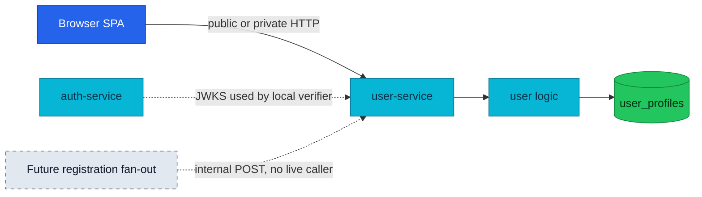

# User Service API

User stores profile data while auth remains the owner of credentials and identity claims.

| Attribute | Value |
|---|---|
| **Status** | Implemented; runs in local-stack and the cluster |
| **Repository** | [`duynhlab/user-service`](https://github.com/duynhlab/user-service) |
| **Owns** | `user_profiles` data: names, phone, and address fields |
| **Does not own** | Passwords, username uniqueness, email identity, or JWT issuance |
| **HTTP** | Public, private, and internal routes on `:8080` |
| **gRPC** | None |

## Overview

The service separates public profile information from authentication data. A
public lookup reads only the profile table and returns a minimal projection.
Private profile responses combine profile fields with username and email claims
from the already-verified JWT.



## HTTP API

| Method | Path | Audience | Purpose |
|---|---|---|---|
| `GET` | `/user/v1/public/users/:id` | Public | Return the public-safe `id` and display `name` |
| `GET` | `/user/v1/private/users/profile` | Private | Return the current user's profile |
| `PUT` | `/user/v1/private/users/profile` | Private | Partially update name and phone |
| `POST` | `/user/v1/internal/users` | Internal | Create a profile from an authoritative user ID; currently has no live caller |

### Public user

The public response deliberately excludes username, email, phone, and address:

```json
{ "id": "1", "name": "Alice Nguyen" }
```

A user without a profile row returns `404 NOT_FOUND`. The service does not
cross-query auth's database.

### Current profile

```json
{
  "id": "1",
  "username": "alice",
  "email": "alice@example.com",
  "name": "Alice Nguyen",
  "phone": "+84123456789"
}
```

| Field | Source |
|---|---|
| `id`, `username`, `email` | Verified JWT claims |
| `name`, `phone` | `user_profiles` database row |
| Fallback name | `User <id>` when no profile name exists |

The update request accepts `name` and `phone`. Empty values preserve existing
database fields through `COALESCE(NULLIF(...), current_value)` semantics.

### Internal profile creation

```json
{
  "user_id": 1,
  "username": "alice",
  "email": "alice@example.com",
  "name": "Alice Nguyen"
}
```

The caller must provide an authoritative positive `user_id`; the service never
generates an identity ID. Despite an old source comment saying auth calls this
route, auth currently writes only its own credentials database and has no
user-service client. Treat this route as implemented but unused.

## Authentication and ownership

| Concern | Rule |
|---|---|
| Private identity | Always read from `pkg/authmw` context, never request JSON |
| Public projection | Only `id` and `name` leave the service |
| Foreign profile access | There is no private `/:id` route; the JWT subject selects the profile |
| Internal route | Not exposed by Kong; cluster NetworkPolicy is the boundary |

## Operations

The service exposes `/health` and `/ready` on its HTTP listener. HTTP and
runtime metrics are pushed to the collector over OTLP. Profile persistence uses
PostgreSQL through the shared pooler-safe pgx setup.

## References

- [Shared API conventions](api.md)
- [Auth service](auth.md)
- [Microservices catalog](microservices.md)

_Last updated: 2026-07-14_
