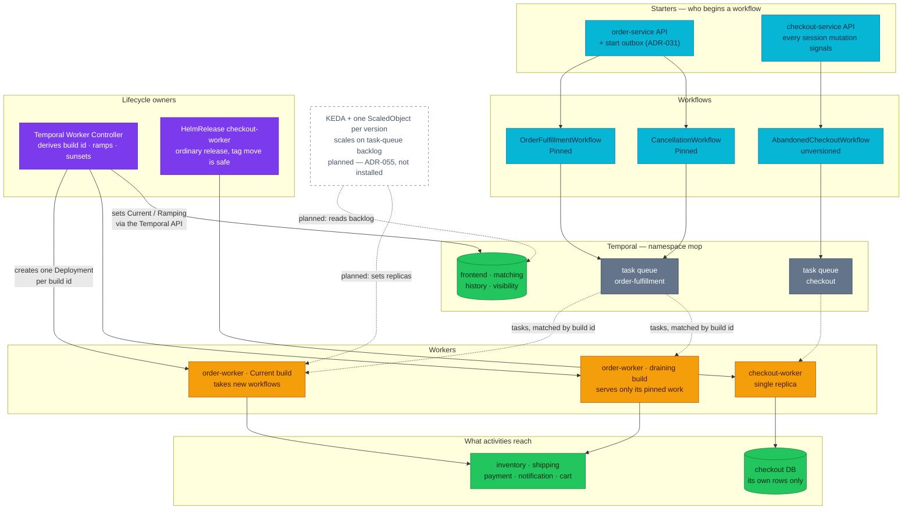

# Temporal Workflow Registry

The index of every Temporal workflow on the platform: what each one is for, who
owns it, and where the detail lives. This file is the **canonical owner of the
index**; per-service roles live in each service doc's `## Temporal participation`
section, and the behaviour of each workflow is in
[temporal.md](./temporal.md).

| Attribute | Value | RFC / ADR |
|-----------|-------|-----------|
| **Status** | Implemented — three workflows, two workers, all running in local-stack and in-cluster | — |
| **Scope** | The index, the ownership map and the naming rules. **Behaviour** — steps, compensation, retry policy, and the diagrams that explain them — belongs to [temporal.md](./temporal.md) | — |
| **Namespace** | `mop` | — |
| **Design records** | — | [ADR-030](../proposals/adr/ADR-030-temporal-workflow-versioning/) (versioning model) · [ADR-054](../proposals/adr/ADR-054-temporal-worker-controller/) (worker lifecycle) · [ADR-031](../proposals/adr/ADR-031-fulfillment-start-outbox/) (start outbox) · [RFC-0021](../proposals/rfc/RFC-0021/) |

## Registry

| Workflow | Purpose | Owner | Worker | Task queue | Detail |
|----------|---------|-------|--------|------------|--------|
| `OrderFulfillmentWorkflow` | Turn a committed order into money taken, stock committed and a shipment created — or undo all of it | order | `order-worker` — **versioned** as `order/order-fulfillment`, `Pinned` (ADR-030 model, ADR-054 mechanism) | `order-fulfillment` | [temporal.md § OrderFulfillmentWorkflow](./temporal.md#orderfulfillmentworkflow) |
| `CancellationWorkflow` | Give back what a cancelled order took, and park loudly when it cannot | order | `order-worker` (same worker) | `order-fulfillment` | [temporal.md § CancellationWorkflow](./temporal.md#cancellationworkflow) |
| `AbandonedCheckoutWorkflow` | Expire a checkout session the shopper walked away from | checkout | `checkout-worker` | `checkout` | [temporal.md § AbandonedCheckoutWorkflow](./temporal.md#abandonedcheckoutworkflow) |

One diagram, and it is the **whole topology of the work layer**: who starts each
workflow, which queue carries it, which worker serves that queue, and what owns that
worker's lifecycle. Deliberately *not* how a workflow behaves step by step, nor how a
task finds the build its execution was stamped with — those are
[temporal.md](./temporal.md)'s, and this file links rather than restates them.

Legend: cyan = application code · orange = running worker pods · purple = what owns a
worker's lifecycle · green = Temporal and the stores activities write to · grey = task queues, drawn inside the
Temporal subgraph because the server owns them · dashed white = **planned**, not installed. Dotted edges are task dispatch
(the server chooses the worker; nothing pushes) and the planned scaling path.

> **In plain terms:** three workflows, two queues, and two workers whose lifecycles are
> owned by different things — that asymmetry is the thing to carry away.
>
> Both order workflows share **one** queue and therefore one worker, so a build that
> refuses one of them refuses both. That worker exists in the plural: the Current build
> takes new workflows while a draining build keeps serving only the executions stamped
> with it, and a controller — not a person — decides when the draining one may go.
>
> `AbandonedCheckoutWorkflow` sits alone on its own queue and touches nothing but its
> own rows. That isolation is exactly why it could stay unversioned: there is no
> cross-service state for a mid-flight code change to strand, so a tag move needs no
> determinism argument.
>
> KEDA is drawn because the shape is decided, not because it runs. Nothing scales
> today: every worker is one replica, and the backlog it would read is already scraped
> and graphed with nothing acting on it — see
> [ADR-055](../proposals/adr/ADR-055-keda-worker-autoscaling/).

### What each one is for

**`OrderFulfillmentWorkflow`** starts when an order row commits and the shopper
has been told the order is being processed. It authorises payment, reserves
stock, creates the shipment, captures the money and confirms the order. Failure
before the pivot undoes every completed step; failure after it does not roll
back. Participants: inventory, shipping, payment, notification, cart.

**`CancellationWorkflow`** starts when a cancel request is accepted. It reads
what the order actually took — shipment, payment state, reservation state — and
returns each of them, then completes the cancellation. It always finishes; the
order's state carries the outcome, and anything that will not converge parks in
`manual_review` with a reason an operator can act on. Participants: shipping,
payment, inventory, notification.

**`AbandonedCheckoutWorkflow`** is signalled by every session mutation and
started by the first one. When its timer fires it asks the database whether the
session's deadline has really passed and expires the row only if it has. It
touches no other service and holds nothing: the deadline on the row is the only
clock, so a lost signal delays an expiry rather than causing a wrong one.

Both workers run in local-stack (`local-stack/compose.yaml`) and in-cluster on
namespace `mop`, and each is **one** manifest — but for different reasons, and the
difference is versioned vs unversioned, not one file vs many.

Order is **versioned** and its lifecycle belongs to the Temporal Worker Controller
(ADR-054): a single `WorkerDeployment` declares the worker, the controller derives
a build id from the pod template, creates one Deployment per version, ramps traffic
onto it, and deletes a version once the server reports it drained. A release edits
the image tag and nothing else. The determinism contract is unchanged and still the
point: a pre-phase-4 saga left with no poller would stall holding stock and an
authorization, because every build **since order 1.13.0 refuses** a
product-participant history rather than re-routing it — which is why retirement
waits on `drainedSince` rather than on a human's judgement.

Checkout is deliberately **not** versioned ([RFC-0026](../proposals/rfc/RFC-0026/)
left it out), so a tag move there is safe and its manifest is an ordinary
`HelmRelease`. See [order-worker.yaml](../../kubernetes/apps/order-worker.yaml) and
[checkout-worker.yaml](../../kubernetes/apps/checkout-worker.yaml).

## Standard roles

| Role | Meaning | In service doc |
|------|---------|----------------|
| **None** | No Temporal | Table 1 row `Temporal: None` + 3-line section |
| **Orchestrator** | Owns workflow + worker | Table 1 Worker + Temporal rows; full `## Temporal participation` |
| **Client** | StartWorkflow / SignalWithStart only | Table 1 Temporal row; section explains detached context |
| **Participant (gRPC)** | RPC called by an activity | Table 1 `Temporal: Participant`; gRPC table **Saga** column |
| **Participant (side-effect)** | REST/internal call from an activity | Table 1 `Temporal: Participant`; HTTP route + best-effort note |

## Per-service snapshot

| Service | Temporal role |
|---------|---------------|
| auth, user, review | **None** |
| shipping, payment, notification, inventory | **Participant (gRPC)** — order saga |
| product | **None** — former participant; `ReserveStock`/`ReleaseStock` left the contract in pkg v0.33.0 / product 1.7.0. It serves `BatchGetCurrentPrices` to checkout, which is not a saga step |
| cart | **Participant (REST)** — ClearCart activity |
| order | **Orchestrator** — `OrderFulfillmentWorkflow` + `CancellationWorkflow` |
| checkout | **Orchestrator** — `AbandonedCheckoutWorkflow` |

## Naming rules (new workflows)

| Concept | Pattern | Current examples |
|---------|---------|------------------|
| Workflow type | `{Domain}{Process}Workflow` | `OrderFulfillmentWorkflow`, `AbandonedCheckoutWorkflow` |
| Task queue | kebab-case, one queue per worker pool | `order-fulfillment`, `checkout` |
| Workflow ID | `{process-kebab}-{business-key}` | `order-fulfillment-<orderID>`, `order-cancellation-<orderID>-v<epoch>` |
| Worker deployment | `{owner-service}-worker` (same image, `args: ["worker"]`) | `order-worker`, `checkout-worker` |
| Activity | `{Verb}{Noun}` in orchestrator repo | `ReserveInventory`, `ExpireIfDue`, `ClearCart` |
| Participant contract | gRPC/HTTP doc in **owning service** | `PaymentService.Authorize` → [payments.md](./payments.md) |

A workflow ID carries a version suffix only when the same business key may
legitimately run the process more than once — `order-cancellation-…-v<epoch>` is
the one case today, because an order can re-enter cancellation after an operator
resolves it.

## Adding a workflow

1. Add a row to this registry **before** shipping code, with a Purpose that says
   what it is for rather than what it is called.
2. Add a section to [temporal.md](./temporal.md) using the same shape as the
   existing three: what it is for, what starts it, what it guarantees, its steps,
   and how it ends — with at least one diagram.
3. Orchestrator service doc: full `## Temporal participation` section.
4. Each participant doc: update the gRPC/HTTP table and the **Saga** column on
   the relevant RPC or route.
5. Do **not** paste step tables into the participant service docs — they link the
   deep dive instead.

## References

- [temporal.md](./temporal.md) — the three workflows as built, plus saga theory and operations
- [Service contracts](README.md#service-contracts) — platform deployment rollup

_Last updated: 2026-08-21 — RFC-0026/ADR-054: the Temporal Worker Controller owns the order worker's lifecycle, so there is one `WorkerDeployment` and the build id is derived rather than named here. The product-participant refusal stays attributed to the order 1.13.0 floor rather than to any running build._
