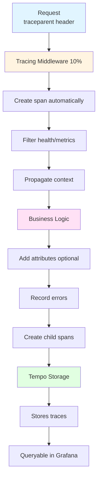

# Distributed Tracing Guide

## Quick Summary

**Objectives:**
- Implement distributed tracing across microservices
- Propagate trace context using W3C Trace Context standard
- Correlate traces with logs and metrics

**Learning Outcomes:**
- Distributed tracing concepts and benefits
- W3C Trace Context propagation
- OpenTelemetry instrumentation
- Span creation and context propagation
- Trace-to-logs and trace-to-metrics correlation

**Keywords:**
Distributed Tracing, OpenTelemetry, Spans, Trace Context, W3C Trace Context, Trace-ID, OTLP, Tempo, Trace Propagation, Correlation

**Technologies:**
- OpenTelemetry (tracing standard)
- Grafana Tempo (trace storage)
- OTLP HTTP protocol
- W3C Trace Context headers

---

## Table of Contents

1. [Getting Started](#getting-started) - Quick start guide
2. [Configuration](#configuration) - Environment variables and settings
3. [Basic Usage](#basic-usage) - Common tracing patterns
4. [Advanced Usage](#advanced-usage) - Helper functions and patterns
5. [Best Practices](#best-practices) - Production recommendations
6. [Troubleshooting](#troubleshooting) - Common issues and solutions
7. [Reference](#reference) - API documentation

---

## Getting Started

### Overview

Distributed tracing is implemented using **OpenTelemetry** and **Grafana Tempo**. All HTTP requests are automatically traced across microservices with:

- ✅ **10% sampling** by default (configurable)
- ✅ **Automatic request filtering** (health/metrics endpoints skipped)
- ✅ **Graceful shutdown** (zero lost spans)
- ✅ **W3C Trace Context** propagation

### How It Works



### Quick Setup

**1. Service initialization** (already configured in all services):

```go
// Initialize tracing
tp, err := middleware.InitTracing()
if err != nil {
    logger.Warn("Failed to initialize tracing", zap.Error(err))
}

// Add middleware
r.Use(middleware.TracingMiddleware())
```

**2. View traces in Grafana**:

```bash
kubectl port-forward -n monitoring svc/grafana-service 3000:3000
# Open http://localhost:3000 → Explore → Tempo
```

**3. Search traces by**:
- Service name (e.g., `auth`, `user`)
- Trace ID (from logs)
- Tags (HTTP status, duration)

---

## Configuration

### Environment Variables

| Variable | Default | Description |
|----------|---------|-------------|
| `OTEL_SAMPLE_RATE` | `0.1` (10%) | Trace sampling rate (0.0-1.0) |
| `ENV` | `production` | Environment: `development`=100% sampling, others=10% |
| `TEMPO_ENDPOINT` | `tempo.monitoring.svc.cluster.local:4318` | Tempo OTLP endpoint |
| `OTEL_SERVICE_NAME` | (auto-detected) | Override service name |

### Sampling Configuration

| Environment | Sample Rate | Use Case |
|-------------|-------------|----------|
| **Production** | 10% (`0.1`) | Cost-effective, statistically significant |
| **Staging** | 50% (`0.5`) | Balance cost and coverage |
| **Development** | 100% (`1.0`) | Full visibility for debugging |

**Example:**
```bash
# 50% sampling for staging
export OTEL_SAMPLE_RATE=0.5
```

### Request Filtering

Automatically skipped (reduces volume by 30-40%):

| Path | Reason |
|------|--------|
| `/health`, `/healthz`, `/readyz`, `/livez` | Health checks (high frequency, low value) |
| `/metrics` | Prometheus metrics endpoint |
| `/favicon.ico` | Browser requests |

**Custom filtering:**
```go
config := middleware.TracingConfig{
    SkipPaths: []string{
        "/health",
        "/admin/internal",  // Add custom paths
    },
}
tp, err := middleware.InitTracingWithConfig(config)
```

### Automatic Service Detection

Service name and namespace are **auto-detected** from:

1. `OTEL_SERVICE_NAME` env var (highest priority)
2. Pod name pattern: `auth-75c98b4b9c-kdv2n` → `auth`
3. Hostname (fallback)
4. Namespace from: `/var/run/secrets/kubernetes.io/serviceaccount/namespace`

**No manual configuration needed!**

---

## Basic Usage

### 1. Automatic Tracing

HTTP requests are **automatically traced** by the middleware. No code changes needed!

```go
// This handler is automatically traced
func GetUser(c *gin.Context) {
    // Your business logic
    c.JSON(200, user)
}
```

### 2. Recording Errors

Always record errors for debugging:

```go
result, err := processOrder(ctx, order)
if err != nil {
    middleware.RecordError(ctx, err)  // ← Add this
    return err
}
```

**What it does:**
- ✅ Records error in span
- ✅ Sets span status to `Error`
- ✅ Adds error message

### 3. Adding Business Context

Add relevant business attributes:

```go
func CreateOrder(c *gin.Context) {
    ctx := c.Request.Context()
    
    middleware.AddSpanAttributes(ctx,
        attribute.String("user.id", userID),
        attribute.String("order.id", orderID),
        attribute.Int("order.items", itemCount),
    )
    
    // Your business logic...
}
```

### 4. Marking Milestones

Track significant events:

```go
middleware.AddSpanEvent(ctx, "order.validated")
middleware.AddSpanEvent(ctx, "payment.approved")
middleware.AddSpanEvent(ctx, "inventory.reserved")
```

### 5. Creating Child Spans

For complex operations:

```go
func ProcessOrder(ctx context.Context, order Order) error {
    // Create child span
    ctx, span := middleware.StartSpan(ctx, "validate-inventory")
    defer span.End()
    
    // Your logic...
    return nil
}
```

---

## Advanced Usage

### Helper Functions Reference

| Function | Use Case | Example |
|----------|----------|---------|
| `AddSpanAttributes(ctx, attrs...)` | Add metadata | User ID, order ID, request params |
| `RecordError(ctx, err)` | Record errors | API errors, validation failures |
| `AddSpanEvent(ctx, name, attrs...)` | Mark milestones | State transitions, decisions |
| `SetSpanStatus(ctx, code, desc)` | Set status | Success/failure conditions |
| `StartSpan(ctx, name)` | Create child span | Complex operations |

### When to Use Each Helper

#### AddSpanAttributes

**✅ Good:**
```go
middleware.AddSpanAttributes(ctx,
    attribute.String("user.id", userID),        // ✅ User identification
    attribute.String("order.id", orderID),      // ✅ Business entity
    attribute.Int("page", pageNum),             // ✅ Request parameter
    attribute.Bool("is_premium", isPremium),    // ✅ Business context
)
```

**❌ Bad:**
```go
middleware.AddSpanAttributes(ctx,
    attribute.String("password", password),        // ❌ Sensitive data
    attribute.String("request_body", fullBody),    // ❌ Large payload
    attribute.String("timestamp", time.Now()),     // ❌ High cardinality
)
```

#### AddSpanEvent

**✅ Good:**
```go
middleware.AddSpanEvent(ctx, "order.validated")           // ✅ State transition
middleware.AddSpanEvent(ctx, "cache.hit")                 // ✅ Decision point
middleware.AddSpanEvent(ctx, "database.query.started")    // ✅ External call
```

**❌ Bad:**
```go
middleware.AddSpanEvent(ctx, "variable.assigned")    // ❌ Trivial operation
for _, item := range items {
    middleware.AddSpanEvent(ctx, "item.processed")  // ❌ In loop
}
```

### Complete Examples

#### Example 1: Order Processing Handler

```go
func CreateOrder(c *gin.Context) {
    ctx := c.Request.Context()
    
    // 1. Add request context
    middleware.AddSpanAttributes(ctx,
        attribute.String("user.id", getUserID(c)),
        attribute.String("user.role", getUserRole(c)),
    )
    
    // 2. Parse request
    var req OrderRequest
    if err := c.ShouldBindJSON(&req); err != nil {
        middleware.RecordError(ctx, err)
        c.JSON(400, gin.H{"error": "Invalid request"})
        return
    }
    
    middleware.AddSpanEvent(ctx, "request.parsed")
    middleware.AddSpanAttributes(ctx,
        attribute.Int("order.items", len(req.Items)),
        attribute.Float64("order.total", req.Total),
    )
    
    // 3. Validate with child span
    ctx, span := middleware.StartSpan(ctx, "validate-inventory")
    valid, err := checkInventory(ctx, req.Items)
    span.End()
    
    if err != nil {
        middleware.RecordError(ctx, err)
        c.JSON(500, gin.H{"error": "Inventory check failed"})
        return
    }
    
    if !valid {
        middleware.AddSpanEvent(ctx, "inventory.insufficient")
        c.JSON(400, gin.H{"error": "Insufficient inventory"})
        return
    }
    
    // 4. Create order
    order, err := createOrder(ctx, req)
    if err != nil {
        middleware.RecordError(ctx, err)
        c.JSON(500, gin.H{"error": "Failed to create order"})
        return
    }
    
    // 5. Success
    middleware.AddSpanAttributes(ctx,
        attribute.String("order.id", order.ID),
    )
    middleware.SetSpanStatus(ctx, codes.Ok, "Order created")
    
    c.JSON(200, order)
}
```

#### Example 2: External API Call

```go
func callPaymentGateway(ctx context.Context, amount float64) error {
    ctx, span := middleware.StartSpan(ctx, "payment-api-call")
    defer span.End()
    
    // Add semantic attributes
    middleware.AddSpanAttributes(ctx,
        attribute.String("http.method", "POST"),
        attribute.String("http.url", "https://payment.example.com/charge"),
        attribute.Float64("payment.amount", amount),
    )
    
    resp, err := http.Post(endpoint, "application/json", body)
    if err != nil {
        middleware.RecordError(ctx, err)
        return err
    }
    defer resp.Body.Close()
    
    middleware.AddSpanAttributes(ctx,
        attribute.Int("http.status_code", resp.StatusCode),
    )
    
    if resp.StatusCode != 200 {
        err := fmt.Errorf("payment failed: %d", resp.StatusCode)
        middleware.RecordError(ctx, err)
        return err
    }
    
    middleware.SetSpanStatus(ctx, codes.Ok, "Payment successful")
    return nil
}
```

#### Example 3: Database Query

```go
func getUserByID(ctx context.Context, userID string) (*User, error) {
    ctx, span := middleware.StartSpan(ctx, "db-get-user")
    defer span.End()
    
    // Follow OpenTelemetry semantic conventions
    middleware.AddSpanAttributes(ctx,
        attribute.String("db.system", "postgresql"),
        attribute.String("db.operation", "SELECT"),
        attribute.String("db.table", "users"),
    )
    
    var user User
    err := db.QueryRowContext(ctx, "SELECT * FROM users WHERE id = $1", userID).Scan(&user)
    
    if err == sql.ErrNoRows {
        middleware.AddSpanEvent(ctx, "user.not_found")
        return nil, fmt.Errorf("user not found: %s", userID)
    }
    
    if err != nil {
        middleware.RecordError(ctx, err)
        return nil, err
    }
    
    middleware.SetSpanStatus(ctx, codes.Ok, "User retrieved")
    return &user, nil
}
```

---

## Best Practices

### 🎯 Production Recommendations

| Practice | Why | How |
|----------|-----|-----|
| **Use 10% sampling** | Cost-effective, statistically significant | `OTEL_SAMPLE_RATE=0.1` |
| **Filter health checks** | Reduces noise by 30-40% | Automatic (default) |
| **Record all errors** | Essential for debugging | `RecordError(ctx, err)` |
| **Add business context** | Makes traces meaningful | `AddSpanAttributes(ctx, ...)` |
| **Graceful shutdown** | Zero lost spans | Automatic (configured) |

### ✅ Do's

1. **Always record errors:**
   ```go
   if err != nil {
       middleware.RecordError(ctx, err)  // ✅ Do this
       return err
   }
   ```

2. **Add meaningful attributes:**
   ```go
   middleware.AddSpanAttributes(ctx,
       attribute.String("user.id", userID),      // ✅ Useful
       attribute.String("order.id", orderID),    // ✅ Useful
   )
   ```

3. **Use child spans for distinct operations:**
   ```go
   ctx, span := middleware.StartSpan(ctx, "validate-payment")  // ✅ Good
   defer span.End()
   ```

### ❌ Don'ts

1. **Don't trace in loops:**
   ```go
   // ❌ BAD
   for _, item := range items {
       ctx, span := tracer.Start(ctx, "process-item")
       processItem(item)
       span.End()
   }
   
   // ✅ GOOD
   ctx, span := tracer.Start(ctx, "process-items")
   defer span.End()
   for _, item := range items {
       processItem(item)  // No tracing in loop
   }
   ```

2. **Don't add sensitive data:**
   ```go
   // ❌ BAD
   middleware.AddSpanAttributes(ctx,
       attribute.String("password", password),     // ❌ Never!
       attribute.String("credit_card", cc),        // ❌ Never!
   )
   
   // ✅ GOOD
   middleware.AddSpanAttributes(ctx,
       attribute.String("user.id", userID),        // ✅ OK
       attribute.Bool("payment.success", true),    // ✅ OK
   )
   ```

3. **Don't sample 100% in production:**
   ```go
   // ❌ BAD - Causes performance issues
   sdktrace.WithSampler(sdktrace.AlwaysSample())
   
   // ✅ GOOD - 10% is sufficient
   sdktrace.WithSampler(sdktrace.TraceIDRatioBased(0.1))
   ```

### 📋 Production Checklist

Before deploying, verify:

- ✅ Sampling configured (10% or environment-based)
- ✅ Request filtering enabled (automatic)
- ✅ Graceful shutdown implemented (automatic)
- ✅ Errors recorded with `RecordError()`
- ✅ Business context added with `AddSpanAttributes()`
- ✅ No sensitive data in spans
- ✅ No tracing in tight loops
- ✅ Semantic conventions followed
- ✅ Traces visible in Grafana

---

## Troubleshooting

### 🔍 Common Issues

#### Problem: No traces appearing

**Symptoms:** Grafana shows no traces for your service

**Solutions:**

1. Check sampling rate:
   ```bash
   # If too low, increase temporarily for debugging
   export OTEL_SAMPLE_RATE=1.0
   ```

2. Verify Tempo is running:
   ```bash
   kubectl get pods -n monitoring -l app=tempo
   kubectl logs -n monitoring deployment/tempo
   ```

3. Check service logs:
   ```bash
   kubectl logs -n <namespace> -l app=<service> | grep -i trace
   ```

#### Problem: Low trace volume

**Symptoms:** Expected 10% of requests but seeing much less

**Solutions:**

1. Verify sampling rate:
   ```bash
   # Expected: trace_count ≈ request_count * 0.1
   ```

2. Check request filtering:
   - Health checks are filtered (expected)
   - Verify business endpoints are traced

3. Monitor Tempo:
   ```promql
   rate(tempo_spans_received_total[5m])
   ```

#### Problem: High memory usage

**Symptoms:** Service consuming too much memory

**Solutions:**

1. Reduce sampling rate:
   ```bash
   export OTEL_SAMPLE_RATE=0.05  # 5%
   ```

2. Check batch timeout (default 5s is optimal):
   ```go
   // Only if you have very high traffic
   config.BatchTimeout = 2 * time.Second
   ```

3. Verify no tracing in loops:
   ```bash
   # Search your code for patterns like:
   grep -r "StartSpan.*for.*range" services/
   ```

#### Problem: Spans not flushed on shutdown

**Symptoms:** Missing traces during pod restarts

**Solutions:**

1. Verify graceful shutdown:
   ```bash
   kubectl logs -n <namespace> <pod> | grep -i "shutdown"
   # Should see: "Shutting down server..." and "Server exited gracefully"
   ```

2. Increase shutdown timeout if needed:
   ```go
   shutdownCtx, cancel := context.WithTimeout(context.Background(), 20*time.Second)
   ```

3. Check Tempo connectivity during shutdown:
   ```bash
   kubectl describe pod -n <namespace> <pod>
   ```

### 📊 Debugging Commands

```bash
# View traces in Grafana
kubectl port-forward -n monitoring svc/grafana-service 3000:3000
# Open http://localhost:3000 → Explore → Tempo

# Check Tempo metrics
kubectl port-forward -n monitoring svc/tempo 3200:3200
# Open http://localhost:3200/metrics

# View service logs with trace IDs
kubectl logs -n <namespace> -l app=<service> | jq '.trace_id'

# Check sampling rate in deployment
kubectl get deployment <service> -n <namespace> -o yaml | grep OTEL_SAMPLE_RATE
```

---

## Reference

### API Documentation

#### TracingConfig

```go
type TracingConfig struct {
    ServiceName      string        // Service name (auto-detected)
    ServiceNamespace string        // Kubernetes namespace (auto-detected)
    TempoEndpoint    string        // Tempo OTLP endpoint
    Insecure         bool          // Use insecure connection
    SampleRate       float64       // Sampling rate (0.0-1.0)
    ExportTimeout    time.Duration // Export timeout (default: 30s)
    BatchTimeout     time.Duration // Batch timeout (default: 5s)
    SkipPaths        []string      // Paths to skip tracing
}
```

#### Helper Functions

```go
// Initialize tracing with default config
func InitTracing() (*sdktrace.TracerProvider, error)

// Initialize with custom config
func InitTracingWithConfig(config TracingConfig) (*sdktrace.TracerProvider, error)

// Graceful shutdown
func Shutdown(ctx context.Context) error

// Start a child span
func StartSpan(ctx context.Context, name string) (context.Context, trace.Span)

// Add attributes to current span
func AddSpanAttributes(ctx context.Context, attrs ...attribute.KeyValue)

// Record error in current span
func RecordError(ctx context.Context, err error)

// Add event to current span
func AddSpanEvent(ctx context.Context, name string, attrs ...attribute.KeyValue)

// Set span status
func SetSpanStatus(ctx context.Context, code codes.Code, description string)
```

### W3C Trace Context

Traces use the W3C Trace Context standard:

```
traceparent: 00-<trace-id>-<parent-id>-<flags>
```

**Fallback:** `X-Trace-ID` header if `traceparent` not present.

### Semantic Conventions

Follow [OpenTelemetry Semantic Conventions](https://opentelemetry.io/docs/specs/semconv/):

**HTTP:**
```go
attribute.String("http.method", "POST")
attribute.String("http.route", "/api/v1/orders")
attribute.Int("http.status_code", 200)
```

**Database:**
```go
attribute.String("db.system", "postgresql")
attribute.String("db.operation", "SELECT")
attribute.String("db.table", "users")
```

**RPC:**
```go
attribute.String("rpc.system", "grpc")
attribute.String("rpc.service", "OrderService")
attribute.String("rpc.method", "CreateOrder")
```

### Graceful Shutdown

All services are configured with graceful shutdown:

**Sequence:**
1. Receive SIGINT/SIGTERM
2. Stop accepting new requests
3. Flush pending spans (via `middleware.Shutdown()`)
4. Shutdown HTTP server
5. Exit

**Timeout:** 10 seconds (configurable)

### Performance Characteristics

| Metric | Value | Notes |
|--------|-------|-------|
| Sampling overhead | < 1% CPU | At 10% sampling |
| Memory overhead | < 50MB | Per service |
| Export latency | < 100ms p99 | To Tempo |
| Trace volume reduction | 90% | vs 100% sampling |
| Request filtering reduction | 30-40% | Health/metrics skipped |

### External References

- [OpenTelemetry Go Documentation](https://opentelemetry.io/docs/instrumentation/go/)
- [Grafana Tempo Documentation](https://grafana.com/docs/tempo/latest/)
- [W3C Trace Context Specification](https://www.w3.org/TR/trace-context/)
- [OpenTelemetry Semantic Conventions](https://opentelemetry.io/docs/specs/semconv/)
