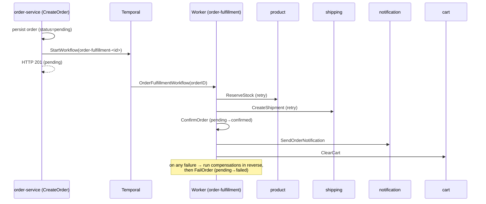
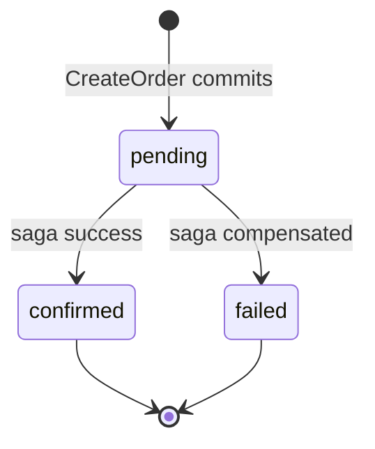
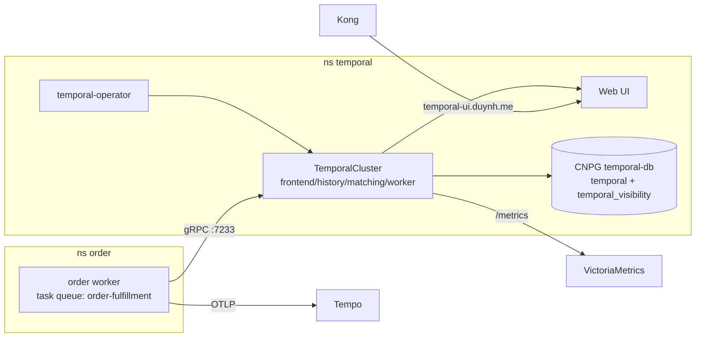

# Spec: Temporal Order-Fulfillment Saga

> **Status:** approved design / not yet implemented. This is the spec-driven source of truth for
> the platform's first Temporal workflow + the Temporal infrastructure. Implementation lands
> phase-by-phase (see [Phases](#phases)).

## 1. Objective

Make order fulfillment **durable, observable, and self-healing**. Today checkout is
synchronous + fire-and-forget: after the `orders` row commits, order-service calls notification
(gRPC) and cart-clear (REST) on detached contexts with **no retry/durability** (failures are
logged and lost), inventory decrement is a **TODO**, a shipment is never created proactively, and
there is **no compensation** on partial failure (`order-service internal/web/v1/handler.go`
`CreateOrder` + `logic/v1/service.go`).

Temporal replaces that with a **saga**: a durable workflow that orchestrates the fulfillment
steps with automatic retries and **compensating actions** on failure. Success = every checkout
either fully completes (stock reserved, shipment created, customer notified, cart cleared, order
`confirmed`) **or** is cleanly rolled back (stock released, shipment cancelled, order `failed`) —
and the process survives worker/pod restarts.

## 2. Decisions

- **Feature:** order-fulfillment saga (flagship — exercises orchestration + retry + durable
  execution + compensation).
- **Deploy:** [`alexandrevilain/temporal-operator`](https://github.com/alexandrevilain/temporal-operator)
  (`TemporalCluster`/`TemporalNamespace` CRDs) — fits the platform's operator-heavy GitOps better
  than the raw Helm chart; handles schema auto-setup + emits a `ServiceMonitor`.
- **Persistence:** a dedicated **CloudNativePG** `temporal-db` (default + `temporal_visibility`
  SQL stores). Advanced visibility stays **SQL** for now (Elasticsearch is a future option).
- **Worker:** embedded in the owning service via a `worker` subcommand (mirrors the existing
  `migrate` subcommand), not a separate repo.
- **Checkout contract:** the order is still committed synchronously and the HTTP **201 returns a
  `pending` order**; the workflow drives fulfillment asynchronously and moves the order to
  `confirmed`/`failed`.

## 3. The workflow

`OrderFulfillmentWorkflow(orderID)` — started from `CreateOrder` right after the order row
commits. Workflow ID `order-fulfillment-<orderID>` (dedup; reuse the existing idempotency key).
Task queue `order-fulfillment`. Each activity gets a `RetryPolicy` (exp backoff); compensations
are appended as steps succeed and run **in reverse** if a later step fails.

| # | Activity → service | Compensation | Notes |
|---|--------------------|--------------|-------|
| 1 | `ReserveStock(items)` → product-service (**new**) | `ReleaseStock(items)` | atomic per-item `stock -= qty WHERE stock >= qty` |
| 2 | `CreateShipment(orderID, addr)` → shipping-service (**new**) | `CancelShipment(id)` | idempotent by `orderID` |
| 3 | `ConfirmOrder(orderID)` → order core | `FailOrder(orderID)` | status `pending → confirmed` |
| 4 | `SendOrderNotification(userID, orderID)` → notification (gRPC) | — | idempotent, no compensation |
| 5 | `ClearCart(userID)` → cart (REST) | — | idempotent, no compensation |

### Order-status state machine

### Retry & timeouts
Activities: `StartToCloseTimeout` (e.g. 10s) + `RetryPolicy{InitialInterval: 1s, Backoff: 2.0,
MaxInterval: 100s, MaxAttempts: 5}`. Non-retryable business errors (e.g. insufficient stock →
`codes.FailedPrecondition`) are marked non-retryable so the saga compensates immediately instead
of hammering. Workflow has a sane `WorkflowExecutionTimeout`.

## 4. Infrastructure topology

- **Operator** in `kubernetes/infra/controllers/temporal/` (HelmRelease, image pinned).
- **temporal-db** in `kubernetes/infra/configs/databases/clusters/temporal-db/` mirroring
  `cnpg-db` (HA, PgDog pooler, Barman backup, PodMonitor, ESO/OpenBAO secret).
- **TemporalCluster + `mop` TemporalNamespace** (retention 168h) in
  `kubernetes/infra/configs/temporal/`: pinned server version, `numHistoryShards: 512`,
  `ui.enabled`, `metrics.prometheus.serviceMonitor.enabled`.
- **Kong** ingress for the UI; **Grafana dashboard + PrometheusRule** (cluster-down, persistence
  errors, task-queue backlog, workflow-failure rate).
- **Flux**: `controllers → temporal-operator`; `databases → temporal-db`; new `temporal`
  Kustomization (`dependsOn` databases) before `apps`; the order worker `dependsOn` temporal.
- **Kyverno**: temporal pods must satisfy image-pin/probes/resources/PSS (set via CR/HelmRelease
  values; a scoped+expiring PolicyException only if unavoidable).

## 5. New contracts (`pkg/proto`, buf, backward-compatible)
- **product**: `ReserveStock(items) → {ok}` · `ReleaseStock(items)`.
- **shipping**: `CreateShipment(orderID, addr) → {shipmentID}` · `CancelShipment(shipmentID)`.
- **`pkg/temporalx`**: shared client + worker bootstrap (mirrors `grpcx`/`obsx`) with the Temporal
  **OpenTelemetry interceptor** so workflows/activities emit traces/metrics into the existing stack.

## 6. Boundaries
- **Always:** activities idempotent + retry-safe; compensations idempotent; SHA-pin new actions/
  images; `go test -race`; verify on docker-local before each PR; CI green before merge.
- **Ask first:** changing the checkout 201 semantics further; adding Elasticsearch visibility;
  schema-affecting changes to shared DBs.
- **Never:** block the HTTP request on the full saga; put secrets in YAML; self-merge.

## 7. Success criteria
- Checkout → Temporal UI shows `OrderFulfillmentWorkflow` complete; stock decremented; shipment
  created; notification sent; cart cleared; order `confirmed`.
- **Durability:** kill the worker mid-run → it resumes and completes.
- **Compensation:** force `CreateShipment` to fail → retries exhaust → stock released, order
  `failed`.
- Infra: `TemporalCluster` Ready on Kind, UI via Kong, metrics in Grafana, Kyverno admits pods.

## 8. Open questions
- Temporal **server version** to pin (proposed: latest stable 1.27.x).
- Confirm the 201 = `pending` async-fulfillment contract (proposed; affects the SPA's
  post-checkout UX).

## Phases
0 spec (this doc) → 1 infra → 2 `pkg` temporalx+proto (tag) → 3 product inventory →
4 shipping create/cancel → 5 order saga+worker → 6 `mop` worker mode → 7 local-stack e2e →
8 docs/observability. Sequencing + verification: see the plan.
