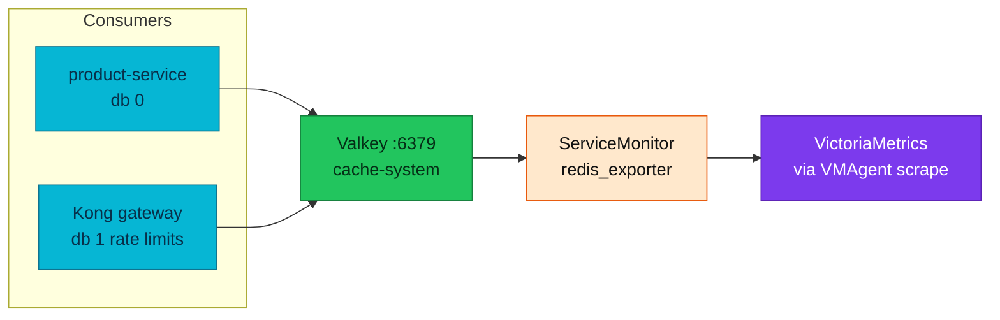
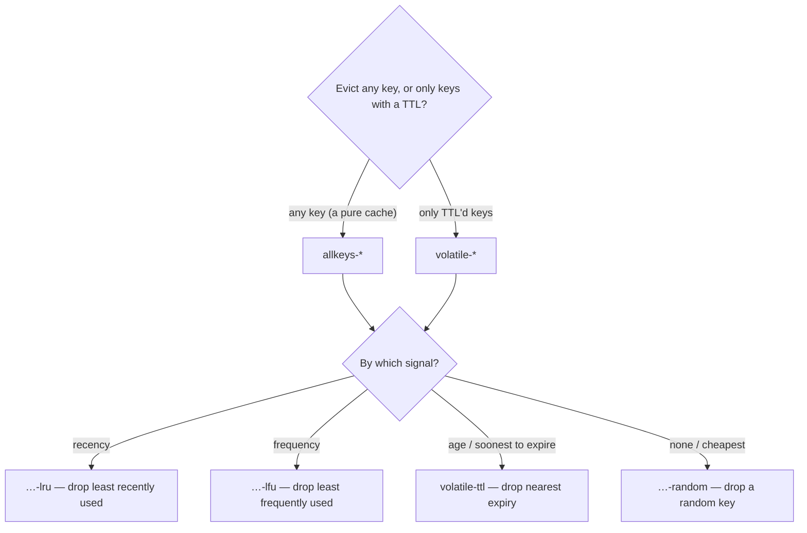
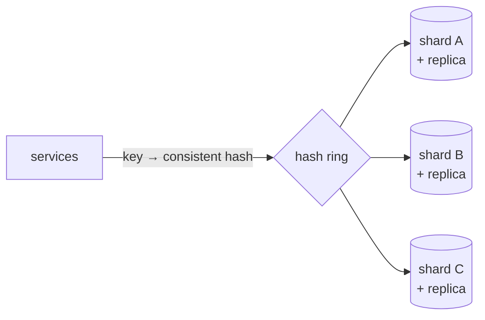

# Caching (Valkey)

Platform cache tier — a **single-node Valkey** instance (`cache-system` namespace) shared by product-service Cache-Aside (db `0`) and Kong distributed rate limiting (db `1`). App-side patterns (Cache-Aside, stampede lock, keys, env) are normative in [`../api/caching.md`](../api/caching.md).

| Attribute | Value |
|-----------|-------|
| **Backend** | Valkey (Redis-compatible), official Helm chart `0.9.4` |
| **Namespace** | `cache-system` |
| **Topology** | Single node — no replication, no persistence (local dev) |
| **Eviction** | `maxmemory-policy allkeys-lru` (Helm `valkeyConfig`) |
| **Metrics** | redis_exporter via chart `ServiceMonitor` |
| **App contract** | [Application caching](../api/caching.md) — Cache-Aside, keys, fail-open |
| **Cross-service rules** | [RFC-0004](../proposals/rfc/RFC-0004/) (provisional) |

> **Service authors:** implement caching in your repo per
> [**Application caching**](../api/caching.md). This hub covers **platform**
> deployment, eviction theory, Kong's second consumer, observability, and on-call
> troubleshooting — not Go handler code.

---

## Overview

Valkey backs read-heavy catalog caching for product-service and shared rate-limit
counters for Kong. Reads through the cache are **fail-open** (degrade to PostgreSQL);
a Valkey outage affects latency, not availability, for product paths. Kong uses
`fault_tolerant: true` on its redis policy so gateway traffic continues if Valkey
is down.

## Platform deployment

| Item | Location |
|------|----------|
| HelmRelease | [`kubernetes/infra/controllers/caching/valkey/helmrelease.yaml`](../../kubernetes/infra/controllers/caching/valkey/helmrelease.yaml) |
| Flux Kustomization | [`kubernetes/clusters/local/caching.yaml`](../../kubernetes/clusters/local/caching.yaml) (depends on `monitoring-local` for ServiceMonitor CRD) |
| HelmRepository | [`kubernetes/clusters/local/sources/helm/valkey.yaml`](../../kubernetes/clusters/local/sources/helm/valkey.yaml) |
| Service DNS | `valkey.cache-system.svc.cluster.local:6379` |
| Auth / persistence | Disabled in local dev (`auth.enabled: false`, `dataStorage.enabled: false`) |
| Resources | requests `20m`/`32Mi`, limits `50m`/`64Mi` |



## Key eviction policy {#eviction-policy}

### Overview

Key eviction policy determines how Valkey behaves when memory limits are reached. By default, Valkey uses `noeviction` policy, which rejects write operations when memory is full. For caching use cases, this is **not recommended** as it prevents new cache entries from being stored.

**Why Eviction Policy Matters:**

- **Memory Management**: Prevents OOM (Out of Memory) errors by evicting old keys
- **Cache Performance**: Ensures cache can accept new entries even when memory is full
- **Predictable Behavior**: Explicit policy ensures consistent cache behavior under memory pressure

### Eviction Policies

Valkey supports the following `maxmemory-policy` options:

| Policy | Description | Use Case |
|--------|-------------|----------|
| **noeviction** | Rejects writes when memory full, reads continue | Not recommended for cache (default) |
| **allkeys-lru** | Evicts least recently used keys from entire dataset | **Recommended for cache** - keeps recently accessed data |
| **allkeys-lfu** | Evicts least frequently used keys from entire dataset | Good for cache with access frequency patterns |
| **allkeys-random** | Randomly evicts any keys | Rarely used, unpredictable |
| **volatile-lru** | Evicts LRU keys that have TTL set | Only evicts keys with expiration |
| **volatile-lfu** | Evicts LFU keys that have TTL set | Only evicts keys with expiration |
| **volatile-random** | Randomly evicts keys with TTL | Only evicts keys with expiration |
| **volatile-ttl** | Evicts keys with shortest remaining TTL | Prioritizes expiring keys first |

A quick way to choose — pick the **scope** (any key vs only keys that carry a TTL),
then the **signal** used to decide what to drop (recency / frequency / age / random):



### Policy Comparison

**All-keys vs Volatile:**
- **All-keys policies** (`allkeys-*`): Can evict **any** key, regardless of TTL
- **Volatile policies** (`volatile-*`): Only evict keys **with TTL set**
  - If no keys have TTL, volatile policies behave like `noeviction`

**LRU vs LFU:**
- **LRU (Least Recently Used)**: Evicts keys that haven't been accessed recently
  - Good for: Recent access patterns, time-based popularity
- **LFU (Least Frequently Used)**: Evicts keys with lowest access frequency
  - Good for: Access frequency patterns, hot/cold data separation

### Deployed policy: `allkeys-lru`

**Rationale:**
- All product cache keys have TTL (list: 5m, detail: 10m)
- Can evict any key when memory is full (not limited to TTL keys)
- LRU keeps recently accessed products in cache

**Tradeoff:** `allkeys-lru` is *approximate* — Valkey samples a handful of keys
instead of tracking a true global LRU, and it is **not** frequency-aware, so a burst
of one-off reads can evict a genuinely hot key. It also assumes the working set fits
under `maxmemory`; if it doesn't, you get constant eviction churn (watch the
`ValkeyHighEvictionRate` alert). `allkeys-lfu` buys frequency-awareness at a small
per-key bookkeeping cost.

Configured in Helm: `valkeyConfig: maxmemory-policy allkeys-lru` in
[`helmrelease.yaml`](../../kubernetes/infra/controllers/caching/valkey/helmrelease.yaml).

## Second consumer: Kong rate-limit counters (db 1)

The same Valkey instance backs **Kong's distributed rate limiting**
(`rate-limiting-api` + `rate-limiting-admin` KongClusterPlugins, `policy: redis`)
— which puts Valkey **on the gateway request path**, not just the product read
path. Keyspaces are isolated by database index:

| Consumer | DB index | Purpose | Failure mode |
|---|---|---|---|
| product-service cache-aside | `0` | product/list cache | fail-open → DB |
| Kong rate limiting | `1` | shared counters across both Kong replicas | `fault_tolerant: true` → requests pass unlimited |

**Eviction caveat:** `allkeys-lru` applies to the whole instance — under memory
pressure it can evict *rate-limit counters* as readily as cache entries
(a counter reset momentarily raises a client's remaining quota). Acceptable at
homelab scale; a dedicated instance (or `volatile-*` policy) is the production
answer. See [kong-gateway.md](../platform/kong-gateway.md) for the plugin config.

## Distributed cache (concept and current state)

> **Current state:** a **single-node** Valkey (`cache-system` namespace, no
> replication, no persistence). Everything below is **concept + the scale-up path**
> if it ever outgrows one node — **not deployed today**.

A **distributed cache** spreads entries across several nodes so capacity and
throughput scale past one box, and one node failing doesn't drop the whole cache:

- **Partitioning (sharding)** — keys split across nodes; **consistent hashing** maps
  each key to a node so adding/removing a node re-homes only a small slice of keys,
  not the whole keyspace.
- **Replication** — each shard has replica(s) for availability and read scaling.
- **Hot keys** — one very popular key can overload its shard; mitigate with a small
  client/local cache for that key, or by splitting it.
- **Write strategy** — *Cache-Aside* (what we use: the app reads the cache and loads
  the DB on a miss) vs *read-through / write-through* (the cache sits inline and
  loads/persists for you) vs *write-behind* (async flush — fastest writes, weakest
  durability).



**Scale-up path here** (only if one node is genuinely the bottleneck): Valkey
**primary + replica** (read scaling + failover) → **Valkey Cluster** (sharded,
consistent hashing). The Cache-Aside code is unchanged — the client just points at
a cluster endpoint. **Tradeoff:** more nodes buy capacity and availability but add
cross-node consistency, rebalancing, and operational cost; not worth it until a
single node can't keep up (reads here already fail-open to PostgreSQL, so an outage
degrades rather than breaks).

## Observability {#observability}

Valkey metrics are scraped via the chart's **ServiceMonitor** (redis_exporter):

- `redis_commands_processed_total`: Total commands processed
- `redis_connected_clients`: Number of connected clients
- `redis_memory_used_bytes`: Memory usage
- `redis_keyspace_hits_total`: Cache hits
- `redis_keyspace_misses_total`: Cache misses

Recording rules: [`kubernetes/infra/configs/observability/metrics/prometheusrules/valkey/recording-rules.yaml`](../../kubernetes/infra/configs/observability/metrics/prometheusrules/valkey/recording-rules.yaml)
(`valkey:memory:usage_ratio`, `valkey:keyspace:hit_ratio5m`, `valkey:evictions:rate5m`, …).

**Cache hit rate (instance-wide):**
```promql
rate(redis_keyspace_hits_total[5m]) /
(rate(redis_keyspace_hits_total[5m]) + rate(redis_keyspace_misses_total[5m]))
```

App-side span attributes (`cache.hit`, …): [Application caching § Observability](../api/caching.md#observability-app-instrumentation).

## Operations and troubleshooting

### Cache not working

1. **Check Valkey deployment:**
   ```bash
   kubectl get pods -n cache-system | grep valkey
   kubectl logs -n cache-system deployment/valkey
   ```

2. **Check Product service logs:**
   ```bash
   kubectl logs -n product deployment/product | grep -i cache
   ```

3. **Verify configuration:**
   ```bash
   kubectl get deployment product -n product -o yaml | grep CACHE
   ```

4. **Test connection manually:**
   ```bash
   kubectl port-forward -n cache-system svc/valkey 6379:6379
   redis-cli -h 127.0.0.1 -p 6379 ping
   ```

### Cache always misses

- Check TTL configuration (too short TTL causes frequent misses)
- Verify cache keys are being generated correctly — see [Application caching § Cache key structure](../api/caching.md#cache-key-structure)
- Check for cache invalidation happening too frequently

### Cache stale data

- Verify cache invalidation on writes (CreateProduct should invalidate list cache)
- Check TTL values (too long TTL causes stale data)
- Cross-service staleness (e.g. stock): no invalidation hook today — [RFC-0004](../proposals/rfc/RFC-0004/)

### Performance issues

- Monitor Valkey memory usage: `redis_memory_used_bytes`
- Check cache hit rate (should be > 80% for read-heavy endpoints)
- Monitor cache operation latency in traces

### Live debugging and verification

**1. Verify connectivity from app to cache**
```bash
kubectl exec -n product -it deploy/product -- nc -zv valkey.cache-system.svc.cluster.local 6379
# Expected: valkey.cache-system.svc.cluster.local (10.96.x.x:6379) open
```

**2. Trigger cache population**
```bash
curl -sS https://gateway.duynh.me/product/v1/public/products | jq '.[0:2]'
curl -sS https://gateway.duynh.me/product/v1/public/products/14 | jq
```

**3. Inspect cache keys**
```bash
kubectl exec -n cache-system deploy/valkey -- redis-cli --scan --pattern "product:*"
```

**4. Check cache values**
```bash
kubectl exec -n cache-system deploy/valkey -- redis-cli GET "product:14"
```

## Roadmap gaps

Prioritized platform and contract gaps; cross-service rules owner: [RFC-0004](../proposals/rfc/RFC-0004/).

| # | Enhancement | Priority | Why / notes |
|---|-------------|----------|-------------|
| 1 | **Negative caching** | High | Short-TTL entries for not-found ids to stop penetration under id-scanning. |
| 2 | **Stronger stampede under slow DB** | High | In-process `singleflight` (or a larger waiter budget) when the DB itself is slow. |
| 3 | **Uncancellable lock release** | Medium | Release stampede lock on `context.WithoutCancel` when client disconnects mid-fetch. |
| 4 | **Cross-service invalidation** | Contingent | Cache-bust on stock reserve/release — [RFC-0004](../proposals/rfc/RFC-0004/). |
| 5 | **App-level cache metrics** | Medium | Prometheus hit/miss/error counters alongside server-side `redis_keyspace_*`. |
| 6 | **Valkey HA** | Low | Cluster/replica for capacity under load; reads already fail-open for availability. |

## References

- [Application caching](../api/caching.md) — normative app contract
- [RFC-0004](../proposals/rfc/RFC-0004/) — cross-service caching and invalidation
- [Kong gateway](../platform/kong-gateway.md) — rate-limit redis policy
- [Valkey Documentation](https://valkey.io/)
- [Valkey Helm chart](https://valkey.io/valkey-helm/)

_Last updated: 2026-07-22 — platform hub; app contract in docs/api/caching.md._
