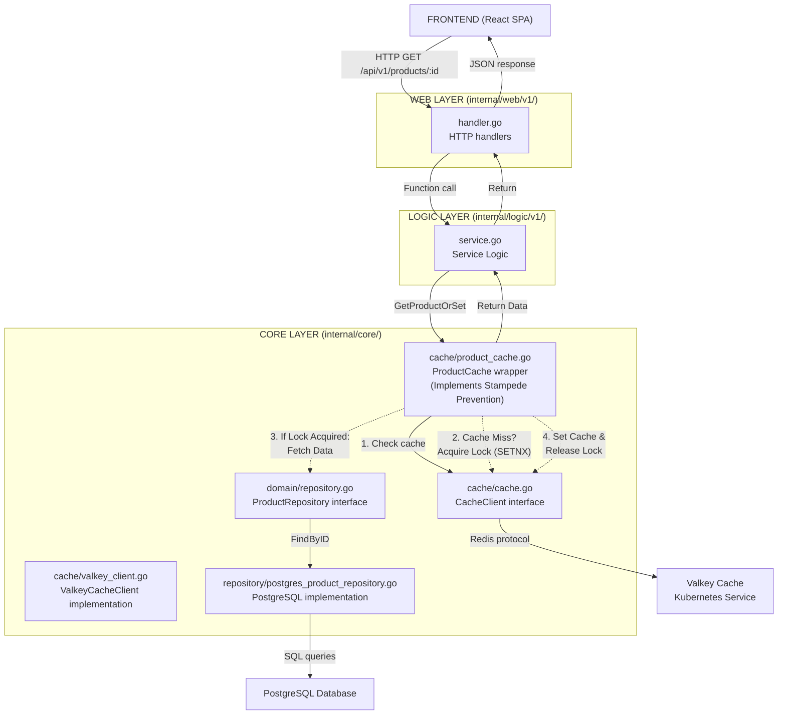

# Caching Documentation

> **Document Status:** Production  
> **Last Updated:** 2026-01-28  
> **Cache System:** Valkey (Redis-compatible)  
> **Pattern:** Cache-Aside (Read-Through)

---

## Overview

Valkey caching is integrated into the Product service to improve performance for read-heavy endpoints. The implementation follows the **Cache-Aside pattern** and includes **Stampede Prevention** (Distributed Locking) for hot keys, inspired by OpenAI's architecture.

## Architecture Integration

Caching is implemented in the **Core Layer** (`internal/core/cache/`), following the same pattern as repository interfaces:



### Layer Responsibilities

- **Web Layer**: No changes - handles HTTP requests/responses as before
- **Logic Layer**: Implements Cache-Aside pattern
  - Check cache first via `ProductCache` interface
  - If cache hit → return cached data immediately
  - If cache miss → query repository → write cache → return data
- **Core Layer**: 
  - `cache/cache.go`: `CacheClient` interface (abstraction over cache implementation)
  - `cache/valkey_client.go`: `ValkeyCacheClient` implementation (Redis-compatible)
  - `cache/product_cache.go`: `ProductCache` wrapper with key generation and JSON serialization

## Cache Stampede Prevention

> **Note:** This advanced pattern is inspired by OpenAI's PostgreSQL scaling architecture.

### The Problem: Thundering Herd
In a standard Cache-Aside pattern, a race condition occurs when a "hot" cache key expires:
1. **Cache Miss**: Key expires for a popular item (e.g., "iPhone 16").
2. **Concurrent Requests**: 1,000 users request this item simultaneously.
3. **DB Overload**: All 1,000 requests see a cache miss and trigger 1,000 database queries at the exact same moment.
4. **Impact**: Database CPU spikes, latency increases, potential outage.

### The Solution: Distributed Locking
We implement a **Locking Mechanism** (using Redis `SETNX`) to ensure only **one** process refreshes the cache.

1. **Request A** encounters cache miss.
2. **Request A** acquires a lock (`lock:product:123`) with a short TTL (e.g., 5s).
   - ✅ **Success**: Request A queries DB → Updates Cache → Releases Lock.
3. **Request B...Z** encounter cache miss.
4. **Request B...Z** try to acquire lock.
   - ❌ **Fail**: Lock already likely held by Request A.
   - **Wait**: They sleep briefly (e.g., 50ms) and retry the cache check.
   - **Result**: They eventually read the fresh data put in cache by Request A.

**Benefit**: DB load = 1 query (instead of 1,000).

## Cache-Aside Pattern Flow

### GET /api/v1/products (List Products)

1. **Logic Layer** calls `productCache.GetProductList(ctx, filters)`
2. **Cache Hit** → Return cached products and total count immediately
3. **Cache Miss** → 
   - Call `productRepo.FindAll(ctx, filters)` and `productRepo.Count(ctx, filters)`
   - Query PostgreSQL database
   - Write result to cache via `productCache.SetProductList(ctx, filters, products, total)`
   - Return data

### GET /api/v1/products/:id (Single Product)

1. **Logic Layer** calls `productCache.GetProductOrSet(ctx, id, fetchFunc)`
2. **ProductCache** checks cache:
   - **Hit**: Returns cached product immediately.
   - **Miss**: Tries to acquire distributed lock (`lock:product:{id}`).
3. **Locking Logic**:
   - **Acquired**: Calls `fetchFunc` (queries DB), updates cache, releases lock, returns data.
   - **Locked (Busy)**: Waits (spins) until data appears in cache, then returns it.
   - **benefit**: Only 1 request hits the DB even if 1,000 requests arrive simultaneously.

### POST /api/v1/products (Create Product)

1. Create product in database via repository
2. **Cache Invalidation**: Call `productCache.InvalidateProductList(ctx)` to delete list cache keys
3. This ensures new products appear in subsequent list queries

## Cache Key Structure

### Single Product
```
product:{id}
```
Example: `product:123`

### Product List
```
product:list:{category}:{search}:{sortBy}:{order}:{page}:{limit}
```
Examples:
- `product:list:all:none:created_at:desc:1:20`
- `product:list:Electronics:none:price:asc:1:30`
- `product:list:all:laptop:name:asc:2:20`

**Key Components:**
- `category`: Product category (normalized: "all" if empty)
- `search`: Search term (normalized: "none" if empty)
- `sortBy`: Sort field (default: "created_at")
- `order`: Sort order "asc" or "desc" (default: "desc")
- `page`: Page number (default: 1)
- `limit`: Items per page (default: 20)

## Configuration

### Environment Variables

| Variable | Default | Description |
|----------|---------|-------------|
| `CACHE_ENABLED` | `true` | Enable/disable caching |
| `CACHE_HOST` | `valkey.cache-system.svc.cluster.local` | Valkey service hostname |
| `CACHE_PORT` | `6379` | Valkey service port |
| `CACHE_PASSWORD` | `` | Valkey password (empty for local dev) |
| `CACHE_DB` | `0` | Valkey database number |
| `CACHE_TTL_PRODUCT_LIST` | `5m` | TTL for product list cache |
| `CACHE_TTL_PRODUCT_DETAIL` | `10m` | TTL for single product cache |

### Configuration Structure

```go
type CacheConfig struct {
    Enabled          bool          // Enable caching
    Host             string        // Cache host
    Port             string        // Cache port
    Password         string        // Cache password (optional)
    DB               int           // Cache database number
    TTLProductList   time.Duration // TTL for product list (default: 5m)
    TTLProductDetail time.Duration // TTL for single product (default: 10m)
}
```

## Key Eviction Policy

### Overview

Key eviction policy determines how Valkey behaves when memory limits are reached. By default, Valkey uses `noeviction` policy, which rejects write operations when memory is full. For caching use cases, this is **not recommended** as it prevents new cache entries from being stored.

**Why Eviction Policy Matters:**

- **Memory Management**: Prevents OOM (Out of Memory) errors by evicting old keys
- **Cache Performance**: Ensures cache can accept new entries even when memory is full
- **Predictable Behavior**: Explicit policy ensures consistent cache behavior under memory pressure

### Eviction Policies

Valkey supports the following `maxmemory-policy` options:

| Policy | Description | Use Case |
|--------|-------------|----------|
| **noeviction** | Rejects writes when memory full, reads continue | Not recommended for cache (default) |
| **allkeys-lru** | Evicts least recently used keys from entire dataset | **Recommended for cache** - keeps recently accessed data |
| **allkeys-lfu** | Evicts least frequently used keys from entire dataset | Good for cache with access frequency patterns |
| **allkeys-random** | Randomly evicts any keys | Rarely used, unpredictable |
| **volatile-lru** | Evicts LRU keys that have TTL set | Only evicts keys with expiration |
| **volatile-lfu** | Evicts LFU keys that have TTL set | Only evicts keys with expiration |
| **volatile-random** | Randomly evicts keys with TTL | Only evicts keys with expiration |
| **volatile-ttl** | Evicts keys with shortest remaining TTL | Prioritizes expiring keys first |

### Policy Comparison

**All-keys vs Volatile:**
- **All-keys policies** (`allkeys-*`): Can evict **any** key, regardless of TTL
- **Volatile policies** (`volatile-*`): Only evict keys **with TTL set**
  - If no keys have TTL, volatile policies behave like `noeviction`

**LRU vs LFU:**
- **LRU (Least Recently Used)**: Evicts keys that haven't been accessed recently
  - Good for: Recent access patterns, time-based popularity
- **LFU (Least Frequently Used)**: Evicts keys with lowest access frequency
  - Good for: Access frequency patterns, hot/cold data separation

### Recommendation for Product Service Caching

**Recommended Policy: `allkeys-lru`**

**Rationale:**
- All cache keys have TTL (product list: 5m, product detail: 10m)
- Can evict any key when memory is full (not limited to TTL keys)
- LRU keeps recently accessed products in cache
- Predictable behavior: least recently used products are evicted first

**Alternative: `allkeys-lfu`**
- Consider if you have "hot products" that are accessed frequently
- Better for access frequency-based patterns

**Configuration:**

Eviction policy is configured via `valkeyConfig` in HelmRelease (see [Deployment](#deployment) section).


## Observability

### Tracing

Cache operations are traced via OpenTelemetry spans:

- `cache.hit`: Boolean attribute indicating cache hit/miss
- `cache.error`: Boolean attribute indicating cache operation errors
- `cache.write_error`: Boolean attribute indicating cache write failures
- `cache.invalidation_error`: Boolean attribute indicating cache invalidation failures

**Example Trace:**
```
product.list (Logic Layer)
  ├─ cache.hit: false
  ├─ products.count: 20
  └─ products.total: 150
```

### Metrics

Valkey metrics are scraped by Prometheus via ServiceMonitor:

- `valkey_commands_processed_total`: Total commands processed
- `valkey_connected_clients`: Number of connected clients
- `valkey_memory_used_bytes`: Memory usage
- `valkey_keyspace_hits_total`: Cache hits
- `valkey_keyspace_misses_total`: Cache misses

**Cache Hit Rate:**
```
rate(valkey_keyspace_hits_total[5m]) / 
(rate(valkey_keyspace_hits_total[5m]) + rate(valkey_keyspace_misses_total[5m]))
```

## Troubleshooting

### Cache Not Working

1. **Check Valkey deployment:**
   ```bash
   kubectl get pods -n cache-system | grep valkey
   kubectl logs -n cache-system deployment/valkey
   ```

2. **Check Product service logs:**
   ```bash
   kubectl logs -n product deployment/product-service | grep -i cache
   ```

3. **Verify configuration:**
   ```bash
   kubectl get deployment product-service -n product -o yaml | grep CACHE
   ```

4. **Test connection manually:**
   ```bash
   kubectl port-forward -n cache-system svc/valkey 6379:6379
   redis-cli -h 127.0.0.1 -p 6379 ping
   ```

### Cache Always Misses

- Check TTL configuration (too short TTL causes frequent misses)
- Verify cache keys are being generated correctly
- Check for cache invalidation happening too frequently

### Cache Stale Data

- Verify cache invalidation on writes (CreateProduct should invalidate list cache)
- Check TTL values (too long TTL causes stale data)
- Consider implementing more granular cache invalidation

### Performance Issues

- Monitor Valkey memory usage: `valkey_memory_used_bytes`
- Check cache hit rate (should be > 80% for read-heavy endpoints)
- Consider increasing TTL for stable data
- Monitor cache operation latency in traces

### Live Debugging & Verification

Use these steps to verify caching is working in a live cluster:

**1. Verify Connectivity from App to Cache**
Check if the Product service can reach Valkey on port 6379:
```bash
kubectl exec -n product -it deploy/product -- nc -zv valkey.cache-system.svc.cluster.local 6379
# Expected output: valkey.cache-system.svc.cluster.local (10.96.x.x:6379) open
```

**2. Trigger Cache Population**
Make a request to the product service (using an ephemeral curl pod if needed):
```bash
# Launch a temporary pod to curl the internal service
kubectl run -it --rm curl-test --image=curlimages/curl --restart=Never -n product -- curl -v http://product.product.svc.cluster.local:8080/products
```

**3. Inspect Cache Keys**
Check if keys are created in Valkey:
```bash
# List all keys (use specific pattern in production)
kubectl exec -n cache-system deploy/valkey -- redis-cli KEYS "product:*"
# Expected output: 
# product:list:all:none:created_at:desc:1:20
# product:14

kubectl exec -n cache-system deploy/valkey -- redis-cli --scan --pattern "product:*"
```

**4. Check Cache Values**
View the cached JSON data:
```bash
kubectl exec -n cache-system deploy/valkey -- redis-cli GET "product:14"
# Expected output: {"id":"14","name":"Modern Headset",...}
```

---
## Future Enhancements

- **Pattern-based invalidation**: Use Redis SCAN for better cache invalidation
- **Cache warming**: Pre-populate cache on service startup
- **Distributed caching**: Valkey cluster for high availability
- **Cache compression**: Compress large cache values
- **Cache metrics**: Custom Prometheus metrics for cache operations

## References

- [Valkey Documentation](https://valkey.io/)
- [Redis Go Client](https://github.com/redis/go-redis)
- [Cache-Aside Pattern](https://docs.aws.amazon.com/AmazonElastiCache/latest/red-ug/Strategies.html)
- [3-Layer Architecture](../api/api.md#3-layer-architecture-responsibility)
