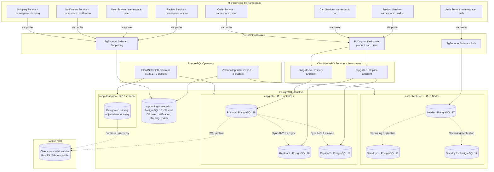
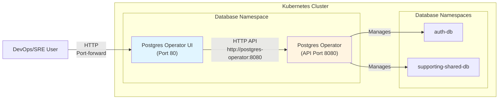

# Database Integration Guide
## Table of Contents

1. [Quick Summary](#quick-summary) - Operators, clusters, poolers overview
2. [Database Architecture](#database-architecture) - 3 clusters + DR overview diagram + tables
3. [CloudNativePG Operator](#cloudnativepg-operator) - Operator features, connection patterns, monitoring
4. [Zalando Postgres Operator](#zalando-postgres-operator) - Operator features, secrets, monitoring, management
5. [Connection Poolers](#connection-poolers) - PgBouncer, PgDog (active); PgCat (comparison / legacy) + configuration
6. [Related Documentation](#related-documentation) - Links to other docs
7. [Troubleshooting](#troubleshooting) - Common issues and solutions

> **Per-cluster details** (topology diagrams, endpoints, components): See each cluster's README in [`kubernetes/infra/configs/databases/clusters/`](../../kubernetes/infra/configs/databases/clusters/README.md)

---
## Quick Summary

| Operator                   | Version   | Cluster Name      | PostgreSQL Ver. | Nodes      | Pooler Type              | Pooler Details                    |
|----------------------------|-----------|-------------------|-----------------|------------|--------------------------|------------------------------------|
| Zalando Postgres Operator  | v1.15.1   | auth-db           | 17              | 3 (HA)     | PgBouncer Sidecar        | 2 instances                        |
| Zalando Postgres Operator  | v1.15.1   | supporting-shared-db     | 16              | 1          | PgBouncer Sidecar        | 2 instances                        |
| CloudNativePG Operator     | v1.28.1   | cnpg-db                  | 18              | 3 (HA)     | PgDog Standalone         | product, cart, order; sync (ANY 1) |
| CloudNativePG Operator     | v1.28.1   | cnpg-db-replica          | 18              | 1          | —                        | DR replica; object-store recovery    |
---

## Database Architecture

### Overview

The system uses **3 operational PostgreSQL clusters** + **1 DR replica** (Zalando: **auth-db**, **supporting-shared-db**; CloudNativePG: **cnpg-db** primary with **cnpg-db-replica** as disaster recovery) across operators and connection patterns. Application traffic for **product**, **cart**, and **order** shares **cnpg-db** and a single **PgDog** pooler (`pgdog-cnpg`).



### Database Cluster HA Summary

| Operator      | Cluster         | Database      | Owner                      | Secret NS  | Secret Type                | Direct Connection              | Pooler     | Instances                      | HA Pattern               | Namespace   |
|---------------|----------------|--------------|----------------------------|------------|----------------------------|-------------------------------|------------|-------------------------------|--------------------------|-------------|
| CloudNativePG | cnpg-db     | product      | product                    | product    | Manual (`cnpg-db-secret`) | `cnpg-db-rw.product:5432`  | PgDog      | 3 (1 primary + 2 replicas)     | CNPG sync (ANY 1)        | product     |
| CloudNativePG | cnpg-db     | cart         | cart                       | cart       | Manual (`cnpg-db-cart-secret`) | `cnpg-db-rw.product:5432` | PgDog      | 3 (1 primary + 2 replicas)     | CNPG sync (ANY 1)        | cart        |
| CloudNativePG | cnpg-db     | order        | order                      | order      | Manual (`cnpg-db-order-secret`) | `cnpg-db-rw.product:5432` | PgDog      | 3 (1 primary + 2 replicas)     | CNPG sync (ANY 1)        | order       |
| CloudNativePG | cnpg-db-replica | —        | —                          | product    | —                         | —                          | —          | 1 (DR replica)                 | Object-store recovery    | product     |
| Zalando       | auth-db        | auth         | auth                       | auth       | Auto (operator)            | `auth-db.auth:5432`           | PgBouncer  | 3 (1 leader + 2 standbys)      | Patroni HA               | auth        |
| Zalando       | supporting-shared-db  | user         | user                       | user       | Auto (operator)            | `supporting-shared-db.user:5432`     | PgBouncer  | 1 (single instance)            | Patroni (single)         | user        |
| Zalando       | supporting-shared-db  | notification | notification.notification  | notification| Auto (cross-ns)           | `supporting-shared-db.user:5432`     | PgBouncer  | 1 (single instance)            | Patroni (single)         | user        |
| Zalando       | supporting-shared-db  | shipping     | shipping.shipping          | shipping   | Auto (cross-ns)           | `supporting-shared-db.user:5432`     | PgBouncer  | 1 (single instance)            | Patroni (single)         | user        |
| Zalando       | supporting-shared-db  | review       | review.review              | review     | Auto (cross-ns)           | `supporting-shared-db.user:5432`     | PgBouncer  | 1 (single instance)            | Patroni (single)         | user        |

### Pooler Summary

| Cluster         | App Endpoint (via Pooler)              | Pooler     | Mode      | Notes                   |
|-----------------|----------------------------------------|------------|-----------|-------------------------|
| cnpg-db         | `pgdog-cnpg.product:6432`              | PgDog      | Standalone| Single entry point for product, cart, order; R/W split to `cnpg-db-rw` / `cnpg-db-r` |
| cnpg-db-replica | —                                      | —          | —         | DR only; apps use primary `cnpg-db` after promotion / failover drill |
| auth-db         | `auth-db-pooler.auth:5432`             | PgBouncer  | Standalone| -                       |
| supporting-shared-db   | `supporting-shared-db-pooler.user:5432`       | PgBouncer  | Standalone| 4 databases: user, notification, shipping, review |


---

## CloudNativePG Operator

### Overview

**CloudNativePG Operator** (v1.28.1) is a Kubernetes-native operator for PostgreSQL with its own built-in Instance Manager for high availability. It does **not** use Patroni -- the operator itself handles failover, promotion, and lifecycle management through the Kubernetes API.

**Key Features:**
- Kubernetes-native CRDs for cluster management
- Operator-driven HA with automatic failover (< 30 seconds) via Instance Manager
- PostgreSQL 18 (default image)
- Built-in `postgres_exporter` sidecar for metrics
- Support for synchronous replication
- Logical replication slot synchronization
- Production-ready performance tuning

| Cluster            | Database(s)                 | Instances                       | Replication Type              |
|--------------------|-----------------------------|----------------------------------|-------------------------------|
| **cnpg-db**        | product, cart, order        | 3 (1 primary + 2 replicas)       | Synchronous quorum (ANY 1)    |
| **cnpg-db-replica**| — (DR standby)              | 1                                | Continuous recovery from archive |

---
### Clusters

#### cnpg-db

Consolidated **CloudNativePG** cluster for **product**, **cart**, and **order** (replaces the former split of separate CNPG clusters for catalog vs checkout).

- **3 instances** (1 primary + 2 replicas), **synchronous quorum** `ANY 1` with required durability (see cluster `spec.postgresql.synchronous` in manifests)
- **Databases**: `product`, `cart`, `order` on the same cluster; cluster lives in namespace **`product`**
- **Pooler**: **PgDog** (HelmRelease `pgdog-cnpg`), unified endpoint **`pgdog-cnpg.product:6432`** — product, cart, and order services use this single entry point; PgDog routes writes to `cnpg-db-rw` and read traffic to `cnpg-db-r` per pool/database config
- **Extensions**: pgaudit, pg_stat_statements, auto_explain, pgcrypto, uuid-ossp (via Database resources as configured)
- **Features**: Logical replication slot sync for CDC (Debezium, Kafka Connect) where enabled

> **Manifests, backup, pooler**: [`kubernetes/infra/configs/databases/clusters/cnpg-db/`](../../kubernetes/infra/configs/databases/clusters/cnpg-db/)

#### cnpg-db-replica

- **1 instance**, DR replica cluster continuously recovering from **`cnpg-db`** WAL in object storage (not an application pooler target in steady state)
- **Namespace**: `product`

> **DR replica manifests**: [`kubernetes/infra/configs/databases/clusters/cnpg-db-replica/`](../../kubernetes/infra/configs/databases/clusters/cnpg-db-replica/)

**Note on HA Architecture:**
- CloudNativePG does **not** use Patroni. It has its own native [Instance Manager](https://cloudnative-pg.io/docs/1.28/instance_manager/) that handles failover and lifecycle.
- The operator uses Kubernetes API as the sole coordination layer -- no DCS, no etcd required.
- For a full comparison with Zalando's Patroni-based HA, see [Operator Comparison](./003-operator-comparison.md).

### Features & Capabilities

**High Availability:**
- Operator-driven HA with automatic failover (< 30 seconds) via native Instance Manager
- Kubernetes API as sole coordination layer (no DCS, no Patroni, no etcd)
- Quorum-based failover available for synchronous replication clusters

**Replication:**
- **cnpg-db**: synchronous quorum (**ANY 1**) with required durability across replicas; third replica may follow asynchronously per operator behavior
- **cnpg-db-replica**: standby fed from object-store WAL archive (DR)
- Logical replication slot synchronization for CDC clients where configured

**Performance Tuning:**
- Production-ready PostgreSQL parameters (memory, WAL, query planner, parallelism, autovacuum, logging)
- Optimized resource limits
- SSD-optimized settings

**Multi-Database Support:**
- **cnpg-db** hosts `product`, `cart`, and `order` on one cluster
- **PgDog** provides multi-database routing and read/write splitting to CNPG `-rw` / `-r` services (replaces the former **PgCat** deployment for cart/order in active GitOps)

### Connection Patterns

> **Deep Dive**: For detailed architecture, trade-offs, and configuration of **PgDog**, **PgBouncer**, and **PgCat** (comparison / legacy), see [`docs/databases/008-pooler.md`](./008-pooler.md).

#### PgDog (unified pooler for cnpg-db)

**Endpoint**: `pgdog-cnpg.product:6432` (short form inside cluster: `pgdog-cnpg.product.svc.cluster.local:6432`)

- **Role**: Single pooler entry point for **product**, **cart**, and **order** application traffic.
- **Topology**: Routes writes to **`cnpg-db-rw`**, read workload to **`cnpg-db-r`**, per database definitions in the PgDog Helm values.
- **Pooling Mode**: `transaction` (per upstream database config).

**Historical note:** Cart and order previously used a standalone **PgCat** service (`pgcat.cart`); that path is no longer the documented active stack for CNPG — see [Connection Poolers](#connection-poolers) for comparison context.


### Configuration

**Key Configuration Parameters:**
- `instances`: **3** for **`cnpg-db`** (1 primary + 2 replicas); **1** for **`cnpg-db-replica`** (DR)
- `postgresql.parameters`: PostgreSQL configuration parameters
- `postgresql.synchronous`: Synchronous replication settings on **`cnpg-db`** (e.g. `method: any`, `number: 1`)
- `replicationSlots.highAvailability.synchronizeLogicalDecoding`: Logical replication slot sync
- `resources`: CPU and memory limits
- `storage.size`: Persistent volume size

**Secret Management:**
- CloudNativePG requires pre-created secrets
- Secrets must be created before cluster deployment
- Secret format: `{cluster-name}-secret` in cluster namespace
- Contains: `username`, `password` keys

### Monitoring

#### PodMonitor Setup

CloudNativePG clusters use **PodMonitor** CRDs to enable Prometheus scraping of `postgres_exporter` sidecars.

**Key Elements:**
- **Selector**: Matches pods with label `cnpg.io/cluster: <cluster>` (e.g. `cnpg-db`, `cnpg-db-replica`) per `PodMonitor`
- **Port**: `metrics` (exposed by postgres_exporter sidecar)
- **Interval**: 15s scrape interval
- **Labels**: Captures cluster, role (primary/replica), instance name

**Key Metrics:**
- `pg_up` - Database availability
- `pg_stat_database_*` - Database statistics
- `pg_stat_activity_*` - Active connections
- `pg_replication_*` - Replication lag

---
## Zalando Postgres Operator

### Overview

**Zalando Postgres Operator** (v1.15.1) is a Kubernetes operator for PostgreSQL that uses Patroni internally for high availability management. It provides comprehensive PostgreSQL cluster management with built-in features like PgBouncer sidecar and automatic secret generation.

**Key Features:**
- Kubernetes-native CRDs for cluster management
- Patroni-based HA with automatic failover (< 30 seconds)
- PostgreSQL versions: 16 (supporting-shared-db), 17 (auth-db) - explicitly configured
- Built-in PgBouncer sidecar for connection pooling
- Automatic secret generation
- Cross-namespace secret support
- Built-in `postgres_exporter` sidecar for metrics with custom queries
- **Vector sidecar**: Log collection for PostgreSQL logs (all clusters)
- **Optional UI Component**: Web-based graphical interface for cluster management

| Cluster Name        | Instances          | Description                                        |
|---------------------|-------------------|----------------------------------------------------|
| **auth-db**         | 3 (1 leader, 2 standby) | Auth Database (production-ready high availability) |
| **supporting-shared-db**   | 1                 | Supporting Database (shared: user, notification, shipping, review) |

---

### Clusters

#### auth-db

- **3 instances** (1 leader + 2 standbys), PostgreSQL 17, streaming replication
- **Pooler**: PgBouncer sidecar (2 instances), endpoint `auth-db-pooler.auth:5432`
- **Namespace**: `auth`
- **Dual connection pattern**: Main container uses PgBouncer; init container uses direct connection (for DDL)
- **Sidecars**: postgres_exporter + Vector (log collection to Loki)
- **Extensions**: pg_stat_statements, pg_cron, pg_trgm, pgcrypto, pg_stat_kcache

> **Topology diagram, endpoints, monitoring config**: See [auth-db README](../../kubernetes/infra/configs/databases/clusters/auth-db/README.md)

---
#### supporting-shared-db

- **1 instance** (single, no HA), PostgreSQL 16
- **Databases**: `user`, `notification`, `shipping`, `review` (shared database pattern)
- **Pooler**: PgBouncer sidecar (2 instances), endpoint `supporting-shared-db-pooler.user:5432`
- **Namespace**: `user` (cluster location), cross-namespace secrets for `notification`, `shipping`, and `review`
- **Sidecars**: postgres_exporter + Vector (log collection to Loki)
- **Extensions**: pg_stat_statements, pg_cron, pg_trgm, pgcrypto, pg_stat_kcache

> **Topology diagram, endpoints, cross-namespace secrets**: See [supporting-shared-db README](../../kubernetes/infra/configs/databases/clusters/supporting-shared-db/README.md)

### Features & Capabilities

**High Availability:**
- Patroni-based HA with automatic failover (< 30 seconds)
- Kubernetes API as Distributed Configuration Store (DCS)
- 3-node HA setup for Auth DB (production-ready)

**Built-in Features:**
- PgBouncer sidecar for connection pooling (Auth DB and Supporting Shared DB)
- Automatic secret generation
- Cross-namespace secret support
- Built-in `postgres_exporter` sidecar for metrics

**Production-Ready Configuration:**
- Comprehensive PostgreSQL performance tuning (Auth DB)
- Optimized resource limits
- Enhanced logging for security auditing

### Monitoring

#### PodMonitor Setup

Zalando clusters use **PodMonitor** CRDs to enable Prometheus scraping of `postgres_exporter` sidecars.

#### Log Collection with Vector Sidecar

All Zalando PostgreSQL clusters include a **Vector sidecar** for log collection and shipping to Loki.

**Configuration:**
- **Vector ConfigMaps**: Located in each cluster's `configmaps/` folder (used by Zalando database instances as sidecar configs)
  - `kubernetes/infra/configs/databases/clusters/auth-db/configmaps/vector-sidecar.yaml` (Auth DB)
  - `kubernetes/infra/configs/databases/clusters/supporting-shared-db/configmaps/vector-sidecar.yaml` (Supporting DB)
- **Log Location**: `/home/postgres/pgdata/pgroot/pg_log/*.log` (default Zalando Spilo log path)
- **Loki Endpoint**: `http://loki.monitoring.svc.cluster.local:3100`
- **Features**:
  - Multiline log parsing (PostgreSQL log format with timestamp detection)
  - Label injection (namespace, cluster, pod, container)
  - Automatic log shipping to Loki

#### Custom Metrics with postgres_exporter

All Zalando PostgreSQL clusters include `postgres_exporter` sidecars with **custom queries** for enhanced metrics.

**Configuration:**
- **Custom Queries ConfigMaps**: Located in each cluster's `configmaps/` folder
  - `kubernetes/infra/configs/databases/clusters/auth-db/configmaps/monitoring-queries.yaml` (Auth DB)
  - `kubernetes/infra/configs/databases/clusters/supporting-shared-db/configmaps/monitoring-queries.yaml` (Supporting DB)
- **Environment Variable**: `PG_EXPORTER_EXTEND_QUERY_PATH=/etc/postgres-exporter/queries.yaml`
- **Custom Queries Configured**:
  - **pg_stat_statements**: Query performance metrics (execution time, calls, cache hits, I/O statistics) - Top 100 queries by execution time
  - **pg_replication**: Replication lag monitoring (critical for HA clusters like auth-db)
  - **pg_postmaster**: PostgreSQL server start time

**Key Metrics Exposed:**
- `pg_stat_statements_*` (calls, time_milliseconds, rows, shared_blks_hit, shared_blks_read, etc.)
- `pg_replication_lag` (replication lag in seconds)
- `pg_postmaster_start_time_seconds` (server start time)

**Prerequisites:**
- PostgreSQL clusters must have `pg_stat_statements` extension enabled (configured via `shared_preload_libraries` in CRDs)

**Verification:**
```bash
# Check if custom metrics are exposed
kubectl port-forward -n auth svc/auth-db 9187:9187
curl http://localhost:9187/metrics | grep pg_stat_statements

# Query metrics in Prometheus/Grafana
pg_stat_statements_calls{namespace="auth", cluster="auth-db"}
```

### Connection Patterns

> **Deep Dive**: See [`docs/databases/008-pooler.md`](./008-pooler.md) for details on **PgBouncer** sidecar architecture.

#### Direct Connection

- **Used by**: Optional / break-glass (e.g. migrations, `kubectl exec`); application traffic for Zalando clusters goes through the pooler service below.
- **Endpoint**: `{cluster-name}.{namespace}:5432`
- **Use case**: Admin tasks, debugging, or services that intentionally bypass the pooler.

#### PgBouncer Sidecar

- **Used by**: Auth DB, Supporting Shared DB (including **review** — same pooler as user/notification/shipping; see [Database Cluster HA Summary](#database-cluster-ha-summary))
- **Endpoint**: `{cluster-name}-pooler.{namespace}:5432`
- **Architecture**: Sidecar container injected by Operator.
- **Pooling Mode**: `transaction`.


### Secret Management

#### Secret Naming Convention

Zalando Postgres Operator automatically creates secrets for each database user. The naming convention depends on whether cross-namespace secrets are enabled:

**Regular Format** (same namespace):
`{username}.{cluster-name}.credentials.postgresql.acid.zalan.do`

**Cross-Namespace Format** (when `enable_cross_namespace_secret: true`):
`{namespace}.{username}.{cluster-name}.credentials.postgresql.acid.zalan.do`

| Service | Secret Name | Namespace | Format |
|---------|-------------|-----------|--------|
| **User** | `user.supporting-shared-db.credentials.postgresql.acid.zalan.do` | `user` | Regular (same namespace) |
| **Notification** | `notification.notification.supporting-shared-db.credentials.postgresql.acid.zalan.do` | `notification` | Cross-namespace (`namespace.username`) |
| **Shipping** | `shipping.shipping.supporting-shared-db.credentials.postgresql.acid.zalan.do` | `shipping` | Cross-namespace (`namespace.username`) |
| **Review** | `review.review.supporting-shared-db.credentials.postgresql.acid.zalan.do` | `review` | Cross-namespace (`namespace.username`) |
| **Auth** | `auth.auth-db.credentials.postgresql.acid.zalan.do` | `auth` | Regular (same namespace) |

**Note**: 
- These secrets contain `username` and `password` keys
- Helm charts reference these secrets directly - no manual secret creation needed for Zalando-managed databases
- Cross-namespace secrets use `namespace.username` format in the database CRD (e.g., `notification.notification`)

#### Cross-Namespace Secrets for Shared Supporting Database

The **Supporting Database** (`supporting-shared-db`) cluster uses a **shared database pattern** where multiple services (User, Notification, Shipping, Review) share the same PostgreSQL cluster but use separate databases within that cluster.

**Key Characteristics:**
- **Cluster Location**: `supporting-shared-db` cluster is deployed in the `user` namespace
- **Services**: User (same namespace), Notification (`notification` namespace), Shipping (`shipping` namespace), Review (`review` namespace)
- **Cross-Namespace Secret Management**: Zalando operator configured with `enable_cross_namespace_secret: true`
- **User Format**: `namespace.username` notation (e.g., `notification.notification`, `shipping.shipping`)
- **Secret Names**: `{namespace}.{username}.{clustername}.credentials.postgresql.acid.zalan.do`

**Configuration:**

**OperatorConfiguration CRD** - **Helm-managed CRD (`postgres-operator`) is the active configuration**:

- **CRD Name**: `postgres-operator` (created automatically by Helm chart)
- **Configuration Source**: `kubernetes/infra/controllers/databases/zalando-operator.yaml` (HelmRelease values):
```yaml
   # Flat structure (NOT nested under config:)
   configKubernetes:
     cluster_name: "kind-cluster"
     enable_cross_namespace_secret: true  # Enable cross-namespace secret creation
   ```
- **Important**: Helm chart expects **flat structure** (`configKubernetes:`, `configPostgresql:`, etc.) as top-level keys, NOT nested under `config:`
- **How Operator Reads It**: Operator reads this CRD via `POSTGRES_OPERATOR_CONFIGURATION_OBJECT: postgres-operator` environment variable (set by Helm chart)
- **To Update Configuration**: Edit the HelmRelease values and reconcile via Flux (`make sync`)

**Note:** The Helm chart automatically creates the `postgres-operator` OperatorConfiguration CRD from the values file. This is the only configuration method used.

**Multi-Database Configuration:**
- **user** database → `user` namespace
- **notification** database → `notification` namespace (cross-namespace secret)
- **shipping** database → `shipping` namespace (cross-namespace secret)
- **review** database → `review` namespace (cross-namespace secret)

**Key**: Use `namespace.username` format for cross-namespace secrets

### Password Rotation

**Purpose:** Secure password rotation procedures for Zalando Postgres Operator-managed database credentials, ensuring zero-downtime updates and compliance with security policies.

#### Overview

Password rotation is a critical security practice for production databases. Zalando Postgres Operator manages passwords via Kubernetes Secrets, and rotation can be performed through:

1. **Native Zalando Approach** - Manual rotation via secret updates (documented below)
2. **External Secrets Operator** - Automatic rotation from Vault/AWS Secrets Manager (future implementation)

**Rotation Schedule:**
- **Infrastructure roles** (monitoring, backup): Every 90 days
- **Application users**: Every 180 days (or per compliance policy)
- **Emergency rotation**: Immediately upon security incident

**Reference:** For detailed procedures and External Secrets Operator integration, see [`specs/active/Zalando-operator/research.md`](../../specs/active/Zalando-operator/research.md#password-rotation-in-kubernetes-secrets).

#### Native Zalando Password Rotation

**How It Works:**
- Zalando operator generates passwords automatically when creating users
- Passwords are stored in Kubernetes Secrets
- Operator watches secrets and updates database passwords when secrets change
- Services using `secretKeyRef` automatically get updated passwords


#### Zero-Downtime Rotation Strategy

**Dual Password Approach:**

1. **Add new password to secret** (keep old password temporarily)
2. **Operator updates database** with new password
3. **Restart services** to pick up new password
4. **Verify all services connected** with new password
5. **Remove old password** from secret

#### External Secrets Operator Integration (Future)

**Architecture:**
```
Vault/AWS Secrets Manager
    ↓ (password rotation)
External Secrets Operator
    ↓ (syncs new password)
Kubernetes Secret (Zalando format)
    ↓ (operator watches)
Zalando Postgres Operator
    ↓ (updates database)
PostgreSQL Database
```

**Benefits:**
- ✅ **Automatic rotation** - No manual intervention needed
- ✅ **Centralized management** - All passwords in Vault
- ✅ **Audit trail** - Vault audit logs track all rotations
- ✅ **Zero-downtime** - ESO syncs before expiration
- ✅ **Compliance** - Meets security policy requirements

**Configuration:** See [`specs/active/Zalando-operator/research.md`](../../specs/active/Zalando-operator/research.md#external-secrets-operator-approach-automatic-rotation) for detailed ESO setup instructions.

**Note:** ESO integration is planned for future implementation. Current setup uses native Zalando password rotation.

#### Rotation Best Practices

**Procedures:**
1. **Document rotation schedule** - Maintain rotation calendar
2. **Test in staging first** - Verify rotation procedure works
3. **Notify stakeholders** - Alert team before rotation
4. **Monitor closely** - Watch for connection failures
5. **Keep old passwords** - Retain for 7 days for rollback
6. **Update documentation** - Document new passwords (if manual)

**Monitoring:**
- **Secret sync status**: `kubectl get externalsecret -A` (if using ESO)
- **Password age**: Track last rotation date
- **Connection failures**: Monitor service logs after rotation
- **Operator logs**: Check Zalando operator for password update events

**Alerts:**
- Secret sync failure (ESO approach)
- Password rotation overdue (>90 days)
- Service connection failures after rotation
- Operator password update errors

### Backup Strategy

**Purpose:** Comprehensive backup and disaster recovery strategy for Zalando Postgres Operator-managed clusters, ensuring data protection and business continuity.

**Implementation:** WAL-G backup to RustFS (S3-compatible) is configured at operator level via `pod_environment_configmap` and `pod_environment_secret`. See [backup.md](./006-backup-strategy.md) and [postgres_backup_restore.md](../runbooks/troubleshooting/postgres_backup_restore.md).

#### Overview

Production databases require robust backup strategies including:
- **Continuous WAL archiving** - Point-in-time recovery (PITR) capability
- **Base backups** - Full database snapshots
- **Backup retention** - Multiple retention policies (daily, weekly, monthly)
- **Disaster recovery** - Recovery procedures and RTO/RPO targets
- **Backup monitoring** - Health checks and alerting

**RTO/RPO Targets:**
- **RTO (Recovery Time Objective)**: 4 hours
- **RPO (Recovery Point Objective)**: 15 minutes (WAL archive frequency)

#### WAL-E/WAL-G Backup Configuration (Future Implementation)

**Architecture:**
```
PostgreSQL Cluster
    ↓ (WAL files)
WAL-E/WAL-G Sidecar Container
    ↓ (uploads to S3)
AWS S3 / GCS / Azure Blob Storage
    ↓ (retention policies)
Long-term Storage
```

#### Point-in-Time Recovery (PITR)

**How It Works:**
- WAL files are continuously archived to S3
- Base backups are taken periodically (daily/weekly)
- Recovery restores base backup + replays WAL files to target time

**Recovery Procedure:**

**Step 1: Identify Recovery Point**
```bash
# List available backups
wal-g backup-list --config /etc/wal-g/config.json

# Output:
# name                          last_modified        wal_segment_backup_start
# base_000000010000000000000001 2025-12-29T10:00:00Z 000000010000000000000001
# base_000000010000000000000002 2025-12-29T11:00:00Z 000000010000000000000002
```

**Step 2: Restore Base Backup**
```bash
# Restore to specific time
wal-g backup-fetch base_000000010000000000000001 --config /etc/wal-g/config.json

# Or restore to latest
wal-g backup-fetch LATEST --config /etc/wal-g/config.json
```

**Step 3: Configure Recovery Target**
```bash
# Edit recovery.conf (or postgresql.conf in PG 12+)
recovery_target_time = '2025-12-29 14:30:00 UTC'
recovery_target_action = 'promote'
```

**Step 4: Replay WAL Files**
```bash
# WAL-G automatically replays WAL files up to recovery target
# Monitor recovery progress
tail -f /var/log/postgresql/recovery.log
```

### Postgres Operator UI Component

**Overview:**

The Zalando Postgres Operator includes an **optional UI component** (`postgres-operator-ui`) that provides a graphical web interface for managing PostgreSQL clusters. This enables DevOps/SRE teams and developers to view, create, and manage database clusters through a convenient web interface without requiring kubectl access.

**Features:**
- ✅ Web-based cluster management interface
- ✅ View all PostgreSQL clusters across namespaces
- ✅ Monitor cluster status and health
- ✅ Create new clusters via UI (if enabled)
- ✅ Multi-namespace cluster visibility

**Deployment:**

The UI component is **not deployed by default** in the current GitOps setup. If you want it, add a manifest (HelmRelease or raw manifests) under `kubernetes/infra/configs/databases/` and let `configs-local` apply it.

**Configuration:**

**Example values** (create a HelmRelease/manifest under `kubernetes/infra/` if you decide to deploy the UI):

```yaml
replicaCount: 1

image:
  registry: ghcr.io
  repository: zalando/postgres-operator-ui
  tag: v1.15.1
  pullPolicy: IfNotPresent

envs:
  appUrl: "http://localhost:8081"
  operatorApiUrl: "http://postgres-operator.database.svc.cluster.local:8080"
  operatorClusterNameLabel: "cluster-name"
  resourcesVisible: "False"
  targetNamespace: "*"  # View all namespaces
  teams:
    - "acid"

service:
  type: ClusterIP
  port: 80
```

**Key Configuration:**
- **Operator API URL**: `http://postgres-operator.database.svc.cluster.local:8080` - Full FQDN for cross-namespace access
- **Target Namespace**: `"*"` - View/manage clusters in ALL namespaces
- **Service Type**: `ClusterIP` on port `80`
- **Namespace**: `database` (same as operator)


**Architecture:**



### Cluster Management & Verification

**Overview:**

This section provides practical commands for managing and verifying Zalando Postgres Operator clusters directly from within the pods. These commands are essential for DevOps/SRE teams to diagnose issues, monitor cluster health, and perform administrative tasks.

#### Accessing the Pod

**Exec into the leader pod:**
```bash
# Access the leader pod (auth-db-0 for auth-db cluster)
kubectl exec -it auth-db-0 -n auth -- /bin/bash

# Default container is "postgres" (you'll see the Spilo banner)
# Container is managed by runit - use 'sv' command for service management
```

**Note:** The container is managed by `runit`. To stop/start services, use `sv`:
```bash
sv stop cron
sv restart patroni
sv status /etc/service/*  # Check all service status
```

#### Checking Patroni Cluster Status

**View cluster members and their roles:**
```bash
# Inside the pod, run patronictl
patronictl list

# Output example:
# + Cluster: auth-db (7590618934038925375) --------------+----+-----------+
# | Member    | Host        | Role    | State            | TL | Lag in MB |
# +-----------+-------------+---------+------------------+----+-----------+
# | auth-db-0 | 10.244.1.5  | Leader  | running          |  1 |           |
# | auth-db-1 | 10.244.3.10 | Replica | creating replica |    |   unknown |
# | auth-db-2 | 10.244.2.17 | Replica | creating replica |    |   unknown |
# +-----------+-------------+---------+------------------+----+-----------+
```

**Key Information:**
- **Member**: Pod name
- **Host**: Pod IP address
- **Role**: `Leader` (primary) or `Replica` (standby)
- **State**: `running`, `creating replica`, `stopped`, etc.
- **TL**: Timeline (WAL timeline number)
- **Lag in MB**: Replication lag (for replicas)

#### Connecting to PostgreSQL

**Switch to postgres user and connect:**
```bash
# Inside the pod, switch to postgres user
su - postgres

# Connect to PostgreSQL
psql -d postgres

# Or connect to a specific database
psql -d auth
```

**List databases:**
```sql
-- Inside psql
\l

-- Output example:
--    Name    |  Owner   | Encoding | Locale Provider |   Collate   |    Ctype    | Locale | ICU Rules |   Access privileges
-- -----------+----------+----------+-----------------+-------------+-------------+--------+-----------+-----------------------
--  auth      | auth     | UTF8     | libc            | en_US.utf-8 | en_US.utf-8 |        |           |
--  postgres  | postgres | UTF8     | libc            | en_US.utf-8 | en_US.utf-8 |        |           |
--  template0 | postgres | UTF8     | libc            | en_US.utf-8 | en_US.utf-8 |        |           | =c/postgres          +
--            |          |          |                 |             |             |        |           | postgres=CTc/postgres
--  template1 | postgres | UTF8     | libc            | en_US.utf-8 | en_US.utf-8 |        |           | =c/postgres          +
--            |          |          |                 |             |             |        |           | postgres=CTc/postgres
```

#### Useful PostgreSQL Commands

**Common Commands:**
- `\conninfo` - Connection info
- `\l` - List databases
- `\dt` - List tables
- `\d table_name` - Describe table
- `SELECT current_database(), current_user` - Check current connection
- `SELECT version()` - PostgreSQL version
- `SELECT * FROM pg_stat_replication` - Replication status
- `SHOW all` - All configuration parameters

#### Service Management (runit)

**Check service status:**
```bash
# List all services and their status
sv status /etc/service/*

# Check specific service
sv status /etc/service/patroni
sv status /etc/service/pgqd

# Restart a service
sv restart patroni
sv restart cron

# Stop a service (use with caution)
sv stop patroni

# Start a service
sv start patroni
```

**Common Services:**
- `patroni`: Patroni HA manager
- `pgqd`: PgQ daemon (if enabled)
- `cron`: Cron scheduler

#### Troubleshooting Commands

**Check Patroni logs:**
```bash
# From outside the pod
kubectl logs -n auth auth-db-0 -c postgres | grep -i patroni

# From inside the pod
tail -f /var/log/postgresql/patroni.log
```

**Check PostgreSQL logs:**
```bash
# From outside the pod
kubectl logs -n auth auth-db-0 -c postgres | grep -i postgres

# From inside the pod
tail -f /var/log/postgresql/postgresql.log
```

**Check disk usage:**
```bash
# Inside the pod
df -h /home/postgres/pgdata

# Check WAL directory size
du -sh /home/postgres/pgdata/pgroot/pg_wal
```

**Check process status:**
```bash
# Check PostgreSQL process
ps aux | grep postgres

# Check Patroni process
ps aux | grep patroni
```
---

## Connection Poolers

### Overview

Connection poolers solve the "too many connections" problem by reusing PostgreSQL connections, allowing applications to handle 1000+ client connections with only 25-50 database connections. **Active** poolers in this repo: **PgBouncer** (Zalando sidecar) and **PgDog** (Helm chart for **cnpg-db**: product, cart, order). **PgCat** appears below only for **comparison** and **legacy** troubleshooting — it is not the current CNPG pooler.

**Why Use Connection Poolers?**
- PostgreSQL has limited connections (`max_connections` typically 100-200)
- Each connection consumes ~10MB memory
- Opening/closing connections is expensive (network overhead)
- High connection churn causes performance degradation

**Benefits:**
- ✅ **Reduce Connection Overhead**: Reuse connections instead of creating new ones
- ✅ **Lower Memory Usage**: Fewer PostgreSQL connections = less memory
- ✅ **Better Performance**: Faster connection establishment (from pool)
- ✅ **Connection Limits**: Handle 1000+ client connections with 25-50 PostgreSQL connections

### Comparison Matrix

| Criteria | PgBouncer | PgCat | PgDog |
|----------|-----------|-------|-------|
| **Architecture** | Single-threaded (C) | Multi-threaded (Rust) | Multi-threaded (Rust) |
| **Performance (<50 conn)** | ⭐⭐⭐⭐⭐ Excellent | ⭐⭐⭐⭐ Very Good | ⭐⭐⭐⭐ Very Good |
| **Performance (>50 conn)** | ⭐⭐ Degrades | ⭐⭐⭐⭐⭐ Excellent | ⭐⭐⭐⭐⭐ Excellent |
| **Load Balancing** | ❌ No | ✅ Yes (read replicas) | ✅ Yes (multiple strategies) |
| **Automatic Failover** | ❌ No | ✅ Yes | ✅ Yes |
| **Sharding** | ❌ No | ✅ Yes (experimental) | ✅ Yes (production-grade) |
| **Monitoring** | Admin DB only | Prometheus + Admin DB | OpenMetrics + Admin DB |
| **Zalando Integration** | ✅ Built-in sidecar | ❌ Standalone | ❌ Standalone |
| **CloudNativePG Fit** | ❌ No built-in | ✅ Standalone | ✅ Standalone |
| **Complexity** | ⭐⭐ Simple | ⭐⭐⭐ Moderate | ⭐⭐⭐⭐ Advanced |

### When to Use Each Pooler

**Use PgBouncer when:**
- ✅ Using Zalando operator (built-in integration)
- ✅ Low-to-medium connection counts (<50 concurrent)
- ✅ Simple pooling needs (no load balancing, sharding)

**Use PgCat when (comparison / legacy — not active CNPG path here):**
- Evaluating Rust poolers with read replica load balancing and multi-database routing
- Maintaining or debugging older environments that still front CNPG with PgCat

**Use PgDog when:**
- ✅ **CloudNativePG** clusters without a built-in pooler (**cnpg-db** today)
- ✅ Multi-database routing on a shared cluster (product + cart + order)
- ✅ Read/write splitting to `-rw` / `-r` services with LSN-aware replica selection (see chart values)
- ✅ Prepared statements in transaction mode (extended protocol) where configured
- ✅ Future-proofing for advanced features (sharding, pub/sub) per project needs

### Current Implementation

#### PgBouncer (Auth DB)

**Deployment:** Built-in sidecar via Zalando operator

**Key Settings:**
- **numberOfInstances**: 2 (HA)
- **mode**: `transaction`
- **Resources**: CPU 100m, Memory 128Mi

**Service Endpoint:**
- `auth-db-pooler.auth.svc.cluster.local:5432`
- Requires SSL: `DB_SSLMODE=require`

**Monitoring:**
- Admin interface: `psql -h auth-db-pooler.auth.svc.cluster.local -U pooler -d pgbouncer`
- Commands: `SHOW POOLS`, `SHOW STATS`

#### PgCat (legacy / comparison only)

Previously used as a standalone pooler for cart/order against CNPG. **Current GitOps** uses **PgDog** (`pgdog-cnpg`) for all **`cnpg-db`** application databases. Keep PgCat in the [comparison matrix](#comparison-matrix) and runbooks when diagnosing older deployments.

#### PgDog (cnpg-db — product, cart, order)

**Deployment:** Helm chart (`helm.pgdog.dev/pgdog`) via Flux HelmRelease `pgdog-cnpg` in namespace `product`

**Key Configuration (see `kubernetes/infra/configs/databases/clusters/cnpg-db/poolers/helmrelease.yaml`):**
- **replicas**: 1 (dev; increase for HA in production)
- **port**: 6432 (PostgreSQL protocol)
- **openMetricsPort**: 9090 (Prometheus metrics)
- **Databases**: `product`, `cart`, `order` — each with `poolMode: transaction`, `poolSize`, and replica hosts pointing at `cnpg-db-r` / primary at `cnpg-db-rw`

**Service Endpoint:**
- `pgdog-cnpg.product.svc.cluster.local:6432`

**Monitoring:**
- OpenMetrics: Port 9090 (`/metrics` endpoint)
- ServiceMonitor: Enabled in Helm values when configured

**Why PgDog for cnpg-db:**
- CloudNativePG has no first-party pooler; one chart fronts all three app databases
- Read/write splitting and replica awareness without running separate pooler stacks per workload
- Aligns with consolidated cluster topology (single CNPG cluster + single pooler tier)

## Related Documentation

- **[Backup Strategy](./006-backup-strategy.md)** - Backup architecture, retention, bucket layout
- **[Backup/Restore Runbook](../runbooks/troubleshooting/postgres_backup_restore.md)** - Restore procedures (CNPG vs Zalando)
- **[Setup Guide](../platform/setup.md)** - Complete deployment and configuration guide
- **[Error Handling](../api/api.md#error-handling)** - Database error handling patterns
- **[API Reference](../api/api.md)** - API endpoints using database
- **[PgCat Prepared Statement Error](../runbooks/troubleshooting/pgcat_prepared_statement_error.md)** - Legacy: intermittent 500 errors when fronting PostgreSQL with **PgCat** in transaction mode

## Troubleshooting

### PgCat + Prepared Statements Issue (legacy pooler)

Applies when applications connect through **PgCat** in transaction pooling mode. **Current `cnpg-db` traffic uses PgDog** (`pgdog-cnpg`), which is configured for extended/prepared statement behavior in chart values — treat this section as historical unless you still run PgCat.

**Problem:** Intermittent 500 errors with message `pq: bind message supplies X parameters, but prepared statement requires Y` when using PgCat in transaction pooling mode.

**Root Cause:** Go's `database/sql` driver caches prepared statements per connection. When PgCat reuses connections across transactions, old prepared statements may conflict with new queries.

**Solution:** Add `prefer_simple_protocol=true` to PostgreSQL DSN to disable prepared statements completely.

```go
// cart-service/internal/core/database.go
// order-service/internal/core/database.go
return fmt.Sprintf("postgresql://%s:%s@%s:%s/%s?sslmode=%s&prefer_simple_protocol=true",
    c.User, c.Password, c.Host, c.Port, c.Name, c.SSLMode,
)
```

**Why This Works:**
- `binary_parameters=yes` only disables binary encoding but **still uses prepared statements** (insufficient)
- `prefer_simple_protocol=true` forces the driver to use simple query protocol (no prepared statements)
- Simple protocol sends query + parameters in one message (no caching, no reuse conflicts)

**Affected services (legacy):** Cart, Order when routed via **PgCat**; with **PgDog** as the unified pooler for **`cnpg-db`**, prefer validating DSN and pooler settings against `pgdog-cnpg` instead.

**See:** [Full troubleshooting guide](../runbooks/troubleshooting/pgcat_prepared_statement_error.md) with diagrams and testing instructions.


