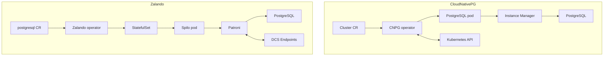

# PostgreSQL Kubernetes Operators: Decision Guide

This is a **conceptual** comparison of two PostgreSQL operators and keeps the
decision-making surface small. **The platform now runs CloudNativePG only** —
all Postgres was migrated off the Zalando operator, which is no longer deployed
(see [002](./002-database-integration.md)). Zalando is retained here purely for
comparison and learning. Use the focused deep dives for operator internals and
feature details:

- [003.1-operator-cnpg.md](./003.1-operator-cnpg.md) - CloudNativePG deep dive.
- [003.2-operator-zalando.md](./003.2-operator-zalando.md) - Zalando Postgres Operator deep dive.
- [010-drp.md](./010-drp.md) - HA, DR, PITR, RTO, and RPO operating model.

## Executive Summary

| Dimension | CloudNativePG | Zalando Postgres Operator |
|-----------|---------------|---------------------------|
| Current version in repo | Operator image `1.30.0` | Operator `v1.15.1` |
| HA model | CNPG operator + instance manager | Patroni inside Spilo pods |
| Pod model | Custom pod controller, no StatefulSets | StatefulSet-managed Spilo pods |
| Coordination | Kubernetes API | Patroni DCS via Kubernetes Endpoints/ConfigMaps |
| Backup model | Barman Cloud Plugin + `ObjectStore` CRs; `Backup` / `ScheduledBackup` use `method: plugin` | WAL-G built into Spilo |
| Best fit | Kubernetes-native, security-sensitive, DR-heavy deployments | Patroni-oriented teams, quick setup, auto secrets, in-place major upgrades |

The short version:

- Choose **CloudNativePG** when Kubernetes-native operations, security posture,
  declarative DR, replica clusters, and quorum-based failover matter most.
- Choose **Zalando** when you want the mature Patroni/Spilo operating model,
  built-in WAL-G, auto-generated secrets, PgBouncer, and in-place major version
  upgrade workflows.
- Running both is valid when different workloads have different operational
  requirements.

## Current Homelab Mapping

All clusters run on **CloudNativePG**:

| Cluster | Operator | Why |
|---------|----------|-----|
| `product-db` | CloudNativePG | Primary cluster for product, cart, order, and payment; PostgreSQL 18; sync quorum `ANY 1`; PgDog (`pgdog-product`); backup/PITR; DR replica |
| `product-db-replica` | CloudNativePG | DR replica cluster following the `product-db` object-store backup/WAL path |
| `auth-db` | CloudNativePG | 3-node HA (sync quorum `ANY 1`), PgDog (`pgdog-auth`), Barman backups; migrated from Zalando |
| `shared-db` | CloudNativePG | Shared single-node cluster (user, notification, shipping, review) with PgDog (`pgdog-shared`); migrated from the former Zalando `supporting-shared-db` |
| `temporal-db` | CloudNativePG | Single-node backing store for Temporal (`temporal` + `temporal_visibility`); no pooler, no backup |

## Architecture Difference

CloudNativePG keeps the PostgreSQL pod minimal and moves most lifecycle
orchestration into the operator and instance manager. Zalando delegates HA to
Patroni inside each Spilo pod, so failover can continue even if the operator is
temporarily unavailable.

## Decision Matrix

| Requirement | Prefer CNPG | Prefer Zalando |
|-------------|:-----------:|:--------------:|
| Non-root/read-only-rootfs security posture | Yes | |
| Native replica clusters for DR | Yes | |
| Quorum-based failover safety | Yes | |
| Declarative databases, roles, extensions | Yes | |
| Volume snapshots and online expansion | Yes | |
| Patroni-native operational model | | Yes |
| Pod-level failover without operator availability | | Yes |
| Auto-generated database user secrets | | Yes |
| Cross-namespace secret convenience | | Yes |
| Built-in PgBouncer sidecar workflow | | Yes |
| In-place major version upgrade scripts | | Yes |
| Operator UI | | Yes |

## Production Guidance

### Use CloudNativePG when

- The workload is new and can be designed around Kubernetes-native primitives.
- Security posture matters: non-root pods, read-only root filesystem, and
  capability dropping are required.
- You need replica clusters or distributed DR topology.
- You want declarative PostgreSQL extensions, roles, databases, and backup
  objects as Kubernetes resources.
- You can operate the CNPG operator as part of the database control plane.

### Use Zalando when

- Your team already knows Patroni and wants `patronictl` style operations.
- You value autonomous pod-level HA even when the operator is unavailable.
- Auto-generated secrets and cross-namespace secret delivery reduce platform
  complexity.
- In-place major version upgrade workflows are more important than CNPG's
  clone-based upgrade posture.
- Existing runbooks, dashboards, and team muscle memory are Patroni/Spilo based.

## Trade-Off Summary

| Operator | Strengths | Watch-outs |
|----------|-----------|------------|
| CloudNativePG | Kubernetes-native design, strong security posture, replica clusters, quorum failover, declarative resource model | Operator availability matters for failover orchestration; no in-place major upgrade; backup plugin migration should be planned |
| Zalando | Mature Patroni/Spilo stack, autonomous failover, WAL-G, PgBouncer, auto secrets, in-place upgrades | Heavier/rootful Spilo container, StatefulSet constraints, no CNPG-style quorum failover or native replica-cluster model |

## Related Documentation

- [003.1-operator-cnpg.md](./003.1-operator-cnpg.md) - CloudNativePG feature and operations deep dive.
- [003.2-operator-zalando.md](./003.2-operator-zalando.md) - Zalando operator feature and operations deep dive.
- [004-replication-strategy.md](./004-replication-strategy.md) - Sync vs async replication and commit behavior.
- [006-backup-strategy.md](./006-backup-strategy.md) - Backup, WAL archiving, PITR, and retention.
- [010-drp.md](./010-drp.md) - Production-ready DRP model for this homelab.

---
_Last updated: 2026-07-11_
