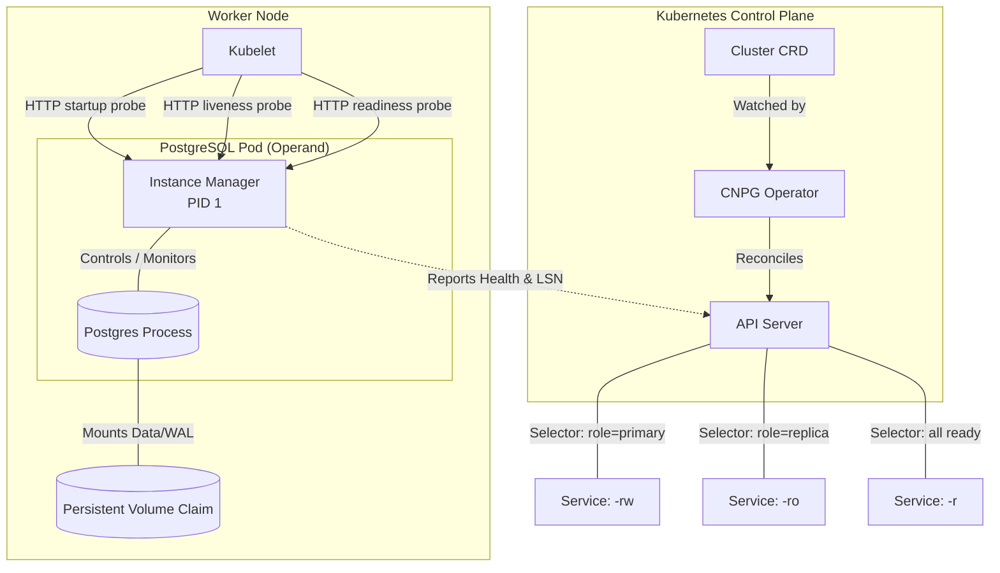
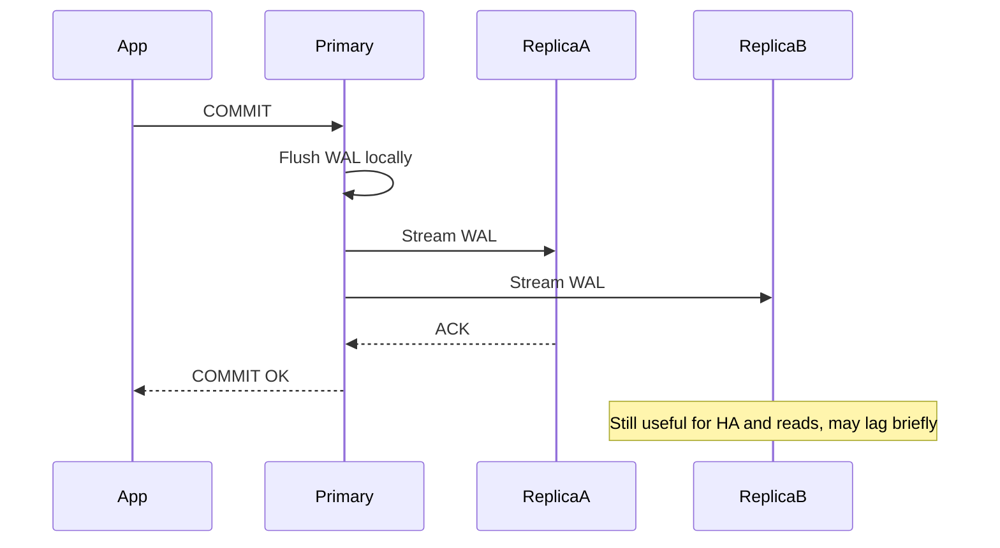
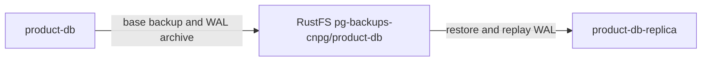
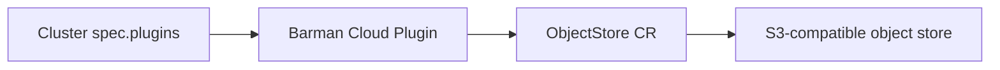

# CloudNativePG Operator Deep Dive

CloudNativePG (CNPG) is the PostgreSQL operator used for `product-db` and
`product-db-replica`. This document focuses on what CNPG is good at, how it works,
where it is stronger than the Zalando operator, and what to watch during
production hardening.

## Current Homelab Usage

| Cluster | Namespace | Purpose |
|---------|-----------|---------|
| `product-db` | `product` | Primary PostgreSQL 18 cluster for `product`, `cart`, `order`, and `payment` |
| `product-db-replica` | `product` | DR replica cluster following `product-db` from RustFS object-store backup/WAL |

The current operator image in this repository is `ghcr.io/cloudnative-pg/cloudnative-pg:1.30.0`.

## What CNPG Is Optimized For

CNPG is strongest when you want a Kubernetes-native PostgreSQL control plane:

- Declarative PostgreSQL clusters through `Cluster` CRs.
- Custom pod controller instead of StatefulSets.
- Managed services for read-write, read, and read-only traffic.
- Native `Backup` and `ScheduledBackup` resources.
- Replica clusters for distributed DR topologies.
- Strong security defaults: non-root containers, read-only root filesystems,
  and dropped Linux capabilities.
- Declarative databases, roles, extensions, image catalogs, and poolers.

## CloudNativePG Architecture



CNPG does not use Patroni, etcd, or StatefulSets for PostgreSQL HA. The
operator reconciles the desired state, while the instance manager runs inside
each pod to manage PostgreSQL lifecycle, probes, shutdown, WAL archiving, and
status reporting.

**Reports Health & LSN.** Each instance manager continuously reports its
instance's health and current WAL position — the **LSN (Log Sequence Number)** —
to the Kubernetes API via the pod's status. An LSN is a monotonically increasing
64-bit pointer to a byte offset in PostgreSQL's Write-Ahead Log, printed as
`hex/hex` (e.g. `16/B374D848`). The operator compares standby LSNs to measure
replica lag, promote the most up-to-date replica during failover, and confirm
the synchronous-quorum acknowledgement before a commit is reported durable.

## Kubernetes Resource Model

| Resource | Purpose |
|----------|---------|
| `Cluster` | Main PostgreSQL cluster spec: instances, image, storage, parameters, backup, bootstrap |
| `Backup` | One-shot physical backup |
| `ScheduledBackup` | Declarative backup schedule |
| `Database` | Declarative database, extension, schema, FDW management |
| `DatabaseRole` | Declarative, standalone PostgreSQL role management — the CNPG-recommended GitOps approach (over the inline `managed.roles` stanza); used by this platform's RFC-0012 triplet |
| `Pooler` | PgBouncer managed by CNPG |
| `ClusterImageCatalog` / `ImageCatalog` | Centralized PostgreSQL image version management |
| `Publication` | Declarative PostgreSQL logical-replication publications |
| `Subscription` | Declarative logical-replication subscriptions (also the online-import path for major upgrades) |
| `ObjectStore` (`barmancloud.cnpg.io/v1`) | Barman Cloud Plugin backup target used by this platform — a plugin CRD (CNPG-I), not a core CNPG kind |

CNPG creates and manages three core services:

| Service suffix | Use |
|----------------|-----|
| `-rw` | Current primary, read-write traffic |
| `-r` | Any readable instance, including primary |
| `-ro` | Replica-only read traffic |

In this homelab, applications connect through PgDog rather than the CNPG
`Pooler` CR, but the CNPG services still provide the underlying routing targets.

## HA and Failover

`product-db` is configured with 3 instances and synchronous quorum:

```yaml
postgresql:
  synchronous:
    method: any
    number: 1
    dataDurability: required
```

This maps to a PostgreSQL quorum-style standby selection: at least one eligible
standby must acknowledge WAL for the commit guarantee. It does not mean every
replica must acknowledge every transaction.



CNPG also supports operational controls such as:

- Switchover to a selected target primary.
- Fencing an instance for maintenance or investigation.
- Primary isolation detection.
- Quorum-based failover safety for synchronous replication.

## DR and Replica Clusters

CNPG's replica cluster feature is one of the main reasons to use it for
production-ready DR design. A replica cluster can follow a source cluster from
streaming replication or object-store backup/WAL, depending on configuration.

In this homelab, `product-db-replica` follows the `product-db` object-store path:



This is a DR replica cluster, not part of the normal application write path. It
can be promoted during a disaster after split-brain risk is ruled out and the
incident owner approves cutover.

## Backup and Recovery

### Current homelab state

The plugin is installed via the official `plugin-barman-cloud` Helm chart (from the
`cnpg` HelmRepository, Renovate-tracked), and the cluster manifests use the Barman
Cloud Plugin with `ObjectStore` CRs:

```yaml
apiVersion: barmancloud.cnpg.io/v1
kind: ObjectStore
metadata:
  name: product-db-backup-store
spec:
  retentionPolicy: "30d"
  configuration:
    destinationPath: s3://pg-backups-cnpg/product-db/
    endpointURL: http://rustfs-svc.rustfs.svc.cluster.local:9000
```

This provides:

- Physical base backups.
- WAL archiving.
- PITR capability.
- Restore-to-new-cluster support.
- DR replica bootstrap through `externalClusters[].plugin`.

### Plugin wiring

The plugin is installed as a separate Flux Kustomization before the database
clusters reconcile. `product-db` enables the plugin as its WAL archiver, while
`Backup` and `ScheduledBackup` resources set `method: plugin`.



Production guidance:

- Keep using Barman Cloud Plugin + `ObjectStore` for new CNPG backup paths.
- Complete a restore/PITR drill after plugin rollout before declaring the
  migration production-ready.
- Do not delete old backup prefixes during migration.
- Keep rollback to in-tree `barmanObjectStore` available from Git history until
  plugin-backed backup and restore are verified in-cluster.

## Security Posture

CNPG is a good fit for security-sensitive Kubernetes environments:

- Non-root containers.
- Read-only root filesystem.
- Dropped capabilities.
- No Patroni, cron, runit, or extra process supervisor inside the operand pod.
- Minimal PostgreSQL image model.

This aligns well with Kubernetes Pod Security Standards and Kyverno restricted
policies used elsewhere in this repo.

## Strengths

- Kubernetes-native control plane.
- Strong security defaults.
- Native replica-cluster DR story.
- Declarative PostgreSQL objects.
- Quorum failover safety for sync replication.
- Volume snapshot support and direct PVC management.
- Clean service model for read-write/read/read-only traffic.

## Trade-Offs

- Failover orchestration depends on the CNPG operator being available.
- No in-place major PostgreSQL upgrade workflow like Spilo's `pg_upgrade` path.
- Secrets are not auto-generated in the same way Zalando does; use ESO/OpenBAO
  or explicit Kubernetes Secrets.
- Barman plugin rollout still needs a recorded restore drill before the
  platform can claim measured production readiness.

## Version Watchlist

For every CNPG upgrade, re-check:

- Backup plugin guidance and deprecation timelines.
- Replica cluster behavior and promotion procedures.
- Synchronous replication and quorum failover changes.
- PostgreSQL operand image compatibility.
- CRD changes for `Backup`, `ScheduledBackup`, `Database`, and plugin resources.

## Homelab Production Readiness

| Area | Current state | Production action |
|------|---------------|-------------------|
| HA | 3 instances, sync quorum `ANY 1` | Good baseline for critical local HA |
| DR | `product-db-replica` in same K8s cluster | Move DR target to separate cluster/region |
| Backup store | RustFS in homelab | Use independent object store with versioning/object lock |
| Backup integration | Barman Cloud Plugin + `ObjectStore` CRs | Validate plugin-backed restore/PITR drill |
| Restore evidence | Not yet recurring | Run and record restore/PITR drills |

## References

- [CloudNativePG documentation](https://cloudnative-pg.io/docs/1.30/)
- [CloudNativePG Barman Cloud Plugin](https://cloudnative-pg.io/plugin-barman-cloud/)
- [CloudNativePG operator capability levels](https://cloudnative-pg.io/docs/1.30/operator_capability_levels/)
- [CloudNativePG recovery](https://cloudnative-pg.io/docs/1.30/recovery/)

---
_Last updated: 2026-07-11_
