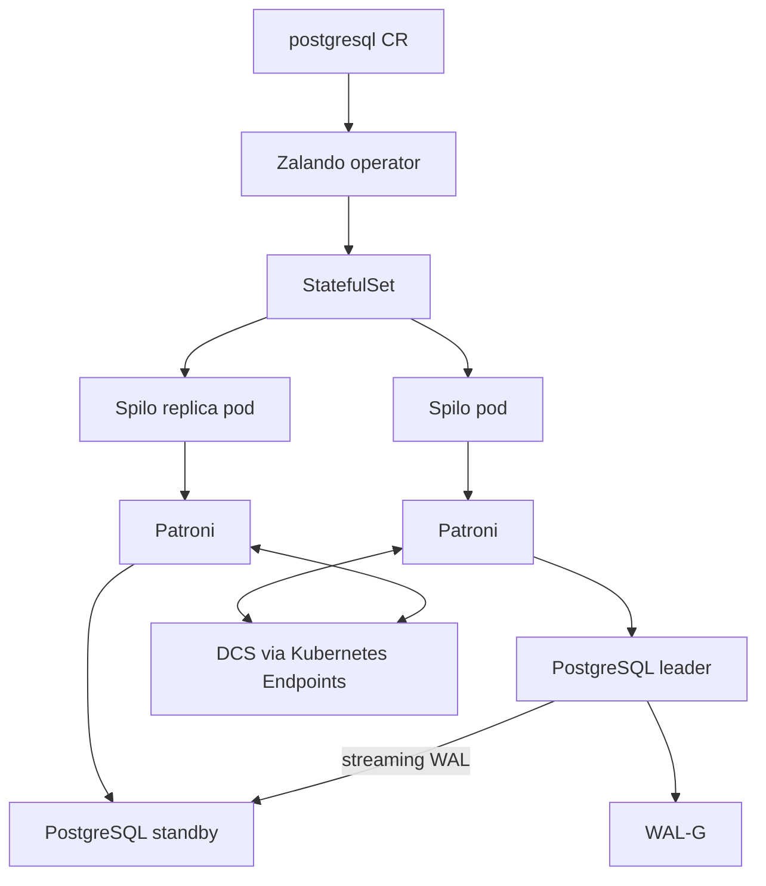
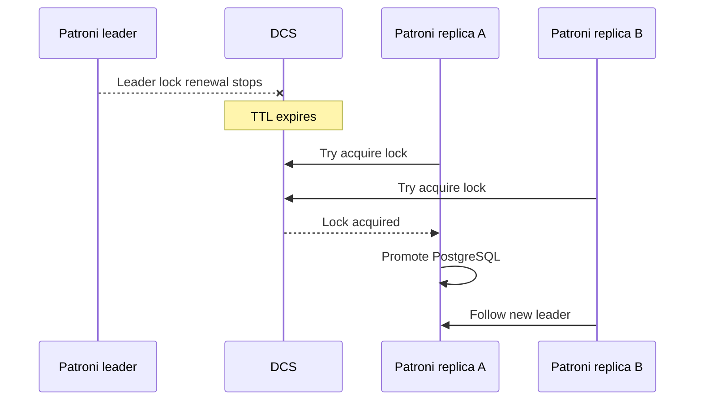

# Zalando Postgres Operator Deep Dive

The Zalando Postgres Operator is the Patroni/Spilo-based operator used for
`auth-db` and `supporting-shared-db`. This document focuses on what Zalando is
good at, how it works, why it remains useful in this homelab, and where it is
less production-forward than CloudNativePG for newer workloads.

## Current Homelab Usage

| Cluster | Namespace | Purpose |
|---------|-----------|---------|
| `auth-db` | `auth` | 3-node auth database cluster with Patroni HA and PgBouncer |
| `supporting-shared-db` | `user` | Shared cluster for user, notification, shipping, review; currently single-node |

The current operator chart version in this repository is `v1.15.1`.

## What Zalando Is Optimized For

Zalando is strongest when you want the mature Patroni and Spilo operating
model:

- Patroni HA inside every database pod.
- WAL-G backups built into the Spilo image.
- PgBouncer connection pooler managed by the operator.
- Auto-generated database user secrets.
- Cross-namespace secret support.
- `preparedDatabases` for role/schema/extension bootstrap.
- Optional Postgres Operator UI.
- In-place major version upgrade workflows through Spilo scripts.

## Control Plane Architecture



The operator creates and updates Kubernetes resources, but Patroni owns the HA
decision inside the pods. This is the key difference from CloudNativePG.

## Kubernetes Resource Model

| Resource or field | Purpose |
|-------------------|---------|
| `postgresql.acid.zalan.do/v1` | Main cluster CR |
| `numberOfInstances` | Number of Patroni/Spilo pods in the local cluster |
| `databases` | Database-to-owner mapping |
| `users` | Database user and role flags |
| `preparedDatabases` | Optional schemas, roles, extensions, default privileges |
| `connectionPooler` | Operator-managed PgBouncer |
| `standby` | Separate standby-cluster feature |
| Operator configuration | Global settings such as WAL-G env, watched namespaces, pooler defaults |

## HA and Patroni

Patroni is the HA agent. It runs in every Spilo pod and coordinates leader
election through a distributed lock in the DCS.



This means a Zalando cluster can fail over even if the Zalando operator itself
is unavailable, as long as Patroni pods and the DCS are healthy.

## Backup and Restore

Zalando uses WAL-G through Spilo. In this repo, backup configuration is injected
through operator-level environment configuration and per-namespace secrets.

Typical production pattern:

```yaml
spec:
  env:
    - name: WALG_S3_PREFIX
      value: s3://pg-backups-zalando/auth-db/
    - name: AWS_ENDPOINT
      value: http://rustfs-svc.rustfs.svc.cluster.local:9000
```

Zalando backup strengths:

- WAL-G is built into Spilo.
- Cron-style backup scheduling is familiar.
- Restore and clone workflows are well-known in Patroni/Spilo environments.
- Logical backup can also be enabled for migration or selective recovery.

Production watch-outs:

- Ensure WAL-G env and secrets are consistent across namespaces.
- Test physical restore, not just backup creation.
- Keep object-store credentials least-privilege in production.
- Do not use logical backups as a replacement for PITR.

## Standby Clusters

Zalando has two different standby concepts that should not be mixed:

| Pattern | Field | Purpose |
|---------|-------|---------|
| Local HA standbys | `numberOfInstances: 3` | Patroni replicas inside the same cluster for automatic failover |
| Standby cluster | `spec.standby` | Separate cluster following another primary, used for DR or migration |

For `supporting-shared-db`, scaling `numberOfInstances` from 1 to 3 would add
local HA standbys. That is not the same as creating a separate standby cluster.
See [runbooks/zalando-ha-scaling.md](./runbooks/zalando-ha-scaling.md).

## Connection Pooling

Zalando's operator-managed PgBouncer is one of its practical strengths:

```yaml
spec:
  connectionPooler:
    numberOfInstances: 2
    mode: transaction
    schema: pooler
    user: pooler
```

In this homelab:

- `auth-db` uses PgBouncer for auth-service traffic.
- `supporting-shared-db` uses PgBouncer for multiple supporting services.

## Secrets and Database Bootstrap

Zalando is convenient for application teams because it can auto-create user
secrets and distribute them across namespaces when configured.

This homelab uses that feature for cross-namespace service ownership patterns.
The trade-off is that features such as `preparedDatabases` can become subtle
when owner names use `namespace.username` format. See
[runbooks/prepared-databases.md](./runbooks/prepared-databases.md).

## In-Place Major Version Upgrades

Spilo includes upgrade scripts for in-place major PostgreSQL upgrades. This is
a meaningful advantage for teams that have large databases where clone-based
upgrades are too slow or costly.

Production guidance:

- Always test the upgrade on a clone first.
- Use a maintenance window.
- Verify backups before the upgrade.
- Confirm Patroni and application health after the upgrade.

## Strengths

- Mature Patroni HA model.
- Autonomous failover inside pods.
- WAL-G built into Spilo.
- Operator-managed PgBouncer.
- Auto-generated user secrets.
- Cross-namespace secret support.
- Optional operator UI.
- In-place major version upgrade scripts.

## Trade-Offs

- Spilo is heavier than a minimal PostgreSQL container.
- Spilo/runit often implies a less strict container security posture than CNPG.
- StatefulSet ordering and pod ordinals can complicate operations.
- No CNPG-style quorum-based failover safety.
- No native CNPG-style multi-cluster replica-cluster model.
- Backup and restore are powerful but less Kubernetes-native than CNPG plugin
  resources.

## Homelab Production Readiness

| Area | Current state | Production action |
|------|---------------|-------------------|
| `auth-db` HA | 3 nodes, Patroni HA | Good HA baseline, document accepted async RPO |
| `supporting-shared-db` HA | 1 node | Scale to 3 or migrate if production critical |
| Backup | WAL-G to RustFS | Test restore and split object-store credentials |
| Pooling | PgBouncer enabled | Keep, tune pool size and monitoring |
| Secrets | Cross-namespace convenience | Review ownership and rotation controls |

## References

- [Zalando Postgres Operator documentation](https://postgres-operator.readthedocs.io/en/latest/)
- [Zalando operator administrator guide](https://postgres-operator.readthedocs.io/en/latest/administrator/)
- [Patroni documentation](https://patroni.readthedocs.io/en/latest/)
- [Spilo image repository](https://github.com/zalando/spilo)
