# PostgreSQL Replication & HA: A Deep Dive

This is the canonical sync/async replication deep dive. For DRP policy,
incident decision flow, RTO/RPO ownership, and restore evidence, see
[010-drp.md](./010-drp.md).

## 1. Executive Summary

You are running **2 operational PostgreSQL clusters** + **1 DR replica cluster** with a hybrid architecture optimized for specific workload needs.

### Cluster overview

All clusters run on **CloudNativePG**.

| Cluster | Operator | Namespace | Instances | Sync Mode | Pooler | Services |
|--------|----------|-----------|-----------|-----------|--------|----------|
| **platform-db** | CloudNativePG | platform | 3 | Synchronous (`on`, ANY 1) | PgDog (`pgdog-platform`) | auth, user, notification, shipping, review, temporal (+ temporal_visibility) |
| **product-db** | CloudNativePG | product | 3 | Synchronous (`on`, ANY 1) | PgDog (`pgdog-product`) | product, cart, order, payment |
| **product-db-replica** | CloudNativePG | product | 1 | DR (restore from object store) | — | DR replica of product-db |

### Architecture Diagram

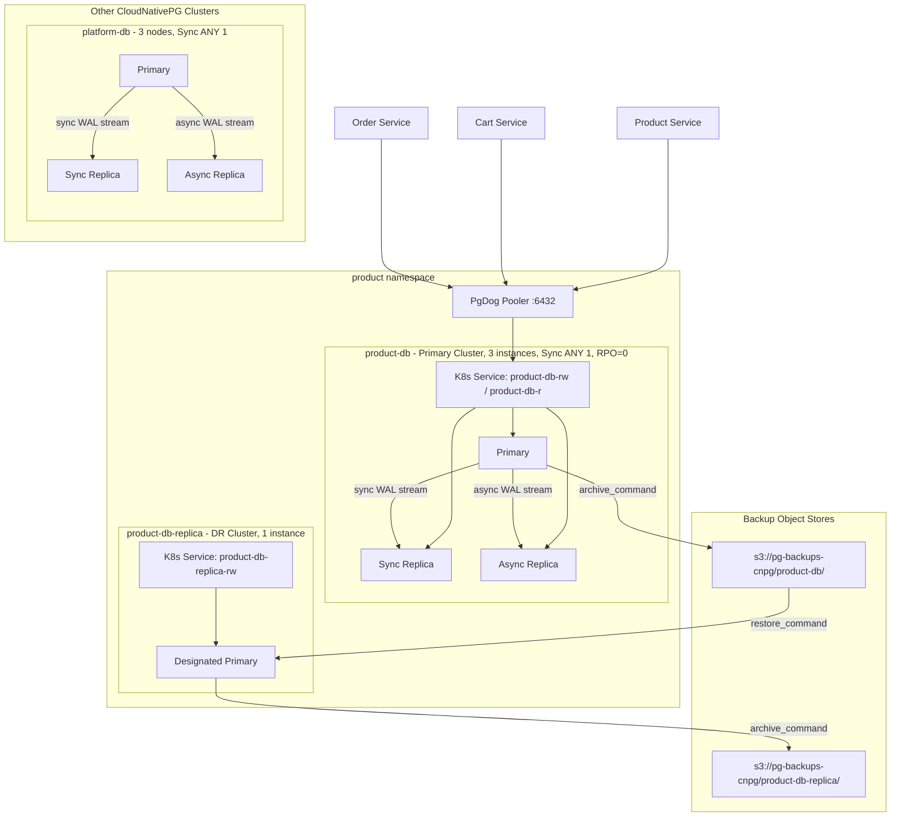

**Key findings:**
- **product-db**: 3-node HA with synchronous quorum (**ANY 1** standby). Commits that complete under this policy have **RPO = 0** relative to acknowledged standbys. Hosts **product**, **cart**, **order**, and **payment** databases; **PgDog** is the pooler (payment app: direct-TLS).
- **product-db-replica**: Single-instance cluster used for **disaster recovery**, continuously fed from **object-store backups** (not in-band streaming HA for the same namespace workloads). See [DR replica cluster](#dr-replica-cluster-product-db-replica) below and [005-ha-dr-deep-dive.md](005-ha-dr-deep-dive.md).
- **platform-db**: 3-node HA with synchronous quorum (**ANY 1** standby), same posture as product-db — **RPO = 0** for commits acknowledged per the sync policy. Hosts auth, supporting services, and Temporal persistence (`temporal` + `temporal_visibility`; Temporal connects direct, not via PgDog).

### DR replica cluster (product-db-replica)

**product-db-replica** is a separate CloudNativePG cluster (one instance) in the **product** namespace that tracks **product-db** via **backup / WAL archive in object storage**. It is not a substitute for in-cluster synchronous HA; it exists so you can recover or fail over when the primary region or cluster is lost. Scheduling, promotion, and operational trade-offs are covered in [005-ha-dr-deep-dive.md](005-ha-dr-deep-dive.md).

---

## 2. Basic Concepts

Before diving into replication internals, here are the core concepts explained simply:

| Term | Simple Explanation |
|------|---------------------|
| **WAL (Write-Ahead Log)** | Every change is written to a log file before it is written to the table — like a scratch journal recorded before the main ledger is updated. |
| **Replication** | Copying data from Primary to Replica — effectively a real-time backup on another server. |
| **Primary** | The server that writes data (read-write). |
| **Replica** | A read-only copy — reads only, never writes. |
| **RPO (Recovery Point Objective)** | How much data can be lost on a crash? RPO=0 = none lost. |
| **RTO (Recovery Time Objective)** | How long to recover? "Seconds" = fast automatic failover. |

### WAL Flow Diagram

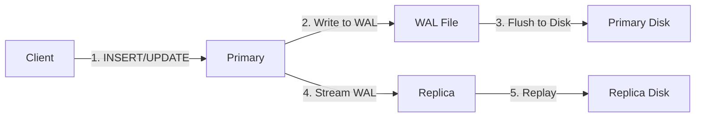

**In short:** WAL is the change journal. The Primary writes WAL first, then streams it to the Replica, which replays the WAL to stay in sync.

---

## 3. Replication Internals: Physical vs. Logical

### Physical Replication (Streaming)
This is "block-level" replication. PostgreSQL transmits 16MB **WAL** files (or streams WAL records) to replicas.

*   **Mechanism**: "Copy this byte from offset A to offset B" — like a photocopy that reproduces the raw data block.
*   **Pros**: Extremely efficient, low overhead, replicates ALL changes (indexes, DDL, schema changes, user creation).
*   **Cons**: Replicas must be read-only. Major version of Primary and Replica must match exactly.
*   **Your Usage**: 3-node clusters (`product-db`, `platform-db`) use physical streaming for HA.

### Logical Replication
This is "row-level" replication. It decodes the WAL into a stream of logical changes (INSERT, UPDATE, DELETE).

*   **Mechanism**: "Insert row {id: 1, name: 'Apple'} into table 'products'" — like dictation that reads out each changed row.
*   **Pros**: Flexible. Can replicate between different OSs, Postgres versions, or to external systems (Kafka/Debezium).
*   **Cons**: Higher CPU usage (decoding). Typically doesn't replicate DDL (CREATE TABLE) automatically.
*   **Your Usage**: `product-db` has `wal_level: logical` - ready for CDC (Debezium) even though internal HA is physical.

### Physical vs Logical Diagram

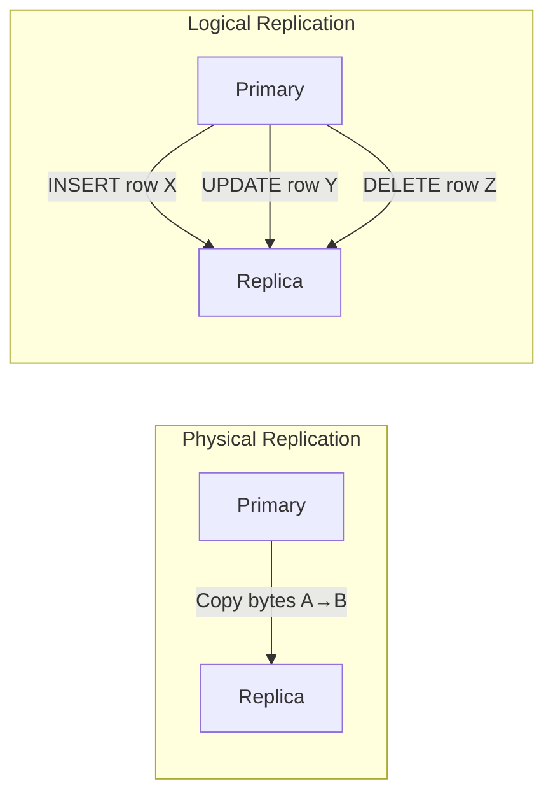

**In short:** Physical = copy the whole block (fast, simple). Logical = copy each changed row (flexible, can feed external systems like Kafka).

---

## 4. The Commit Spectrum: Synchronous vs. Asynchronous

The critical setting is `synchronous_commit`. It determines **when** the database tells the client "Success!".

### Real-World Analogy

| Mode | Analogy | Trade-off |
|------|---------|-----------|
| **Async (`local`)** | Sending an email — the server says "Sent" immediately. It may not have reached the recipient's inbox yet. | Fast, but risks data loss |
| **Sync (`on`)** | Signed courier delivery — not done until the recipient signs for it. | Certain, but slower |

**In short:** `synchronous_commit` decides WHEN the database reports "Success" to the client — as soon as it is written locally (async) or after a replica acknowledges (sync).

### Diagram: The Commit Wait

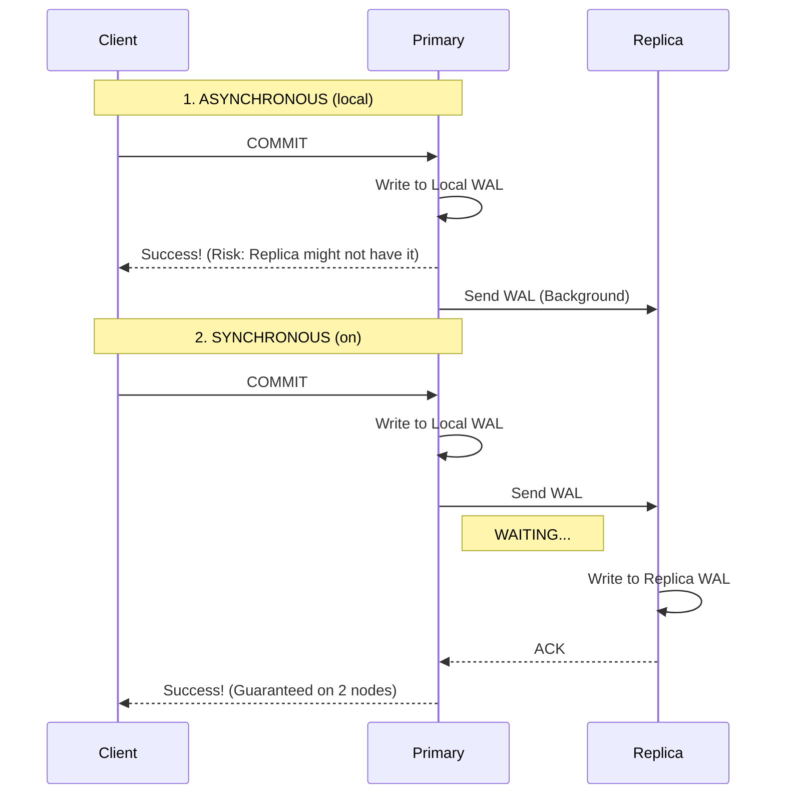

### Modes Deep Dive

1.  **`off`**: "I don't care if it's written anywhere." (Dangerous, almost never used).
2.  **`local`** (Default Async): "Success if written to My Disk."
    *   **Fastest safe mode**.
    *   **Risk**: If Primary dies immediately after, data is lost before reaching replica.
    *   **Your Clusters**: none (single-node teaching examples commit locally by nature; the HA clusters use `on`).
3.  **`remote_write`**: "Success if Replica OS received it."
    *   Replica has it in RAM, but hasn't flushed to disk. 
    *   Survives Postgres crash, but not Replica OS crash.
4.  **`on`** (Standard Sync): "Success if Replica flushed to Disk."
    *   **Zero Data Loss** guarantee.
    *   **Latency Cost**: Round-trip time (RTT) to replica + Disk I/O.
    *   **Your Clusters**: `product-db` and `platform-db` (both `synchronous.method: any`, `number: 1`).
5.  **`remote_apply`**: "Success if Replica has applied the SQL."
    *   Guarantees "Read-Your-Writes" on the replica immediately.
    *   **Slowest**.

### HA vs Single-Instance Diagram

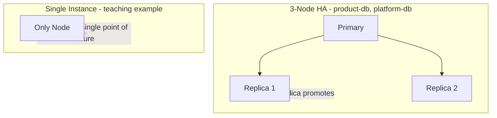

**In short:** 3-node clusters have automatic failover. A single-instance cluster has no replica — if the node dies, the service is down.

---

## 5. Point-in-Time Recovery (PITR)

**PITR** is distinct from Replication.

| Concept | Purpose | Protects Against |
|---------|---------|------------------|
| **Replication** | Copies *current state* to another live server | Server failure (hardware crash) |
| **PITR** | Saves *history* of changes to cold storage (S3/GCS) | Human error (DROP TABLE, bad migration) |

**How it works:**
1.  **Base Backup**: A snapshot of the DB at `00:00 AM`.
2.  **WAL Archiving**: Every 16MB WAL file is uploaded to S3.
3.  **Restore**: To get to `14:00 PM`, you extract the `00:00 AM` snapshot and "replay" WAL files until `14:00`.

**Configured today:** **product-db** (and the DR path via **product-db-replica**) use CloudNativePG **scheduled backups** and **WAL archiving** to object storage, which enables **PITR** and restores to a timestamp when procedures are followed.

*   **Implication**: Streaming replication still propagates mistakes instantly to in-cluster standbys. **Replication alone cannot undo** a `DROP TABLE` on the primary. **PITR** (base backup + archived WAL) is what allows rolling back or cloning to a point before the error.

**In short:** Replication protects against a server crash. PITR protects against human error (DROP TABLE, a bad migration).

---

## 6. Replication Monitoring

### Key View: pg_stat_replication

PostgreSQL provides `pg_stat_replication` on the Primary to monitor replication status:

| Column | Meaning |
|--------|---------|
| `sent_lsn` | WAL sent over the network |
| `write_lsn` | WAL received by Replica OS (not yet flushed) |
| `flush_lsn` | WAL flushed to Replica disk |
| `replay_lsn` | WAL applied and visible to queries |
| `write_lag`, `flush_lag`, `replay_lag` | Time intervals for each stage |

### Replication Lag Stages Diagram

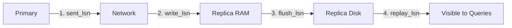

**Lag types:**
- **Write Lag**: Delay between commit and WAL write on standby
- **Flush Lag**: Delay between WAL write and disk flush on standby
- **Replay Lag**: Delay between flush and applying changes to the database

**Standby query** (run on Replica to check how far behind):
```sql
SELECT now() - pg_last_xact_replay_timestamp();
```

**Replication lag monitoring** (run on Primary):
```sql
SELECT 
    application_name,
    client_addr,
    state,
    sent_lsn,
    write_lsn,
    flush_lsn,
    replay_lsn,
    pg_wal_lsn_diff(sent_lsn, replay_lsn) AS replication_lag_bytes
FROM pg_stat_replication
ORDER BY application_name;
```

**Replication slots** (monitor slot lag - disconnected replicas can cause disk fill):
```sql
SELECT slot_name, active, restart_lsn,
       pg_wal_lsn_diff(pg_current_wal_lsn(), restart_lsn) AS lag_bytes
FROM pg_replication_slots;
```

**Common causes of lag:** Network latency, slow disk I/O, CPU saturation on WAL sender/receiver.

### synchronous_standby_names (Quorum vs First-Priority)

| Syntax | Meaning | Your Usage |
|--------|---------|------------|
| **FIRST n (s1, s2, ...)** | Priority-based - wait for top n standbys | - |
| **ANY n (s1, s2, ...)** | Quorum-based - wait for any n standbys | product-db, platform-db use `method: any` |

product-db and platform-db: `synchronous.method: any`, `number: 1` - commits when any 1 replica acknowledges.

---

## 7. Cascading Replication

### Problem: Direct WAL Streaming to 50+ Replicas

When Primary streams WAL directly to many replicas, it becomes a bottleneck:

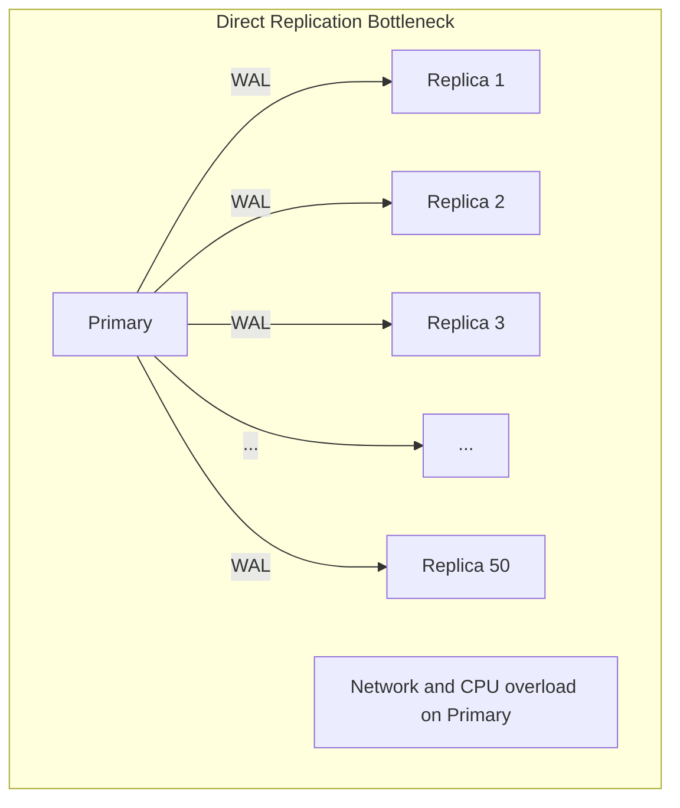

**In short:** The Primary has to stream WAL to 50+ replicas → CPU/network overload.

### Solution: Cascading Replication

The Primary streams only to a few intermediate replicas, which relay the WAL onward to downstream replicas:

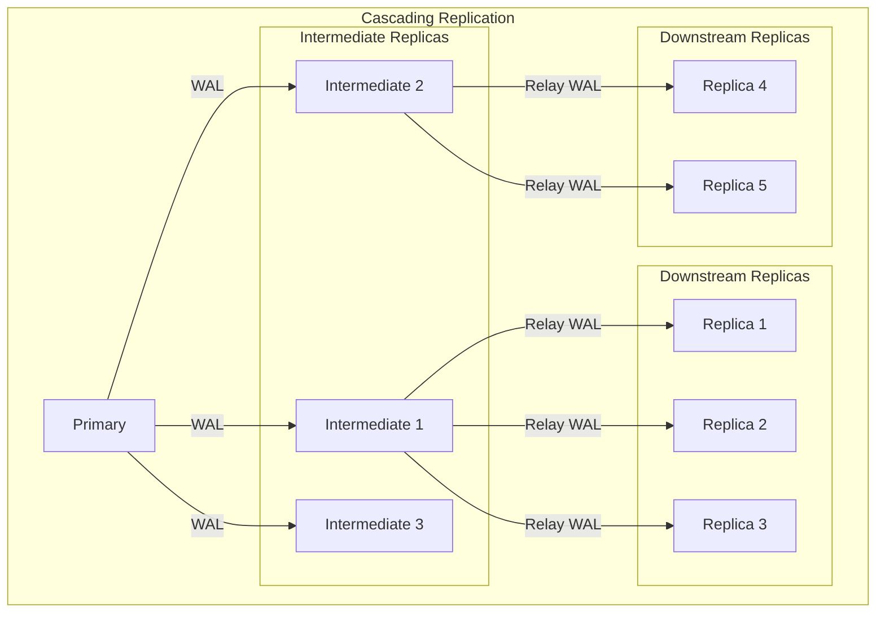

### When to Use Cascading

| Replicas | Approach | Your Clusters |
|----------|----------|---------------|
| < 10 | Direct replication | product-db, platform-db |
| 10-30 | Consider cascading | - |
| 30+ | Cascading recommended | hyperscale: ~50 replicas |
| Multi-region | Intermediate per region | - |

**Note:** CloudNativePG does not natively support cascading. Your 3-node clusters use direct replication — cascading is a pattern to reach for only at large replica counts, which this platform is far from.

### Trade-offs

| Benefits | Trade-offs |
|----------|------------|
| Primary streams to only 3 intermediates | +1 hop = slightly higher lag |
| Reduced network/CPU on Primary | More complex failover |
| Scale to 100+ replicas | Intermediate failure affects downstream |

---

## 8. Read/Write Splitting & Connection Pooling

### Read/Write Splitting

Application sends writes to Primary, reads to Replicas. Pooler (PgBouncer/PgCat/PgDog) routes intelligently:

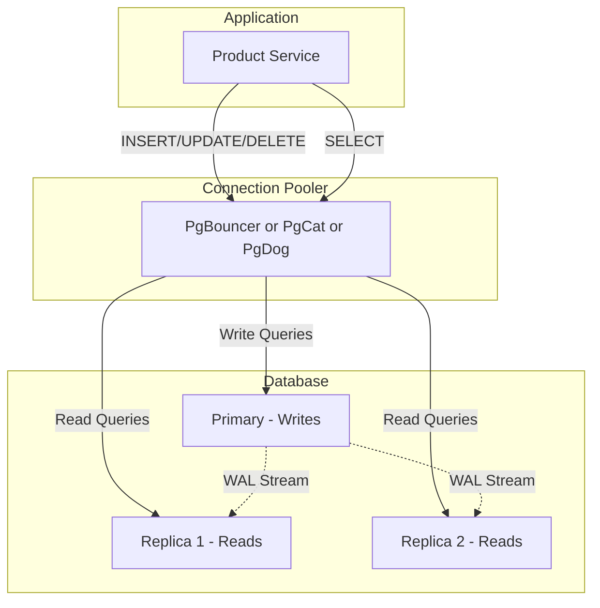

**Your clusters:** product-db and platform-db front CloudNativePG with **PgDog** (`pgdog-product`, `pgdog-platform`).

### WAL Sender/Receiver Flow

Primary runs **WAL Sender** process per replica. Replica runs **WAL Receiver** process:

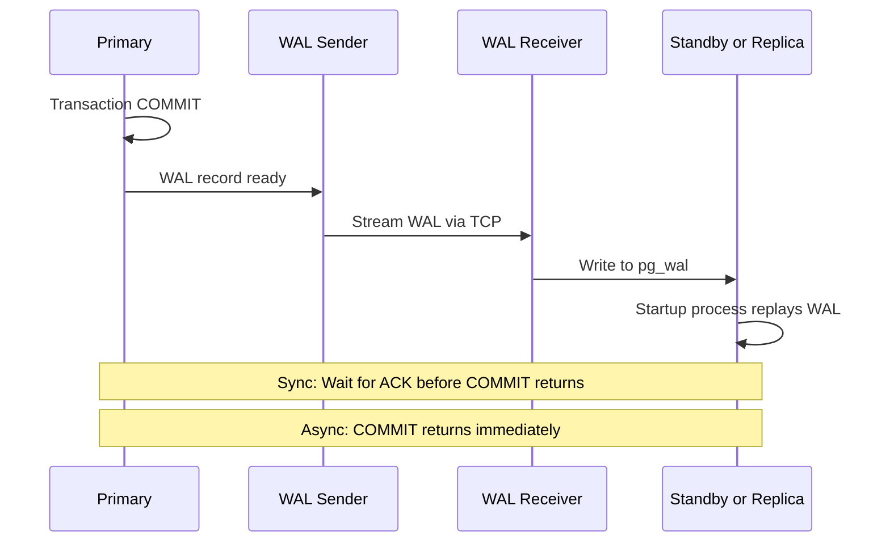

**In short:** Each replica = one WAL Sender on the Primary. 50 replicas = 50 WAL Sender processes → the reason cascading is needed at scale.

### Connection Pooling Impact

| Before Pooler | After Pooler |
|---------------|--------------|
| 5000ms connection overhead | 5ms (1000x improvement) |
| N app connections = N DB connections | N app connections → 20-50 DB connections |
| Connection storms crash DB | Pooler throttles and queues |

**Pool modes:** Transaction mode (common at scale; your clusters) - connection returned after each COMMIT/ROLLBACK.

---

## 9. SPOF vs HA Hot Standby

### Single Point of Failure (SPOF)

If the database dies, the whole app goes down:

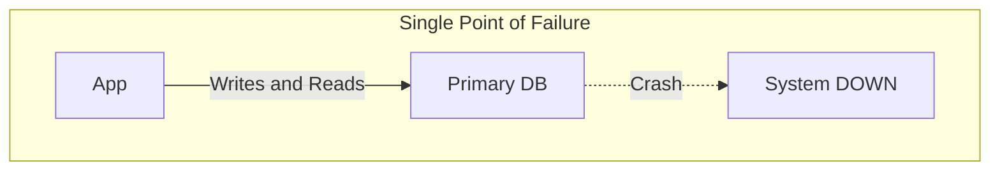

### HA Hot Standby

A standby stays continuously in sync. Primary dies → standby is promoted → failover:

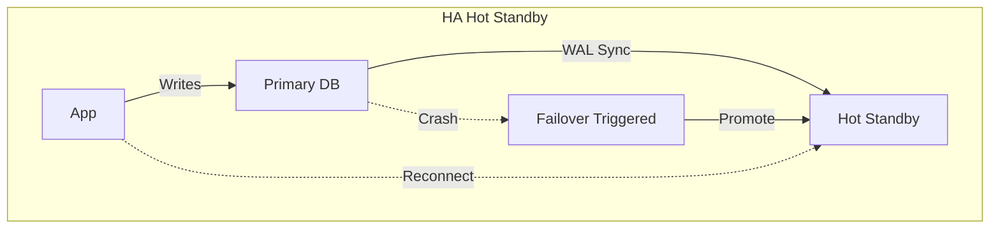

**In short:** SPOF = one node dies = app down. HA = a standby is ready to take over.

---

## 10. Hyperscale scaling insights (Summary)

Large hyperscale deployments scale PostgreSQL to hundreds of millions of users with a layered strategy:

| Layer | Techniques |
|-------|------------|
| **Application** | Query optimization, caching with stampede prevention, workload isolation, multi-layer rate limiting |
| **Database** | Read replicas, write offload to a secondary store, PgBouncer pooling, cascading replication |
| **Infrastructure** | Managed PostgreSQL, multi-region, ~50 read replicas |

### Key Takeaways

1. **Keep it simple** - these deployments avoided sharding. Scale with replicas + caching first.
2. **Cache stampede prevention** - Use a distributed lock (Redis SETNX) so only 1 request fetches on cache miss. *Product service implements this.*
3. **Connection pooling is mandatory** - PgBouncer/PgCat reduces connections 50-100x.
4. **Cascading for 30+ replicas** - Primary → Intermediate → Downstream.
5. **Application-first optimization** - Optimize queries, add caching, rate limiting before scaling infrastructure.

---

## 11. Summary Table for Your Infrastructure

| Feature | product-db | product-db-replica | platform-db |
| :--- | :--- | :--- | :--- |
| **Replication Type** | Physical (HA) + Logical (CDC) | Physical (DR from object store) | Physical |
| **Sync Mode** | Synchronous (`on`, ANY 1) | N/A (async catch-up from archive) | Synchronous (`on`, ANY 1) |
| **Instances** | 3 | 1 | 3 |
| **Pooler** | PgDog (`pgdog-product`) | — | PgDog (`pgdog-platform`; Temporal direct) |
| **Databases** | product, cart, order, payment | mirror of product-db (DR) | auth, user, notification, shipping, review, temporal, temporal_visibility |
| **Failover RPO** | **0** (for commits acknowledged per sync policy) | Depends on restore/replay lag | **0** (for commits acknowledged per sync policy) |
| **Failover RTO** | Seconds (Auto) | Workflow-dependent (DR) | Seconds (Auto) |
| **PITR Status** | Configured | Configured | Configured |

### Operators

| Operator | Clusters | PostgreSQL Version |
|----------|----------|-------------------|
| **CloudNativePG** | platform-db, product-db, product-db-replica | 18 |

---

## References

The cascading-replication, read/write-splitting, and layered-scaling patterns in
§7, §8, and §10 are synthesized in-house from a large-scale PostgreSQL scaling
case study:

- OpenAI — Scaling PostgreSQL to the next level: https://openai.com/index/scaling-postgresql/

---

_Last updated: 2026-07-17 — RFC-0018: 3 CNPG clusters (platform-db, product-db, product-db-replica), 2 PgDog poolers._
