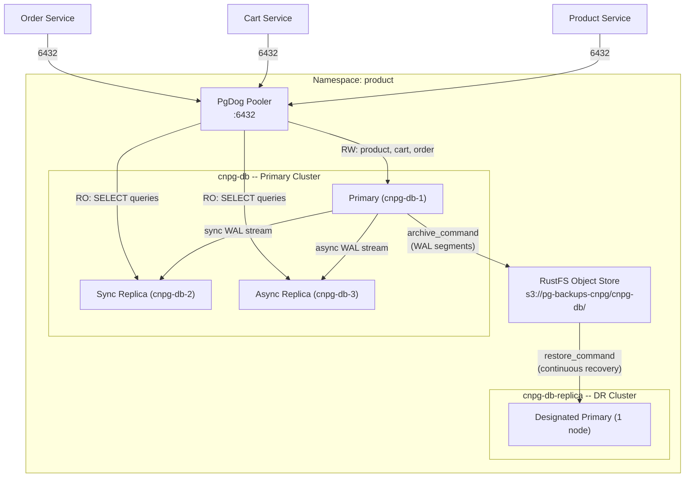
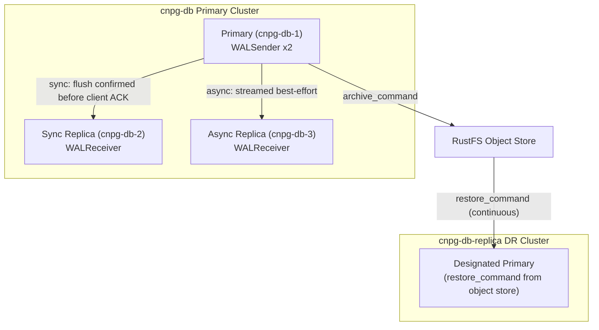
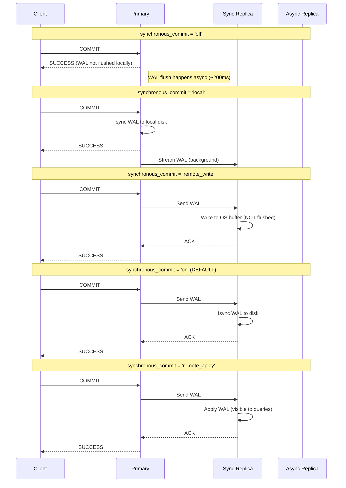
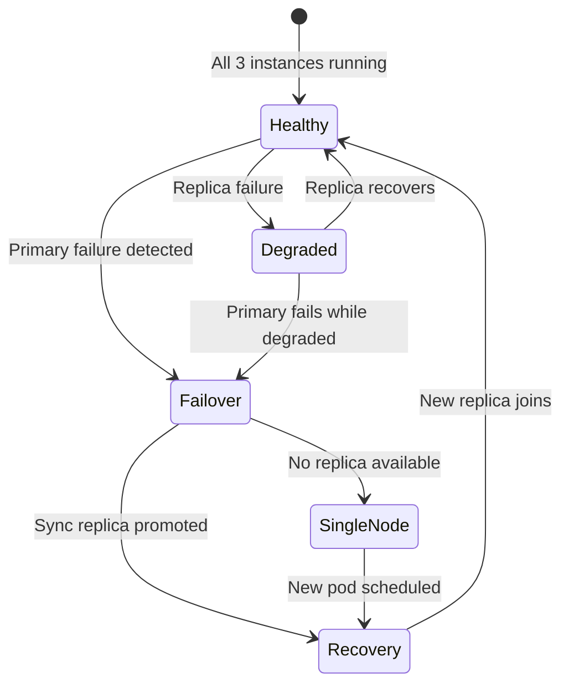

# HA and DR Architecture Deep-Dive

How multiple PostgreSQL instances work together for High Availability and Disaster Recovery using CloudNativePG.

> **Prerequisites**: Read [001-postgresql-internals.md](./001-postgresql-internals.md) first for single-instance PostgreSQL mechanics (processes, memory, WAL, MVCC). This document builds on those fundamentals.

---

## Table of Contents

1. [Architecture Overview](#1-architecture-overview)
2. [WAL Archiving Deep-Dive](#2-wal-archiving-deep-dive)
3. [Replication Topology](#3-replication-topology)
4. [synchronous_commit Spectrum](#4-synchronous_commit-spectrum)
5. [HA: Failure Scenarios and Failover](#5-ha-failure-scenarios-and-failover)
6. [DR: Replica Cluster Operations](#6-dr-replica-cluster-operations)
7. [RPO/RTO Reference Card](#7-rporto-reference-card)
8. [Practical Commands Reference](#8-practical-commands-reference)

---

## 1. Architecture Overview

### Target Topology



### Component Role Matrix

| Component | Role | Handles Writes | Handles Reads | Data Durability |
|-----------|------|---------------|---------------|-----------------|
| cnpg-db-1 (Primary) | Accept all writes, stream WAL | Yes | Yes (via PgDog) | Committed to local disk + sync replica |
| cnpg-db-2 (Sync Replica) | Confirm WAL flush before client ACK | No | Yes (read scaling) | WAL flushed to disk before ACK |
| cnpg-db-3 (Async Replica) | Receive WAL best-effort | No | Yes (read scaling) | Eventually consistent |
| cnpg-db-replica (DR) | Replay WAL from object store | No | No (standby) | Delayed by `archive_timeout` (5 min) |

### Kubernetes Services

CloudNativePG creates three services per cluster:

| Service | DNS | Resolves To | Use Case |
|---------|-----|-------------|----------|
| `-rw` | `cnpg-db-rw.product.svc` | Current primary | All writes + reads that need latest data |
| `-r` | `cnpg-db-r.product.svc` | All readable instances | Read scaling (PgDog routes SELECTs here) |
| `-ro` | `cnpg-db-ro.product.svc` | Replicas only (excludes primary) | Read-only workloads |

### CNPG Instance Manager vs Patroni

CloudNativePG does **not** use Patroni, etcd, or any external DCS. Each PostgreSQL pod runs the CNPG Instance Manager as PID 1:

| Aspect | CNPG Instance Manager | Patroni (Zalando) |
|--------|----------------------|-------------------|
| Leader election | Kubernetes API (lease objects) | DCS (Endpoints or ConfigMaps) |
| Failover trigger | Instance Manager detects primary failure | Patroni watchdog + DCS TTL |
| Configuration | CRD spec -> Instance Manager applies | Patroni config -> PostgreSQL |
| Split-brain prevention | Fencing via K8s API | DCS consensus |

---

## 2. WAL Archiving Deep-Dive

WAL archiving bridges HA (streaming replication) and DR (object store recovery). The primary archives completed WAL segments to S3-compatible storage; the DR replica replays them.

### WAL Lifecycle

```mermaid
flowchart LR
  subgraph primary ["Primary (cnpg-db-1)"]
    WALWriter["WAL Writer\n(background process)"]
    WALBuffer["WAL Buffers\n(shared memory, 16MB)"]
    WALFile["WAL Segment Files\n(pg_wal/, 64MB each)"]
    WALWriter --> WALBuffer --> WALFile
  end

  subgraph archive ["Barman Cloud"]
    ArchiveCmd["barman-cloud-wal-archive"]
  end

  subgraph objstore ["RustFS Object Store"]
    S3["s3://pg-backups-cnpg/cnpg-db/\nwals/"]
  end

  subgraph drcluster ["DR Replica"]
    RestoreCmd["barman-cloud-wal-restore"]
    DRReplay["PostgreSQL Recovery\n(continuous)"]
    RestoreCmd --> DRReplay
  end

  WALFile -->|"archive_command\n(on segment completion)"| ArchiveCmd
  ArchiveCmd -->|"gzip + upload"| S3
  S3 -->|"poll for new segments"| RestoreCmd
```



### Key Parameters

| Parameter | Value | Impact |
|-----------|-------|--------|
| `archive_timeout` | `5min` | Forces WAL switch even with low write activity. Max DR RPO = 5 min. |
| `walSegmentSize` | `64` (MB) | Segment size. Larger = fewer files, but higher RPO if segment not full. |
| `wal_compression` | `on` | gzip compression saves ~70% storage. Tradeoff: CPU on archive/restore. |
| `maxParallel` (WAL) | `4` | Upload 4 WAL segments in parallel for faster archiving. |

### Monitoring WAL Archiving

```sql
-- Check archiver status
SELECT * FROM pg_stat_archiver;
-- Key columns:
--   archived_count    -- total WAL segments archived
--   last_archived_wal -- name of last archived segment
--   last_archived_time
--   failed_count      -- archive failures (should be 0)
--   last_failed_wal   -- debug: which segment failed
--   last_failed_time
```

### Failure Scenario: Archiving Falls Behind

If WAL archiving cannot keep up (object store unreachable, slow network):

1. WAL segments accumulate in `pg_wal/` on primary
2. Disk usage grows (monitored via `pg_database_size` and node disk metrics)
3. If disk fills, PostgreSQL enters **PANIC** and shuts down
4. Mitigation: `wal_keep_size: 1GB` provides buffer; alerts on `failed_count > 0`

---

## 3. Replication Topology

### Streaming Replication (HA)

Real-time, sub-second lag. WALSender on primary streams to WALReceiver on each replica.



### How CNPG Configures Synchronous Replication

The CRD spec:

```yaml
postgresql:
  synchronous:
    method: any    # Quorum-based
    number: 1      # At least 1 replica must confirm
    dataDurability: required
```

Translates to PostgreSQL parameter:

```
synchronous_standby_names = 'ANY 1 (cnpg-db-2, cnpg-db-3)'
```

This means: **any one** replica confirming WAL flush satisfies the sync requirement. If cnpg-db-2 is slow, cnpg-db-3 can satisfy it (and vice versa).

### Object Store Replication (DR)

The DR replica does **not** use streaming replication. It polls the object store for new WAL segments:

1. Primary archives WAL segment to `s3://pg-backups-cnpg/cnpg-db/wals/`
2. DR replica's `restore_command` (via `barman-cloud-wal-restore`) checks for new segments
3. When found, downloads and replays the WAL
4. Lag = time since last `archive_timeout` forced a WAL switch (max 5 min)

---

## 4. synchronous_commit Spectrum

The most important PostgreSQL parameter for understanding durability vs performance tradeoffs. Can be set **per-transaction**.

### The Five Levels



### Comparison Table

| Level | RPO | Write Latency | Data Loss Risk | Use Case |
|-------|-----|---------------|----------------|----------|
| `off` | Up to ~200ms of WAL | Lowest | Possible on any crash | Bulk imports, audit logs, metrics |
| `local` | 0 on primary | Low | Possible if primary disk lost | Default for async clusters |
| `remote_write` | 0 (in OS buffer) | Medium | Only if both primary AND replica OS crash simultaneously | Good balance for most workloads |
| `on` | **0** | Medium-High | **None** for committed txns | **Default for sync clusters** (our config) |
| `remote_apply` | **0** + read-your-writes | Highest | **None** | Payment processing, read-after-write consistency |

### Per-Transaction Override

```sql
-- Bulk insert: sacrifice durability for speed
BEGIN;
SET LOCAL synchronous_commit = 'off';
INSERT INTO audit_log SELECT generate_series(1, 100000);
COMMIT;  -- Returns immediately, WAL flushed async

-- Payment: maximum durability + read consistency
BEGIN;
SET LOCAL synchronous_commit = 'remote_apply';
UPDATE accounts SET balance = balance - 100 WHERE id = 1;
COMMIT;  -- Waits until replica has applied the change
```

### Interaction with synchronous_standby_names

- `synchronous_commit = 'on'` only waits for sync replicas if `synchronous_standby_names` is set
- With `ANY 1 (cnpg-db-2, cnpg-db-3)`: whichever replica confirms first satisfies the wait
- Async replica (cnpg-db-3) **can** become sync candidate if cnpg-db-2 is down

---

## 5. HA: Failure Scenarios and Failover

### Failure Matrix

| Scenario | What Happens | RPO | RTO | Automatic? |
|----------|-------------|-----|-----|------------|
| Primary pod crash | CNPG promotes sync replica, `-rw` service updates | 0 (sync) | < 30s | Yes |
| Sync replica crash | Async replica becomes sync candidate, primary continues | 0 | 0 (no downtime) | Yes |
| Both replicas crash | Primary continues alone (degraded, no HA) | N/A | N/A | Yes (degraded) |
| Node failure (primary) | Pod rescheduled or replica promoted | 0 | 30s-2min | Yes |
| Storage failure | Depends on PVC, may need PITR restore | Varies | Minutes-hours | Partial |
| Network partition | Fencing prevents split-brain | 0 | < 30s | Yes |

### Failover State Machine



### Service Updates During Failover

When CNPG promotes a replica:

1. **Instance Manager** detects primary is unreachable (health check timeout)
2. **Fencing**: old primary is fenced (pod label removed from `-rw` service)
3. **Promotion**: sync replica runs `pg_promote()`
4. **Service update**: `-rw` endpoints updated to new primary IP (< 5s)
5. **PgDog**: sees `-rw` DNS change, routes writes to new primary
6. **Old primary**: if it recovers, rejoins as replica (pg_rewind if needed)

### Planned vs Unplanned Switchover

```bash
# Planned switchover (zero downtime, maintenance)
kubectl cnpg switchover cnpg-db --force

# Unplanned failover (after primary crash, verify state)
kubectl cnpg status cnpg-db
```

---

## 6. DR: Replica Cluster Operations

### Architecture

The DR replica cluster (`cnpg-db-replica`) is a single-node cluster that continuously recovers from the primary cluster's WAL archive:

```yaml
spec:
  replica:
    enabled: true
    source: cnpg-db-primary  # references externalClusters entry
  externalClusters:
    - name: cnpg-db-primary
      barmanObjectStore:
        destinationPath: s3://pg-backups-cnpg/cnpg-db/
```

### Promotion Procedure

When the entire primary cluster is lost:

1. **Verify DR cluster health**

```bash
kubectl cnpg status cnpg-db-replica -n product
# Ensure: "Continuous recovery in progress"
```

2. **Promote DR cluster** -- edit the manifest:

```yaml
spec:
  replica:
    enabled: false  # Changed from true -> triggers promotion
```

3. **CNPG promotes the designated primary** -- it stops recovery and becomes read-write

4. **Update PgDog** to point to the new cluster:

```yaml
# In pgdog-cnpg HelmRelease, change hosts:
host: cnpg-db-replica-rw.product.svc.cluster.local
```

5. **Verify data consistency**

```bash
kubectl cnpg status cnpg-db-replica -n product
# Should show: Primary, accepting connections
```

### DR Drill Runbook (Monthly)

1. Verify DR replica is healthy and replaying WAL
2. Create a test record on primary, wait for `archive_timeout` (5 min)
3. Check DR replica has the record (via `pg_stat_wal_receiver`)
4. (Optional) Promote DR in a separate namespace for validation
5. Document drill results and any lag observed

---

## 7. RPO/RTO Reference Card

| Scenario | RPO | RTO | Recovery Method |
|----------|-----|-----|-----------------|
| Primary crash (sync replica available) | **0** | < 30s | Auto failover (CNPG) |
| Primary crash (only async replica) | Seconds of WAL | < 30s | Auto failover |
| Entire primary cluster lost (DR available) | <= `archive_timeout` (5 min) | Minutes | DR promotion |
| Accidental DROP TABLE | 0 (PITR from any point) | 10-30 min | PITR restore from backup |
| Object store corruption | Last verified backup | Hours | Full restore |
| Regional outage (both clusters) | Last off-site backup | Hours | Restore to new region |

---

## 8. Practical Commands Reference

### Replication Status

```sql
-- On primary: check replication connections
SELECT client_addr, state, sent_lsn, write_lsn, flush_lsn, replay_lsn,
       write_lag, flush_lag, replay_lag, sync_state
FROM pg_stat_replication;

-- On replica: check receiver status
SELECT status, received_lsn, latest_end_lsn, latest_end_time,
       sender_host, sender_port
FROM pg_stat_wal_receiver;
```

### WAL Monitoring

```sql
-- Current WAL position
SELECT pg_current_wal_lsn();

-- WAL lag between two LSN positions (bytes)
SELECT pg_wal_lsn_diff(pg_current_wal_lsn(), replay_lsn) AS lag_bytes
FROM pg_stat_replication;

-- Archiver status
SELECT archived_count, last_archived_wal, last_archived_time,
       failed_count, last_failed_wal
FROM pg_stat_archiver;
```

### CNPG kubectl Plugin

```bash
# Cluster status overview
kubectl cnpg status cnpg-db -n product

# Promote DR replica to standalone
kubectl cnpg promote cnpg-db-replica -n product

# Planned switchover (primary -> replica)
kubectl cnpg switchover cnpg-db -n product

# Trigger on-demand backup
kubectl cnpg backup cnpg-db -n product

# Check backup status
kubectl cnpg backup list cnpg-db -n product
```

### PgDog Admin

```bash
# Connect to PgDog admin interface
psql -h pgdog-cnpg.product.svc -p 6432 -U admin pgdog

# Inside PgDog admin:
SHOW POOLS;        -- Connection pool status
SHOW STATS;        -- Query routing statistics
SHOW DATABASES;    -- Database configuration
RELOAD;            -- Hot-reload config (no restart)
```

---

## Related Documentation

- [001-postgresql-internals.md](./001-postgresql-internals.md) -- Single-instance PostgreSQL mechanics
- [002-database-integration.md](./002-database-integration.md) -- All clusters overview
- [004-replication-strategy.md](./004-replication-strategy.md) -- Replication modes and synchronous_commit deep-dive
- [006-backup-strategy.md](./006-backup-strategy.md) -- Backup architecture, retention, restore
- [008-pooler.md](./008-pooler.md) -- PgDog R/W splitting configuration
- Cluster manifests: `kubernetes/infra/configs/databases/clusters/cnpg-db/`
- DR replica: `kubernetes/infra/configs/databases/clusters/cnpg-db-replica/`
