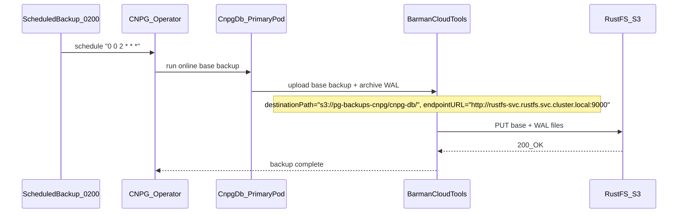
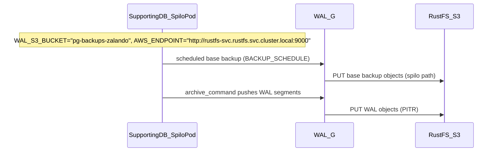
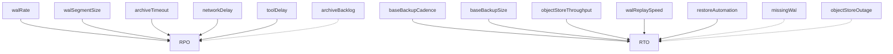
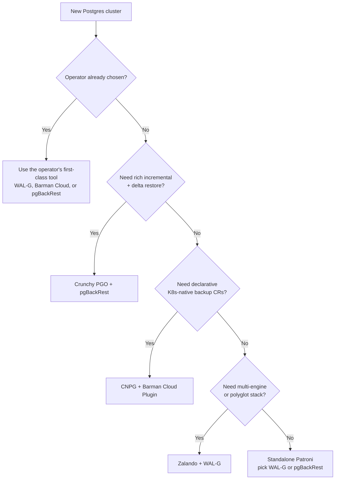

# PostgreSQL Backup Strategy

This document defines a **production-ready physical backup strategy** (base backup + WAL archiving) for **all 3 PostgreSQL clusters + DR replica** using **RustFS (S3-compatible)** as the backup target, with per-operator bucket isolation:

- **Bucket `pg-backups-zalando`**: `auth-db`, `supporting-shared-db` (Zalando / WAL-G)
- **Bucket `pg-backups-cnpg`**: `cnpg-db` (primary), `cnpg-db-replica` (DR) — CloudNativePG / Barman; separate S3 prefixes in the same bucket

For DRP policy, recovery decision flow, RTO/RPO ownership, and restore-drill
evidence, see [010-drp.md](./010-drp.md).

## Table of Contents

1. [Scope (production)](#scope-production)
2. [Architecture Overview (physical backup to RustFS)](#architecture-overview-physical-backup-to-rustfs)
   - [Runtime CNPG physical backup (cnpg-db)](#runtime-cnpg-physical-backup-cnpg-db)
   - [Runtime Zalando physical backup (supporting-shared-db)](#runtime-zalando-physical-backup-supporting-shared-db)
   - [Runtime alerts (PrometheusRule)](#runtime-alerts-prometheusrule)
3. [Cluster Inventory](#cluster-inventory)
4. [Bucket Layout](#bucket-layout)
5. [Retention and targets (RPO/RTO)](#retention-and-targets-rporto)
6. [Physical backup (enterprise patterns)](#physical-backup-enterprise-patterns)
7. [Backup tooling landscape (WAL-G vs pgBackRest vs Barman)](#backup-tooling-landscape-wal-g-vs-pgbackrest-vs-barman)
   - [Tool deep-dives (WAL-G, pgBackRest, Barman)](#tool-deep-dives-wal-g-pgbackrest-barman)
   - [Side-by-side comparison](#side-by-side-comparison)
   - [Operator → tool coupling](#operator--tool-coupling)
   - [What we use today and why](#what-we-use-today-and-why)
8. [Comparison (physical options)](#comparison-physical-options)
9. [Trade-offs matrix (frequency vs RPO/RTO/cost)](#trade-offs-matrix-frequency-vs-rporto-cost)
10. [PITR window and retention impact](#pitr-window-and-retention-impact)
11. [Real-world failure scenarios](#real-world-failure-scenarios)

---

## Scope (production)

### In-scope

- **Physical backup + WAL archiving** (enables PITR): base backup + continuous WAL shipping to object storage.
- **Restore drills**: restore-to-new-cluster + PITR to a timestamp/LSN.
- **Monitoring**: age of last successful backup, recent failures, and object-store reachability.

### Out-of-scope (for now)

- **Logical backups** (`pg_dump`, `pg_dumpall`): useful for **migrations**, **selective restore** (table/schema), and **cross-version portability**.
  - **Pros**: portable, granular restore, can run on primary or read-replica to reduce load.
  - **Cons**: slow for large DBs, long restore times, not WAL/PITR-native.
  - **Important**: logical backup **does not replace** physical backup + WAL archiving (PITR). In real incidents, teams typically use physical/PITR for “whole cluster recovery”, and logical for “selective recovery / migration”.
- **Snapshot-based backups** (CSI/EBS/ZFS/LVM): useful in some environments, but not the focus for this platform’s PostgreSQL footprint right now.

## Architecture Overview (physical backup to RustFS)

Assumption: the database clusters already exist and the RustFS bucket is already created and reachable.

### Runtime CNPG physical backup (cnpg-db)

### Runtime Zalando physical backup (supporting-shared-db)

### Runtime alerts (PrometheusRule)

## Cluster Inventory

### Summary Table

| Cluster         | Operator      | Namespace | PostgreSQL | Instances | Databases                    | Pooler     | HA Pattern |
|-----------------|---------------|-----------|------------|-----------|------------------------------|------------|------------|
| cnpg-db         | CloudNativePG | product   | 18         | 3         | product, cart, order         | PgDog      | Sync quorum `ANY 1`; DR cluster `cnpg-db-replica` |
| auth-db         | Zalando       | auth      | 16         | 3         | auth                         | PgBouncer  | Patroni HA |
| supporting-shared-db   | Zalando       | user      | 16         | 1 (SPOF)  | user, notification, shipping | PgBouncer  | Single     |

### Detailed Cluster Profiles

#### cnpg-db (CloudNativePG)

- **Namespace:** product
- **Operator:** CloudNativePG v1.29.1
- **PostgreSQL:** 18.1-system-trixie
- **Topology:** 3 instances (1 primary + 2 replicas), synchronous quorum `ANY 1` for HA
- **Scope:** 3 DBs (`product`, `cart`, `order`) on one CNPG cluster; apps connect via PgDog
- **Pooler:** PgDog (routes to this cluster for all three databases)
- **Secret:** `cnpg-db-secret` (manual)
- **Backup scope:** Physical backup + WAL archiving (PITR) to RustFS at `s3://pg-backups-cnpg/cnpg-db/`; restore-to-new-cluster drills.
- **DR replica cluster (`cnpg-db-replica`):** separate CloudNativePG `Cluster` for disaster recovery; Barman backups at `s3://pg-backups-cnpg/cnpg-db-replica/` (same bucket `pg-backups-cnpg`, distinct prefix from primary).

#### supporting-shared-db (Zalando)

- **Namespace:** user
- **Operator:** Zalando v1.15.1
- **PostgreSQL:** 16
- **Topology:** 1 instance (SPOF), no replication
- **Scope:** 3 DB (`user`, `notification`, `shipping`) + cross-namespace secrets
- **Pooler:** PgBouncer sidecar (2 instances)
- **Secret:** Auto-generated; cross-namespace for notification, shipping
- **Backup scope:** Physical backup + WAL archiving (PITR) to RustFS; DR-ready because SPOF.

---

## Bucket Layout

RustFS (S3-compatible) is deployed in namespace `rustfs`. Backups are split into **2 buckets by operator** for data isolation.

### Layout

| Bucket | Cluster | S3 path | Implementation |
|--------|---------|---------|----------------|
| `pg-backups-zalando` | auth-db | `s3://pg-backups-zalando/auth-db/` | WAL-G via Spilo |
| `pg-backups-zalando` | supporting-shared-db | `s3://pg-backups-zalando/user-db/` | WAL-G via Spilo |
| `pg-backups-cnpg` | cnpg-db | `s3://pg-backups-cnpg/cnpg-db/` | Barman Cloud Plugin + `ObjectStore` |
| `pg-backups-cnpg` | cnpg-db-replica | `s3://pg-backups-cnpg/cnpg-db-replica/` | Barman Cloud Plugin + `ObjectStore` (DR cluster) |

### S3 Endpoint

- **Internal (in-cluster):** `http://rustfs-svc.rustfs.svc.cluster.local:9000`
- **Buckets:** `pg-backups-zalando`, `pg-backups-cnpg`
- **Path style:** Use path-style URLs for S3-compatible (RustFS/MinIO style)

### Credentials

Each operator has its own **OpenBAO path** for backup credentials, distributed via separate ClusterExternalSecrets. All paths currently resolve to the RustFS root credentials seeded at `secret/local/infra/rustfs/root` (shared with the RustFS HelmRelease) -- dedicated per-operator service accounts with bucket-scoped IAM policies are a planned future improvement.

| OpenBAO Path | Bucket | Consumer | ClusterExternalSecret |
|------------|--------|----------|----------------------|
| `secret/local/infra/rustfs/backup-zalando` | `pg-backups-zalando` | Zalando clusters (auth-db, supporting-shared-db) | `pg-backup-rustfs-walg` |
| `secret/local/infra/rustfs/backup-cnpg` | `pg-backups-cnpg` | CNPG clusters (cnpg-db, cnpg-db-replica) | `pg-backup-rustfs-cnpg` |

- **Kubernetes Secret**: `pg-backup-rustfs-credentials` (per namespace, created by ClusterExternalSecret).
  - **CNPG/Barman keys**: `ACCESS_KEY_ID`, `ACCESS_SECRET_KEY`
  - **Zalando/WAL-G keys**: `AWS_ACCESS_KEY_ID`, `AWS_SECRET_ACCESS_KEY`
- **Bucket creation**: CronJob `setup-pg-backup-buckets` in namespace `rustfs` (runs every 30min, idempotent).

> **Future**: Replace the shared root credentials in OpenBAO with dedicated per-operator service accounts + bucket-scoped IAM policies. No ESO or K8s manifest changes required -- only OpenBAO values need updating.

---

## Retention and targets (RPO/RTO)

### Targets (how large orgs usually frame this)

- **RPO (data loss)**: driven by WAL archival frequency and `archive_timeout` (low-write workloads need `archive_timeout` to guarantee periodic WAL shipping).
- **RTO (time to restore)**: driven by base backup size + object-store throughput + WAL replay volume + automation.
- **PITR window**: limited by base + WAL retention (“recovery window” / PoR).

### RPO/RTO estimation formulas (rules of thumb)

- **RPO (low-write, worst case)**: `archive_timeout + network_delay + backup_tool_delay`
- **RPO (high-write)**: `(wal_segment_size / write_rate) + network_delay`
- **RTO (total)**: `base_download + wal_download + wal_replay + validation`

### RPO/RTO levers (diagram)

### Scenario A: Low-write workload (approx 10 writes/hour)

Assumptions: WAL segments may not switch frequently without `archive_timeout`.

| Config | archive_timeout | WAL ship frequency | RPO | RTO | Notes |
|--------|-----------------|--------------------|-----|-----|------|
| No PITR | N/A | N/A | 24h | 1-2h | Daily base backup only |
| PITR basic | 1h | Hourly | 1h | 2-3h | WAL ships once per hour |
| PITR optimized | 5m | Every 5m | 5-6m | 2-3h | Forces WAL switch every 5m |
| PITR + frequent base | 5m | Every 5m | 5-6m | 30-60m | Base backup every 6h |

**Low-write RPO**:
- No `archive_timeout`: RPO can be unbounded (next WAL switch may be far away).
- `archive_timeout=5m`: RPO approx `5m + network/tool delay` (example: ~5.5m).

### Scenario B: High-write workload (approx 1000 writes/sec)

Assumptions: WAL fills quickly; WAL segment size = 16MB.

| Config | WAL generation | WAL ship frequency | RPO | RTO | Notes |
|--------|----------------|--------------------|-----|-----|------|
| No PITR | Fast | N/A | 24h | 1-2h | Daily base backup only |
| PITR basic | Fast (16MB/min) | Per 16MB WAL | < 1m | 3-4h | WAL fills fast, auto ship |
| PITR + compression | Fast | Per 16MB (compressed) | < 1m | 2-3h | WAL compressed ~70% |
| PITR + parallel upload | Fast | 4 WAL in parallel | < 30s | 1-2h | Higher upload parallelism |

**High-write RPO formula**:
- Example: `RPO = (16MB / 10MB/s) + 1s = 2.6s`

### RTO breakdown (components)

Assumptions: base backup 100GB at 100MB/s, WAL replay 50-100MB/s.

| Component | No PITR | PITR (daily backup) | PITR (6h backup) | PITR (hourly backup) |
|-----------|---------|---------------------|------------------|----------------------|
| Download base | 15m | 15m | 15m | 15m |
| Download WAL | 0 | 30-60m (24h WAL) | 10-15m (6h WAL) | 2-5m (1h WAL) |
| Replay WAL | 0 | 1-2h | 20-40m | 5-10m |
| Validation | 5m | 5m | 5m | 5m |
| **Total RTO** | **20m** | **2-3.5h** | **50-75m** | **27-35m** |

### RTO calculator: concrete example

Example: e-commerce DB 100GB. Corruption detected at 15:00. Last base backup at 02:00.

**Config A: Daily backup only (no PITR)**
- Base download: 100GB @ 100MB/s = ~16m
- Restore + validation: ~15m
- **RTO: ~31m, RPO: 13h**

**Config B: Daily backup + PITR**
- Base download: ~16m
- WAL download: 13h * 50MB/h = 650MB (~1m)
- WAL replay: 650MB @ 50MB/s = ~13s
- **RTO: ~27m, RPO: 5m**

**Config C: 6h backup + PITR (recommended)**
- Base download: ~16m
- WAL download: 1h * 50MB/h = 50MB (~10s)
- WAL replay: 50MB @ 50MB/s = ~1s
- **RTO: ~26m, RPO: 5m**

Key insight: more frequent base backups reduce risk of corrupted base backups, but do not always reduce RTO significantly.

### Current implementation

See [What we use today and why](#what-we-use-today-and-why) for the per-cluster tool mapping and rationale.

### Recommended production baseline (starting point)

- **Base backups**: 30 days
- **WAL archive**: 14 days
- **Immutability**: enable object versioning / object lock if your object store supports it.

---

## Physical backup (enterprise patterns)

### Core components

- **Base backup**: full physical snapshot of PGDATA at a consistent point.
- **WAL archiving**: continuously ship WAL segments to the archive.
- **PITR**: restore base backup then replay WAL to `targetTime` / `targetLSN`.

### Patterns used in large organizations

- **Immutability**: object versioning + object lock; reduces ransomware/human-error blast radius.
- **Least privilege**: backup writer identity should be write-only; restore identity separate and tightly controlled.
- **Separate backup vs restore targets**: restore into a new cluster/prefix to avoid archive collisions and accidental overwrite.
- **Encryption**: TLS in transit; encryption at rest; periodic key rotation.
- **Restore drills**: scheduled restore-to-new-cluster rehearsals (the only proof backups work).
- **Monitoring**: age of last successful backup, recent failures, and object-store errors.

## Backup tooling landscape (WAL-G vs pgBackRest vs Barman)

Three PostgreSQL physical-backup tools dominate the ecosystem today: **WAL-G**, **pgBackRest**, and **Barman / Barman Cloud**. All three implement “base backup + WAL archive + PITR”, but their design centers, operational models, and feature gaps differ. Understanding those differences makes the operator choice (and any future migration) defensible.

### Tool deep-dives (WAL-G, pgBackRest, Barman)

#### WAL-G

Upstream: [wal-g/wal-g](https://github.com/wal-g/wal-g).

**Origin / maintainers**: Originally Citus Data, now primarily maintained by Yandex; widely used inside the Spilo / Patroni / Zalando stack and at large Postgres-on-S3 deployments.

**Design center**: A single Go binary that pushes/pulls base backups and WAL segments straight to object storage. Optimized for cloud object stores (S3, GCS, Azure Blob, Yandex, Swift), not local NFS.

**Strengths**:
- Native S3-first design — no intermediate “backup server” needed; each Postgres node ships its own data to the bucket.
- High-parallelism upload/download (`WALG_UPLOAD_CONCURRENCY`, `WALG_DOWNLOAD_CONCURRENCY`); fast on large clusters.
- Flexible compression (`lz4`, `zstd`, `brotli`, `lzma`) with a clear speed-vs-ratio trade-off — `lz4` (default) for speed, `zstd`/`brotli` for ~3× better ratio.
- Rich client-side encryption: libsodium, OpenPGP, AWS KMS, Yandex KMS, envelope encryption (PGP-encrypted-by-KMS).
- Delta backups (`WALG_DELTA_MAX_STEPS`) shrink base-backup size for slowly-changing data.
- Multi-engine: same tool covers Postgres, MySQL, MongoDB, FoundationDB, Greenplum — useful in polyglot platforms.
- Bundled inside the **Spilo** image — zero extra packaging when using the Zalando operator.

**Weaknesses**:
- Configuration is entirely env-var driven; sprawling variable surface (`WALG_*`, `WALE_*`, `AWS_*`) is easy to misconfigure.
- No first-class “catalog” / inventory UX — listing/inspecting backups is per-CLI-call, not a managed catalog like Barman’s.
- Retention semantics are coarser than pgBackRest (no native diff/incr matrix; relies on `backup-mark` + `backup-delete` patterns).
- Restore tooling assumes you know the layout — PITR/restore drills require more glue scripting than pgBackRest or Barman.
- Smaller doc surface for non-S3 backends; community tutorials skew Spilo/Yandex.

**Typical deployments**: Zalando Postgres Operator (Spilo), Citus, large Yandex Cloud Postgres footprints, custom Patroni clusters that want a single binary.

#### pgBackRest

Upstream: [pgbackrest/pgbackrest](https://github.com/pgbackrest/pgbackrest).

**Origin / maintainers**: Crunchy Data; the reference backup tool for the Crunchy PGO operator and the de-facto choice for many large standalone Postgres deployments.

**Design center**: A C-based backup tool with its own daemon-less architecture, designed around a **repository** abstraction (local, NFS, S3, Azure, GCS) and first-class **incremental / differential / full** backup types.

**Strengths**:
- Native **full / differential / incremental** backup matrix with automatic dependency tracking — the richest backup-type model of the three.
- Block-level delta restore (`--delta`) that uses checksums to skip unchanged files; very fast for re-syncing after a failed restore.
- High-parallelism with internal process pool (`--process-max`); typically the fastest at restore on large DBs.
- Compression: `gz`, `bz2`, `lz4`, `zst`; encryption: client-side `aes-256-cbc` (always client-side even on S3 with SSE).
- Multi-repo support (up to 4 repos) — can write to local NFS and S3 simultaneously for the same cluster, useful for 3-2-1 backup strategies.
- Robust retention policies per backup type (`repo-retention-full`, `repo-retention-diff`, `repo-retention-archive`).
- Excellent observability: `info` command returns structured JSON; integrates cleanly with monitoring.

**Weaknesses**:
- Tightly coupled to its repository layout — moving repos between backends needs explicit migration.
- Requires SSH or a dedicated repo host for multi-node clusters in some topologies (less of an issue in K8s where each pod owns its repo path).
- Not bundled in Spilo or CNPG — bringing pgBackRest into a non-Crunchy operator means custom sidecars / images.
- Single-engine: Postgres only.

**Typical deployments**: Crunchy PGO operator, standalone enterprise Postgres clusters, environments with on-prem + cloud dual-repo requirements.

#### Barman / Barman Cloud

Upstream: [EnterpriseDB/barman](https://github.com/EnterpriseDB/barman); CNPG plugin: [cloudnative-pg/plugin-barman-cloud](https://github.com/cloudnative-pg/plugin-barman-cloud).

**Origin / maintainers**: EnterpriseDB (EDB) / 2ndQuadrant lineage; the reference backup tool for **CloudNativePG** and many EDB customers.

Two flavors that are easy to confuse:

- **Barman (classic)**: A centralized **backup server** that pulls backups via SSH/rsync or pg_basebackup + streaming replication. Maintains a catalog, schedules jobs, handles retention, exposes a CLI (`barman backup`, `barman list-backup`, `barman recover`). Best for fleets of Postgres servers backed up to shared storage.
- **Barman Cloud**: A set of standalone CLI tools (`barman-cloud-backup`, `barman-cloud-wal-archive`, `barman-cloud-restore`, `barman-cloud-backup-delete`) that ship backups directly to S3 / Azure Blob / GCS. **No central server**, designed to be invoked from the Postgres node itself or from a sidecar — this is the flavor CNPG uses.

**Strengths**:
- *(classic)* Mature **catalog + retention engine** (`REDUNDANCY n`, `RECOVERY WINDOW OF n DAYS`) with the cleanest semantics of the three.
- *(classic)* First-class **streaming WAL archiving** via `pg_receivewal` + replication slots — near-zero-RPO WAL shipping without `archive_command`.
- *(classic)* Centralized fleet management; one Barman server can back up dozens of Postgres clusters.
- *(classic)* Strong incremental backup support (`reuse_backup=link` rsync-based, or native page-level incremental on Postgres 17+).
- *(classic)* Parallel backup workers (`parallel_jobs`), bandwidth throttling, retry policies.
- *(cloud)* No backup server to operate; fits cloud-native / K8s patterns where backups live in object storage and the “catalog” is the bucket layout.
- *(cloud)* Per-WAL compression choice (`--gzip`, `--bzip2`, `--xz`, `--snappy`, `--zstd`, `--lz4`) with `--compression-level`.
- *(cloud)* S3 SSE + KMS, Azure encryption scopes, GCS KMS — server-side encryption is first-class.
- *(cloud)* Retention via `barman-cloud-backup-delete --retention-policy "RECOVERY WINDOW OF 7 DAYS"`; same semantics as the classic catalog.
- *(cloud)* **CNPG-I plugin** wraps these CLIs as `ObjectStore` CRs, so users get declarative backup config without operating Barman Cloud directly.

**Weaknesses**:
- *(classic)* Needs a dedicated server (compute, storage, monitoring); operational footprint is larger than WAL-G or pgBackRest in cloud-native deployments.
- *(cloud)* No catalog UX; restores depend on `barman-cloud-backup-list` against the bucket, with no central inventory.
- *(both)* Slower than WAL-G or pgBackRest in raw upload throughput on very large clusters (Python-based, less internal parallelism per process).
- *(both)* Encryption is delegated to the storage backend (SSE/KMS); no built-in client-side encryption like WAL-G libsodium or pgBackRest aes-256-cbc.
- *(both)* Single-engine: Postgres only.

**Typical deployments**: CloudNativePG (via Barman Cloud Plugin), EDB enterprise customers, fleets centralized on a Barman server, environments that need strict recovery-window retention semantics.

### Side-by-side comparison

Capability matrix (✅ first-class, ⚠️ supported but with caveats, ❌ not supported):

| Capability | WAL-G | pgBackRest | Barman (classic) | Barman Cloud |
|---|---|---|---|---|
| **Language / footprint** | Go, single binary | C, single binary | Python, server daemon | Python, CLI tools |
| **Architecture** | Per-node → object store | Per-node → repo (local/S3) | Central server pulls from PG | Per-node → object store |
| **PITR** | ✅ | ✅ | ✅ | ✅ |
| **Full backup** | ✅ | ✅ | ✅ | ✅ |
| **Incremental backup** | ⚠️ delta only | ✅ full/diff/incr matrix | ✅ rsync `reuse_backup=link` + PG17 page-level | ❌ |
| **Differential backup** | ❌ | ✅ | ⚠️ via reuse_backup | ❌ |
| **Delta restore (checksum-skip)** | ❌ | ✅ `--delta` | ⚠️ rsync mode | ❌ |
| **Parallel upload** | ✅ env-tunable | ✅ `--process-max` | ✅ `parallel_jobs` | ⚠️ via `--max-concurrency` |
| **Parallel restore** | ✅ | ✅ (typically fastest) | ✅ | ⚠️ |
| **Compression** | lz4, zstd, brotli, lzma | gz, bz2, lz4, zst | gzip, bzip2, custom | gzip, bzip2, xz, snappy, zstd, lz4 |
| **Client-side encryption** | ✅ libsodium, PGP, AWS/YC KMS | ✅ aes-256-cbc | ⚠️ via OS / filesystem | ❌ (relies on S3 SSE / KMS) |
| **S3-compatible (RustFS/MinIO)** | ✅ `AWS_ENDPOINT` | ✅ `repo-s3-endpoint` | ⚠️ via FUSE / mounted | ✅ `--endpoint-url` |
| **Streaming WAL (no `archive_command`)** | ❌ | ⚠️ async via `archive_command` | ✅ `pg_receivewal` + slot | ❌ |
| **Retention model** | manual / `backup-mark` | full/diff/archive counts or time | REDUNDANCY / RECOVERY WINDOW | RECOVERY WINDOW |
| **Multi-repo (e.g. local + S3)** | ❌ | ✅ up to 4 repos | ⚠️ separate servers | ❌ |
| **Catalog / inventory** | ❌ (per-CLI) | ✅ `info` JSON | ✅ rich catalog | ⚠️ bucket listing |
| **Multi-engine (MySQL/Mongo)** | ✅ | ❌ Postgres only | ❌ | ❌ |
| **First-class operator integration** | Bundled in Spilo (Zalando) | Sidecar in Crunchy PGO | — | CNPG-I plugin (`ObjectStore` CR) |
| **License** | Apache 2.0 | MIT | GPLv3 | GPLv3 |

### Operator → tool coupling

The choice of backup tool is mostly **decided by the operator**, not by the team — each operator integrates one tool first-class and treats others as “bring your own sidecar”:

| Operator | First-class tool | Why this coupling |
|---|---|---|
| **Zalando Postgres Operator** (Spilo) | **WAL-G** | Spilo image bundles WAL-G; backup config is via env vars (`WAL_S3_BUCKET`, `BACKUP_SCHEDULE`, `BACKUP_NUM_TO_RETAIN`). Replacing it means rebuilding the Spilo image — not realistic. |
| **CloudNativePG (CNPG)** | **Barman Cloud** (via CNPG-I plugin) | `barmanObjectStore` was in-tree until 1.25; CNPG 1.26+ moved to the **Barman Cloud Plugin** with `ObjectStore` CRs. Declarative, first-class supported by EDB (CNPG’s sponsor). |
| **Crunchy PGO** | **pgBackRest** | PGO ships a pgBackRest sidecar in every PG pod; backups, restores, and clones all run through the `pgbackrest` CLI inside the operator’s reconcile loop. |
| **StackGres** | **WAL-G** (default) + Babelfish/extension hooks | WAL-G under the hood, exposed through `SGObjectStorage` CRs. |
| **Standalone Patroni / vanilla Postgres** | Any | Free choice — most teams pick **pgBackRest** for the retention model or **WAL-G** for S3-native simplicity. |

Decision flow when picking an operator for a new cluster:

### What we use today and why

| Cluster | Operator | Backup tool | Rationale |
|---|---|---|---|
| `auth-db`, `supporting-shared-db` | Zalando | **WAL-G** via Spilo, bucket `pg-backups-zalando`, `BACKUP_NUM_TO_RETAIN=7` in `zalando-walg-config` | Tool comes for free with the Spilo image; no reason to swap. |
| `cnpg-db` | CloudNativePG | **Barman Cloud Plugin** (CNPG-I) + `ObjectStore` CR, `s3://pg-backups-cnpg/cnpg-db/` | Declarative `ObjectStore` + `ScheduledBackup` CRs; CNPG 1.26+ deprecated in-tree `barmanObjectStore`, so the plugin is the long-term path. |
| `cnpg-db-replica` | CloudNativePG | **Barman Cloud Plugin**, `s3://pg-backups-cnpg/cnpg-db-replica/` | Same bucket as primary, separate prefix; DR cluster keeps its own backups for independent recovery. |

Both tools write to the **same RustFS** with **per-operator bucket isolation** (`pg-backups-zalando`, `pg-backups-cnpg`), which keeps blast radius and credential scope per operator without forcing a single tool across the platform.

**Why we did not standardize on one tool**: standardizing would mean either rebuilding Spilo without WAL-G (not realistic) or moving CNPG off its first-class Barman Cloud Plugin (loses declarative CRs and operator-supported upgrades). The cost of running two well-supported tools — each native to its operator — is lower than the cost of fighting either operator.

## Comparison (physical options)

| Method | PITR support | RPO (best) | RPO (worst) | RTO | Storage efficiency | Use case |
|--------|--------------|------------|-------------|-----|--------------------|---------|
| Streaming replication only | No | ~1s | Infinite (human error replicates) | 1-5m (failover) | N/A (not backup) | HA only, not DR |
| Logical backup (pg_dump) | No | Backup interval | Backup interval | Hours to days | High (text format) | Migration, selective restore |
| Base backup only | No | Backup interval | Backup interval | 30m - 2h | Medium | Simple recovery |
| Base backup + WAL archiving | Yes | archive_timeout | archive_timeout + network delay | 30m - 4h | Low (compressed) | Production standard |
| Continuous backup (WAL-G) | Yes | < 1m | 1-5m | 30m - 2h | Very low | Enterprise |
| Snapshot (EBS/ZFS) | Partial | Snapshot interval | Snapshot interval | 5-30m | Very low | Cloud-native |

## Trade-offs matrix (frequency vs RPO/RTO/cost)

| Backup frequency | RPO | RTO | Storage cost | Network I/O | CPU overhead | Recommendation |
|------------------|-----|-----|--------------|-------------|--------------|----------------|
| Weekly + PITR | 5m | 4-8h | Very low | Low | Very low | Too risky |
| Daily + PITR | 5m | 2-4h | Low | Low | Low | Acceptable for dev |
| Every 12h + PITR | 5m | 1-2h | Medium | Medium | Low | Good for staging |
| Every 6h + PITR | 5m | 30-60m | Med-high | Medium | Medium | Production standard |
| Every 1h + PITR | 5m | 10-20m | High | High | High | Critical DBs only |
| Continuous (WAL-G) | < 1m | 5-10m | Very high | Very high | Medium | Enterprise only |

## PITR window and retention impact

| Retention policy | PITR window | Use case | Compliance | Storage cost (100GB DB) |
|------------------|-------------|----------|------------|--------------------------|
| 7 days | 7 days | Dev/test only | Insufficient | ~700GB WAL + 7 base |
| 14 days | 14 days | Small production | Risky | ~1.4TB WAL + 14 base |
| 30 days | 30 days | Standard production | Meets most requirements | ~3TB WAL + 30 base |
| 90 days | 90 days | Finance/healthcare | Regulatory | ~9TB WAL + 90 base |
| 365 days | 365 days | Archive/legal | Legal hold | ~36TB WAL + 365 base |

**Important**: PITR window is not the same as retention. If corruption happened 35 days ago and retention is 30 days, you cannot restore.

Best practices:
- Production: 30 days minimum
- Regulated: 90 days or more
- Use compression to keep costs manageable

## Real-world failure scenarios

### Scenario 1: Accidental DROP TABLE (human error)

- 10:00 - Production healthy
- 10:15 - `DROP TABLE users;` executed
- 10:16 - Login failures detected
- 10:17 - Incident declared

**Without PITR**:
- Restore from last daily backup (02:00)
- RPO ~8h 15m (all data from 02:00-10:15 lost)
- RTO ~30m

**With PITR**:
- Restore to 10:14:59
- RPO ~1m
- RTO ~30m (restore + WAL replay)

### Scenario 2: Ransomware with delayed detection

- Day 0: malware infiltrates (dormant)
- Day 7: encryption starts
- Day 7 + 2h: detection
- Day 7 + 2h 15m: restore required

**Without PITR (7-day retention)**:
- Backups likely infected
- RPO infinite (complete data loss)

**With PITR (30-day retention)**:
- Restore from backup before infection
- Replay WAL until last known good state
- RPO ~1 day, RTO ~4h (older base + more WAL)

---

## Related Documentation

- [002-database-integration.md](./002-database-integration.md) - Database architecture and cluster details
- [010-drp.md](./010-drp.md) - Production-ready DRP, recovery decision flow, and restore-drill evidence
- [postgres_backup_restore.md](../runbooks/troubleshooting/postgres_backup_restore.md) - Runbook for backup/restore procedures
- [RustFS README](../../kubernetes/infra/controllers/storage/rustfs/README.md) - RustFS deployment and access
