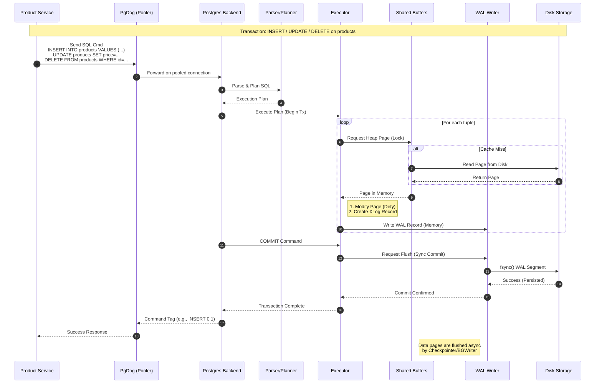
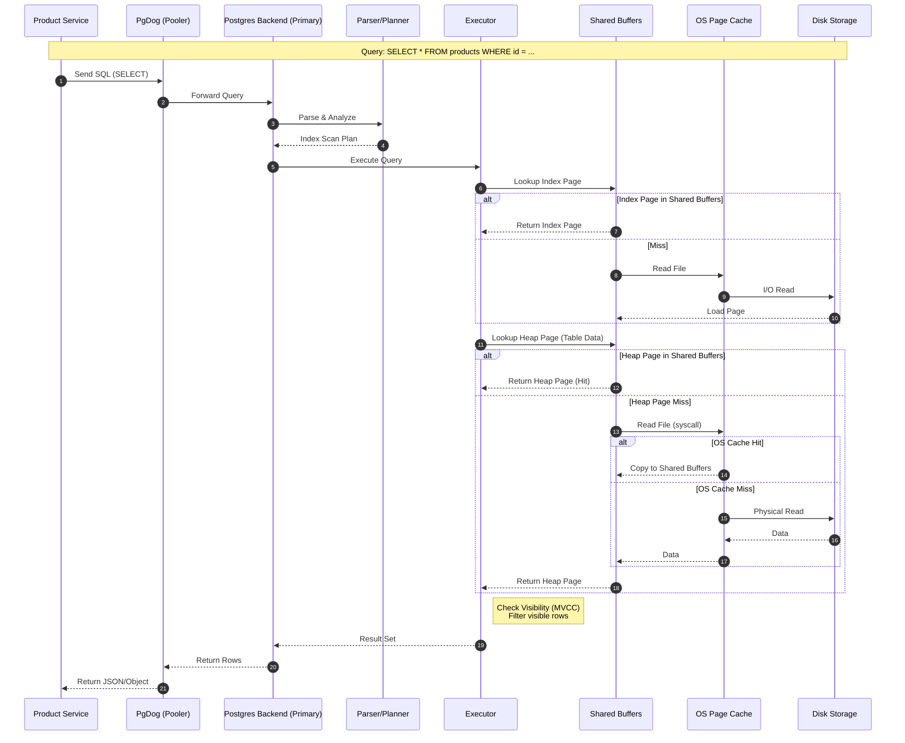

# cnpg-db Cluster Internals

Here are the specific request flows for the `cnpg-db` cluster, incorporating the `PgDog` pooler and `CloudNativePG` architecture.

## 1. Write Flow (INSERT/UPDATE)
**Context:** Product Service performs an INSERT. `PgDog` routes to the **Primary** instance.



## 2. Read Flow (SELECT)
**Context:** Product Service performs a SELECT. `PgDog` currently routes to **Primary** (Read-Write) as read-splitting is not yet enabled.



---

# databases

```mermaid

graph TD
    %% ===== CLIENT LAYER =====
    Client["Product Service (Go)<br/>Uses pgx driver"]


    Client -->|"Step 1: Send SQL Command<br/>INSERT INTO products ...<br/>UPDATE products SET ...<br/>DELETE FROM products ..."| PgDog
    PgDog -->|"Forward on pooled connection"| Backend
    
    Backend -->|"Parse & Plan SQL"| Parser
    
    %% ===== BACKEND PROCESS LAYER =====
    Backend[Backend Process<br/>Inside CNPG Pod]
    
    Backend -->|"Step 2: BEGIN Transaction"| TxManager
    
    TxManager[Transaction Manager<br/>Assigns XID Transaction ID<br/>e.g., XID = 12345]
    
    TxManager -->|"Step 3: Parse SQL"| Parser
    
    Parser[SQL Parser<br/>Syntax validation<br/>Create parse tree]
    
    Parser -->|"Step 4: Optimize Query"| Planner
    
    Planner[Query Planner<br/>Choose optimal execution plan<br/>Index scan vs Seq scan]
    
    Planner -->|"Step 5: Execute DML"| Executor
    
    %% ===== EXECUTOR LAYER - MVCC =====
    subgraph ExecutorLayer["Executor - MVCC Write Operations"]
        Executor[Query Executor]
        
        Executor -->|"Step 6a: INSERT"| InsertOp["Create new tuple<br/>SET xmin = 12345<br/>xmax = 0 not deleted yet"]
        
        Executor -->|"Step 6b: UPDATE"| UpdateOp["Old tuple: SET xmax = 12345 mark deleted<br/>New tuple: SET xmin = 12345"]
        
        Executor -->|"Step 6c: DELETE"| DeleteOp["SET xmax = 12345<br/>Tuple marked as deleted<br/>Physical removal by VACUUM later"]
        
        InsertOp -->|Write to memory| SharedBuffers
        UpdateOp -->|Write to memory| SharedBuffers
        DeleteOp -->|Write to memory| SharedBuffers
    end
    
    Executor -->|"Read/Write Page"| SharedBuffers
    
    SharedBuffers -->|"Cache Miss"| OSKernelLayer
    OSKernelLayer -->|"Page Fault / Read"| PhysicalDisk
    PhysicalDisk -->|"Return Page"| OSKernelLayer
    OSKernelLayer -->|"Copy to Buffer"| SharedBuffers
    
    SharedBuffers["Shared Buffers (64MB)<br/>In-memory data cache<br/>Modified pages = dirty pages"]
    
    %% ===== WAL LAYER - CRITICAL PATH =====
    SharedBuffers -->|"Step 7: BEFORE data persist<br/>Write-Ahead Logging<br/>Durability guarantee"| WALBuffers
    
    WALBuffers[WAL Buffers<br/>In-memory WAL records<br/>LSN Log Sequence Number tracking]
    
    WALBuffers -->|"Step 8: WAL Writer Process<br/>fsync to disk<br/>wal_sync_method = fdatasync"| WALFiles
    
    WALFiles["WAL Files on Disk<br/>pg_wal/ directory (PVC)<br/>16MB segments<br/>Sequential writes high performance"]
    
    WALFiles -->|"Step 9: After WAL on disk<br/>Transaction can COMMIT safely"| CommitLog
    
    CommitLog[Commit Log pg_xact/<br/>Transaction Status: COMMITTED<br/>XID 12345 = COMMITTED]
    
    CommitLog -->|"Step 10: Return SUCCESS to client<br/>COMMIT acknowledged"| Client
    
    %% ===== ASYNC BACKGROUND PROCESSES =====
    SharedBuffers -.->|"Async Process<br/>Not blocking COMMIT"| BGWriter
    
    BGWriter[Background Writer Process<br/>Periodically writes dirty pages<br/>Reduces I/O spikes during checkpoint]
    
    BGWriter -.->|"Write dirty buffers"| Checkpointer
    
    Checkpointer[Checkpointer Process<br/>checkpoint_timeout default 5min<br/>Flush all dirty pages to disk]
    
    Checkpointer -.->|"Step 11: Async write to disk<br/>Eventually consistent"| DataFiles
    
    DataFiles[Data Files on Disk<br/>base/database_oid/table_oid<br/>8KB pages heap files<br/>Persistent storage]
    
    %% ===== MVCC VISIBILITY - CONCURRENT READS =====
    subgraph MVCCReads["MVCC - Concurrent Reads Don't Block Writes"]
        SharedBuffers -.->|"Concurrent SELECT queries"| ReaderTx
        
        ReaderTx[Read Transaction<br/>Takes snapshot at BEGIN<br/>Sees consistent view]
        
        ReaderTx -->|"Visibility check for each tuple"| VisibilityCheck
        
        VisibilityCheck{Tuple Visibility Rules<br/>Based on xmin/xmax vs snapshot}
        
        VisibilityCheck -->|"xmin < snapshot.xmin<br/>AND xmax = 0 or uncommitted"| Visible[Tuple VISIBLE<br/>Return to client]
        
        VisibilityCheck -->|"xmin >= snapshot.xmin<br/>OR xmax committed"| Invisible[Tuple INVISIBLE<br/>Skip this tuple version]
    end
    
    %% ===== PHYSICAL STREAMING REPLICATION =====
    WALFiles -->|"Continuous WAL stream"| WALSender
    
    WALSender[WAL Sender Process<br/>Reads new WAL segments<br/>Sends via TCP connection]
    
    WALSender ==>|"Step 12: Stream WAL over network<br/>Synchronous: Wait for replica ACK<br/>Asynchronous: Don't wait"| WALReceiver
    
    subgraph StandbyNode["cnpg-db replica pods (x2) - Asynchronous Replication"]
        WALReceiver[WAL Receiver Process<br/>Receives WAL stream<br/>Writes to local pg_wal/]
        
        WALReceiver -->|"Step 13: Write WAL to disk"| StandbyWAL
        
        StandbyWAL[Standby WAL Files<br/>pg_wal/<br/>Same as primary]
        
        StandbyWAL -->|"Step 14: WAL Replay<br/>Apply all changes"| StartupProc
        
        StartupProc[Startup Process<br/>Recovery/Replay mode<br/>Applies WAL records sequentially]
        
        StartupProc -->|"Step 15a: Update memory"| StandbyBuffers
        
        StandbyBuffers[Standby Shared Buffers<br/>Hot Standby: Read-only queries allowed<br/>Warm Standby: No queries]
        
        StartupProc -->|"Step 15b: Write to disk"| StandbyData
        
        StandbyData[Standby Data Files<br/>Exact replica of primary<br/>Byte-for-byte identical]
        
        StandbyBuffers -.->|"Hot Standby mode<br/>Read-only queries"| StandbyQuery[SELECT queries<br/>Load balancing<br/>Reporting workload]
    end
    
    StandbyWAL -.->|"Synchronous replication<br/>ACK LSN position"| WALSender
    
    %% ===== LOGICAL REPLICATION =====
    WALFiles ==>|"Alternative: Logical Replication"| LogicalDecoder
    
    subgraph LogicalRepl["Logical Replication - Selective & Flexible"]
        LogicalDecoder[Logical Decoder Plugin<br/>pgoutput default, wal2json<br/>Decodes WAL to logical changes]
        
        LogicalDecoder -->|"Step 16: Decode to SQL-like<br/>INSERT/UPDATE/DELETE"| ReplSlot
        
        ReplSlot[Replication Slot<br/>pg_replslot/<br/>Tracks LSN consumer progress<br/>Prevents WAL deletion]
        
        ReplSlot -->|"Step 17: Filter by Publication<br/>SELECT specific tables/columns"| Publication
        
        Publication[Publication<br/>CREATE PUBLICATION mypub<br/>FOR TABLE users, orders]
        
        Publication ==>|"Step 18: Stream logical changes<br/>Row-level changes<br/>Can cross PG versions"| Subscription
        
        Subscription[Subscription on Target<br/>CREATE SUBSCRIPTION mysub<br/>CONNECTION 'host=...'<br/>PUBLICATION mypub]
        
        Subscription -->|"Step 19: Apply Worker<br/>Execute changes on target"| TargetTable
        
        TargetTable[Target Tables<br/>Can have different schema<br/>DDL not replicated<br/>Conflict resolution needed]
    end
    
    %% ===== WAL ARCHIVING =====
    WALFiles -.->|"archive_command<br/>Archive completed segments"| Archive
    
    Archive[Barman Cloud Plugin / ObjectStore<br/>S3 Bucket<br/>Point-in-Time Recovery PITR<br/>Base backup + WAL archives]
    
    %% ===== VACUUM PROCESS =====
    DataFiles -.->|"Dead tuples cleanup"| VacuumProc
    
    VacuumProc[Autovacuum Worker<br/>Removes dead tuples xmax set<br/>Prevents transaction ID wraparound<br/>Updates statistics]
    
    VacuumProc -.->|"Update FSM/VM<br/>Free Space Map<br/>Visibility Map"| DataFiles
    
    %% ===== NOTES SECTION =====
    subgraph Notes["PostgreSQL Write & Replication Flow - Key Concepts"]
        N1["✓ Write-Ahead Logging WAL:<br/>WAL records MUST be on disk BEFORE data changes<br/>Guarantees durability after crash"]
        
        N2["✓ MVCC Multi-Version Concurrency Control:<br/>Each tuple has xmin created by XID and xmax deleted by XID<br/>Readers see snapshot, don't block writers"]
        
        N3["✓ Tuple Versioning:<br/>INSERT: xmin=XID, xmax=0<br/>UPDATE: old xmax=XID, new xmin=XID<br/>DELETE: xmax=XID not physical delete"]
        
        N4["✓ COMMIT Process:<br/>1 Write WAL → 2 fsync WAL → 3 Update pg_xact → 4 Return success<br/>Data files updated later async"]
        
        N5["✓ Physical Replication:<br/>WAL streaming byte-for-byte copy<br/>Entire cluster replica same version required<br/>Hot Standby allows read queries"]
        
        N6["✓ Logical Replication:<br/>Row-level changes decoded from WAL<br/>Selective table replication<br/>Different PG versions OK 10+<br/>No DDL replication"]
        
        N7["✓ Replication Slot:<br/>Tracks LSN consumption<br/>Prevents WAL deletion before replica catches up<br/>Must monitor disk usage"]
        
        N8["✓ Synchronous vs Asynchronous:<br/>Sync: Primary waits for replica ACK RPO=0<br/>Async: Primary continues immediately better performance"]
        
        N1 ~~~ N2
        N2 ~~~ N3
        N3 ~~~ N4
        N4 ~~~ N5
        N5 ~~~ N6
        N6 ~~~ N7
        N7 ~~~ N8
    end
    
    %% ===== STYLING =====
    classDef clientStyle fill:#e1f5ff,stroke:#0066cc,stroke-width:3px
    classDef backendStyle fill:#fff4e1,stroke:#ff9900,stroke-width:2px
    classDef executorStyle fill:#ffe6f0,stroke:#cc0066,stroke-width:2px
    classDef memoryStyle fill:#e1ffe1,stroke:#00cc00,stroke-width:2px
    classDef walStyle fill:#ffe1e1,stroke:#cc0000,stroke-width:3px
    classDef diskStyle fill:#e6e6e6,stroke:#666666,stroke-width:2px
    classDef replicationStyle fill:#f0e1ff,stroke:#9900cc,stroke-width:2px
    classDef mvccStyle fill:#fff9e6,stroke:#ff9900,stroke-width:2px
    classDef logicalStyle fill:#e1f0ff,stroke:#0066cc,stroke-width:2px
    
    class Client,StandbyQuery clientStyle
    class Backend,TxManager,Parser,Planner backendStyle
    class Executor,ExecutorLayer,InsertOp,UpdateOp,DeleteOp executorStyle
    class SharedBuffers,WALBuffers,StandbyBuffers memoryStyle
    class WALFiles,WALSender,WALReceiver,StandbyWAL walStyle
    class DataFiles,StandbyData,CommitLog,Archive diskStyle
    class BGWriter,Checkpointer,StartupProc,VacuumProc replicationStyle
    class ReaderTx,VisibilityCheck,Visible,Invisible,MVCCReads mvccStyle
    class LogicalDecoder,ReplSlot,Publication,Subscription,TargetTable,LogicalRepl logicalStyle


```




---

```mermaid
graph TD
    %% ===== LAYER 1: CLIENT APPLICATIONS =====
    subgraph ClientLayer["LAYER 1: Client Applications (Kubernetes)"]
        Client1[Product Service Pod 1]
        Client2[Product Service Pod 2]
        Client3[Product Service Pod 3]
        ClientN[Dev/Ops via kubectl exec]
    end
    
    Client1 -.->|TCP/5432| PgDog
    Client2 -.->|TCP/5432| PgDog
    Client3 -.->|TCP/5432| PgDog
    
    PgDog["PgDog Service (Transaction Mode)<br/>Routes to RW/RO"]
    
    %% ===== LAYER 2: POSTMASTER - MAIN DAEMON =====
    ClientN -->|Direct Connection| Postmaster
    PgDog -->|Multiplexed connections| Postmaster
    
    subgraph PostmasterLayer["LAYER 2: Postmaster - Main Supervisor Daemon"]
        Postmaster[Postmaster Process<br/>PID stored in postmaster.pid<br/>Listens on port 5432<br/>Manages authentication<br/>Supervises all child processes]
    end
    
    Postmaster -->|fork system call<br/>Process-per-connection model| ForkDecision
    
    ForkDecision{Fork System Call<br/>Creates child processes<br/>NOT threads<br/>Copy-on-write memory}
    
    %% ===== LAYER 3: BACKEND PROCESSES =====
    ForkDecision -->|Per client connection| BackendLayer
    
    subgraph BackendLayer["LAYER 3: Backend Processes - Query Execution"]
        Backend1[Backend Process 1<br/>Handles Client 1 queries<br/>SQL parsing, planning, execution<br/>Transaction management]
        Backend2[Backend Process 2<br/>Handles Client 2 queries<br/>SQL parsing, planning, execution<br/>Transaction management]
        Backend3[Backend Process 3<br/>Handles Client 3 queries<br/>SQL parsing, planning, execution<br/>Transaction management]
        BackendN[Backend Process N<br/>max_connections default 100<br/>Each backend uses memory<br/>work_mem per sort/hash operation]
    end
    
    %% ===== LAYER 4: BACKGROUND PROCESSES =====
    ForkDecision -->|Forked at startup<br/>Always running| BgLayer
    
    subgraph BgLayer["LAYER 4: Background Processes - System Maintenance"]
        direction TB
        
        subgraph WriterProcesses["Writer Processes"]
            Checkpointer[Checkpointer<br/>Periodic checkpoint checkpoint_timeout=5min<br/>Flush ALL dirty pages to disk<br/>Write checkpoint record to WAL<br/>Recovery starts from last checkpoint]
            
            BGWriter[Background Writer<br/>bgwriter_delay=200ms default<br/>Continuously write dirty buffers<br/>Keep free buffers available<br/>Reduce checkpoint I/O spike]
            
            WALWriter[WAL Writer<br/>wal_writer_delay=200ms<br/>Flush WAL buffers to pg_wal/<br/>wal_sync_method=fdatasync<br/>Ensure transaction durability]
        end
        
        subgraph AutovacuumProcesses["Autovacuum System - CRITICAL MAINTENANCE"]
            AutovacuumLauncher[Autovacuum Launcher<br/>Master daemon process<br/>autovacuum=on default<br/>Monitors table statistics<br/>Decides which tables need vacuum<br/>Spawns worker processes]
            
            AutovacuumWorker1[Autovacuum Worker 1<br/>VACUUM: Remove dead tuples<br/>UPDATE/DELETE creates dead tuples<br/>Reclaim disk space<br/>Update Free Space Map FSM]
            
            AutovacuumWorker2[Autovacuum Worker 2<br/>ANALYZE: Update statistics<br/>Table row count, column distribution<br/>Help query planner optimization<br/>Better execution plans]
            
            AutovacuumWorker3[Autovacuum Worker 3<br/>VACUUM FREEZE: Prevent XID wraparound<br/>autovacuum_freeze_max_age<br/>Critical for system stability<br/>Max 2 billion transactions]
            
            AutovacuumWorkerN[Autovacuum Worker N<br/>autovacuum_max_workers=3 default<br/>Can run in parallel on different tables<br/>autovacuum_naptime=1min]
        end
        
        subgraph ReplicationProcesses["Replication Processes"]
            WALSender1[WAL Sender 1<br/>Stream WAL to replica<br/>Physical or logical replication<br/>max_wal_senders=10 default]
            
            WALSender2[WAL Sender 2<br/>Multiple replicas supported<br/>Synchronous or asynchronous<br/>Monitor replication lag]
            
            WALReceiver[WAL Receiver<br/>On standby node only<br/>Receives WAL stream<br/>Writes to local pg_wal/]
            
            StartupProcess[Startup Process<br/>WAL replay during recovery<br/>Crash recovery at startup<br/>Continuous replay on standby]
        end
        
        subgraph UtilityProcesses["Utility Processes"]
            StatsCollector[Statistics Collector<br/>Collects runtime statistics<br/>Table access patterns<br/>Dead tuple count<br/>Last vacuum/analyze time<br/>FEEDS Autovacuum Launcher]
            
            Logger[Logger Process<br/>Write server logs<br/>log_destination=stderr/csvlog<br/>Error and activity logging<br/>log_min_messages level]
            
            Archiver[Archiver Process<br/>archive_mode=on<br/>archive_command execution<br/>Copy completed WAL segments<br/>Point-in-Time Recovery PITR]
        end
        
        AutovacuumLauncher -->|Spawns when needed| AutovacuumWorker1
        AutovacuumLauncher -->|Spawns when needed| AutovacuumWorker2
        AutovacuumLauncher -->|Spawns when needed| AutovacuumWorker3
        AutovacuumLauncher -->|Spawns when needed| AutovacuumWorkerN
        
        StatsCollector -.->|Provides table stats<br/>Dead tuple count<br/>Table bloat info| AutovacuumLauncher
    end
    
    %% ===== LAYER 5: SHARED MEMORY =====
    Backend1 <-->|IPC Inter-Process Communication<br/>Read/Write access| SharedMemLayer
    Backend2 <-->|IPC Inter-Process Communication<br/>Read/Write access| SharedMemLayer
    Backend3 <-->|IPC Inter-Process Communication<br/>Read/Write access| SharedMemLayer
    BackendN <-->|IPC Inter-Process Communication<br/>Read/Write access| SharedMemLayer
    
    Checkpointer <-->|Access shared buffers| SharedMemLayer
    BGWriter <-->|Access shared buffers| SharedMemLayer
    WALWriter <-->|Access WAL buffers| SharedMemLayer
    AutovacuumWorker1 <-->|Access shared structures| SharedMemLayer
    AutovacuumWorker2 <-->|Access shared structures| SharedMemLayer
    AutovacuumWorker3 <-->|Access shared structures| SharedMemLayer
    WALSender1 <-->|Read WAL and data| SharedMemLayer
    WALSender2 <-->|Read WAL and data| SharedMemLayer
    
    subgraph SharedMemLayer["LAYER 5: Shared Memory Region - IPC between processes"]
        direction TB
        
        subgraph SharedBuffersArea["Shared Buffers - shared_buffers parameter"]
            SharedBuffersData["Data & Index Pages Cache<br/>8KB blocks in memory<br/>LRU eviction policy<br/>Current: 64MB (Dev)<br/>Prod Target: 25-40% RAM"]
        end
        
        subgraph WALBuffersArea["WAL Buffers - wal_buffers parameter"]
            WALBuffersData[WAL Records Cache<br/>Before flush to pg_wal/<br/>wal_buffers=-1 auto-tuned<br/>3% of shared_buffers<br/>Min 64KB, Max 16MB default]
        end
        
        subgraph CommitLogArea["Transaction Status Cache"]
            XactStatusCache[pg_xact/ cache<br/>Transaction commit status<br/>XID committed/aborted/in-progress<br/>MVCC visibility checks]
        end
        
        subgraph LockManagement["Lock Manager Structures"]
            LockTable[Lock Tables<br/>Table/Row/Page locks<br/>Shared/Exclusive locks<br/>Deadlock detection<br/>max_locks_per_transaction=64]
            
            ProcArray[Process Array<br/>Active backends tracking<br/>Transaction snapshot<br/>XID visibility for MVCC]
        end
        
        subgraph CatalogCaches["System Catalog Caches"]
            SysCache[System Catalog Cache<br/>Table metadata<br/>Column definitions<br/>Index information<br/>Reduce pg_catalog queries]
            
            RelCache[Relation Cache<br/>Table/Index file info<br/>Physical layout<br/>Statistics cache]
        end
        
        subgraph BufferManagement["Buffer Management"]
            BufferDesc[Buffer Descriptors<br/>Buffer metadata<br/>Pin counts<br/>Dirty flags<br/>Usage counts for LRU]
            
            FreeList[Free Buffer List<br/>Available buffers<br/>BGWriter maintains<br/>Fast allocation]
        end
    end
    
    %% ===== LAYER 6: LOCAL MEMORY =====
    Backend1 -->|Private memory<br/>Not shared| LocalMem1
    Backend2 -->|Private memory<br/>Not shared| LocalMem2
    Backend3 -->|Private memory<br/>Not shared| LocalMem3
    
    subgraph LocalMemLayer["LAYER 6: Local Memory - Per Backend Process"]
        LocalMem1[work_mem=4MB default<br/>Sort/Hash operations<br/>ORDER BY, JOIN, GROUP BY<br/>Can use multiple times per query]
        
        LocalMem2[maintenance_work_mem=64MB<br/>VACUUM, CREATE INDEX, ALTER TABLE<br/>Larger for better maintenance performance]
        
        LocalMem3[temp_buffers=8MB<br/>Temporary tables<br/>Local to each session<br/>Not shared between backends]
        
        LocalMem4[Per-backend caches<br/>Catalog cache local copy<br/>Query plan cache<br/>Prepared statement plans]
    end
    
    %% ===== LAYER 7: OPERATING SYSTEM =====
    SharedMemLayer <-->|System calls<br/>read/write/fsync/mmap| OSKernelLayer
    
    subgraph OSKernelLayer["LAYER 7: Operating System Kernel - Linux/UNIX"]
        direction TB
        
        KernelIO[Kernel I/O Subsystem<br/>VFS Virtual File System<br/>System call interface<br/>read/write/open/close/fsync]
        
        subgraph PageCacheArea["Kernel Page Cache - OS Buffer Cache"]
            PageCacheData[Page Cache in RAM<br/>Kernel manages automatically<br/>DOUBLE BUFFERING issue<br/>Data in both shared_buffers AND here<br/>effective_cache_size hints total cache]
            
            FSCacheData[Filesystem Cache<br/>ext4/xfs/ZFS metadata<br/>Inode cache<br/>Dentry cache<br/>Extent tree cache]
        end
        
        IOScheduler[I/O Scheduler<br/>CFQ/Deadline/noop<br/>Request merging<br/>Elevator algorithm<br/>Priority scheduling]
        
        KernelIO <-->|Buffered I/O| PageCacheData
        PageCacheData <-->|Filesystem layer| FSCacheData
        FSCacheData -->|Block device requests| IOScheduler
    end
    
    %% ===== LAYER 8: STORAGE SUBSYSTEM =====
    IOScheduler -->|Block I/O IOPS<br/>Sequential/Random| StorageSubsystem
    
    subgraph StorageSubsystem["LAYER 8: Storage Hardware Layer"]
        direction TB
        
        RAIDController[RAID Controller<br/>Hardware RAID 0/1/5/10<br/>Battery-backed write cache<br/>Write-back vs Write-through mode<br/>Cache size 512MB-2GB typical]
        
        DiskFirmwareCache[Disk Internal Cache<br/>SSD: DRAM + NAND cache<br/>NVMe: Aggressive caching<br/>HDD: 64-256MB cache<br/>Read-ahead buffer<br/>Write coalescing]
        
        RAIDController <-->|Controller commands| DiskFirmwareCache
    end
    
    %% ===== LAYER 9: PHYSICAL STORAGE =====
    DiskFirmwareCache <-->|Physical read/write<br/>Flash translation layer SSD<br/>Mechanical read/write HDD| PhysicalDisk
    
    subgraph PhysicalDisk["LAYER 9: Physical Storage (PVC / EBS)"]
        direction TB
        
        subgraph ConfigArea["Configuration Files"]
            PostgresqlConf[postgresql.conf<br/>Server configuration<br/>shared_buffers, work_mem, etc<br/>Reload with pg_reload_conf]
            
            PgHbaConf[pg_hba.conf<br/>Host-based authentication<br/>Client connection rules<br/>md5/scram-sha-256/trust]
            
            PgIdentConf[pg_ident.conf<br/>User name mapping<br/>OS user to PG role mapping]
        end
        
        subgraph DataArea["Data Files base/"]
            DatabaseDirs[base/database_oid/<br/>One directory per database<br/>Each table = file<br/>base/database_oid/table_oid<br/>8KB pages heap storage]
            
            TableFiles[Table Files<br/>Heap files .0, .1, .2<br/>1GB segments<br/>TOASTed data for large values<br/>Free Space Map .fsm<br/>Visibility Map .vm]
            
            IndexFiles[Index Files<br/>B-tree .0, .1, .2<br/>Separate from heap<br/>Can be on different tablespace<br/>REINDEX rebuilds]
        end
        
        subgraph WALArea["WAL Files pg_wal/"]
            WALSegments[16MB WAL segments<br/>Sequential write optimization<br/>wal_segment_size=16MB<br/>Numbered: 000000010000000000000001<br/>wal_keep_size for replication]
            
            WALArchiveStatus[archive_status/<br/>Tracks archiving progress<br/>.ready, .done markers<br/>Prevents deletion before archive]
        end
        
        subgraph TransactionArea["Transaction Status pg_xact/"]
            XactStatus[Transaction commit log<br/>formerly pg_clog<br/>2-bit per XID<br/>committed/aborted/in-progress<br/>Oldest XID tracking]
        end
        
        subgraph ReplicationArea["Replication Files"]
            LogicalRepl[pg_logical/<br/>Logical replication state<br/>Snapshot files<br/>Origin tracking]
            
            ReplSlots[pg_replslot/<br/>Replication slot data<br/>Consumer LSN tracking<br/>Prevents WAL deletion<br/>MONITOR disk usage carefully]
        end
        
        subgraph StatisticsArea["Statistics Files"]
            PgStat[pg_stat/<br/>Persistent statistics<br/>Table access stats<br/>Index usage stats]
            
            PgStatTmp[pg_stat_tmp/<br/>Temporary statistics<br/>Updated every 500ms<br/>Moved to pg_stat at checkpoint]
        end
        
        subgraph OtherDirs["Other Important Directories"]
            PgTblspc[pg_tblspc/<br/>Symbolic links to tablespaces<br/>Store data on different disks<br/>I/O load distribution]
            
            PgTwophase[pg_twophase/<br/>Prepared transactions<br/>Two-phase commit state<br/>max_prepared_transactions]
            
            TempFiles[pgsql_tmp/<br/>Temporary files<br/>Sort/Hash spill to disk<br/>work_mem exceeded<br/>Auto-deleted on session end]
            
            LockFile[postmaster.pid<br/>Lock file with PID<br/>Shared memory key<br/>Port number<br/>Data directory path]
        end
    end
    
    %% ===== AUTOVACUUM DETAILED WORKFLOW =====
    AutovacuumWorker1 ==>|Read table statistics| StatsCollector
    AutovacuumWorker2 ==>|Read table statistics| StatsCollector
    AutovacuumWorker3 ==>|Read table statistics| StatsCollector
    
    AutovacuumWorker1 ==>|VACUUM operation<br/>Remove dead tuples<br/>Update FSM/VM| TableFiles
    AutovacuumWorker2 ==>|ANALYZE operation<br/>Sample rows<br/>Update statistics| PgStat
    AutovacuumWorker3 ==>|VACUUM FREEZE<br/>Freeze old XIDs<br/>Prevent wraparound| XactStatus
    
    TableFiles -.->|Dead tuples info<br/>From UPDATE/DELETE| StatsCollector
    
    %% ===== ARCHIVING WORKFLOW =====
    WALSegments -.->|Completed segments| Archiver
    Archiver -.->|Copy via archive_command<br/>AWS CLI, rsync, cp| ArchiveStorage
    
    ArchiveStorage[Barman Cloud Plugin / ObjectStore<br/>S3 Bucket<br/>Base backup + WAL archives<br/>Point-in-Time Recovery PITR]
    
    %% ===== REPLICATION WORKFLOW =====
    WALSegments -->|Read new segments| WALSender1
    WALSegments -->|Read new segments| WALSender2
    
    WALSender1 ==>|Stream over TCP/IP<br/>Async or Sync| StandbyNode1
    WALSender2 ==>|Stream over TCP/IP<br/>Async or Sync| StandbyNode2
    
    StandbyNode1[Standby Node 1<br/>Physical replica<br/>Byte-for-byte copy<br/>Hot Standby read queries<br/>Warm Standby recovery only]
    
    StandbyNode2[Standby Node 2<br/>Logical replica optional<br/>Selective tables<br/>Different PG versions OK<br/>Publication/Subscription model]
    
    %% ===== STYLING =====
    classDef layer1Style fill:#e1f5ff,stroke:#0066cc,stroke-width:3px
    classDef layer2Style fill:#ffe1e1,stroke:#cc0000,stroke-width:4px
    classDef layer3Style fill:#fff4e1,stroke:#ff9900,stroke-width:2px
    classDef layer4Style fill:#f0e1ff,stroke:#9900cc,stroke-width:2px
    classDef autovacuumStyle fill:#ffe6f0,stroke:#cc0066,stroke-width:4px
    classDef layer5Style fill:#e1ffe1,stroke:#00cc00,stroke-width:2px
    classDef layer6Style fill:#e1ffe1,stroke:#00aa00,stroke-width:2px
    classDef layer7Style fill:#ffffcc,stroke:#cccc00,stroke-width:2px
    classDef layer8Style fill:#ffe6e6,stroke:#cc6600,stroke-width:2px
    classDef layer9Style fill:#e6e6e6,stroke:#666666,stroke-width:2px
    
    class ClientLayer,Client1,Client2,Client3,ClientN,PgDog layer1Style
    class PostmasterLayer,Postmaster,ForkDecision layer2Style
    class BackendLayer,Backend1,Backend2,Backend3,BackendN layer3Style
    class BgLayer,WriterProcesses,Checkpointer,BGWriter,WALWriter layer4Style
    class ReplicationProcesses,WALSender1,WALSender2,WALReceiver,StartupProcess layer4Style
    class UtilityProcesses,StatsCollector,Logger,Archiver layer4Style
    class AutovacuumProcesses,AutovacuumLauncher,AutovacuumWorker1,AutovacuumWorker2,AutovacuumWorker3,AutovacuumWorkerN autovacuumStyle
    class SharedMemLayer,SharedBuffersArea,WALBuffersArea,CommitLogArea,LockManagement layer5Style
    class CatalogCaches,BufferManagement,SharedBuffersData,WALBuffersData,XactStatusCache layer5Style
    class LockTable,ProcArray,SysCache,RelCache,BufferDesc,FreeList layer5Style
    class LocalMemLayer,LocalMem1,LocalMem2,LocalMem3,LocalMem4 layer6Style
    class OSKernelLayer,KernelIO,PageCacheArea,PageCacheData,FSCacheData,IOScheduler layer7Style
    class StorageSubsystem,RAIDController,DiskFirmwareCache layer8Style
    class PhysicalDisk,ConfigArea,DataArea,WALArea,TransactionArea,ReplicationArea,StatisticsArea,OtherDirs layer9Style
    class PostgresqlConf,PgHbaConf,PgIdentConf,DatabaseDirs,TableFiles,IndexFiles layer9Style
    class WALSegments,WALArchiveStatus,XactStatus,LogicalRepl,ReplSlots,PgStat,PgStatTmp layer9Style
    class PgTblspc,PgTwophase,TempFiles,LockFile layer9Style
```
