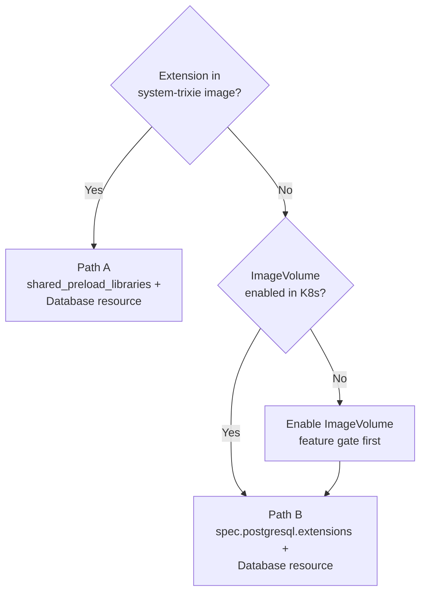
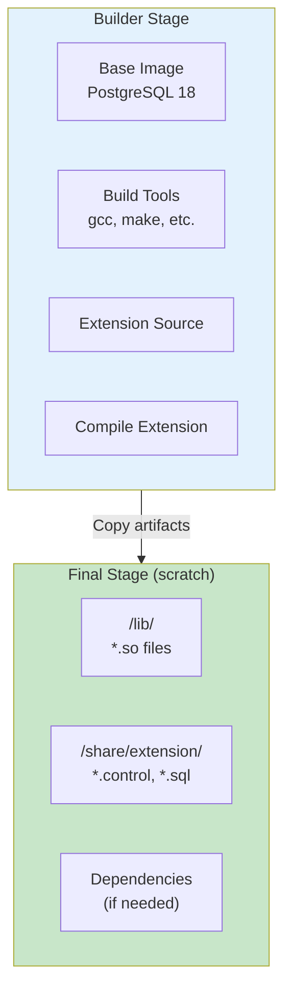
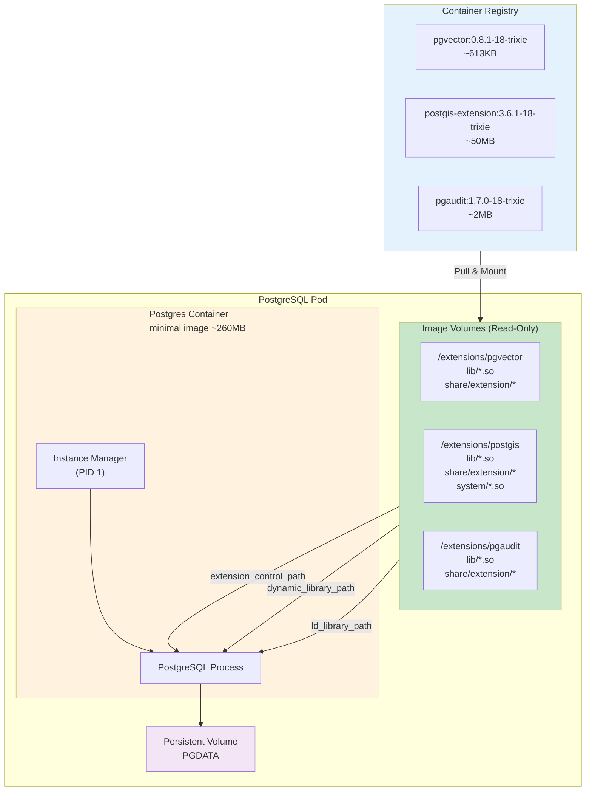

# PostgreSQL Extensions Management Guide

## Table of Contents

1. [Extension Delivery Models (CNPG)](#extension-delivery-models-cnpg) - Path A (operand built-in) vs Path B (Image Volume)
2. [Current State](#current-state)
3. [Problem Statement](#problem-statement)
4. [Solutions](#solutions)
   - [CloudNativePG Operator](#cloudnativepg-operator)
     - [Image Volume Extensions](#solution-1-image-volume-extensions-postgresql-18-recommended)
     - [Building Extension Container Images](#building-extension-container-images)
   - [Zalando Operator](#zalando-operator)
5. [Additional Information](#additional-information)

---

## Extension Delivery Models (CNPG)

CloudNativePG provides two ways to make extensions available in a PostgreSQL cluster. Understanding which model applies avoids confusion when reading upstream docs or planning new extensions.

### Path A — Built into the operand image (current homelab approach)

The `cnpg-db` cluster runs `ghcr.io/cloudnative-pg/postgresql:18.1-system-trixie`, which bundles 50+ extensions (pgaudit, pg_stat_statements, pgcrypto, etc.). Extensions are activated through:

1. `shared_preload_libraries` in the Cluster spec — loads libraries at startup.
2. `Database` resource with `extensions:` — declaratively runs `CREATE EXTENSION`.

This is all that's needed when the required extension **already ships with the operand image**. No Kubernetes ImageVolume support is required.

- Cluster manifest: [`kubernetes/infra/configs/databases/clusters/cnpg-db/instance.yaml`](../../kubernetes/infra/configs/databases/clusters/cnpg-db/instance.yaml)
- Extension declarations: [`kubernetes/infra/configs/databases/clusters/cnpg-db/extensions.yaml`](../../kubernetes/infra/configs/databases/clusters/cnpg-db/extensions.yaml)

### Path B — Image Volume Extensions (pluggable OCI images)

For extensions **not included** in the operand image (e.g., pgvector, PostGIS), or when using a `minimal` image to reduce attack surface, CNPG can mount extension binaries from a **separate OCI container image** at pod startup via `spec.postgresql.extensions`.

This model requires:

- **PostgreSQL 18+** (for `extension_control_path` GUC).
- **Kubernetes 1.33+** with `ImageVolume` feature gate enabled (default-on from 1.35+).
- **containerd 2.1.0+** or **CRI-O 1.31+**.
- **CNPG ≥ 1.27** (catalog support from 1.29+).

Each extension is mounted at `/extensions/<name>/` and CNPG auto-configures `extension_control_path` and `dynamic_library_path`. The `Database` resource then activates extensions declaratively, same as Path A.

For implementation details, see [Image Volume Extensions (Solution 1)](#solution-1-image-volume-extensions-postgresql-18-recommended) below.

### Comparison

| Aspect | Path A (operand built-in) | Path B (Image Volume) |
|--------|--------------------------|----------------------|
| **When to use** | Extension ships with `system-*` image | Extension not in operand, or using `minimal` image |
| **Image** | `system-trixie` (fat, 50+ extensions) | `minimal-*` + per-extension OCI images |
| **K8s requirement** | None (standard volumes) | ImageVolume feature gate (K8s 1.33+) |
| **Supply chain** | Extensions coupled to operand image | Extensions versioned and shipped independently |
| **Rolling update** | Only when changing operand image | Triggered when adding/removing extension images |
| **Catalog support** | N/A | `ClusterImageCatalog` (CNPG 1.29+) |
| **Homelab status** | **Active** — used by `cnpg-db` | **Ready** — infra compatible; not yet deployed |



### Upstream references

- [Image Volume Extensions (CNPG docs — devel)](https://cloudnative-pg.io/docs/devel/imagevolume_extensions/) — check the stable docs matching your operator version for production guidance.
- [postgres-extensions-containers](https://github.com/cloudnative-pg/postgres-extensions-containers) — official OCI extension images (pgvector, PostGIS, pgaudit, pg_crash) and `ClusterImageCatalog` artifacts.
- Operator version deployed in this repo: see [`kubernetes/infra/controllers/databases/cloudnativepg-operator.yaml`](../../kubernetes/infra/controllers/databases/cloudnativepg-operator.yaml) (Helm chart constraint). Verify the running controller version with `kubectl get deployment -n cloudnative-pg -o wide`.

---

## Current State

### Operators and Versions

| Operator | Version | PostgreSQL Version | Clusters |
|----------|---------|-------------------|----------|
| **CloudNativePG** | v1.28.1 | 18.1 (default) | `cnpg-db` (product, cart, order), `cnpg-db-replica` (DR) |
| **Zalando Postgres Operator** | v1.15.1 | 16/17 | `auth-db`, `supporting-shared-db` |

### Current Extensions Usage

#### CloudNativePG Clusters

The consolidated `cnpg-db` cluster uses the **`system-trixie`** image (`ghcr.io/cloudnative-pg/postgresql:18.1-system-trixie`) which includes 50+ extensions pre-packaged (pgaudit, pg_stat_statements, pgcrypto, etc.). No ImageVolume is needed for current extensions.

- **`cnpg-db`** (PostgreSQL 18, hosts product/cart/order):
  - Image: `system-trixie` (extensions built-in)
  - `shared_preload_libraries`: pgaudit, pg_stat_statements, auto_explain
  - Database resource: pgaudit, pg_stat_statements, auto_explain, pgcrypto, uuid-ossp
  - See [`kubernetes/infra/configs/databases/clusters/cnpg-db/extensions.yaml`](../../kubernetes/infra/configs/databases/clusters/cnpg-db/extensions.yaml)

#### Zalando Operator Clusters

- **`auth-db`** (PostgreSQL 17): 
  - `shared_preload_libraries: "pg_stat_statements,pg_cron,pg_trgm,pgcrypto,pg_stat_kcache"`
- **`supporting-shared-db`** (PostgreSQL 16):
  - `shared_preload_libraries: "pg_stat_statements,pg_cron,pg_trgm,pgcrypto,pg_stat_kcache"`

### Compatibility Check

| Requirement | Status | Version |
|------------|--------|---------|
| **Kubernetes** | ✅ Compatible | v1.33.7 (Required: 1.33+) |
| **Container Runtime** | ✅ Compatible | containerd 2.2.0 (Required: 2.1.0+) |
| **PostgreSQL (CloudNativePG)** | ✅ Compatible | 18.1 (Required: 18+) |
| **ImageVolume Feature Gate** | ⚠️ Needs Configuration | Beta, disabled by default |

**Note**: ImageVolume feature gate is in beta in Kubernetes 1.33 but disabled by default. The local Kind cluster config used by `make cluster-up` has been updated to enable it. Recreate the cluster to apply changes.

---

## Important: How shared_preload_libraries Works in CloudNativePG

### The `parameters` Field vs the Dedicated Field

In CloudNativePG 1.28, `shared_preload_libraries` is a **fixed parameter** and **cannot** be set via `spec.postgresql.parameters`. Attempting to do so results in:

```
Cluster.postgresql.cnpg.io "cnpg-db" is invalid: 
spec.postgresql.parameters.shared_preload_libraries: Invalid value: "pg_stat_statements": 
Can't set fixed configuration parameter
```

**However**, CloudNativePG provides a **dedicated field** for this purpose:

```yaml
spec:
  postgresql:
    # ✅ CORRECT: Use the dedicated YAML list field
    shared_preload_libraries:
      - pgaudit
      - pg_stat_statements
      - auto_explain

    parameters:
      # ❌ WRONG: Cannot set here (fixed parameter)
      # shared_preload_libraries: "pgaudit,pg_stat_statements"
      pgaudit.log: "ddl, write"
```

### Why Two Approaches Exist

CloudNativePG manages `shared_preload_libraries` specially because:

1. It controls library loading order and merges user-specified libraries with any libraries needed by ImageVolume extensions
2. The dedicated field accepts a YAML list (cleaner than comma-separated string)
3. When using ImageVolume extensions, CNPG auto-appends mounted extension libraries

### Current Setup

The consolidated `cnpg-db` cluster uses the **dedicated `shared_preload_libraries` field** successfully:

- **`cnpg-db`**: pgaudit, pg_stat_statements, auto_explain

This means **all extensions work correctly**, including `pg_stat_statements`.

---

## Solutions

### CloudNativePG Operator

#### Solution 1: Image Volume Extensions (PostgreSQL 18+) ⭐ **Recommended** {#solution-1-image-volume-extensions-postgresql-18-recommended}

CloudNativePG supports the dynamic loading of PostgreSQL extensions into a Cluster at Pod startup using the Kubernetes `ImageVolume` feature and the `extension_control_path` GUC introduced in PostgreSQL 18.

**Benefits**:
- Decouples extension distribution from PostgreSQL images
- Use official minimal PostgreSQL images
- Dynamically add extensions without rebuilding images
- Reduce operational surface with immutable, minimal base images

**Requirements**:
- PostgreSQL 18 or later ✅ (default in CloudNativePG 1.28)
- Kubernetes 1.33+ with `ImageVolume` feature gate enabled ✅
- Container runtime: containerd v2.1.0+ or CRI-O v1.31+ ✅
- Extension container images matching PostgreSQL version, OS, and CPU architecture

**How It Works**:

Extension images are defined in `.spec.postgresql.extensions` stanza. Each image volume is mounted at `/extensions/<EXTENSION_NAME>`. CloudNativePG automatically manages:
- `extension_control_path` → `/extensions/<EXTENSION_NAME>/share`
- `dynamic_library_path` → `/extensions/<EXTENSION_NAME>/lib`

**Basic Configuration**:

```yaml
apiVersion: postgresql.cnpg.io/v1
kind: Cluster
metadata:
  name: cnpg-db
spec:
  postgresql:
    extensions:
      - name: pgvector
        image:
          reference: ghcr.io/cloudnative-pg/pgvector:0.8.1-18-trixie
      - name: postgis
        image:
          reference: ghcr.io/cloudnative-pg/postgis-extension:3.6.1-18-trixie
        ld_library_path:
          - system
```

**Format Details**:
- `name`: Extension name (mandatory, unique, determines mount path)
- `image.reference`: Full OCI image reference (registry/path:tag)
- `ld_library_path` (optional): List of relative paths for system libraries

**Available Extension Images**:

Official extension images at `ghcr.io/cloudnative-pg/`:

| Extension | Image Format | Example | Use Case |
|-----------|--------------|---------|----------|
| **pgvector** | `pgvector:<version>-<pg-version>-<distro>` | `ghcr.io/cloudnative-pg/pgvector:0.8.1-18-trixie` | Vector similarity search for AI/ML |
| **PostGIS** | `postgis-extension:<version>-<pg-version>-<distro>` | `ghcr.io/cloudnative-pg/postgis-extension:3.6.1-18-trixie` | Geospatial data support |
| **pgAudit** | `pgaudit:<version>-<pg-version>-<distro>` | `ghcr.io/cloudnative-pg/pgaudit:1.7.0-18-trixie` | Audit logging (**only required if audit logging is needed**) |

**Note**: `pg_stat_statements` is a PostgreSQL `contrib` module included in both `system` and `minimal` images. It does NOT need an ImageVolume image. Configure it via `spec.postgresql.shared_preload_libraries` and `Database` resource extensions.

**Advanced Configuration**:

**Custom Paths**:
```yaml
spec:
  postgresql:
    extensions:
      - name: my-extension
        extension_control_path:
          - my/share/path
        dynamic_library_path:
          - my/lib/path
        image:
          reference: ghcr.io/example/my-extension:1.0.0-18-trixie
```

**Multi-extension Images**:
```yaml
spec:
  postgresql:
    extensions:
      - name: geospatial
        extension_control_path:
          - postgis/share
          - pgrouting/share
        dynamic_library_path:
          - postgis/lib
          - pgrouting/lib
        image:
          reference: ghcr.io/example/geospatial:1.0.0-18-trixie
```

**System Libraries** (e.g., PostGIS):
```yaml
spec:
  postgresql:
    extensions:
      - name: postgis
        ld_library_path:
          - system
        image:
          reference: ghcr.io/cloudnative-pg/postgis-extension:3.6.1-18-trixie
```

**Note**: Changing `ld_library_path` requires manual cluster restart (`cnpg restart`).

**shared_preload_libraries with ImageVolume**:

If an ImageVolume extension requires preloading, use the **dedicated `shared_preload_libraries` field** (not `parameters`):

```yaml
spec:
  postgresql:
    extensions:
      - name: pgaudit
        image:
          reference: ghcr.io/cloudnative-pg/pgaudit:1.7.0-18-trixie
    # Use the dedicated field, NOT spec.postgresql.parameters
    shared_preload_libraries:
      - pgaudit
    parameters:
      # Configure pgAudit logging behavior
      pgaudit.log: "all"  # Options: none, all, ddl, function, misc, read, write
      pgaudit.log_catalog: "off"  # Don't log system catalog queries
      pgaudit.log_parameter: "on"  # Log query parameters
      pgaudit.log_statement_once: "off"  # Log each statement
```

**⚠️ Important**: Avoid making changes to extension images and `shared_preload_libraries` simultaneously. First allow pods to roll out with the new extension image, then update PostgreSQL configuration.

#### Building Extension Container Images

Extension images can be built using a **multi-stage Dockerfile** pattern. This approach creates lightweight, minimal images containing only the extension binaries and required files.

**Image Layer Structure**:



**Standard Dockerfile Pattern**:

```dockerfile
# Multi-stage build for PostgreSQL extension image
FROM ghcr.io/cloudnative-pg/postgresql:18-minimal-trixie AS builder

USER 0

# Copy extension source code
COPY . /tmp/my-extension

# Install build dependencies and compile extension
RUN set -eux; \
    mkdir -p /opt/extension && \
    apt-get update && \
    apt-get install -y --no-install-recommends \
        build-essential \
        postgresql-server-dev-18 && \
    cd /tmp/my-extension && \
    make clean && \
    make OPTFLAGS="" && \
    make install \
        datadir=/opt/extension/share/ \
        pkglibdir=/opt/extension/lib/

# Final stage: minimal image with only extension files
FROM scratch

# Copy compiled libraries (.so files)
COPY --from=builder /opt/extension/lib/* /lib/

# Copy extension control files and SQL scripts
COPY --from=builder /opt/extension/share/extension/* /share/extension/
```

**Key Points**:
- **Builder stage**: Uses PostgreSQL base image with build tools to compile extension
- **Final stage**: Uses `scratch` (empty image) for minimal size
- **Output structure**: 
  - `/lib/` contains shared libraries (`.so` files)
  - `/share/extension/` contains control files (`.control`) and SQL scripts (`.sql`)

**Example: pgvector Extension**:

```dockerfile
FROM ghcr.io/cloudnative-pg/postgresql:18-minimal-trixie AS builder

USER 0

COPY . /tmp/pgvector

RUN set -eux; \
    mkdir -p /opt/extension && \
    apt-get update && \
    apt-get install -y --no-install-recommends \
        build-essential \
        clang-16 \
        llvm-16-dev && \
    cd /tmp/pgvector && \
    make clean && \
    make OPTFLAGS="" && \
    make install \
        datadir=/opt/extension/share/ \
        pkglibdir=/opt/extension/lib/

FROM scratch

COPY --from=builder /opt/extension/lib/* /lib/
COPY --from=builder /opt/extension/share/extension/* /share/extension/
```

**Example: PostGIS Extension** (with system dependencies):

PostGIS requires additional system libraries (GEOS, PROJ, GDAL, etc.). These must be included in the extension image:

```dockerfile
FROM ghcr.io/cloudnative-pg/postgresql:18-minimal-trixie AS builder

USER 0

COPY . /tmp/postgis

RUN set -eux; \
    mkdir -p /opt/extension && \
    apt-get update && \
    apt-get install -y --no-install-recommends \
        build-essential \
        postgresql-server-dev-18 \
        libgeos-dev \
        libproj-dev \
        libgdal-dev && \
    cd /tmp/postgis && \
    ./configure && \
    make && \
    make install \
        datadir=/opt/extension/share/ \
        pkglibdir=/opt/extension/lib/

FROM scratch

# Copy extension libraries
COPY --from=builder /opt/extension/lib/* /lib/

# Copy extension control files and SQL
COPY --from=builder /opt/extension/share/extension/* /share/extension/

# Copy system libraries required by PostGIS
COPY --from=builder /usr/lib/x86_64-linux-gnu/libgeos* /system/
COPY --from=builder /usr/lib/x86_64-linux-gnu/libproj* /system/
COPY --from=builder /usr/lib/x86_64-linux-gnu/libgdal* /system/
```

**Then configure `ld_library_path` in Cluster resource**:

```yaml
spec:
  postgresql:
    extensions:
      - name: postgis
        image:
          reference: ghcr.io/example/postgis-extension:3.6.1-18-trixie
        ld_library_path:
          - system  # Points to /extensions/postgis/system
```

**Building and Publishing**:

```bash
# Build extension image
docker build -t ghcr.io/your-org/pgvector:0.8.1-18-trixie .

# Tag for registry
docker tag ghcr.io/your-org/pgvector:0.8.1-18-trixie \
    ghcr.io/your-org/pgvector:0.8.1-18-trixie

# Push to registry
docker push ghcr.io/your-org/pgvector:0.8.1-18-trixie
```

**Best Practices for Extension Images**:
- ✅ Use multi-stage builds to minimize image size
- ✅ Final stage should use `scratch` or minimal base
- ✅ Match PostgreSQL version and OS distribution of cluster
- ✅ Include only necessary files (`lib/` and `share/extension/`)
- ✅ For extensions with dependencies, copy system libraries to `/system/` directory
- ✅ Use `ld_library_path` configuration for system libraries
- ✅ Tag images with extension version, PostgreSQL version, and OS distro
- ✅ Publish to OCI-compliant registry (GHCR, Docker Hub, etc.)

**Benefits of This Approach**:
- **Minimal size**: Extension images are typically < 10MB (vs. full PostgreSQL images ~260MB+)
- **Independent lifecycle**: Extensions can be updated without rebuilding PostgreSQL
- **Security**: Smaller attack surface, easier to audit
- **CI/CD friendly**: Can be built automatically from extension source code
- **Standardized**: Same pattern works for all extensions

**Extension Image Architecture**:

The following diagram shows how extension images integrate with PostgreSQL pods:



**Key Architecture Points**:
- Extension images are **pulled from registry** and mounted as **read-only volumes**
- Each extension gets its own mount point: `/extensions/<extension-name>`
- PostgreSQL discovers extensions via `extension_control_path` and `dynamic_library_path`
- System libraries (for complex extensions) are accessed via `ld_library_path`
- **No modification** of PostgreSQL container image required
- Extensions are **immutable** and **versioned** independently

**pgAudit Configuration Example**:

pgAudit provides detailed session and object audit logging. It's **only required if audit logging is needed** for compliance, security, or troubleshooting.

**Complete pgAudit Setup** (Current Implementation):

**Step 1: Configure shared_preload_libraries in Cluster Resource**:

```yaml
# kubernetes/infra/configs/databases/clusters/cnpg-db/instance.yaml
apiVersion: postgresql.cnpg.io/v1
kind: Cluster
metadata:
  name: cnpg-db
  namespace: product
spec:
  imageName: ghcr.io/cloudnative-pg/postgresql:18.1-system-trixie  # pgaudit built-in
  postgresql:
    # Use the dedicated field (NOT spec.postgresql.parameters)
    shared_preload_libraries:
      - pgaudit
      - pg_stat_statements
      - auto_explain
    parameters:
      # pgAudit configuration (these go in parameters, NOT shared_preload_libraries)
      pgaudit.log: "all"  # Log all statements (ddl, read, write, function, misc)
      pgaudit.log_catalog: "off"  # Don't log system catalog queries (reduces noise)
      pgaudit.log_parameter: "on"  # Include query parameters in logs
      pgaudit.log_statement_once: "off"  # Log each statement (not just once per session)
      pgaudit.log_relation: "on"  # Log relation (table) access
      pgaudit.log_rows: "on"  # Log number of rows affected
```

**Step 2: Create Database Resources for Declarative Extension Management** (Recommended):

```yaml
# kubernetes/infra/configs/databases/clusters/cnpg-db/extensions.yaml
apiVersion: postgresql.cnpg.io/v1
kind: Database
metadata:
  name: product-database
  namespace: product
spec:
  name: product
  owner: product
  cluster:
    name: cnpg-db
  extensions:
    - name: pgaudit
    - name: pg_stat_statements
    - name: auto_explain
    - name: pgcrypto
    - name: uuid-ossp
```

**Benefits of Database Resource Approach**:
- ✅ **Declarative**: CloudNativePG automatically runs `CREATE EXTENSION` commands
- ✅ **Version Control**: Specify version to enable upgrades
- ✅ **Consistent**: Ensures desired state is maintained
- ✅ **No Manual SQL**: No need to connect and run SQL manually

**pgAudit Log Output**:

CloudNativePG outputs pgAudit logs in JSON format to standard output, which integrates with Kubernetes logging infrastructure (e.g., Vector, Loki).

**pgAudit Log Levels**:
- `none`: No logging
- `all`: Log all statements (DDL, DML, SELECT, function calls, etc.)
- `ddl`: Data Definition Language (CREATE, ALTER, DROP, etc.)
- `read`: SELECT statements
- `write`: INSERT, UPDATE, DELETE, TRUNCATE
- `function`: Function calls
- `misc`: Other statements (SET, SHOW, etc.)

**When to Use pgAudit**:
- Compliance requirements (PCI-DSS, HIPAA, SOC 2, etc.)
- Security auditing and forensics
- Troubleshooting data access issues
- Monitoring sensitive data access patterns

**Creating Extensions in Database**:

**⭐ Recommended: Using Database Resource** (declarative management):

This is the **preferred approach** and is used in this project. CloudNativePG automatically reconciles Database resources and executes `CREATE EXTENSION` commands.

**Current Implementation Examples**:

**Product Database** (`kubernetes/infra/configs/databases/clusters/product-db/extensions.yaml`):
```yaml
apiVersion: postgresql.cnpg.io/v1
kind: Database
metadata:
  name: product-database
  namespace: product
spec:
  name: product
  owner: product
  cluster:
    name: product-db
  extensions:
    # Extensions that require shared_preload_libraries (configured in instance.yaml)
    - name: pgaudit
    - name: pg_stat_statements
    - name: auto_explain
    # Extensions that only need CREATE EXTENSION
    - name: pgcrypto
    - name: uuid-ossp
```

**cnpg-db extensions** (`kubernetes/infra/configs/databases/clusters/cnpg-db/extensions.yaml`):

> **Note**: `product-db` and `transaction-shared-db` were consolidated into `cnpg-db`. All databases (product, cart, order) now share extensions via a single cluster resource.

```yaml
apiVersion: postgresql.cnpg.io/v1
kind: Database
metadata:
  name: product-database
  namespace: product
spec:
  name: product
  owner: product
  cluster:
    name: cnpg-db
  extensions:
    - name: pgaudit
    - name: pg_stat_statements
    - name: auto_explain
    - name: pgcrypto
    - name: uuid-ossp
```

**Benefits**:
- ✅ **Declarative**: CloudNativePG automatically runs `CREATE EXTENSION` commands
- ✅ **Version pinning**: Optionally specify `version` field to pin extension versions
- ✅ **Consistent**: Ensures desired state is maintained across cluster restarts
- ✅ **No Manual SQL**: Fully declarative, no need to connect and run SQL
- ✅ **Multiple Databases**: Each database can have its own Database resource

**Note**: Omitting `version` lets CloudNativePG use the default version matching the image. Only pin versions when you need a specific version or are managing upgrades.

**Alternative: Using postInitSQL** (during cluster initialization only):

```yaml
bootstrap:
  initdb:
    postInitSQL:
      - CREATE EXTENSION IF NOT EXISTS pgaudit;
```

**Note**: postInitSQL only runs during cluster initialization. For existing clusters or multiple databases, use Database resources instead. This project uses Database resources for all extension management.

**Caveats**:
- Adding/removing/updating extension images triggers PostgreSQL pod restarts
- Test thoroughly in staging before production
- Verify extension image contains required upgrade path
- Update `version` field in Database resource when updating extensions

**pg_stat_statements Note**:

`pg_stat_statements` is a PostgreSQL **contrib module** included in both `system` and `minimal` CNPG images. It does NOT need an ImageVolume image.

**How to enable:**
1. Add to `spec.postgresql.shared_preload_libraries` (the dedicated YAML list field)
2. Add to `Database` resource `extensions` list

**Current status**: ✅ Enabled in `cnpg-db` via `shared_preload_libraries` + Database resource.

#### Solution 2: Declarative Database Resource

Use the `Database` CRD to manage extensions declaratively at the database level. CloudNativePG automatically runs `CREATE EXTENSION` SQL commands.

**Note**: For extensions using ImageVolume, they must be defined in the Cluster's `postgresql.extensions` stanza first. For extensions in the `system` image, they are already available and only need the Database resource.

#### Solution 3: Custom PostgreSQL Image

Build a custom PostgreSQL image with extensions pre-installed. **Not recommended** for GitOps workflow due to:
- Requires maintaining custom images
- Extensions tightly coupled to PostgreSQL version
- Not ideal for GitOps

---

### Zalando Operator

#### shared_preload_libraries Configuration

Zalando Postgres Operator (v1.15.1) **allows** setting `shared_preload_libraries` directly in `spec.postgresql.parameters`.

**Current Implementation**:

All Zalando clusters use the same extension set:

```yaml
apiVersion: acid.zalan.do/v1
kind: postgresql
metadata:
  name: auth-db  # or supporting-shared-db
spec:
  postgresql:
    version: "16"  # or "17" for auth-db
    parameters:
      shared_preload_libraries: "pg_stat_statements,pg_cron,pg_trgm,pgcrypto,pg_stat_kcache"
      track_io_timing: "on"
      pg_stat_statements.max: "1000"
      pg_stat_statements.track: "all"
      cron.database_name: "postgres"
```

**Extensions Used**:
- **pg_stat_statements**: Query performance monitoring
- **pg_cron**: Job scheduling
- **pg_trgm**: Trigram matching for text search
- **pgcrypto**: Cryptographic functions
- **pg_stat_kcache**: Kernel-level cache statistics

**Adding pgAudit to Zalando Clusters**:

pgAudit can be added to Zalando clusters for audit logging (only required if audit logging is needed):

```yaml
apiVersion: acid.zalan.do/v1
kind: postgresql
metadata:
  name: auth-db  # or supporting-shared-db
spec:
  postgresql:
    version: "17"  # or "16"
    parameters:
      # Add pgaudit to shared_preload_libraries
      shared_preload_libraries: "pg_stat_statements,pg_cron,pg_trgm,pgcrypto,pg_stat_kcache,pgaudit"
      # pgAudit configuration
      pgaudit.log: "all"  # Log all statements
      pgaudit.log_catalog: "off"  # Don't log system catalog queries
      pgaudit.log_parameter: "on"  # Include query parameters
      pgaudit.log_statement_once: "off"  # Log each statement
      # Other existing parameters
      track_io_timing: "on"
      pg_stat_statements.max: "1000"
      pg_stat_statements.track: "all"
      cron.database_name: "postgres"
```

**After Configuration**:
1. Restart PostgreSQL cluster (Zalando operator will handle this)
2. Create extension in target databases:
   ```sql
   CREATE EXTENSION IF NOT EXISTS pgaudit;
   ```

**pgAudit Log Output**:
pgAudit logs are written to PostgreSQL log files, which are collected by sidecars (e.g., Vector) and forwarded to log aggregation systems (e.g., Loki).

**Best Practices**:
- Set `shared_preload_libraries` during cluster creation
- Configure extension-specific parameters (e.g., `pg_stat_statements.max`)
- Create extensions in databases using Database resources (CloudNativePG) or `postInitSQL`/manual `CREATE EXTENSION` (Zalando)

**Example: Creating Extensions**:

```yaml
# Via postInitSQL in Zalando operator
spec:
  postgresql:
    version: "16"
    parameters:
      shared_preload_libraries: "pg_stat_statements,pg_cron"
  databases:
    mydb: myuser
  users:
    myuser:
      - createdb
  # Extensions are created manually or via init scripts
```

---

## Additional Information

### ImageVolume Feature Gate Setup

**Status**: Beta in Kubernetes 1.33, **disabled by default**

**Current Setup**:
- Kind cluster config (used by `make cluster-up`) has been updated to enable ImageVolume feature gate
- Feature gate enabled via:
  - Cluster-level: `featureGates.ImageVolume: true`
  - Node-level: `kubeletExtraArgs.feature-gates: "ImageVolume=true"`

**To Apply Changes**:
```bash
# Recreate Kind cluster với ImageVolume enabled
make clean-all  # Clean existing cluster
make cluster-up # Create new cluster với updated config
```

**Verify Feature Gate**:
```bash
# Check Kubernetes version
kubectl get nodes -o jsonpath='{.items[0].status.nodeInfo.kubeletVersion}'
# Should show v1.33.7

# Check container runtime
kubectl get nodes -o jsonpath='{.items[0].status.nodeInfo.containerRuntimeVersion}'
# Should show containerd://2.2.0
```

### Compatibility Requirements Summary

| Component | Required | Current | Status |
|-----------|----------|---------|--------|
| Kubernetes | 1.33+ | v1.33.7 | ✅ |
| Container Runtime | containerd 2.1.0+ or CRI-O 1.31+ | containerd 2.2.0 | ✅ |
| PostgreSQL (CloudNativePG) | 18+ | 18.1 | ✅ |
| ImageVolume Feature Gate | Enabled | Needs cluster recreation | ⚠️ |

### Troubleshooting

#### Extension Not Mounting

**Symptoms**: Pod doesn't start or extension not available

**Checks**:
```bash
# Check pod events
kubectl describe pod <pod-name> -n <namespace>

# Check extension image exists
docker pull ghcr.io/cloudnative-pg/pgvector:0.8.1-18-trixie

# Check Kubernetes version
kubectl get nodes -o jsonpath='{.items[0].status.nodeInfo.kubeletVersion}'
```

**Solutions**:
- Verify Kubernetes 1.33+ with ImageVolume feature gate enabled
- Check extension image tag matches PostgreSQL version and OS distro
- Verify container runtime supports ImageVolume

#### Extension Cannot Be Created

**Symptoms**: `CREATE EXTENSION` fails

**Checks**:
```bash
# Check extension is available
kubectl exec -it <pod-name> -n <namespace> -- psql -U <user> -d <db> -c "\dx"

# Check extension control files
kubectl exec -it <pod-name> -n <namespace> -- ls -la /extensions/<extension-name>/share/extension/
```

**Solutions**:
- Verify extension image mounted correctly
- Check extension name matches image name
- Verify PostgreSQL version compatibility

### Recommendations

#### For CloudNativePG Clusters

**`cnpg-db`** (consolidated: product, cart, order):
- **Image**: `system-trixie` (all extensions built-in)
- **`shared_preload_libraries`**: pgaudit, pg_stat_statements, auto_explain
- **Database resource**: pgaudit, pg_stat_statements, auto_explain, pgcrypto, uuid-ossp
- **Status**: ✅ Fully configured

**`pgAudit`** (Audit Logging) - ✅ **Currently Implemented**:
- **Status**: Configured in `cnpg-db` via `system` image + `shared_preload_libraries` field + Database resources
- **Use Cases**: Compliance (PCI-DSS, HIPAA, SOC 2), security auditing, data access monitoring, troubleshooting
- **Configuration**: 
  - `system-trixie` image has pgaudit binary built-in (no ImageVolume needed)
  - `shared_preload_libraries` loads it at startup
  - Database resources run `CREATE EXTENSION` declaratively
  - Logs output: JSON format to stdout, collected by Vector sidecar → Loki
- **Considerations**: 
  - Increases log volume significantly
  - May impact performance (especially with `pgaudit.log: "all"`)
  - Requires careful log management and retention policies
  - Currently configured with `pgaudit.log_catalog: "off"` to reduce noise

#### For Zalando Clusters

**Current Setup**: All clusters use the same extension set, which is appropriate for production monitoring and functionality.

**Best Practices**:
- Keep extension set consistent across clusters
- Monitor extension usage and performance impact
- Update extension versions carefully (test in staging first)
- Use Database resources for declarative extension management (CloudNativePG)

### Current Implementation Structure

**File Organization**:

```
kubernetes/infra/configs/databases/clusters/
└── cnpg-db/
    ├── instance.yaml          # Cluster resource (system-trixie, shared_preload_libraries)
    ├── extensions.yaml        # Database resource (pgaudit, pg_stat_statements, pgcrypto, etc.)
    ├── secrets/               # DB credentials (product, cart, order)
    ├── poolers/               # PgDog HelmRelease
    ├── monitoring/            # PodMonitor
    ├── backup/                # Barman Object Store schedules
    └── kustomization.yaml     # Includes all above in order
```

**Deployment Order** (enforced by Kustomization):
1. Secrets (database credentials)
2. Cluster instance (with `shared_preload_libraries`)
3. Database resources (declarative `CREATE EXTENSION`)
4. Poolers and monitoring

### Verification

**Check Extensions**:
```sql
-- List installed extensions
SELECT * FROM pg_extension;

-- Check extension versions
SELECT extname, extversion FROM pg_extension;

-- For pgAudit: Check if extension is installed
SELECT * FROM pg_extension WHERE extname = 'pgaudit';

-- Verify pgAudit configuration
SHOW shared_preload_libraries;  -- Should include 'pgaudit'
SHOW pgaudit.log;  -- Should show current log level (should be 'all')
```

**Check shared_preload_libraries**:
```bash
# Verify libraries are loaded
kubectl exec -it <pod-name> -n <namespace> -c postgres -- \
  psql -U postgres -c "SHOW shared_preload_libraries;"
# cnpg-db should show: pgaudit,pg_stat_statements,auto_explain
```

**Check Extension Images Mounted** (only if using ImageVolume):
```bash
# Verify extension image is mounted in pod
kubectl exec -it <pod-name> -n <namespace> -c postgres -- ls -la /extensions/
# Only exists when using ImageVolume (minimal image + postgresql.extensions)
```

**View pgAudit Logs**:
```bash
# View logs directly from pod
kubectl logs <pod-name> -n <namespace> -c postgres | grep pgaudit

# Or view in Loki/Grafana if logs are collected by Vector sidecar
# Logs are in JSON format and include audit information
```

**Verify Database Resources**:
```bash
# Check Database resources status
kubectl get database -n product
kubectl get database -n cart

# Check Database resource details
kubectl describe database product-database -n product
kubectl describe database cart-database -n cart
kubectl describe database order-database -n cart
```

---

## References

- [CloudNativePG Image Volume Extensions](https://cloudnative-pg.io/docs/1.28/imagevolume_extensions/)
- [CloudNativePG PostgreSQL Configuration](https://cloudnative-pg.io/docs/1.28/postgresql_conf/)
- [CloudNativePG Declarative Database Management](https://cloudnative-pg.io/docs/1.28/declarative_database_management/)
- [PostgreSQL Extensions Containers](https://github.com/cloudnative-pg/postgres-extensions-containers)
- [Kubernetes 1.33 Image Volumes Beta](https://kubernetes.io/blog/2025/04/29/kubernetes-v1-33-image-volume-beta/)
- [Kind Feature Gates Configuration](https://kind.sigs.k8s.io/docs/user/configuration/#feature-gates)
- [CNPG Recipe 23 - Managing extensions with ImageVolume](https://www.gabrielebartolini.it/articles/2025/12/cnpg-recipe-23-managing-extensions-with-imagevolume-in-cloudnativepg/) - Practical guide with examples
- [The Immutable Future of PostgreSQL Extensions](https://www.gabrielebartolini.it/articles/2025/03/the-immutable-future-of-postgresql-extensions-in-kubernetes-with-cloudnativepg/) - Architecture and design principles
- [Mini Summit 5: Improving PostgreSQL Extensions Experience](https://justatheory.com/2025/05/mini-summit-cnpg/) - Transcript with Dockerfile examples and architecture discussion

---

## Summary

### Extension Approaches

| Approach | Operator | Image | When to use | Complexity |
|----------|----------|-------|-------------|------------|
| `system` image + `shared_preload_libraries` + Database resource | CloudNativePG | `system-trixie` | Common extensions (pgaudit, pg_stat_statements, pgcrypto) | Low |
| `minimal` image + ImageVolume + Database resource | CloudNativePG | `minimal-trixie` | Minimal images, independent extension lifecycle (CNPG 1.27+, K8s 1.33+) | Medium |
| Custom Dockerfile | Both | Custom | Extensions not in PGDG packages | High |
| `shared_preload_libraries` in `parameters` | Zalando | Spilo | Standard approach for Zalando operator | Low |

### Current Implementation

| Cluster | Operator | Image | Preloaded | Database Resource Extensions |
|---------|----------|-------|-----------|------------------------------|
| `cnpg-db` | CloudNativePG | `system-trixie` | pgaudit, pg_stat_statements, auto_explain | pgaudit, pg_stat_statements, auto_explain, pgcrypto, uuid-ossp |
| `auth-db` | Zalando | Spilo 17 | pg_stat_statements, pg_cron, pg_trgm, pgcrypto, pg_stat_kcache | N/A |
| `supporting-shared-db` | Zalando | Spilo 16 | pg_stat_statements, pg_cron, pg_trgm, pgcrypto, pg_stat_kcache | N/A |

**Key points:**
- CloudNativePG clusters use `system-trixie` image with built-in extensions (no ImageVolume needed currently)
- `shared_preload_libraries` is configured via the **dedicated YAML list field**, not `parameters`
- Database resources declaratively manage `CREATE EXTENSION` commands
- ImageVolume is available for future use when switching to `minimal` images
- Zalando clusters use `shared_preload_libraries` in `spec.postgresql.parameters` as normal
