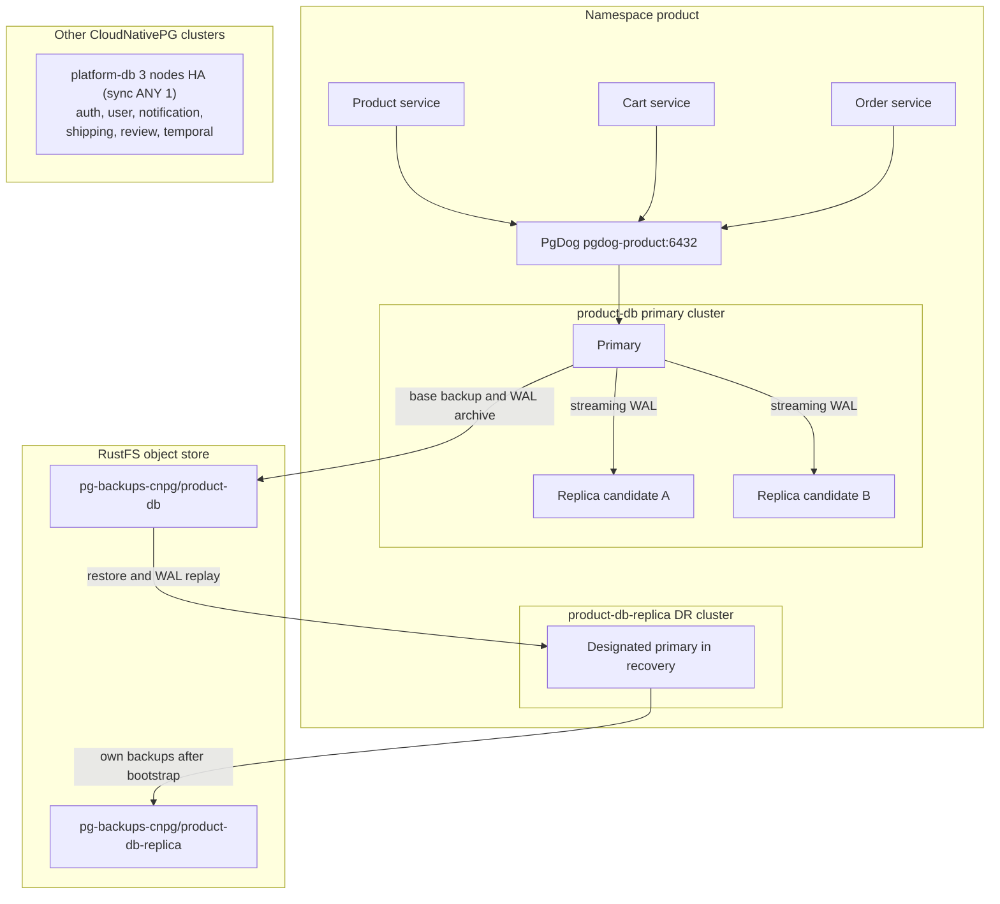
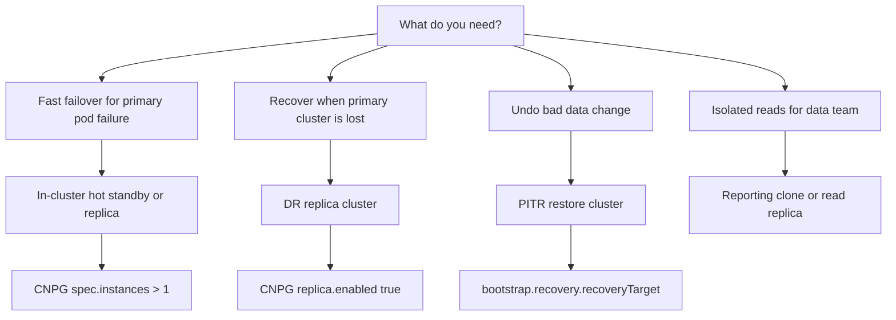
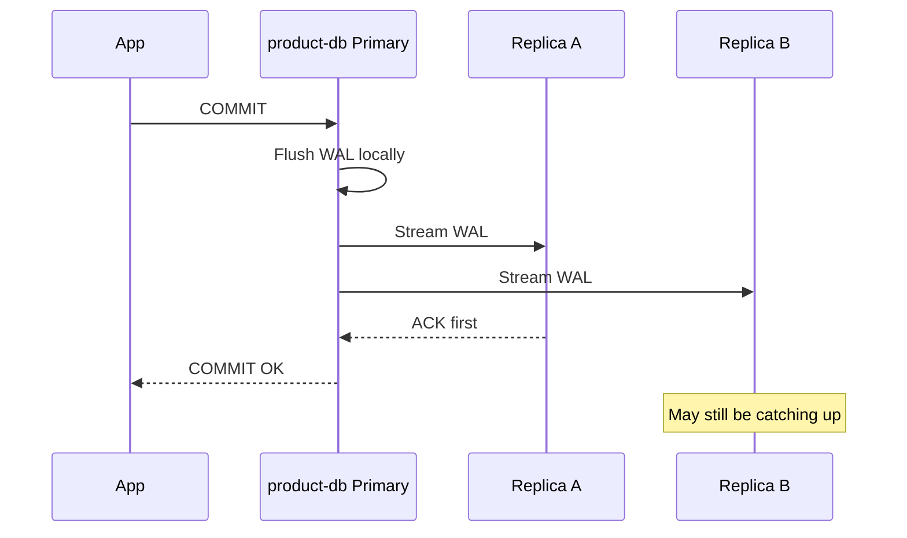
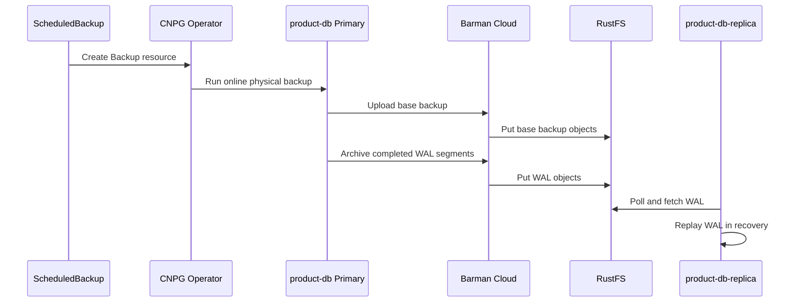
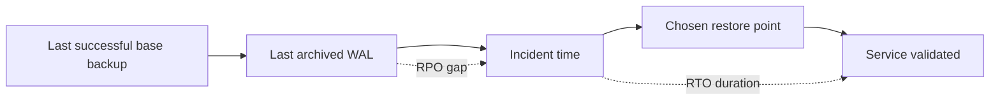
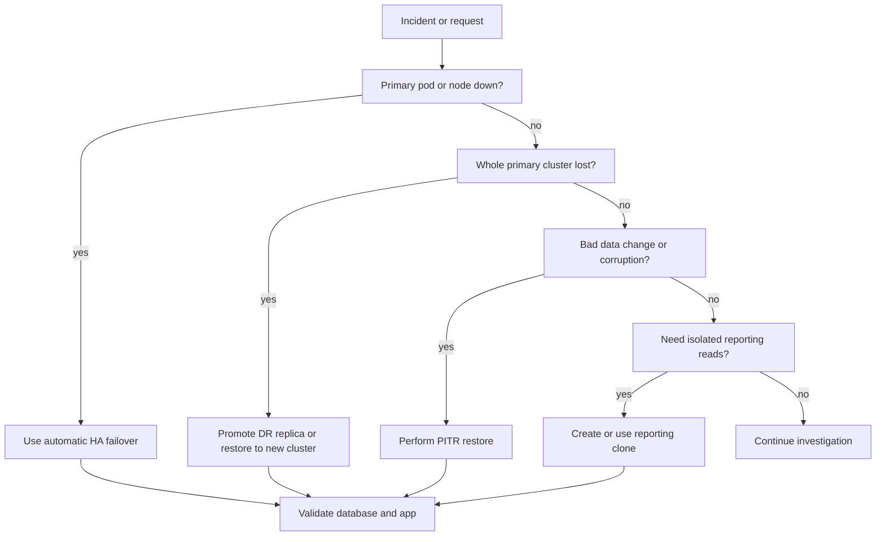
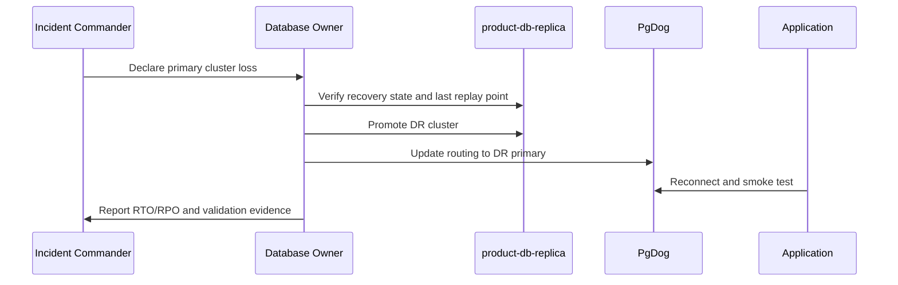

# PostgreSQL Disaster Recovery Plan

This document defines the PostgreSQL disaster recovery plan (DRP) for this
homelab. The homelab is the concrete implementation, but the structure is
written as a production-ready operating standard that can be applied to a real
environment after the known gaps are closed.

Use this page as the system of record for PostgreSQL HA, DR, RPO, RTO, PITR,
standby patterns, restore drills, and recovery evidence. Use the deep dives for
implementation details:

- [004-replication-strategy.md](./004-replication-strategy.md) - sync/async replication and commit behavior.
- [005-ha-dr-deep-dive.md](./005-ha-dr-deep-dive.md) - CNPG HA/DR internals.
- [006-backup-strategy.md](./006-backup-strategy.md) - physical backup, WAL archiving, retention, and PITR mechanics.
- [003.1-operator-cnpg.md](./003.1-operator-cnpg.md) - CloudNativePG operator deep dive.
- [003.2-operator-zalando.md](./003.2-operator-zalando.md) - Zalando Postgres Operator deep dive.

### Child playbooks

Operational sub-pages that turn this plan into routine practice and incident response:

- [010.1-rpo-rto-planning.md](./010.1-rpo-rto-planning.md) - per-tier RPO/RTO targets vs as-built, mapped to clusters.
- [010.2-restore-and-failover-drills.md](./010.2-restore-and-failover-drills.md) - restore/failover drill cadence, roles, and evidence log.
- [010.3-cross-region-dr.md](./010.3-cross-region-dr.md) - cross-zone/cross-region roadmap (current co-location → independent failure domains).
- [010.4-emergency-recovery.md](./010.4-emergency-recovery.md) - "start here when it's down" recovery runbook.

## Purpose and Scope

### Current homelab state

The platform runs three PostgreSQL clusters:

| Cluster | Operator | Namespace | Role |
|---------|----------|-----------|------|
| `platform-db` | CloudNativePG | `platform` | 3-node HA cluster for auth, user, notification, shipping, review, and Temporal persistence |
| `product-db` | CloudNativePG | `product` | Primary CNPG cluster for `product`, `cart`, `order`, `payment` |
| `product-db-replica` | CloudNativePG | `product` | DR replica cluster following `product-db` via RustFS object-store recovery |

### Production baseline

A production DRP must define:

- Ownership: who declares the incident, approves restore/promotion, executes recovery, and validates service health.
- RTO/RPO targets by data criticality.
- Backup and WAL archiving controls.
- Restore drills with measured RTO and retained evidence.
- Monitoring for backup age, WAL archival failure, replication lag, object-store reachability, and DR replica health.
- A clear decision tree for HA failover, DR promotion, PITR restore, and logical/selective restore.

### Gap / next improvement

This homelab intentionally keeps some failure domains together:

- `product-db-replica` runs in the same Kubernetes cluster and namespace as `product-db`.
- RustFS runs inside the homelab rather than in an independent object-store failure domain.

Those are acceptable learning trade-offs for this environment, not production
architecture. In production, the DR replica and object store should live in
independent failure domains, with versioning, immutability, and least-privilege
backup/restore identities.

## Current Database Topology



### Live status snapshot

At the time this DRP was written, live cluster inspection showed the
following (illustrative — re-run the commands below for current values):

| Resource | Status |
|----------|--------|
| `product-db` | `Cluster in healthy state`, 3/3 ready, current primary `product-db-1` |
| `product-db` archiving | `ContinuousArchiving=True` |
| `product-db` backup | `LastBackupSucceeded=True`, last successful backup `<timestamp>` |
| `product-db-replica` | `Cluster in healthy state`, 1/1 ready |
| `platform-db` | CNPG cluster healthy, 3/3 ready |

Use plain `kubectl` fallbacks if the CNPG plugin is not installed:

```bash
kubectl get cluster,backup,scheduledbackup -A
kubectl get cluster product-db product-db-replica -n product -o jsonpath='{range .items[*]}{.metadata.name}{" status="}{.status.phase}{" primary="}{.status.currentPrimary}{" ready="}{.status.readyInstances}{"/"}{.status.instances}{"\n"}{end}'
```

## Core DRP Concepts

| Concept | Meaning | Protects against | Does not protect against |
|---------|---------|------------------|--------------------------|
| HA failover | Promote an already-running replica after primary failure | Pod, node, process, or primary PVC failure | Bad writes, `DROP TABLE`, corruption replicated to standbys |
| DR promotion | Promote a separate replica cluster after losing the primary cluster/site | Cluster/site failure | Logical corruption unless recovered to a clean point |
| PITR | Restore base backup, then replay WAL to a chosen time/LSN | Human error, bad migration, accidental delete | Very short RTO unless restore is automated and tested |
| Logical restore | Restore selected database/schema/table from dump | Selective recovery and migrations | Full-cluster RTO/RPO targets |
| Reporting clone | Restore or replicate to a separate read workload | Query isolation for data team | Strict freshness unless streaming-based |

Replication copies the current state. PITR preserves history. If an engineer
runs `DROP TABLE` on the primary, the HA replicas will also receive that WAL.
The correct recovery path is PITR or selective restore, not HA failover.

## Production-Ready DRP Baseline

### Ownership

| Responsibility | Production baseline |
|----------------|---------------------|
| Incident commander | Owns incident declaration, timeline, communication, and go/no-go decisions |
| Database recovery owner | Executes backup validation, restore, PITR, or promotion steps |
| Service owner | Validates app behavior and smoke tests after recovery |
| Security owner | Reviews secret access, object-store access, and audit evidence |
| Change approver | Approves DR promotion or write-path cutover |

### RTO/RPO policy

| Data class | Example | Production baseline |
|------------|---------|---------------------|
| Critical transactional | `order`, cart checkout path | RPO 0 for HA failover; DR RPO bounded by WAL archive interval; RTO measured by drills |
| Important user-facing | auth, user profiles | Small RPO may be acceptable if documented; restore must be tested |
| Supporting/non-critical | notification, shipping metadata, review | RPO/RTO can be looser, but owner must accept impact |
| Analytics/reporting | reporting clone | Freshness SLA instead of failover RPO |

### Control baseline

| Control | Current homelab state | Production baseline |
|---------|-----------------------|---------------------|
| Backup type | Physical backup + WAL archive | Same, plus immutable/versioned off-cluster object store |
| Restore drills | Planned | Monthly or quarterly, with measured RTO evidence |
| Object-store credentials | Shared RustFS credentials | Separate backup writer and restore reader identities |
| DR location | Same Kubernetes cluster | Separate cluster/region/failure domain |
| Change control | GitOps manifests | GitOps plus explicit incident/change approval |
| Evidence | Manual command output | Stored drill record with backup ID, timestamps, validation, and final RTO/RPO |

## Standby Taxonomy



### In-cluster HA standby

An HA standby is an already-running PostgreSQL replica inside the same database
cluster. In CNPG, additional `spec.instances` become replicas managed by the
operator. They can receive streaming WAL, serve read-only traffic via `-r` /
`-ro` services, and be promoted during failover.

In `product-db`, the HA posture is 3 instances with synchronous quorum `ANY 1`.
The guarantee is "at least one reachable synchronous standby must acknowledge",
not "every replica is synchronous at all times".

### DR standby / replica cluster

A DR standby is a separate cluster. `product-db-replica` follows `product-db` from
RustFS object-store backups and archived WAL. It is a DR target, not part of
the normal application write path.

### PITR restore cluster

A PITR restore cluster is created to recover to a specific timestamp or LSN.
It is the correct tool for bad migrations, accidental deletes, or logical
corruption.

### Reporting clone

A reporting clone is a non-incident read target. It can be restored from backup
or maintained as a replica cluster. It protects the production write path from
expensive analytical queries, but its data freshness must be documented.

## CNPG DRP: `platform-db`

### Current homelab state

`platform-db` is a 3-node CloudNativePG cluster with synchronous quorum `ANY 1` and
a `pgdog-platform` pooler — the same HA posture as `product-db`. Its DR path is the
Barman Cloud Plugin backup at `s3://pg-backups-cnpg/platform-db/` (restore-to-new-cluster).
Temporal persistence (`temporal`, `temporal_visibility`) lives on this cluster and
connects **directly** to `platform-db-rw.platform:5432` (no pooler).

> Consolidated from the former `auth-db`, `shared-db`, and `temporal-db` clusters
> (RFC-0018). No separate platform DR replica cluster in this RFC — HA + Barman PITR only.

## CNPG DRP: `product-db` and `product-db-replica`

### Current homelab state

`product-db` is configured with:

- 3 instances.
- Synchronous replication quorum: `method: any`, `number: 1`, `dataDurability: required`.
- `archive_timeout: 5min`.
- Physical backups and WAL archiving to `s3://pg-backups-cnpg/product-db/`.
- Daily and every-6h `ScheduledBackup` resources.
- `product-db-replica` bootstrapped from the primary object-store backup path.



### Production baseline

For a production deployment of this pattern:

- Keep synchronous quorum for critical transactional workloads.
- Place at least one DR target in a separate Kubernetes cluster or region.
- Use an object store with independent durability, versioning, and immutability.
- Test restore-to-new-cluster and DR promotion before declaring the design production-ready.
- Use the Barman Cloud Plugin / CNPG-I `ObjectStore` model for CNPG backup and recovery.

### Backup and WAL flow



## RPO/RTO Matrix

| Scenario | Primary recovery path | Expected RPO | Expected RTO | Verification status |
|----------|-----------------------|--------------|--------------|---------------------|
| `product-db` primary pod crash | CNPG HA failover | 0 for commits acknowledged by `ANY 1` quorum | Seconds to under a minute | Estimated, not drill-recorded here |
| `product-db` replica failure | CNPG recreates or resyncs replica | 0 for primary writes | No app downtime expected | Estimated |
| All `product-db` replicas unavailable | Primary may continue degraded or block depending durability state | Depends on sync availability | No failover capacity until repaired | Requires drill |
| Entire `product-db` cluster lost | Promote `product-db-replica` or restore to new cluster | Bounded by WAL archive/replay lag | Minutes to hours | Requires drill |
| Accidental `DROP TABLE` | PITR restore to timestamp before change | Depends on chosen target | Restore time plus validation | Requires drill |
| RustFS outage | Keep local primary running; archive backlog risk grows | Risk grows if WAL cannot archive | Depends on object-store recovery | Requires alerting |
| `platform-db` primary pod crash | CNPG HA failover | 0 for commits acknowledged by `ANY 1` quorum | Seconds to under a minute | Estimated |
| `platform-db` whole cluster lost | Barman restore-to-new-cluster | Since last WAL archive | Manual restore time | Requires drill |



## Recovery Decision Flow



## Operational Runbooks and Commands

### Verify backup health

```bash
kubectl get backup,scheduledbackup -n product
kubectl get cluster product-db -n product -o jsonpath='{.status.conditions}'
```

Expected:

- Recent `Backup` resources are `completed`.
- `LastBackupSucceeded=True`.
- `ContinuousArchiving=True`.

### Verify DR replica health

```bash
kubectl get cluster product-db-replica -n product -o wide
kubectl get pods -n product -l cnpg.io/cluster=product-db-replica
```

Expected:

- Cluster is healthy.
- One pod is ready.
- It remains in recovery while `spec.replica.enabled: true`.

### Trigger on-demand backup

If the CNPG plugin is installed:

```bash
kubectl cnpg backup product-db -n product
```

Plain Kubernetes fallback:

```bash
kubectl apply -f kubernetes/infra/configs/databases/clusters/product-db/backup/backup-initial.yaml
kubectl get backup -n product
```

### PITR drill outline

1. Pick a test timestamp before a known test write or delete.
2. Create a temporary restore cluster with `bootstrap.recovery.recoveryTarget.targetTime`.
3. Wait for the restore cluster to become healthy.
4. Validate schema, row counts, and app smoke tests.
5. Record start time, end time, backup ID, target timestamp, and final RTO/RPO.
6. Delete the temporary restore cluster only after evidence is captured.

### DR promotion outline



Go/no-go checks before promotion:

- Confirm the primary cluster is unavailable or must not accept writes.
- Confirm no split-brain risk.
- Confirm the DR replica replay point is acceptable.
- Get incident commander approval.

## Compliance and Evidence Checklist

Capture the following for every restore or DR drill:

- Incident or drill ID.
- Start and end timestamps.
- Cluster name and namespace.
- Backup ID and backup completion time.
- Recovery target timestamp or LSN.
- WAL archive health output.
- Restore or promotion command output.
- Schema validation.
- Row-count validation for critical tables.
- Application smoke test result.
- Final measured RTO and RPO.
- Deviations, gaps, and follow-up actions.

## Known Gaps and Next Improvements

### Current homelab trade-offs

- `product-db-replica` shares the same Kubernetes cluster and namespace as the primary.
- RustFS shares the homelab failure domain.
- Restore drills and DR promotions are not yet recorded as recurring evidence.
- `kubectl cnpg` plugin is not installed locally at the time of writing.
- No separate **`platform-db-replica`** DR cluster — platform tier recovery is in-cluster HA + Barman PITR only (RFC-0018 follow-up).

### Production-forward improvements

- Move DR replica or restore target to another cluster/region.
- Move backup object storage to an independent durable service with versioning and object lock.
- Split backup writer and restore reader credentials.
- Add monthly restore drills with retained evidence.
- Complete and record plugin-backed restore/PITR drills after the Barman Cloud Plugin rollout.
- Decide whether a **`platform-db-replica`** DR cluster is needed (product line already has `product-db-replica`).

## Barman Cloud Plugin Current State

The current homelab manifests use the Barman Cloud Plugin and `ObjectStore`
CRs instead of in-tree CNPG `barmanObjectStore`. This keeps the configuration
aligned with upstream CNPG's long-term backup direction.

Current object-store target:

```yaml
apiVersion: barmancloud.cnpg.io/v1
kind: ObjectStore
metadata:
  name: product-db-backup-store
  namespace: product
spec:
  retentionPolicy: "30d"
  configuration:
    destinationPath: s3://pg-backups-cnpg/product-db/
    endpointURL: http://rustfs-svc.rustfs.svc.cluster.local:9000
    s3Credentials:
      accessKeyId:
        name: pg-backup-rustfs-credentials
        key: ACCESS_KEY_ID
      secretAccessKey:
        name: pg-backup-rustfs-credentials
        key: ACCESS_SECRET_KEY
    wal:
      compression: gzip
      maxParallel: 4
```

```yaml
apiVersion: postgresql.cnpg.io/v1
kind: Cluster
metadata:
  name: product-db
  namespace: product
spec:
  plugins:
    - name: barman-cloud.cloudnative-pg.io
      isWALArchiver: true
      parameters:
        barmanObjectName: product-db-backup-store
        serverName: product-db-cluster
```

The migration is not fully production-accepted until a plugin-backed on-demand
backup and restore/PITR drill are completed and recorded. Do not delete existing
RustFS backup prefixes until that evidence exists.

## References

- [CloudNativePG documentation](https://cloudnative-pg.io/docs/1.30/)
- [CloudNativePG Barman Cloud Plugin](https://cloudnative-pg.io/plugin-barman-cloud/)
- [Zalando Postgres Operator documentation](https://postgres-operator.readthedocs.io/en/latest/)
- [PostgreSQL WAL documentation](https://www.postgresql.org/docs/current/wal-intro.html)

---

_Last updated: 2026-07-17 — RFC-0018: 3 CNPG clusters (platform-db, product-db, product-db-replica); platform tier consolidated with Barman backups including Temporal._
