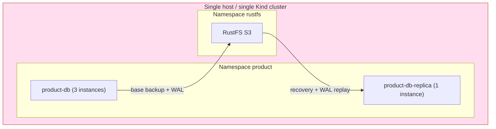
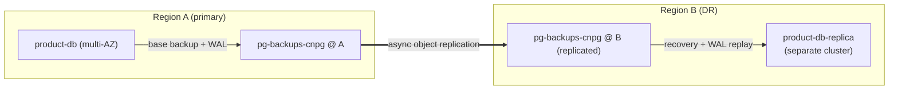

# Cross-Region / Cross-Zone DR

Child playbook of the [PostgreSQL Disaster Recovery Plan](./010-drp.md). It makes
the DRP's "separate failure domain" production baseline concrete: where the DR
replica and object store run **today**, why that is not yet real DR, and the
staged path to cross-zone and cross-region redundancy. This is a **roadmap** doc
(⏳) — it documents a target, not the current as-built state.

## Current reality — co-located

The DR replica, the primary, and the RustFS object store all live in **one Kind
cluster on one host**. `product-db-replica` is even in the same `product` namespace
as `product-db`.

## Why this is not production DR

DR is about **independent failure domains**. Co-location defeats it: a single host
failure, a cluster-wide event, or a RustFS outage takes out the primary, the DR
replica, **and** the backups it would recover from — all at once. The object store
is a single point of failure for the entire recovery story.

The mechanism, however, is already DR-ready: `product-db-replica` bootstraps and
follows purely from the object store (`bootstrap.recovery` +
`replica.enabled: true` against the `product-db-primary` external cluster). Nothing
about that wiring assumes co-location — only the **placement** does. The work is
moving the failure domains apart, not rebuilding the pattern.

## Target topology

Two stages, smallest blast-radius reduction first.

### Stage 1 — cross-zone (within one region)

Spread the primary's instances and the DR replica across availability zones, with
pod anti-affinity and topology spread so no single node/zone hosts all of them.
Cheap, low latency, survives a zone failure.

### Stage 2 — cross-region

Run the DR replica in a **separate cluster in another region**, following a
**replicated** object-store bucket. The primary writes backups/WAL to its regional
bucket; that bucket replicates to the DR region; the remote DR replica recovers
from the replicated copy.

Failover to region B is the same DR promotion as today
([010.2 Drill C](./010.2-restore-and-failover-drills.md#drill-c--dr-promotion-rehearsal-quarterly)) —
`replica.enabled: false` — only the replica now lives elsewhere.

## Trade-offs

| Dimension | Co-located (today) | Cross-zone (stage 1) | Cross-region (stage 2) |
|-----------|--------------------|----------------------|------------------------|
| Failure-domain independence | None | Survives one zone | Survives a region |
| Recovery RPO | Replay lag | Replay lag | + object-replication lag (async) |
| Write latency | Baseline | ~unchanged | Unchanged (DR is async, off the write path) |
| Cost | Lowest | Low | Egress + second-region storage/compute |
| Operational complexity | Lowest | Low | Cross-region IAM, bucket replication, second cluster |

Cross-region DR is **asynchronous** by design — the remote replica must never sit
on the synchronous commit path, or a region's network blip would stall every
write. RPO in region B is therefore bounded by object-replication lag on top of
`archive_timeout`.

## Migration path

1. **Stage 1:** add zone anti-affinity + topology spread to `product-db` and move
   `product-db-replica` to a different zone/node.
2. **Harden the object store:** independent durable backend with **versioning +
   object-lock/immutability**, and split **backup-writer vs restore-reader**
   credentials (today both share the RustFS credential — a
   [010-drp.md known gap](./010-drp.md#known-gaps-and-next-improvements)).
3. **Stage 2:** stand up a second-region bucket with replication, then a second
   cluster hosting `product-db-replica` that recovers from it.
4. **Prove it:** run a [Drill C](./010.2-restore-and-failover-drills.md#drill-c--dr-promotion-rehearsal-quarterly)
   promotion against the remote replica and record the measured RTO/RPO.

## References

- [010-drp.md](./010-drp.md) — parent DRP, "separate failure domain" baseline.
- [005-ha-dr-deep-dive.md](./005-ha-dr-deep-dive.md) — replica-cluster internals (object-store DR).
- [004-replication-strategy.md](./004-replication-strategy.md) — sync vs async, cascading replication.
- [010.2-restore-and-failover-drills.md](./010.2-restore-and-failover-drills.md) — the promotion drill that validates this.
