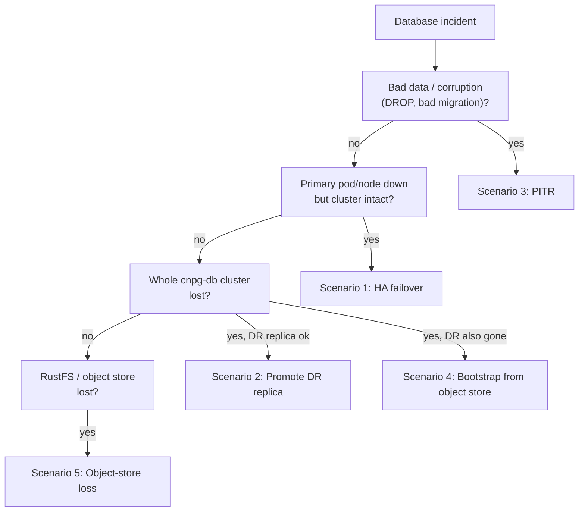

# Emergency Recovery — Start Here

Child playbook of the [PostgreSQL Disaster Recovery Plan](./010-drp.md). When a
database is down or producing bad data, **start on this page.** It triages the
symptom, routes you to the right recovery path, and chains the procedures the DRP
and deep dives describe — it does not replace them. The rehearsed version of every
step here lives in [010.2 drills](./010.2-restore-and-failover-drills.md); a real
incident is a drill you did not get to schedule.

> First action, always: **declare the incident** and name an incident commander
> (IC) and database recovery owner (per [010-drp.md ownership](./010-drp.md#ownership)).
> Recovery decisions are the IC's go/no-go, not the first responder's.

## 0. Triage (first 5 minutes)

```bash
# What is actually broken?
kubectl get cluster,backup,scheduledbackup -n product
kubectl get postgresql -A
kubectl cnpg status cnpg-db -n product            # if the plugin is installed
kubectl get pods -n product -l cnpg.io/cluster=cnpg-db
```

Answer one question: **is this an availability problem (something is down) or an
integrity problem (the data is wrong)?** That single distinction picks your path —
HA failover and DR promotion **replicate** a bad write; only PITR undoes it.

## Decision tree

Mirrors [010-drp.md → Recovery Decision Flow](./010-drp.md#recovery-decision-flow).



## Scenario 1 — primary pod/node down, cluster intact

**Symptom:** one instance (often the primary) is down; replicas are healthy.
**Path:** CNPG fails over automatically (sync quorum `ANY 1` makes acknowledged
commits RPO-0). Usually nothing to do but watch.

```bash
kubectl cnpg status cnpg-db -n product            # new primary should appear, 3/3 ready
```

If it does not self-heal, force a planned switchover to a healthy replica:

```bash
kubectl cnpg switchover cnpg-db -n product
```

Then confirm PgDog routes to the new primary and the app reconnects.

## Scenario 2 — whole `cnpg-db` cluster lost, DR replica healthy

**Symptom:** the primary cluster is gone/frozen but `cnpg-db-replica` is alive and
replaying. **Path:** DR promotion. RPO ≤ `archive_timeout` (5 min).

**Go/no-go (IC approval required):**
- Primary cluster is confirmed down or intentionally frozen — no split-brain risk.
- DR replica replay point is within the incident RPO.

Promote (the replica cluster stops recovery and becomes read-write):

```yaml
# cnpg-db-replica manifest
spec:
  replica:
    enabled: false      # changed from true → triggers promotion
```
```bash
kubectl cnpg status cnpg-db-replica -n product    # expect: Primary, accepting connections
```

Cut PgDog over and smoke test:

```yaml
# pgdog-cnpg HelmRelease
host: cnpg-db-replica-rw.product.svc.cluster.local
```

Detailed sequence: [010-drp.md → DR promotion outline](./010-drp.md#dr-promotion-outline).

## Scenario 3 — bad data / corruption (DROP, bad migration)

**Symptom:** data is wrong, not missing infrastructure. **Do not fail over or
promote** — the bad WAL has already reached every standby. **Path:** PITR restore
to a **new** cluster, targeting a timestamp just before the change.

```yaml
bootstrap:
  recovery:
    source: cnpg-db-backup
    recoveryTarget:
      targetTime: "2026-06-19 02:55:00+00"   # just before the bad change
```
```bash
kubectl apply -f kubernetes/infra/configs/databases/clusters/cnpg-db/restore-cluster-example.yaml
kubectl get cluster -n product -w
```

Validate schema + row counts on the restored cluster, then decide cut-over vs
selective data extraction with the IC. Full steps:
[postgres_backup_restore.md → Point-in-time recovery](../runbooks/troubleshooting/postgres_backup_restore.md#point-in-time-recovery).

## Scenario 4 — total loss (primary + DR replica gone)

**Symptom:** both clusters are gone, but the object store survives. **Path:**
bootstrap a fresh cluster directly from `s3://pg-backups-cnpg/cnpg-db/` (latest
base backup + WAL replay). Same `restore-cluster-example.yaml` as Scenario 3 with
**no** `recoveryTarget` (recover to the end of the archive). RPO = last archived WAL.

```bash
kubectl apply -f kubernetes/infra/configs/databases/clusters/cnpg-db/restore-cluster-example.yaml
kubectl get cluster -n product -w
```

Because the DR replica is also gone, plan to re-establish a new DR replica after
the primary is back (re-apply `cnpg-db-replica`).

## Scenario 5 — RustFS / object store lost

**Symptom:** RustFS is unreachable; `PostgresBackupFailed` / `PostgresBackupTooOld`
firing. **The running primary keeps serving** — this is not an outage yet, but the
recovery story is degraded:

- **Keep the live primary running.** Do not promote or restore — there is nothing
  to restore *from* until the store is back.
- WAL cannot archive → archive backlog grows on the primary's disk. Watch disk
  pressure; a full PGDATA volume *will* take the primary down.
- New base backups and DR replica recovery are blocked until RustFS returns.

Restore RustFS first, confirm `ContinuousArchiving=True` recovers and the backlog
drains, then take a fresh on-demand backup:

```bash
kubectl cnpg backup cnpg-db -n product
```

This scenario is why co-located RustFS is the single biggest DR gap — see
[010.3 cross-region DR](./010.3-cross-region-dr.md).

## Escalation & communication

- IC owns the timeline, comms, and every go/no-go.
- Security owner reviews object-store/secret access used during recovery.
- Change approver signs off on write-path cut-over (Scenario 2/4).

## After recovery — capture evidence

Recovery is not done until it is recorded. Fill in the
[010.2 evidence log](./010.2-restore-and-failover-drills.md#evidence-log-template)
and the [010-drp.md evidence checklist](./010-drp.md#compliance-and-evidence-checklist):
incident ID, timestamps, backup ID, recovery target, validation output, measured
RTO/RPO, and follow-ups. Feed gaps back into the [drill schedule](./010.2-restore-and-failover-drills.md#drill-calendar).

## References

- [010-drp.md](./010-drp.md) — parent DRP, decision flow, ownership, evidence checklist.
- [010.2-restore-and-failover-drills.md](./010.2-restore-and-failover-drills.md) — rehearsed versions of these procedures.
- [005-ha-dr-deep-dive.md](./005-ha-dr-deep-dive.md#8-practical-commands-reference) — command + promotion reference.
- [postgres_backup_restore.md](../runbooks/troubleshooting/postgres_backup_restore.md) — full backup/restore runbook.
