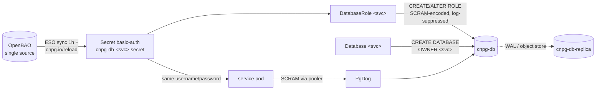

# Declarative Role & Database Management (CNPG)

One file per service — an `ExternalSecret`, a `DatabaseRole`, and a `Database` —
is the single pattern for every service database on `cnpg-db`; no role or
database is created by SQL in Git, and no credential ever appears in a manifest.

| | |
|---|---|
| **Status** | All four services on triplets (RFC-0012 P1–P3); connection isolation via `pg_hba` (P4) **planned** |
| **Decision record** | [ADR-013 — per-service database triplet](../proposals/adr/ADR-013-per-service-db-triplet/) |
| **Operator** | CloudNativePG v1.30.0 (`DatabaseRole` CRD since 1.30) |
| **Cluster** | `cnpg-db` (namespace `product`); DR replica `cnpg-db-replica` receives roles/databases via WAL, no CRs of its own |
| **Triplet location** | `kubernetes/infra/configs/databases/clusters/cnpg-db/services/<name>.yaml` |
| **Credential flow** | OpenBAO → ESO → `kubernetes.io/basic-auth` Secret (`cnpg.io/reload: "true"`) |

## Concept

PostgreSQL roles and databases are **cluster-global objects**: they belong to
the platform, not to any one service's migration history (a service migration
cannot create the role it needs to connect with — a bootstrap paradox). Before
CNPG 1.30 the operator could only manage roles *inline* in the shared
`Cluster.spec.managed.roles` stanza, so every service edit went through
platform infrastructure. CNPG 1.30's `DatabaseRole` CRD makes each role its own
namespaced resource with independent lifecycle, status, and RBAC — which is
what allows the per-service file.

Three semantics of `DatabaseRole` drive how we operate it:

1. **Adoption is total.** Creating a `DatabaseRole` for a role that already
   exists *adopts* it: the operator issues `ALTER ROLE` so that **every**
   attribute matches the manifest — including attributes the manifest omits
   (omitted `inRoles` memberships are revoked, an omitted `connectionLimit`
   resets to `-1`, an omitted `validUntil` becomes `infinity`). Consequence:
   our manifests are always written out in full, and every migration PR
   snapshots `pg_authid` before and after.
2. **Inline wins.** If the same role name exists in `managed.roles`, the
   Cluster spec takes precedence and the `DatabaseRole` reports
   `applied: false`. Consequence: migration removes the inline entry in the
   same PR that adds the CR (no unmanaged window either way), and rollback is
   one re-added inline entry.
3. **Reconcile-on-change, not on a timer.** A `DatabaseRole` is applied when
   its spec or its password Secret changes; manual catalog drift (a hand-run
   `ALTER ROLE`) is *not* auto-corrected, unlike inline roles which are
   periodically compared against the catalog. Consequence: Git is the source
   of truth and nobody hand-edits roles; password changes still propagate
   within seconds via the `cnpg.io/reload` Secret label.

Reclaim policies are `retain` on both `DatabaseRole` and `Database`: deleting a
CR never drops the underlying object. Dropping a role or database stays a
deliberate, manual act (`DROP ROLE`, or a temporary inline `ensure: absent`
entry — `DatabaseRole` has no `absent` equivalent).

## Architecture

Per-service credential and reconcile flow:

Security notes on the write path: since 1.30 the operator SCRAM-SHA-256-encodes
passwords *before* issuing `CREATE`/`ALTER ROLE` and suppresses statement
logging around them, so cleartext never reaches PostgreSQL logs,
`pg_stat_statements`, or `pgaudit`.

## How it works in this platform

Each service file under `clusters/cnpg-db/services/` declares, in order:

1. **`ExternalSecret`** — renders `cnpg-db-<svc>-secret` in namespace `product`
   from OpenBAO path `secret/data/local/databases/cnpg-db/<svc>`. Must be
   `template.type: kubernetes.io/basic-auth` (CNPG requires basic-auth for
   `passwordSecret`) and carry the `cnpg.io/reload: "true"` label. App pods in
   other namespaces consume their own ESO copy of the same OpenBAO entry.
2. **`DatabaseRole` `cnpg-db-role-<svc>`** — all attributes explicit;
   `validUntil` omitted on purpose (the operator then manages expiry to
   `infinity`, correct for app identities); `login: true`; everything
   privileged (`superuser`, `createdb`, `createrole`, `replication`,
   `bypassrls`) explicitly `false`.
3. **`Database` `<svc>-database`** — `owner: <svc>`, the extension list
   (`pgaudit`, `pg_stat_statements`, plus per-service extras), reclaim `retain`.
   Role first in the file: CNPG has no ordering guarantee between the two (a
   `Database` with a missing owner just retries), role-first makes the happy
   path deterministic.

The `Cluster` spec (`instance.yaml`) keeps only infrastructure plus a minimal
`bootstrap.initdb` — its `database`/`owner`/`secret` fields are structural
placeholders that the product triplet adopts declaratively (both must point
at the same `cnpg-db-secret`). `postInitSQL` is gone: a from-scratch build
and a backup restore now converge to the same roles and databases.

Replica behavior: roles and databases replicate through WAL to
`cnpg-db-replica`; a `DatabaseRole` pointed at a replica reports `unknown`
(unset `applied`), not an error, and reconciles normally after promotion.

### Migration state (RFC-0012 phases)

| Service | Mechanism today | Target phase |
|---------|-----------------|--------------|
| payment | triplet (`services/payment.yaml`) | **P1 — landed** |
| cart | triplet (`services/cart.yaml`) | **P2 — landed** (live rotation runs at next bring-up) |
| order | triplet (`services/order.yaml`) | **P2 — landed** (live rotation runs at next bring-up) |
| product | triplet (`services/product.yaml`) — also the `bootstrap.initdb` placeholder identity | **P3 — landed** |

## Operations

- **Add a service database:** one new file in `services/` + an OpenBAO seed
  entry + the app-namespace secret copy + a PgDog `users[]` entry.
  Recipe: [add-service-database](./runbooks/add-service-database.md). Never
  edit `instance.yaml`.
- **Adopt an existing role (migration):** snapshot first —
  `SELECT rolname, rolsuper, rolinherit, rolcreaterole, rolcreatedb,
  rolcanlogin, rolreplication, rolconnlimit, rolvaliduntil, rolbypassrls FROM
  pg_authid WHERE rolname = '<svc>'` plus memberships from `pg_auth_members` —
  copy any memberships into `inRoles`, merge the CR and the removal of any
  inline entry in the same PR, then diff the snapshot after (`rolpassword`
  changes are expected — `ALTER ROLE` re-salts the SCRAM verifier).
- **Rotate a password:** [runbook](./runbooks/rotate-cnpg-service-password.md). Short form: new
  version in OpenBAO → force ESO sync → CNPG applies `ALTER ROLE` via reload
  label → reconcile the PgDog HelmRelease → rollout-restart the app.
- **Watch:** `kubectl get databaseroles,databases -n product` — anything
  `applied: false` is a conflict (usually a leftover inline entry) or an error;
  `unknown` on a replica is normal. Existing `cnpg_*` alert set covers the
  cluster itself; a rule for stuck-unapplied CRs is a tracked follow-up.
- **Roll back a migrated role:** re-add the inline `managed.roles` entry — it
  takes precedence immediately; the `DatabaseRole` drops to `applied: false`
  and can be deleted later (`retain` leaves the catalog untouched).

## References

- [RFC-0012 — Converge CNPG role & database management on declarative CRDs](../proposals/rfc/RFC-0012/)
- [ADR-013 — Per-service database triplet](../proposals/adr/ADR-013-per-service-db-triplet/)
- [002 — Database integration](./002-database-integration.md) · [003.1 — CNPG operator deep dive](./003.1-operator-cnpg.md)
- CloudNativePG official docs: *PostgreSQL Role Management* and *Database
  Management* (v1.30)

---

_Last updated: 2026-07-08 (RFC-0012 P3)_
