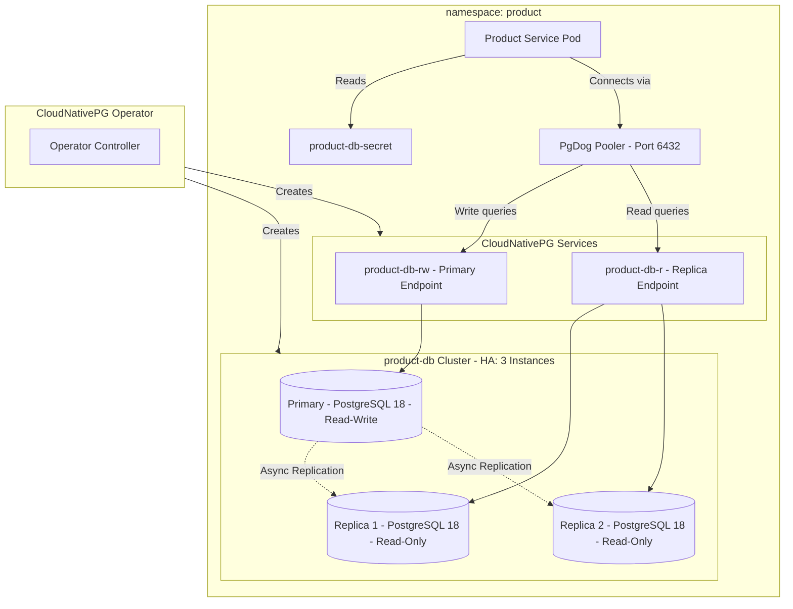
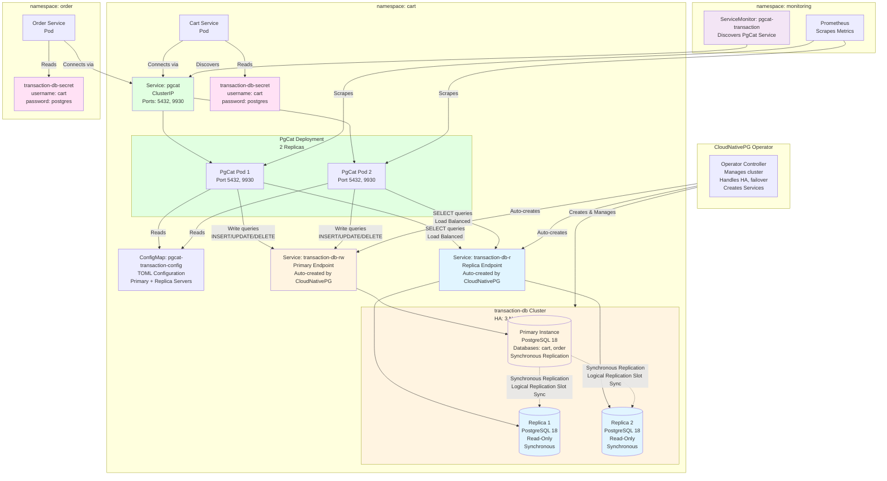
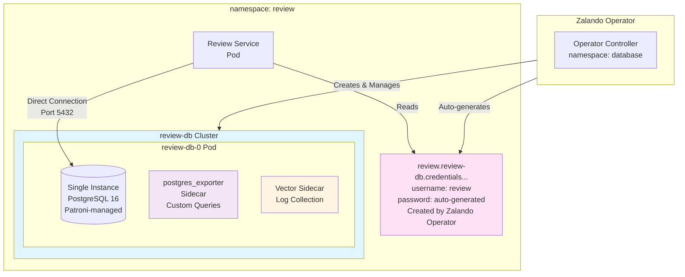
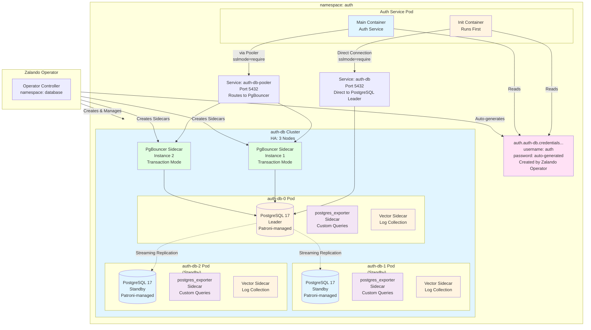
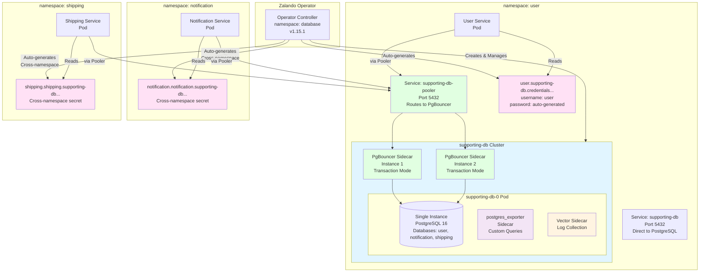
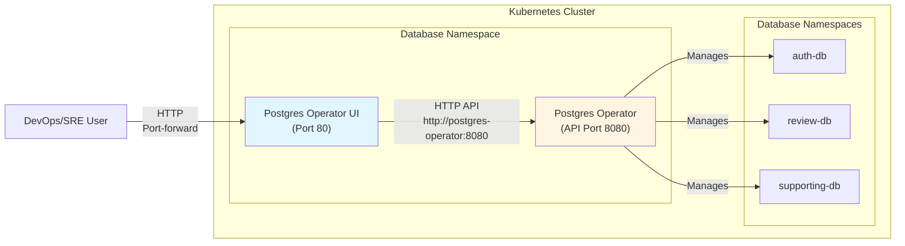

# Database Integration Guide
## Table of Contents

1. [Quick Summary](#quick-summary) - Operators, clusters, poolers overview
2. [Database Architecture](#database-architecture) - 5 clusters overview
3. [CloudNativePG Operator](#cloudnativepg-operator) - Product DB, Transaction DB, PgCat, PodMonitor
4. [Zalando Postgres Operator](#zalando-postgres-operator) - Review DB, Auth DB, Supporting DB, PgBouncer, Secrets, Monitoring
5. [Connection Poolers](#connection-poolers) - PgCat, PgBouncer, PgDog configuration
6. [Related Documentation](#related-documentation) - Links to other docs
7. [Troubleshooting](#troubleshooting) - Common issues and solutions

---
## Quick Summary

| Operator                   | Version   | Cluster Name      | PostgreSQL Ver. | Nodes      | Pooler Type              | Pooler Details                    |
|----------------------------|-----------|-------------------|-----------------|------------|--------------------------|------------------------------------|
| Zalando Postgres Operator  | v1.15.1   | review-db         | 16              | 1          | None                     | -                                  |
| Zalando Postgres Operator  | v1.15.1   | auth-db           | 17              | 3 (HA)     | PgBouncer Sidecar        | 2 instances                        |
| Zalando Postgres Operator  | v1.15.1   | supporting-db     | 16              | 1          | PgBouncer Sidecar        | 2 instances                        |
| CloudNativePG Operator     | v1.28.0   | product-db        | 18              | 3 (HA)     | PgDog Standalone         | 1 replica (Helm chart)              |
| CloudNativePG Operator     | v1.28.0   | transaction-db    | 18              | 3 (HA)     | PgCat Standalone         | 2 replicas                          |
---

## Database Architecture

### Overview

The system uses **5 PostgreSQL clusters** distributed across different operators and connection patterns to demonstrate various database management approaches:

```mermaid
flowchart TB
    subgraph Operators["PostgreSQL Operators"]
        Zalando["Zalando Operator v1.15.1 - 3 clusters"]
        CloudNativePG["CloudNativePG Operator v1.28.0 - 2 clusters"]
    end
    
    subgraph Services["Microservices by Namespace"]
        AuthSvc["Auth Service - namespace: auth"]
        ProductSvc["Product Service - namespace: product"]
        CartSvc["Cart Service - namespace: cart"]
        OrderSvc["Order Service - namespace: order"]
        ReviewSvc["Review Service - namespace: review"]
        UserSvc["User Service - namespace: user"]
        NotificationSvc["Notification Service - namespace: notification"]
        ShippingSvc["Shipping Service - namespace: shipping"]
    end
    
    subgraph Poolers["Connection Poolers"]
        PgBouncerAuth["PgBouncer Sidecar - Auth"]
        PgBouncerSupporting["PgBouncer Sidecar - Supporting"]
        PgDogProduct["PgDog Standalone - Product DB"]
        subgraph PgCatDeploy["PgCat Transaction - 2 Replicas"]
            PgCatTransaction["PgCat - Read Replica Routing"]
        end
    end
    
    subgraph Clusters["PostgreSQL Clusters"]
        subgraph AuthDBCluster["auth-db Cluster - HA: 3 Nodes"]
            AuthLeader[("Leader - PostgreSQL 17")]
            AuthStandby1[("Standby 1 - PostgreSQL 17")]
            AuthStandby2[("Standby 2 - PostgreSQL 17")]
        end
        
        subgraph ProductDBCluster["product-db Cluster - HA: 3 Instances"]
            ProductPrimary[("Primary - PostgreSQL 18")]
            ProductReplica1[("Replica 1 - PostgreSQL 18")]
            ProductReplica2[("Replica 2 - PostgreSQL 18")]
        end
        
        subgraph TransactionDBCluster["transaction-db Cluster - HA: 3 Instances"]
            TransactionPrimary[("Primary - PostgreSQL 18")]
            TransactionReplica1[("Replica 1 - PostgreSQL 18")]
            TransactionReplica2[("Replica 2 - PostgreSQL 18")]
        end
        
        ReviewDB[("review-db - PostgreSQL 16 - Single Instance")]
        SupportingDB[("supporting-db - PostgreSQL 16 - Shared DB")]
    end


    
    subgraph CloudNativePGSvc["CloudNativePG Services - Auto-created"]
        ProductRW["product-db-rw - Primary Endpoint"]
        ProductR["product-db-r - Replica Endpoint"]
        TransactionRW["transaction-db-rw - Primary Endpoint"]
        TransactionR["transaction-db-r - Replica Endpoint"]
    end
    
    Zalando --> AuthDBCluster
    Zalando --> ReviewDB
    Zalando --> SupportingDB
    CloudNativePG --> ProductDBCluster
    CloudNativePG --> TransactionDBCluster
    
    ProductRW --> ProductPrimary
    ProductR --> ProductReplica1
    ProductR --> ProductReplica2
    TransactionRW --> TransactionPrimary
    TransactionR --> TransactionReplica1
    TransactionR --> TransactionReplica2
    
    AuthSvc -->|via pooler| PgBouncerAuth
    PgBouncerAuth --> AuthLeader
    ProductSvc -->|via pooler| PgDogProduct
    PgDogProduct --> ProductRW
    CartSvc -->|via pooler| PgCatTransaction
    OrderSvc -->|via pooler| PgCatTransaction
    PgCatTransaction -->|SELECT queries| TransactionR
    PgCatTransaction -->|Write queries| TransactionRW
    ReviewSvc -->|direct| ReviewDB
    UserSvc -->|via pooler| PgBouncerSupporting
    NotificationSvc -->|via pooler| PgBouncerSupporting
    ShippingSvc -->|via pooler| PgBouncerSupporting
    PgBouncerSupporting --> SupportingDB
    
    AuthLeader -.->|Streaming Replication| AuthStandby1
    AuthLeader -.->|Streaming Replication| AuthStandby2
    ProductPrimary -.->|Async Replication| ProductReplica1
    ProductPrimary -.->|Async Replication| ProductReplica2
    TransactionPrimary -.->|Sync Replication| TransactionReplica1
    TransactionPrimary -.->|Sync Replication| TransactionReplica2
```



### Database Cluster HA Summary

| Operator      | Cluster         | Database      | Owner                      | Secret NS  | Secret Type                | Direct Connection              | Pooler     | Instances                      | HA Pattern               | Namespace   |
|---------------|----------------|--------------|----------------------------|------------|----------------------------|-------------------------------|------------|-------------------------------|--------------------------|-------------|
| CloudNativePG | product-db     | product      | product                    | product    | Manual (`product-db-secret`)| `product-db-rw.product:5432`  | PgDog      | 3 (1 primary + 2 replicas)     | Patroni HA               | product     |
| CloudNativePG | transaction-db | cart         | cart                       | cart       | Manual (`transaction-db-secret`)| `transaction-db-rw.cart:5432` | PgCat       | 3 (1 primary + 2 replicas)     | Patroni HA (Sync)        | cart        |
| CloudNativePG | transaction-db | order        | cart                       | cart       | Manual (`transaction-db-secret`)| `transaction-db-rw.cart:5432` | PgCat       | 3 (1 primary + 2 replicas)     | Patroni HA (Sync)        | cart        |
| Zalando       | auth-db        | auth         | auth                       | auth       | Auto (operator)            | `auth-db.auth:5432`           | PgBouncer  | 3 (1 leader + 2 standbys)      | Patroni HA               | auth        |
| Zalando       | review-db      | review       | review                     | review     | Auto (operator)            | `review-db.review:5432`       | None       | 1 (single instance)            | Patroni (single)         | review      |
| Zalando       | supporting-db  | user         | user                       | user       | Auto (operator)            | `supporting-db.user:5432`     | PgBouncer  | 1 (single instance)            | Patroni (single)         | user        |
| Zalando       | supporting-db  | notification | notification.notification  | notification| Auto (cross-ns)           | `supporting-db.user:5432`     | PgBouncer  | 1 (single instance)            | Patroni (single)         | user        |
| Zalando       | supporting-db  | shipping     | shipping.shipping          | shipping   | Auto (cross-ns)           | `supporting-db.user:5432`     | PgBouncer  | 1 (single instance)            | Patroni (single)         | user        |

### Pooler Summary

| Cluster         | App Endpoint (via Pooler)              | Pooler     | Mode      | Notes                   |
|-----------------|----------------------------------------|------------|-----------|-------------------------|
| product-db      | `pgdog-product.product:6432`           | PgDog      | Standalone| HA Capable (1 replica)  |
| transaction-db  | `pgcat.cart:5432`                      | PgCat      | HA        | 2 replicas              |
| auth-db         | `auth-db-pooler.auth:5432`             | PgBouncer  | Standalone| -                       |
| review-db       | (direct, no pooler)                    | None       | -         | Direct connection only  |
| supporting-db   | `supporting-db-pooler.user:5432`       | PgBouncer  | Standalone| -                       |


---

## CloudNativePG Operator

### Overview

**CloudNativePG Operator** (v1.28.0) is a Kubernetes operator for PostgreSQL that uses Patroni internally for high availability management. It provides a declarative, Kubernetes-native approach to managing PostgreSQL clusters.

**Key Features:**
- Kubernetes-native CRDs for cluster management
- Patroni-based HA with automatic failover (< 30 seconds)
- PostgreSQL 18 (default image)
- Built-in `postgres_exporter` sidecar for metrics
- Support for synchronous replication
- Logical replication slot synchronization
- Production-ready performance tuning

| Cluster                | Database(s)           | Instances                       | Replication Type         |
|------------------------|-----------------------|----------------------------------|--------------------------|
| **product-db**         | product               | 3 (1 primary + 2 replicas)       | Asynchronous             |
| **transaction-db**     | cart, order           | 3 (1 primary + 2 replicas)       | Synchronous              |

---
### Clusters

#### Product Database

| Attribute               | Value                                                    |
|-------------------------|----------------------------------------------------------|
| **Cluster Name**        | product-db                                               |
| **Operator**            | CloudNativePG (v1.28.0) - uses Patroni internally        |
| **PostgreSQL Version**  | 18 (CloudNativePG default image)                         |
| **Instances**           | 3 (1 primary + 2 replicas)                               |
| **HA**                  | Patroni via Kubernetes API (automatic failover)          |
| **Pooler**              | PgDog deployment via Helm chart                          |
| **Namespace**           | `product`                                                |

**Architecture Diagram:**



**Features:**
- Patroni HA with automatic failover (< 30 seconds)
- Connection pooling and routing via PgDog
- Async replication (no sync constraints)
- Pool size: 30 connections (configured in HelmRelease)
- CloudNativePG services: `product-db-rw` (read-write), `product-db-r` (read-only)

#### Transaction Database

| Attribute                | Value                                                                                 |
|--------------------------|---------------------------------------------------------------------------------------|
| **Cluster Name**         | `transaction-db`                                                                     |
| **Operator**             | CloudNativePG (v1.28.0) - uses Patroni internally                                    |
| **PostgreSQL Version**   | 18 (CloudNativePG default image)                                                     |
| **Instances**            | HA: 3 (1 primary + 2 replicas)                                                       |
| **HA**                   | Patroni via Kubernetes API (automatic failover < 30 seconds)                         |
| **Replication**          | Synchronous replication with logical replication slot synchronization                |
| **Pooler**               | PgCat deployment v1.2.0 with 2 replicas for HA                                       |
| **Namespace**            | `cart`                                                                               |
| **Production-Ready**     | Comprehensive PostgreSQL performance tuning, synchronous replication, logical replication slot sync |

**Architecture Diagram:**



| Feature                                      | Description                                                                                                                                                                                |
|----------------------------------------------|--------------------------------------------------------------------------------------------------------------------------------------------------------------------------------------------|
| **High Availability**                        | 3-node HA setup (1 primary + 2 replicas) with automatic failover via Patroni                                                                                                               |
| **Synchronous Replication**                  | Ensures zero data loss; at least 1 synchronous replica is required                                                                                                                         |
| **Logical Replication Slot Synchronization** | Enabled for CDC clients (Debezium, Kafka Connect); slots are synchronized across replicas during failover                                                                                   |
| **Production-Ready Configuration**           | Comprehensive PostgreSQL performance tuning (memory, WAL, query planner, parallelism, autovacuum, logging)                                                                                 |
| **Security**                                 | Password encryption upgraded to `scram-sha-256`; enhanced logging for security auditing                                                                                                    |
| **HA Management**                            | Patroni-based HA with automatic failover (< 30 seconds)                                                                                                                                    |
| **Multi-Database Routing**                   | Supports routing for both `cart` and `order` databases on the same cluster                                                                                                                 |
| **Leader Election**                          | Utilizes Kubernetes API for leader election (no separate etcd needed)                                                                                                                      |
| **Connection Pool Size**                     | 30 connections per database                                                                                                                                                                |
| **CloudNativePG Services (Auto-Created)**    | - `transaction-db-rw.cart.svc.cluster.local` (read-write, primary instance)<br>- `transaction-db-r.cart.svc.cluster.local` (read-only, load balances across replicas)                     |
| **PgCat HA Integration**                     | PgCat routes SELECT queries to `transaction-db-r` (replicas) and write queries to `transaction-db-rw` (primary)                                                                            |
| **Secret Configuration**                     | - Secret name: `transaction-db-secret` (used in both `cart` and `order` namespaces)<br>- Two secret files: `transaction-db-secret-cart.yaml` and `transaction-db-secret-order.yaml`<br>- Same credentials used (username: `cart`, password: `postgres`) |
| **Multi-Service Support**                    | Both Cart and Order services share the same cluster but use separate databases                                                                                                             |
| **Monitoring**                               | PodMonitor CRD for Prometheus metrics collection (with `postgres_exporter` sidecar)                                                                                                        |

**Note on Patroni:**
- CloudNativePG uses Patroni internally for HA management
- Patroni uses Kubernetes API as Distributed Configuration Store (DCS)
- No separate etcd cluster required - Kubernetes serves as coordination layer

### Features & Capabilities

**High Availability:**
- Patroni-based HA with automatic failover (< 30 seconds)
- Kubernetes API as Distributed Configuration Store (DCS)
- No separate etcd cluster required

**Replication:**
- Async replication (Product DB)
- Synchronous replication (Transaction DB) - zero data loss
- Logical replication slot synchronization for CDC clients

**Performance Tuning:**
- Production-ready PostgreSQL parameters (memory, WAL, query planner, parallelism, autovacuum, logging)
- Optimized resource limits
- SSD-optimized settings

**Multi-Database Support:**
- Transaction DB supports multiple databases (cart, order) on the same cluster
- PgCat provides multi-database routing

### Connection Patterns

#### PgCat Standalone

**When to use**: Read replica routing, multi-database routing, advanced load balancing.

**Key Points:**
- Connect via PgCat service: `pgcat.cart.svc.cluster.local:5432` (for transaction-db)
- PgCat transparently routes to CloudNativePG cluster
- Application code same as direct connection

**Key Concepts:**
- **pool_mode: `transaction`** - Connection released after each transaction (better concurrency for microservices)
- **pool_size: 30** - Max connections pooler maintains to database per pool (cart + order)
- **Primary role** (`transaction-db-rw`): Handles all writes (INSERT, UPDATE, DELETE, DDL)
- **Replica role** (`transaction-db-r`): Handles read queries (SELECT) with automatic load balancing
- **Multi-database**: Single PgCat instance serves both Cart and Order databases on same PostgreSQL cluster

**Why transaction mode?**
- Microservices make short-lived transactions
- Higher connection reuse vs session mode
- Better for REST APIs with stateless requests

#### High Availability Integration

**Transaction Database HA Configuration:**

The Transaction Database PgCat pooler is configured with **High Availability (HA)** support, enabling automatic read replica routing and load balancing.

**CloudNativePG Services (Auto-Created):**

CloudNativePG Operator automatically creates two Kubernetes services for each cluster:

1. **`transaction-db-rw`** (Read-Write Service):
   - Format: `{cluster-name}-rw.{namespace}.svc.cluster.local`
   - Points to: Current primary instance
   - Updates automatically during failover/switchover
   - Used by PgCat for: All write queries (INSERT, UPDATE, DELETE, DDL)

2. **`transaction-db-r`** (Read-Only Service):
   - Format: `{cluster-name}-r.{namespace}.svc.cluster.local`
   - Points to: All replica instances (load balanced by Kubernetes)
   - Automatically excludes unhealthy replicas
   - Updates automatically when replicas are added/removed
   - Used by PgCat for: All read queries (SELECT)

**Replica Server Configuration:**

**How Query Routing Works:**
1. **Primary server** (`transaction-db-rw`): Handles ALL writes + reads when no replicas available
2. **Replica servers** (`transaction-db-r`): Handle SELECT queries only, load balanced by Kubernetes
3. **Automatic failover**: Unhealthy replica banned for 60s, queries route to healthy replicas + primary
4. **Health checks**: Fast check (`;` query) before each query execution

**CloudNativePG Auto-Created Services:**
- **`-rw` service**: Always points to current primary (auto-updates on failover)
- **`-r` service**: Load balances across all healthy replicas (auto-updates when replicas added/removed)

**Monitoring:**

PgCat metrics are exposed via HTTP endpoint (`/metrics` on port 9930) and scraped by Prometheus using **ServiceMonitors**.

**Configuration Requirement:**
- PgCat config must have `enable_prometheus_exporter = true` in `[general]` section to expose HTTP metrics endpoint

**Key Metrics:**
- `pgcat_pools_active_connections{pool="cart"}` - Active connections per pool
- `pgcat_pools_waiting_clients{pool="cart"}` - Clients waiting for connections
- `pgcat_servers_health{server_host="...", role="primary|replica"}` - Server health status
- `pgcat_queries_total{pool="cart", server_role="replica"}` - Query count by pool and role
- `pgcat_errors_total{pool="cart"}` - Error count per pool

### Configuration

**Key Configuration Parameters:**
- `instances`: Number of PostgreSQL instances (2 for Product, 3 for Transaction)
- `postgresql.parameters`: PostgreSQL configuration parameters
- `postgresql.synchronous`: Synchronous replication settings (Transaction DB)
- `replicationSlots.highAvailability.synchronizeLogicalDecoding`: Logical replication slot sync
- `resources`: CPU and memory limits
- `storage.size`: Persistent volume size

**Secret Management:**
- CloudNativePG requires pre-created secrets
- Secrets must be created before cluster deployment
- Secret format: `{cluster-name}-secret` in cluster namespace
- Contains: `username`, `password` keys

### Monitoring

#### PodMonitor Setup

CloudNativePG clusters use **PodMonitor** CRDs to enable Prometheus scraping of `postgres_exporter` sidecars.

**Key Elements:**
- **Selector**: Matches pods with label `cnpg.io/cluster: product-db`
- **Port**: `metrics` (exposed by postgres_exporter sidecar)
- **Interval**: 15s scrape interval
- **Labels**: Captures cluster, role (primary/replica), instance name

**Key Metrics:**
- `pg_up` - Database availability
- `pg_stat_database_*` - Database statistics
- `pg_stat_activity_*` - Active connections
- `pg_replication_*` - Replication lag

---
## Zalando Postgres Operator

### Overview

**Zalando Postgres Operator** (v1.15.1) is a Kubernetes operator for PostgreSQL that uses Patroni internally for high availability management. It provides comprehensive PostgreSQL cluster management with built-in features like PgBouncer sidecar and automatic secret generation.

**Key Features:**
- Kubernetes-native CRDs for cluster management
- Patroni-based HA with automatic failover (< 30 seconds)
- PostgreSQL versions: 16 (review-db, supporting-db), 17 (auth-db) - explicitly configured
- Built-in PgBouncer sidecar for connection pooling
- Automatic secret generation
- Cross-namespace secret support
- Built-in `postgres_exporter` sidecar for metrics with custom queries
- **Vector sidecar**: Log collection for PostgreSQL logs (all clusters)
- **Optional UI Component**: Web-based graphical interface for cluster management

| Cluster Name        | Instances          | Description                                        |
|---------------------|-------------------|----------------------------------------------------|
| **review-db**       | 1                 | Review Database (single instance)                  |
| **auth-db**         | 3 (1 leader, 2 standby) | Auth Database (production-ready high availability) |
| **supporting-db**   | 1                 | Supporting Database (shared database pattern)       |

---

### Clusters

#### Review Database

| Thuộc tính         | Giá trị                                                                             |
|--------------------|-------------------------------------------------------------------------------------|
| **Cluster Name**   | `review-db`                                                                         |
| **Operator**       | Zalando Postgres Operator (v1.15.1) - sử dụng Patroni                               |
| **PostgreSQL**     | 16 (được cấu hình rõ ràng trong CRD)                                                |
| **Instances**      | 1 (single instance, không HA)                                                       |
| **HA**             | Patroni qua Kubernetes API (chỉ single instance, không cần failover)                |
| **Pooler**         | Không dùng (kết nối trực tiếp)                                                      |
| **Namespace**      | `review` (cùng namespace với review service - không cần cross-namespace secrets)    |


**Architecture Diagram:**



| Feature                  | Description                                                                                         |
|--------------------------|-----------------------------------------------------------------------------------------------------|
| Management               | Patroni-based management (even for single instance)                                                 |
| Simplicity               | Simple setup for low-traffic service                                                               |
| Connection               | Direct PostgreSQL connection (no pooler overhead)                                                   |
| PostgreSQL Version       | 16                                                                                                  |
| Secret                   | Auto-generated by Zalando operator (`review.review-db.credentials.postgresql.acid.zalan.do`)        |
| Monitoring               | `postgres_exporter` sidecar with custom queries for enhanced metrics                                |
| Log Collection           | Vector sidecar for PostgreSQL log collection to Loki                                                |
| Namespace                | Cluster and service are in the same namespace (`review`), so cross-namespace secret not needed      |

#### Log Collection with Vector Sidecar

- **Vector Sidecar**: Log collection sidecar for PostgreSQL logs
- **Log Location**: `/home/postgres/pgdata/pgroot/pg_log/*.log`
- **ConfigMap**: `pg-zalando-vector-config-review` in `review` namespace
- **Loki Endpoint**: `http://loki.monitoring.svc.cluster.local:3100`
- **Features**:
  - Multiline log parsing (PostgreSQL log format)
  - Label injection (namespace: `review`, cluster: `review-db`, pod)
  - Automatic log shipping to Loki

#### Custom Metrics Configuration

- **ConfigMap**: `postgres-monitoring-queries-review` in `review` namespace
- **Custom Queries**:
  - **pg_stat_statements**: Query performance metrics (execution time, calls, cache hits, I/O statistics) - Top 100 queries
  - **pg_replication**: Replication lag monitoring (for HA clusters)
  - **pg_postmaster**: PostgreSQL server start time
- **Environment Variable**: `PG_EXPORTER_EXTEND_QUERY_PATH=/etc/postgres-exporter/queries.yaml`
- **Key Metrics Exposed**:
  - `pg_stat_statements_*` (calls, time_milliseconds, rows, cache hits, I/O stats)
  - `pg_replication_lag` (replication lag in seconds)
  - `pg_postmaster_start_time_seconds` (server start time)

#### Auth Database

| Attribute             | Value                                                                                                    |
|-----------------------|----------------------------------------------------------------------------------------------------------|
| **Cluster Name**      | `auth-db`                                                                                                |
| **Operator**          | Zalando Postgres Operator (v1.15.1) - powered by Patroni                                                 |
| **PostgreSQL Version**| 17 (explicitly configured in CRD)                                                                       |
| **Instances**         | 3 (HA: 1 leader + 2 standbys)                                                                           |
| **HA**                | Patroni HA via Kubernetes API (automatic failover < 30 seconds)                                         |
| **Pooler**            | PgBouncer sidecar (2 instances, transaction mode)                                                       |
| **Namespace**         | `auth` (same namespace as auth service - no cross-namespace secrets needed)                             |
| **Production-Ready**  | Comprehensive PostgreSQL performance tuning, optimized resource limits, enhanced logging                 |

**Architecture Diagram:**



| Feature                       | Details                                                                                                                                                                                                                                    |
|-------------------------------|--------------------------------------------------------------------------------------------------------------------------------------------------------------------------------------------------------------------------------------------|
| High Availability             | 3-node HA setup (1 leader + 2 standbys) with automatic failover via Patroni (< 30 seconds)                                                                                                                                                |
| Production Configuration      | Comprehensive PostgreSQL tuning (memory, WAL, query planner, parallelism, autovacuum, logging)                                                                                                                                             |
| Security                      | Password encryption: `scram-sha-256`; enhanced audit logging                                                                                                                                        |
| HA Management                 | Patroni-based with automatic failover                                                                                                                                                                                                     |
| Connection Pooler             | Built-in PgBouncer sidecar (Zalando operator feature)                                                                                                                                                                                     |
| Dual Connection Pattern       | **Main Container:** Uses PgBouncer (`auth-db-pooler.auth.svc.cluster.local:6432`, `sslmode=require`); **Init Container:** Uses direct connection (`auth-db.auth.svc.cluster.local:5432`, `sslmode=require`) (no transaction pooling)        |
| Pooling Mode                  | Transaction pooling for short-lived connections (main container)                                                                                                                                    |
| Pool Size                     | 25 connections                                                                                                                                                                                                                            |
| Secret Management             | Auto-generated by Zalando operator (`auth.auth-db.credentials.postgresql.acid.zalan.do`)                                                                                                           |
| Monitoring                    | `postgres_exporter` sidecar in each pod, custom queries for Prometheus metrics: `pg_stat_statements`, `pg_replication`, `pg_postmaster`                                                            |
| Log Collection                | Vector sidecar in each pod, collects PostgreSQL logs to Loki                                                                                                                                        |
| Namespace                     | Cluster and service in same namespace (`auth`); cross-namespace secret feature not needed                                                                                                          |

#### Log Collection with Vector Sidecar

- **Vector Sidecar**: Log collection sidecar for PostgreSQL logs (deployed in all 3 pods)
- **Log Location**: `/home/postgres/pgdata/pgroot/pg_log/*.log`
- **ConfigMap**: `pg-zalando-vector-config-auth` in `auth` namespace
- **Loki Endpoint**: `http://loki.monitoring.svc.cluster.local:3100`
- **Features**:
  - Multiline log parsing (PostgreSQL log format)
  - Label injection (namespace: `auth`, cluster: `auth-db`, pod)
  - Automatic log shipping to Loki

#### Custom Metrics Configuration

- **ConfigMap**: `postgres-monitoring-queries-auth` in `auth` namespace
- **Custom Queries**:
  - **pg_stat_statements**: Query performance metrics (execution time, calls, cache hits, I/O statistics) - Top 100 queries
  - **pg_replication**: Replication lag monitoring (critical for HA clusters)
  - **pg_postmaster**: PostgreSQL server start time
- **Environment Variable**: `PG_EXPORTER_EXTEND_QUERY_PATH=/etc/postgres-exporter/queries.yaml`
- **Key Metrics Exposed**:
  - `pg_stat_statements_*` (calls, time_milliseconds, rows, cache hits, I/O stats)
  - `pg_replication_lag` (replication lag in seconds)
  - `pg_postmaster_start_time_seconds` (server start time)

**Why Two Connection Paths?**
- **PgBouncer Pooler** (`auth-db-pooler`): Used by main container for transaction pooling, reduces connection overhead
- **Direct Connection** (`auth-db`): Used by init container because:
  - Init containers run before main container starts
  - Init containers need full database access and long-running operations
  - Transaction pooling mode doesn't support DDL statements (CREATE TABLE, ALTER TABLE, etc.)

#### Supporting Database

| Attribute              | Value                                                                                                   |
|------------------------|---------------------------------------------------------------------------------------------------------|
| Cluster Name           | `supporting-db`                                                                                         |
| Operator               | Zalando Postgres Operator (v1.15.1) - powered by Patroni                                                |
| PostgreSQL Version     | 16 (explicitly configured in CRD)                                                                       |
| Instances              | 1 (single instance, no HA)                                                                              |
| High Availability (HA) | Patroni via Kubernetes API (single instance, no failover needed)                                        |
| Pooler                 | PgBouncer sidecar (2 instances, transaction mode) - built-in by Zalando                                 |
| Namespace              | `user` (cluster location)                                                                               |

**Architecture Diagram:**



| Feature                          | Description                                                                                                 |
|-----------------------------------|-------------------------------------------------------------------------------------------------------------|
| Patroni-based Management          | Automated management via Patroni (even for single instance)                                                 |
| Shared Database Pattern           | Single cluster hosts 3 logical databases: user, notification, shipping                                      |
| Connection Pooler                 | PgBouncer sidecar (Zalando built-in), 2 instances for high availability                                     |
| Multi-Database Support            | All 3 databases accessible through the same PgBouncer pooler endpoint                                       |
| PostgreSQL Version                | PostgreSQL 16                                                                                               |
| Monitoring                        | `postgres_exporter` sidecar with custom queries for enhanced metrics                                        |
| Log Collection                    | Vector sidecar collects PostgreSQL logs and ships to Loki                                                   |
| Cross-Namespace Secret Management | Automated credentials provisioning across `user`, `notification`, and `shipping` namespaces (see [Zalando Postgres Operator - Secret Management](#secret-management)) |

#### Log Collection with Vector Sidecar

- **Vector Sidecar**: Log collection sidecar for PostgreSQL logs
- **Log Location**: `/home/postgres/pgdata/pgroot/pg_log/*.log`
- **ConfigMap**: `pg-zalando-vector-config-supporting` in `user` namespace
- **Loki Endpoint**: `http://loki.monitoring.svc.cluster.local:3100`
- **Features**:
  - Multiline log parsing (PostgreSQL log format)
  - Label injection (namespace: `user`, cluster: `supporting-db`, pod)
  - Automatic log shipping to Loki

#### Custom Metrics Configuration

- **ConfigMap**: `postgres-monitoring-queries-supporting` in `user` namespace
- **Custom Queries**:
  - **pg_stat_statements**: Query performance metrics (execution time, calls, cache hits, I/O statistics) - Top 100 queries
  - **pg_replication**: Replication lag monitoring (for HA clusters)
  - **pg_postmaster**: PostgreSQL server start time
- **Environment Variable**: `PG_EXPORTER_EXTEND_QUERY_PATH=/etc/postgres-exporter/queries.yaml`
- **Key Metrics Exposed**:
  - `pg_stat_statements_*` (calls, time_milliseconds, rows, cache hits, I/O stats)
  - `pg_replication_lag` (replication lag in seconds)
  - `pg_postmaster_start_time_seconds` (server start time)

**Cross-Namespace Secret Pattern:**
- Database cluster exists in `user` namespace
- Services deploy in `notification` and `shipping` namespaces
- Zalando operator configured with `enable_cross_namespace_secret: true` via OperatorConfiguration CRD
- Users defined with `namespace.username` format (e.g., `notification.notification`, `shipping.shipping`)
- Secrets created with format: `{namespace}.{username}.{clustername}.credentials.postgresql.acid.zalan.do`
- **User Service**: Uses regular secret `user.supporting-db.credentials.postgresql.acid.zalan.do` in `user` namespace (same namespace)
- **Notification Service**: Uses cross-namespace secret `notification.notification.supporting-db.credentials.postgresql.acid.zalan.do` (should be in `notification` namespace)
- **Shipping Service**: Uses cross-namespace secret `shipping.shipping.supporting-db.credentials.postgresql.acid.zalan.do` (should be in `shipping` namespace)
- **Note**: Operator v1.15.1 automatically creates secrets in target namespaces (`notification`, `shipping`) when `enable_cross_namespace_secret: true` is configured

### Features & Capabilities

**High Availability:**
- Patroni-based HA with automatic failover (< 30 seconds)
- Kubernetes API as Distributed Configuration Store (DCS)
- 3-node HA setup for Auth DB (production-ready)

**Built-in Features:**
- PgBouncer sidecar for connection pooling (Auth DB)
- Automatic secret generation
- Cross-namespace secret support
- Built-in `postgres_exporter` sidecar for metrics

**Production-Ready Configuration:**
- Comprehensive PostgreSQL performance tuning (Auth DB)
- Optimized resource limits
- Enhanced logging for security auditing

### Monitoring

#### PodMonitor Setup

Zalando clusters use **PodMonitor** CRDs to enable Prometheus scraping of `postgres_exporter` sidecars.

#### Log Collection with Vector Sidecar

All Zalando PostgreSQL clusters include a **Vector sidecar** for log collection and shipping to Loki.

**Configuration:**
- **Vector ConfigMaps**: Located in each cluster's `configmaps/` folder (used by Zalando database instances as sidecar configs)
  - `kubernetes/infra/configs/databases/clusters/auth-db/configmaps/vector-sidecar.yaml` (Auth DB)
  - `kubernetes/infra/configs/databases/clusters/review-db/configmaps/vector-sidecar.yaml` (Review DB)
  - `kubernetes/infra/configs/databases/clusters/supporting-db/configmaps/vector-sidecar.yaml` (Supporting DB)
- **Log Location**: `/home/postgres/pgdata/pgroot/pg_log/*.log` (default Zalando Spilo log path)
- **Loki Endpoint**: `http://loki.monitoring.svc.cluster.local:3100`
- **Features**:
  - Multiline log parsing (PostgreSQL log format with timestamp detection)
  - Label injection (namespace, cluster, pod, container)
  - Automatic log shipping to Loki

#### Custom Metrics with postgres_exporter

All Zalando PostgreSQL clusters include `postgres_exporter` sidecars with **custom queries** for enhanced metrics.

**Configuration:**
- **Custom Queries ConfigMaps**: Located in each cluster's `configmaps/` folder
  - `kubernetes/infra/configs/databases/clusters/auth-db/configmaps/monitoring-queries.yaml` (Auth DB)
  - `kubernetes/infra/configs/databases/clusters/review-db/configmaps/monitoring-queries.yaml` (Review DB)
  - `kubernetes/infra/configs/databases/clusters/supporting-db/configmaps/monitoring-queries.yaml` (Supporting DB)
- **Environment Variable**: `PG_EXPORTER_EXTEND_QUERY_PATH=/etc/postgres-exporter/queries.yaml`
- **Custom Queries Configured**:
  - **pg_stat_statements**: Query performance metrics (execution time, calls, cache hits, I/O statistics) - Top 100 queries by execution time
  - **pg_replication**: Replication lag monitoring (critical for HA clusters like auth-db)
  - **pg_postmaster**: PostgreSQL server start time

**Key Metrics Exposed:**
- `pg_stat_statements_*` (calls, time_milliseconds, rows, shared_blks_hit, shared_blks_read, etc.)
- `pg_replication_lag` (replication lag in seconds)
- `pg_postmaster_start_time_seconds` (server start time)

**Prerequisites:**
- PostgreSQL clusters must have `pg_stat_statements` extension enabled (configured via `shared_preload_libraries` in CRDs)

**Verification:**
```bash
# Check if custom metrics are exposed
kubectl port-forward -n auth svc/auth-db 9187:9187
curl http://localhost:9187/metrics | grep pg_stat_statements

# Query metrics in Prometheus/Grafana
pg_stat_statements_calls{namespace="auth", cluster="auth-db"}
```

### Connection Patterns

#### Direct Connection

**When to use**: Low-traffic services, simple setup, no connection pooling needed.

**Key Points:**
- Connect directly to service: `{cluster-name}.{namespace}.svc.cluster.local:5432`
- Use Zalando auto-generated secret for credentials
- No pooler overhead, suitable for low-traffic services

**Used by:** Review DB

#### PgBouncer Sidecar

**When to use**: High connection churn, transaction pooling needed, Zalando operator built-in.

**Configuration Helm Values:**

**Key Concepts:**
- **Endpoint**: Use `-pooler` suffix service (`auth-db-pooler.auth.svc.cluster.local`)
- **pool_mode: `transaction`** - Same concept as PgCat (connection per transaction)
- **Built-in sidecar**: No separate deployment needed, Zalando creates it automatically
- **numberOfInstances: 2** - 2 PgBouncer pods for HA
- **SSL required**: PgBouncer enforces SSL connections (`sslmode=require`)

#### PgDog Standalone (product-db)

**When to use**: CloudNativePG clusters, advanced connection pooling features, Helm-based deployment.

**Key Points:**
- Connect via PgDog service: `pgdog-product.product.svc.cluster.local:6432`
- PgDog provides connection pooling with transaction mode
- Application code same as direct connection (transparent routing)
- Helm chart deployment (1 replica for dev)

**Deployment:**
- **Helm Chart**: `helm.pgdog.dev/pgdog` (version 0.32)
- **Replicas**: 1 (Single replica for dev)
- **Port**: 6432 (PostgreSQL protocol), 9090 (OpenMetrics)

**Configuration:**
- **Database**: product
- **Pool size**: 30
- **pool_mode**: `transaction` (connection per transaction)

**Service Endpoint:**
- `pgdog-product.product.svc.cluster.local:6432`

**Monitoring:**
- OpenMetrics: Port 9090 (`/metrics` endpoint)
- ServiceMonitor: Auto-created by Helm chart (enabled)

**Why PgDog for product-db:**
- CloudNativePG clusters don't have built-in pooler
- Prepared statements support in transaction mode
- Advanced features available if needed (pub/sub, sharding)
- Production-ready Helm chart with HA, monitoring, security

### Secret Management

#### Secret Naming Convention

Zalando Postgres Operator automatically creates secrets for each database user. The naming convention depends on whether cross-namespace secrets are enabled:

**Regular Format** (same namespace):
`{username}.{cluster-name}.credentials.postgresql.acid.zalan.do`

**Cross-Namespace Format** (when `enable_cross_namespace_secret: true`):
`{namespace}.{username}.{cluster-name}.credentials.postgresql.acid.zalan.do`

| Service | Secret Name | Namespace | Format |
|---------|-------------|-----------|--------|
| **User** | `user.supporting-db.credentials.postgresql.acid.zalan.do` | `user` | Regular (same namespace) |
| **Notification** | `notification.notification.supporting-db.credentials.postgresql.acid.zalan.do` | `notification` | Cross-namespace (`namespace.username`) |
| **Shipping** | `shipping.shipping.supporting-db.credentials.postgresql.acid.zalan.do` | `shipping` | Cross-namespace (`namespace.username`) |
| **Review** | `review.review-db.credentials.postgresql.acid.zalan.do` | `review` | Regular (same namespace) |
| **Auth** | `auth.auth-db.credentials.postgresql.acid.zalan.do` | `auth` | Regular (same namespace) |

**Note**: 
- These secrets contain `username` and `password` keys
- Helm charts reference these secrets directly - no manual secret creation needed for Zalando-managed databases
- Cross-namespace secrets use `namespace.username` format in the database CRD (e.g., `notification.notification`)

#### Cross-Namespace Secrets for Shared Supporting Database

The **Supporting Database** (`supporting-db`) cluster uses a **shared database pattern** where multiple services (User, Notification, Shipping) share the same PostgreSQL cluster but use separate databases within that cluster.

**Key Characteristics:**
- **Cluster Location**: `supporting-db` cluster is deployed in the `user` namespace
- **Services**: User (same namespace), Notification (`notification` namespace), Shipping (`shipping` namespace)
- **Cross-Namespace Secret Management**: Zalando operator configured with `enable_cross_namespace_secret: true`
- **User Format**: `namespace.username` notation (e.g., `notification.notification`, `shipping.shipping`)
- **Secret Names**: `{namespace}.{username}.{clustername}.credentials.postgresql.acid.zalan.do`

**Configuration:**

**OperatorConfiguration CRD** - **Helm-managed CRD (`postgres-operator`) is the active configuration**:

- **CRD Name**: `postgres-operator` (created automatically by Helm chart)
- **Configuration Source**: `k8s/postgres-operator/zalando/values.yaml`:
```yaml
   # Flat structure (NOT nested under config:)
   configKubernetes:
     cluster_name: "kind-cluster"
     enable_cross_namespace_secret: true  # Enable cross-namespace secret creation
   ```
- **Important**: Helm chart expects **flat structure** (`configKubernetes:`, `configPostgresql:`, etc.) as top-level keys, NOT nested under `config:`
- **How Operator Reads It**: Operator reads this CRD via `POSTGRES_OPERATOR_CONFIGURATION_OBJECT: postgres-operator` environment variable (set by Helm chart)
- **To Update Configuration**: Edit `values.yaml` and run `helm upgrade postgres-operator postgres-operator/postgres-operator -n database -f k8s/postgres-operator/zalando/values.yaml`

**Note:** The Helm chart automatically creates the `postgres-operator` OperatorConfiguration CRD from the values file. This is the only configuration method used.

**Multi-Database Configuration:**
- **user** database → `user` namespace
- **notification** database → `notification` namespace (cross-namespace secret)
- **shipping** database → `shipping` namespace (cross-namespace secret)

**Key**: Use `namespace.username` format for cross-namespace secrets

### Password Rotation

**Purpose:** Secure password rotation procedures for Zalando Postgres Operator-managed database credentials, ensuring zero-downtime updates and compliance with security policies.

#### Overview

Password rotation is a critical security practice for production databases. Zalando Postgres Operator manages passwords via Kubernetes Secrets, and rotation can be performed through:

1. **Native Zalando Approach** - Manual rotation via secret updates (documented below)
2. **External Secrets Operator** - Automatic rotation from Vault/AWS Secrets Manager (future implementation)

**Rotation Schedule:**
- **Infrastructure roles** (monitoring, backup): Every 90 days
- **Application users**: Every 180 days (or per compliance policy)
- **Emergency rotation**: Immediately upon security incident

**Reference:** For detailed procedures and External Secrets Operator integration, see [`specs/active/Zalando-operator/research.md`](../../specs/active/Zalando-operator/research.md#password-rotation-in-kubernetes-secrets).

#### Native Zalando Password Rotation

**How It Works:**
- Zalando operator generates passwords automatically when creating users
- Passwords are stored in Kubernetes Secrets
- Operator watches secrets and updates database passwords when secrets change
- Services using `secretKeyRef` automatically get updated passwords


#### Zero-Downtime Rotation Strategy

**Dual Password Approach:**

1. **Add new password to secret** (keep old password temporarily)
2. **Operator updates database** with new password
3. **Restart services** to pick up new password
4. **Verify all services connected** with new password
5. **Remove old password** from secret

#### External Secrets Operator Integration (Future)

**Architecture:**
```
Vault/AWS Secrets Manager
    ↓ (password rotation)
External Secrets Operator
    ↓ (syncs new password)
Kubernetes Secret (Zalando format)
    ↓ (operator watches)
Zalando Postgres Operator
    ↓ (updates database)
PostgreSQL Database
```

**Benefits:**
- ✅ **Automatic rotation** - No manual intervention needed
- ✅ **Centralized management** - All passwords in Vault
- ✅ **Audit trail** - Vault audit logs track all rotations
- ✅ **Zero-downtime** - ESO syncs before expiration
- ✅ **Compliance** - Meets security policy requirements

**Configuration:** See [`specs/active/Zalando-operator/research.md`](../../specs/active/Zalando-operator/research.md#external-secrets-operator-approach-automatic-rotation) for detailed ESO setup instructions.

**Note:** ESO integration is planned for future implementation. Current setup uses native Zalando password rotation.

#### Rotation Best Practices

**Procedures:**
1. **Document rotation schedule** - Maintain rotation calendar
2. **Test in staging first** - Verify rotation procedure works
3. **Notify stakeholders** - Alert team before rotation
4. **Monitor closely** - Watch for connection failures
5. **Keep old passwords** - Retain for 7 days for rollback
6. **Update documentation** - Document new passwords (if manual)

**Monitoring:**
- **Secret sync status**: `kubectl get externalsecret -A` (if using ESO)
- **Password age**: Track last rotation date
- **Connection failures**: Monitor service logs after rotation
- **Operator logs**: Check Zalando operator for password update events

**Alerts:**
- Secret sync failure (ESO approach)
- Password rotation overdue (>90 days)
- Service connection failures after rotation
- Operator password update errors

### Backup Strategy

**Purpose:** Comprehensive backup and disaster recovery strategy for Zalando Postgres Operator-managed clusters, ensuring data protection and business continuity.

#### Overview

Production databases require robust backup strategies including:
- **Continuous WAL archiving** - Point-in-time recovery (PITR) capability
- **Base backups** - Full database snapshots
- **Backup retention** - Multiple retention policies (daily, weekly, monthly)
- **Disaster recovery** - Recovery procedures and RTO/RPO targets
- **Backup monitoring** - Health checks and alerting

**RTO/RPO Targets:**
- **RTO (Recovery Time Objective)**: 4 hours
- **RPO (Recovery Point Objective)**: 15 minutes (WAL archive frequency)

#### WAL-E/WAL-G Backup Configuration (Future Implementation)

**Architecture:**
```
PostgreSQL Cluster
    ↓ (WAL files)
WAL-E/WAL-G Sidecar Container
    ↓ (uploads to S3)
AWS S3 / GCS / Azure Blob Storage
    ↓ (retention policies)
Long-term Storage
```

#### Point-in-Time Recovery (PITR)

**How It Works:**
- WAL files are continuously archived to S3
- Base backups are taken periodically (daily/weekly)
- Recovery restores base backup + replays WAL files to target time

**Recovery Procedure:**

**Step 1: Identify Recovery Point**
```bash
# List available backups
wal-g backup-list --config /etc/wal-g/config.json

# Output:
# name                          last_modified        wal_segment_backup_start
# base_000000010000000000000001 2025-12-29T10:00:00Z 000000010000000000000001
# base_000000010000000000000002 2025-12-29T11:00:00Z 000000010000000000000002
```

**Step 2: Restore Base Backup**
```bash
# Restore to specific time
wal-g backup-fetch base_000000010000000000000001 --config /etc/wal-g/config.json

# Or restore to latest
wal-g backup-fetch LATEST --config /etc/wal-g/config.json
```

**Step 3: Configure Recovery Target**
```bash
# Edit recovery.conf (or postgresql.conf in PG 12+)
recovery_target_time = '2025-12-29 14:30:00 UTC'
recovery_target_action = 'promote'
```

**Step 4: Replay WAL Files**
```bash
# WAL-G automatically replays WAL files up to recovery target
# Monitor recovery progress
tail -f /var/log/postgresql/recovery.log
```

### Postgres Operator UI Component

**Overview:**

The Zalando Postgres Operator includes an **optional UI component** (`postgres-operator-ui`) that provides a graphical web interface for managing PostgreSQL clusters. This enables DevOps/SRE teams and developers to view, create, and manage database clusters through a convenient web interface without requiring kubectl access.

**Features:**
- ✅ Web-based cluster management interface
- ✅ View all PostgreSQL clusters across namespaces
- ✅ Monitor cluster status and health
- ✅ Create new clusters via UI (if enabled)
- ✅ Multi-namespace cluster visibility

**Deployment:**

The UI component is **not deployed by default** in the current GitOps setup. If you want it, add a manifest (HelmRelease or raw manifests) under `kubernetes/infra/configs/databases/` and let `configs-local` apply it.

**Configuration:**

**File**: `k8s/postgres-operator/zalando/ui-values.yaml`

```yaml
replicaCount: 1

image:
  registry: ghcr.io
  repository: zalando/postgres-operator-ui
  tag: v1.15.1
  pullPolicy: IfNotPresent

envs:
  appUrl: "http://localhost:8081"
  operatorApiUrl: "http://postgres-operator.database.svc.cluster.local:8080"
  operatorClusterNameLabel: "cluster-name"
  resourcesVisible: "False"
  targetNamespace: "*"  # View all namespaces
  teams:
    - "acid"

service:
  type: ClusterIP
  port: 80
```

**Key Configuration:**
- **Operator API URL**: `http://postgres-operator.database.svc.cluster.local:8080` - Full FQDN for cross-namespace access
- **Target Namespace**: `"*"` - View/manage clusters in ALL namespaces
- **Service Type**: `ClusterIP` on port `80`
- **Namespace**: `database` (same as operator)


**Architecture:**



### Cluster Management & Verification

**Overview:**

This section provides practical commands for managing and verifying Zalando Postgres Operator clusters directly from within the pods. These commands are essential for DevOps/SRE teams to diagnose issues, monitor cluster health, and perform administrative tasks.

#### Accessing the Pod

**Exec into the leader pod:**
```bash
# Access the leader pod (auth-db-0 for auth-db cluster)
kubectl exec -it auth-db-0 -n auth -- /bin/bash

# Default container is "postgres" (you'll see the Spilo banner)
# Container is managed by runit - use 'sv' command for service management
```

**Note:** The container is managed by `runit`. To stop/start services, use `sv`:
```bash
sv stop cron
sv restart patroni
sv status /etc/service/*  # Check all service status
```

#### Checking Patroni Cluster Status

**View cluster members and their roles:**
```bash
# Inside the pod, run patronictl
patronictl list

# Output example:
# + Cluster: auth-db (7590618934038925375) --------------+----+-----------+
# | Member    | Host        | Role    | State            | TL | Lag in MB |
# +-----------+-------------+---------+------------------+----+-----------+
# | auth-db-0 | 10.244.1.5  | Leader  | running          |  1 |           |
# | auth-db-1 | 10.244.3.10 | Replica | creating replica |    |   unknown |
# | auth-db-2 | 10.244.2.17 | Replica | creating replica |    |   unknown |
# +-----------+-------------+---------+------------------+----+-----------+
```

**Key Information:**
- **Member**: Pod name
- **Host**: Pod IP address
- **Role**: `Leader` (primary) or `Replica` (standby)
- **State**: `running`, `creating replica`, `stopped`, etc.
- **TL**: Timeline (WAL timeline number)
- **Lag in MB**: Replication lag (for replicas)

#### Connecting to PostgreSQL

**Switch to postgres user and connect:**
```bash
# Inside the pod, switch to postgres user
su - postgres

# Connect to PostgreSQL
psql -d postgres

# Or connect to a specific database
psql -d auth
```

**List databases:**
```sql
-- Inside psql
\l

-- Output example:
--    Name    |  Owner   | Encoding | Locale Provider |   Collate   |    Ctype    | Locale | ICU Rules |   Access privileges
-- -----------+----------+----------+-----------------+-------------+-------------+--------+-----------+-----------------------
--  auth      | auth     | UTF8     | libc            | en_US.utf-8 | en_US.utf-8 |        |           |
--  postgres  | postgres | UTF8     | libc            | en_US.utf-8 | en_US.utf-8 |        |           |
--  template0 | postgres | UTF8     | libc            | en_US.utf-8 | en_US.utf-8 |        |           | =c/postgres          +
--            |          |          |                 |             |             |        |           | postgres=CTc/postgres
--  template1 | postgres | UTF8     | libc            | en_US.utf-8 | en_US.utf-8 |        |           | =c/postgres          +
--            |          |          |                 |             |             |        |           | postgres=CTc/postgres
```

#### Useful PostgreSQL Commands

**Common Commands:**
- `\conninfo` - Connection info
- `\l` - List databases
- `\dt` - List tables
- `\d table_name` - Describe table
- `SELECT current_database(), current_user` - Check current connection
- `SELECT version()` - PostgreSQL version
- `SELECT * FROM pg_stat_replication` - Replication status
- `SHOW all` - All configuration parameters

#### Service Management (runit)

**Check service status:**
```bash
# List all services and their status
sv status /etc/service/*

# Check specific service
sv status /etc/service/patroni
sv status /etc/service/pgqd

# Restart a service
sv restart patroni
sv restart cron

# Stop a service (use with caution)
sv stop patroni

# Start a service
sv start patroni
```

**Common Services:**
- `patroni`: Patroni HA manager
- `pgqd`: PgQ daemon (if enabled)
- `cron`: Cron scheduler

#### Troubleshooting Commands

**Check Patroni logs:**
```bash
# From outside the pod
kubectl logs -n auth auth-db-0 -c postgres | grep -i patroni

# From inside the pod
tail -f /var/log/postgresql/patroni.log
```

**Check PostgreSQL logs:**
```bash
# From outside the pod
kubectl logs -n auth auth-db-0 -c postgres | grep -i postgres

# From inside the pod
tail -f /var/log/postgresql/postgresql.log
```

**Check disk usage:**
```bash
# Inside the pod
df -h /home/postgres/pgdata

# Check WAL directory size
du -sh /home/postgres/pgdata/pgroot/pg_wal
```

**Check process status:**
```bash
# Check PostgreSQL process
ps aux | grep postgres

# Check Patroni process
ps aux | grep patroni
```
---

## Connection Poolers

### Overview

Connection poolers solve the "too many connections" problem by reusing PostgreSQL connections, allowing applications to handle 1000+ client connections with only 25-50 database connections. This section covers the three poolers used in this project: **PgBouncer** (Zalando sidecar), **PgCat** (standalone), and **PgDog** (Helm chart for multi-database).

**Why Use Connection Poolers?**
- PostgreSQL has limited connections (`max_connections` typically 100-200)
- Each connection consumes ~10MB memory
- Opening/closing connections is expensive (network overhead)
- High connection churn causes performance degradation

**Benefits:**
- ✅ **Reduce Connection Overhead**: Reuse connections instead of creating new ones
- ✅ **Lower Memory Usage**: Fewer PostgreSQL connections = less memory
- ✅ **Better Performance**: Faster connection establishment (from pool)
- ✅ **Connection Limits**: Handle 1000+ client connections with 25-50 PostgreSQL connections

### Comparison Matrix

| Criteria | PgBouncer | PgCat | PgDog |
|----------|-----------|-------|-------|
| **Architecture** | Single-threaded (C) | Multi-threaded (Rust) | Multi-threaded (Rust) |
| **Performance (<50 conn)** | ⭐⭐⭐⭐⭐ Excellent | ⭐⭐⭐⭐ Very Good | ⭐⭐⭐⭐ Very Good |
| **Performance (>50 conn)** | ⭐⭐ Degrades | ⭐⭐⭐⭐⭐ Excellent | ⭐⭐⭐⭐⭐ Excellent |
| **Load Balancing** | ❌ No | ✅ Yes (read replicas) | ✅ Yes (multiple strategies) |
| **Automatic Failover** | ❌ No | ✅ Yes | ✅ Yes |
| **Sharding** | ❌ No | ✅ Yes (experimental) | ✅ Yes (production-grade) |
| **Monitoring** | Admin DB only | Prometheus + Admin DB | OpenMetrics + Admin DB |
| **Zalando Integration** | ✅ Built-in sidecar | ❌ Standalone | ❌ Standalone |
| **CloudNativePG Fit** | ❌ No built-in | ✅ Standalone | ✅ Standalone |
| **Complexity** | ⭐⭐ Simple | ⭐⭐⭐ Moderate | ⭐⭐⭐⭐ Advanced |

### When to Use Each Pooler

**Use PgBouncer when:**
- ✅ Using Zalando operator (built-in integration)
- ✅ Low-to-medium connection counts (<50 concurrent)
- ✅ Simple pooling needs (no load balancing, sharding)

**Use PgCat when:**
- ✅ Using CloudNativePG operator (standalone deployment)
- ✅ High connection counts (>50 concurrent)
- ✅ Need read replica load balancing
- ✅ Need automatic failover
- ✅ Multi-database routing (cart + order)

**Use PgDog when:**
- ✅ Zalando clusters with multiple databases (no built-in pooler for multi-database)
- ✅ Need multi-database routing on shared cluster
- ✅ Need prepared statements support in transaction mode
- ✅ Future-proofing for advanced features (sharding, pub/sub)
- ✅ Need advanced sharding with two-phase commit (future)
- ✅ Need pub/sub (LISTEN/NOTIFY) support (future)

### Current Implementation

#### PgBouncer (Auth DB)

**Deployment:** Built-in sidecar via Zalando operator

**Key Settings:**
- **numberOfInstances**: 2 (HA)
- **mode**: `transaction`
- **Resources**: CPU 100m, Memory 128Mi

**Service Endpoint:**
- `auth-db-pooler.auth.svc.cluster.local:5432`
- Requires SSL: `DB_SSLMODE=require`

**Monitoring:**
- Admin interface: `psql -h auth-db-pooler.auth.svc.cluster.local -U pooler -d pgbouncer`
- Commands: `SHOW POOLS`, `SHOW STATS`

#### PgCat (Transaction DB)

**Deployment:** Standalone Kubernetes Deployment (2 replicas)

**Key Configuration:**
- **pool_mode**: `transaction`
- **pool_size**: 30 per database
- **Prometheus exporter**: Enabled on port 9930

**Service Endpoint:**
- `pgcat.cart.svc.cluster.local:5432`

**Monitoring:**
- Metrics: Port 9930 (`/metrics` endpoint)
- ServiceMonitor: `kubernetes/infra/configs/monitoring/servicemonitors/`

#### PgDog (Product DB)

**Deployment:** Helm chart (`helm.pgdog.dev/pgdog`) via Flux HelmRelease

**Key Configuration:**
- **replicas**: 1 (Single replica for dev)
- **port**: 6432 (PostgreSQL protocol)
- **openMetricsPort**: 9090 (Prometheus metrics)
- **Database**: product
- **Pool size**: 30
- **pool_mode**: `transaction`

**Service Endpoint:**
- `pgdog-product.product.svc.cluster.local:6432`

**Monitoring:**
- OpenMetrics: Port 9090 (`/metrics` endpoint)
- ServiceMonitor: Auto-created by Helm chart

**Why PgDog for product-db:**
- CloudNativePG clusters don't have built-in pooler
- Prepared statements support in transaction mode
- Advanced features available if needed (pub/sub, sharding)
- Production-ready Helm chart with HA, monitoring, security

## Related Documentation

- **[Setup Guide](./SETUP.md)** - Complete deployment and configuration guide
- **[Error Handling](./API.md#error-handling)** - Database error handling patterns
- **[API Reference](./API.md)** - API endpoints using database
- **[PgCat Prepared Statement Error](../runbooks/troubleshooting/PGCAT_PREPARED_STATEMENT_ERROR.md)** - Fix intermittent 500 errors with PgCat

## Troubleshooting

### PgCat + Prepared Statements Issue

**Problem:** Intermittent 500 errors with message `pq: bind message supplies X parameters, but prepared statement requires Y` when using PgCat in transaction pooling mode.

**Root Cause:** Go's `database/sql` driver caches prepared statements per connection. When PgCat reuses connections across transactions, old prepared statements may conflict with new queries.

**Solution:** Add `prefer_simple_protocol=true` to PostgreSQL DSN to disable prepared statements completely.

```go
// services/cart/internal/core/database.go
// services/order/internal/core/database.go
return fmt.Sprintf("postgresql://%s:%s@%s:%s/%s?sslmode=%s&prefer_simple_protocol=true",
    c.User, c.Password, c.Host, c.Port, c.Name, c.SSLMode,
)
```

**Why This Works:**
- `binary_parameters=yes` only disables binary encoding but **still uses prepared statements** (insufficient)
- `prefer_simple_protocol=true` forces the driver to use simple query protocol (no prepared statements)
- Simple protocol sends query + parameters in one message (no caching, no reuse conflicts)

**Affected Services:** Cart, Order (both use PgCat transaction pooler)

**See:** [Full troubleshooting guide](../runbooks/troubleshooting/PGCAT_PREPARED_STATEMENT_ERROR.md) with diagrams and testing instructions.


