# PostgreSQL Internals Deep Dive (product-db)

A comprehensive guide to PostgreSQL internals using the `product-db` cluster as a learning vehicle. This document covers how PostgreSQL works internally, whether running on Kubernetes (CloudNativePG) or VMs (EC2).

**Last Updated:** 2026-01-26

---

## Table of Contents

1. [Mental Model: Database vs Instance vs Schema](#1-mental-model-database-vs-instance-vs-schema)
2. [Product-db Architecture](#2-product-db-architecture)
3. [INSERT/UPDATE/DELETE Workflow](#3-insertupdatedelete-workflow)
4. [Shared Buffers and Buffer Manager](#4-shared-buffers-and-buffer-manager)
5. [WAL (Write-Ahead Log)](#5-wal-write-ahead-log)
6. [Read Path and Query Execution](#6-read-path-and-query-execution)
7. [MVCC and Transaction Isolation](#7-mvcc-and-transaction-isolation)
8. [Storage: Files and Pages](#8-storage-files-and-pages)
9. [Autovacuum and Bloat Control](#9-autovacuum-and-bloat-control)
10. [Streaming Replication](#10-streaming-replication)
11. [CNPG vs EC2/VM Mapping](#11-cnpg-vs-ec2vm-mapping)
12. [Backup, Restore, and PITR](#12-backup-restore-and-pitr)
13. [Scaling and Sharding](#13-scaling-and-sharding)

---

## 1. Mental Model: Database vs Instance vs Schema

Before diving into internals, establish the correct mental model:

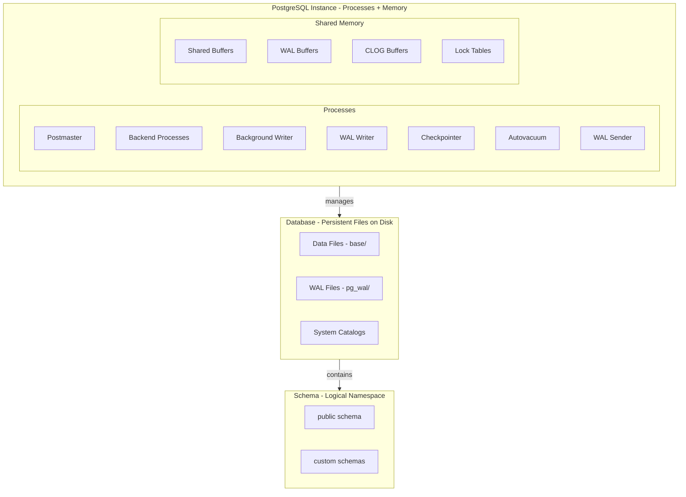

| Concept | Definition | Analogy | Persistence |
|---------|------------|---------|-------------|
| **Instance** | Running PostgreSQL processes + shared memory | The "factory" and "workers" | Disappears on restart |
| **Database** | Collection of files on disk (heap, indexes, WAL) | The "warehouse" | Persists on disk |
| **Schema** | Logical namespace within a database | "Folders" inside warehouse | Logical grouping |

**Key insight:** One Instance can manage multiple Databases. A connection is made to ONE specific database. You cannot query across databases without extensions like `postgres_fdw`.

---

## 2. Product-db Architecture

### Current Configuration (from manifests)

| Setting | Value | Source |
|---------|-------|--------|
| **Operator** | CloudNativePG | `apiVersion: postgresql.cnpg.io/v1` |
| **Instances** | 3 (1 primary + 2 replicas) | `spec.instances: 3` |
| **Replication** | Asynchronous | `syncReplicaElectionConstraint.enabled: false` |
| **shared_buffers** | 64MB | `postgresql.parameters.shared_buffers` |
| **max_connections** | 200 | `postgresql.parameters.max_connections` |
| **wal_buffers** | 16MB | `postgresql.parameters.wal_buffers` |
| **Pooler** | PgDog (1 replica) | HelmRelease `replicas: 1` |
| **Pool Mode** | Transaction | `poolMode: transaction` |

### End-to-End Request Flow

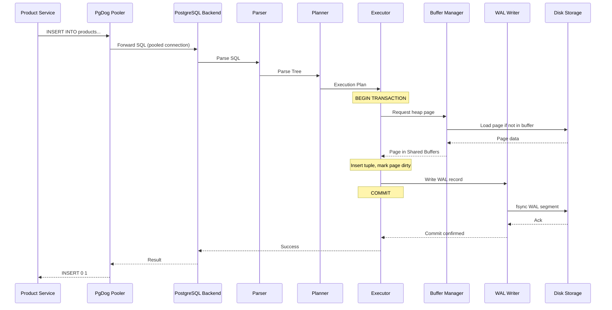

---

## 3. INSERT/UPDATE/DELETE Workflow

### Step-by-Step INSERT Flow

When executing: `INSERT INTO products (name, price) VALUES ('Widget', 99.99);`

| Step | Component | Action | Data Structure | Why It Matters |
|------|-----------|--------|----------------|----------------|
| 1 | **Go Driver** | Serialize SQL, send over TCP | Network packet | Connection to pooler |
| 2 | **PgDog** | Pick pooled connection | Connection pool | Reduces connection overhead |
| 3 | **Postmaster** | Route to backend process | Process table | One backend per connection |
| 4 | **Parser** | Lexical/syntax analysis | Parse tree | Validates SQL syntax |
| 5 | **Rewriter** | Apply rules (if any) | Query tree | Handles views, rules |
| 6 | **Planner** | Generate execution plan | Plan tree | Trivial for simple INSERT |
| 7 | **Executor** | Begin transaction | Transaction state | Assigns XID |
| 8 | **Lock Manager** | Acquire RowExclusiveLock | Lock table | Prevents conflicts |
| 9 | **MVCC** | Assign xmin to tuple | Tuple header | Visibility control |
| 10 | **Buffer Manager** | Find/load heap page | Shared Buffers | May cause I/O |
| 11 | **Heap Insert** | Write tuple to page | Heap page | Mark page dirty |
| 12 | **Index Insert** | Update B-tree index(es) | Index pages | May cause page split |
| 13 | **WAL Writer** | Write WAL record | WAL buffer | Change log for recovery |
| 14 | **Commit** | fsync WAL to disk | WAL segment file | Durability guarantee |
| 15 | **Response** | Return success | Result packet | Client sees success |

### UPDATE Flow (Key Differences)

UPDATE in PostgreSQL does NOT modify tuples in-place. Instead:

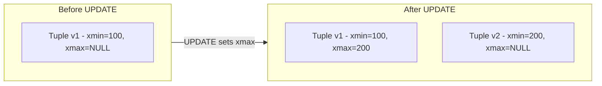

| Step | INSERT | UPDATE |
|------|--------|--------|
| Old tuple | N/A | Set `xmax` to current XID (marks as "deleted") |
| New tuple | Create with `xmin` | Create with `xmin`, new values |
| Index | Insert new entry | Insert new entry (old entry becomes dead) |
| Dead tuples | None | Old tuple becomes dead (needs vacuum) |

**HOT (Heap-Only Tuple) Optimization:** If the UPDATE doesn't change indexed columns AND there's space in the same page, PostgreSQL can avoid creating a new index entry. This significantly reduces bloat.

### DELETE Flow (MVCC Semantics)

DELETE in PostgreSQL is usually a **logical delete**, not a physical removal at commit time:

- The tuple remains in the heap page
- PostgreSQL sets `xmax` to the deleting transaction ID
- The tuple becomes **dead** after commit (not visible to new snapshots)
- Space is reclaimed later by **VACUUM**

Conceptual tuple lifecycle:

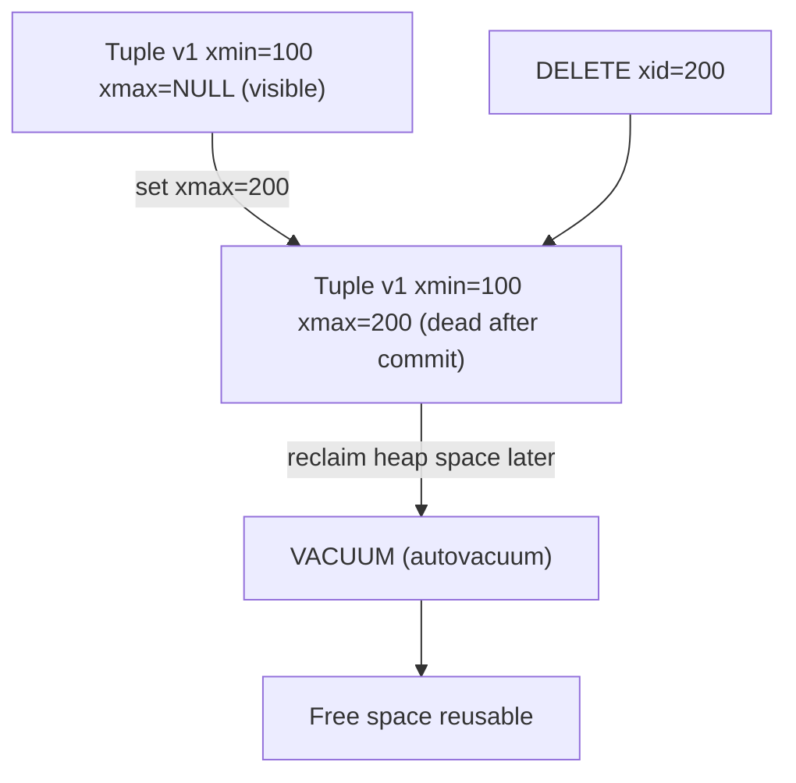

Step-by-step for: `DELETE FROM products WHERE id = 42;`

| Step | Component | Action | Data Structure | Why It Matters |
|------|-----------|--------|----------------|----------------|
| 1 | **Parser/Planner** | Plan DELETE (often Index Scan on PK) | Plan tree | Decides which tuples to target |
| 2 | **Lock Manager** | Acquire RowExclusiveLock on relation | Lock table | Prevents conflicting schema changes |
| 3 | **Executor** | Locate tuple TID | Index + heap | Index points to heap tuple location |
| 4 | **MVCC** | Mark tuple deleted by setting `xmax` | Tuple header | Visibility control; readers keep working |
| 5 | **Buffer Manager** | Modify heap page in Shared Buffers | Shared Buffers | Page becomes dirty |
| 6 | **Index maintenance** | Usually no immediate index removal | Index pages | Index entries may still exist until cleanup |
| 7 | **WAL** | Write WAL record for heap delete | WAL buffers | Required for crash recovery + replication |
| 8 | **Commit** | fsync WAL commit record | WAL segment | Client-visible durability point |
| 9 | **VACUUM** | Remove dead tuples, cleanup indexes | Heap + indexes | Prevents bloat; makes space reusable |

Why DELETE is “the vacuum teacher”:

- Heavy DELETE workloads create many dead tuples and dead index entries
- Without vacuum, table size grows and queries slow down (bloat)
- Vacuum behavior also impacts **replica lag** and **recovery conflicts**

### TRUNCATE vs DELETE (Contrast)

TRUNCATE is not “DELETE but faster”. It is a different operation with different guarantees and tradeoffs.

| Aspect | DELETE | TRUNCATE |
|--------|--------|----------|
| Granularity | Row-by-row (supports WHERE) | Whole table (no WHERE) |
| MVCC behavior | Sets `xmax` per tuple; creates dead tuples | Does not create per-row dead tuples |
| Lock level | RowExclusiveLock (plus row locks) | AccessExclusiveLock (blocks reads/writes) |
| WAL | WAL records for deleted tuples | WAL record for truncate (metadata + storage) |
| Space reclaim | Requires VACUUM for cleanup | Storage is released/reset quickly |
| Triggers | Fires row-level triggers | Does not fire row-level triggers (statement-level only) |
| Foreign keys | Can cascade row deletes | Requires CASCADE option; otherwise blocked by FKs |
| Replication impact | Streams many row changes | Streams truncate event; replicas apply truncate |
| Use case | Delete subset safely, keep concurrency | Fast “reset table” (staging/temp data) |

Practical mental model:

- **DELETE**: “mark tuples dead now; clean up later”
- **TRUNCATE**: “throw away table storage now; requires strong lock”

---

## 4. Shared Buffers and Buffer Manager

### What is Shared Buffers?

`shared_buffers` is the dedicated RAM that PostgreSQL allocates at startup for caching data pages. It's the **primary cache** between disk and queries.

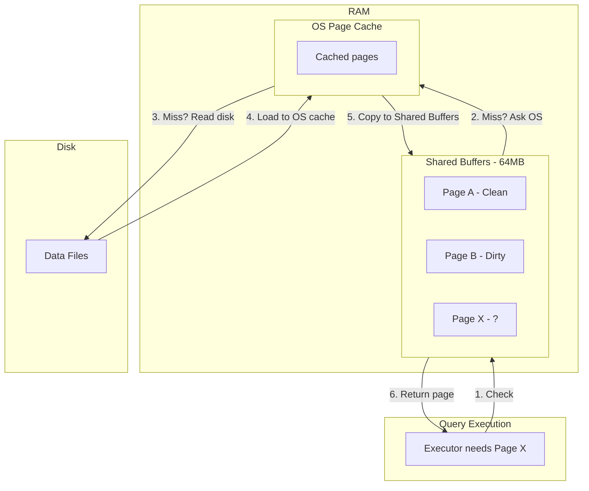

### Buffer States

| State | Description | What Happens |
|-------|-------------|--------------|
| **Clean** | Page matches disk | Can be evicted immediately |
| **Dirty** | Page modified, not yet on disk | Must be written before eviction |
| **Pinned** | Currently in use by a query | Cannot be evicted |

### Why 25-40% of RAM?

PostgreSQL uses **double buffering**:

1. **Shared Buffers**: PostgreSQL's dedicated cache
2. **OS Page Cache**: Operating system's file cache

If you set `shared_buffers` to 90% of RAM, the OS has no space for its cache. Every buffer miss goes straight to disk (slow).

**Recommendation for product-db:**
- Current: `shared_buffers: 64MB` (development setting)
- Production: 25-40% of available RAM (e.g., 2GB for an 8GB VM)

### Buffer Manager Operations

| Operation | Description | When It Happens |
|-----------|-------------|-----------------|
| **Buffer Hit** | Page found in Shared Buffers | Fastest path |
| **Buffer Miss** | Page not in buffers, load from OS/disk | Causes latency |
| **Buffer Eviction** | Remove page to make room | When buffers full |
| **Dirty Page Flush** | Write dirty page to disk | BGWriter or Checkpoint |

---

## 5. WAL (Write-Ahead Log)

### What is WAL?

The Write-Ahead Log is PostgreSQL's mechanism for **durability** and **crash recovery**. The rule is simple: **write the log before the data**.

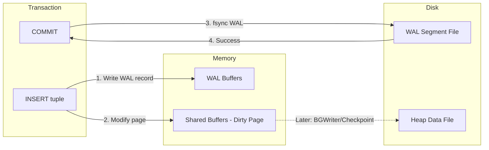

### WAL Record Structure

Each WAL record contains:
- **LSN (Log Sequence Number)**: Unique position in WAL stream
- **XID**: Transaction ID
- **Resource Manager**: Which subsystem (heap, btree, etc.)
- **Data**: The actual change (before/after images)

### WAL vs Data Files: The Key Insight

| Aspect | WAL Files | Data Files |
|--------|-----------|------------|
| **Write pattern** | Sequential (fast) | Random (slow) |
| **When written** | At COMMIT | Eventually (async) |
| **Purpose** | Durability, replication | Actual data storage |
| **Recovery role** | Replay to reconstruct | Target of replay |

### Synchronous vs Asynchronous Commit

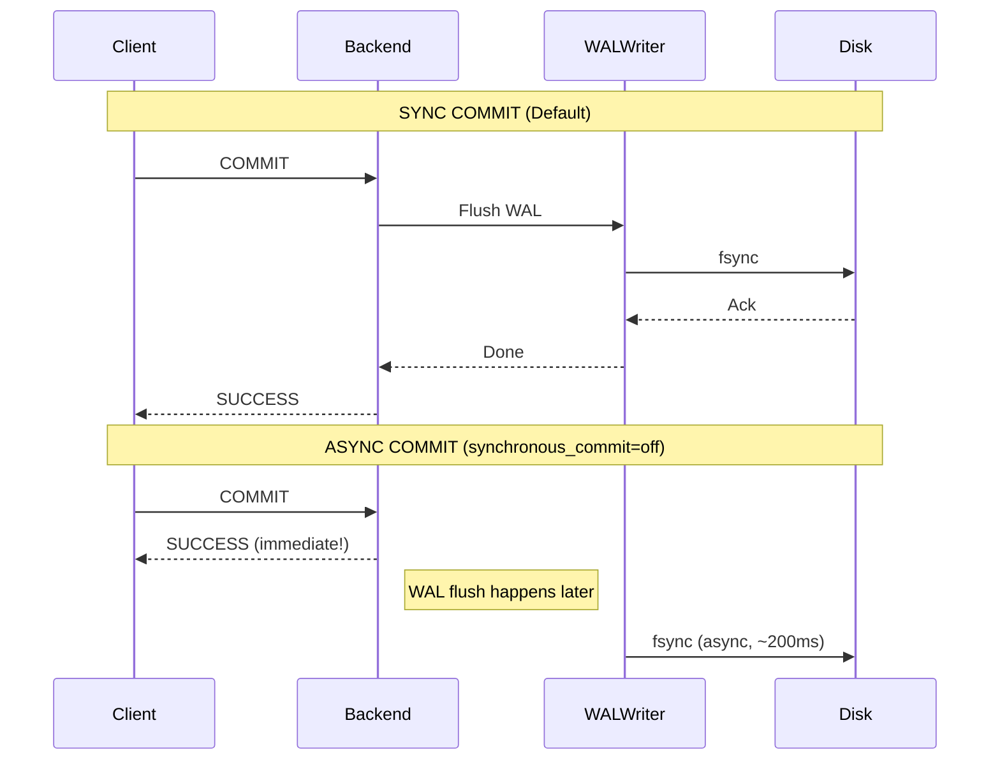

**product-db setting:** Uses default sync commit locally, but async replication to replicas (data could be lost on primary crash before WAL reaches replicas).

### Background Processes for WAL/Data

| Process | Role | When It Runs |
|---------|------|--------------|
| **WAL Writer** | Flushes WAL buffers to disk | Continuously, triggered by commits |
| **Background Writer** | Flushes dirty pages from Shared Buffers | Continuously, gradual |
| **Checkpointer** | Forces ALL dirty pages to disk | Periodically (checkpoint_timeout) |

---

## 6. Read Path and Query Execution

### SELECT Query Flow

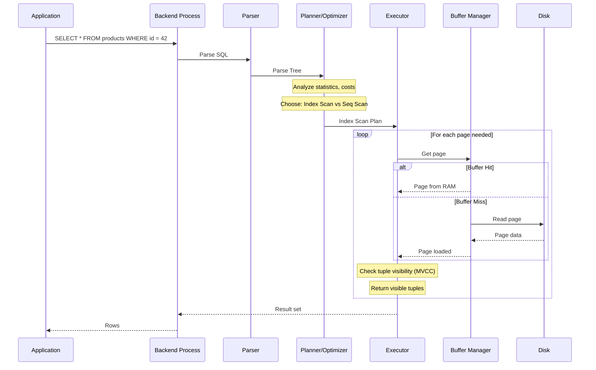

### Executor Operators

| Operator | Description | When Used |
|----------|-------------|-----------|
| **Seq Scan** | Read entire table | No useful index, small table |
| **Index Scan** | Use B-tree to find rows | Selective queries (few rows) |
| **Bitmap Heap Scan** | Build bitmap from index, then fetch | Medium selectivity |
| **Index Only Scan** | Return data from index alone | Covered queries |

### Cost Estimation: Why `random_page_cost` Matters

The planner uses cost constants to estimate query cost:

| Parameter | Default | SSD Value | Meaning |
|-----------|---------|-----------|---------|
| `seq_page_cost` | 1.0 | 1.0 | Cost of sequential page read |
| `random_page_cost` | 4.0 | 1.1-2.0 | Cost of random page read |

**product-db setting:** `random_page_cost: 4.0` (HDD default) - Should be lowered to 1.1-2.0 for SSD storage.

**Impact:** Higher `random_page_cost` makes the planner prefer sequential scans over index scans. On SSDs, random I/O is nearly as fast as sequential, so lower this value.

---

## 7. MVCC and Transaction Isolation

### What is MVCC?

Multi-Version Concurrency Control allows readers and writers to not block each other by maintaining multiple versions of tuples.

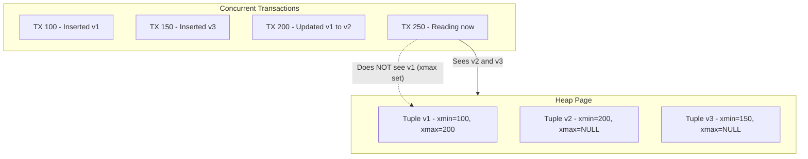

### Tuple Header Fields

| Field | Purpose | Example |
|-------|---------|---------|
| **xmin** | XID that created this tuple | 100 |
| **xmax** | XID that deleted/updated this tuple | 200 (or NULL if live) |
| **ctid** | Physical location (page, offset) | (0, 1) |
| **infomask** | Status bits (committed, etc.) | Various flags |

### Visibility Rules (Simplified)

A tuple is visible to transaction T if:
1. `xmin` is committed AND `xmin` < T's snapshot
2. `xmax` is NULL OR `xmax` is not committed OR `xmax` > T's snapshot

### Transaction Isolation Levels

| Level | Dirty Read | Non-Repeatable Read | Phantom Read | PostgreSQL Implementation |
|-------|------------|---------------------|--------------|---------------------------|
| Read Uncommitted | No* | Yes | Yes | Same as Read Committed |
| **Read Committed** | No | Yes | Yes | Default, snapshot per statement |
| Repeatable Read | No | No | No* | Snapshot at transaction start |
| Serializable | No | No | No | Predicate locking |

*PostgreSQL's Read Uncommitted is actually Read Committed. Serializable prevents phantoms via SSI.

### ACID Mapping

| Property | How PostgreSQL Implements It |
|----------|------------------------------|
| **Atomicity** | WAL + transaction commit record (all or nothing) |
| **Consistency** | Constraints, triggers, foreign keys |
| **Isolation** | MVCC + locks (readers don't block writers) |
| **Durability** | WAL fsync on commit (survives crash) |

---

## 8. Storage: Files and Pages

### On-Disk Layout

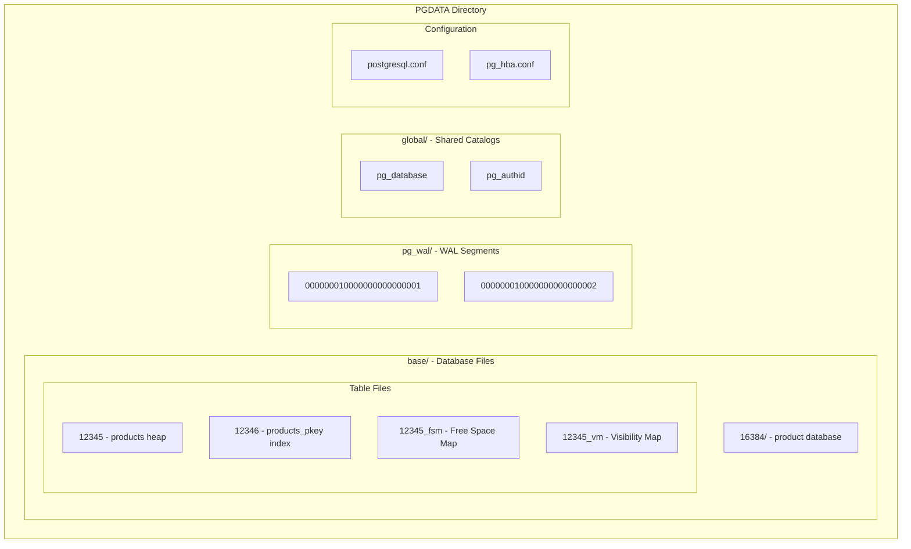

### Page Structure (8KB)

Every data file is divided into 8KB pages:

```
+------------------+
| Page Header      | 24 bytes - LSN, checksum, flags
+------------------+
| Item Pointers    | Array of (offset, length) pairs
| (line pointers)  | 
+------------------+
|                  |
| Free Space       |
|                  |
+------------------+
| Tuple Data       | Actual row data (grows from bottom)
+------------------+
| Special Space    | Index-specific data (for index pages)
+------------------+
```

### File Types

| File | Extension | Purpose |
|------|-----------|---------|
| **Heap** | (none) | Main table data |
| **Index** | (none) | B-tree, hash, etc. |
| **FSM** | `_fsm` | Free Space Map - tracks free space per page |
| **VM** | `_vm` | Visibility Map - tracks all-visible pages |
| **TOAST** | `_toast` | Large values stored separately |
| **WAL** | pg_wal/ | Write-ahead log segments (16MB each) |

### TOAST (The Oversized-Attribute Storage Technique)

When a row is too large for a single page:

1. PostgreSQL compresses the value
2. If still too large, stores in a separate TOAST table
3. Main table stores a pointer to TOAST

---

## 9. Autovacuum and Bloat Control

### Why Vacuum Exists

MVCC creates dead tuples (old versions). Without cleanup:
- Tables grow indefinitely (bloat)
- Index entries point to dead tuples
- Transaction ID wraparound can occur

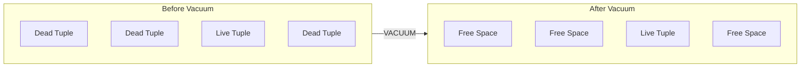

### Autovacuum Process

| Setting | Default | Meaning |
|---------|---------|---------|
| `autovacuum_vacuum_threshold` | 50 | Min dead tuples before vacuum |
| `autovacuum_vacuum_scale_factor` | 0.2 | Fraction of table that must be dead |
| `autovacuum_analyze_threshold` | 50 | Min changes before analyze |
| `autovacuum_analyze_scale_factor` | 0.1 | Fraction of table changed |

**Trigger formula:** Vacuum when dead tuples > threshold + (scale_factor * table_size)

### Transaction ID Wraparound

PostgreSQL uses 32-bit transaction IDs. After ~2 billion transactions, IDs wrap around. To prevent "XID in the future" visibility errors, vacuum must **freeze** old tuples.

| Concept | Description |
|---------|-------------|
| **Freeze** | Mark tuple as "visible to all" (no longer needs XID check) |
| **autovacuum_freeze_max_age** | Force vacuum after this many XIDs (default: 200M) |
| **Emergency autovacuum** | Runs even if turned off, to prevent wraparound |

### Common Pitfalls

| Problem | Cause | Solution |
|---------|-------|----------|
| **Table bloat** | Dead tuples accumulate | Tune autovacuum, reduce long transactions |
| **Autovacuum not keeping up** | High write rate | Increase `autovacuum_vacuum_cost_limit` |
| **Long-running transactions** | Block vacuum from cleaning | Set `idle_in_transaction_session_timeout` |
| **Replica lag during vacuum** | Recovery conflicts | Tune `max_standby_streaming_delay` |

---

## 10. Streaming Replication

### How Streaming Replication Works

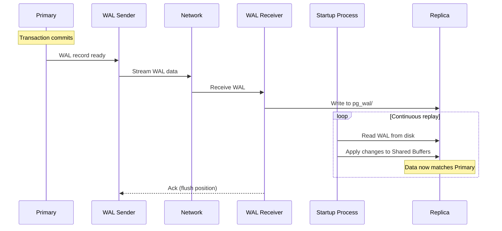

### Key Components

| Component | Location | Role |
|-----------|----------|------|
| **WAL Sender** | Primary | Streams WAL to replicas |
| **WAL Receiver** | Replica | Receives WAL, writes to disk |
| **Startup Process** | Replica | Replays WAL (the "recovery" engine) |
| **Replication Slot** | Primary | Tracks replica progress, prevents WAL deletion |

### Async vs Sync Replication

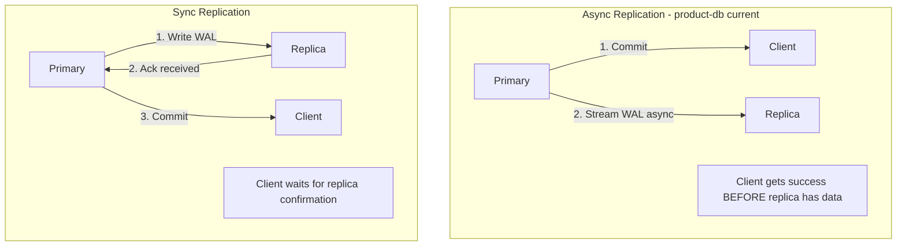

| Aspect | Async (product-db) | Sync |
|--------|-------------------|------|
| **Latency** | Lower (no replica wait) | Higher (network round-trip) |
| **Data loss risk** | Possible (uncommitted on replica) | Zero (replica has data) |
| **Availability** | Higher (replica failure doesn't block) | Lower (replica must be up) |

### Replication Lag

Lag = time between commit on primary and replay on replica.

**Causes:**
- Network latency
- Replica disk I/O slower than primary
- Heavy read queries on replica (recovery conflicts)

**Monitoring:**
```sql
-- On primary
SELECT client_addr, state, sent_lsn, write_lsn, flush_lsn, replay_lsn,
       (sent_lsn - replay_lsn) AS lag_bytes
FROM pg_stat_replication;
```

### Recovery Conflicts

When a replica is replaying WAL while serving read queries, conflicts can occur:

| Conflict Type | Cause | Resolution |
|---------------|-------|------------|
| **Lock conflict** | WAL needs exclusive lock, query holds shared | Cancel query or wait |
| **Snapshot conflict** | WAL vacuums rows query needs | Cancel query |
| **Buffer pin conflict** | WAL needs to modify pinned buffer | Wait |

**Settings:**
- `max_standby_streaming_delay`: How long to wait before canceling queries
- `hot_standby_feedback`: Replica tells primary about its oldest snapshot (prevents vacuum of needed rows)

---

## 11. CNPG vs EC2/VM Mapping

### What CNPG Automates

| Aspect | CNPG (Kubernetes) | EC2/VM (Manual) |
|--------|-------------------|-----------------|
| **Installation** | Container image | `apt install postgresql` or compile |
| **Configuration** | `spec.postgresql.parameters` | Edit `postgresql.conf` |
| **Authentication** | `spec.bootstrap.initdb.secret` | Edit `pg_hba.conf` |
| **Replication setup** | `spec.instances > 1` | Configure `primary_conninfo`, slots manually |
| **Failover** | Automatic (Patroni-like) | Manual or use Patroni/repmgr |
| **Service discovery** | K8s Services (`-rw`, `-r`, `-ro`) | DNS/HAProxy/PgBouncer |
| **Storage** | PVC (auto-provisioned) | EBS volumes, mount points |
| **Backup** | `spec.backup` (Barman) | Manual pg_basebackup + WAL archiving |

### EC2/VM Architecture

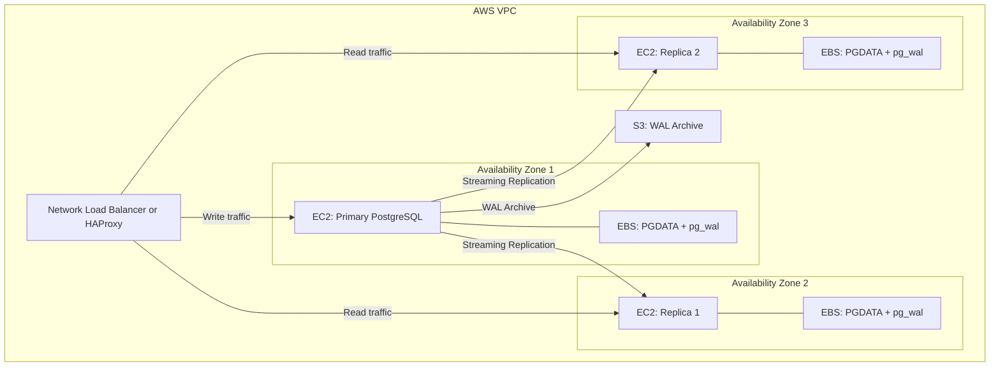

### EC2 Setup Checklist

| Step | Command/Action |
|------|----------------|
| **Install PostgreSQL** | `sudo apt install postgresql-17` |
| **Configure listen** | `postgresql.conf`: `listen_addresses = '*'` |
| **Configure WAL** | `wal_level = replica`, `max_wal_senders = 10` |
| **Create replication user** | `CREATE ROLE replicator REPLICATION LOGIN PASSWORD '...'` |
| **Configure pg_hba.conf** | `host replication replicator 10.0.0.0/8 scram-sha-256` |
| **On replica: base backup** | `pg_basebackup -h primary -D /var/lib/postgresql/17/main -U replicator -P -R` |
| **On replica: start** | The `-R` flag creates `standby.signal` and `primary_conninfo` |

### Process Model Comparison

| Process | CNPG | EC2 |
|---------|------|-----|
| **Postmaster** | Runs in container | Managed by systemd |
| **Backends** | Same | Same |
| **Autovacuum** | Same | Same |
| **WAL Sender** | Same (CNPG configures) | Manual config |
| **Orchestration** | CNPG operator | Patroni/repmgr or manual |

---

## 12. Backup, Restore, and PITR

### Backup Types

| Type | Method | Recovery Speed | Storage |
|------|--------|----------------|---------|
| **Logical** | `pg_dump` | Slow (replay SQL) | Small (compressed) |
| **Physical** | `pg_basebackup` | Fast (copy files) | Large (full cluster) |
| **Continuous** | Base backup + WAL archive | Any point in time | Base + WAL segments |

### Point-in-Time Recovery (PITR)

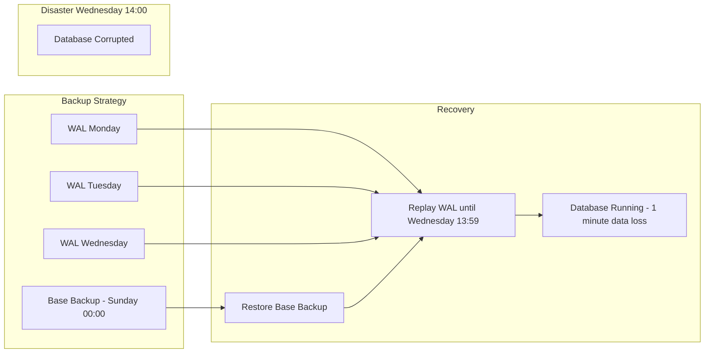

### product-db Status

**Current:** Backup is NOT configured in the product-db CNPG manifest.

**To add (CNPG example):**
```yaml
spec:
  backup:
    barmanObjectStore:
      destinationPath: s3://my-bucket/product-db
      s3Credentials:
        accessKeyId:
          name: s3-creds
          key: ACCESS_KEY_ID
        secretAccessKey:
          name: s3-creds
          key: SECRET_ACCESS_KEY
    retentionPolicy: "30d"
```

---

## 13. Scaling and Sharding

### Scaling Reads

| Strategy | How | Complexity | product-db Status |
|----------|-----|------------|-------------------|
| **Read replicas** | Route SELECTs to replicas | Low | **Available** (2 replicas exist) |
| **PgDog read routing** | Configure PgDog to use `-r` service | Low | **Not configured** (routes to RW only) |
| **Connection pooling** | Reduce connection overhead | Low | **Configured** (PgDog) |

### Scaling Writes

| Strategy | How | Complexity |
|----------|-----|------------|
| **Vertical scaling** | Bigger instance | Low |
| **Table partitioning** | Split table by range/list/hash | Medium |
| **Batch writes** | Combine multiple INSERTs | Low |
| **Avoid hot spots** | Distribute writes across partitions | Medium |

### Sharding

**Status:** NOT configured in product-db. Sharding is complex and usually avoided unless necessary.

| Option | Description | Complexity |
|--------|-------------|------------|
| **Application sharding** | App decides which shard | High (app changes) |
| **PgDog sharding** | Proxy routes by shard key | Medium |
| **Citus** | PostgreSQL extension for distributed tables | Medium-High |
| **Foreign Data Wrappers** | Query across PostgreSQL instances | Medium |

**When to shard:**
- Single instance can't handle write load
- Data too large for single disk
- Regulatory requirements (data locality)

**When NOT to shard:**
- Reads are the bottleneck (use replicas)
- Can scale vertically
- Joins across shards are common

---

## Summary: Key Takeaways

1. **PostgreSQL = Instance + Database**: Instance is processes/memory (ephemeral), Database is files (persistent).

2. **Write path**: SQL → Parser → Planner → Executor → WAL Buffer → Shared Buffers (dirty) → COMMIT → WAL fsync → Success. Data files updated later.

3. **Read path**: Check Shared Buffers → OS Cache → Disk. Tune `shared_buffers` to 25-40% of RAM.

4. **WAL is everything**: Durability, replication, PITR all depend on WAL. Understand WAL to understand PostgreSQL.

5. **MVCC = no read/write blocking**: Old versions persist until vacuum. Long transactions = bloat.

6. **Streaming replication**: WAL Sender → WAL Receiver → Startup Process replay. Async = fast but possible data loss. Sync = safe but slower.

7. **CNPG abstracts operations**: Same PostgreSQL engine, different operational model. Understanding internals helps debug both.

---

## Related Documentation

- **Cluster Topology**: [`kubernetes/infra/configs/databases/clusters/README.md`](../../kubernetes/infra/configs/databases/clusters/README.md)
- **Database Architecture**: [`docs/databases/DATABASE.md`](./DATABASE.md)
- **Performance Tuning Research**: [`specs/active/postgresql-performance-tuning/research.md`](../../specs/active/postgresql-performance-tuning/research.md)
- **PostgreSQL Deep Dive Notes**: [`specs/active/postgresql-deep-dive/internals.md`](../../specs/active/postgresql-deep-dive/internals.md)
