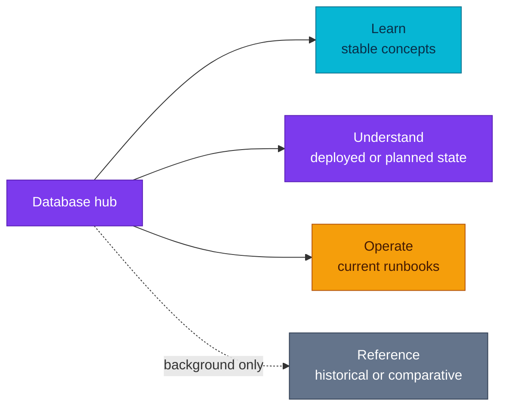

# Databases

Learn PostgreSQL, understand the database platform deployed by this repository,
or find the right recovery procedure without mixing those three concerns.

| Item | Current state |
|---|---|
| **Operator** | CloudNativePG 1.30.0 |
| **PostgreSQL** | 18.1 |
| **Operational clusters** | `platform-db`, `product-db` |
| **DR cluster** | `product-db-replica` |
| **Poolers** | CNPG PgBouncer for `platform-db`; PgDog for `product-db` |
| **Backup** | Barman Cloud plugin to RustFS-compatible object storage |
| **Historical operator** | Zalando Postgres Operator — reference only, not deployed |

## Choose a path

### Learn PostgreSQL

Use this vendor-neutral path for PostgreSQL internals. Platform products,
manifests, and cluster names are intentionally excluded.

1. [Fundamentals overview](./fundamentals/README.md)
2. [Process and memory](./fundamentals/process-and-memory.md)
3. [Storage and WAL](./fundamentals/storage-and-wal.md)
4. [MVCC, locking, and vacuum](./fundamentals/mvcc-locking-and-vacuum.md)
5. [Query planning and execution](./fundamentals/query-planning-and-execution.md)
6. [Replication](./fundamentals/replication.md)

### Understand this homelab

These pages describe current or explicitly planned platform state.

- [Database architecture and integration](./architecture.md)
- [CloudNativePG](./cloudnativepg.md)
- [Backup policy](./backup-policy.md)
- [HA and disaster recovery](./disaster-recovery.md)
- [RPO/RTO targets and evidence](./reliability-targets.md)
- [Poolers](./poolers.md)
- [Extensions](./extensions.md)
- [Declarative database and role management](./declarative-role-management.md)
- [Cross-region DR roadmap](./cross-region-dr.md) — **planned, not
  deployed**

### Operate and recover

Start with [Emergency recovery](./runbooks/emergency-recovery.md) when the failure
mode is not yet known. Task-specific procedures live in the
[runbook index](./runbooks/README.md), including backup/restore, DR replica
bootstrap, pooler operations, credential rotation, and adding a service
database.

### Reference and history

These pages support design study and historical review. They are not current
operating procedures.

- [Operator comparison](./reference/operator-comparison.md)
- [Backup tooling comparison](./reference/backup-tooling-comparison.md)
- [Zalando Postgres Operator](./reference/zalando/operator.md) — **historical,
  not deployed**
- [Further reading](./reference/further-reading.md)
- Historical Zalando procedures are listed separately in the
  [runbook index](./runbooks/README.md).

## Architecture

This diagram answers only how readers should navigate the documentation; the
deployed database topology belongs to the architecture guide.

## Document ownership

| Fact or concern | Canonical owner |
|---|---|
| Cluster inventory, namespaces, PostgreSQL/operator versions | `architecture.md` |
| CloudNativePG control plane and operand behavior | `cloudnativepg.md` |
| Backup schedules, retention, and object paths | `backup-policy.md` |
| Recovery paths and DR topology | `disaster-recovery.md` |
| RPO/RTO objectives and measured evidence | `reliability-targets.md` |
| Pooler deployment and connection ownership | `poolers.md` |
| Installed and allowed extension model | `extensions.md` |
| Database, role, and credential reconciliation | `declarative-role-management.md` |
| Commands used during operations | [`runbooks/`](./runbooks/README.md) |
| PostgreSQL internal mechanics | `fundamentals/` |

Architecture decisions remain in [RFC and ADR records](../proposals/README.md);
this area documents the resulting platform and its operation.

## References

- [PostgreSQL documentation](https://www.postgresql.org/docs/current/)
- [CloudNativePG documentation](https://cloudnative-pg.io/documentation/current/)
- [PgDog documentation](https://docs.pgdog.dev/)

_Last updated: 2026-08-31._
