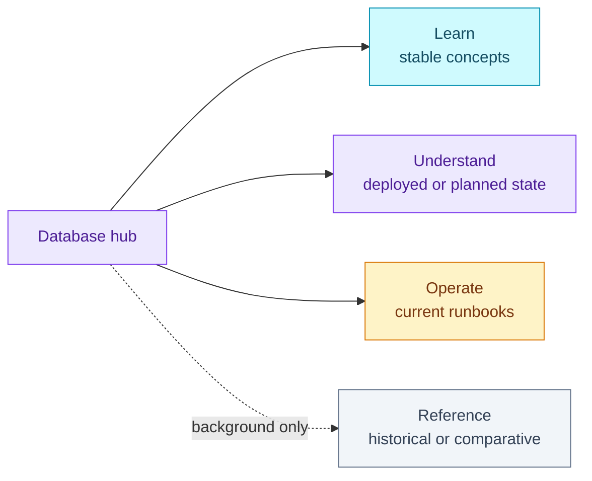

# Databases

Learn PostgreSQL, understand the database platform deployed by this repository,
or find the right recovery procedure without mixing those three concerns.

| Item | Current state |
|---|---|
| **Operator** | CloudNativePG 1.30.0 |
| **PostgreSQL** | 18.1 |
| **Operational clusters** | `platform-db`, `product-db` |
| **DR cluster** | `product-db-replica` |
| **Poolers** | CNPG PgBouncer for `platform-db`; PgDog for `product-db` |
| **Backup** | Barman Cloud plugin to RustFS-compatible object storage |
| **Historical operator** | Zalando Postgres Operator — reference only, not deployed |

## Choose a path

### Learn PostgreSQL

The [PostgreSQL internals learning path](./fundamentals/README.md) is an
explanation-first curriculum grounded in the deployed CNPG clusters
([#1137](https://github.com/duynhlab/homelab/issues/1137)): fourteen chapters,
each with one read-only evidence lab. Its README owns the curriculum order,
evidence vocabulary, glossary, and safety boundary.

1. [Learning path overview](./fundamentals/README.md)
2. [Processes and memory](./fundamentals/01-processes-and-memory.md)
3. [Storage, pages, and tuples](./fundamentals/02-storage-pages-and-tuples.md)
4. [Buffer manager and I/O](./fundamentals/03-buffer-manager-and-io.md)
5. [WAL and checkpoints](./fundamentals/04-wal-and-checkpoints.md)
6. [MVCC and snapshots](./fundamentals/05-mvcc-and-snapshots.md)
7. [Locking and wait events](./fundamentals/06-locking-and-wait-events.md)
8. [Vacuum and freezing](./fundamentals/07-vacuum-and-freezing.md)
9. [Query processing](./fundamentals/08-query-processing.md)
10. [Indexes and access methods](./fundamentals/09-indexes-and-access-methods.md)
11. [Schema and integrity](./fundamentals/10-schema-and-integrity.md)
12. [Partitioning and retention](./fundamentals/11-partitioning-and-retention.md)
13. [Replication and slots](./fundamentals/12-replication-and-slots.md)
14. [Backup and PITR](./fundamentals/13-backup-and-pitr.md)
15. [Monitoring and capacity](./fundamentals/14-monitoring-and-capacity.md)

### Understand this homelab

These pages describe current or explicitly planned platform state.

- [Database architecture and integration](./architecture.md)
- [Observability and troubleshooting](./observability-and-troubleshooting.md)
- [CloudNativePG](./cloudnativepg.md)
- [Backup policy](./backup-policy.md)
- [HA and disaster recovery](./disaster-recovery.md)
- [RPO/RTO targets and evidence](./reliability-targets.md)
- [Poolers](./poolers.md)
- [Extensions](./extensions.md)
- [Declarative database and role management](./declarative-role-management.md)
- [Database authorization (owner / migrator / runtime)](./authorization.md) — **conventions accepted, not deployed** (RFC-0029)
- [Cross-region DR roadmap](./cross-region-dr.md) — **planned, not
  deployed**

### Operate and recover

Start with [Emergency recovery](./runbooks/emergency-recovery.md) when the failure
mode is not yet known. Task-specific procedures live in the
[runbook index](./runbooks/README.md), including backup/restore, DR replica
bootstrap, pooler operations, credential rotation, and adding a service
database.

### Reference and history

These pages support design study and historical review. They are not current
operating procedures.

- [Operator comparison](./reference/operator-comparison.md)
- [Backup tooling comparison](./reference/backup-tooling-comparison.md)
- [Zalando Postgres Operator](./reference/zalando/operator.md) — **historical,
  not deployed**
- [Further reading](./reference/further-reading.md)
- Historical Zalando procedures are listed separately in the
  [runbook index](./runbooks/README.md).

## Architecture

This diagram answers only how readers should navigate the documentation; the
deployed database topology belongs to the architecture guide.

```mermaid
flowchart LR
    Hub["Database hub"]
    Learn["Learn<br/>stable concepts"]
    Platform["Understand<br/>deployed or planned state"]
    Operate["Operate<br/>current runbooks"]
    Reference["Reference<br/>historical or comparative"]

    Hub --> Learn
    Hub --> Platform
    Hub --> Operate
    Hub -. "background only" .-> Reference

    classDef platform fill:#ede9fe,color:#4c1d95,stroke:#7c3aed;
    classDef service fill:#cffafe,color:#164e63,stroke:#0891b2;
    classDef worker fill:#fef3c7,color:#78350f,stroke:#d97706;
    classDef external fill:#f1f5f9,color:#334155,stroke:#64748b;
    class Hub platform;
    class Learn service;
    class Platform platform;
    class Operate worker;
    class Reference external;
```

## Document ownership

| Fact or concern | Canonical owner |
|---|---|
| Cluster inventory, namespaces, PostgreSQL/operator versions | `architecture.md` |
| CloudNativePG control plane and operand behavior | `cloudnativepg.md` |
| Backup schedules, retention, and object paths | `backup-policy.md` |
| Recovery paths and DR topology | `disaster-recovery.md` |
| RPO/RTO objectives and measured evidence | `reliability-targets.md` |
| Pooler deployment and connection ownership | `poolers.md` |
| Installed and allowed extension model | `extensions.md` |
| Database, role, and credential reconciliation | `declarative-role-management.md` |
| Who owns objects, who migrates, who serves traffic | `authorization.md` |
| Commands used during operations | [`runbooks/`](./runbooks/README.md) |
| PostgreSQL internal mechanics | `fundamentals/` |
| Symptom-to-signal troubleshooting | `observability-and-troubleshooting.md` |

Architecture decisions remain in [RFC and ADR records](../proposals/README.md);
this area documents the resulting platform and its operation.

## References

- [PostgreSQL documentation](https://www.postgresql.org/docs/current/)
- [CloudNativePG documentation](https://cloudnative-pg.io/documentation/current/)
- [PgDog documentation](https://docs.pgdog.dev/)

_Last updated: 2026-09-29 — the Learn path lists the fourteen authored internals chapters; earlier the same day it pointed at the curriculum contract for issue #1137. Previously 2026-09-09 — added the SRE learning and symptom-first troubleshooting paths._
